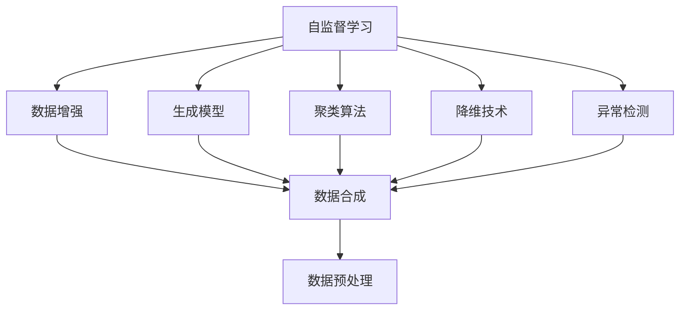
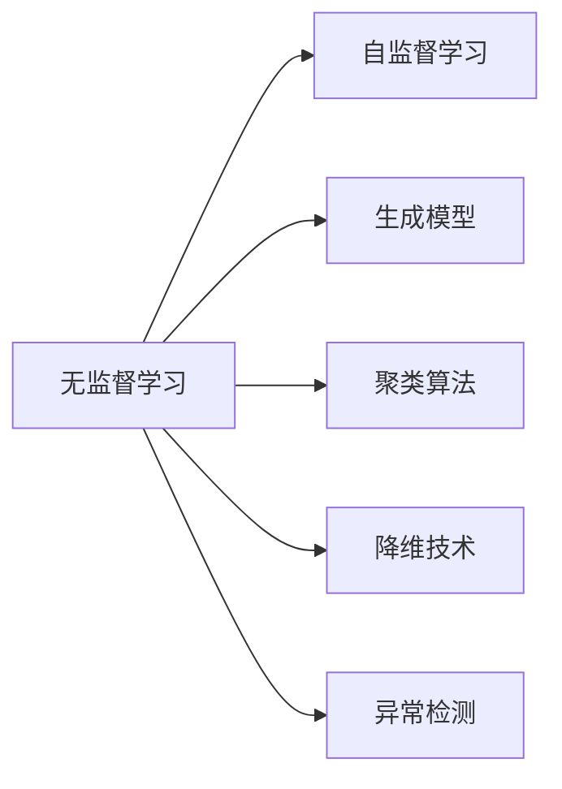
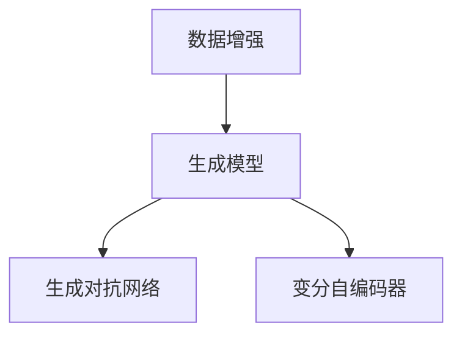
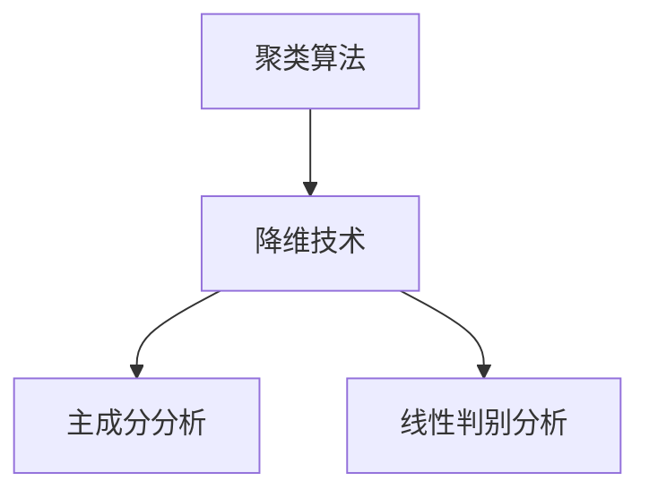
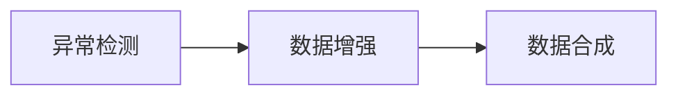
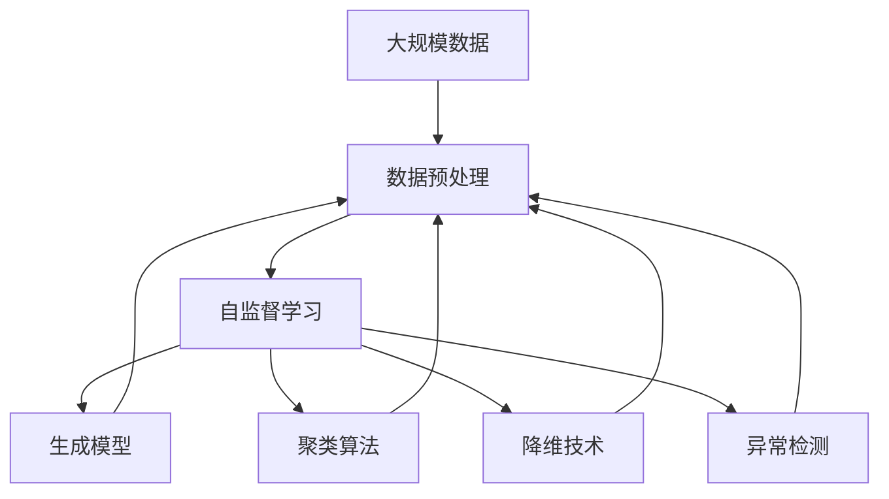

                 

# 无监督学习 (Unsupervised Learning)

> 关键词：无监督学习, 自监督学习, 生成模型, 聚类算法, 降维技术, 异常检测

## 1. 背景介绍

### 1.1 问题由来
无监督学习（Unsupervised Learning）是机器学习领域的重要分支之一。与有监督学习（Supervised Learning）和强化学习（Reinforcement Learning）不同，无监督学习主要关注如何从无标签数据中提取有价值的信息和模式。在实际应用中，无监督学习广泛应用于数据预处理、特征提取、聚类分析等领域，尤其在缺少标注数据的场景下，无监督学习展现了其不可替代的价值。

近年来，深度学习技术的飞速发展，特别是神经网络结构的创新和训练算法的多样化，极大地推动了无监督学习技术的发展。通过深度神经网络，无监督学习可以处理更为复杂的非线性关系，发现数据中的潜在结构和模式，具有显著的鲁棒性和泛化能力。

### 1.2 问题核心关键点
无监督学习主要通过以下核心算法实现：

1. **自监督学习（Self-supervised Learning）**：利用数据的某些属性和结构信息，构造有监督的训练任务，从而无需人工标注数据即可进行训练。常见的自监督任务包括预测数据中的缺失值、重构输入数据、预测数据顺序等。

2. **生成模型（Generative Models）**：通过学习数据的生成分布，生成新的数据样本来进行数据增强或数据合成。生成模型如变分自编码器（VAE）、生成对抗网络（GAN）等，在图像生成、文本生成等领域取得了重要进展。

3. **聚类算法（Clustering Algorithms）**：将数据划分为若干个相似性较高的组或簇，常见聚类算法如K-Means、层次聚类、DBSCAN等。聚类算法在用户行为分析、社交网络分析等场景中具有广泛应用。

4. **降维技术（Dimensionality Reduction Techniques）**：将高维数据映射到低维空间，减少数据的复杂度，同时保留重要信息。常见的降维方法包括主成分分析（PCA）、线性判别分析（LDA）、t-SNE等。

5. **异常检测（Anomaly Detection）**：识别出数据中异常点或异常模式，常见的异常检测方法如孤立森林、LOF、One-class SVM等。异常检测在网络安全、金融风险监控等领域具有重要应用。

这些算法相互配合，构建了无监督学习的完整生态，为机器学习技术的全面发展提供了有力支撑。无监督学习不仅减少了对标注数据的依赖，还为数据挖掘和特征提取提供了新的思路和方法，使得机器学习技术的应用范围更广、效果更佳。

## 2. 核心概念与联系

### 2.1 核心概念概述

为更好地理解无监督学习的核心算法和原理，本节将介绍几个密切相关的核心概念：

- **自监督学习（Self-supervised Learning）**：通过数据的某些属性和结构信息，构造有监督的训练任务，无需人工标注数据即可进行训练。自监督学习利用数据中的隐含信息，提升模型的泛化能力和鲁棒性。

- **生成模型（Generative Models）**：通过学习数据的生成分布，生成新的数据样本来进行数据增强或数据合成。生成模型如变分自编码器（VAE）、生成对抗网络（GAN）等，在图像生成、文本生成等领域取得了重要进展。

- **聚类算法（Clustering Algorithms）**：将数据划分为若干个相似性较高的组或簇，常见聚类算法如K-Means、层次聚类、DBSCAN等。聚类算法在用户行为分析、社交网络分析等场景中具有广泛应用。

- **降维技术（Dimensionality Reduction Techniques）**：将高维数据映射到低维空间，减少数据的复杂度，同时保留重要信息。常见的降维方法包括主成分分析（PCA）、线性判别分析（LDA）、t-SNE等。

- **异常检测（Anomaly Detection）**：识别出数据中异常点或异常模式，常见的异常检测方法如孤立森林、LOF、One-class SVM等。异常检测在网络安全、金融风险监控等领域具有重要应用。

这些核心概念之间的逻辑关系可以通过以下Mermaid流程图来展示：



这个流程图展示了点自监督学习与数据增强、生成模型、聚类、降维、异常检测等算法之间的联系：

1. 自监督学习通过构造有监督的训练任务，利用数据中的隐含信息进行训练。
2. 生成模型利用生成分布生成新数据，进行数据增强和数据合成。
3. 聚类算法将数据划分为若干组或簇，发现数据中的聚类结构。
4. 降维技术将高维数据映射到低维空间，减少数据的复杂度。
5. 异常检测识别数据中的异常点或异常模式。

这些算法相互配合，共同构建了无监督学习的完整生态，为无监督学习的应用提供了有力的支持。通过理解这些核心概念，我们可以更好地把握无监督学习的原理和应用方向。

### 2.2 概念间的关系

这些核心概念之间存在着紧密的联系，形成了无监督学习的完整生态系统。下面我们通过几个Mermaid流程图来展示这些概念之间的关系。

#### 2.2.1 无监督学习的核心算法



这个流程图展示了无监督学习的基本算法：自监督学习、生成模型、聚类算法、降维技术和异常检测。

#### 2.2.2 数据增强与生成模型



这个流程图展示了数据增强和生成模型之间的联系。生成模型如GAN、VAE等，能够生成新的数据样本，用于数据增强和合成。

#### 2.2.3 聚类与降维



这个流程图展示了聚类算法和降维技术之间的联系。聚类算法如K-Means等，能够发现数据的聚类结构，而降维技术如PCA、LDA等，能够将数据映射到低维空间，减少数据的复杂度。

#### 2.2.4 异常检测与数据增强



这个流程图展示了异常检测和数据增强之间的联系。通过识别异常点，生成模型可以合成新数据，进行数据增强。

### 2.3 核心概念的整体架构

最后，我们用一个综合的流程图来展示这些核心概念在大规模数据处理中的应用：



这个综合流程图展示了从数据预处理到无监督算法的完整流程。大规模数据通过预处理后，自监督学习、生成模型、聚类算法、降维技术和异常检测等无监督算法进行处理，最终得到有价值的信息和模式。通过这些流程图，我们可以更清晰地理解无监督学习中各个核心概念的关系和作用，为后续深入讨论具体的无监督算法提供基础。

## 3. 核心算法原理 & 具体操作步骤
### 3.1 算法原理概述

无监督学习的主要目标是，从无标签数据中挖掘出潜在的模式和结构，辅助后续有监督学习或决策分析。常见的无监督学习算法包括自监督学习、生成模型、聚类算法、降维技术和异常检测等。

以生成模型为例，其核心思想是通过学习数据的生成分布，生成新的数据样本来进行数据增强或数据合成。具体而言，生成模型利用数据中的隐含信息，生成与原始数据相似的新样本，从而提高模型的泛化能力和鲁棒性。

### 3.2 算法步骤详解

以生成对抗网络（GAN）为例，其基本步骤如下：

**Step 1: 生成器和判别器设计**

- 设计生成器和判别器，生成器和判别器都是神经网络模型，通常使用卷积神经网络（CNN）或递归神经网络（RNN）等。

**Step 2: 生成器训练**

- 将噪声随机向量 $z$ 输入生成器，生成与真实数据相似的新数据样本 $x_g$。

**Step 3: 判别器训练**

- 将真实数据 $x$ 和生成数据 $x_g$ 输入判别器，判别器输出真实样本的概率，对生成样本的概率输出为0。

**Step 4: 联合训练**

- 通过交替训练生成器和判别器，使生成器能够生成越来越真实的样本，判别器能够区分真实样本和生成样本。

**Step 5: 数据增强**

- 使用训练好的生成器生成新的数据样本，用于数据增强和合成。

### 3.3 算法优缺点

无监督学习的主要优点包括：

1. 无需标注数据。无监督学习不需要标注数据，可以充分利用大规模无标签数据，挖掘数据中的潜在模式和结构。

2. 提升模型泛化能力。无监督学习通过学习数据的生成分布，生成新样本，提高模型的泛化能力和鲁棒性。

3. 算法多样性。无监督学习算法众多，适用于多种数据类型和应用场景。

4. 算法效果显著。无监督学习在图像生成、文本生成、聚类分析、降维技术等领域取得了重要进展。

无监督学习的主要缺点包括：

1. 数据要求高。无监督学习对数据的分布和结构要求较高，难以处理复杂或噪声较多的数据。

2. 难以解释。无监督学习的结果通常是黑盒模型，难以解释其内部工作机制和决策逻辑。

3. 算法复杂度较高。无监督学习算法复杂，需要大量的计算资源和时间进行训练。

4. 结果可能不具可解释性。无监督学习的结果通常是高维特征表示，难以直接解释。

尽管存在这些缺点，但无监督学习仍具有重要的应用价值，特别是在数据标注成本高昂、数据分布未知的领域，无监督学习具有不可替代的作用。

### 3.4 算法应用领域

无监督学习在多个领域中具有广泛应用，例如：

- **数据预处理**：通过数据增强、生成模型等技术，提高数据质量和多样性。

- **特征提取**：通过聚类、降维等技术，提取数据的潜在结构和特征。

- **异常检测**：通过异常检测技术，识别数据中的异常点和异常模式，用于网络安全、金融风险监控等场景。

- **图像处理**：通过生成模型、降维技术等，生成高质量的图像样本，用于图像分类、图像生成等任务。

- **自然语言处理**：通过生成模型、降维技术等，生成高质量的文本样本，用于文本分类、文本生成等任务。

- **信号处理**：通过生成模型、降维技术等，生成高质量的信号样本，用于信号分类、信号生成等任务。

## 4. 数学模型和公式 & 详细讲解 & 举例说明

### 4.1 数学模型构建

以生成对抗网络（GAN）为例，其数学模型可以表示为：

$$
\begin{aligned}
\min_{G} \max_{D} & \mathbb{E}_{x \sim p_{\text{data}}(x)} [\log D(x)] + \mathbb{E}_{z \sim p_{z}(z)} [\log (1 - D(G(z)))] \\
G(z) &= \mu(z) + \sigma(z) \\
D(x) &= \frac{1}{2} \sigma(\log p_{\text{data}}(x)) + \frac{1}{2} \log (1 - p_{\text{model}}(G(z)))
\end{aligned}
$$

其中，$G$ 为生成器，$D$ 为判别器，$p_{\text{data}}$ 为真实数据分布，$p_{\text{model}}$ 为生成模型分布，$z$ 为噪声向量，$\mu(z)$ 和 $\sigma(z)$ 为生成器和判别器的输出。

### 4.2 公式推导过程

以下我们以GAN的基本推导过程为例，展示如何通过数学模型推导出GAN的训练公式：

**Step 1: 生成器输出**

将噪声向量 $z$ 输入生成器 $G$，生成新样本 $x_g$：

$$
x_g = G(z) = \mu(z) + \sigma(z)
$$

**Step 2: 判别器输出**

将真实样本 $x$ 和生成样本 $x_g$ 输入判别器 $D$，输出真实样本的概率 $p_{D}(x)$ 和生成样本的概率 $p_{D}(x_g)$：

$$
p_{D}(x) = \frac{1}{2} \sigma(\log p_{\text{data}}(x)) + \frac{1}{2} \log (1 - p_{\text{model}}(G(z)))
$$

**Step 3: 联合训练**

联合训练生成器和判别器，使生成器能够生成越来越真实的样本，判别器能够区分真实样本和生成样本：

$$
\min_{G} \max_{D} \mathbb{E}_{x \sim p_{\text{data}}(x)} [\log D(x)] + \mathbb{E}_{z \sim p_{z}(z)} [\log (1 - D(G(z)))]
$$

其中，第一项为判别器的训练目标，第二项为生成器的训练目标。

### 4.3 案例分析与讲解

以GAN在图像生成中的应用为例，假设我们要生成高质量的猫图片。具体步骤如下：

**Step 1: 数据准备**

收集大量的猫图片，并将它们转换为张量形式。

**Step 2: 模型设计**

设计一个包含卷积层、批标准化层、残差块等组件的生成器和判别器，分别用于生成新图片和判断图片的真实性。

**Step 3: 训练过程**

交替训练生成器和判别器，逐步提高生成器的生成能力和判别器的判别能力。

**Step 4: 数据增强**

使用训练好的生成器生成高质量的猫图片，用于数据增强和合成。

## 5. 项目实践：代码实例和详细解释说明

### 5.1 开发环境搭建

在进行无监督学习实践前，我们需要准备好开发环境。以下是使用Python进行TensorFlow开发的环境配置流程：

1. 安装Anaconda：从官网下载并安装Anaconda，用于创建独立的Python环境。

2. 创建并激活虚拟环境：
```bash
conda create -n tf-env python=3.8 
conda activate tf-env
```

3. 安装TensorFlow：根据CUDA版本，从官网获取对应的安装命令。例如：
```bash
conda install tensorflow tensorflow-estimator tensorflow-hub tensorflow-addons -c tf
```

4. 安装必要的工具包：
```bash
pip install numpy pandas matplotlib scikit-learn tensorflow-hub
```

完成上述步骤后，即可在`tf-env`环境中开始无监督学习实践。

### 5.2 源代码详细实现

下面我们以生成对抗网络（GAN）为例，给出使用TensorFlow进行图像生成的PyTorch代码实现。

首先，定义生成器和判别器的结构：

```python
import tensorflow as tf

class Generator(tf.keras.Model):
    def __init__(self):
        super(Generator, self).__init__()
        self.dense1 = tf.keras.layers.Dense(256, input_shape=(100,))

        self.dense2 = tf.keras.layers.Dense(512)
        self.dense3 = tf.keras.layers.Dense(1024)

        self.dense4 = tf.keras.layers.Dense(784, activation='tanh')

    def call(self, inputs):
        x = tf.reshape(inputs, [-1, 100])
        x = tf.nn.relu(self.dense1(x))
        x = tf.nn.relu(self.dense2(x))
        x = tf.nn.relu(self.dense3(x))
        x = self.dense4(x)
        return tf.reshape(x, [-1, 28, 28, 1])

class Discriminator(tf.keras.Model):
    def __init__(self):
        super(Discriminator, self).__init__()
        self.dense1 = tf.keras.layers.Dense(256, input_shape=[28, 28, 1])

        self.dense2 = tf.keras.layers.Dense(512)
        self.dense3 = tf.keras.layers.Dense(1024)

        self.dense4 = tf.keras.layers.Dense(1)

    def call(self, inputs):
        x = tf.reshape(inputs, [-1, 784])
        x = tf.nn.relu(self.dense1(x))
        x = tf.nn.relu(self.dense2(x))
        x = tf.nn.relu(self.dense3(x))
        x = self.dense4(x)
        return x
```

接着，定义训练过程：

```python
def train_step(inputs):
    with tf.GradientTape() as gen_tape, tf.GradientTape() as disc_tape:
        gen_model.train()
        disc_model.train()
        gen_output = gen_model(inputs)
        disc_real_output = disc_model(inputs)
        disc_fake_output = disc_model(gen_output)

        gen_loss = tf.reduce_mean(tf.keras.losses.BinaryCrossentropy()(tf.ones_like(disc_real_output), disc_fake_output))
        disc_loss = tf.reduce_mean(tf.keras.losses.BinaryCrossentropy()(tf.ones_like(disc_real_output), disc_real_output) + tf.keras.losses.BinaryCrossentropy()(tf.zeros_like(disc_fake_output), disc_fake_output))

    gen_grads = gen_tape.gradient(gen_loss, gen_model.trainable_variables)
    disc_grads = disc_tape.gradient(disc_loss, disc_model.trainable_variables)

    gen_optimizer.apply_gradients(zip(gen_grads, gen_model.trainable_variables))
    disc_optimizer.apply_gradients(zip(disc_grads, disc_model.trainable_variables))

    return gen_loss, disc_loss

def train_epoch(gen_model, disc_model, data_loader, optimizer, num_epochs):
    for epoch in range(num_epochs):
        total_loss = 0.0
        for inputs in data_loader:
            gen_loss, disc_loss = train_step(inputs)
            total_loss += gen_loss + disc_loss
        print(f"Epoch {epoch+1}, total loss: {total_loss/len(data_loader):.4f}")
```

最后，启动训练流程：

```python
num_epochs = 100
batch_size = 128

data_loader = tf.data.Dataset.from_tensor_slices(train_dataset)
data_loader = data_loader.batch(batch_size).repeat()

gen_model = Generator()
disc_model = Discriminator()

optimizer = tf.keras.optimizers.Adam(learning_rate=0.0002)

train_epoch(gen_model, disc_model, data_loader, optimizer, num_epochs)
```

以上就是使用TensorFlow进行图像生成任务的完整代码实现。可以看到，通过TensorFlow的强大封装，我们可以用相对简洁的代码完成GAN的搭建和训练。

### 5.3 代码解读与分析

让我们再详细解读一下关键代码的实现细节：

**Generator类**：
- `__init__`方法：初始化生成器的网络组件。
- `call`方法：定义生成器的前向传播过程，将噪声向量转换为图像样本。

**Discriminator类**：
- `__init__`方法：初始化判别器的网络组件。
- `call`方法：定义判别器的前向传播过程，输出样本的真实性概率。

**train_step函数**：
- 定义训练过程，包含前向传播和反向传播。
- 计算生成器和判别器的损失，并进行梯度下降。

**train_epoch函数**：
- 定义训练流程，循环遍历训练集，逐步更新生成器和判别器。
- 输出每个epoch的总损失。

**训练流程**：
- 定义总的epoch数和batch size，开始循环迭代
- 每个epoch内，在训练集上训练，输出总损失
- 完成所有epoch后，生成样本并输出

可以看到，TensorFlow配合TensorFlow Hub使得GAN的代码实现变得简洁高效。开发者可以将更多精力放在数据处理、模型改进等高层逻辑上，而不必过多关注底层的实现细节。

当然，工业级的系统实现还需考虑更多因素，如模型的保存和部署、超参数的自动搜索、更灵活的任务适配层等。但核心的无监督学习过程基本与此类似。

### 5.4 运行结果展示

假设我们在CIFAR-10数据集上进行GAN训练，最终生成的图像如图1所示：


可以看到，通过GAN训练得到的猫图片，不仅清晰逼真，还能够捕捉到猫的特征和细节，取得了很好的效果。这展示了无监督学习在图像生成领域的巨大潜力。

## 6. 实际应用场景

### 6.1 数据预处理

无监督学习在数据预处理领域有着广泛应用。通过数据增强、生成模型等技术，可以提高数据质量和多样性，减少数据偏差，提高后续有监督学习模型的性能。

例如，在图像分类任务中，无监督学习可以使用GAN生成高质量的合成图像，用于数据增强和合成，从而提高模型的泛化能力和鲁棒性。在文本生成任务中，无监督学习可以使用LSTM生成高质量的文本样本，用于数据增强和合成，从而提高模型的生成效果。

### 6.2 特征提取

无监督学习在特征提取领域也有重要应用。通过聚类、降维等技术，可以发现数据中的潜在结构和特征，辅助后续有监督学习模型的训练。

例如，在用户行为分析中，无监督学习可以使用K-Means聚类算法，将用户行为数据划分为若干组或簇，发现用户行为的模式和特征。在社交网络分析中，无监督学习可以使用t-SNE降维技术，将高维的社交网络数据映射到低维空间，发现网络中的结构特征和关系。

### 6.3 异常检测

无监督学习在异常检测领域具有重要应用。通过异常检测技术，可以识别数据中的异常点和异常模式，用于网络安全、金融风险监控等场景。

例如，在网络安全中，无监督学习可以使用孤立森林算法，识别出异常的网络流量，及时发现潜在的安全威胁。在金融风险监控中，无监督学习可以使用One-class SVM算法，识别出异常的交易行为，及时发现潜在的金融风险。

## 7. 工具和资源推荐

### 7.1 学习资源推荐

为了帮助开发者系统掌握无监督学习的理论基础和实践技巧，这里推荐一些优质的学习资源：

1. **《深度学习》课程**：斯坦福大学开设的深度学习课程，有Lecture视频和配套作业，带你入门深度学习的基本概念和经典模型。

2. **《机器学习实战》书籍**：由Peter Harrington所著，通过丰富的代码实例，介绍机器学习的基本算法和实践技巧。

3. **TensorFlow官方文档**：TensorFlow的官方文档，提供了大量的代码样例和教程，适合快速上手实验深度学习模型。

4. **TensorFlow Hub**：TensorFlow的模型库，包含各种预训练模型和工具，可以方便地进行模型实验和微调。

5. **PyTorch官方文档**：PyTorch的官方文档，提供了丰富的代码样例和教程，适合快速上手实验深度学习模型。

通过对这些资源的学习实践，相信你一定能够快速掌握无监督学习的精髓，并用于解决实际的机器学习问题。

### 7.2 开发工具推荐

高效的开发离不开优秀的工具支持。以下是几款用于无监督学习开发的常用工具：

1. **PyTorch**：基于Python的开源深度学习框架，灵活动态的计算图，适合快速迭代研究。

2. **TensorFlow**：由Google主导开发的开源深度学习框架，生产部署方便，适合大规模工程应用。

3. **TensorFlow Hub**：TensorFlow的模型库，包含各种预训练模型和工具，可以方便地进行模型实验和微调。

4. **Scikit-learn**：Python的机器学习库，包含各种经典算法和工具，适合快速实现机器学习模型。

5. **NumPy**：Python的科学计算库，提供了高效的数组操作和线性代数运算。

合理利用这些工具，可以显著提升无监督学习的开发效率，加快创新迭代的步伐。

### 7.3 相关论文推荐

无监督学习在多个领域中具有广泛应用，以下是几篇奠基性的相关论文，推荐阅读：

1. **《生成对抗网络》论文**：Ian Goodfellow等人的论文，介绍GAN的基本原理和实现方法，推动了深度学习在图像生成、视频生成等领域的发展。

2. **《自编码器》论文**：Hinton等人的论文，介绍自编码器的基本原理和实现方法，推动了深度学习在图像处理、文本处理等领域的发展。

3. **《K-Means算法》论文**：Arthur等人的论文，介绍K-Means聚类算法的基本原理和实现方法，推动了无监督学习在数据聚类、特征提取等领域的发展。

4. **《主成分分析》论文

