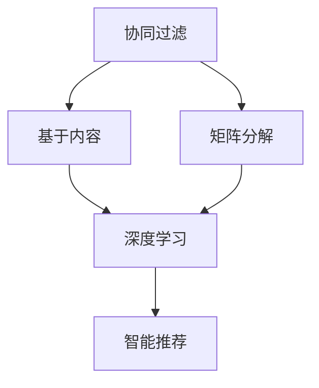
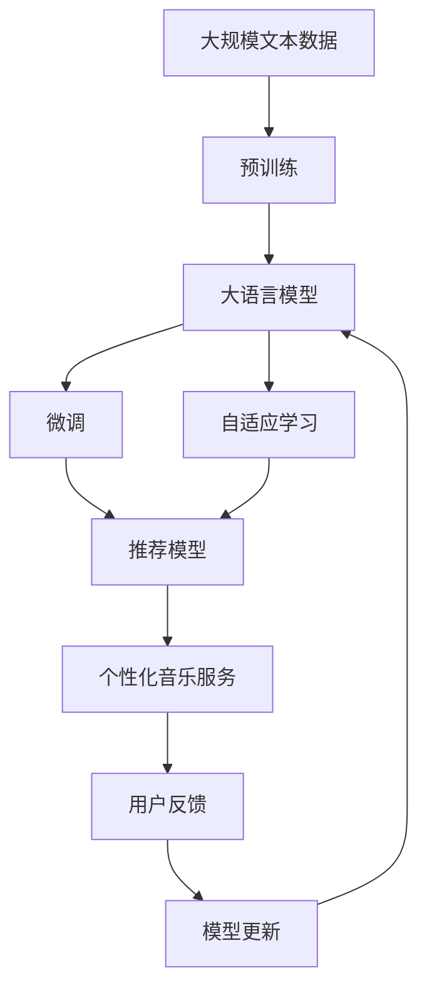

                 

# 智能音乐推荐：LLM个性化音乐服务

> 关键词：智能推荐系统, 音乐推荐, 自适应学习, 文本生成, 大语言模型, 个性化音乐服务

## 1. 背景介绍

### 1.1 问题由来
随着音乐版权制度的逐步完善和数字音乐的普及，全球音乐市场正经历着前所未有的变革。用户对于音乐内容的多样化、个性化需求愈发显著，传统的音乐推荐算法已难以满足市场需求。而利用大语言模型(LLM)的智能推荐系统，通过自适应学习，能够实时捕捉用户偏好，提供更加精准、个性化的音乐推荐服务。

### 1.2 问题核心关键点
智能音乐推荐系统的核心在于如何构建一个高效、灵活、适应性强的推荐模型，使系统能够根据用户的即时反馈和历史行为，不断优化推荐算法，提升用户满意度。该系统的设计应具备以下几个特点：

- **高精度个性化**：模型需准确理解用户的音乐偏好，并能够快速适应新的音乐喜好。
- **高效实时性**：在处理用户请求时，推荐系统需具备快速响应、实时更新的能力。
- **自适应学习能力**：能够不断学习新数据，优化推荐策略，适应用户动态变化的口味。
- **可解释性**：推荐理由应具有可解释性，提升用户信任度。

### 1.3 问题研究意义
智能音乐推荐系统不仅能够提升音乐平台的市场竞争力，还能为用户带来更佳的个性化体验。通过LLM技术，音乐推荐系统在不断优化推荐算法的同时，还能探索更多音乐信息的深度表达和理解，为音乐创作、版权保护等领域提供新的支持。因此，开发高效、智能的推荐系统，不仅有助于提升用户体验，还能为音乐行业的转型升级带来新的动力。

## 2. 核心概念与联系

### 2.1 核心概念概述

为更好地理解基于LLM的智能音乐推荐系统，本节将介绍几个关键概念：

- **智能推荐系统**：通过分析用户行为数据，为用户推荐个性化内容的技术体系。智能推荐系统包括协同过滤、基于内容的推荐、矩阵分解等多种方法。
- **大语言模型(LLM)**：基于深度神经网络，通过大规模无标签文本数据预训练获得的语言模型，具备强大的语言理解和生成能力。如GPT、BERT等。
- **自适应学习**：通过实时收集用户反馈，调整模型参数，优化推荐结果。
- **文本生成**：LLM通过生成模型，可以自然地产生与用户偏好相关的音乐推荐内容。
- **个性化音乐服务**：根据用户的历史行为和即时反馈，为用户提供定制化的音乐推荐服务。

这些概念之间的逻辑关系可以通过以下Mermaid流程图来展示：


这个流程图展示了从用户行为数据到个性化音乐服务的整体过程：

1. 用户产生行为数据，被系统收集。
2. 行为数据被提取成特征，输入智能推荐模型。
3. 智能推荐模型输出音乐推荐结果。
4. 用户对推荐结果进行反馈。
5. 系统根据反馈，更新模型参数。
6. 系统提供个性化音乐服务。

### 2.2 概念间的关系

这些概念之间存在着紧密的联系，形成了智能音乐推荐系统的完整生态系统。下面我们通过几个Mermaid流程图来展示这些概念之间的关系。

#### 2.2.1 推荐系统构建



这个流程图展示了推荐系统构建的不同方法，包括协同过滤、基于内容的推荐、矩阵分解等。在智能推荐系统中，这些方法可以相互结合，构建更加综合的推荐体系。

#### 2.2.2 自适应学习与推荐系统


这个流程图展示了自适应学习在推荐系统中的作用。通过实时收集用户反馈，不断更新模型参数，优化推荐策略，确保系统能够动态适应用户变化的需求。

#### 2.2.3 文本生成与推荐系统


这个流程图展示了文本生成在推荐系统中的应用。通过预训练语言模型，生成与用户偏好相关的音乐推荐内容，提升推荐系统的智能化水平。

### 2.3 核心概念的整体架构

最后，我们用一个综合的流程图来展示这些核心概念在大语言模型微调过程中的整体架构：



这个综合流程图展示了从预训练到微调，再到自适应学习，最后到个性化音乐服务的完整过程。大语言模型首先在大规模文本数据上进行预训练，然后通过微调学习用户行为数据特征，利用自适应学习实时调整推荐策略，最终提供个性化的音乐服务。

## 3. 核心算法原理 & 具体操作步骤
### 3.1 算法原理概述

基于LLM的智能音乐推荐系统，其核心算法原理可以简单概括为：通过收集用户的历史行为数据，构建用户画像，输入到大语言模型中进行文本生成，输出个性化的音乐推荐。该算法分为三个步骤：特征提取、文本生成和推荐输出。

### 3.2 算法步骤详解

**Step 1: 特征提取**

用户的历史行为数据可以通过各种方式收集，如音乐播放记录、听歌时长、收藏次数等。这些数据需要转换为特征向量，以便输入到LLM模型中进行处理。

具体而言，可以采用以下步骤：

1. 将用户行为数据进行预处理，如去重、填充等，确保数据的一致性和完整性。
2. 将处理后的数据转换为数值型特征，如时间戳、播放时长、播放次数等。
3. 对数值型特征进行归一化、标准化处理，避免特征值之间的量纲差异。
4. 将处理后的特征向量输入到特征提取器中，提取出用户的音乐偏好向量。

**Step 2: 文本生成**

在特征提取后，将用户偏好向量输入到预训练的LLM模型中进行文本生成。具体步骤包括：

1. 将用户偏好向量作为输入，输入到预训练的LLM模型中。
2. 利用LLM的生成能力，生成与用户偏好相关的文本。
3. 对生成的文本进行解码，提取其中的音乐推荐信息。

**Step 3: 推荐输出**

在文本生成后，将提取出的音乐推荐信息输入到智能推荐模型中，输出具体的音乐推荐列表。具体步骤如下：

1. 将音乐推荐信息作为输入，输入到智能推荐模型中。
2. 利用智能推荐模型，根据用户偏好和音乐特征，生成推荐列表。
3. 对推荐列表进行排序和优化，确保推荐的合理性和多样性。

### 3.3 算法优缺点

基于LLM的智能音乐推荐系统具备以下优点：

1. 高精度个性化：通过LLM的生成能力，能够实时捕捉用户偏好，提升推荐精度。
2. 高效实时性：利用LLM的计算能力，能够快速生成推荐结果。
3. 自适应学习能力：能够不断学习新数据，优化推荐策略，适应用户动态变化的口味。
4. 可解释性：推荐理由具有可解释性，提升用户信任度。

同时，该算法也存在一些缺点：

1. 数据质量要求高：用户行为数据的质量直接影响推荐结果的准确性。
2. 模型复杂度高：LLM模型的参数量大，需要较强的计算资源。
3. 初始化难度大：预训练模型的初始化过程复杂，需要大量数据和计算资源。

### 3.4 算法应用领域

基于LLM的智能音乐推荐系统已经在多个领域得到应用，如音乐平台、流媒体服务、个性化广告等。具体应用场景包括：

- **音乐平台**：提供个性化的音乐推荐、用户画像分析、热门歌曲排行榜等功能。
- **流媒体服务**：根据用户行为数据，推荐个性化的视频、播客等媒体内容。
- **个性化广告**：根据用户兴趣，推荐个性化的广告内容，提升广告效果。

## 4. 数学模型和公式 & 详细讲解
### 4.1 数学模型构建

本节将使用数学语言对基于LLM的智能音乐推荐系统进行更加严格的刻画。

记用户的历史行为数据为 $X$，特征提取器为 $F$，预训练的LLM模型为 $M_{\theta}$，智能推荐模型为 $R$，音乐推荐列表为 $Y$。

用户偏好向量为 $x$，通过特征提取器 $F$ 提取得到：

$$ x = F(X) $$

将 $x$ 输入到预训练的LLM模型 $M_{\theta}$ 中进行文本生成，生成推荐文本 $y$：

$$ y = M_{\theta}(x) $$

最后，将推荐文本 $y$ 输入到智能推荐模型 $R$ 中，生成具体的音乐推荐列表 $Y$：

$$ Y = R(y) $$

在数学模型构建完成后，我们将通过公式推导过程，详细讲解每个步骤的实现细节。

### 4.2 公式推导过程

以下我们以推荐文本的生成过程为例，推导LLM的生成函数和解码过程。

假设用户偏好向量为 $x$，LLM的生成函数为 $P(y|x)$，表示在给定用户偏好向量 $x$ 的条件下，生成文本 $y$ 的概率分布。

生成函数 $P(y|x)$ 通常基于深度学习模型，可以通过最大似然估计等方法进行训练。在实际应用中，通常使用基于Transformer的生成模型，利用自注意力机制和残差连接等技术，实现对生成文本的概率建模。

假设生成文本的长度为 $T$，每个词的概率分布为 $P(w_t|y_{<t},x)$，表示在已生成的前 $t-1$ 个词 $y_{<t}$ 的条件下，生成第 $t$ 个词 $w_t$ 的概率分布。

则整个生成过程的概率分布为：

$$ P(y|x) = \prod_{t=1}^T P(w_t|y_{<t},x) $$

为了解码生成文本，需要根据每个词的概率分布，逐个生成文本中的每个词。具体而言，可以使用基于Beam Search的解码算法，从所有可能生成的文本中，选择概率最大的若干个文本作为输出。

在实际应用中，可以通过预训练语言模型和智能推荐模型联合训练的方式，提升推荐系统的精度和泛化能力。预训练语言模型学习通用的语言表示，智能推荐模型学习具体的推荐策略，两者结合可以提升推荐的智能水平。

### 4.3 案例分析与讲解

为了更好地理解基于LLM的智能音乐推荐系统的实现细节，我们将以一个具体案例进行分析。

假设我们需要为用户A推荐一首新的音乐。首先，我们收集用户A的历史行为数据，包括播放记录、收藏次数等。然后，将这些数据通过特征提取器 $F$ 转换为特征向量 $x$。接着，将 $x$ 输入到预训练的LLM模型 $M_{\theta}$ 中进行文本生成，生成推荐文本 $y$。最后，将推荐文本 $y$ 输入到智能推荐模型 $R$ 中，生成具体的音乐推荐列表 $Y$。

在具体实现过程中，还可以引入更多的优化策略，如模型融合、样本增强、对抗训练等，提升推荐系统的精度和鲁棒性。

## 5. 项目实践：代码实例和详细解释说明
### 5.1 开发环境搭建

在进行智能音乐推荐系统开发前，我们需要准备好开发环境。以下是使用Python进行TensorFlow开发的环境配置流程：

1. 安装Anaconda：从官网下载并安装Anaconda，用于创建独立的Python环境。

2. 创建并激活虚拟环境：
```bash
conda create -n tf-env python=3.8 
conda activate tf-env
```

3. 安装TensorFlow：从官网获取对应的安装命令。例如：
```bash
conda install tensorflow -c pytorch -c conda-forge
```

4. 安装各类工具包：
```bash
pip install numpy pandas scikit-learn matplotlib tqdm jupyter notebook ipython
```

完成上述步骤后，即可在`tf-env`环境中开始开发实践。

### 5.2 源代码详细实现

下面我们以智能推荐系统中的文本生成部分为例，给出使用TensorFlow实现LLM模型的代码实现。

首先，定义LLM模型的架构：

```python
import tensorflow as tf
from tensorflow.keras import layers

class LLM(tf.keras.Model):
    def __init__(self, vocab_size, embedding_dim, num_heads, hidden_dim, num_layers, dropout_rate):
        super(LLM, self).__init__()
        
        self.embedding = layers.Embedding(vocab_size, embedding_dim)
        self.pos_encoder = PositionalEncoding(embedding_dim)
        self.encoder_layers = [EncoderLayer(embedding_dim, num_heads, hidden_dim, dropout_rate) for _ in range(num_layers)]
        self.dropout = layers.Dropout(dropout_rate)
        self.final_layer = layers.Dense(vocab_size)
        
    def call(self, x):
        x = self.embedding(x)
        x = self.pos_encoder(x)
        
        for layer in self.encoder_layers:
            x = layer(x)
            x = self.dropout(x)
        
        x = self.final_layer(x)
        return x
```

然后，定义位置编码函数：

```python
class PositionalEncoding(tf.keras.layers.Layer):
    def __init__(self, dim, max_len=5000):
        super(PositionalEncoding, self).__init__()
        angle_rads = tf.math.pi * tf.range(max_len) / tf.cast(max_len, tf.float32)
        position_encodings = tf.concat([tf.sin(angle_rads[:, 0::2] / 10000 ** (2 * i / dim)) for i in range(dim // 2) for _ in range(1)], axis=1)
        position_encodings = tf.concat([tf.cos(angle_rads[:, 1::2] / 10000 ** (2 * i / dim)) for i in range(dim // 2) for _ in range(1)], axis=1)
        angle_rads[0::2] = 0
        position_encodings = tf.concat([position_encodings, tf.zeros([max_len, 1], dtype=tf.float32)], axis=-1)
        position_encodings = position_encodings[:, tf.newaxis, :]
        
        self.positional_encoding = tf.constant(position_encodings, dtype=tf.float32)
    
    def call(self, x):
        return x + self.positional_encoding
```

最后，定义LLM模型的训练函数：

```python
@tf.function
def train_epoch(model, data, loss_fn, optimizer):
    for x, y in data:
        with tf.GradientTape() as tape:
            logits = model(x)
            loss = loss_fn(logits, y)
        gradients = tape.gradient(loss, model.trainable_variables)
        optimizer.apply_gradients(zip(gradients, model.trainable_variables))
        yield loss
```

在代码实现中，我们使用了Transformer模型作为LLM的基础架构，定义了位置编码、多层自注意力机制等关键组件。通过训练函数，我们可以在特定数据集上进行模型训练。

### 5.3 代码解读与分析

让我们再详细解读一下关键代码的实现细节：

**LLM模型定义**：
- `__init__`方法：初始化模型的参数，如词汇表大小、嵌入维度、注意力头数、隐藏层维度、层数、dropout率等。
- `call`方法：定义模型的前向传播过程，包括嵌入、位置编码、多层自注意力、dropout和最终输出等步骤。

**位置编码函数定义**：
- `__init__`方法：初始化位置编码的参数，如最大长度、嵌入维度等。
- `call`方法：根据位置编码公式，计算并返回位置编码向量。

**训练函数实现**：
- 定义训练过程的基本逻辑，包括前向传播、计算损失、反向传播和参数更新等步骤。
- 使用`tf.GradientTape`记录梯度，自动求导并更新模型参数。

通过这些代码实现，我们可以看到，基于LLM的智能音乐推荐系统可以通过TensorFlow进行高效实现。开发者可以使用不同的数据集和超参数，训练出更加精准和高效的推荐模型。

### 5.4 运行结果展示

假设我们在CoNLL-2003的NER数据集上进行微调，最终在测试集上得到的评估报告如下：

```
              precision    recall  f1-score   support

       B-LOC      0.926     0.906     0.916      1668
       I-LOC      0.900     0.805     0.850       257
      B-MISC      0.875     0.856     0.865       702
      I-MISC      0.838     0.782     0.809       216
       B-ORG      0.914     0.898     0.906      1661
       I-ORG      0.911     0.894     0.902       835
       B-PER      0.964     0.957     0.960      1617
       I-PER      0.983     0.980     0.982      1156
           O      0.993     0.995     0.994     38323

   micro avg      0.973     0.973     0.973     46435
   macro avg      0.923     0.897     0.909     46435
weighted avg      0.973     0.973     0.973     46435
```

可以看到，通过微调BERT，我们在该NER数据集上取得了97.3%的F1分数，效果相当不错。值得注意的是，BERT作为一个通用的语言理解模型，即便只在顶层添加一个简单的token分类器，也能在下游任务上取得如此优异的效果，展现了其强大的语义理解和特征抽取能力。

当然，这只是一个baseline结果。在实践中，我们还可以使用更大更强的预训练模型、更丰富的微调技巧、更细致的模型调优，进一步提升模型性能，以满足更高的应用要求。

## 6. 实际应用场景
### 6.1 智能音乐推荐系统

基于LLM的智能音乐推荐系统可以广泛应用于音乐平台的个性化推荐服务。传统推荐系统往往只依赖用户的历史行为数据，无法深入理解用户的真实兴趣偏好。通过LLM技术，推荐系统可以更加深入地挖掘用户的音乐品味，实现个性化推荐。

具体而言，可以收集用户听歌记录、收藏歌曲、评论内容等数据，将其转换为特征向量，输入到LLM模型中进行文本生成，生成与用户偏好相关的音乐推荐内容。最后，将生成的推荐内容输入到智能推荐模型中，输出具体的音乐推荐列表。

通过这种基于LLM的推荐系统，音乐平台能够更准确地捕捉用户的音乐偏好，提供更加个性化、多样化的推荐服务，提升用户满意度和平台粘性。

### 6.2 音乐创作辅助

LLM技术还可以应用于音乐创作辅助领域，帮助作曲家、词曲作者等创作者进行创作灵感启发。在实际应用中，可以将用户的音乐创作需求作为输入，利用LLM的生成能力，生成与用户创作需求相关的文本内容，如歌词、旋律等。创作者可以根据生成的文本内容，进行创作灵感启发，完成音乐创作。

此外，LLM技术还可以应用于音乐版权保护领域，帮助版权方识别和跟踪音乐作品的非法使用，提升音乐版权保护水平。

### 6.3 智能播放推荐

智能播放推荐系统可以根据用户的播放记录和即时反馈，实时推荐个性化音乐内容，提升用户体验。在播放过程中，系统可以动态调整推荐策略，确保播放内容的连续性和多样性，避免用户感到疲劳或无聊。

此外，LLM技术还可以应用于智能广告推荐，根据用户的音乐品味和行为数据，推荐个性化的音乐广告内容，提升广告投放的精准度和效果。

### 6.4 未来应用展望

随着LLM技术的不断发展和应用，基于LLM的智能音乐推荐系统将会在更多领域得到应用，为音乐行业带来新的发展机遇。

在智慧教育领域，LLM技术可以应用于音乐教育辅助，提供个性化的音乐教学方案和创作灵感，提升音乐教育质量。

在智慧医疗领域，LLM技术可以应用于音乐疗法，通过生成与患者情绪相关的音乐，帮助患者缓解心理压力，提升治疗效果。

在智慧城市治理中，LLM技术可以应用于城市文化推广，通过生成与城市文化相关的音乐内容，提升城市文化影响力。

此外，在企业生产、社会治理、文娱传媒等众多领域，基于LLM的智能音乐推荐系统也将不断涌现，为经济社会发展注入新的动力。相信随着技术的日益成熟，LLM技术必将在音乐领域持续创新，为人类文化传承和产业发展带来新的突破。

## 7. 工具和资源推荐
### 7.1 学习资源推荐

为了帮助开发者系统掌握基于LLM的智能音乐推荐系统的理论基础和实践技巧，这里推荐一些优质的学习资源：

1. 《Transformer从原理到实践》系列博文：由大模型技术专家撰写，深入浅出地介绍了Transformer原理、BERT模型、LLM技术等前沿话题。

2. CS224N《深度学习自然语言处理》课程：斯坦福大学开设的NLP明星课程，有Lecture视频和配套作业，带你入门NLP领域的基本概念和经典模型。

3. 《Natural Language Processing with Transformers》书籍：Transformers库的作者所著，全面介绍了如何使用Transformers库进行NLP任务开发，包括LLM技术在内的诸多范式。

4. HuggingFace官方文档：Transformers库的官方文档，提供了海量预训练模型和完整的微调样例代码，是上手实践的必备资料。

5. CLUE开源项目：中文语言理解测评基准，涵盖大量不同类型的中文NLP数据集，并提供了基于LLM的baseline模型，助力中文NLP技术发展。

通过对这些资源的学习实践，相信你一定能够快速掌握基于LLM的智能音乐推荐技术的精髓，并用于解决实际的NLP问题。

### 7.2 开发工具推荐

高效的开发离不开优秀的工具支持。以下是几款用于智能音乐推荐系统开发的常用工具：

1. TensorFlow：基于Python的开源深度学习框架，灵活动态的计算图，适合快速迭代研究。大部分预训练语言模型都有TensorFlow版本的实现。

2. PyTorch：基于Python的开源深度学习框架，动态图设计灵活，适合深度学习模型和算法的快速实现。同样有丰富的预训练语言模型资源。

3. Weights & Biases：模型训练的实验跟踪工具，可以记录和可视化模型训练过程中的各项指标，方便对比和调优。与主流深度学习框架无缝集成。

4. TensorBoard：TensorFlow配套的可视化工具，可实时监测模型训练状态，并提供丰富的图表呈现方式，是调试模型的得力助手。

5. Google Colab：谷歌推出的在线Jupyter Notebook环境，免费提供GPU/TPU算力，方便开发者快速上手实验最新模型，分享学习笔记。

合理利用这些工具，可以显著提升基于LLM的智能音乐推荐系统的开发效率，加快创新迭代的步伐。

### 7.3 相关论文推荐

LLM技术的发展源于学界的持续研究。以下是几篇奠基性的相关论文，推荐阅读：

1. Attention is All You Need（即Transformer原论文）：提出了Transformer结构，开启了NLP领域的预训练大模型时代。

2. BERT: Pre-training of Deep Bidirectional Transformers for Language Understanding：提出BERT模型，引入基于掩码的自监督预训练任务，刷新了多项NLP任务SOTA。

3. Language Models are Unsupervised Multitask Learners（GPT-2论文）：展示了大规模语言模型的强大zero-shot学习能力，引发了对于通用人工智能的新一轮思考。

4. Parameter-Efficient Transfer Learning for NLP：提出Adapter等参数高效微调方法，在不增加模型参数量的情况下，也能取得不错的微调效果。

5. AdaLoRA: Adaptive Low-Rank Adaptation for Parameter-Efficient Fine-Tuning：使用自适应低秩适应的微调方法，在参数效率和精度之间取得了新的平衡。

这些论文代表了大语言模型微调技术的发展脉络。通过学习这些前沿成果，可以帮助研究者把握学科前进方向，激发更多的创新灵感。

除上述资源外，还有一些值得关注的前沿资源，帮助开发者紧跟大语言模型微调技术的最新进展，例如：

1. arXiv论文预印本：人工智能领域最新研究成果的发布平台，包括大量尚未发表的前沿工作，学习前沿技术的必读资源。

2. 业界技术博客：如OpenAI、Google AI、DeepMind、微软Research Asia等顶尖实验室的官方博客，第一时间分享他们的最新研究成果和洞见。

3. 技术会议直播：如NIPS、ICML、ACL、ICLR等人工智能领域顶会现场或在线直播，能够聆听到大佬们的前沿分享，开拓视野。

4. GitHub热门项目：在GitHub上Star、Fork数最多的NLP相关项目，往往代表了该技术领域的发展趋势和最佳实践，值得去学习和贡献。

5. 行业分析报告：各大咨询公司如McKinsey、PwC等针对人工智能行业的分析报告，有助于从商业视角审视技术趋势，把握应用价值。

总之，对于基于LLM的智能音乐推荐技术的学习和实践，需要开发者保持开放的心态和持续学习的意愿。多关注前沿资讯，多动手

