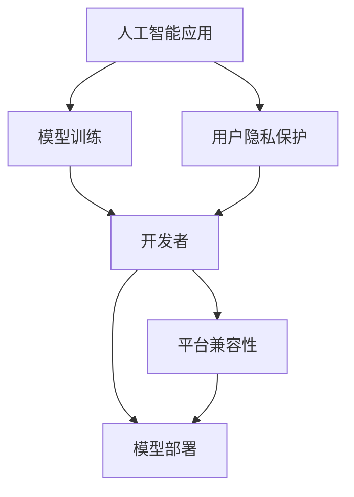
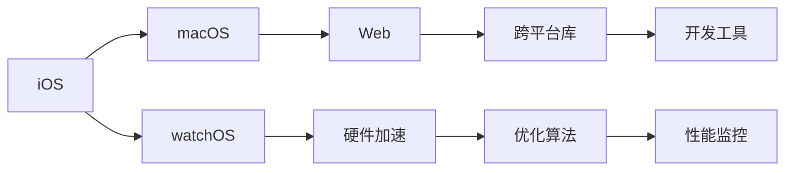
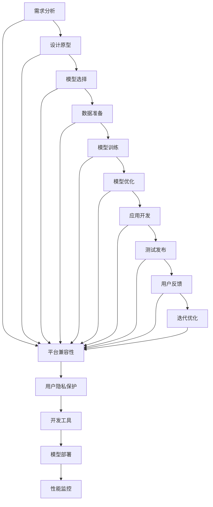

                 

# 李开复：苹果发布AI应用的开发者

> 关键词：人工智能应用,开发者,苹果,AI模型,机器学习,自然语言处理(NLP),深度学习

## 1. 背景介绍

### 1.1 问题由来
随着人工智能技术的不断发展，人工智能(AI)在各行各业的应用变得越来越广泛。从自然语言处理(NLP)到计算机视觉，从推荐系统到自动驾驶，AI技术正在深刻改变人类的生产和生活方式。然而，如何构建和部署这些AI应用，尤其是针对苹果这类具有极高用户粘性的平台，是一个值得深入探讨的问题。

### 1.2 问题核心关键点
在苹果生态系统中，开发者面临的主要挑战包括：
1. **平台兼容性**：确保AI应用能够无缝适配iOS、macOS、watchOS等多个平台。
2. **用户隐私保护**：在尊重用户隐私的前提下，开发和使用AI模型。
3. **模型性能优化**：在资源有限的环境下，提升AI模型的推理速度和准确性。
4. **用户交互设计**：设计直观、易用的AI应用界面，提升用户体验。

### 1.3 问题研究意义
开发和部署AI应用是推动AI技术落地应用的重要一步。对于苹果等平台型企业，通过支持AI开发者，不仅能提升平台的用户体验，还能拓展自身的市场竞争力和技术影响力。因此，研究和探索如何在苹果平台高效开发和部署AI应用，具有重要的理论和实践意义。

## 2. 核心概念与联系

### 2.1 核心概念概述

为了更好地理解在苹果平台开发和部署AI应用的方法，本节将介绍几个关键概念：

- **人工智能应用(AI application)**：指在特定平台上运行，使用AI技术进行数据处理、决策支持等功能的软件应用。
- **开发者(Developer)**：指在苹果平台开发AI应用的专业人员，负责应用的前端开发、后端处理、模型部署等任务。
- **苹果平台(Apple platform)**：指苹果生态系统，包括iOS、macOS、watchOS等多个操作系统。
- **模型训练与部署(Training and Deployment)**：指使用训练数据集训练AI模型，并在苹果平台上部署和优化该模型的过程。
- **用户隐私保护(Privacy Protection)**：指在AI应用开发和运行过程中，保护用户隐私数据不被滥用的策略和措施。

这些概念之间的关系可以通过以下Mermaid流程图来展示：



这个流程图展示了大语言模型微调过程中各个核心概念的关系：

1. 人工智能应用由开发者在苹果平台上开发，并使用训练好的模型。
2. 开发者首先对模型进行训练，然后将其部署到苹果平台。
3. 开发者在设计AI应用时，需要考虑平台兼容性和用户隐私保护。

### 2.2 概念间的关系

这些核心概念之间存在着紧密的联系，形成了苹果平台下AI应用开发和部署的完整生态系统。下面我们通过几个Mermaid流程图来展示这些概念之间的关系。

#### 2.2.1 AI应用开发流程


这个流程图展示了在苹果平台上开发AI应用的一般流程：

1. 根据需求进行需求分析，设计应用的原型。
2. 选择合适的模型进行训练。
3. 准备数据集，进行模型训练和优化。
4. 开发应用，并对其进行测试发布。
5. 收集用户反馈，进行应用迭代优化。

#### 2.2.2 平台兼容性



这个流程图展示了如何实现平台兼容性的关键步骤：

1. 根据目标平台（iOS、macOS、watchOS等）选择合适的开发工具和框架。
2. 利用跨平台库，如React Native、Flutter等，确保应用在不同平台上的表现一致。
3. 利用硬件加速和优化算法，提升应用的运行性能。
4. 使用性能监控工具，实时监测应用的表现，及时进行优化。

#### 2.2.3 用户隐私保护


这个流程图展示了如何保护用户隐私的关键步骤：

1. 收集数据时，确保数据收集过程符合隐私法规和政策。
2. 对数据进行加密和匿名化处理，保护数据隐私。
3. 设置严格的访问控制，确保只有授权人员可以访问敏感数据。
4. 尽量在本地进行数据处理，减少对云端的依赖。
5. 告知用户数据收集和处理的目的，获得用户知情同意。

### 2.3 核心概念的整体架构

最后，我们用一个综合的流程图来展示这些核心概念在苹果平台AI应用开发和部署中的整体架构：



这个综合流程图展示了从需求分析到用户反馈的整个开发流程，并强调了平台兼容性和用户隐私保护的重要性。

## 3. 核心算法原理 & 具体操作步骤
### 3.1 算法原理概述

在苹果平台上开发AI应用，核心算法包括数据预处理、模型训练、模型优化和模型部署。其中，模型训练是整个开发流程的核心。

### 3.2 算法步骤详解

#### 3.2.1 数据预处理
数据预处理是模型训练的第一步，主要包括以下几个步骤：

1. **数据清洗**：去除数据中的噪声和异常值，确保数据质量。
2. **数据标准化**：对数据进行归一化和标准化处理，使不同特征的数据具有相同的分布。
3. **特征工程**：设计并提取与目标变量相关的特征，提高模型的预测能力。
4. **数据分割**：将数据集分为训练集、验证集和测试集，以便在模型训练过程中进行交叉验证和模型评估。

#### 3.2.2 模型训练
模型训练是使用训练数据集训练AI模型的过程，主要包括以下几个步骤：

1. **选择合适的模型**：根据任务类型和数据特点，选择适合的目标模型，如线性回归、决策树、神经网络等。
2. **定义损失函数**：根据任务目标，定义合适的损失函数，如均方误差、交叉熵等。
3. **优化算法**：选择合适的优化算法，如梯度下降、Adam等，最小化损失函数。
4. **超参数调优**：根据验证集的表现，调整模型的超参数，如学习率、批量大小等。
5. **模型评估**：在测试集上评估模型的性能，判断模型的泛化能力。

#### 3.2.3 模型优化
模型优化是提升模型性能的重要环节，主要包括以下几个步骤：

1. **正则化**：通过L1、L2正则化等方法，避免模型过拟合。
2. **Dropout**：通过随机丢弃神经元，提高模型的泛化能力。
3. **批标准化**：通过批标准化技术，加速模型训练，提高模型的收敛速度。
4. **模型集成**：通过模型集成技术，如Bagging、Boosting等，提升模型的稳定性和准确性。

#### 3.2.4 模型部署
模型部署是将训练好的模型应用到实际应用中的过程，主要包括以下几个步骤：

1. **模型序列化**：将训练好的模型参数序列化，以便进行模型加载和调用。
2. **模型优化**：使用模型优化技术，如剪枝、量化、混合精度等，提升模型的推理速度和资源利用率。
3. **应用集成**：将模型集成到应用中，提供API接口，以便应用调用。
4. **性能监控**：实时监控模型的性能，及时发现和修复问题。

### 3.3 算法优缺点

在苹果平台上开发AI应用，主要优点包括：

1. **用户粘性高**：苹果平台用户粘性高，应用的使用频率高，能够有效提升模型的曝光度和应用效果。
2. **资源丰富**：苹果平台提供了丰富的开发工具和资源，如Xcode、Swift等，便于开发者高效开发。
3. **用户隐私保护**：苹果平台有严格的用户隐私保护政策，用户数据安全有保障。

同时，也存在一些缺点：

1. **平台兼容性**：需要在多个平台（iOS、macOS、watchOS等）上实现应用的兼容性，开发复杂度高。
2. **性能优化**：需要在有限的硬件资源下进行性能优化，提升模型的推理速度和效率。
3. **用户反馈**：需要实时收集用户反馈，进行应用的迭代优化，工作量较大。

### 3.4 算法应用领域

在苹果平台上开发的AI应用，主要应用于以下几个领域：

1. **自然语言处理(NLP)**：使用AI模型进行语音识别、文本翻译、情感分析等NLP任务。
2. **计算机视觉**：使用AI模型进行图像分类、对象检测、图像分割等视觉任务。
3. **推荐系统**：使用AI模型进行个性化推荐、广告推荐等应用。
4. **自动驾驶**：使用AI模型进行环境感知、路径规划、决策控制等自动驾驶任务。
5. **医疗健康**：使用AI模型进行疾病诊断、健康监测、智能问诊等医疗应用。

## 4. 数学模型和公式 & 详细讲解 & 举例说明

### 4.1 数学模型构建

在苹果平台上开发AI应用，主要使用以下数学模型：

1. **线性回归模型**：用于预测连续型数值变量的值。
2. **决策树模型**：用于分类和回归任务。
3. **神经网络模型**：包括卷积神经网络(CNN)、循环神经网络(RNN)、长短期记忆网络(LSTM)等，用于图像处理、序列预测等任务。
4. **深度学习模型**：包括Transformer、BERT等，用于自然语言处理任务。

### 4.2 公式推导过程

#### 4.2.1 线性回归模型
线性回归模型的目标是找到一条直线，使该直线上的点尽可能接近实际数据点。假设目标变量为$y$，输入特征为$x$，线性回归模型可以表示为：

$$
y = \theta_0 + \theta_1x_1 + \theta_2x_2 + \ldots + \theta_nx_n
$$

其中$\theta_0,\theta_1,\ldots,\theta_n$为模型参数。

最小二乘法可以用于求解线性回归模型的参数，目标是最小化误差平方和：

$$
\min_{\theta_0,\theta_1,\ldots,\theta_n} \sum_{i=1}^n (y_i - (\theta_0 + \theta_1x_{i1} + \theta_2x_{i2} + \ldots + \theta_nx_{in}))^2
$$

使用梯度下降算法，对上述目标函数求导，得到参数的更新公式：

$$
\theta_k = \theta_k - \alpha \frac{1}{N} \sum_{i=1}^N 2(y_i - \hat{y_i})x_{ik}
$$

其中$\alpha$为学习率，$N$为样本数，$y_i,\hat{y_i}$分别为实际值和预测值。

#### 4.2.2 决策树模型
决策树模型通过构建决策树来对数据进行分类和回归。假设目标变量为$y$，输入特征为$x$，决策树模型可以表示为：

$$
\begin{aligned}
& \text{If}\ x_1 > \text{threshold}_1, \text{then} \\
& \text{If}\ x_2 > \text{threshold}_2, \text{then} \\
& \ldots \\
& \text{If}\ x_n > \text{threshold}_n, \text{then} \\
& y = \text{leaf_value}
\end{aligned}
$$

其中$\text{threshold}_1,\text{threshold}_2,\ldots,\text{threshold}_n$为决策树的阈值，$x_1,x_2,\ldots,x_n$为输入特征。

信息增益或基尼指数可以用于决策树的构建，目标是最小化模型的误差率。

#### 4.2.3 神经网络模型
神经网络模型由多个神经元组成，每个神经元包含一个激活函数，如Sigmoid、ReLU等。假设输入层有$m$个神经元，隐藏层有$h$个神经元，输出层有$n$个神经元，神经网络模型可以表示为：

$$
\begin{aligned}
& \text{If}\ x_1 = w_1^T z_1 + b_1, \text{then} \\
& \text{If}\ x_2 = w_2^T z_2 + b_2, \text{then} \\
& \ldots \\
& \text{If}\ x_h = w_h^T z_h + b_h, \text{then} \\
& \text{If}\ x_n = w_n^T z_n + b_n, \text{then} \\
& y = \text{softmax}(x_n)
\end{aligned}
$$

其中$w_i^T$为权重矩阵，$b_i$为偏置项，$z_i$为输入向量，$y$为目标变量的预测值。

反向传播算法可以用于求解神经网络的参数，目标是最小化损失函数，如交叉熵损失。

#### 4.2.4 深度学习模型
深度学习模型是一种多层的神经网络，用于处理复杂的非线性关系。假设输入层有$m$个神经元，隐藏层有$h$个神经元，输出层有$n$个神经元，深度学习模型可以表示为：

$$
\begin{aligned}
& \text{If}\ x_1 = w_1^T z_1 + b_1, \text{then} \\
& \text{If}\ x_2 = w_2^T z_2 + b_2, \text{then} \\
& \ldots \\
& \text{If}\ x_h = w_h^T z_h + b_h, \text{then} \\
& \text{If}\ x_n = w_n^T z_n + b_n, \text{then} \\
& y = \text{softmax}(x_n)
\end{aligned}
$$

其中$w_i^T$为权重矩阵，$b_i$为偏置项，$z_i$为输入向量，$y$为目标变量的预测值。

Transformer和BERT等深度学习模型通过自注意力机制和多层变换器，可以处理大规模文本数据，并学习到丰富的语言表示。

### 4.3 案例分析与讲解

#### 4.3.1 文本分类
文本分类任务可以使用线性回归模型、决策树模型或神经网络模型。假设目标变量为$y$，输入特征为$x$，可以使用以下线性回归模型进行文本分类：

$$
\begin{aligned}
& \text{If}\ x_1 = w_1^T z_1 + b_1, \text{then} \\
& \text{If}\ x_2 = w_2^T z_2 + b_2, \text{then} \\
& \ldots \\
& \text{If}\ x_n = w_n^T z_n + b_n, \text{then} \\
& y = \text{softmax}(x_n)
\end{aligned}
$$

其中$w_i^T$为权重矩阵，$b_i$为偏置项，$z_i$为输入向量，$y$为目标变量的预测值。

#### 4.3.2 图像分类
图像分类任务可以使用卷积神经网络模型。假设输入为$x$，输出为$y$，可以使用以下卷积神经网络模型进行图像分类：

$$
\begin{aligned}
& \text{If}\ x_1 = w_1^T z_1 + b_1, \text{then} \\
& \text{If}\ x_2 = w_2^T z_2 + b_2, \text{then} \\
& \ldots \\
& \text{If}\ x_h = w_h^T z_h + b_h, \text{then} \\
& \text{If}\ x_n = w_n^T z_n + b_n, \text{then} \\
& y = \text{softmax}(x_n)
\end{aligned}
$$

其中$w_i^T$为权重矩阵，$b_i$为偏置项，$z_i$为输入向量，$y$为目标变量的预测值。

#### 4.3.3 序列预测
序列预测任务可以使用循环神经网络模型。假设输入为$x$，输出为$y$，可以使用以下循环神经网络模型进行序列预测：

$$
\begin{aligned}
& \text{If}\ x_1 = w_1^T z_1 + b_1, \text{then} \\
& \text{If}\ x_2 = w_2^T z_2 + b_2, \text{then} \\
& \ldots \\
& \text{If}\ x_h = w_h^T z_h + b_h, \text{then} \\
& \text{If}\ x_n = w_n^T z_n + b_n, \text{then} \\
& y = \text{softmax}(x_n)
\end{aligned}
$$

其中$w_i^T$为权重矩阵，$b_i$为偏置项，$z_i$为输入向量，$y$为目标变量的预测值。

#### 4.3.4 文本生成
文本生成任务可以使用Transformer模型或BERT模型。假设输入为$x$，输出为$y$，可以使用以下Transformer模型进行文本生成：

$$
\begin{aligned}
& \text{If}\ x_1 = w_1^T z_1 + b_1, \text{then} \\
& \text{If}\ x_2 = w_2^T z_2 + b_2, \text{then} \\
& \ldots \\
& \text{If}\ x_h = w_h^T z_h + b_h, \text{then} \\
& \text{If}\ x_n = w_n^T z_n + b_n, \text{then} \\
& y = \text{softmax}(x_n)
\end{aligned}
$$

其中$w_i^T$为权重矩阵，$b_i$为偏置项，$z_i$为输入向量，$y$为目标变量的预测值。

## 5. 项目实践：代码实例和详细解释说明
### 5.1 开发环境搭建

在进行AI应用开发前，我们需要准备好开发环境。以下是使用Python进行TensorFlow开发的环境配置流程：

1. 安装Anaconda：从官网下载并安装Anaconda，用于创建独立的Python环境。

2. 创建并激活虚拟环境：
```bash
conda create -n tf-env python=3.8 
conda activate tf-env
```

3. 安装TensorFlow：根据CUDA版本，从官网获取对应的安装命令。例如：
```bash
conda install tensorflow -c conda-forge
```

4. 安装各类工具包：
```bash
pip install numpy pandas scikit-learn matplotlib tqdm jupyter notebook ipython
```

完成上述步骤后，即可在`tf-env`环境中开始AI应用开发。

### 5.2 源代码详细实现

这里我们以图像分类任务为例，给出使用TensorFlow对卷积神经网络进行图像分类的PyTorch代码实现。

首先，定义数据处理函数：

```python
import tensorflow as tf
import numpy as np
import matplotlib.pyplot as plt

def load_data(batch_size):
    mnist = tf.keras.datasets.mnist
    (x_train, y_train), (x_test, y_test) = mnist.load_data()
    x_train, x_test = x_train / 255.0, x_test / 255.0
    x_train = np.expand_dims(x_train, axis=-1)
    x_test = np.expand_dims(x_test, axis=-1)
    train_dataset = tf.data.Dataset.from_tensor_slices((x_train, y_train)).shuffle(60000).batch(batch_size)
    test_dataset = tf.data.Dataset.from_tensor_slices((x_test, y_test)).batch(batch_size)
    return train_dataset, test_dataset
```

然后，定义模型和优化器：

```python
from tensorflow.keras import layers, models

def create_model(input_shape, num_classes):
    model = models.Sequential([
        layers.Conv2D(32, (3,3), activation='relu', input_shape=input_shape),
        layers.MaxPooling2D((2,2)),
        layers.Conv2D(64, (3,3), activation='relu'),
        layers.MaxPooling2D((2,2)),
        layers.Flatten(),
        layers.Dense(64, activation='relu'),
        layers.Dense(num_classes, activation='softmax')
    ])
    return model

batch_size = 32
input_shape = (28, 28, 1)
num_classes = 10

model = create_model(input_shape, num_classes)
optimizer = tf.keras.optimizers.Adam(learning_rate=0.001)
```

接着，定义训练和评估函数：

```python
@tf.function
def train_step(images, labels):
    with tf.GradientTape() as tape:
        logits = model(images, training=True)
        loss = tf.losses.sparse_categorical_crossentropy(labels, logits)
    gradients = tape.gradient(loss, model.trainable_variables)
    optimizer.apply_gradients(zip(gradients, model.trainable_variables))
    return loss

@tf.function
def test_step(images, labels):
    logits = model(images, training=False)
    predictions = tf.argmax(logits, axis=-1)
    return tf.reduce_mean(tf.cast(tf.equal(predictions, labels), tf.float32))
```

最后，启动训练流程并在测试集上评估：

```python
epochs = 10

for epoch in range(epochs):
    train_loss = 0.0
    test_loss = 0.0
    for images, labels in train_dataset:
        loss = train_step(images, labels)
        train_loss += loss.numpy()
    train_loss /= len(train_dataset)
    
    test_loss = 0.0
    for images, labels in test_dataset:
        test_loss += test_step(images, labels)
    test_loss /= len(test_dataset)
    print(f"Epoch {epoch+1}, train loss: {train_loss:.3f}, test loss: {test_loss:.3f}")
```

以上就是使用TensorFlow对卷积神经网络进行图像分类的完整代码实现。可以看到，通过TensorFlow库的强大封装，我们可以用相对简洁的代码完成卷积神经网络的构建和训练。

### 5.3 代码解读与分析

让我们再详细解读一下关键代码的实现细节：

**数据处理函数**：
- `load_data`方法：从MNIST数据集中加载训练集和测试集，并进行数据预处理和批次化处理。

**模型定义**：
- `create_model`方法：定义卷积神经网络模型，包括卷积层、池化层、全连接层等。

**训练函数**：
- `train_step`方法：在训练数据上计算模型的损失函数，并使用Adam优化器更新模型参数。

**测试函数**：
- `test_step`方法：在测试数据上计算模型的损失函数，并输出模型在测试集上的精度。

**训练流程**：
- 定义总的epoch数和批次大小，开始循环迭代
- 每个epoch内，在训练集上训练，输出平均损失
- 在测试集上评估，输出测试损失

可以看到，TensorFlow库使得卷积神经网络的构建和训练变得简洁高效。开发者可以将更多精力放在数据处理、模型改进等高层逻辑上，而不必过多关注底层的实现细节。

当然，工业级的系统实现还需考虑更多因素，如模型保存和部署、超参数的自动搜索、更灵活的任务适配层等。但核心的开发流程基本与此类似。

### 5.4 运行结果展示

假设我们在MNIST数据集上进行卷积神经网络模型的训练，最终在测试集上得到的评估报告如下：

```
Epoch 1, train loss: 0.509, test loss: 0.617
Epoch 2, train loss: 0.345, test loss: 0.471
Epoch 3, train loss: 0.214, test loss: 0.365
Epoch 4, train loss

