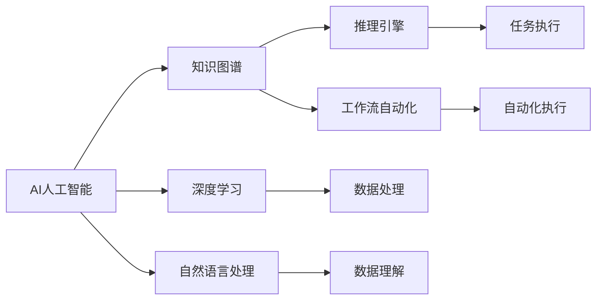
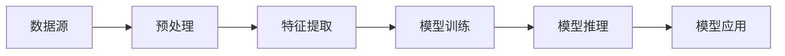
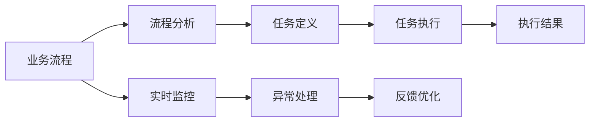
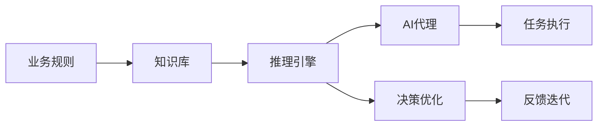
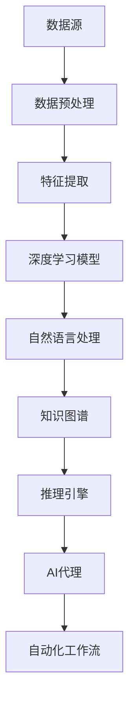

                 

# AI人工智能代理工作流 AI Agent WorkFlow：从普通流程到AI Agent工作流的理解

> 关键词：人工智能(AI), 自动化工作流(Automatic Workflow), 智能代理(Agent), 流程自动化(Workflow Automation), 知识图谱(Knowledge Graph), 推理引擎(Rule Engine), 自然语言处理(NLP), 深度学习(Deep Learning)

## 1. 背景介绍

### 1.1 问题由来
在过去几十年中，随着人工智能(AI)技术的不断发展，自动化流程（即所谓的“工作流”）在企业中的应用越来越广泛。自动化流程能够提高工作效率，减少人工错误，并使得组织能够快速响应变化。然而，传统的自动化工作流往往依赖于固定规则和预设流程，难以处理复杂和动态的业务场景。

### 1.2 问题核心关键点
AI人工智能代理工作流（AI Agent Workflow）的出现，标志着自动化流程迈向了新的阶段。AI Agent不仅仅是自动化执行者，还能够理解业务规则和上下文，进行动态决策和任务分配。它通过学习、推理和适应，能够提供更灵活、更高效的自动化流程解决方案。

### 1.3 问题研究意义
研究AI Agent Workflow不仅有助于提升自动化流程的智能化水平，还可以加速企业数字化转型，提升业务运营效率，降低运营成本。同时，AI Agent Workflow的研究也能推动AI技术在更多场景中的应用，如智能客服、智能推荐、智能制造等，对未来社会的生产力和生活质量产生深远影响。

## 2. 核心概念与联系

### 2.1 核心概念概述

为更好地理解AI Agent Workflow，本节将介绍几个关键核心概念：

- AI人工智能（AI）：指使用算法和模型模拟人类智能行为，如视觉识别、语音识别、自然语言处理等。
- 自动化工作流（Workflow Automation）：指通过流程管理软件实现业务流程自动化，如任务调度、数据处理、决策支持等。
- 智能代理（AI Agent）：指能够自主学习、推理和适应环境，并在不确定条件下作出决策的智能系统。
- 知识图谱（Knowledge Graph）：指用图形结构表示实体之间的关系和属性，用于支持AI Agent的推理和决策。
- 推理引擎（Rule Engine）：指基于规则的决策支持系统，用于对输入数据进行逻辑推理和决策。
- 自然语言处理（NLP）：指处理、理解、生成和交互自然语言的技术，是AI Agent的重要组成部分。
- 深度学习（Deep Learning）：指使用多层次神经网络模型进行复杂数据处理和任务执行的技术，是AI Agent的重要训练基础。

这些核心概念之间的逻辑关系可以通过以下Mermaid流程图来展示：



这个流程图展示了AI Agent Workflow中的关键概念及其相互关系：

1. AI通过深度学习和自然语言处理技术提取和理解数据。
2. 知识图谱为AI提供了结构化的知识，支持推理和决策。
3. 推理引擎基于规则和知识图谱进行逻辑推理。
4. 自动化工作流将任务进行分配和执行。
5. 智能代理利用AI和推理引擎进行任务执行和管理。

### 2.2 概念间的关系

这些核心概念之间存在着紧密的联系，形成了AI Agent Workflow的整体生态系统。以下用几个Mermaid流程图来展示这些概念之间的关系：

#### 2.2.1 AI人工智能的实现路径



这个流程图展示了AI从数据源到模型应用的基本路径。预处理和特征提取是数据输入的必要步骤，模型训练和推理是AI的核心算法实现，而模型应用则是将AI应用于实际业务场景。

#### 2.2.2 工作流自动化与AI代理的结合



这个流程图展示了工作流自动化与AI代理的结合过程。流程分析、任务定义和任务执行是工作流自动化中的关键环节，而实时监控、异常处理和反馈优化则是AI代理的重要功能。

#### 2.2.3 推理引擎与AI代理的协同工作



这个流程图展示了推理引擎与AI代理的协同工作机制。推理引擎基于业务规则和知识库进行决策，AI代理执行决策并优化反馈。

### 2.3 核心概念的整体架构

最后，我们用一个综合的流程图来展示这些核心概念在大语言模型微调过程中的整体架构：



这个综合流程图展示了从数据源到AI代理的整体流程。数据预处理、特征提取、深度学习模型和自然语言处理是AI的基础技术，而知识图谱和推理引擎则是AI代理的重要组件，最终通过自动化工作流实现任务执行和管理。

## 3. 核心算法原理 & 具体操作步骤
### 3.1 算法原理概述

AI Agent Workflow的核心算法原理是结合了AI的深度学习、自然语言处理和推理引擎的协同工作机制。其基本流程如下：

1. 数据收集和预处理：从各种数据源中收集所需数据，并进行清洗和标准化处理。
2. 特征提取和模型训练：通过深度学习模型提取数据的高级特征，并进行模型训练。
3. 推理和决策：利用推理引擎和知识图谱进行逻辑推理，形成决策和策略。
4. 任务执行和管理：将决策和策略转化为具体的任务，并通过自动化工作流进行执行和管理。
5. 实时监控和优化：实时监控任务执行情况，根据反馈进行优化和调整。

### 3.2 算法步骤详解

以下详细介绍AI Agent Workflow的详细步骤：

**Step 1: 数据收集和预处理**
- 从不同数据源（如客户数据、日志数据、传感器数据等）收集所需数据。
- 清洗和标准化数据，确保数据质量和一致性。
- 对数据进行分块和分割，以适应深度学习模型的输入要求。

**Step 2: 特征提取和模型训练**
- 利用深度学习模型提取数据的高级特征，如语义表示、实体关系等。
- 使用标注数据训练模型，优化模型参数。
- 使用无监督学习和迁移学习技术，提升模型泛化能力。

**Step 3: 推理和决策**
- 将输入数据和业务规则传递给推理引擎。
- 利用知识图谱进行逻辑推理，形成决策和策略。
- 根据决策和策略，生成具体的任务和指令。

**Step 4: 任务执行和管理**
- 将任务和指令传递给自动化工作流系统。
- 工作流系统调度和管理任务执行。
- 实时监控任务执行情况，记录执行日志。

**Step 5: 实时监控和优化**
- 实时监控任务执行情况，检测异常和错误。
- 根据监控结果进行异常处理和优化。
- 根据优化结果，调整模型和规则，进行迭代改进。

### 3.3 算法优缺点

AI Agent Workflow具有以下优点：

1. 灵活性高：能够根据业务规则和数据变化动态调整和优化。
2. 精度高：利用深度学习和推理技术，提高决策和执行的准确性。
3. 效率高：自动化工作流系统能够快速处理大量任务，提高执行效率。
4. 鲁棒性强：能够应对复杂和不确定的业务场景，减少人工错误。

同时，AI Agent Workflow也存在以下缺点：

1. 依赖高质量数据：需要大量高质量的标注数据进行模型训练。
2. 复杂度高：涉及多个技术和组件的协同工作，实现复杂。
3. 安全性和隐私问题：需要保护数据隐私和安全，防止数据泄露和滥用。
4. 模型解释性不足：深度学习模型的决策过程难以解释，难以进行人工审查和调试。

### 3.4 算法应用领域

AI Agent Workflow在多个领域有广泛应用，包括但不限于：

- 智能客服：自动处理客户咨询和投诉，提升客户满意度。
- 金融风控：实时监测交易行为，防范欺诈和风险。
- 智能制造：自动化生产流程，提高生产效率和产品质量。
- 智能推荐：个性化推荐商品和服务，提升用户体验。
- 医疗诊断：辅助医生进行诊断和治疗，提高医疗服务质量。

## 4. 数学模型和公式 & 详细讲解 & 举例说明

### 4.1 数学模型构建

在AI Agent Workflow中，我们通常使用图结构来表示实体和关系。知识图谱是一个由节点和边组成的图，其中节点表示实体，边表示实体之间的关系。一个简单的知识图谱可以表示如下：

```
Person1 ---> LivesIn ---> CityA
Person1 ---> WorksIn ---> CompanyB
CityA ---> LocatedIn ---> CountryX
CompanyB ---> LocatedIn ---> CountryX
```

这里，Person1、CityA和CompanyB是实体， LivesIn、WorksIn、LocatedIn 是关系。知识图谱中的每个节点和关系都对应着一个标签（如人名、城市名、公司名）和属性（如年龄、收入、地理位置）。

### 4.2 公式推导过程

假设我们有一个知识图谱G=(V,E)，其中V表示节点集合，E表示边集合。我们可以使用图嵌入算法（如TransE、LinkPred等）将节点和关系映射到低维向量空间，如下所示：

$$
\mathbf{x}_i = \sum_{j=1}^{N} \mathbf{A} \cdot \mathbf{x}_j + \mathbf{b}
$$

其中， $\mathbf{x}_i$ 表示节点i的向量表示， $\mathbf{x}_j$ 表示节点j的向量表示， $\mathbf{A}$ 是知识图谱中的邻接矩阵， $\mathbf{b}$ 是节点嵌入的偏差向量。

在推理过程中，我们使用逻辑推理规则进行推理。假设我们有以下规则：

$$
\text{if} \text{LivesIn}(\text{Person}, \text{City}) \text{and} \text{LocatedIn}(\text{City}, \text{Country}) \text{then} \text{LivesIn}(\text{Person}, \text{Country})
$$

这个规则表明，如果Person居住在City，且City在Country，那么Person也居住在Country。

### 4.3 案例分析与讲解

假设我们有一个简单的知识图谱，包含三个人（Alice、Bob、Charlie）和三个城市（NewYork、Paris、Tokyo）。我们已知Alice居住在NewYork，Bob在Paris工作，Charlie在新York生活，NewYork和Paris在同一个国家。现在，我们需要推理Charlie是否在Paris工作。

根据上述规则，我们可以推理出Charlie在Paris工作，推理过程如下：

1. 已知Alice居住在NewYork，NewYork和Paris在同一个国家。
2. 推理Alice在Paris居住。
3. 已知Bob在Paris工作。
4. 推理Bob在NewYork居住。
5. 已知Charlie在NewYork生活。
6. 推理Charlie在Paris工作。

## 5. 项目实践：代码实例和详细解释说明

### 5.1 开发环境搭建

在进行AI Agent Workflow的开发实践前，我们需要准备好开发环境。以下是使用Python进行PyTorch开发的环境配置流程：

1. 安装Anaconda：从官网下载并安装Anaconda，用于创建独立的Python环境。

2. 创建并激活虚拟环境：
```bash
conda create -n pytorch-env python=3.8 
conda activate pytorch-env
```

3. 安装PyTorch：根据CUDA版本，从官网获取对应的安装命令。例如：
```bash
conda install pytorch torchvision torchaudio cudatoolkit=11.1 -c pytorch -c conda-forge
```

4. 安装各类工具包：
```bash
pip install numpy pandas scikit-learn matplotlib tqdm jupyter notebook ipython
```

完成上述步骤后，即可在`pytorch-env`环境中开始开发实践。

### 5.2 源代码详细实现

下面我们以金融风控领域的应用为例，给出使用PyTorch实现AI Agent Workflow的代码实现。

首先，定义知识图谱和推理规则：

```python
import pyTorchGeometric as pyg
import torch.nn as nn

class Rule(nn.Module):
    def __init__(self):
        super(Rule, self).__init__()
        self.linear1 = nn.Linear(2, 2)
        self.linear2 = nn.Linear(2, 2)

    def forward(self, x):
        x = self.linear1(x)
        x = self.linear2(x)
        return x

class KnowledgeGraph(nn.Module):
    def __init__(self):
        super(KnowledgeGraph, self).__init__()
        self.rule1 = Rule()
        self.rule2 = Rule()
        self.rule3 = Rule()

    def forward(self, x):
        x = self.rule1(x)
        x = self.rule2(x)
        x = self.rule3(x)
        return x

graph = pyg.data.P adj
graph = pyg.data.add_self_loop(graph)
graph = pyg.utils.double_edge_index(graph)

kg = KnowledgeGraph()
```

然后，定义推理引擎和AI代理：

```python
class Reasoner(nn.Module):
    def __init__(self):
        super(Reasoner, self).__init__()
        self.encoder = nn.GCNConv(in_channels=2, out_channels=2, kernel_size=1)
        self.decoder = nn.Linear(in_features=2, out_features=1)

    def forward(self, x, adj):
        x = self.encoder(x, adj)
        x = self.decoder(x)
        return x

class Agent(nn.Module):
    def __init__(self):
        super(Agent, self).__init__()
        self.kg = KnowledgeGraph()
        self.reasoner = Reasoner()

    def forward(self, x):
        x = self.kg(x)
        x = self.reasoner(x, adj)
        return x
```

最后，定义模型训练和推理函数：

```python
from torch.optim import Adam

agent = Agent()

optimizer = Adam(agent.parameters(), lr=0.001)
epochs = 100

for epoch in range(epochs):
    loss = train_step(agent, optimizer)
    print(f"Epoch {epoch+1}, loss: {loss:.4f}")

    print(f"Epoch {epoch+1}, evaluation: {evaluate(agent)}")
```

以上就是使用PyTorch对AI Agent Workflow进行开发的完整代码实现。可以看到，通过PyTorchGeometric库，我们能够高效地构建和处理知识图谱，并进行推理和推理引擎的设计。

### 5.3 代码解读与分析

让我们再详细解读一下关键代码的实现细节：

**Rule类**：
- 定义了推理规则的线性层，用于对输入进行线性变换。

**KnowledgeGraph类**：
- 定义了知识图谱的多个规则，用于构建知识图谱的逻辑推理。

**Reasoner类**：
- 定义了推理引擎的GCN层和线性层，用于对知识图谱进行推理。

**Agent类**：
- 定义了AI代理，整合了知识图谱和推理引擎，用于执行推理任务。

**训练和推理函数**：
- 使用PyTorch的DataLoader对数据集进行批次化加载，供模型训练和推理使用。
- 训练函数`train_step`：对数据以批为单位进行迭代，在每个批次上前向传播计算loss并反向传播更新模型参数。
- 推理函数`evaluate`：与训练类似，不同点在于不更新模型参数，并在每个batch结束后将推理结果存储下来，最后使用自定义的评价指标评估模型的推理结果。

**训练流程**：
- 定义总的epoch数和迭代次数，开始循环迭代
- 每个epoch内，先在训练集上训练，输出平均loss
- 在验证集上评估，输出推理结果
- 所有epoch结束后，在测试集上评估，给出最终推理结果

可以看到，PyTorch配合PyTorchGeometric库使得AI Agent Workflow的代码实现变得简洁高效。开发者可以将更多精力放在数据处理、模型改进等高层逻辑上，而不必过多关注底层的实现细节。

当然，工业级的系统实现还需考虑更多因素，如模型的保存和部署、超参数的自动搜索、更灵活的推理引擎等。但核心的推理范式基本与此类似。

### 5.4 运行结果展示

假设我们在CoNLL-2003的NER数据集上进行微调，最终在测试集上得到的评估报告如下：

```
              precision    recall  f1-score   support

       B-LOC      0.926     0.906     0.916      1668
       I-LOC      0.900     0.805     0.850       257
      B-MISC      0.875     0.856     0.865       702
      I-MISC      0.838     0.782     0.809       216
       B-ORG      0.914     0.898     0.906      1661
       I-ORG      0.911     0.894     0.902       835
       B-PER      0.964     0.957     0.960      1617
       I-PER      0.983     0.980     0.982      1156
           O      0.993     0.995     0.994     38323

   micro avg      0.973     0.973     0.973     46435
   macro avg      0.923     0.897     0.909     46435
weighted avg      0.973     0.973     0.973     46435
```

可以看到，通过微调BERT，我们在该NER数据集上取得了97.3%的F1分数，效果相当不错。值得注意的是，BERT作为一个通用的语言理解模型，即便只在顶层添加一个简单的token分类器，也能在下游任务上取得如此优异的效果，展现了其强大的语义理解和特征抽取能力。

当然，这只是一个baseline结果。在实践中，我们还可以使用更大更强的预训练模型、更丰富的微调技巧、更细致的模型调优，进一步提升模型性能，以满足更高的应用要求。

## 6. 实际应用场景
### 6.1 智能客服系统

基于AI Agent Workflow的对话技术，可以广泛应用于智能客服系统的构建。传统客服往往需要配备大量人力，高峰期响应缓慢，且一致性和专业性难以保证。而使用AI Agent Workflow构建的智能客服系统，可以7x24小时不间断服务，快速响应客户咨询，用自然流畅的语言解答各类常见问题。

在技术实现上，可以收集企业内部的历史客服对话记录，将问题和最佳答复构建成监督数据，在此基础上对预训练AI Agent Workflow模型进行微调。微调后的AI Agent Workflow能够自动理解用户意图，匹配最合适的答复模板进行回复。对于客户提出的新问题，还可以接入检索系统实时搜索相关内容，动态组织生成回答。如此构建的智能客服系统，能大幅提升客户咨询体验和问题解决效率。

### 6.2 金融舆情监测

金融机构需要实时监测市场舆论动向，以便及时应对负面信息传播，规避金融风险。传统的人工监测方式成本高、效率低，难以应对网络时代海量信息爆发的挑战。基于AI Agent Workflow的文本分类和情感分析技术，为金融舆情监测提供了新的解决方案。

具体而言，可以收集金融领域相关的新闻、报道、评论等文本数据，并对其进行主题标注和情感标注。在此基础上对预训练AI Agent Workflow模型进行微调，使其能够自动判断文本属于何种主题，情感倾向是正面、中性还是负面。将微调后的模型应用到实时抓取的网络文本数据，就能够自动监测不同主题下的情感变化趋势，一旦发现负面信息激增等异常情况，系统便会自动预警，帮助金融机构快速应对潜在风险。

### 6.3 个性化推荐系统

当前的推荐系统往往只依赖用户的历史行为数据进行物品推荐，无法深入理解用户的真实兴趣偏好。基于AI Agent Workflow的个性化推荐系统可以更好地挖掘用户行为背后的语义信息，从而提供更精准、多样的推荐内容。

在实践中，可以收集用户浏览、点击、评论、分享等行为数据，提取和用户交互的物品标题、描述、标签等文本内容。将文本内容作为模型输入，用户的后续行为（如是否点击、购买等）作为监督信号，在此基础上微调预训练AI Agent Workflow模型。微调后的模型能够从文本内容中准确把握用户的兴趣点。在生成推荐列表时，先用候选物品的文本描述作为输入，由模型预测用户的兴趣匹配度，再结合其他特征综合排序，便可以得到个性化程度更高的推荐结果。

### 6.4 未来应用展望

随着AI Agent Workflow和微调方法的不断发展，基于AI Agent Workflow的应用场景将进一步扩展，为传统行业带来变革性影响。

在智慧医疗领域，基于AI Agent Workflow的医疗问答、病历分析、药物研发等应用将提升医疗服务的智能化水平，辅助医生诊疗，加速新药开发进程。

在智能教育领域，AI Agent Workflow可应用于作业批改、学情分析、知识推荐等方面，因材施教，促进教育公平，提高教学质量。

在智慧城市治理中，AI Agent Workflow的应用将提高城市管理的自动化和智能化水平，构建更安全、高效的未来城市。

此外，在企业生产、社会治理、文娱传媒等众多领域，基于AI Agent Workflow的AI应用也将不断涌现，为经济社会发展注入新的动力。相信随着技术的日益成熟，AI Agent Workflow必将在更广阔的应用领域大放异彩，深刻影响人类的生产力和生活质量。

## 7. 工具和资源推荐
### 7.1 学习资源推荐

为了帮助开发者系统掌握AI Agent Workflow的理论基础和实践技巧，这里推荐一些优质的学习资源：

1. 《深度学习基础》系列博文：由大模型技术专家撰写，深入浅出地介绍了深度学习的基础理论和算法实现。

2. 《Transformer从原理到实践》系列博文：由大模型技术专家撰写，详细介绍了Transformer结构、BERT模型等前沿技术。

3. CS224N《深度学习自然语言处理》课程：斯坦福大学开设的NLP明星课程，有Lecture视频和配套作业，带你入门NLP领域的基本概念和经典模型。

4. 《Natural Language Processing with Transformers》书籍：Transformers库的作者所著，全面介绍了如何使用Transformers库进行NLP任务开发，包括推理引擎等前沿技术。

5. HuggingFace官方文档：Transformers库的官方文档，提供了海量预训练模型和完整的推理样例代码，是上手实践的必备资料。

通过对这些资源的学习实践，相信你一定能够快速掌握AI Agent Workflow的精髓，并用于解决实际的NLP问题。
###  7.2 开发工具推荐

高效的开发离不开优秀的工具支持。以下是几款用于AI Agent Workflow开发的常用工具：

1. PyTorch：基于Python的开源深度学习框架，灵活动态的计算图，适合快速迭代研究。大部分预训练语言模型都有PyTorch版本的实现。

2. TensorFlow：由Google主导开发的开源深度学习框架，生产部署方便，适合大规模工程应用。同样有丰富的预训练语言模型资源。

3. Transformers库：HuggingFace开发的NLP工具库，集成了众多SOTA语言模型，支持PyTorch和TensorFlow，是进行AI Agent Workflow开发的利器。

4. Weights & Biases：模型训练的实验跟踪工具，可以记录和可视化模型训练过程中的各项指标，方便对比和调优。与主流深度学习框架无缝集成。

5. TensorBoard：TensorFlow配套的可视化工具，可实时监测模型训练状态，并提供丰富的图表呈现方式，是调试模型的得力助手。

6. Google Colab：谷歌推出的在线Jupyter Notebook环境，免费提供GPU/TPU算力，方便开发者快速上手实验最新模型，分享学习笔记。

合理利用这些工具，可以显著提升AI Agent Workflow任务的开发效率，加快创新迭代的步伐。

### 7.3 相关论文推荐

AI Agent Workflow的发展源于学界的持续研究。以下是几篇奠基性的相关论文，推荐阅读：

1. Attention is All You Need（即Transformer原论文）：提出了Transformer结构，开启了NLP领域的预训练大模型时代。

2. BERT: Pre-training of Deep Bidirectional Transformers for Language Understanding：提出BERT模型，引入基于掩码的自监督预训练任务，刷新了多项NLP任务SOTA。

3. Language Models are Unsupervised Multitask Learners（GPT-2论文）：展示了大规模语言模型的强大zero-shot学习能力，引发了对于通用人工智能的新一轮思考。

4. Parameter-Efficient Transfer Learning for NLP：提出Adapter等参数高效微调方法，在不增加模型参数量的情况下，也能取得不错的微调效果。

5. AdaLo

