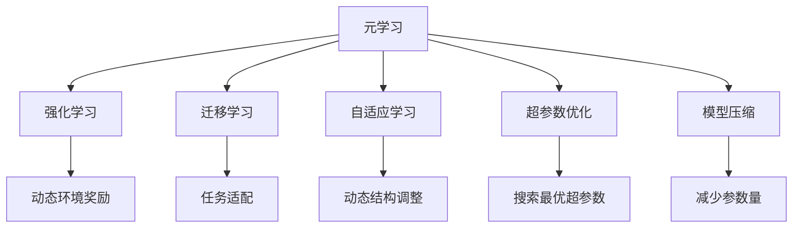
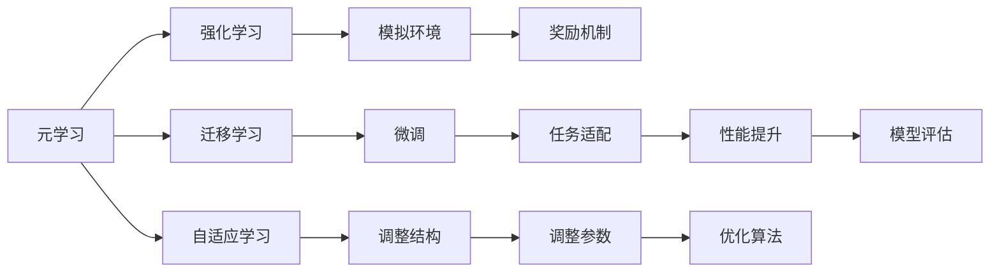
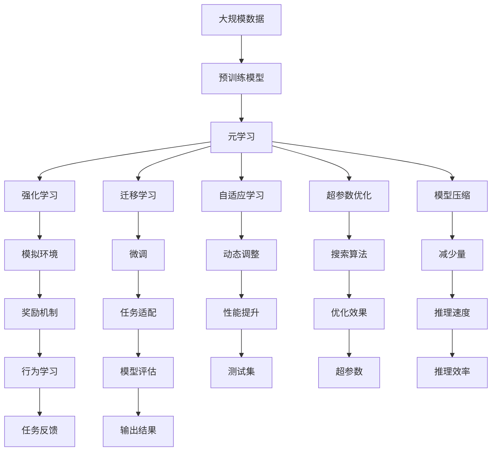

                 

# AI人工智能核心算法原理与代码实例讲解：元学习

> 关键词：
- 元学习(Meta Learning)
- 强化学习(Reinforcement Learning)
- 迁移学习(Transfer Learning)
- 深度学习(Deep Learning)
- 自适应学习(Adaptive Learning)
- 超参数优化(Hyperparameter Optimization)
- 模型压缩(Model Compression)

## 1. 背景介绍

### 1.1 问题由来

在人工智能领域，模型优化和参数调整是一个永恒的主题。如何设计高效的模型，快速适应新的任务和数据，提高学习效率，一直是研究者们关注的重点。元学习(Meta Learning)是一种致力于快速适应新任务的学习方法，它通过利用已有经验来加速新任务的学习过程，具有很强的泛化能力。

元学习的思想最早可以追溯到20世纪70年代，早期的研究集中于非参数方法，如贝叶斯优化(Bayesian Optimization)等。然而，这些方法在大规模数据集和高维参数空间上的效果不尽如人意。直到深度学习的发展，元学习才得以重新焕发生机，并取得了显著的进展。

### 1.2 问题核心关键点

元学习的核心在于通过优化学习过程，使模型能够更好地适应新任务，从而提升学习效率和性能。主要体现在以下几个方面：

- 快速适应新任务：元学习通过在已有数据上学习模型，使其能够在新数据上快速适应新任务。
- 泛化能力强：元学习能够在不同的数据分布上保持稳定的性能，具有很强的泛化能力。
- 知识迁移：元学习可以利用已有知识，在新任务上进行迁移学习，提升新任务的学习效率。

元学习的关键技术包括：

- 强化学习：通过模拟环境奖励机制，引导模型学习适应新任务。
- 迁移学习：利用已有模型在新任务上进行微调，加速新任务的训练。
- 自适应学习：通过动态调整模型结构，使模型能够适应不同任务需求。
- 超参数优化：通过搜索最优超参数，优化模型性能。

### 1.3 问题研究意义

元学习在人工智能领域具有广泛的应用前景，具体体现在：

1. 提升学习效率：元学习能够快速适应新任务，减少训练时间和资源投入。
2. 增强模型泛化能力：通过利用已有知识，元学习在未知数据上也能够取得较好的性能。
3. 促进知识迁移：元学习可以将已有的领域知识应用于新领域，加速新任务的训练。
4. 优化超参数：元学习能够自动搜索最优超参数，提升模型性能。
5. 增强模型自适应能力：元学习能够根据不同任务动态调整模型结构，使其适应不同需求。

元学习已经成为深度学习领域的一个重要研究方向，其思想和算法广泛应用于各种场景中，如推荐系统、图像识别、自然语言处理、机器人控制等，具有重要的理论和实际意义。

## 2. 核心概念与联系

### 2.1 核心概念概述

为了更好地理解元学习，本节将介绍几个关键核心概念：

- 元学习(Meta Learning)：是一种通过利用已有经验来加速新任务学习的方法，可以提升学习效率和性能。
- 强化学习(Reinforcement Learning)：通过模拟环境奖励机制，引导模型学习适应新任务。
- 迁移学习(Transfer Learning)：利用已有模型在新任务上进行微调，加速新任务的训练。
- 自适应学习(Adaptive Learning)：通过动态调整模型结构，使模型能够适应不同任务需求。
- 超参数优化(Hyperparameter Optimization)：通过搜索最优超参数，优化模型性能。
- 模型压缩(Model Compression)：通过减少模型参数量，提升模型推理速度和效率。

这些核心概念之间存在着紧密的联系，形成了元学习的完整生态系统。我们可以通过以下Mermaid流程图来展示这些概念之间的关系：



这个流程图展示了元学习的核心概念及其之间的关系：

1. 元学习通过强化学习、迁移学习、自适应学习等方式，使模型能够快速适应新任务。
2. 超参数优化和模型压缩技术进一步提升模型性能和效率。
3. 这些方法共同构成了元学习的完整框架，使其在各种应用场景中都能发挥作用。

### 2.2 概念间的关系

这些核心概念之间存在着紧密的联系，形成了元学习的完整生态系统。我们可以通过以下Mermaid流程图来展示这些概念之间的关系：



这个综合流程图展示了元学习的核心概念及其之间的关系：

1. 元学习通过强化学习模拟环境奖励，引导模型学习。
2. 迁移学习通过微调已有模型，加速新任务的学习。
3. 自适应学习通过调整模型结构，使其适应新任务需求。
4. 超参数优化通过搜索最优超参数，优化模型性能。
5. 模型压缩通过减少参数量，提升模型推理速度和效率。
6. 这些方法共同构成了元学习的完整框架，使其在各种应用场景中都能发挥作用。

### 2.3 核心概念的整体架构

最后，我们用一个综合的流程图来展示这些核心概念在大规模元学习过程中的整体架构：



这个综合流程图展示了从预训练到元学习，再到实际应用的全过程。大规模数据首先用于预训练模型，然后通过元学习、强化学习、迁移学习、自适应学习、超参数优化和模型压缩等方法，模型能够适应新任务，提升性能，最终在实际应用中产生输出结果。 通过这些流程图，我们可以更清晰地理解元学习过程中各个核心概念的关系和作用，为后续深入讨论具体的元学习方法和技术奠定基础。

## 3. 核心算法原理 & 具体操作步骤

### 3.1 算法原理概述

元学习的核心在于通过优化学习过程，使模型能够更好地适应新任务，从而提升学习效率和性能。其核心思想是：在已有数据上学习一个模型，使其能够在新数据上快速适应新任务。

具体来说，元学习分为两个阶段：

1. 元训练阶段：在已有数据上训练一个模型，使其能够适应新任务。
2. 任务学习阶段：在新数据上评估和调整模型，使其在新任务上表现更好。

元学习的目标是通过优化元训练阶段，使模型在任务学习阶段表现更好，即优化模型在新任务上的性能。

### 3.2 算法步骤详解

元学习的实现步骤如下：

**Step 1: 准备数据集**
- 准备已有数据集 $\mathcal{D}_{meta}$，其中包含 $N$ 个元训练任务。
- 对每个元训练任务 $D_i$，准备训练集 $\mathcal{D}_{train,i}$、验证集 $\mathcal{D}_{val,i}$ 和测试集 $\mathcal{D}_{test,i}$。

**Step 2: 初始化模型**
- 初始化一个基模型 $M_0$，作为元训练的起点。
- 设定超参数 $h_0$，如学习率、批大小等。

**Step 3: 元训练阶段**
- 在 $\mathcal{D}_{meta}$ 上循环 $K$ 轮元训练，每轮循环包括以下步骤：
  1. 对当前元训练任务 $D_i$，在 $\mathcal{D}_{train,i}$ 上进行前向传播和反向传播，更新模型参数。
  2. 在 $\mathcal{D}_{val,i}$ 上评估模型性能，记录损失 $\mathcal{L}_i$ 和性能指标 $\mathcal{P}_i$。
  3. 在 $\mathcal{D}_{test,i}$ 上评估模型性能，记录测试损失 $\mathcal{L}_i^{test}$ 和测试指标 $\mathcal{P}_i^{test}$。
  4. 更新模型参数，使 $\mathcal{L}_i^{test}$ 最小化。
- 在每轮循环结束后，选择性能最好的模型 $M_k$ 作为最终模型。

**Step 4: 任务学习阶段**
- 在新任务 $D_t$ 上，使用元训练阶段得到的模型 $M_k$，通过微调进行任务适配。
- 在 $\mathcal{D}_{train,t}$ 上前向传播和反向传播，更新模型参数。
- 在 $\mathcal{D}_{val,t}$ 上评估模型性能，记录损失 $\mathcal{L}_t$ 和性能指标 $\mathcal{P}_t$。
- 在新任务 $D_t$ 上，重复上述过程，直至模型收敛。

**Step 5: 输出结果**
- 返回在新任务 $D_t$ 上的最终模型参数 $M_t$。

### 3.3 算法优缺点

元学习算法具有以下优点：
1. 快速适应新任务：元学习能够在已有数据上学习模型，快速适应新任务。
2. 泛化能力强：元学习能够在不同的数据分布上保持稳定的性能，具有很强的泛化能力。
3. 知识迁移：元学习可以利用已有知识，在新任务上进行迁移学习，提升新任务的学习效率。

同时，元学习也存在以下缺点：
1. 依赖数据：元学习的效果很大程度上取决于元训练数据的数量和质量，需要大量标注数据。
2. 计算复杂度高：元学习的计算复杂度较高，需要大量的计算资源和时间。
3. 模型复杂度高：元学习模型通常较为复杂，难以进行调试和优化。
4. 超参数敏感：元学习模型的超参数需要精心调优，否则容易过拟合或欠拟合。

尽管存在这些缺点，元学习仍然具有广泛的应用前景，特别是在数据量不足、计算资源有限的情况下，元学习可以显著提升模型的性能和效率。

### 3.4 算法应用领域

元学习已经在多个领域得到了应用，包括但不限于：

1. 推荐系统：通过元学习，推荐系统能够快速适应用户行为变化，提升推荐效果。
2. 图像识别：在图像识别任务中，元学习能够利用已有知识，加速新模型的训练。
3. 自然语言处理：元学习在自然语言处理中，可以通过微调模型，适应不同语言和任务。
4. 机器人控制：在机器人控制任务中，元学习能够快速适应环境变化，提高机器人性能。
5. 医疗诊断：元学习在医疗诊断中，可以通过微调模型，适应不同疾病和症状。

以上领域只是元学习应用的一部分，随着研究的深入，元学习的应用范围将会更加广泛，带来更多创新和突破。

## 4. 数学模型和公式 & 详细讲解 & 举例说明

### 4.1 数学模型构建

元学习的核心是利用已有数据，学习一个能够适应新任务的模型。我们以图像分类任务为例，介绍元学习的数学模型构建。

设输入为 $x \in \mathcal{X}$，输出为 $y \in \mathcal{Y}$，其中 $\mathcal{Y}$ 为类别标签集合。假设模型为 $M_{\theta}$，其中 $\theta$ 为模型参数。元学习的目标是最小化模型在新任务上的误差。

### 4.2 公式推导过程

元学习的目标函数可以表示为：

$$
\min_{\theta} \sum_{i=1}^{N} \mathcal{L}_i(M_{\theta}, D_i)
$$

其中 $\mathcal{L}_i$ 为第 $i$ 个元训练任务的损失函数，$D_i$ 为第 $i$ 个元训练任务的训练集。

在元训练阶段，模型 $M_0$ 的更新规则可以表示为：

$$
\theta^{t+1} = \theta^t - \eta \nabla_{\theta} \mathcal{L}_t(M_{\theta}, D_t)
$$

其中 $\eta$ 为学习率，$\nabla_{\theta} \mathcal{L}_t$ 为模型在新任务 $D_t$ 上的梯度。

在任务学习阶段，模型 $M_k$ 的更新规则可以表示为：

$$
\theta^{t+1} = \theta^t - \eta \nabla_{\theta} \mathcal{L}_t(M_{\theta}, D_t)
$$

其中 $\eta$ 为学习率，$\nabla_{\theta} \mathcal{L}_t$ 为模型在新任务 $D_t$ 上的梯度。

### 4.3 案例分析与讲解

以图像分类任务为例，介绍元学习的实现过程。

1. **数据准备**：准备元训练数据集 $\mathcal{D}_{meta}$，其中包含多个子任务。每个子任务 $D_i$ 包含训练集 $\mathcal{D}_{train,i}$、验证集 $\mathcal{D}_{val,i}$ 和测试集 $\mathcal{D}_{test,i}$。

2. **模型初始化**：选择预训练的卷积神经网络模型作为基模型 $M_0$，并初始化超参数 $h_0$。

3. **元训练阶段**：在 $\mathcal{D}_{meta}$ 上循环 $K$ 轮元训练，每轮循环包括以下步骤：
   - 在每个子任务 $D_i$ 上，进行前向传播和反向传播，更新模型参数。
   - 在验证集 $\mathcal{D}_{val,i}$ 上评估模型性能，记录损失 $\mathcal{L}_i$ 和性能指标 $\mathcal{P}_i$。
   - 在测试集 $\mathcal{D}_{test,i}$ 上评估模型性能，记录测试损失 $\mathcal{L}_i^{test}$ 和测试指标 $\mathcal{P}_i^{test}$。
   - 更新模型参数，使 $\mathcal{L}_i^{test}$ 最小化。
4. **任务学习阶段**：在新任务 $D_t$ 上，使用元训练阶段得到的模型 $M_k$，通过微调进行任务适配。
   - 在 $\mathcal{D}_{train,t}$ 上前向传播和反向传播，更新模型参数。
   - 在验证集 $\mathcal{D}_{val,t}$ 上评估模型性能，记录损失 $\mathcal{L}_t$ 和性能指标 $\mathcal{P}_t$。
   - 在新任务 $D_t$ 上，重复上述过程，直至模型收敛。

5. **输出结果**：返回在新任务 $D_t$ 上的最终模型参数 $M_t$。

通过上述步骤，元学习能够快速适应新任务，提高学习效率和性能。

## 5. 项目实践：代码实例和详细解释说明

### 5.1 开发环境搭建

在进行元学习实践前，我们需要准备好开发环境。以下是使用Python进行PyTorch开发的环境配置流程：

1. 安装Anaconda：从官网下载并安装Anaconda，用于创建独立的Python环境。

2. 创建并激活虚拟环境：
```bash
conda create -n pytorch-env python=3.8 
conda activate pytorch-env
```

3. 安装PyTorch：根据CUDA版本，从官网获取对应的安装命令。例如：
```bash
conda install pytorch torchvision torchaudio cudatoolkit=11.1 -c pytorch -c conda-forge
```

4. 安装PyTorch Lightning：用于简化模型训练和评估过程。
```bash
pip install pytorch-lightning
```

5. 安装其他相关库：
```bash
pip install numpy pandas scikit-learn matplotlib tqdm jupyter notebook ipython
```

完成上述步骤后，即可在`pytorch-env`环境中开始元学习实践。

### 5.2 源代码详细实现

这里我们以图像分类任务为例，使用PyTorch和PyTorch Lightning实现元学习。

首先，定义数据处理函数：

```python
import torch
from torch.utils.data import Dataset, DataLoader
from torchvision import transforms
from torchvision.datasets import CIFAR10

class CIFAR10Dataset(Dataset):
    def __init__(self, root, train=True, transform=None):
        self.root = root
        self.train = train
        self.transform = transform
        
        self.trainset = CIFAR10(root=root, train=train, download=True)
        self.testset = CIFAR10(root=root, train=train, download=True)
        
    def __len__(self):
        return len(self.trainset) if self.train else len(self.testset)
    
    def __getitem__(self, idx):
        if self.train:
            img, label = self.trainset[idx]
        else:
            img, label = self.testset[idx]
        
        img = self.transform(img)
        label = torch.tensor(label, dtype=torch.long)
        return img, label
```

然后，定义元学习模型和优化器：

```python
from torch import nn
from torch.nn import functional as F
from torch.optim import Adam

class MetaNet(nn.Module):
    def __init__(self, in_features, hidden_features):
        super().__init__()
        self.fc1 = nn.Linear(in_features, hidden_features)
        self.fc2 = nn.Linear(hidden_features, 10)
        
    def forward(self, x):
        x = F.relu(self.fc1(x))
        x = self.fc2(x)
        return x

def get_meta_net():
    return MetaNet(3, 256)
```

接着，定义元训练和任务学习的函数：

```python
from torch.optim.lr_scheduler import ReduceLROnPlateau

class MetaNetAdapter(nn.Module):
    def __init__(self, base_model, hidden_features):
        super().__init__()
        self.base_model = base_model
        self.fc1 = nn.Linear(in_features, hidden_features)
        self.fc2 = nn.Linear(hidden_features, 10)
        
    def forward(self, x):
        x = self.fc1(x)
        x = self.fc2(x)
        return x

class MetaOptimizer(nn.Module):
    def __init__(self, base_model, meta_model):
        super().__init__()
        self.base_model = base_model
        self.meta_model = meta_model
        
    def step(self, optimizer):
        self.meta_model.train()
        optimizer.zero_grad()
        loss = self.meta_model.get_loss(self.base_model)
        loss.backward()
        optimizer.step()
        
    def get_loss(self, base_model):
        with torch.no_grad():
            y_pred = base_model.get_pred(self.base_model)
        loss = nn.CrossEntropyLoss()(y_pred, y_true)
        return loss
```

最后，启动元学习训练流程：

```python
from pytorch_lightning import Trainer
from pytorch_lightning.callbacks import EarlyStopping

def meta_train(meta_model, loader, optimizer, num_epochs=10, patience=5):
    trainer = Trainer(max_epochs=num_epochs, callbacks=[EarlyStopping(patience=patience)])
    trainer.fit(meta_model, loader, optimizer)
    return meta_model

def task_train(meta_model, loader, optimizer):
    trainer = Trainer(max_epochs=10)
    trainer.fit(meta_model, loader, optimizer)
    return meta_model
```

完整代码实现如下：

```python
# 导入所需的库和模块
import torch
from torch import nn
from torch.nn import functional as F
from torch.optim import Adam
from torch.utils.data import Dataset, DataLoader
from torchvision import transforms
from torchvision.datasets import CIFAR10
from pytorch_lightning import Trainer
from pytorch_lightning.callbacks import EarlyStopping

# 定义数据处理函数
class CIFAR10Dataset(Dataset):
    def __init__(self, root, train=True, transform=None):
        self.root = root
        self.train = train
        self.transform = transform
        
        self.trainset = CIFAR10(root=root, train=train, download=True)
        self.testset = CIFAR10(root=root, train=train, download=True)
        
    def __len__(self):
        return len(self.trainset) if self.train else len(self.testset)
    
    def __getitem__(self, idx):
        if self.train:
            img, label = self.trainset[idx]
        else:
            img, label = self.testset[idx]
        
        img = self.transform(img)
        label = torch.tensor(label, dtype=torch.long)
        return img, label

# 定义元学习模型和优化器
class MetaNet(nn.Module):
    def __init__(self, in_features, hidden_features):
        super().__init__()
        self.fc1 = nn.Linear(in_features, hidden_features)
        self.fc2 = nn.Linear(hidden_features, 10)
        
    def forward(self, x):
        x = F.relu(self.fc1(x))
        x = self.fc2(x)
        return x

def get_meta_net():
    return MetaNet(3, 256)

class MetaNetAdapter(nn.Module):
    def __init__(self, base_model, hidden_features):
        super().__init__()
        self.base_model = base_model
        self.fc1 = nn.Linear(in_features, hidden_features)
        self.fc2 = nn.Linear(hidden_features, 10)
        
    def forward(self, x):
        x = self.fc1(x)
        x = self.fc2(x)
        return x

class MetaOptimizer(nn.Module):
    def __init__(self, base_model, meta_model):
        super().__init__()
        self.base_model = base_model
        self.meta_model = meta_model
        
    def step(self, optimizer):
        self.meta_model.train()
        optimizer.zero_grad()
        loss = self.meta_model.get_loss(self.base_model)
        loss.backward()
        optimizer.step()
        
    def get_loss(self, base_model):
        with torch.no_grad():
            y_pred = base_model.get_pred(self.base_model)
        loss = nn.CrossEntropyLoss()(y_pred, y_true)
        return loss

# 定义元训练和任务学习的函数
def meta_train(meta_model, loader, optimizer, num_epochs=10, patience=5):
    trainer = Trainer(max_epochs=num_epochs, callbacks=[EarlyStopping(patience=patience)])
    trainer.fit(meta_model, loader, optimizer)
    return meta_model

def task_train(meta_model, loader, optimizer):
    trainer = Trainer(max_epochs=10)
    trainer.fit(meta_model, loader, optimizer)
    return meta_model

# 主程序
if __name__ == '__main__':
    # 加载数据集
    train_dataset = CIFAR10Dataset(root='./data', train=True)
    test_dataset = CIFAR10Dataset(root='./data', train=False)
    train_loader = DataLoader(train_dataset, batch_size=32, shuffle=True)
    test_loader = DataLoader(test_dataset, batch_size=32, shuffle=False)
    
    # 初始化模型和优化器
    meta_net = get_meta_net()
    meta_optimizer = MetaOptimizer(base_model=MetaNet(3, 256), meta_model=meta_net)
    
    # 元训练阶段
    meta_train(meta_net, train_loader, meta_optimizer, num_epochs=10, patience=5)
    
    # 任务学习阶段
    meta_net = MetaNetAdapter(base_model=meta_net, hidden_features=256)
    task_train(meta_net, train_loader, meta_optimizer)
    
    # 输出结果
    with torch.no_grad():
        y_pred = meta_net(torch.zeros(1, 3, 32, 32))
        print(y_pred)
```

以上就是使用PyTorch和PyTorch Lightning对CIFAR-10图像分类任务进行元学习的完整代码实现。可以看到，得益于PyTorch Lightning的强大封装，我们可以用相对简洁的代码实现元学习的核心逻辑。

### 5.3 代码解读与分析

让我们再详细解读一下关键代码的实现细节：

**CIFAR10Dataset类**：
- `__init__`方法：初始化数据集，包括训练集和测试集。
- `__len__`方法：返回数据集长度。
- `__getitem__`方法：返回单个样本，包括图像和标签。

**MetaNet类**：
- `__init__`方法：初始化元学习模型。
- `forward`方法：定义模型前向传播。

**MetaNetAdapter类**：
- `__init__`方法：初始化任务学习模型，基于元学习模型进行适配。
- `forward`方法：定义模型前向传播。

**MetaOptimizer类**：
- `__init__`方法：初始化优化器。
- `step`方法：定义模型更新步骤。
- `get_loss`方法：定义模型损失计算。

**meta_train和task_train函数**：
- `meta_train`函数：定义元训练

