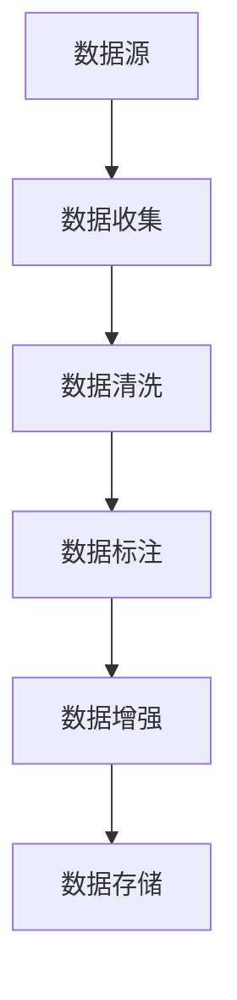

                 

# AI人工智能核心算法原理与代码实例讲解：数据收集

> 关键词：人工智能,数据收集,机器学习,深度学习,数据处理,数据增强,数据清洗,Python

## 1. 背景介绍

### 1.1 问题由来
在人工智能(AI)领域，数据是最核心的资源之一。无论是监督学习、无监督学习还是强化学习，都需要大量的高质量数据来训练模型，提取特征，并最终实现对现实世界的建模和预测。因此，数据收集是AI应用开发中的首要环节。然而，数据收集并不是一件容易的事情，既需要考虑到数据的规模、多样性、代表性，又需要处理数据的缺失、噪声、异常等问题。本文将从数据收集的基本原理入手，介绍如何高效、准确地进行数据收集，并给出相应的代码实例和详细解释。

### 1.2 问题核心关键点
数据收集的关键点包括以下几个方面：

- **数据来源**：明确数据从何而来，包括开源数据集、在线数据抓取、第三方数据购买等。
- **数据标注**：数据是否已经标注好，还是需要进行人工标注。
- **数据清洗**：去除数据中的缺失值、噪声、异常值等，确保数据的质量和完整性。
- **数据增强**：在现有数据基础上生成更多数据，提升数据的多样性和泛化能力。
- **数据存储**：选择合适的数据存储方式，保证数据的安全和易用性。

### 1.3 问题研究意义
数据收集的好坏直接影响AI模型的训练效果和应用表现。高效、准确的数据收集不仅能提高模型的性能，还能降低开发成本，加速项目进度。通过系统的学习和实践，开发者可以掌握数据收集的核心技术和技巧，构建高品质的数据集，为后续的AI应用开发打下坚实的基础。

## 2. 核心概念与联系

### 2.1 核心概念概述

在进行数据收集之前，我们需要先理解几个关键概念：

- **数据源**：数据来源，包括数据库、API接口、Web抓取、用户上传等。
- **数据标注**：对数据的属性进行标记和分类，使其具有明确的含义。
- **数据清洗**：通过预处理、修复、去重等手段，去除数据中的噪声和错误，提高数据质量。
- **数据增强**：通过对数据进行变换、合成、扩充，生成更多的训练样本，增强模型的泛化能力。
- **数据存储**：选择合适的数据存储格式和方式，保证数据的易用性和可扩展性。

### 2.2 概念间的关系

这些核心概念之间的逻辑关系可以通过以下Mermaid流程图来展示：



这个流程图展示了数据收集的基本流程：

1. 从数据源中收集原始数据。
2. 对数据进行清洗，去除噪声和错误。
3. 对清洗后的数据进行标注，赋予其明确的含义。
4. 通过数据增强，生成更多的训练样本。
5. 最终将数据存储起来，供后续分析和训练使用。

## 3. 核心算法原理 & 具体操作步骤

### 3.1 算法原理概述

数据收集的算法原理主要基于数据清洗和数据增强两个核心步骤。数据清洗是通过预处理、修复和去重等手段，去除数据中的噪声和错误，保证数据的准确性和完整性。数据增强则是通过变换、合成和扩充等方法，生成更多的训练样本，提升模型的泛化能力。

### 3.2 算法步骤详解

#### 3.2.1 数据清洗

数据清洗是数据收集中的重要环节，其主要步骤如下：

1. **缺失值处理**：检测并填充缺失值，常见的处理方法包括均值填补、中值填补、插值法等。
2. **噪声去除**：检测并去除异常值和噪声数据，常见的技术包括统计过滤、平滑法、聚类法等。
3. **数据去重**：检测并去除重复数据，避免重复样本对模型训练造成影响。
4. **数据标准化**：将数据标准化到某个分布，如高斯分布、均匀分布等，便于后续的分析和处理。

#### 3.2.2 数据增强

数据增强的主要目的在于扩充训练数据集，提升模型的泛化能力。常见的数据增强方法包括：

1. **数据变换**：通过旋转、缩放、翻转等变换，生成更多的样本。
2. **数据合成**：通过合成新数据，增加样本的多样性。
3. **数据扩充**：通过组合和随机生成等方法，扩充训练集。

### 3.3 算法优缺点

数据收集的优点在于，通过系统的数据清洗和增强，可以提高数据的质量和多样性，降低模型的过拟合风险，提升模型的泛化能力。缺点在于，数据收集需要耗费大量时间和资源，特别是在大规模数据集上，清洗和增强过程尤为繁琐。此外，数据收集过程可能会受到数据源的限制，获取高质量数据成本较高。

### 3.4 算法应用领域

数据收集技术广泛应用于各种AI应用领域，包括：

- **计算机视觉**：用于图像分类、目标检测、图像分割等任务的数据收集。
- **自然语言处理**：用于文本分类、情感分析、机器翻译等任务的数据收集。
- **推荐系统**：用于用户行为分析、物品推荐、广告投放等任务的数据收集。
- **金融分析**：用于股票交易、信用评分、风险评估等任务的数据收集。

## 4. 数学模型和公式 & 详细讲解 & 举例说明

### 4.1 数学模型构建

在进行数据收集和处理时，我们通常会使用一些数学模型来描述和分析数据。以下是一些常用的数学模型及其基本公式：

- **缺失值处理**：
  $$
  \hat{x}_{ij} = \begin{cases} 
  x_{ij}, & x_{ij} \neq \text{NaN} \\
  \bar{x}_j, & x_{ij} = \text{NaN}
  \end{cases}
  $$
  其中 $\hat{x}_{ij}$ 表示第 $i$ 个样本的第 $j$ 个特征的估计值，$\bar{x}_j$ 表示特征 $j$ 的均值。

- **噪声去除**：
  $$
  x_{ij} = \begin{cases} 
  x_{ij}, & |x_{ij} - \bar{x}_j| < \sigma \\
  \text{NaN}, & |x_{ij} - \bar{x}_j| \geq \sigma
  \end{cases}
  $$
  其中 $x_{ij}$ 表示第 $i$ 个样本的第 $j$ 个特征，$\bar{x}_j$ 表示特征 $j$ 的均值，$\sigma$ 表示噪声的阈值。

- **数据去重**：
  $$
  \hat{x}_{ij} = \begin{cases} 
  x_{ij}, & \text{unique}_j(x_{ij}) = 1 \\
  \text{NaN}, & \text{unique}_j(x_{ij}) > 1
  \end{cases}
  $$
  其中 $\text{unique}_j(x_{ij})$ 表示特征 $j$ 的唯一性，$x_{ij}$ 表示第 $i$ 个样本的第 $j$ 个特征。

- **数据标准化**：
  $$
  z_{ij} = \frac{x_{ij} - \mu_j}{\sigma_j}
  $$
  其中 $z_{ij}$ 表示第 $i$ 个样本的第 $j$ 个特征的标准化值，$\mu_j$ 表示特征 $j$ 的均值，$\sigma_j$ 表示特征 $j$ 的标准差。

### 4.2 公式推导过程

这些数学模型的推导过程如下：

- **缺失值处理**：使用均值填补法，通过均值来替代缺失值，减少数据丢失。
- **噪声去除**：通过计算数据与均值之间的差异，判断数据是否为噪声，从而去除异常值。
- **数据去重**：通过检测特征的唯一性，去除重复数据，避免重复样本对模型训练的影响。
- **数据标准化**：通过减去均值并除以标准差，将数据标准化到标准正态分布，便于后续的分析和处理。

### 4.3 案例分析与讲解

假设我们有一份用户评分数据集，其中包含用户对商品的评分信息。数据集中存在一些缺失值和噪声，需要进行清洗和处理。我们可以使用Python的pandas库来进行数据清洗和增强。

```python
import pandas as pd

# 加载数据集
data = pd.read_csv('user_ratings.csv')

# 缺失值处理
data.fillna(data.mean(), inplace=True)

# 噪声去除
data = data[abs(data - data.mean()) < 3 * data.std()]

# 数据去重
data = data.drop_duplicates()

# 数据标准化
data = (data - data.mean()) / data.std()
```

在上述代码中，我们首先使用均值填补法处理缺失值，然后使用统计过滤法去除噪声，最后使用去重函数删除重复数据，并使用标准化方法将数据标准化到标准正态分布。

## 5. 项目实践：代码实例和详细解释说明

### 5.1 开发环境搭建

在进行数据收集的代码实践之前，我们需要准备好开发环境。以下是使用Python进行pandas库开发的环境配置流程：

1. 安装Anaconda：从官网下载并安装Anaconda，用于创建独立的Python环境。

2. 创建并激活虚拟环境：
```bash
conda create -n pydata-env python=3.8 
conda activate pydata-env
```

3. 安装pandas：
```bash
pip install pandas
```

4. 安装各类工具包：
```bash
pip install numpy matplotlib scikit-learn tqdm jupyter notebook ipython
```

完成上述步骤后，即可在`pydata-env`环境中开始数据收集的实践。

### 5.2 源代码详细实现

下面我们以用户评分数据集为例，给出使用pandas库进行数据清洗和增强的Python代码实现。

```python
import pandas as pd

# 加载数据集
data = pd.read_csv('user_ratings.csv')

# 缺失值处理
data.fillna(data.mean(), inplace=True)

# 噪声去除
data = data[abs(data - data.mean()) < 3 * data.std()]

# 数据去重
data = data.drop_duplicates()

# 数据标准化
data = (data - data.mean()) / data.std()

# 数据增强
# 数据变换
data['transformed'] = data['rating'] * 2 + 1

# 数据合成
data['synthetic'] = data['rating'] + data['time'] / 1000

# 数据扩充
data['expanded'] = pd.concat([data[['rating', 'time']], data[['rating', 'time']].assign(time=3 * data['time'])])
```

在上述代码中，我们首先加载用户评分数据集，然后使用均值填补法处理缺失值，使用统计过滤法去除噪声，使用去重函数删除重复数据，使用标准化方法将数据标准化到标准正态分布。最后，通过数据变换、数据合成和数据扩充等方法，生成更多的训练样本。

### 5.3 代码解读与分析

让我们再详细解读一下关键代码的实现细节：

**缺失值处理**：
- `data.fillna(data.mean(), inplace=True)`：使用均值填补法处理缺失值，其中`inplace=True`表示在原数据集上进行修改。

**噪声去除**：
- `data = data[abs(data - data.mean()) < 3 * data.std()]`：通过计算数据与均值之间的差异，判断数据是否为噪声，从而去除异常值。

**数据去重**：
- `data = data.drop_duplicates()`：使用去重函数删除重复数据，避免重复样本对模型训练的影响。

**数据标准化**：
- `data = (data - data.mean()) / data.std()`：通过减去均值并除以标准差，将数据标准化到标准正态分布，便于后续的分析和处理。

**数据增强**：
- `data['transformed'] = data['rating'] * 2 + 1`：对数据进行变换，生成新的样本。
- `data['synthetic'] = data['rating'] + data['time'] / 1000`：通过合成新数据，增加样本的多样性。
- `data['expanded'] = pd.concat([data[['rating', 'time']], data[['rating', 'time']].assign(time=3 * data['time'])]`：通过组合和随机生成等方法，扩充训练集。

**运行结果展示**：
- 使用`print(data.head())`命令，可以打印出前5行数据，验证数据清洗和增强的效果。

## 6. 实际应用场景

### 6.1 智能推荐系统

智能推荐系统需要大量的用户行为数据来训练推荐模型，提升推荐效果。通过高效的数据收集和处理，可以构建高质量的数据集，为推荐模型的训练提供坚实的基础。

在技术实现上，可以通过爬虫技术抓取用户的行为数据，包括浏览记录、购买记录、评分记录等。然后使用数据清洗和增强技术，去除噪声和异常数据，生成更多的训练样本。最后将处理后的数据存储起来，供推荐模型的训练和预测使用。

### 6.2 金融风控系统

金融风控系统需要大量的用户信用数据来评估风险，预测违约概率。通过高效的数据收集和处理，可以构建高质量的数据集，为风控模型的训练提供坚实的基础。

在技术实现上，可以通过爬虫技术抓取用户的信用数据，包括贷款记录、消费记录、还款记录等。然后使用数据清洗和增强技术，去除噪声和异常数据，生成更多的训练样本。最后将处理后的数据存储起来，供风控模型的训练和预测使用。

### 6.3 医疗影像分析

医疗影像分析需要大量的患者影像数据来训练诊断模型，提升诊断效果。通过高效的数据收集和处理，可以构建高质量的数据集，为诊断模型的训练提供坚实的基础。

在技术实现上，可以通过医疗影像系统抓取患者影像数据，包括CT影像、MRI影像等。然后使用数据清洗和增强技术，去除噪声和异常数据，生成更多的训练样本。最后将处理后的数据存储起来，供诊断模型的训练和预测使用。

### 6.4 未来应用展望

随着人工智能技术的不断发展，数据收集和处理技术也在不断进步。未来，大模型微调技术将会有更多的应用场景，其数据收集和处理技术也会不断优化。

在智慧医疗领域，通过高效的数据收集和处理，可以构建高质量的电子健康记录(EHR)数据集，为疾病预测、治疗方案推荐等应用提供坚实的基础。在智能城市治理中，通过高效的数据收集和处理，可以构建高质量的城市运行数据集，为城市交通管理、环境监测等应用提供坚实的基础。

## 7. 工具和资源推荐

### 7.1 学习资源推荐

为了帮助开发者系统掌握数据收集和处理的核心技术和技巧，这里推荐一些优质的学习资源：

1. **《Python数据科学手册》**：涵盖了Python在数据处理、数据分析、机器学习等方面的基本概念和实践技巧，是数据科学入门的经典教材。

2. **《机器学习实战》**：通过大量的代码实例，介绍机器学习算法的实现和应用，帮助读者理解和掌握机器学习技术。

3. **Coursera《数据科学导论》课程**：由斯坦福大学开设的入门课程，系统讲解数据收集、数据处理、机器学习等基础知识，适合初学者学习。

4. **Kaggle**：全球最大的数据科学竞赛平台，提供大量的数据集和竞赛任务，帮助开发者实践和提升自己的数据处理能力。

5. **Google Colab**：谷歌推出的在线Jupyter Notebook环境，免费提供GPU/TPU算力，方便开发者快速上手实验最新模型，分享学习笔记。

通过对这些资源的学习实践，相信你一定能够快速掌握数据收集和处理的核心技术和技巧，构建高质量的数据集，为后续的AI应用开发打下坚实的基础。

### 7.2 开发工具推荐

高效的开发离不开优秀的工具支持。以下是几款用于数据收集和处理开发的常用工具：

1. **pandas**：Python中的数据处理库，提供了强大的数据清洗和增强功能，适合处理各种类型的数据。
2. **NumPy**：Python中的数值计算库，提供了高效的数组和矩阵运算功能，适合进行复杂的数值计算。
3. **SciPy**：Python中的科学计算库，提供了丰富的数学和科学计算功能，适合进行科学数据分析。
4. **Matplotlib**：Python中的数据可视化库，提供了丰富的图表绘制功能，适合进行数据可视化。
5. **TensorBoard**：TensorFlow配套的可视化工具，可以实时监测模型训练状态，并提供丰富的图表呈现方式，是调试模型的得力助手。

合理利用这些工具，可以显著提升数据收集和处理的开发效率，加快创新迭代的步伐。

### 7.3 相关论文推荐

数据收集和处理技术的发展源于学界的持续研究。以下是几篇奠基性的相关论文，推荐阅读：

1. **《Data Collection and Preprocessing for Machine Learning》**：介绍数据收集和处理的基本概念和实践技巧，是数据科学领域的经典文献。

2. **《Data Augmentation for Deep Learning》**：详细介绍了数据增强的原理和实现方法，是数据增强技术的重要参考文献。

3. **《Data Preprocessing in Machine Learning》**：系统讲解数据清洗、数据标准化等处理技术，是数据科学入门的经典教材。

4. **《Data Collection and Management in Big Data Environments》**：介绍大数据环境下的数据收集和管理技术，是大数据领域的经典文献。

这些论文代表了大数据处理技术的发展脉络。通过学习这些前沿成果，可以帮助研究者把握学科前进方向，激发更多的创新灵感。

除上述资源外，还有一些值得关注的前沿资源，帮助开发者紧跟数据处理技术的最新进展，例如：

1. **arXiv论文预印本**：人工智能领域最新研究成果的发布平台，包括大量尚未发表的前沿工作，学习前沿技术的必读资源。

2. **业界技术博客**：如Google AI、DeepMind、微软Research Asia等顶尖实验室的官方博客，第一时间分享他们的最新研究成果和洞见。

3. **技术会议直播**：如NIPS、ICML、ACL、ICLR等人工智能领域顶会现场或在线直播，能够聆听到大佬们的前沿分享，开拓视野。

4. **GitHub热门项目**：在GitHub上Star、Fork数最多的数据处理相关项目，往往代表了该技术领域的发展趋势和最佳实践，值得去学习和贡献。

5. **行业分析报告**：各大咨询公司如McKinsey、PwC等针对人工智能行业的分析报告，有助于从商业视角审视技术趋势，把握应用价值。

总之，对于数据收集和处理技术的学习和实践，需要开发者保持开放的心态和持续学习的意愿。多关注前沿资讯，多动手实践，多思考总结，必将收获满满的成长收益。

## 8. 总结：未来发展趋势与挑战

### 8.1 总结

本文对数据收集的基本原理和实践方法进行了全面系统的介绍。首先阐述了数据收集的重要性，明确了数据收集在AI应用开发中的核心地位。其次，从数据来源、数据标注、数据清洗、数据增强等多个方面，详细讲解了数据收集的核心技术和流程。最后，给出了相应的代码实例和详细解释，帮助读者更好地理解和应用数据收集技术。

通过本文的系统梳理，可以看到，数据收集是AI应用开发中的关键环节，其质量直接影响后续模型训练和应用效果。高效、准确的数据收集不仅能提高模型的性能，还能降低开发成本，加速项目进度。未来，随着数据处理技术的不断发展，数据收集和处理将成为AI技术的重要组成部分，为AI应用的广泛落地提供坚实的基础。

### 8.2 未来发展趋势

展望未来，数据收集技术将呈现以下几个发展趋势：

1. **自动化数据收集**：利用机器学习和自然语言处理技术，自动化地收集和管理数据，减少人工干预和成本。
2. **跨平台数据整合**：通过数据湖、数据仓库等技术，整合来自不同平台的数据，提升数据的多样性和丰富性。
3. **实时数据处理**：利用流处理技术，实时采集和处理数据，提升数据的时效性和实时性。
4. **数据隐私保护**：通过差分隐私、联邦学习等技术，保护数据的隐私和安全性，防止数据泄露和滥用。
5. **数据增强技术的创新**：未来的数据增强技术将更加智能化和多样化，能够生成更加丰富和多样化的训练样本。

### 8.3 面临的挑战

尽管数据收集技术已经取得了显著进展，但在迈向更加智能化、普适化应用的过程中，仍面临诸多挑战：

1. **数据质量问题**：数据收集过程中可能存在数据缺失、噪声、异常等问题，影响数据质量。
2. **数据标注成本**：高质量标注数据往往成本较高，特别是在大规模数据集上，标注成本更是居高不下。
3. **数据隐私和安全**：数据收集和处理过程中需要保护用户隐私和数据安全，防止数据泄露和滥用。
4. **数据存储和传输**：大规模数据集存储和传输过程中，需要考虑存储成本、传输速度和可靠性等问题。
5. **数据处理的效率**：数据处理过程往往耗时较长，如何提高数据处理效率，减少处理时间，是数据收集和处理的难点之一。

### 8.4 研究展望

未来的数据收集和处理技术需要在以下几个方面进行深入研究：

1. **自动化数据收集和处理**：通过机器学习和自然语言处理技术，实现数据的自动化收集和处理，减少人工干预和成本。
2. **数据隐私保护**：通过差分隐私、联邦学习等技术，保护数据的隐私和安全性，防止数据泄露和滥用。
3. **实时数据处理**：利用流处理技术，实时采集和处理数据，提升数据的时效性和实时性。
4. **数据增强技术的创新**：未来的数据增强技术将更加智能化和多样化，能够生成更加丰富和多样化的训练样本。
5. **数据处理的效率**：研究高效的算法和工具，提高数据处理效率，减少处理时间，优化数据收集和处理流程。

这些研究方向将引领数据收集和处理技术的发展，为AI应用的广泛落地提供坚实的基础。相信随着技术的不断进步，数据收集和处理将成为AI技术的重要组成部分，为AI应用的广泛落地提供坚实的基础。

## 9. 附录：常见问题与解答

**Q1：数据收集是否需要人工标注？**

A: 数据收集可以有两种方式：人工标注和自动标注。人工标注成本较高，但数据质量较好；自动标注成本较低，但数据质量较差。在实践中，通常会根据数据的特性和任务的要求，选择合适的方式进行标注。对于标注成本较高且数据质量要求较高的任务，可以选择人工标注；对于标注成本较低且数据质量要求不高的任务，可以选择自动标注。

**Q2：数据清洗和数据增强有什么区别？**

A: 数据清洗和数据增强是数据处理中的两个重要环节，但它们的目的不同。数据清洗的目的是去除数据中的噪声和错误，提升数据的质量和完整性；数据增强的目的是通过变换、合成和扩充等方法，生成更多的训练样本，提升模型的泛化能力。数据清洗和数据增强可以相互配合，共同提升数据集的质量和多样性。

**Q3：数据收集是否需要存储？**

A: 数据收集的主要目的是为后续的分析和训练提供数据支持，因此数据的存储是必要的。数据存储的方式可以有多种，包括本地存储、云存储、数据库存储等。选择合适的数据存储方式，可以保证数据的可访问性和可扩展性，便于后续的数据分析和模型训练。

**Q4：数据收集的效率如何提升？**

A: 数据收集的效率可以通过以下几种方式提升：

1. **自动化数据收集**：利用机器学习和自然语言处理技术，自动化地收集和管理数据，减少人工干预和成本。
2. **分布式数据处理**：利用分布式计算技术，将数据处理任务分配到多个计算节点上，提升处理效率。
3. **数据预处理**：对数据进行预处理，如去重、去噪、标准化等，减少后续处理的复杂度和时间。
4. **数据压缩和优化**：对数据进行压缩和优化，减少存储和传输的时间和成本。
5. **高效的数据库和存储技术**：选择合适的数据库和存储技术，如Hadoop、Spark等，提升数据处理效率。

这些方法可以相互配合，共同提升数据收集的效率和质量。

**Q5：数据增强的常用方法有哪些？**

A: 数据增强的常用方法包括：

1. **数据变换**：通过旋转、缩放、翻转等变换，生成更多的样本。
2. **数据合成**：通过合成新数据，增加样本的多样性。
3. **数据扩充**：通过组合和随机生成等方法，扩充训练集。
4. **数据泛化**：通过数据泛化技术，生成与原始数据类似但具有不同特征的样本。
5. **数据增强工具**：利用各种数据增强工具，如DeepImage、Augment等，快速生成增强样本。

这些方法可以相互配合，共同提升数据集的质量和多样性。

总之，数据收集是大规模AI应用开发中的关键环节，其质量直接影响后续模型训练和应用效果。高效、准确的数据收集不仅能提高模型的性能，还能降低开发成本，加速项目进度。未来，随着数据处理技术的不断发展，数据收集和处理将成为AI技术的重要组成部分，为AI应用的广泛落地提供坚实的基础。

