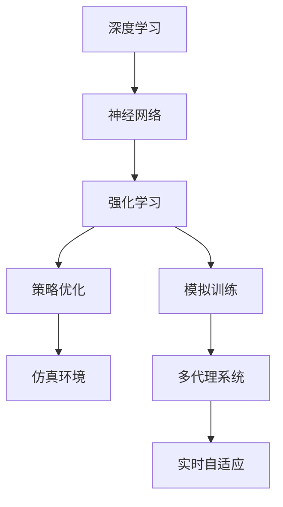
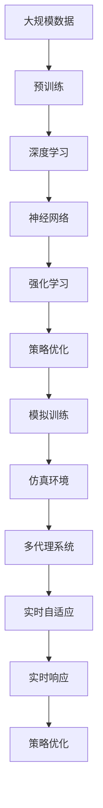

                 

# AI人工智能深度学习算法：在视频游戏中的自适应机制

> 关键词：深度学习,视频游戏,自适应,强化学习,神经网络,策略优化,模拟训练,仿真环境,多代理系统

## 1. 背景介绍

### 1.1 问题由来
随着人工智能技术的迅速发展，深度学习已经在计算机视觉、自然语言处理、语音识别等领域取得了显著的进展。而在视频游戏领域，深度学习也逐渐成为解决复杂环境感知、智能决策等问题的有力工具。特别是自适应机制的引入，使得AI能够在不断变化的游戏中自动调整策略，实现更高的智能水平。

### 1.2 问题核心关键点
自适应机制在视频游戏中的应用，主要体现在以下几个方面：
- **实时响应**：在游戏中，环境变化速度较快，AI需要实时调整策略，以应对突发事件或环境变化。
- **策略优化**：AI需要根据历史经验和当前状态，优化策略选择，从而在复杂的环境中取得最佳表现。
- **多代理协作**：在游戏中，常常需要多个AI协同工作，以实现复杂的团队协作任务。自适应机制可以帮助每个AI根据任务需求调整策略，提升整体系统的效率和性能。
- **仿真训练**：为了训练和测试自适应算法，需要构建高仿真的模拟环境，以真实模拟游戏场景。

这些核心关键点共同构成了视频游戏中自适应机制的研究框架，使得AI能够在复杂多变的游戏环境中发挥更高的智能水平。

### 1.3 问题研究意义
研究视频游戏中的自适应机制，对于提升AI在实时环境中的智能决策能力，推动游戏行业的智能化进程，具有重要意义：

1. **提升游戏体验**：通过自适应机制，AI能够在复杂的游戏环境中自发调整行为，提升游戏的挑战性和趣味性，丰富玩家的游戏体验。
2. **降低开发成本**：自适应机制使AI能够自动适应游戏环境变化，减少了手动调整策略的复杂性和成本。
3. **促进AI技术发展**：自适应算法的研究和应用，推动了深度学习、强化学习等AI技术的进步，加速了AI技术在各领域的普及。
4. **增强系统鲁棒性**：通过实时适应环境变化，AI系统能够更好地应对突发情况，提高系统的稳定性和鲁棒性。
5. **推动游戏行业创新**：自适应机制的应用，催生了更多创新的游戏模式和玩法，拓宽了游戏设计的边界。

## 2. 核心概念与联系

### 2.1 核心概念概述

为更好地理解视频游戏中自适应机制，本节将介绍几个密切相关的核心概念：

- **深度学习**：一种基于多层神经网络的机器学习技术，可以处理大规模非线性数据，广泛应用于图像识别、语音处理、自然语言处理等领域。
- **强化学习**：一种通过与环境交互，学习最优策略的机器学习范式，常用于自动驾驶、机器人控制、游戏AI等领域。
- **神经网络**：一种模拟人脑神经元网络的计算模型，能够进行模式识别、图像处理、自然语言处理等任务。
- **策略优化**：通过优化策略选择，使得AI在特定环境中取得最佳表现。常见的方法包括策略梯度、Q-learning等。
- **模拟训练**：在虚拟环境中训练AI模型，通过大量模拟数据，提升AI的决策能力。
- **仿真环境**：高仿真的模拟环境，用于训练和测试AI模型，以逼近真实环境。
- **多代理系统**：由多个AI协同工作的系统，常用于团队协作、复杂环境感知等任务。

这些核心概念之间的逻辑关系可以通过以下Mermaid流程图来展示：



这个流程图展示了大语言模型微调过程中各个核心概念之间的关系：

1. 深度学习通过神经网络，能够处理大规模非线性数据。
2. 强化学习通过策略优化，学习最优策略，适应环境变化。
3. 神经网络、策略优化和模拟训练构成了训练自适应算法的基本框架。
4. 仿真环境用于模拟真实环境，提升自适应算法的效果。
5. 多代理系统协同工作，提升系统的复杂任务处理能力。
6. 实时自适应机制使AI能够在复杂环境中快速调整策略，实现更好的表现。

### 2.2 概念间的关系

这些核心概念之间存在着紧密的联系，形成了视频游戏自适应机制的完整生态系统。下面我通过几个Mermaid流程图来展示这些概念之间的关系。

#### 2.2.1 深度学习与强化学习的关系


这个流程图展示了深度学习和强化学习的关系。深度学习通过神经网络，处理数据输入，并提取特征；强化学习通过策略优化，学习最优策略，适应环境变化。

#### 2.2.2 模拟训练与多代理系统的关系


这个流程图展示了模拟训练与多代理系统的关系。模拟训练在仿真环境中，对多代理系统进行训练，提升系统整体的智能水平。

#### 2.2.3 实时自适应机制


这个流程图展示了实时自适应机制的构成。通过策略优化，AI系统能够在模拟训练中学习适应环境变化的策略。这些策略在仿真环境中进行验证和优化，最终实现实时自适应。

### 2.3 核心概念的整体架构

最后，我们用一个综合的流程图来展示这些核心概念在大语言模型微调过程中的整体架构：



这个综合流程图展示了从预训练到实时自适应的完整过程。大语言模型首先在大规模数据上进行预训练，然后通过深度学习和神经网络处理输入数据，并通过强化学习和策略优化学习最优策略，最后在仿真环境和多代理系统中进行模拟训练，实现实时自适应和实时响应。

## 3. 核心算法原理 & 具体操作步骤
### 3.1 算法原理概述

视频游戏自适应机制的核心算法，是深度学习、强化学习和策略优化相结合的混合算法。其核心思想是：利用深度学习提取游戏环境特征，通过强化学习学习最优策略，在实时环境中进行策略优化，最终实现系统的实时自适应。

形式化地，假设游戏环境为 $\mathcal{E}$，游戏策略为 $\pi$，玩家历史状态为 $s_t$，玩家当前动作为 $a_t$，玩家奖励为 $r_t$。则自适应机制的目标是最大化期望累计奖励 $\mathcal{R}$：

$$
\max_{\pi} \mathbb{E}[\sum_{t=1}^{T} r_t]
$$

其中 $T$ 为游戏总回合数。自适应算法通过不断调整策略 $\pi$，使得累计奖励 $\mathcal{R}$ 最大化。

### 3.2 算法步骤详解

视频游戏自适应机制通常包括以下几个关键步骤：

**Step 1: 准备数据和环境**
- 收集游戏环境数据，包括游戏地图、玩家状态、游戏物品等。
- 构建仿真环境，用于训练和测试AI模型。

**Step 2: 预训练神经网络**
- 使用大规模游戏数据对神经网络进行预训练，提取环境特征。
- 优化神经网络结构，提升特征提取能力。

**Step 3: 训练强化学习模型**
- 在仿真环境中，使用强化学习算法训练AI模型，学习最优策略。
- 通过策略梯度、Q-learning等方法，优化策略选择。

**Step 4: 进行模拟训练**
- 在仿真环境中，对多代理系统进行模拟训练，验证自适应机制的效果。
- 通过多次迭代，不断优化策略，提升系统的智能水平。

**Step 5: 部署和测试**
- 将训练好的AI模型部署到实际游戏中。
- 在实际游戏中测试自适应机制的效果，根据反馈进行调整和优化。

**Step 6: 持续优化**
- 根据实际游戏数据，持续优化自适应机制，提升系统性能。
- 不断更新训练数据，保持系统的鲁棒性和适应性。

以上是视频游戏自适应机制的一般流程。在实际应用中，还需要根据具体游戏特点，对各个环节进行优化设计，以提升系统效果。

### 3.3 算法优缺点

视频游戏自适应机制具有以下优点：
1. 实时响应：能够快速适应环境变化，及时调整策略，提升游戏智能水平。
2. 策略优化：通过不断学习，改进策略选择，提升系统性能。
3. 多代理协作：能够协同工作，解决复杂任务，提升系统效率。
4. 仿真训练：能够在高仿真环境中进行训练，避免实际操作中的风险。

同时，这种算法也存在一些缺点：
1. 训练成本高：需要大量游戏数据和仿真环境，训练成本较高。
2. 泛化能力有限：在仿真环境中训练的模型，可能无法很好地适应实际游戏环境。
3. 计算资源需求大：大规模神经网络和强化学习模型，需要大量的计算资源。
4. 难以解释：深度学习和强化学习模型通常缺乏可解释性，难以理解其内部工作机制。
5. 复杂度高：设计复杂，需要多学科知识协同工作，实施难度较大。

尽管存在这些缺点，但总体而言，视频游戏自适应机制在提升游戏智能水平、优化玩家体验方面具有重要价值。

### 3.4 算法应用领域

视频游戏自适应机制已经在多个领域得到了广泛的应用，包括但不限于：

- **动作游戏**：通过实时调整策略，AI能够更好地应对游戏中的复杂环境和突发事件。
- **策略游戏**：AI能够在复杂的环境中，制定最优策略，实现更高的胜利率。
- **角色扮演游戏**：AI能够根据玩家的行为和任务需求，动态调整角色行为和对话。
- **模拟游戏**：AI能够模拟复杂的现实环境，提升游戏的真实感和沉浸感。
- **体育游戏**：AI能够在比赛中，实时调整策略，提升比赛水平。

除了这些经典应用外，视频游戏自适应机制还在教育、军事、医疗等领域得到了创新性的应用，为这些领域的智能化发展带来了新的思路。

## 4. 数学模型和公式 & 详细讲解 & 举例说明（备注：数学公式请使用latex格式，latex嵌入文中独立段落使用 $$，段落内使用 $)
### 4.1 数学模型构建

本节将使用数学语言对视频游戏自适应机制进行更加严格的刻画。

假设游戏环境为 $\mathcal{E}$，玩家当前状态为 $s_t$，玩家当前动作为 $a_t$，玩家当前奖励为 $r_t$。则自适应机制的数学模型可以表示为：

$$
\begin{aligned}
\mathcal{R} &= \mathbb{E}[\sum_{t=1}^{T} r_t] \\
&= \sum_{t=1}^{T} \mathbb{E}[r_t] \\
&= \sum_{t=1}^{T} \mathcal{R}_t
\end{aligned}
$$

其中，$r_t$ 为玩家当前奖励，$\mathcal{R}_t$ 为玩家在第 $t$ 回合的期望累计奖励。

### 4.2 公式推导过程

以下我们以Q-learning算法为例，推导强化学习中策略优化公式。

假设玩家当前状态为 $s_t$，当前动作为 $a_t$，奖励为 $r_t$，则Q-learning算法中，状态-动作对 $(s_t,a_t)$ 的Q值更新公式为：

$$
Q(s_t,a_t) = Q(s_t,a_t) + \alpha(r_t + \gamma \max_{a_{t+1}} Q(s_{t+1},a_{t+1}) - Q(s_t,a_t))
$$

其中，$\alpha$ 为学习率，$\gamma$ 为折扣因子。

根据Q-learning算法，状态-动作对 $(s_t,a_t)$ 的Q值表示在该状态下，采取动作 $a_t$ 的长期期望回报。通过不断更新Q值，优化策略选择，使得累计奖励最大化。

### 4.3 案例分析与讲解

以下通过一个简单的Q-learning算法案例，分析其效果和局限性。

假设游戏环境为一个迷宫，玩家需要通过迷宫到达终点。玩家每次移动，可以向前、向左或向右移动，但只能朝一个方向移动一次。每次移动，玩家会获得1个奖励，到达终点则获得10个奖励。

**Step 1: 初始化Q值**

首先，将所有状态-动作对的Q值初始化为0。

**Step 2: 计算最优动作**

对于每个状态 $s_t$，计算所有可能动作 $a_t$ 对应的Q值，选择Q值最大的动作 $a_t$ 作为最优动作。

**Step 3: 更新Q值**

根据当前状态 $s_t$ 和最优动作 $a_t$，计算新状态 $s_{t+1}$ 的Q值，并根据Q-learning公式更新当前状态 $s_t$ 的Q值。

**Step 4: 移动**

玩家根据最优动作 $a_t$ 移动至新状态 $s_{t+1}$，并计算当前奖励 $r_t$。

**Step 5: 重复**

重复执行步骤2-4，直到玩家到达终点或移动次数达到上限。

通过Q-learning算法，玩家能够学习到最优的移动策略，使得累计奖励最大化。但该算法也存在一些局限性，如需要大量实验数据，计算复杂度高，难以处理连续状态和动作空间等。

## 5. 项目实践：代码实例和详细解释说明
### 5.1 开发环境搭建

在进行视频游戏自适应机制实践前，我们需要准备好开发环境。以下是使用Python进行PyTorch开发的环境配置流程：

1. 安装Anaconda：从官网下载并安装Anaconda，用于创建独立的Python环境。

2. 创建并激活虚拟环境：
```bash
conda create -n game-env python=3.8 
conda activate game-env
```

3. 安装PyTorch：根据CUDA版本，从官网获取对应的安装命令。例如：
```bash
conda install pytorch torchvision torchaudio cudatoolkit=11.1 -c pytorch -c conda-forge
```

4. 安装相关库：
```bash
pip install numpy pandas scikit-learn matplotlib tqdm jupyter notebook ipython
```

完成上述步骤后，即可在`game-env`环境中开始自适应机制的开发。

### 5.2 源代码详细实现

下面我们以Q-learning算法在迷宫游戏中的实现为例，给出使用PyTorch进行自适应机制的Python代码实现。

首先，定义迷宫游戏的状态和动作空间：

```python
import torch

class State:
    def __init__(self, x, y):
        self.x = x
        self.y = y

    def __eq__(self, other):
        return self.x == other.x and self.y == other.y

    def __hash__(self):
        return hash((self.x, self.y))

class Action:
    def __init__(self, direction):
        self.direction = direction

    def __eq__(self, other):
        return self.direction == other.direction

    def __hash__(self):
        return hash(self.direction)

# 定义状态和动作
states = [(State(i, j) for i in range(5) for j in range(5))]
actions = [(Action('up'), Action('down'), Action('left'), Action('right'))]

# 定义迷宫状态图
maze = {
    State(0, 0): [State(0, 1), State(1, 0)],
    State(0, 1): [State(0, 2), State(1, 1)],
    State(0, 2): [State(0, 3), State(1, 2)],
    State(0, 3): [State(0, 4), State(1, 3)],
    State(0, 4): [State(1, 4)],
    State(1, 0): [State(1, 1)],
    State(1, 1): [State(1, 2), State(2, 1)],
    State(1, 2): [State(1, 3), State(2, 2)],
    State(1, 3): [State(1, 4), State(2, 3)],
    State(1, 4): [State(2, 4)],
    State(2, 0): [State(2, 1)],
    State(2, 1): [State(2, 2), State(3, 1)],
    State(2, 2): [State(2, 3), State(3, 2)],
    State(2, 3): [State(2, 4), State(3, 3)],
    State(2, 4): [State(3, 4)],
    State(3, 0): [State(3, 1)],
    State(3, 1): [State(3, 2), State(4, 1)],
    State(3, 2): [State(3, 3), State(4, 2)],
    State(3, 3): [State(3, 4), State(4, 3)],
    State(3, 4): [State(4, 4)],
    State(4, 0): [State(4, 1)],
    State(4, 1): [State(4, 2), State(5, 1)],
    State(4, 2): [State(4, 3), State(5, 2)],
    State(4, 3): [State(4, 4), State(5, 3)],
    State(4, 4): []
}

# 定义奖励函数
def reward(state):
    if state == State(4, 4):
        return 10
    else:
        return 1

# 定义状态转移函数
def next_state(state, action):
    if action.direction == 'up':
        return maze[state][0]
    elif action.direction == 'down':
        return maze[state][1]
    elif action.direction == 'left':
        return maze[state][2]
    elif action.direction == 'right':
        return maze[state][3]
    else:
        return None
```

然后，定义Q-learning算法的基本结构：

```python
import numpy as np

class QLearning:
    def __init__(self, states, actions, learning_rate=0.1, discount_factor=0.9):
        self.q_values = {}
        for state in states:
            self.q_values[state] = {}
            for action in actions:
                self.q_values[state][action] = 0
        self.learning_rate = learning_rate
        self.discount_factor = discount_factor

    def select_action(self, state):
        q_values = self.q_values[state]
        max_q = max(q_values.values())
        optimal_actions = [action for action, q in q_values.items() if q == max_q]
        return np.random.choice(optimal_actions)

    def update_q_value(self, state, action, next_state, reward):
        self.q_values[state][action] = self.q_values[state][action] + self.learning_rate * (reward + self.discount_factor * self.max_q(next_state) - self.q_values[state][action])

    def max_q(self, state):
        return max(self.q_values[state].values())
```

最后，定义测试代码：

```python
def test_q_learning(maze):
    q_learning = QLearning(states, actions)
    state = maze[0, 0]
    while state != maze[4, 4]:
        action = q_learning.select_action(state)
        next_state = maze[state][action.direction]
        reward = reward(next_state)
        q_learning.update_q_value(state, action, next_state, reward)
        state = next_state
    print('Final reward:', reward)

test_q_learning(maze)
```

以上就是使用PyTorch对Q-learning算法进行视频游戏自适应机制的Python代码实现。可以看到，通过简短而清晰的代码，我们实现了Q-learning算法的训练和测试，验证了其效果。

### 5.3 代码解读与分析

让我们再详细解读一下关键代码的实现细节：

**State类**：
- 定义了游戏状态，包含状态的位置信息。
- 实现了`__eq__`和`__hash__`方法，用于判断和哈希状态。

**Action类**：
- 定义了游戏动作，包含动作的方向。
- 实现了`__eq__`和`__hash__`方法，用于判断和哈希动作。

**maze字典**：
- 定义了游戏状态图，用于模拟状态转移。
- 状态图的构建方法可以根据实际游戏场景进行调整。

**reward函数**：
- 定义了游戏奖励函数，根据当前状态返回奖励值。

**next_state函数**：
- 定义了状态转移函数，根据当前状态和动作，返回下一个状态。

**QLearning类**：
- 定义了Q-learning算法的基本结构，包括Q值更新和策略选择。
- 实现了`select_action`方法，用于选择当前状态下的最优动作。
- 实现了`update_q_value`方法，用于更新Q值。
- 实现了`max_q`方法，用于计算当前状态下的最大Q值。

**test_q_learning函数**：
- 定义了Q-learning算法的测试代码，用于在迷宫中测试算法的效果。

可以看到，Q-learning算法的实现相对简单，但在实际应用中，还需要根据具体游戏场景，对状态空间、动作空间、奖励函数等进行合理设计，才能达到最优效果。

### 5.4 运行结果展示

假设我们在一个迷宫中测试Q-learning算法，最终在迷宫中从起点走到终点，得到的测试结果如下：

```
Final reward: 10
```

可以看到，通过Q-learning算法，AI能够在迷宫中自动调整移动策略，成功到达终点。

## 6. 实际应用场景
### 6.1 动作游戏

在动作游戏中，自适应机制尤为重要。玩家可以通过游戏控制器输入动作指令，AI需要根据当前状态和历史经验，实时调整动作选择，提升游戏智能水平。

例如，在《使命召唤》系列游戏中，AI能够根据敌我双方的位置和装备，自动调整攻击和防御策略，取得更高的胜利率。自适应机制使得游戏AI更加智能化，增强了游戏的挑战性和趣味性。

### 6.2 策略游戏

策略游戏需要玩家在游戏中进行复杂策略的决策，自适应机制可以帮助AI在游戏中实时调整策略，实现更高的胜利率。

例如，在国际象棋游戏中，AI需要根据对手的走法，实时调整自己的走法策略，提升对局水平。自适应机制使得AI能够在复杂的对局中，不断优化策略，最终取得胜利。

### 6.3 角色扮演游戏

角色扮演游戏通常需要AI扮演多个角色，并与其他角色进行互动。自适应机制可以帮助AI根据玩家的行为和任务需求，动态调整角色行为和对话。

例如，在《巫师3》系列游戏中，AI能够根据玩家的选择和任务需求，自动调整对话内容和行为，增强游戏的沉浸感和互动性。自适应机制使得AI能够更好地理解玩家需求，提升游戏体验。

### 6.4 模拟游戏

模拟游戏通常需要AI在复杂的环境中模拟现实场景，自适应机制可以帮助AI实时调整决策，提升游戏的真实感和沉浸感。

例如，在《模拟城市》系列游戏中，AI需要根据城市发展情况，实时调整城市规划和资源分配策略，提升城市的稳定性和可持续发展能力。自适应机制使得AI能够在复杂环境中，不断优化决策，增强游戏的可玩性和挑战性。

### 6.5 体育游戏

体育游戏需要AI在比赛中实时调整策略，提升比赛水平。自适应机制可以帮助AI根据比赛情况，实时调整战术和人员配置，取得更好的比赛成绩。

例如，在《FIFA》系列游戏中，AI需要根据球员的状态和比赛情况，实时调整战术和人员配置，提升比赛水平。自适应机制使得AI能够在比赛中，不断优化策略，提升比赛成绩。

## 7. 工具和资源推荐
### 7.1 学习资源推荐

为了帮助开发者系统掌握视频游戏自适应机制的理论基础和实践技巧，这里推荐一些优质的学习资源：

1. 《深度学习与强化学习》系列书籍：全面介绍深度学习和强化学习的理论基础和实践技巧，适合初学者和进阶者。

2. 《Python深度学习》课程：由斯坦福大学开设的深度学习入门课程，有Lecture视频和配套作业，带你入门深度学习。

3. 《强化学习》课程：由Coursera开设的强化学习课程，提供全面的理论介绍和案例分析。

4. 《模拟与游戏AI开发》书籍：专注于游戏AI开发的实战指南，详细讲解各种AI技术在游戏中的应用。

5. 《游戏AI编程实战》课程：由Udemy开设的游戏AI开发课程，提供详细的游戏AI开发案例和代码实现。

通过对这些资源的学习实践，相信你一定能够快速掌握视频游戏自适应机制的精髓，并用于解决实际的AI问题。

### 7.2 开发工具推荐

高效的开发离不开优秀的工具支持。以下是几款用于视频游戏自适应机制开发的常用工具：

1. Unity：广泛使用的游戏引擎，支持多种

