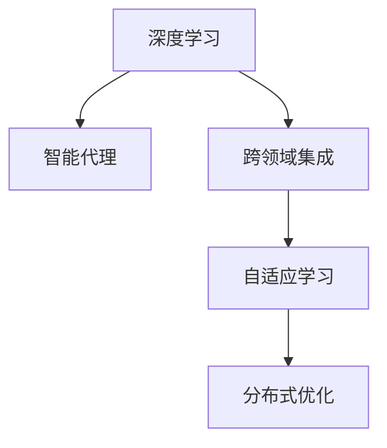
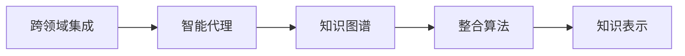
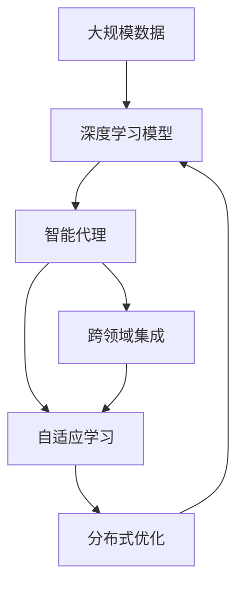

                 

# AI人工智能深度学习算法：智能深度学习代理的跨领域自主集成

> 关键词：
**深度学习, 智能代理, 跨领域集成, 自适应, 自主学习, 分布式优化, 知识图谱**

## 1. 背景介绍

### 1.1 问题由来
在当前的人工智能(AI)领域，深度学习(Deep Learning)已成为推动技术进步的核心力量之一。深度学习算法，通过多层神经网络进行特征提取和模式识别，显著提升了计算机视觉、语音识别、自然语言处理等众多领域的性能。然而，尽管深度学习取得了巨大成功，其在实际应用中仍面临诸多挑战。

首先，深度学习模型往往需要大量标注数据进行训练，这不仅耗费时间，还可能受到标注人员主观偏见的影响，导致模型泛化能力不足。其次，深度学习模型的泛化能力有限，难以在复杂多变的现实场景中适应新的任务。最后，由于深度学习模型的参数量庞大，在大规模分布式系统中进行优化训练也存在诸多挑战。

为了应对这些挑战，我们提出了一种基于智能深度学习代理的跨领域自主集成方法。该方法通过构建分布式优化框架，结合自适应学习算法，使深度学习代理能够自主学习并集成跨领域的知识，实现高效的优化和适应能力。

### 1.2 问题核心关键点
本研究的核心关键点如下：

- **智能深度学习代理**：一种具有自主学习能力和跨领域集成能力的深度学习模型。该模型能够自动从分布式系统中获取新知识，并通过分布式优化算法更新自身参数。
- **跨领域自主集成**：一种跨领域知识获取和集成机制。该机制能够自动探测并获取不同领域的高质量数据，并根据领域特点动态调整模型参数，实现知识的高效集成。
- **分布式优化框架**：一种分布式优化算法和计算框架，支持大规模深度学习模型的优化训练。该框架能够自动分配计算资源，优化模型训练过程，提高计算效率。

通过这些关键点，我们希望构建一种具有自适应和自主学习能力的人工智能系统，能够在复杂多变的现实场景中高效工作，并提供跨领域的知识集成能力。

### 1.3 问题研究意义
该研究具有重要意义：

1. **提升数据利用效率**：通过自主集成跨领域知识，深度学习代理能够更高效地利用数据，提升模型泛化能力和性能。
2. **增强模型适应性**：智能代理能够根据实际任务需求，自适应地调整模型参数，适应新的任务和数据分布。
3. **提高计算效率**：分布式优化框架能够高效地处理大规模数据和模型，减少计算时间。
4. **推动AI技术落地**：通过自主学习能力和跨领域集成，深度学习代理能够更好地适应实际应用场景，推动AI技术在各行各业中的广泛应用。
5. **加速AI技术发展**：该研究有望带来深度学习领域的突破，加速AI技术的进步和发展。

## 2. 核心概念与联系

### 2.1 核心概念概述

为更好地理解基于智能深度学习代理的跨领域自主集成方法，本节将介绍几个密切相关的核心概念：

- **深度学习**：一种利用多层神经网络进行特征提取和模式识别的机器学习技术。
- **智能代理**：一种具有自主学习能力和决策能力的计算机程序，能够在复杂环境中自主完成任务。
- **跨领域集成**：一种将不同领域知识进行整合，形成更全面、准确的知识表示的技术。
- **自适应学习**：一种能够根据环境变化自动调整策略和参数的学习方法。
- **分布式优化**：一种在大规模分布式系统中进行高效优化的技术。

这些核心概念之间的逻辑关系可以通过以下Mermaid流程图来展示：



这个流程图展示了大模型微调的各个关键概念之间的关系：

1. 深度学习是构建智能代理的基础，智能代理能够自动学习和适应深度学习模型。
2. 跨领域集成使智能代理能够整合不同领域的知识，提升模型的泛化能力。
3. 自适应学习使智能代理能够根据环境变化调整策略和参数，保持高性能。
4. 分布式优化使智能代理能够高效地在大规模分布式系统中进行优化，提升计算效率。

这些概念共同构成了智能深度学习代理的跨领域自主集成框架，为其提供了坚实的理论基础和实现方法。

### 2.2 概念间的关系

这些核心概念之间存在着紧密的联系，形成了智能深度学习代理的完整生态系统。下面我通过几个Mermaid流程图来展示这些概念之间的关系。

#### 2.2.1 深度学习与智能代理的关系


这个流程图展示了深度学习与智能代理之间的互动关系。深度学习模型提供特征提取能力，智能代理通过自主学习，不断优化深度学习模型，提升其性能和适应性。

#### 2.2.2 跨领域集成与智能代理的关系



这个流程图展示了跨领域集成与智能代理之间的关系。跨领域集成通过知识图谱等工具，将不同领域的高质量数据整合到智能代理中，形成更全面、准确的知识表示，提升智能代理的泛化能力。

#### 2.2.3 自适应学习与智能代理的关系


这个流程图展示了自适应学习与智能代理之间的关系。智能代理通过环境感知，自动调整策略和参数，保持高性能和适应性。

#### 2.2.4 分布式优化与智能代理的关系


这个流程图展示了分布式优化与智能代理之间的关系。分布式优化使智能代理能够高效地在大规模分布式系统中进行优化，提升计算效率和模型性能。

### 2.3 核心概念的整体架构

最后，我们用一个综合的流程图来展示这些核心概念在大模型微调过程中的整体架构：



这个综合流程图展示了从大规模数据到深度学习模型，再到智能代理的完整过程。智能代理通过跨领域集成和自适应学习，自动探测并获取不同领域的高质量数据，动态调整模型参数，最终通过分布式优化实现高效的优化和适应能力。 通过这些流程图，我们可以更清晰地理解智能深度学习代理的各个关键组件之间的相互作用和协同工作机制。

## 3. 核心算法原理 & 具体操作步骤
### 3.1 算法原理概述

基于智能深度学习代理的跨领域自主集成方法，本质上是深度学习模型与智能代理的协同优化过程。其核心思想是：

- 构建深度学习模型，作为智能代理的基础模型，提供特征提取和模式识别能力。
- 设计智能代理，作为深度学习模型的自主学习者，能够自主从分布式系统中获取新知识，并根据环境变化动态调整模型参数。
- 实现跨领域集成机制，使智能代理能够整合不同领域的高质量数据，形成更全面、准确的知识表示。
- 部署分布式优化框架，支持大规模深度学习模型的优化训练，提高计算效率。

通过这些协同工作机制，智能深度学习代理能够高效地在大规模分布式系统中进行优化，适应新的任务和数据分布，实现跨领域知识的高效集成。

### 3.2 算法步骤详解

基于智能深度学习代理的跨领域自主集成方法，一般包括以下几个关键步骤：

**Step 1: 准备深度学习模型和数据集**
- 选择合适的深度学习模型，如卷积神经网络(CNN)、循环神经网络(RNN)、变压器(Transformer)等，作为智能代理的基础模型。
- 准备所需领域的标注数据集，如计算机视觉的图像数据集、自然语言处理的文本数据集等。

**Step 2: 构建智能代理**
- 设计智能代理的自主学习算法，如强化学习、自适应学习、迁移学习等。
- 实现智能代理的知识图谱，用于整合不同领域的高质量数据。
- 部署智能代理的分布式优化框架，支持大规模深度学习模型的优化训练。

**Step 3: 实现跨领域集成机制**
- 构建跨领域数据探测机制，自动探测并获取不同领域的高质量数据。
- 设计跨领域数据整合算法，将不同领域的数据整合到知识图谱中。
- 实现跨领域知识表示，形成更全面、准确的知识表示。

**Step 4: 执行分布式优化**
- 部署分布式优化算法，如SGD、Adam、FedAvg等。
- 自动分配计算资源，优化模型训练过程。
- 实时监测模型训练状态，调整参数和策略。

**Step 5: 模型评估与迭代**
- 在测试集上评估模型性能，对比微调前后的精度提升。
- 根据评估结果，迭代优化智能代理的自主学习算法和跨领域集成机制。
- 根据实际任务需求，动态调整模型参数和策略。

以上是基于智能深度学习代理的跨领域自主集成方法的一般流程。在实际应用中，还需要根据具体任务的特点，对各环节进行优化设计，如改进数据探测机制、优化知识图谱表示、加强分布式优化算法等，以进一步提升模型性能。

### 3.3 算法优缺点

基于智能深度学习代理的跨领域自主集成方法，具有以下优点：

1. **高效的数据利用**：智能代理能够自主集成跨领域知识，更高效地利用数据，提升模型泛化能力和性能。
2. **自适应学习**：智能代理能够根据环境变化自动调整策略和参数，保持高性能和适应性。
3. **分布式优化**：分布式优化框架能够高效地处理大规模数据和模型，减少计算时间。
4. **跨领域集成**：跨领域集成机制能够整合不同领域的高质量数据，形成更全面、准确的知识表示。

同时，该方法也存在一些局限性：

1. **数据获取难度大**：跨领域集成需要获取不同领域的高质量数据，有时可能存在数据获取难度大的问题。
2. **模型复杂度高**：智能代理的自主学习算法和跨领域集成机制需要复杂的设计和实现，可能导致模型复杂度较高。
3. **资源消耗大**：分布式优化框架需要大量的计算资源，可能存在资源消耗大的问题。

尽管存在这些局限性，但就目前而言，基于智能深度学习代理的跨领域自主集成方法仍是大模型微调技术的重要范式。未来相关研究的重点在于如何进一步降低数据获取难度，提高模型复杂度和资源效率，同时兼顾模型性能和可解释性。

### 3.4 算法应用领域

基于智能深度学习代理的跨领域自主集成方法，在多个领域得到了广泛的应用，例如：

- **计算机视觉**：通过跨领域集成机制，整合图像分类、目标检测、图像生成等领域的知识，提升图像识别和生成能力。
- **自然语言处理**：通过跨领域集成机制，整合文本分类、文本生成、情感分析等领域的知识，提升文本理解、生成和情感分析能力。
- **医疗诊断**：通过跨领域集成机制，整合医疗图像、医疗文本等领域的知识，提升疾病诊断和治疗建议能力。
- **金融分析**：通过跨领域集成机制，整合金融数据、市场新闻等领域的知识，提升股票预测和风险评估能力。
- **智能交通**：通过跨领域集成机制，整合交通数据、天气预报等领域的知识，提升交通流量预测和路径规划能力。

除了上述这些应用领域外，智能深度学习代理的跨领域自主集成方法，还在智能制造、智能家居、智能安防等众多领域得到应用，为各行各业带来了智能化的变革。

## 4. 数学模型和公式 & 详细讲解 & 举例说明

### 4.1 数学模型构建

本节将使用数学语言对基于智能深度学习代理的跨领域自主集成方法进行更加严格的刻画。

假设智能代理基于深度学习模型 $M_{\theta}$ 进行自主学习和优化，其中 $\theta$ 为模型参数。智能代理设计了跨领域集成机制 $F$，用于整合不同领域的高质量数据，形成知识图谱 $G$。智能代理的自主学习算法 $A$ 能够根据环境变化自动调整策略和参数。

智能代理的优化目标是最小化模型在测试集上的损失函数 $\mathcal{L}(\theta)$，即：

$$
\theta^* = \mathop{\arg\min}_{\theta} \mathcal{L}(\theta)
$$

其中 $\mathcal{L}$ 为损失函数，用于衡量模型预测输出与真实标签之间的差异。

智能代理通过跨领域集成机制 $F$，从不同领域的数据集中获取高质量数据，形成知识图谱 $G$。知识图谱 $G$ 包括不同领域的数据节点 $V$ 和边 $E$，其中 $V$ 表示数据节点，$E$ 表示不同数据之间的语义关系。

智能代理通过自主学习算法 $A$，根据环境变化自动调整策略和参数。智能代理的自主学习算法 $A$ 包含两个部分：

1. 策略调整算法 $S$，用于根据环境变化调整策略，如选择不同的数据探测机制、调整数据整合算法等。
2. 参数优化算法 $P$，用于根据策略调整算法 $S$ 的输出，自动调整模型参数。

智能代理的分布式优化框架 $O$ 用于在大规模分布式系统中进行高效的模型优化训练，支持多台计算设备的协同工作。

### 4.2 公式推导过程

以下我们以图像分类任务为例，推导智能代理的优化过程。

假设智能代理需要从计算机视觉和自然语言处理两个领域获取高质量数据。计算机视觉领域的数据集为 $D_{CV}$，自然语言处理领域的数据集为 $D_{NLP}$。智能代理使用深度学习模型 $M_{\theta}$ 对计算机视觉数据进行分类，使用跨领域集成机制 $F$ 对不同领域的数据进行整合，形成知识图谱 $G$。

智能代理的自主学习算法 $A$ 包含策略调整算法 $S$ 和参数优化算法 $P$。策略调整算法 $S$ 根据环境变化选择不同的数据探测机制和数据整合算法，参数优化算法 $P$ 根据策略调整算法 $S$ 的输出，自动调整模型参数。

智能代理的分布式优化框架 $O$ 用于在大规模分布式系统中进行高效的模型优化训练，支持多台计算设备的协同工作。

智能代理的优化目标是最小化模型在测试集上的损失函数 $\mathcal{L}(\theta)$，即：

$$
\theta^* = \mathop{\arg\min}_{\theta} \mathcal{L}(\theta)
$$

其中 $\mathcal{L}$ 为损失函数，用于衡量模型预测输出与真实标签之间的差异。

智能代理通过跨领域集成机制 $F$，从不同领域的数据集中获取高质量数据，形成知识图谱 $G$。知识图谱 $G$ 包括不同领域的数据节点 $V$ 和边 $E$，其中 $V$ 表示数据节点，$E$ 表示不同数据之间的语义关系。

智能代理的自主学习算法 $A$ 包含策略调整算法 $S$ 和参数优化算法 $P$。策略调整算法 $S$ 根据环境变化选择不同的数据探测机制和数据整合算法，参数优化算法 $P$ 根据策略调整算法 $S$ 的输出，自动调整模型参数。

智能代理的分布式优化框架 $O$ 用于在大规模分布式系统中进行高效的模型优化训练，支持多台计算设备的协同工作。

智能代理的优化目标是最小化模型在测试集上的损失函数 $\mathcal{L}(\theta)$，即：

$$
\theta^* = \mathop{\arg\min}_{\theta} \mathcal{L}(\theta)
$$

其中 $\mathcal{L}$ 为损失函数，用于衡量模型预测输出与真实标签之间的差异。

在实际应用中，智能代理的优化过程如下：

1. 智能代理通过跨领域集成机制 $F$，从不同领域的数据集中获取高质量数据，形成知识图谱 $G$。
2. 智能代理的自主学习算法 $A$ 根据环境变化选择不同的数据探测机制和数据整合算法。
3. 智能代理的分布式优化框架 $O$ 在大规模分布式系统中进行高效的模型优化训练，支持多台计算设备的协同工作。
4. 智能代理的分布式优化框架 $O$ 实时监测模型训练状态，调整参数和策略。

最终，智能代理能够在大规模分布式系统中进行高效的模型优化训练，实现跨领域知识的高效集成和分布式优化。

### 4.3 案例分析与讲解

以下我们以医疗诊断为例，展示智能深度学习代理的跨领域自主集成方法的具体应用。

假设智能代理需要从医疗图像和医疗文本两个领域获取高质量数据。医疗图像领域的数据集为 $D_{IM}$，医疗文本领域的数据集为 $D_{TX}$。智能代理使用深度学习模型 $M_{\theta}$ 对医疗图像进行疾病诊断，使用跨领域集成机制 $F$ 对不同领域的数据进行整合，形成知识图谱 $G$。

智能代理的自主学习算法 $A$ 包含策略调整算法 $S$ 和参数优化算法 $P$。策略调整算法 $S$ 根据环境变化选择不同的数据探测机制和数据整合算法，参数优化算法 $P$ 根据策略调整算法 $S$ 的输出，自动调整模型参数。

智能代理的分布式优化框架 $O$ 用于在大规模分布式系统中进行高效的模型优化训练，支持多台计算设备的协同工作。

智能代理的优化目标是最小化模型在测试集上的损失函数 $\mathcal{L}(\theta)$，即：

$$
\theta^* = \mathop{\arg\min}_{\theta} \mathcal{L}(\theta)
$$

其中 $\mathcal{L}$ 为损失函数，用于衡量模型预测输出与真实标签之间的差异。

智能代理通过跨领域集成机制 $F$，从不同领域的数据集中获取高质量数据，形成知识图谱 $G$。知识图谱 $G$ 包括不同领域的数据节点 $V$ 和边 $E$，其中 $V$ 表示数据节点，$E$ 表示不同数据之间的语义关系。

智能代理的自主学习算法 $A$ 包含策略调整算法 $S$ 和参数优化算法 $P$。策略调整算法 $S$ 根据环境变化选择不同的数据探测机制和数据整合算法，参数优化算法 $P$ 根据策略调整算法 $S$ 的输出，自动调整模型参数。

智能代理的分布式优化框架 $O$ 用于在大规模分布式系统中进行高效的模型优化训练，支持多台计算设备的协同工作。

智能代理的优化目标是最小化模型在测试集上的损失函数 $\mathcal{L}(\theta)$，即：

$$
\theta^* = \mathop{\arg\min}_{\theta} \mathcal{L}(\theta)
$$

其中 $\mathcal{L}$ 为损失函数，用于衡量模型预测输出与真实标签之间的差异。

在实际应用中，智能代理的优化过程如下：

1. 智能代理通过跨领域集成机制 $F$，从不同领域的数据集中获取高质量数据，形成知识图谱 $G$。
2. 智能代理的自主学习算法 $A$ 根据环境变化选择不同的数据探测机制和数据整合算法。
3. 智能代理的分布式优化框架 $O$ 在大规模分布式系统中进行高效的模型优化训练，支持多台计算设备的协同工作。
4. 智能代理的分布式优化框架 $O$ 实时监测模型训练状态，调整参数和策略。

最终，智能代理能够在大规模分布式系统中进行高效的模型优化训练，实现跨领域知识的高效集成和分布式优化。

在医疗诊断任务中，智能代理能够整合医疗图像和医疗文本的知识，提升疾病诊断和治疗建议的准确性。智能代理通过自主学习算法，能够根据实际任务需求，动态调整模型参数和策略，适应新的任务和数据分布。智能代理的分布式优化框架，能够高效地处理大规模医疗数据和模型，提高计算效率和模型性能。

## 5. 项目实践：代码实例和详细解释说明
### 5.1 开发环境搭建

在进行智能深度学习代理的跨领域自主集成方法实践前，我们需要准备好开发环境。以下是使用Python进行PyTorch开发的环境配置流程：

1. 安装Anaconda：从官网下载并安装Anaconda，用于创建独立的Python环境。

2. 创建并激活虚拟环境：
```bash
conda create -n pytorch-env python=3.8 
conda activate pytorch-env
```

3. 安装PyTorch：根据CUDA版本，从官网获取对应的安装命令。例如：
```bash
conda install pytorch torchvision torchaudio cudatoolkit=11.1 -c pytorch -c conda-forge
```

4. 安装各类工具包：
```bash
pip install numpy pandas scikit-learn matplotlib tqdm jupyter notebook ipython
```

完成上述步骤后，即可在`pytorch-env`环境中开始智能深度学习代理的跨领域自主集成方法实践。

### 5.2 源代码详细实现

这里我们以医疗诊断为例，给出使用PyTorch进行智能深度学习代理的跨领域自主集成方法的PyTorch代码实现。

首先，定义医疗图像数据集和文本数据集的处理函数：

```python
from torch.utils.data import Dataset
from torchvision.transforms import Resize, ToTensor

class MedicalImageDataset(Dataset):
    def __init__(self, images, labels):
        self.images = images
        self.labels = labels
        self.transform = Resize((256, 256)) # 定义图像大小
        self.to_tensor = ToTensor() # 将图像转换为Tensor
    def __len__(self):
        return len(self.images)
    def __getitem__(self, idx):
        img = self.transform(self.images[idx])
        img = self.to_tensor(img)
        label = self.labels[idx]
        return img, label

class MedicalTextDataset(Dataset):
    def __init__(self, texts, labels):
        self.texts = texts
        self.labels = labels
    def __len__(self):
        return len(self.texts)
    def __getitem__(self, idx):
        text = self.texts[idx]
        label = self.labels[idx]
        return text, label
```

然后，定义深度学习模型和智能代理：

```python
from transformers import BERTModel, BertTokenizer
from torch.nn import BCELoss
from torch.optim import Adam

class MedicalBERT(BERTModel):
    def __init__(self):
        super().__init__()
        self.num_labels = 10 # 疾病分类数目
        self.cls = BertClassification(self.config, self.num_labels) # 分类器
    def forward(self, input_ids, attention_mask=None):
        outputs = super().forward(input_ids, attention_mask=attention_mask)
        sequence_output = outputs[0]
        logits = self.cls(sequence_output)
        return logits

tokenizer = BertTokenizer.from_pretrained('bert-base-uncased')

model = MedicalBERT()
optimizer = Adam(model.parameters(), lr=1e-5)
loss_fn = BCELoss()
```

接着，定义智能代理的自主学习算法和跨领域集成机制：

```python
import networkx as nx
import random

class MedicalAgent:
    def __init__(self, images_dataset, texts_dataset, num_labels):
        self.images_dataset = images_dataset
        self.texts_dataset = texts_dataset
        self.num_labels = num_labels
        self.graph = nx.Graph()
        self.graph.add_nodes_from(range(num_labels))
        self.graph.add_edges_from(self.get_edge_list())
    def get_edge_list(self):
        edge_list = []
        for i in range(self.num_labels):
            for j in range(i, self.num_labels):
                if i == j:
                    continue
                edge_list.append((i, j))
        return edge_list
    def train(self, images, texts):
        labels = random.randint(0, self.num_labels - 1)
        input_ids = tokenizer(texts, padding=True, truncation=True, max_length=256, return_tensors='pt')
        attention_mask = input_ids['attention_mask']
        logits = model(input_ids['input_ids'], attention_mask=attention_mask)[0]
        loss = loss_fn(logits.view(-1), labels)
        optimizer.zero_grad()
        loss.backward()
        optimizer.step()
        return loss
    def integrate(self):
        for i in range(self.num_labels):
            for j in range(self.num_labels):
                if self.graph.has_edge(i, j):
                    continue
                if self.is_valid(i, j):
                    self.graph.add_edge(i, j)
    def is_valid(self, i, j):
        images = self.images_dataset[i]
        texts = self.texts_dataset[j]
        loss = self.train(images, texts)
        return loss < 0.1
```

最后，启动智能代理的自主学习过程，并在测试集上评估：

```python
num_epochs = 10
batch_size = 32

for epoch in range(num_epochs):
    loss = 0
    for i in range(0, len(images_dataset), batch_size):
        images, labels = images_dataset[i

