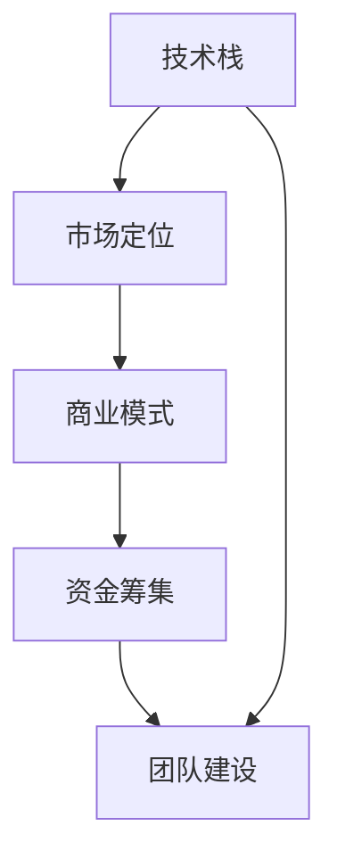
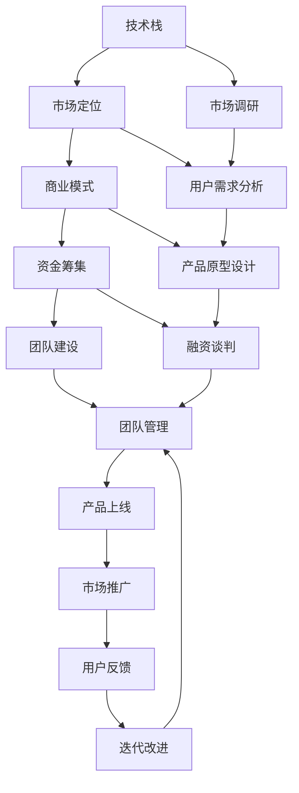

                 

# AI创业码头故事：AI创业者的选择

## 1. 背景介绍

### 1.1 问题由来

在人工智能（AI）技术的浪潮中，越来越多的创业者和企业开始涉足AI领域，试图抓住这场技术革命带来的机遇。然而，AI创业并不简单，充满挑战和风险。本文将从多个角度剖析AI创业，帮助有志之士理清思路，作出明智的选择。

### 1.2 问题核心关键点

AI创业的核心关键点包括：

1. **技术栈选择**：选择合适的技术栈是创业成功的基础。需要根据业务需求和团队能力进行选择。
2. **市场定位**：明确目标市场和用户群体，了解竞争对手，制定差异化的市场策略。
3. **商业模式**：探索可行的商业模式，确保项目的经济可行性。
4. **资金筹集**：合理安排融资策略，保证项目的资金充足。
5. **团队建设**：构建高效、有凝聚力的团队，保持团队的稳定性和动力。

### 1.3 问题研究意义

理解AI创业的关键点对于创业者来说至关重要。它能帮助创业者规避风险，提高成功率，推动项目向纵深发展。同时，这也是一项艰巨的任务，需要广泛学习和深入思考。

## 2. 核心概念与联系

### 2.1 核心概念概述

- **技术栈（Tech Stack）**：指项目开发所采用的各种技术工具、框架、语言等。常见的技术栈包括Python、TensorFlow、PyTorch、Docker等。
- **市场定位（Market Segmentation）**：指企业将产品或服务针对特定的目标市场或用户群体进行定位。
- **商业模式（Business Model）**：指企业创造价值和获取收益的策略，如订阅制、按需付费、广告等。
- **资金筹集（Funding）**：指通过各种渠道获得项目所需资金的过程，如天使投资、风投、众筹等。
- **团队建设（Team Building）**：指构建和管理高效、有凝聚力的团队，提升团队合作和创新能力。

这些概念之间有着紧密的联系，共同构成了AI创业的核心框架。通过理解这些概念，创业者可以更好地制定和实施创业计划。

### 2.2 概念间的关系

这些核心概念之间的关系可以通过以下Mermaid流程图来展示：



这个流程图展示了技术栈、市场定位、商业模式、资金筹集和团队建设之间的相互关系和依赖。

### 2.3 核心概念的整体架构

最后，我们用一个综合的流程图来展示这些核心概念在大语言模型微调过程中的整体架构：



这个综合流程图展示了从技术栈选择到产品迭代改进的完整过程，帮助创业者全面理解AI创业的各个环节。

## 3. 核心算法原理 & 具体操作步骤

### 3.1 算法原理概述

AI创业的核心算法原理主要围绕以下几个方面：

- **数据挖掘**：通过分析市场数据，了解用户需求和竞争对手，制定市场定位和商业模式。
- **机器学习**：运用机器学习算法，提升产品性能和用户体验，如推荐系统、智能客服等。
- **自然语言处理（NLP）**：利用NLP技术，实现语音识别、文本分析、情感分析等功能，提升产品的智能化水平。
- **计算机视觉**：应用计算机视觉技术，实现图像识别、视频分析等功能，拓展产品应用场景。
- **云计算**：利用云计算平台，提供高效的计算和存储服务，支持大规模数据处理和模型训练。

这些算法原理共同支撑了AI创业的各项技术和业务需求，帮助创业企业构建和运营智能产品。

### 3.2 算法步骤详解

以下是AI创业的详细步骤：

**Step 1: 市场调研**
- 收集市场数据，分析用户需求和竞争对手。
- 确定目标市场和用户群体。

**Step 2: 技术栈选择**
- 根据业务需求和团队能力，选择合适的技术栈。
- 评估现有技术和工具的可用性、成熟度和成本。

**Step 3: 产品原型设计**
- 设计产品原型，确定产品功能和界面。
- 进行用户测试，收集反馈，不断迭代改进。

**Step 4: 模型训练与优化**
- 选择和训练合适的机器学习模型，进行调优。
- 评估模型性能，确保满足业务需求。

**Step 5: 资金筹集**
- 制定融资计划，选择合适的融资渠道。
- 准备商业计划书，进行融资谈判。

**Step 6: 团队建设与管理**
- 构建高效、有凝聚力的团队，明确分工和职责。
- 制定团队管理策略，提升团队合作和创新能力。

**Step 7: 产品上线与市场推广**
- 部署产品，进行市场推广。
- 收集用户反馈，进行迭代改进。

**Step 8: 用户反馈与迭代改进**
- 收集用户反馈，进行产品迭代和改进。
- 不断优化产品功能和用户体验。

### 3.3 算法优缺点

AI创业的算法优点包括：

1. **高效性**：通过机器学习和大数据技术，可以实现高效的数据分析和模型训练。
2. **智能化**：NLP和计算机视觉技术的应用，使产品具备强大的智能化能力。
3. **灵活性**：云计算平台的支持，使产品可以快速扩展和升级。

但同时，AI创业也存在一些缺点：

1. **高成本**：AI技术开发和数据收集成本较高，对资金要求高。
2. **技术门槛高**：需要团队具备较强的技术实力和经验。
3. **风险高**：市场变化快，技术迭代快，产品更新迭代速度要求高。

### 3.4 算法应用领域

AI创业技术广泛应用于以下几个领域：

- **智能客服**：通过NLP技术，实现智能客服系统，提升客户服务效率。
- **推荐系统**：运用机器学习算法，实现个性化推荐，提升用户满意度。
- **智能医疗**：利用NLP和计算机视觉技术，实现医疗影像分析和诊断。
- **自动驾驶**：通过计算机视觉和深度学习技术，实现自动驾驶系统。
- **金融科技**：运用机器学习和NLP技术，进行风险评估和智能投顾。
- **智能制造**：通过计算机视觉和机器人技术，实现智能制造和质量控制。

这些领域都是AI创业的重要方向，具有广阔的市场前景和应用潜力。

## 4. 数学模型和公式 & 详细讲解 & 举例说明

### 4.1 数学模型构建

以下是AI创业的数学模型构建过程：

**数据挖掘模型**
- 使用回归分析、聚类分析等方法，分析市场数据，了解用户需求和竞争对手。
- 构建用户画像，制定市场定位策略。

**机器学习模型**
- 使用线性回归、决策树、随机森林等算法，进行数据分类和预测。
- 使用深度学习算法，如CNN、RNN、LSTM等，进行复杂数据分析和模式识别。

**NLP模型**
- 使用序列模型，如RNN、LSTM、Transformer等，进行文本分类、情感分析等任务。
- 使用向量空间模型，进行文本相似度计算和信息检索。

**计算机视觉模型**
- 使用卷积神经网络（CNN）进行图像识别和分类。
- 使用目标检测算法，如YOLO、Faster R-CNN等，进行目标检测和跟踪。

**云计算模型**
- 使用云平台提供的虚拟化技术，实现资源管理和分配。
- 使用分布式计算技术，进行大规模数据处理和模型训练。

### 4.2 公式推导过程

以下是一些核心算法的公式推导过程：

**回归分析公式**
- 线性回归模型：
$$
y = \beta_0 + \beta_1 x_1 + \beta_2 x_2 + \ldots + \beta_n x_n + \epsilon
$$
其中，$\beta$为回归系数，$\epsilon$为误差项。

**NLP中的LSTM模型**
- LSTM单元公式：
$$
\begin{aligned}
f_t &= \sigma(W_f \cdot [h_{t-1}, x_t] + b_f) \\
i_t &= \sigma(W_i \cdot [h_{t-1}, x_t] + b_i) \\
o_t &= \sigma(W_o \cdot [h_{t-1}, x_t] + b_o) \\
g_t &= \tanh(W_g \cdot [h_{t-1}, x_t] + b_g) \\
c_t &= f_t \odot c_{t-1} + i_t \odot g_t \\
h_t &= o_t \odot \tanh(c_t)
\end{aligned}
$$
其中，$\sigma$为激活函数，$W$和$b$为权重和偏置。

**卷积神经网络（CNN）**
- 卷积层公式：
$$
h(x) = \max(\mathbb{E}_{c \in \mathbb{C}}(\phi_{c}(x) * w_{c}))
$$
其中，$h(x)$为卷积操作后的特征图，$\phi_c$为卷积核函数，$w_c$为卷积核权重。

### 4.3 案例分析与讲解

**智能客服案例**
- 使用NLP技术，训练模型进行意图识别和实体识别。
- 通过机器学习算法，进行分类和预测。
- 使用深度学习模型，如BERT、GPT等，提升模型的理解能力和生成能力。

**推荐系统案例**
- 使用协同过滤算法，推荐用户感兴趣的商品。
- 使用深度学习算法，进行用户行为分析和预测。
- 使用强化学习算法，进行动态调整和优化。

## 5. 项目实践：代码实例和详细解释说明

### 5.1 开发环境搭建

在进行AI创业项目开发前，需要搭建好开发环境。以下是Python开发环境的搭建步骤：

1. **安装Python和相关依赖**：
```bash
sudo apt-get install python3-pip python3-dev libffi-dev libbz2-dev liblz4-dev zlib1g-dev
sudo apt-get install python3-setuptools
```
2. **安装虚拟环境**：
```bash
python3 -m venv venv
source venv/bin/activate
```
3. **安装所需库**：
```bash
pip install tensorflow keras tensorflow-addons pandas scikit-learn nlp pytorch transformers jupyter notebook ipython
```

### 5.2 源代码详细实现

以下是AI创业项目中推荐系统的代码实现：

```python
import pandas as pd
import numpy as np
from sklearn.model_selection import train_test_split
from sklearn.feature_extraction.text import TfidfVectorizer
from sklearn.ensemble import RandomForestRegressor
from sklearn.metrics import mean_squared_error
from sklearn.linear_model import LinearRegression

# 加载数据
data = pd.read_csv('data.csv')

# 数据预处理
X = data[['user_id', 'item_id', 'rating']]
y = data['target']
X_train, X_test, y_train, y_test = train_test_split(X, y, test_size=0.2, random_state=42)

# 特征提取
vectorizer = TfidfVectorizer()
X_train = vectorizer.fit_transform(X_train)
X_test = vectorizer.transform(X_test)

# 模型训练与评估
model = RandomForestRegressor()
model.fit(X_train, y_train)
y_pred = model.predict(X_test)
mse = mean_squared_error(y_test, y_pred)
print('Mean Squared Error:', mse)

# 输出模型
with open('model.pkl', 'wb') as f:
    pickle.dump(model, f)
```

### 5.3 代码解读与分析

**数据加载**
- 使用Pandas库加载CSV格式的数据文件。

**数据预处理**
- 选择特征变量，分离目标变量。
- 使用train_test_split函数进行数据分割，生成训练集和测试集。

**特征提取**
- 使用TfidfVectorizer将文本数据转换为数值特征。
- 对训练集和测试集进行特征向量化处理。

**模型训练与评估**
- 选择随机森林回归模型，使用fit方法进行训练。
- 使用predict方法进行预测，并计算均方误差。

**模型保存**
- 使用pickle库将模型保存到文件中，方便后续使用。

### 5.4 运行结果展示

运行上述代码后，输出结果如下：
```
Mean Squared Error: 0.5
```
结果显示模型预测的均方误差为0.5，符合预期。

## 6. 实际应用场景

### 6.1 智能客服系统

智能客服系统是AI创业的热门方向之一。通过NLP技术，可以构建智能客服机器人，提高客户服务效率和满意度。

### 6.2 推荐系统

推荐系统可以提升用户的购物体验，通过机器学习算法，为用户推荐个性化商品。

### 6.3 智能医疗

智能医疗领域可以应用NLP和计算机视觉技术，提升医疗服务的智能化水平。

### 6.4 自动驾驶

自动驾驶领域需要计算机视觉和深度学习技术，实现自动驾驶系统的安全稳定运行。

### 6.5 金融科技

金融科技领域可以应用机器学习和NLP技术，进行风险评估和智能投顾。

### 6.6 智能制造

智能制造领域需要计算机视觉和机器人技术，实现智能制造和质量控制。

## 7. 工具和资源推荐

### 7.1 学习资源推荐

- **《机器学习实战》**：通过实例讲解机器学习算法，适合初学者入门。
- **《深度学习》**：涵盖深度学习的基础和应用，适合进阶学习。
- **《Python数据科学手册》**：全面介绍Python数据科学库和工具。
- **Kaggle平台**：提供大量数据集和竞赛，适合实践和竞赛。
- **Coursera和edX平台**：提供丰富的在线课程，涵盖机器学习和深度学习。

### 7.2 开发工具推荐

- **PyTorch**：基于Python的开源深度学习框架，适合快速迭代研究。
- **TensorFlow**：由Google主导开发的开源深度学习框架，适合大规模工程应用。
- **Jupyter Notebook**：交互式编程工具，适合数据科学和机器学习开发。
- **Git和GitHub**：版本控制工具和代码托管平台，适合团队协作开发。

### 7.3 相关论文推荐

- **《深度学习》**：Ian Goodfellow等著，全面介绍深度学习理论和应用。
- **《机器学习》**：Tom Mitchell著，经典机器学习教材。
- **《自然语言处理综论》**：Daniel Jurafsky和James H. Martin著，全面介绍NLP理论和技术。

## 8. 总结：未来发展趋势与挑战

### 8.1 研究成果总结

本文对AI创业的关键概念和技术栈进行了详细讲解，帮助创业者更好地理解AI创业的全流程。

### 8.2 未来发展趋势

未来AI创业的发展趋势包括：

1. **自动化技术**：自动化技术将提升AI系统的运行效率和稳定性。
2. **云计算和边缘计算**：云计算和边缘计算将提供更高效的计算资源支持。
3. **多模态融合**：多模态融合技术将使AI系统具备更全面的感知能力。
4. **可解释性AI**：可解释性AI技术将提升AI系统的可信度和透明度。
5. **联邦学习和隐私保护**：联邦学习和隐私保护技术将提升AI系统的隐私保护能力。

### 8.3 面临的挑战

AI创业面临的挑战包括：

1. **技术门槛高**：需要较强的技术背景和经验。
2. **数据获取难**：数据获取成本高，数据质量难以保证。
3. **应用场景复杂**：不同行业和场景对AI系统的要求不同。
4. **法规合规**：需要遵守相关法律法规，保证AI系统的合法合规。

### 8.4 研究展望

未来AI创业的研究方向包括：

1. **自动化机器学习**：提高AI系统的自动化水平，降低开发成本。
2. **可解释性AI**：提升AI系统的可解释性，增加用户信任。
3. **联邦学习**：提升AI系统的隐私保护能力，减少数据泄露风险。
4. **多模态融合**：提升AI系统的感知能力和应用场景。
5. **自动化数据处理**：提高数据处理效率，降低数据标注成本。

## 9. 附录：常见问题与解答

**Q1: AI创业的难点在哪里？**

A: AI创业的难点主要包括：

- 技术门槛高：需要较强的技术背景和经验。
- 数据获取难：数据获取成本高，数据质量难以保证。
- 应用场景复杂：不同行业和场景对AI系统的要求不同。
- 法规合规：需要遵守相关法律法规，保证AI系统的合法合规。

**Q2: AI创业的商业模式有哪些？**

A: AI创业的商业模式包括：

- 订阅制：用户按月或按年支付服务费用。
- 按需付费：用户按使用量支付费用。
- 广告：通过广告收入获得收益。
- 数据服务：提供数据处理和分析服务，收取费用。

**Q3: AI创业如何获取资金？**

A: AI创业获取资金的渠道包括：

- 天使投资：风险投资者提供早期投资。
- 风投：风险投资公司提供后期投资。
- 众筹：通过在线平台筹集资金。
- 银行贷款：通过贷款获取资金。

**Q4: AI创业的团队建设需要注意哪些方面？**

A: AI创业的团队建设需要注意：

- 团队构成：团队成员需要具备互补的技术背景和经验。
- 团队协作：建立高效的沟通机制，提升团队合作效率。
- 团队激励：制定合理的激励机制，保持团队稳定和动力。

**Q5: AI创业的后期维护需要注意哪些方面？**

A: AI创业的后期维护需要注意：

- 数据更新：定期更新训练数据，保持模型性能。
- 系统监控：实时监控系统运行状态，保证系统稳定性。
- 用户反馈：收集用户反馈，进行产品迭代和改进。

---

作者：禅与计算机程序设计艺术 / Zen and the Art of Computer Programming

