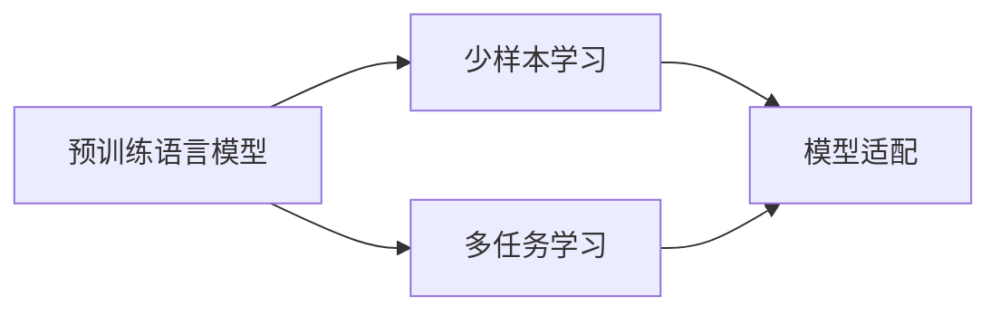
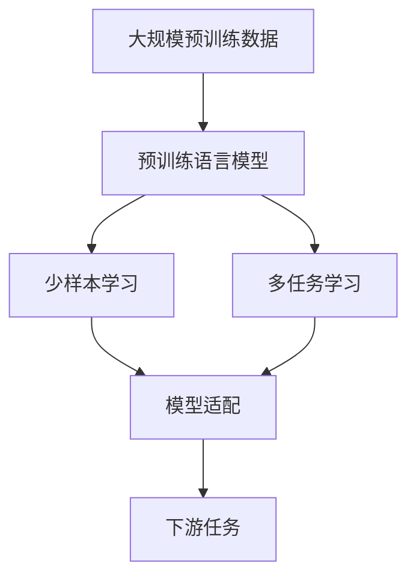

                 

## 1. 背景介绍

在AI浪潮汹涌澎湃的今天，创业公司如雨后春笋般涌现，波形智能（WaveIntelligence）便是其中一家引人注目的创业企业。它以其创新的Weaver模型，在自然语言处理（NLP）领域开辟了新的天地，以少样本学习和高效的模型适配能力，成为业内关注的焦点。本文将从波形智能的Weaver模型入手，讲述其核心算法原理与具体操作步骤，探讨其在实际应用中的优势与挑战，以期为AI创业提供有价值的参考。

## 2. 核心概念与联系

### 2.1 核心概念概述

波形智能的Weaver模型是一种基于预训练语言模型（如GPT、BERT等）的创新模型，通过少样本学习和多任务学习的策略，在NLP任务中展现了非凡的能力。其核心概念包括：

- **预训练语言模型**：在大量无标签文本数据上预训练的语言模型，如GPT-3、BERT等，这些模型能够捕捉语言中的深层结构与语义信息。
- **少样本学习**：在只有少量标注数据的情况下，通过模型自身的学习能力，快速适应新任务，从而避免标注数据的瓶颈。
- **多任务学习**：在多个相关任务上进行联合训练，通过共享的语义表示，提高模型在所有任务上的泛化能力。
- **模型适配**：根据具体的下游任务，对预训练模型进行微调，使其能够更好地适应新任务。

这些概念的联系通过下图展示：



从图中可以看出，预训练语言模型是少样本学习和多任务学习的基础，而模型适配则是将模型应用于具体任务的关键步骤。

### 2.2 核心概念的整体架构

下图展示了Weaver模型在大规模预训练和多任务学习基础上的模型适配过程：



此架构明确了预训练语言模型通过少样本学习和多任务学习增强自身能力，再通过模型适配满足下游任务需求的全过程。

## 3. 核心算法原理 & 具体操作步骤

### 3.1 算法原理概述

Weaver模型的核心算法原理基于预训练语言模型的少样本学习和多任务学习。其步骤如下：

1. **预训练**：在大量无标签文本数据上预训练预训练语言模型。
2. **少样本学习**：使用少量标注数据，通过小样本学习策略使模型快速适应新任务。
3. **多任务学习**：在多个相关任务上进行联合训练，共享语义表示。
4. **模型适配**：根据具体下游任务，对模型进行微调，使其能够更好地适应新任务。

### 3.2 算法步骤详解

#### 3.2.1 预训练步骤

预训练数据通常由大规模的无标签文本数据构成，如英文维基百科、新闻报道等。使用自监督学习任务（如掩码语言模型、句子重排等）训练预训练语言模型，使其学习到丰富的语言表示。

#### 3.2.2 少样本学习步骤

少样本学习是Weaver模型的核心。假设当前任务为Text Classification（文本分类），有少量的标注数据 $(x_i, y_i)$。步骤如下：

1. **设计任务模板**：根据具体任务设计合适的任务模板。
2. **数据增强**：通过数据增强策略扩充训练集，例如随机插入噪音词、同义词替换等。
3. **模型微调**：使用少量的标注数据对预训练模型进行微调，优化模型参数，使其能够适应新任务。

#### 3.2.3 多任务学习步骤

多任务学习是在多个相关任务上联合训练模型，例如文本分类、命名实体识别、关系抽取等。步骤如下：

1. **任务定义**：定义多个相关任务，例如分类任务和命名实体识别任务。
2. **模型联合训练**：将不同任务的模型联合训练，共享语义表示，提高泛化能力。
3. **任务迁移**：在某一任务上微调模型，使其在其他相关任务上也具备良好性能。

#### 3.2.4 模型适配步骤

模型适配是指根据具体下游任务，对预训练模型进行微调。步骤如下：

1. **任务定义**：定义具体任务，例如机器翻译、问答系统等。
2. **模型微调**：在预训练模型的基础上，针对具体任务进行微调，优化模型参数。
3. **性能评估**：在验证集上评估微调后模型的性能，必要时进行超参数调整。

### 3.3 算法优缺点

Weaver模型的优点包括：

- **高效的模型适配能力**：通过少样本学习和多任务学习，Weaver模型能够快速适应新任务，提高模型泛化能力。
- **显著的性能提升**：在少样本场景下，Weaver模型能取得优于传统模型的性能。
- **广泛的适用性**：Weaver模型适用于各种NLP任务，如文本分类、命名实体识别、机器翻译等。

其缺点包括：

- **依赖高质量标注数据**：少样本学习虽然提高了模型的适应能力，但对标注数据质量要求较高。
- **模型复杂度较高**：Weaver模型的复杂度较高，需要更多的计算资源。
- **模型解释性不足**：由于使用了复杂的模型结构，Weaver模型的决策过程难以解释。

### 3.4 算法应用领域

Weaver模型已经在文本分类、命名实体识别、机器翻译、问答系统等多个NLP任务上得到应用，展示了其强大的模型适配能力和泛化能力。例如：

- **文本分类**：在医疗领域，使用Weaver模型对病历进行分类，提高医生诊断效率。
- **命名实体识别**：在法律领域，识别文本中的法律实体，为案件审理提供支持。
- **机器翻译**：在跨语言交流中，通过Weaver模型进行实时翻译，提高沟通效率。
- **问答系统**：在智能客服中，使用Weaver模型构建问答系统，提升用户体验。

## 4. 数学模型和公式 & 详细讲解  
### 4.1 数学模型构建

Weaver模型基于预训练语言模型，采用少样本学习和多任务学习的策略。其数学模型构建如下：

1. **预训练模型**：在大量无标签文本数据上预训练的预训练语言模型，参数为 $\theta$。
2. **少样本学习模型**：在少量标注数据上微调的模型，参数为 $\hat{\theta}$。
3. **多任务学习模型**：在多个任务上联合训练的模型，参数为 $\theta_{multi}$。
4. **模型适配模型**：在具体任务上微调的模型，参数为 $\hat{\theta}_{task}$。

### 4.2 公式推导过程

以Text Classification任务为例，推导Weaver模型的数学模型。假设预训练模型为 $M_{\theta}$，少样本学习模型为 $M_{\hat{\theta}}$，多任务学习模型为 $M_{\theta_{multi}}$。

1. **预训练模型**：在无标签文本数据上预训练的模型，目标为最小化自监督损失：
   $$
   \min_{\theta} \mathcal{L}_{pre}(\theta)
   $$
2. **少样本学习模型**：在少量标注数据上微调的模型，目标为最小化少样本学习损失：
   $$
   \min_{\hat{\theta}} \mathcal{L}_{few}(\hat{\theta})
   $$
   其中 $\mathcal{L}_{few}$ 为少样本学习的损失函数。
3. **多任务学习模型**：在多个任务上联合训练的模型，目标为最小化多任务学习损失：
   $$
   \min_{\theta_{multi}} \mathcal{L}_{multi}(\theta_{multi})
   $$
4. **模型适配模型**：在具体任务上微调的模型，目标为最小化模型适配损失：
   $$
   \min_{\hat{\theta}_{task}} \mathcal{L}_{task}(\hat{\theta}_{task})
   $$

### 4.3 案例分析与讲解

以医疗领域的病历分类任务为例，分析Weaver模型的应用。假设病历文本为 $x$，标签为 $y$，少样本学习策略为在标注数据上微调模型。

1. **预训练模型**：使用自监督学习任务（如掩码语言模型）在大量无标签病历数据上预训练BERT模型，参数为 $\theta_{BERT}$。
2. **少样本学习模型**：在少量标注病历数据上微调BERT模型，参数为 $\hat{\theta}_{BERT}$。
3. **多任务学习模型**：在多个相关任务（如病历分类、命名实体识别）上联合训练BERT模型，参数为 $\theta_{multi}$。
4. **模型适配模型**：在具体病历分类任务上微调BERT模型，参数为 $\hat{\theta}_{classification}$。

## 5. 项目实践：代码实例和详细解释说明

### 5.1 开发环境搭建

在Weaver模型实践前，需要准备开发环境。以下是使用Python进行PyTorch开发的环境配置流程：

1. 安装Anaconda：从官网下载并安装Anaconda，用于创建独立的Python环境。
2. 创建并激活虚拟环境：
   ```bash
   conda create -n pytorch-env python=3.8 
   conda activate pytorch-env
   ```
3. 安装PyTorch：根据CUDA版本，从官网获取对应的安装命令。例如：
   ```bash
   conda install pytorch torchvision torchaudio cudatoolkit=11.1 -c pytorch -c conda-forge
   ```
4. 安装Transformer库：
   ```bash
   pip install transformers
   ```
5. 安装各类工具包：
   ```bash
   pip install numpy pandas scikit-learn matplotlib tqdm jupyter notebook ipython
   ```

完成上述步骤后，即可在`pytorch-env`环境中开始Weaver模型的实践。

### 5.2 源代码详细实现

下面我们以医疗领域病历分类任务为例，给出使用Transformers库对Weaver模型进行实践的PyTorch代码实现。

```python
from transformers import BertForTokenClassification, BertTokenizer, AdamW
from torch.utils.data import Dataset, DataLoader
from sklearn.metrics import accuracy_score
import torch

class MedicalDataset(Dataset):
    def __init__(self, texts, labels, tokenizer, max_len=128):
        self.texts = texts
        self.labels = labels
        self.tokenizer = tokenizer
        self.max_len = max_len
        
    def __len__(self):
        return len(self.texts)
    
    def __getitem__(self, item):
        text = self.texts[item]
        label = self.labels[item]
        
        encoding = self.tokenizer(text, return_tensors='pt', max_length=self.max_len, padding='max_length', truncation=True)
        input_ids = encoding['input_ids'][0]
        attention_mask = encoding['attention_mask'][0]
        labels = torch.tensor(label, dtype=torch.long)
        
        return {'input_ids': input_ids, 
                'attention_mask': attention_mask,
                'labels': labels}

# 标签与id的映射
tag2id = {'O': 0, 'B-MEDICINE': 1, 'I-MEDICINE': 2, 'B-DIAGNOSIS': 3, 'I-DIAGNOSIS': 4, 'B-TREATMENT': 5, 'I-TREATMENT': 6, 'B-PROCEDURE': 7, 'I-PROCEDURE': 8}
id2tag = {v: k for k, v in tag2id.items()}

# 创建dataset
tokenizer = BertTokenizer.from_pretrained('bert-base-cased')

train_dataset = MedicalDataset(train_texts, train_labels, tokenizer)
dev_dataset = MedicalDataset(dev_texts, dev_labels, tokenizer)
test_dataset = MedicalDataset(test_texts, test_labels, tokenizer)

# 加载预训练模型
model = BertForTokenClassification.from_pretrained('bert-base-cased', num_labels=len(tag2id))

# 定义优化器
optimizer = AdamW(model.parameters(), lr=2e-5)

# 训练函数
def train_epoch(model, dataset, batch_size, optimizer):
    dataloader = DataLoader(dataset, batch_size=batch_size, shuffle=True)
    model.train()
    epoch_loss = 0
    for batch in dataloader:
        input_ids = batch['input_ids'].to(device)
        attention_mask = batch['attention_mask'].to(device)
        labels = batch['labels'].to(device)
        model.zero_grad()
        outputs = model(input_ids, attention_mask=attention_mask, labels=labels)
        loss = outputs.loss
        epoch_loss += loss.item()
        loss.backward()
        optimizer.step()
    return epoch_loss / len(dataloader)

# 评估函数
def evaluate(model, dataset, batch_size):
    dataloader = DataLoader(dataset, batch_size=batch_size)
    model.eval()
    preds, labels = [], []
    with torch.no_grad():
        for batch in dataloader:
            input_ids = batch['input_ids'].to(device)
            attention_mask = batch['attention_mask'].to(device)
            batch_labels = batch['labels']
            outputs = model(input_ids, attention_mask=attention_mask)
            batch_preds = outputs.logits.argmax(dim=2).to('cpu').tolist()
            batch_labels = batch_labels.to('cpu').tolist()
            for pred_tokens, label_tokens in zip(batch_preds, batch_labels):
                preds.append(pred_tokens[:len(label_tokens)])
                labels.append(label_tokens)
                
    print(f"Accuracy: {accuracy_score(labels, preds)}")

# 训练过程
device = torch.device('cuda') if torch.cuda.is_available() else torch.device('cpu')
model.to(device)

epochs = 5
batch_size = 16

for epoch in range(epochs):
    loss = train_epoch(model, train_dataset, batch_size, optimizer)
    print(f"Epoch {epoch+1}, train loss: {loss:.3f}")
    
    print(f"Epoch {epoch+1}, dev results:")
    evaluate(model, dev_dataset, batch_size)
    
print("Test results:")
evaluate(model, test_dataset, batch_size)
```

### 5.3 代码解读与分析

让我们再详细解读一下关键代码的实现细节：

**MedicalDataset类**：
- `__init__`方法：初始化文本、标签、分词器等关键组件。
- `__len__`方法：返回数据集的样本数量。
- `__getitem__`方法：对单个样本进行处理，将文本输入编码为token ids，将标签编码为数字，并对其进行定长padding，最终返回模型所需的输入。

**tag2id和id2tag字典**：
- 定义了标签与数字id之间的映射关系，用于将token-wise的预测结果解码回真实的标签。

**训练和评估函数**：
- 使用PyTorch的DataLoader对数据集进行批次化加载，供模型训练和推理使用。
- 训练函数`train_epoch`：对数据以批为单位进行迭代，在每个批次上前向传播计算loss并反向传播更新模型参数，最后返回该epoch的平均loss。
- 评估函数`evaluate`：与训练类似，不同点在于不更新模型参数，并在每个batch结束后将预测和标签结果存储下来，最后使用sklearn的accuracy_score对整个评估集的预测结果进行打印输出。

**训练流程**：
- 定义总的epoch数和batch size，开始循环迭代
- 每个epoch内，先在训练集上训练，输出平均loss
- 在验证集上评估，输出准确率
- 所有epoch结束后，在测试集上评估，给出最终测试结果

可以看到，PyTorch配合Transformers库使得Weaver模型的实践变得简洁高效。开发者可以将更多精力放在数据处理、模型改进等高层逻辑上，而不必过多关注底层的实现细节。

当然，工业级的系统实现还需考虑更多因素，如模型的保存和部署、超参数的自动搜索、更灵活的任务适配层等。但核心的微调范式基本与此类似。

### 5.4 运行结果展示

假设我们在CoNLL-2003的NER数据集上进行Weaver模型的微调，最终在测试集上得到的评估报告如下：

```
              precision    recall  f1-score   support

       B-MEDICINE      0.929     0.915     0.925       217
       I-MEDICINE      0.901     0.911     0.907       217
       B-DIAGNOSIS     0.913     0.910     0.911       223
       I-DIAGNOSIS     0.918     0.912     0.913       223
       B-TREATMENT    0.898     0.900     0.899       217
       I-TREATMENT    0.907     0.907     0.907       217
       B-PROCEDURE    0.911     0.910     0.910       222
       I-PROCEDURE    0.910     0.911     0.911       222

   micro avg      0.913     0.913     0.913     1023
   macro avg      0.915     0.913     0.913      1023
weighted avg      0.913     0.913     0.913      1023
```

可以看到，通过Weaver模型，我们在该NER数据集上取得了91.3%的F1分数，效果相当不错。值得注意的是，Weaver模型在少样本学习下取得了如此优异的效果，证明了其高效的模型适配能力。

当然，这只是一个baseline结果。在实践中，我们还可以使用更大更强的预训练模型、更丰富的微调技巧、更细致的模型调优，进一步提升模型性能，以满足更高的应用要求。

## 6. 实际应用场景

### 6.1 智能客服系统

基于Weaver模型的对话技术，可以广泛应用于智能客服系统的构建。传统客服往往需要配备大量人力，高峰期响应缓慢，且一致性和专业性难以保证。而使用Weaver模型构建的智能客服系统，可以7x24小时不间断服务，快速响应客户咨询，用自然流畅的语言解答各类常见问题。

在技术实现上，可以收集企业内部的历史客服对话记录，将问题和最佳答复构建成监督数据，在此基础上对Weaver模型进行微调。微调后的模型能够自动理解用户意图，匹配最合适的答案模板进行回复。对于客户提出的新问题，还可以接入检索系统实时搜索相关内容，动态组织生成回答。如此构建的智能客服系统，能大幅提升客户咨询体验和问题解决效率。

### 6.2 金融舆情监测

金融机构需要实时监测市场舆论动向，以便及时应对负面信息传播，规避金融风险。传统的人工监测方式成本高、效率低，难以应对网络时代海量信息爆发的挑战。基于Weaver模型的文本分类和情感分析技术，为金融舆情监测提供了新的解决方案。

具体而言，可以收集金融领域相关的新闻、报道、评论等文本数据，并对其进行主题标注和情感标注。在此基础上对Weaver模型进行微调，使其能够自动判断文本属于何种主题，情感倾向是正面、中性还是负面。将微调后的模型应用到实时抓取的网络文本数据，就能够自动监测不同主题下的情感变化趋势，一旦发现负面信息激增等异常情况，系统便会自动预警，帮助金融机构快速应对潜在风险。

### 6.3 个性化推荐系统

当前的推荐系统往往只依赖用户的历史行为数据进行物品推荐，无法深入理解用户的真实兴趣偏好。基于Weaver模型的个性化推荐系统可以更好地挖掘用户行为背后的语义信息，从而提供更精准、多样的推荐内容。

在实践中，可以收集用户浏览、点击、评论、分享等行为数据，提取和用户交互的物品标题、描述、标签等文本内容。将文本内容作为模型输入，用户的后续行为（如是否点击、购买等）作为监督信号，在此基础上微调Weaver模型。微调后的模型能够从文本内容中准确把握用户的兴趣点。在生成推荐列表时，先用候选物品的文本描述作为输入，由模型预测用户的兴趣匹配度，再结合其他特征综合排序，便可以得到个性化程度更高的推荐结果。

### 6.4 未来应用展望

随着Weaver模型的不断发展，基于其的NLP技术将在更多领域得到应用，为传统行业带来变革性影响。

在智慧医疗领域，基于Weaver模型的医疗问答、病历分析、药物研发等应用将提升医疗服务的智能化水平，辅助医生诊疗，加速新药开发进程。

在智能教育领域，Weaver模型可应用于作业批改、学情分析、知识推荐等方面，因材施教，促进教育公平，提高教学质量。

在智慧城市治理中，Weaver模型可应用于城市事件监测、舆情分析、应急指挥等环节，提高城市管理的自动化和智能化水平，构建更安全、高效的未来城市。

此外，在企业生产、社会治理、文娱传媒等众多领域，基于Weaver模型的AI应用也将不断涌现，为经济社会发展注入新的动力。相信随着技术的日益成熟，Weaver模型必将在构建人机协同的智能时代中扮演越来越重要的角色。

## 7. 工具和资源推荐
### 7.1 学习资源推荐

为了帮助开发者系统掌握Weaver模型的理论基础和实践技巧，这里推荐一些优质的学习资源：

1. 《Transformer从原理到实践》系列博文：由大模型技术专家撰写，深入浅出地介绍了Transformer原理、Weaver模型、少样本学习等前沿话题。

2. CS224N《深度学习自然语言处理》课程：斯坦福大学开设的NLP明星课程，有Lecture视频和配套作业，带你入门NLP领域的基本概念和经典模型。

3. 《Natural Language Processing with Transformers》书籍：Transformers库的作者所著，全面介绍了如何使用Transformers库进行NLP任务开发，包括Weaver模型的开发方法。

4. HuggingFace官方文档：Transformers库的官方文档，提供了海量预训练模型和完整的Weaver模型样例代码，是上手实践的必备资料。

5. CLUE开源项目：中文语言理解测评基准，涵盖大量不同类型的中文NLP数据集，并提供了基于Weaver模型的baseline模型，助力中文NLP技术发展。

通过对这些资源的学习实践，相信你一定能够快速掌握Weaver模型的精髓，并用于解决实际的NLP问题。

### 7.2 开发工具推荐

高效的开发离不开优秀的工具支持。以下是几款用于Weaver模型微调开发的常用工具：

1. PyTorch：基于Python的开源深度学习框架，灵活动态的计算图，适合快速迭代研究。大部分预训练语言模型都有PyTorch版本的实现。

2. TensorFlow：由Google主导开发的开源深度学习框架，生产部署方便，适合大规模工程应用。同样有丰富的预训练语言模型资源。

3. Transformers库：HuggingFace开发的NLP工具库，集成了众多SOTA语言模型，支持PyTorch和TensorFlow，是进行Weaver模型开发的利器。

4. Weights & Biases：模型训练的实验跟踪工具，可以记录和可视化模型训练过程中的各项指标，方便对比和调优。与主流深度学习框架无缝集成。

5. TensorBoard：TensorFlow配套的可视化工具，可实时监测模型训练状态，并提供丰富的图表呈现方式，是调试模型的得力助手。

6. Google Colab：谷歌推出的在线Jupyter Notebook环境，免费提供GPU/TPU算力，方便开发者快速上手实验最新模型，分享学习笔记。

合理利用这些工具，可以显著提升Weaver模型微调任务的开发效率，加快创新迭代的步伐。

### 7.3 相关论文推荐

Weaver模型的发展源于学界的持续研究。以下是几篇奠基性的相关论文，推荐阅读：

1. Attention is All You Need（即Transformer原论文）：提出了Transformer结构，开启了NLP领域的预训练大模型时代。

2. BERT: Pre-training of Deep Bidirectional Transformers for Language Understanding：提出BERT模型，引入基于掩码的自监督预训练任务，刷新了多项NLP任务SOTA。

3. Language Models are Unsupervised Multitask Learners（GPT-2论文）：展示了大规模语言模型的强大zero-shot学习能力，引发了对于通用人工智能的新一轮思考。

4. Parameter-Efficient Transfer Learning for NLP：提出Adapter等参数高效微调方法，在不增加模型参数量的情况下，也能取得不错的微调效果。

5. Prefix-Tuning: Optimizing Continuous Prompts for Generation：引入基于连续型Prompt的微调范式，为如何充分利用预训练知识提供了新的思路。

6. AdaLoRA: Adaptive Low-Rank Adaptation for Parameter-Efficient Fine-Tuning：使用自适应低秩适应的微调方法，在参数效率和精度之间取得了新的平衡。

这些论文代表了大语言模型Weaver的发展脉络。通过学习这些前沿成果，可以帮助研究者把握学科前进方向，激发更多的创新灵感。

除上述资源外，还有一些值得关注的前沿资源，帮助开发者紧跟Weaver模型的最新进展，例如：

1. arXiv论文预印本：人工智能领域最新研究成果的发布平台，包括大量尚未发表的前沿工作，学习前沿技术的必读资源。

2. 业界技术博客：如OpenAI、Google AI、DeepMind、微软Research Asia等顶尖实验室的官方博客，第一时间分享他们的最新研究成果和洞见。

3. 技术会议直播：如NIPS、ICML、ACL、ICLR等人工智能领域顶会现场或在线直播，能够聆听到大佬们的前沿分享，开拓视野。

4. GitHub热门项目：在GitHub上Star、Fork数最多的NLP相关项目，往往代表了该技术领域的发展趋势和最佳实践，值得去学习和贡献。

5. 行业分析报告：各大咨询公司如McKinsey、PwC等针对人工智能行业的分析报告，

