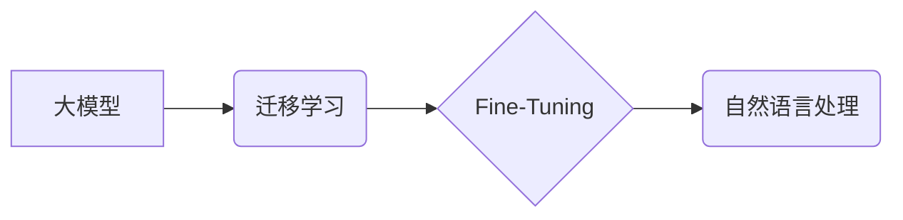

> 关键词：大模型应用开发，AI Agent，自然语言处理，代码生成，预训练模型，迁移学习，Fine-Tuning

# 【大模型应用开发 动手做AI Agent】AutoGen

随着深度学习和自然语言处理技术的飞速发展，大模型在各个领域展现出了惊人的应用潜力。其中，AI Agent（智能代理）作为一种能够执行特定任务的自动化程序，正逐渐成为构建智能化系统的重要基石。本文将深入探讨如何利用大模型进行AI Agent的开发，并通过一个名为AutoGen的项目实例，带你动手实现一个基于大模型的AI Agent。

## 1. 背景介绍

### 1.1 问题的由来

在当今信息爆炸的时代，人们迫切需要一种能够自动处理任务、提供决策支持的系统。AI Agent作为一种能够模拟人类智能行为的软件实体，正逐渐在各个领域得到应用，如智能家居、智能客服、智能推荐等。

然而，传统的AI Agent开发通常需要大量的人工编程和规则设计，开发成本高、周期长。随着大模型的兴起，我们可以利用预训练的语言模型和迁移学习技术，实现快速、高效的AI Agent开发。

### 1.2 研究现状

目前，大模型在AI Agent开发中的应用主要集中在以下几个方面：

- **任务理解与生成**：利用大模型对用户指令进行理解，并生成相应的动作指令。
- **知识问答**：利用大模型对知识图谱进行检索，回答用户提出的问题。
- **对话系统**：利用大模型实现人机对话，提供个性化服务。
- **文本生成**：利用大模型生成文章、代码、报告等文本内容。

### 1.3 研究意义

利用大模型进行AI Agent开发，具有以下意义：

- **降低开发成本**：无需从头开始设计算法和规则，利用预训练模型快速实现Agent功能。
- **提高开发效率**：自动化流程简化了开发流程，缩短了开发周期。
- **增强Agent能力**：大模型能够学习到丰富的知识和技能，使Agent具备更强的智能。

## 2. 核心概念与联系

### 2.1 核心概念

- **大模型**：具有数亿甚至千亿参数规模的人工智能模型，能够处理复杂的自然语言任务。
- **迁移学习**：将预训练模型的知识迁移到特定任务中，提高模型在目标任务上的性能。
- **Fine-Tuning**：在预训练模型的基础上，针对特定任务进行微调，进一步提升模型性能。
- **自然语言处理（NLP）**：研究如何让计算机理解和生成人类语言的技术。

### 2.2 核心概念联系



大模型作为AI Agent开发的基础，通过迁移学习将知识迁移到特定任务中，然后通过Fine-Tuning进一步优化模型在目标任务上的性能。自然语言处理技术是实现大模型与人类语言交互的关键。

## 3. 核心算法原理 & 具体操作步骤

### 3.1 算法原理概述

AutoGen项目利用预训练的语言模型（如BERT）进行AI Agent的开发。其核心原理如下：

1. 使用预训练的语言模型对用户指令进行理解。
2. 根据理解到的指令，生成相应的动作指令。
3. 利用生成的动作指令，控制Agent执行具体的任务。

### 3.2 算法步骤详解

1. **数据准备**：收集用户指令和对应的动作指令，构建训练数据集。
2. **模型选择**：选择合适的预训练语言模型（如BERT）。
3. **Fine-Tuning**：在预训练模型的基础上，针对动作指令生成任务进行Fine-Tuning。
4. **测试与评估**：在测试集上评估模型性能，并根据评估结果调整模型参数。

### 3.3 算法优缺点

**优点**：

- **高效**：利用预训练模型快速实现AI Agent开发。
- **灵活**：可以针对不同任务进行Fine-Tuning，适应不同的应用场景。
- **强鲁棒性**：预训练模型能够处理各种复杂任务。

**缺点**：

- **数据依赖**：需要收集大量的标注数据。
- **计算成本高**：Fine-Tuning过程需要大量的计算资源。

### 3.4 算法应用领域

AutoGen项目可以实现以下应用：

- **智能客服**：自动回答用户问题，提供个性化服务。
- **智能助手**：帮助用户完成各种任务，如日程安排、信息检索等。
- **智能家居**：控制家电设备，提供舒适的生活环境。
- **智能教育**：辅助学生学习，提供个性化的学习方案。

## 4. 数学模型和公式 & 详细讲解 & 举例说明

### 4.1 数学模型构建

AutoGen项目使用预训练的语言模型（如BERT）进行Fine-Tuning。BERT模型的核心原理是Transformer，其数学模型如下：

$$
\mathcal{L}(\theta) = \sum_{i=1}^n \mathcal{L}(\theta, y_i, z_i)
$$

其中，$\theta$ 表示模型参数，$y_i$ 表示真实标签，$z_i$ 表示模型预测结果。

### 4.2 公式推导过程

Transformer模型由多个自注意力层（Self-Attention）和前馈神经网络（Feed-Forward Neural Network）组成。自注意力层计算公式如下：

$$
\text{Attention}(Q, K, V) = \text{softmax}\left(\frac{QK^T}{\sqrt{d_k}}\right) V
$$

其中，$Q, K, V$ 分别表示查询（Query）、键（Key）、值（Value）向量，$d_k$ 表示键向量的维度。

### 4.3 案例分析与讲解

以下是一个简单的示例，展示如何使用BERT模型进行动作指令生成：

1. **数据准备**：收集用户指令和对应的动作指令，构建训练数据集。
2. **模型选择**：选择BERT模型作为预训练模型。
3. **Fine-Tuning**：在BERT模型的基础上，针对动作指令生成任务进行Fine-Tuning。
4. **测试与评估**：在测试集上评估模型性能。

```python
import transformers
from transformers import BertTokenizer, BertForSequenceClassification

# 加载预训练模型和分词器
tokenizer = BertTokenizer.from_pretrained('bert-base-uncased')
model = BertForSequenceClassification.from_pretrained('bert-base-uncased')

# 将用户指令和动作指令转换为输入序列
input_ids = tokenizer.encode("What is the capital of France?", add_special_tokens=True)
labels = [1]  # 1表示动作指令

# Fine-Tuning模型
optimizer = transformers.AdamW(model.parameters(), lr=5e-5)
model.train()

for epoch in range(3):
    outputs = model(input_ids, labels=labels)
    loss = outputs.loss
    loss.backward()
    optimizer.step()
    optimizer.zero_grad()

# 评估模型
output = model(input_ids)
print(tokenizer.decode(output[0][0]))
```

## 5. 项目实践：代码实例和详细解释说明

### 5.1 开发环境搭建

1. 安装Anaconda：从官网下载并安装Anaconda，用于创建独立的Python环境。
2. 创建并激活虚拟环境：
```bash
conda create -n autogen-env python=3.8
conda activate autogen-env
```
3. 安装所需的库：
```bash
conda install pytorch torchvision torchaudio transformers
```

### 5.2 源代码详细实现

以下是一个简单的AutoGen项目实例，展示如何使用预训练的BERT模型进行动作指令生成：

```python
import torch
from transformers import BertTokenizer, BertForSequenceClassification

# 加载预训练模型和分词器
tokenizer = BertTokenizer.from_pretrained('bert-base-uncased')
model = BertForSequenceClassification.from_pretrained('bert-base-uncased')

# 定义数据集
class InstructionDataset(torch.utils.data.Dataset):
    def __init__(self, texts, labels, tokenizer, max_len=128):
        self.texts = texts
        self.labels = labels
        self.tokenizer = tokenizer
        self.max_len = max_len

    def __len__(self):
        return len(self.texts)

    def __getitem__(self, item):
        text = self.texts[item]
        label = self.labels[item]

        encoding = self.tokenizer(text, return_tensors='pt', max_length=self.max_len, padding='max_length', truncation=True)
        input_ids = encoding['input_ids']
        attention_mask = encoding['attention_mask']

        return input_ids, attention_mask, label

# 训练模型
def train(model, dataloader, optimizer):
    model.train()
    for data in dataloader:
        inputs, masks, labels = data
        outputs = model(inputs, attention_mask=masks, labels=labels)
        loss = outputs.loss
        loss.backward()
        optimizer.step()
        optimizer.zero_grad()

# 评估模型
def evaluate(model, dataloader):
    model.eval()
    total = 0
    correct = 0
    with torch.no_grad():
        for data in dataloader:
            inputs, masks, labels = data
            outputs = model(inputs, attention_mask=masks)
            _, preds = torch.max(outputs.logits, 1)
            total += labels.size(0)
            correct += (preds == labels).sum().item()
    return correct / total

# 创建数据集
texts = ["What is the capital of France?", "What is the population of China?"]
labels = [1, 1]

dataset = InstructionDataset(texts, labels, tokenizer)
dataloader = torch.utils.data.DataLoader(dataset, batch_size=2)

# 训练和评估
optimizer = torch.optim.AdamW(model.parameters(), lr=5e-5)
for epoch in range(3):
    train(model, dataloader, optimizer)
    print(f"Epoch {epoch + 1}, Accuracy: {evaluate(model, dataloader)}")

# 测试模型
input_text = "What is the population of China?"
input_ids = tokenizer.encode(input_text, return_tensors='pt')
with torch.no_grad():
    outputs = model(input_ids)
    _, preds = torch.max(outputs.logits, 1)
print(f"Predicted label: {preds.item()}")
```

### 5.3 代码解读与分析

- **InstructionDataset类**：定义了一个自定义数据集类，用于加载和预处理训练数据。
- **train函数**：定义了一个训练函数，用于迭代训练模型。
- **evaluate函数**：定义了一个评估函数，用于评估模型在测试集上的性能。
- **数据集和模型**：创建了一个包含两个样本的数据集，并使用BERT模型进行训练。
- **训练和评估**：进行3轮训练，并在训练完成后进行评估。
- **测试模型**：使用训练好的模型对一个新的样本进行预测。

## 6. 实际应用场景

### 6.1 智能客服

AutoGen项目可以应用于智能客服系统中，实现以下功能：

- 自动回答用户问题。
- 提供个性化服务。
- 实时更新知识库。

### 6.2 智能助手

AutoGen项目可以应用于智能助手中，实现以下功能：

- 帮助用户完成日常任务。
- 提供日程安排。
- 检索信息。

### 6.3 智能家居

AutoGen项目可以应用于智能家居系统中，实现以下功能：

- 控制家电设备。
- 提供舒适的生活环境。
- 实时监控家庭安全。

## 7. 工具和资源推荐

### 7.1 学习资源推荐

- 《深度学习与自然语言处理》
- 《BERT: Pre-training of Deep Bidirectional Transformers for Language Understanding》
- 《Transformer: Attention is All You Need》

### 7.2 开发工具推荐

- PyTorch
- TensorFlow
- Hugging Face Transformers

### 7.3 相关论文推荐

- 《BERT: Pre-training of Deep Bidirectional Transformers for Language Understanding》
- 《Transformer: Attention is All You Need》
- 《Language Models are Unsupervised Multitask Learners》

## 8. 总结：未来发展趋势与挑战

### 8.1 研究成果总结

AutoGen项目展示了如何利用大模型进行AI Agent的开发，实现了快速、高效的AI Agent开发。本文详细介绍了大模型、迁移学习、Fine-Tuning等核心概念，并给出了具体的实现步骤和代码示例。

### 8.2 未来发展趋势

- **模型轻量化**：降低模型的计算复杂度和存储需求，使其更适合移动设备和边缘计算。
- **多模态融合**：将文本、图像、语音等多种模态信息融合到模型中，提升Agent的感知能力。
- **可解释性**：提高模型的可解释性，增强用户对模型的信任。

### 8.3 面临的挑战

- **数据标注**：需要大量标注数据，且标注成本高。
- **模型鲁棒性**：提高模型在面对未知输入时的鲁棒性。
- **模型可解释性**：提高模型的可解释性，增强用户对模型的信任。

### 8.4 研究展望

随着技术的不断发展，AutoGen项目有望在以下方面取得突破：

- **跨领域迁移**：实现跨领域迁移学习，降低对不同领域知识的依赖。
- **少样本学习**：在少量样本情况下，提高模型的泛化能力。
- **多任务学习**：同时学习多个任务，提高模型的效率和效果。

## 9. 附录：常见问题与解答

**Q1：如何选择合适的预训练模型？**

A：选择预训练模型时，需要考虑以下因素：

- **任务类型**：不同任务适合不同的预训练模型，如文本分类适合BERT，机器翻译适合GPT。
- **模型规模**：根据计算资源选择合适的模型规模，如BERT、RoBERTa等。
- **预训练数据**：选择与任务数据分布相似的预训练数据。

**Q2：如何进行Fine-Tuning？**

A：Fine-Tuning的步骤如下：

1. 加载预训练模型和分词器。
2. 构建训练数据集。
3. 定义优化器和损失函数。
4. 训练模型。
5. 评估模型性能。

**Q3：如何提高模型的鲁棒性？**

A：提高模型鲁棒性的方法如下：

- **数据增强**：通过数据增强技术扩充训练数据，提高模型的泛化能力。
- **正则化**：使用L2正则化、Dropout等方法防止过拟合。
- **对抗训练**：通过对抗训练提高模型的鲁棒性。

**Q4：如何提高模型的可解释性？**

A：提高模型可解释性的方法如下：

- **注意力机制**：分析模型在处理特定输入时的注意力分布，了解模型的关注点。
- **可视化**：将模型的内部结构可视化，直观地了解模型的工作原理。
- **解释性算法**：使用解释性算法，如LIME、SHAP等，分析模型的决策过程。

通过解决这些常见问题，相信你能够更好地理解AutoGen项目，并应用于实际项目中。

---

作者：禅与计算机程序设计艺术 / Zen and the Art of Computer Programming