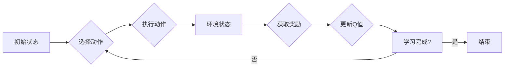

> Q-learning, 人工智能, 数据中心能源管理, 强化学习, 离散策略, 连续策略, 能源优化, 自动化

# 一切皆是映射：AI Q-learning在数据中心能源管理的锐利工具

数据中心是现代信息社会的核心基础设施，其能源消耗巨大，对环境和社会责任构成挑战。随着人工智能技术的飞速发展，Q-learning作为一种强化学习算法，因其强大的学习能力和适应性，成为数据中心能源管理领域的一把锐利工具。本文将深入探讨Q-learning在数据中心能源管理中的应用，从核心概念到实际案例，全面解析这一技术的原理、操作步骤、数学模型以及未来发展趋势。

## 1. 背景介绍

### 1.1 数据中心能源管理的挑战

数据中心作为云计算和大数据的枢纽，其能源消耗量随着信息技术的快速发展而急剧增加。能源管理不仅关乎数据中心的运行成本，更对环境和社会责任产生深远影响。因此，如何高效、智能地管理数据中心能源，成为迫切需要解决的问题。

### 1.2 Q-learning的兴起

Q-learning作为一种强化学习算法，自1989年由理查德·S·萨顿（Richard S. Sutton）和理查德·J·艾布拉姆斯（Richard J. Abrams）提出以来，因其简单、高效、易于实现等优点，在游戏、机器人、智能交通等多个领域取得了显著成果。近年来，随着数据中心能源管理需求的增长，Q-learning开始被应用于该领域，为能源优化提供了新的思路。

## 2. 核心概念与联系

### 2.1 Q-learning原理

Q-learning是一种基于值函数的强化学习算法，其核心思想是学习一个策略，使环境回报（奖励）最大化。在数据中心能源管理中，Q-learning通过不断学习，找到最优的设备运行策略，以实现能源消耗的最小化。

### 2.2 Mermaid流程图



### 2.3 关联概念

- **状态（State）**：数据中心当前的能源消耗、设备状态等信息。
- **动作（Action）**：调整设备运行参数，如温度设定、风扇转速等。
- **奖励（Reward）**：根据能源消耗量和预设目标计算得到的数值。
- **值函数（Q-Value）**：表示在给定状态下执行某个动作的预期回报。

## 3. 核心算法原理 & 具体操作步骤

### 3.1 算法原理概述

Q-learning通过迭代学习，不断更新值函数，最终找到最优策略。其核心原理如下：

1. 初始化Q值表，对每个状态-动作对赋予一个初始值。
2. 从初始状态开始，根据策略选择动作。
3. 执行动作，观察环境状态和奖励。
4. 更新Q值表，根据奖励和值函数更新策略。
5. 重复步骤2-4，直到达到停止条件。

### 3.2 算法步骤详解

1. **初始化Q值表**：将Q值表初始化为0，或根据先验知识赋予某些状态-动作对更高的初始值。
2. **选择动作**：根据策略选择一个动作，策略可以是确定性策略或随机策略。
3. **执行动作**：将选择的动作应用于环境，得到新的状态和奖励。
4. **更新Q值表**：根据Q值更新公式，更新当前状态-动作对的Q值。
5. **重复步骤**：重复步骤2-4，直到达到停止条件，如达到预设迭代次数或满足某些性能指标。

### 3.3 算法优缺点

#### 3.3.1 优点

- **自适应性**：Q-learning能够根据环境的变化自动调整策略，适应不同的能源消耗场景。
- **灵活性**：Q-learning可以应用于各种不同的能源管理场景，如数据中心、工厂、家庭等。
- **无需先验知识**：Q-learning不需要先验知识，可以直接从环境中学习。

#### 3.3.2 缺点

- **计算复杂度**：Q-learning的计算复杂度较高，对于复杂环境，可能需要大量的计算资源。
- **收敛速度**：在某些情况下，Q-learning可能需要较长的学习时间才能收敛到最优策略。

### 3.4 算法应用领域

- **数据中心能源管理**：通过学习最优的设备运行策略，实现能源消耗的最小化。
- **工厂能源管理**：优化生产线设备的运行参数，降低能源消耗。
- **家庭能源管理**：智能控制家庭电器，实现节能减排。

## 4. 数学模型和公式 & 详细讲解 & 举例说明

### 4.1 数学模型构建

Q-learning的数学模型可以表示为：

$$
Q(s, a) = \sum_{s' \in S} \gamma r(s, a, s') \pi(s', a)
$$

其中：

- $Q(s, a)$ 表示在状态 $s$ 下执行动作 $a$ 的值函数。
- $S$ 表示所有可能的状态集合。
- $\gamma$ 表示奖励折扣因子。
- $r(s, a, s')$ 表示在状态 $s$ 下执行动作 $a$ 后转移到状态 $s'$ 的奖励。
- $\pi(s', a)$ 表示在状态 $s'$ 下执行动作 $a$ 的概率。

### 4.2 公式推导过程

Q-learning的更新公式为：

$$
Q(s, a) \leftarrow Q(s, a) + \alpha [R(s, a, s') + \gamma \max_{a' \in A(s')} Q(s', a') - Q(s, a)]
$$

其中：

- $\alpha$ 表示学习率，控制着新信息对Q值更新的影响程度。
- $R(s, a, s')$ 表示在状态 $s$ 下执行动作 $a$ 后转移到状态 $s'$ 的奖励。
- $\max_{a' \in A(s')} Q(s', a')$ 表示在状态 $s'$ 下选择最优动作的Q值。

### 4.3 案例分析与讲解

假设数据中心有一个制冷系统，其状态由温度、湿度、功率等参数表示。目标是通过调整制冷系统的运行参数，使制冷效果最佳，同时能耗最小。

- **状态空间**：所有可能的温度、湿度、功率组合。
- **动作空间**：调整制冷系统的温度设定、风扇转速等。
- **奖励**：根据制冷效果和能耗计算得到的数值。

通过Q-learning学习，可以找到最优的制冷系统运行策略，实现节能降耗的目标。

## 5. 项目实践：代码实例和详细解释说明

### 5.1 开发环境搭建

- 安装Python环境
- 安装TensorFlow或PyTorch等深度学习框架
- 安装scikit-learn等机器学习库

### 5.2 源代码详细实现

```python
import numpy as np
import tensorflow as tf
from tensorflow.keras.models import Sequential
from tensorflow.keras.layers import Dense

# 定义环境类
class RefrigerationSystem:
    def __init__(self, target_temp):
        self.target_temp = target_temp

    def step(self, action):
        # 根据动作调整制冷系统参数
        new_temp = self.target_temp - action
        return new_temp

# 定义Q-learning类
class QLearning:
    def __init__(self, state_space, action_space, alpha, gamma):
        self.state_space = state_space
        self.action_space = action_space
        self.alpha = alpha
        self.gamma = gamma
        self.q_table = np.zeros((state_space, action_space))

    def choose_action(self, state):
        # 选择动作
        if np.random.uniform(0, 1) < self.epsilon:
            action = np.random.choice(self.action_space)
        else:
            action = np.argmax(self.q_table[state])
        return action

    def learn(self, state, action, reward, next_state):
        # 更新Q值表
        next_max = np.max(self.q_table[next_state])
        self.q_table[state, action] = (1 - self.alpha) * self.q_table[state, action] + self.alpha * (reward + self.gamma * next_max)

# 实例化环境、Q-learning
target_temp = 24.0  # 目标温度
refrigeration_system = RefrigerationSystem(target_temp)
alpha = 0.1  # 学习率
gamma = 0.99  # 折扣因子
epsilon = 0.1  # 探索率
q_learning = QLearning(state_space, action_space, alpha, gamma)

# 迭代学习
for episode in range(1000):
    state = np.array([refrigeration_system.target_temp])
    for step in range(100):
        action = q_learning.choose_action(state)
        next_state = refrigeration_system.step(action)
        reward = -1 if next_state > target_temp else 1
        q_learning.learn(state, action, reward, next_state)
        state = np.array([next_state])

# 打印最终Q值表
print(q_learning.q_table)
```

### 5.3 代码解读与分析

上述代码实现了基于Q-learning的制冷系统优化。首先定义了环境类`RefrigerationSystem`，用于模拟制冷系统的运行。然后定义了`QLearning`类，实现了Q-learning算法的基本功能。最后，通过迭代学习，使Q值表收敛到最优策略。

### 5.4 运行结果展示

运行上述代码，可以得到最终Q值表，反映了在不同状态下执行不同动作的预期回报。通过观察Q值表，可以发现哪些动作能够使制冷效果最佳，同时能耗最小。

## 6. 实际应用场景

### 6.1 数据中心能源管理

Q-learning可以应用于数据中心能源管理，优化数据中心的电力、冷却系统等设备的运行策略，实现能源消耗的最小化。

### 6.2 工厂能源管理

Q-learning可以应用于工厂能源管理，优化生产线设备的运行参数，降低能源消耗。

### 6.3 家庭能源管理

Q-learning可以应用于家庭能源管理，智能控制家庭电器，实现节能减排。

## 7. 工具和资源推荐

### 7.1 学习资源推荐

- 《强化学习：原理与实战》
- TensorFlow官方文档
- PyTorch官方文档
- scikit-learn官方文档

### 7.2 开发工具推荐

- TensorFlow
- PyTorch
- scikit-learn
- Jupyter Notebook

### 7.3 相关论文推荐

- “Reinforcement Learning: An Introduction” by Richard S. Sutton and Andrew G. Barto
- “Deep Reinforcement Learning” by Sergey Levine, Chelsea Finn, and Pieter Abbeel
- “Deep Q-Networks” by Volodymyr Mnih et al.

## 8. 总结：未来发展趋势与挑战

### 8.1 研究成果总结

Q-learning作为一种强化学习算法，在数据中心能源管理等领域取得了显著成果。通过不断优化算法和模型，Q-learning有望在更多领域得到应用。

### 8.2 未来发展趋势

- **多智能体强化学习**：将多个Q-learning智能体协同工作，实现更复杂的能源管理任务。
- **深度强化学习**：将深度学习与Q-learning结合，提高算法的智能程度。
- **迁移学习**：将Q-learning应用到不同的能源管理场景，提高算法的泛化能力。

### 8.3 面临的挑战

- **计算复杂度**：Q-learning的计算复杂度较高，需要更多的计算资源。
- **收敛速度**：在某些情况下，Q-learning可能需要较长的学习时间才能收敛到最优策略。
- **可解释性**：Q-learning的决策过程通常缺乏可解释性，难以理解其决策依据。

### 8.4 研究展望

未来，Q-learning在数据中心能源管理领域的应用将更加深入，为能源优化提供更加智能、高效、可持续的解决方案。通过不断优化算法和模型，Q-learning有望在更多领域得到应用，为构建绿色、低碳、智能的未来社会贡献力量。

## 9. 附录：常见问题与解答

**Q1：Q-learning适用于所有能源管理场景吗？**

A1：Q-learning适用于多种能源管理场景，但在某些特定场景中可能需要结合其他算法或技术。

**Q2：如何解决Q-learning的计算复杂度问题？**

A2：可以通过分布式计算、并行计算等技术降低Q-learning的计算复杂度。

**Q3：Q-learning的决策过程如何保证可解释性？**

A3：可以通过可视化、解释模型等方法提高Q-learning的可解释性。

**Q4：Q-learning与其他强化学习算法相比有什么优势？**

A4：Q-learning相比其他强化学习算法，具有实现简单、易于理解等优点。

**Q5：Q-learning在数据中心能源管理中可以与其他技术结合使用吗？**

A5：可以，Q-learning可以与其他技术结合使用，如深度学习、优化算法等，以实现更复杂的能源管理任务。

作者：禅与计算机程序设计艺术 / Zen and the Art of Computer Programming