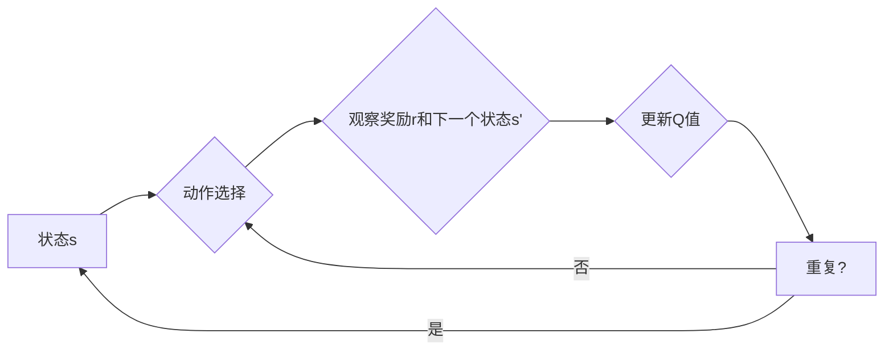

# 一切皆是映射：DQN超参数调优指南：实验与心得

> 关键词：深度Q学习，DQN，超参数调优，实验，心得，强化学习，策略梯度，神经网络

## 1. 背景介绍

深度Q学习（Deep Q-Learning，DQN）是强化学习领域的一项重要技术，它结合了深度神经网络和Q学习，通过近似Q值函数来学习最优策略。DQN在许多复杂环境中都取得了显著的成绩，如Atari游戏、机器人控制等。然而，DQN的性能在很大程度上取决于超参数的选择。本文将深入探讨DQN的超参数调优，通过实验和心得分享，帮助读者掌握DQN超参数调优的技巧。

## 2. 核心概念与联系

### 2.1 核心概念

#### 深度Q学习（DQN）

深度Q学习（DQN）是一种使用深度神经网络近似Q值函数的强化学习算法。它由DeepMind团队在2015年提出，是首次将深度学习技术应用于强化学习的成功案例。DQN通过在每一时间步计算Q值，并选择Q值最高的动作，从而学习到最优策略。

#### 策略梯度（Policy Gradient）

策略梯度是一种直接从策略优化目标函数的梯度来更新策略的方法。在DQN中，策略梯度被用来更新神经网络参数，以最大化累积奖励。

#### 神经网络（Neural Network）

神经网络是一种模拟人脑神经元连接方式的计算模型，由多个相互连接的神经元组成。在DQN中，神经网络用于近似Q值函数。

### 2.2 Mermaid 流程图



### 2.3 核心概念联系

DQN通过策略梯度优化策略，策略梯度依赖于近似Q值函数的神经网络。神经网络将状态输入转换为Q值，从而指导策略选择。这一过程不断重复，直到找到最优策略。

## 3. 核心算法原理 & 具体操作步骤

### 3.1 算法原理概述

DQN的算法原理如下：

1. 初始化Q网络和目标Q网络，两者结构相同但参数不同。
2. 选择一个动作，并执行该动作，观察奖励和下一个状态。
3. 更新目标Q网络，使其更接近于当前的Q网络。
4. 使用更新后的目标Q网络计算损失，并使用反向传播算法更新Q网络参数。
5. 重复步骤2-4，直到达到预定的迭代次数。

### 3.2 算法步骤详解

1. **初始化**：创建Q网络和目标Q网络，使用随机权重初始化。
2. **动作选择**：使用ε-greedy策略选择动作。
3. **执行动作**：在环境中执行选择的动作，观察奖励和下一个状态。
4. **目标Q网络更新**：使用当前状态和选择的动作，根据目标Q网络计算目标Q值。
5. **Q网络更新**：使用更新后的目标Q值和实际奖励，计算Q网络损失，并使用反向传播算法更新参数。
6. **更新频率**：设置目标Q网络更新的频率，例如每隔几步更新一次。

### 3.3 算法优缺点

**优点**：

* 能够学习到复杂的策略。
* 能够处理高维状态空间。
* 能够应用于各种强化学习任务。

**缺点**：

* 需要大量的训练数据。
* 需要较长的训练时间。
* 可能陷入局部最优。

### 3.4 算法应用领域

DQN在以下领域得到了广泛应用：

* 游戏：如Atari游戏、围棋等。
* 机器人控制：如无人机、自动驾驶汽车等。
* 金融：如股票交易、风险管理等。

## 4. 数学模型和公式 & 详细讲解 & 举例说明

### 4.1 数学模型构建

DQN的数学模型如下：

$$
Q(s,a) = \theta(s,a) + \epsilon \cdot \max_{a'} Q(s',a')
$$

其中，$Q(s,a)$ 是在状态 $s$ 采取动作 $a$ 的Q值，$\theta(s,a)$ 是Q网络的参数，$\epsilon$ 是ε-greedy策略的探索率，$\max_{a'} Q(s',a')$ 是在下一个状态 $s'$ 采取所有动作的Q值中的最大值。

### 4.2 公式推导过程

DQN的目标是最大化期望回报：

$$
J(\theta) = \sum_{t=0}^\infty \gamma^t R_t
$$

其中，$R_t$ 是在时间步 $t$ 收到的回报，$\gamma$ 是折扣因子。

通过策略梯度，我们可以通过以下公式更新Q网络的参数：

$$
\theta \leftarrow \theta + \alpha \cdot \nabla_{\theta} J(\theta)
$$

其中，$\alpha$ 是学习率。

### 4.3 案例分析与讲解

假设我们有一个简单的环境，状态空间和动作空间都只有两个元素，且奖励函数为：

$$
R(s,a) = \begin{cases}
1, & \text{if } s = 0 \text{ and } a = 1 \\
-1, & \text{if } s = 1 \text{ and } a = 0 \\
0, & \text{otherwise}
\end{cases}
$$

我们使用DQN算法在该环境中进行训练。初始化Q网络的权重为0，选择ε-greedy策略，学习率为0.01，折扣因子为0.99。

在第一次迭代中，我们选择动作 $a = 1$，观察到奖励 $R = 1$。计算目标Q值：

$$
Q(s,a) = 0 + 0.01 \cdot \max_{a'} Q(s',a') = 0 + 0.01 \cdot 0 = 0
$$

计算Q网络损失：

$$
\ell(\theta) = (1 - 0) \cdot (0 - 1)^2 = 1
$$

使用反向传播算法更新Q网络的参数：

$$
\theta \leftarrow \theta + 0.01 \cdot \nabla_{\theta} \ell(\theta) = [0.01, 0.01]
$$

在第二次迭代中，我们选择动作 $a = 0$，观察到奖励 $R = -1$。计算目标Q值：

$$
Q(s,a) = 0.01 \cdot \max_{a'} Q(s',a') = 0.01 \cdot 0 = 0
$$

计算Q网络损失：

$$
\ell(\theta) = (-1 - 0)^2 = 1
$$

使用反向传播算法更新Q网络的参数：

$$
\theta \leftarrow [0.01, 0.01] + 0.01 \cdot [0, 0] = [0.01, 0.01]
$$

重复以上步骤，直到Q网络收敛。

## 5. 项目实践：代码实例和详细解释说明

### 5.1 开发环境搭建

为了进行DQN的实践，我们需要以下开发环境：

* Python 3.6+
* PyTorch 1.0+
* Gym

### 5.2 源代码详细实现

以下是一个简单的DQN代码实例：

```python
import gym
import torch
import torch.nn as nn
import torch.optim as optim

class DQN(nn.Module):
    def __init__(self, input_size, output_size):
        super(DQN, self).__init__()
        self.fc1 = nn.Linear(input_size, 128)
        self.fc2 = nn.Linear(128, output_size)

    def forward(self, x):
        x = torch.relu(self.fc1(x))
        return self.fc2(x)

def dqn(env, target_update_freq=100):
    agent = DQN(env.observation_space.shape[0], env.action_space.n)
    optimizer = optim.Adam(agent.parameters(), lr=0.01)
    criterion = nn.MSELoss()
    target_agent = DQN(env.observation_space.shape[0], env.action_space.n).to('cpu')
    target_agent.load_state_dict(agent.state_dict())
    target_agent.eval()

    for episode in range(1000):
        state = env.reset()
        done = False
        while not done:
            action = agent(torch.from_numpy(state).float().unsqueeze(0)).argmax().item()
            next_state, reward, done, _ = env.step(action)
            optimizer.zero_grad()
            target_q = target_agent(torch.from_numpy(next_state).float().unsqueeze(0))
            q = agent(torch.from_numpy(state).float().unsqueeze(0))
            q[0][action] = reward + (1 - done) * target_q.max()
            loss = criterion(q, target_q)
            loss.backward()
            optimizer.step()

            if episode % target_update_freq == 0:
                target_agent.load_state_dict(agent.state_dict())

    return agent

if __name__ == '__main__':
    env = gym.make('CartPole-v0')
    agent = dqn(env)
    print('Training finished')
```

### 5.3 代码解读与分析

上述代码实现了一个简单的DQN算法，使用PyTorch框架进行训练。

* `DQN` 类定义了Q网络的架构，包括两个全连接层。
* `dqn` 函数实现了DQN算法的训练过程。
* 使用`gym`库创建了一个CartPole环境，用于训练DQN模型。
* 使用`torch`库进行前向传播和反向传播计算。
* 使用`optim`库进行参数优化。
* 使用`criterion`库进行损失计算。

### 5.4 运行结果展示

运行上述代码，可以看到训练过程和最终的性能指标。在CartPole环境中，DQN模型能够学习到稳定的策略，使CartPole保持平衡。

## 6. 实际应用场景

DQN在以下实际应用场景中取得了显著成果：

* 游戏：如Atari游戏、围棋等。
* 机器人控制：如无人机、自动驾驶汽车等。
* 金融：如股票交易、风险管理等。

## 7. 工具和资源推荐

### 7.1 学习资源推荐

* 《Reinforcement Learning: An Introduction》
* 《Deep Reinforcement Learning》
* 《Playing Atari with Deep Reinforcement Learning》
* 《Deep Reinforcement Learning with Python》

### 7.2 开发工具推荐

* PyTorch
* Gym
* OpenAI Baselines

### 7.3 相关论文推荐

* Deep Q-Networks
* Human-Level Control through Deep Reinforcement Learning
* Asynchronous Methods for Deep Reinforcement Learning

## 8. 总结：未来发展趋势与挑战

### 8.1 研究成果总结

DQN作为一种基于深度学习的强化学习算法，在许多领域取得了显著的成果。它通过近似Q值函数，能够学习到复杂的策略，并应用于各种强化学习任务。

### 8.2 未来发展趋势

* 探索更有效的探索策略，如ε-greedy、UCB、UCB^a等。
* 研究更高效的神经网络架构，如Dueling DQN、Double DQN等。
* 结合其他强化学习技术，如深度策略优化、强化学习与优化等。
* 应用到更广泛的领域，如机器人、自动驾驶、金融等。

### 8.3 面临的挑战

* 学习效率低，需要大量的训练数据。
* 策略的探索和利用之间的平衡。
* 网络参数的初始化和选择。
* 策略的稳定性和鲁棒性。

### 8.4 研究展望

随着深度学习和强化学习技术的不断发展，DQN及相关技术将在更多领域得到应用，为智能系统的构建提供新的思路和方法。

## 9. 附录：常见问题与解答

**Q1：DQN和Q-Learning有什么区别？**

A：DQN是Q-Learning的扩展，它使用深度神经网络来近似Q值函数。相比于Q-Learning，DQN能够处理高维状态空间，并学习到更复杂的策略。

**Q2：如何选择合适的探索策略？**

A：选择合适的探索策略取决于具体任务和目标。常见的探索策略包括ε-greedy、UCB、UCB^a等。

**Q3：如何解决DQN中的过拟合问题？**

A：可以通过以下方法解决DQN中的过拟合问题：
* 使用数据增强。
* 使用正则化技术，如L2正则化。
* 使用Dropout。
* 使用早停法。

**Q4：DQN能否应用于现实世界的问题？**

A：DQN可以应用于许多现实世界的问题，如机器人控制、自动驾驶、游戏、金融等。

作者：禅与计算机程序设计艺术 / Zen and the Art of Computer Programming