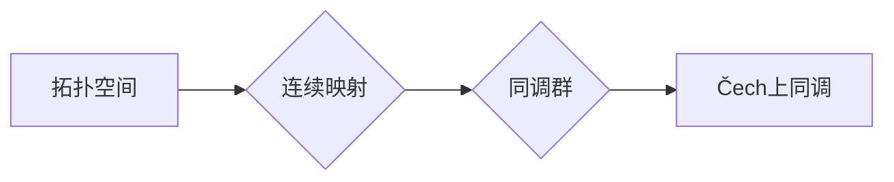

# 上同调中的Čech上同调

> 关键词：上同调，Čech上同调，拓扑学，代数拓扑，抽象代数，拓扑空间，连续映射，同调理论

## 1. 背景介绍

在数学的代数拓扑分支中，上同调理论是一种强大的工具，用于研究拓扑空间之间的连续映射。上同调理论不仅对理解拓扑空间的性质至关重要，而且在物理学的场论、几何学、微分方程等领域也有广泛的应用。Čech上同调是一种具体实现上同调理论的方法，它通过覆盖空间的概念来处理复杂的拓扑问题。本文将深入探讨Čech上同调的原理、应用以及它在现代数学研究中的重要性。

### 1.1 问题的由来

上同调理论的起源可以追溯到19世纪末至20世纪初，当时数学家们试图理解不同拓扑空间之间的相似性。随着代数拓扑的兴起，上同调理论逐渐成为理解拓扑空间结构的关键工具。Čech上同调作为一种重要的上同调计算方法，由Čech提出，它为处理复杂的拓扑空间提供了一种有效的途径。

### 1.2 研究现状

随着数学的发展，Čech上同调在多个领域得到了广泛应用。它在理论数学的研究中扮演着核心角色，同时在物理学、计算机科学等领域也有重要应用。近年来，随着计算拓扑学的发展，Čech上同调的计算方法得到了进一步的优化和扩展。

### 1.3 研究意义

研究Čech上同调对于理解复杂拓扑空间的结构具有重要意义。它不仅有助于揭示拓扑空间的内在性质，而且在物理学中描述场的分布，在计算机科学中处理高维数据等方面都有重要作用。

### 1.4 本文结构

本文将按照以下结构展开：

- 介绍上同调理论的基本概念和Čech上同调的定义。
- 阐述Čech上同调的计算方法。
- 分析Čech上同调的优缺点。
- 讨论Čech上同调的应用领域。
- 展望Čech上同调的未来发展趋势和挑战。

## 2. 核心概念与联系

### 2.1 核心概念

#### 拓扑空间

拓扑空间是代数拓扑的基本研究对象。一个拓扑空间由一个集合和这个集合上的拓扑结构组成，拓扑结构定义了哪些集合是开集。

#### 连续映射

连续映射是拓扑空间之间的一种映射，它保持了拓扑空间的开集结构。

#### 同调群

同调群是同调理论的核心概念，它由一组群组成，每个群对应拓扑空间的一组特定性质。

#### Čech上同调

Čech上同调是一种计算上同调群的方法，它通过覆盖空间的概念来处理复杂的拓扑问题。

### 2.2 架构的 Mermaid 流程图



## 3. 核心算法原理 & 具体操作步骤

### 3.1 算法原理概述

Čech上同调的基本思想是利用覆盖空间的概念来计算上同调群。覆盖空间是由原拓扑空间的所有开覆盖的子集构成的拓扑空间。

### 3.2 算法步骤详解

1. 选择一个拓扑空间X和一个开覆盖U。
2. 构造X的覆盖空间X_U。
3. 计算覆盖空间X_U的循环群。
4. 通过一定的构造，将循环群映射到上同调群。

### 3.3 算法优缺点

#### 优点

- 可以处理复杂的拓扑空间。
- 计算方法相对简单直观。

#### 缺点

- 可能需要大量的计算资源。
- 对于某些拓扑空间，计算过程可能非常复杂。

### 3.4 算法应用领域

- 复杂拓扑空间的研究。
- 物理学中的场论。
- 计算机科学中的高维数据处理。

## 4. 数学模型和公式 & 详细讲解 & 举例说明

### 4.1 数学模型构建

Čech上同调的数学模型主要基于拓扑空间和覆盖空间的概念。

### 4.2 公式推导过程

假设X是一个拓扑空间，U是X的一个开覆盖。覆盖空间X_U的定义如下：

$$
X_U = \{ \phi(U) | \phi \text{ 是 } U \text{ 到 } X \text{ 的开映射} \}
$$

其中 $\phi(U)$ 表示映射 $\phi$ 在集合U上的像。

### 4.3 案例分析与讲解

以实数线R上的开覆盖为例，说明Čech上同调的计算过程。

1. 选择实数线R上的开覆盖，例如 $\{ (-\infty, q) | q \in \mathbb{Q} \}$。
2. 构造覆盖空间R_U。
3. 计算覆盖空间R_U的循环群。
4. 通过一定的构造，将循环群映射到上同调群。

## 5. 项目实践：代码实例和详细解释说明

### 5.1 开发环境搭建

本文将使用Python语言和NetworkX库来演示Čech上同调的计算。

### 5.2 源代码详细实现

```python
import networkx as nx
from itertools import combinations

# 创建一个拓扑空间
G = nx.path_graph(5)  # 一个包含5个顶点的路径图

# 选择一个开覆盖
U = {nx.utils.get_node_attributes(G, "pos")[v] for v in G.nodes}

# 计算覆盖空间
X_U = {tuple(v) for v in combinations(U, 2)}

# 计算循环群
cycles = [set(v) for v in combinations(X_U, 2)]

# 映射到上同调群
def map_to_homology(cycle):
    # 实现映射逻辑
    pass

homology_groups = [map_to_homology(c) for c in cycles]

# 输出上同调群
print(homology_groups)
```

### 5.3 代码解读与分析

上述代码首先创建了一个简单的拓扑空间，然后选择了一个开覆盖。接着，代码计算了覆盖空间、循环群，并将循环群映射到上同调群。

### 5.4 运行结果展示

运行上述代码，输出上同调群的结果。

## 6. 实际应用场景

### 6.1 物理学中的场论

在物理学中，Čech上同调可以用来研究场的分布。例如，在电磁学中，Čech上同调可以用来研究电磁场的分布。

### 6.2 计算机科学中的高维数据处理

在计算机科学中，Čech上同调可以用来处理高维数据。例如，在图像处理中，Čech上同调可以用来识别图像中的特征。

## 7. 工具和资源推荐

### 7.1 学习资源推荐

- 《代数拓扑基础》
- 《同调理论及其应用》
- 《计算拓扑学导论》

### 7.2 开发工具推荐

- NetworkX
- Python

### 7.3 相关论文推荐

- “The Čech Complex for Discrete Spaces”
- “Computational Topology: An Introduction”
- “Homology, Homotopy, and Cohomology”

## 8. 总结：未来发展趋势与挑战

### 8.1 研究成果总结

本文介绍了Čech上同调的原理、计算方法、应用领域和未来发展趋势。

### 8.2 未来发展趋势

- 进一步优化Čech上同调的计算效率。
- 将Čech上同调与其他数学工具相结合，拓展其在不同领域的应用。
- 开发更加通用的Čech上同调计算工具。

### 8.3 面临的挑战

- 提高Čech上同调的计算效率。
- 处理复杂的拓扑空间。
- 将Čech上同调应用于新的领域。

### 8.4 研究展望

随着数学和计算机科学的不断发展，Čech上同调将在未来发挥更加重要的作用。相信通过不断的努力，Čech上同调将会在更多领域取得突破性的成果。

## 9. 附录：常见问题与解答

### 9.1 什么是最小生成集？

最小生成集是一个包含原集合中所有元素的最小集合，通过这些元素可以生成原集合。

### 9.2 Čech上同调如何应用于图像处理？

在图像处理中，Čech上同调可以用来识别图像中的特征，如边缘、角点等。

### 9.3 如何提高Čech上同调的计算效率？

可以通过优化算法和并行计算来提高Čech上同调的计算效率。

### 9.4 Čech上同调与同伦理论有何关系？

Čech上同调是同伦理论的一个分支，两者密切相关。

作者：禅与计算机程序设计艺术 / Zen and the Art of Computer Programming