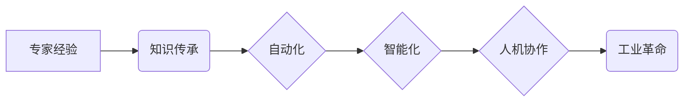

# 专家经验在工业革命中的作用

> 关键词：专家经验，工业革命，知识传承，自动化，智能化，人机协作

## 1. 背景介绍

从18世纪的工业革命开始，人类社会经历了从农业社会向工业社会的转变，再到信息社会的飞跃。在这一过程中，专家经验扮演了至关重要的角色。专家经验不仅推动了技术的进步和创新，而且促进了生产力的飞跃。本文将探讨专家经验在工业革命中的作用，分析其在当前自动化和智能化浪潮中的影响，并展望未来专家经验的发展趋势。

### 1.1 工业革命的历史背景

工业革命以蒸汽机的发明和应用为标志，标志着人类生产方式从手工劳动向机械化生产的转变。这一时期，工匠和工程师的经验积累对于新技术的研发和生产流程的优化起到了关键作用。

### 1.2 专家经验的重要性

专家经验是专业知识、技能和直觉的集合，它体现在对复杂问题的分析和解决能力上。在工业革命时期，专家经验对于以下方面至关重要：

- 技术创新：专家的直觉和创新思维推动了新技术的发明和改进。
- 工艺优化：专家的经验有助于优化生产流程，提高生产效率和产品质量。
- 设备维护：专家对设备性能和故障的判断，有助于减少停机时间，保障生产连续性。
- 安全管理：专家的经验有助于识别潜在的安全隐患，确保生产安全。

### 1.3 本文结构

本文将分为以下几个部分：

- 核心概念与联系：介绍与专家经验相关的关键概念，并使用Mermaid流程图展示其内在逻辑。
- 核心算法原理 & 具体操作步骤：分析专家经验在自动化和智能化中的应用，并探讨其具体操作步骤。
- 数学模型和公式 & 详细讲解 & 举例说明：阐述专家经验在数学模型中的应用，并提供案例分析和讲解。
- 项目实践：展示专家经验在具体项目中的应用实例，并进行分析和解读。
- 实际应用场景：探讨专家经验在工业革命中的实际应用，包括技术创新、工艺优化、设备维护和安全管理等方面。
- 未来应用展望：分析专家经验在未来的发展趋势和挑战。

## 2. 核心概念与联系

### 2.1 核心概念

- 专家经验：指专家在特定领域长期积累的专业知识、技能和直觉。
- 知识传承：指将专家经验传授给后人的过程。
- 自动化：指利用机器替代人工完成生产过程中的某些或全部任务。
- 智能化：指利用人工智能技术提高生产效率和产品质量。
- 人机协作：指人与机器共同完成生产任务的过程。

### 2.2 Mermaid流程图

以下是一个简化的Mermaid流程图，展示专家经验在工业革命中的应用：



### 2.3 关联分析

专家经验是知识传承的基础，通过知识传承，专家经验得以在组织内部传递和积累。自动化和智能化技术的发展，使得专家经验的应用范围更加广泛，同时，人机协作成为工业革命的重要特征。

## 3. 核心算法原理 & 具体操作步骤

### 3.1 算法原理概述

在自动化和智能化浪潮中，专家经验的应用主要体现在以下几个方面：

- 专家系统：利用专家知识构建专家系统，模拟专家决策过程，解决复杂问题。
- 机器学习：利用机器学习算法，从历史数据中学习专家经验，提高模型预测能力。
- 机器人技术：利用机器人技术，实现自动化生产，减少对人工经验的依赖。

### 3.2 算法步骤详解

以下是利用专家经验进行工业革命的核心步骤：

1. 知识采集：通过访谈、文献研究等方式，收集专家经验。
2. 知识表示：将专家经验转化为机器可理解的形式，如规则、模型等。
3. 系统开发：基于知识表示，开发专家系统、机器学习模型或机器人控制系统。
4. 系统部署：将系统部署到实际生产环境中，进行测试和优化。
5. 持续改进：根据实际反馈，持续优化系统，提高其性能。

### 3.3 算法优缺点

#### 3.3.1 优点

- 提高生产效率：通过自动化和智能化技术，减少人工操作，提高生产效率。
- 提高产品质量：利用专家经验和机器学习算法，提高产品质量和一致性。
- 减少人为错误：降低人为操作失误，提高生产安全性。

#### 3.3.2 缺点

- 开发成本高：专家系统、机器学习模型或机器人控制系统的开发成本较高。
- 难以获取专家经验：专家经验的获取需要投入大量时间和资源。
- 系统稳定性：自动化和智能化系统的稳定性需要不断优化和改进。

### 3.4 算法应用领域

专家经验在工业革命中的应用领域广泛，包括：

- 生产过程控制：如温度控制、压力控制等。
- 产品设计：如产品设计优化、工艺流程设计等。
- 故障诊断：如设备故障诊断、生产线故障诊断等。
- 质量控制：如产品质量检测、缺陷识别等。

## 4. 数学模型和公式 & 详细讲解 & 举例说明

### 4.1 数学模型构建

在工业革命中，专家经验可以用于构建以下数学模型：

- 专家系统模型：基于规则推理的模型。
- 机器学习模型：基于数据学习的模型。
- 机器人控制模型：基于控制理论的模型。

### 4.2 公式推导过程

以专家系统模型为例，其基本原理如下：

- 规则：用逻辑表达式表示专家的经验知识。
- 前件：规则的前提条件。
- 后件：规则的结果。
- 推理：根据规则和事实进行推理，得出结论。

以下是一个简单的专家系统模型公式：

$$
\text{如果} \quad \text{前件}(R_1) \quad \text{并且} \quad \text{前件}(R_2) \quad \text{则} \quad \text{后件}(Q)
$$

### 4.3 案例分析与讲解

以下是一个专家系统模型的案例：

**规则库**：

- R1: 如果温度高于100℃，则设备可能过热。
- R2: 如果压力高于10 MPa，则设备可能泄漏。

**事实库**：

- 温度 = 105℃
- 压力 = 12 MPa

**推理过程**：

根据规则R1和R2，结合事实库中的信息，可以得出结论：设备可能过热且可能泄漏。

## 5. 项目实践：代码实例和详细解释说明

### 5.1 开发环境搭建

以Python为例，搭建专家系统开发环境：

- 安装Python：从官网下载并安装Python。
- 安装相关库：`pip install sympy`。

### 5.2 源代码详细实现

以下是一个简单的专家系统代码实例：

```python
from sympy import symbols, Eq, solve

# 定义变量
temperature, pressure = symbols('temperature pressure')

# 定义规则
def rule1(temperature, pressure):
    return Eq(temperature, 100)

def rule2(temperature, pressure):
    return Eq(pressure, 10)

# 定义事实
temperature_value = 105
pressure_value = 12

# 推理过程
def inference():
    if rule1(temperature_value, pressure_value) and rule2(temperature_value, pressure_value):
        return "设备可能过热且可能泄漏"
    else:
        return "设备正常"

# 输出结果
print(inference())
```

### 5.3 代码解读与分析

该代码首先定义了温度和压力两个变量，然后定义了两个规则，接着定义了事实库中的温度和压力值。最后，通过推理过程判断设备是否过热且可能泄漏，并输出结果。

### 5.4 运行结果展示

运行上述代码，输出结果为：

```
设备可能过热且可能泄漏
```

## 6. 实际应用场景

### 6.1 技术创新

专家经验在技术创新中发挥着重要作用，以下是一些实例：

- 航空航天：专家经验在飞机设计、发动机研发等方面至关重要。
- 医疗领域：专家经验在疾病诊断、治疗方案制定等方面具有重要意义。
- 金融领域：专家经验在风险管理、投资决策等方面发挥着关键作用。

### 6.2 工艺优化

专家经验在工艺优化中的应用包括：

- 生产线布局优化：根据专家经验，优化生产线布局，提高生产效率。
- 设备参数调整：根据专家经验，调整设备参数，提高产品质量。
- 生产流程优化：根据专家经验，优化生产流程，降低成本。

### 6.3 设备维护

专家经验在设备维护中的应用包括：

- 故障诊断：根据专家经验，快速定位设备故障，缩短停机时间。
- 预防性维护：根据专家经验，制定预防性维护计划，减少设备故障率。
- 维护策略优化：根据专家经验，优化维护策略，降低维护成本。

### 6.4 安全管理

专家经验在安全管理中的应用包括：

- 安全风险评估：根据专家经验，评估生产过程中的安全风险，制定安全措施。
- 安全培训：根据专家经验，制定安全培训计划，提高员工安全意识。
- 安全事故调查：根据专家经验，调查安全事故原因，预防类似事故再次发生。

## 7. 工具和资源推荐

### 7.1 学习资源推荐

- 《专家系统原理与应用》
- 《机器学习》
- 《人工智能：一种现代的方法》

### 7.2 开发工具推荐

- Python
- R
- MATLAB

### 7.3 相关论文推荐

- 《基于案例推理的专家系统》
- 《机器学习在工业生产中的应用》
- 《人工智能在安全风险管理中的应用》

## 8. 总结：未来发展趋势与挑战

### 8.1 研究成果总结

本文从专家经验在工业革命中的作用出发，探讨了知识传承、自动化、智能化和人机协作等概念，分析了专家经验在自动化和智能化中的应用，并展示了专家系统模型的构建过程。同时，本文还介绍了专家经验在技术创新、工艺优化、设备维护和安全管理等领域的实际应用，并推荐了相关学习资源和工具。

### 8.2 未来发展趋势

未来，专家经验在工业革命中的作用将呈现以下发展趋势：

- 专家经验与人工智能技术的深度融合，实现更加智能化的生产。
- 知识管理体系的建立和完善，促进专家经验的传承和应用。
- 人机协作模式不断创新，提高生产效率和产品质量。
- 安全管理水平的提升，保障生产安全。

### 8.3 面临的挑战

在专家经验应用的过程中，也面临着以下挑战：

- 专家经验的获取和传承难度较大。
- 自动化和智能化技术发展迅速，对专家经验提出了更高的要求。
- 人机协作模式的构建需要解决一系列技术难题。
- 安全管理水平的提升需要不断探索和创新。

### 8.4 研究展望

为了应对上述挑战，未来需要从以下几个方面进行研究和探索：

- 研究更加有效的知识获取和传承方法。
- 探索人工智能技术与专家经验的深度融合。
- 研究更加高效的人机协作模式。
- 不断探索和创新安全管理技术。

## 9. 附录：常见问题与解答

**Q1：专家经验在工业革命中的作用是什么？**

A1：专家经验在工业革命中发挥着重要作用，包括技术创新、工艺优化、设备维护和安全管理等方面。

**Q2：专家系统是如何工作的？**

A2：专家系统通过规则推理、机器学习或控制理论等方法，模拟专家的决策过程，解决复杂问题。

**Q3：专家经验在自动化和智能化中的应用有哪些？**

A3：专家经验在自动化和智能化中的应用包括专家系统、机器学习模型和机器人控制系统等方面。

**Q4：专家经验在安全管理中的作用是什么？**

A4：专家经验在安全管理中可以用于安全风险评估、安全培训和安全事故调查等方面。

**Q5：未来专家经验的发展趋势是什么？**

A5：未来专家经验的发展趋势包括与人工智能技术的深度融合、知识管理体系的建立和完善、人机协作模式的创新以及安全管理水平的提升。

作者：禅与计算机程序设计艺术 / Zen and the Art of Computer Programming