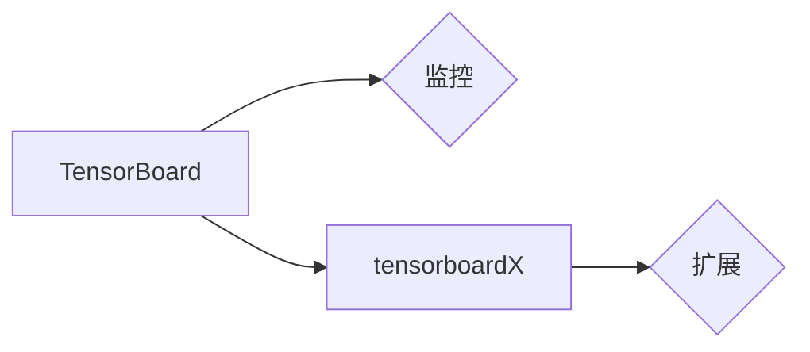

> 大模型开发，微调，TensorBoard，tensorboardX，可视化，深度学习

# 从零开始大模型开发与微调：tensorboardX可视化组件的使用

> 关键词：大模型开发，微调，TensorBoard，tensorboardX，可视化，深度学习

## 1. 背景介绍

随着深度学习技术的飞速发展，大规模语言模型（Large Language Models, LLMs）在自然语言处理（Natural Language Processing, NLP）领域取得了显著的成果。这些模型通常具有数亿甚至数千亿的参数，需要大量的计算资源和时间进行训练。在模型开发与微调过程中，可视化工具对于理解和分析模型性能至关重要。TensorBoard是一个由Google开发的开源可视化工具，它能够帮助开发者直观地监控和评估模型的训练过程。tensorboardX是TensorBoard的Python扩展，它提供了更多灵活的配置选项和可视化功能。本文将介绍如何从零开始使用tensorboardX进行大模型开发与微调，并探讨其在实际应用中的价值。

## 2. 核心概念与联系

### 2.1 大模型开发与微调

大模型开发是指构建和训练一个具有大规模参数和复杂结构的神经网络模型。微调是在预训练模型的基础上，使用特定任务的数据集对模型进行进一步的训练，以提高模型在特定任务上的性能。


### 2.2 TensorBoard与tensorboardX

TensorBoard是Google开发的开源可视化工具，用于展示深度学习模型的训练过程。tensorboardX是TensorBoard的Python扩展，它提供了更多的配置选项和可视化功能，使得TensorBoard在Python环境中更加方便易用。



## 3. 核心算法原理 & 具体操作步骤

### 3.1 算法原理概述

TensorBoard和tensorboardX的基本原理是使用日志记录模型的训练过程，包括损失函数、准确率、学习率等指标，然后通过TensorBoard的可视化界面展示这些信息。

### 3.2 算法步骤详解

1. **安装tensorboardX**：
   ```bash
   pip install tensorboardX
   ```

2. **创建TensorBoard SummaryWriter**：
   ```python
   import torch
   from torch.utils.tensorboard import SummaryWriter

   writer = SummaryWriter('runs/experiment')
   ```

3. **在训练循环中记录指标**：
   ```python
   for epoch in range(num_epochs):
       for batch in data_loader:
           # ... 模型训练代码 ...

           # 记录损失函数
           loss = ...  # 计算损失值
           writer.add_scalar('Loss/train', loss, epoch)

           # 记录准确率
           accuracy = ...  # 计算准确率
           writer.add_scalar('Accuracy/train', accuracy, epoch)

           # ... 记录其他指标 ...

   writer.close()
   ```

4. **启动TensorBoard**：
   ```bash
   tensorboard --logdir=runs
   ```

5. **访问TensorBoard可视化界面**：
   打开浏览器，访问 `http://localhost:6006`，即可看到可视化的训练过程。

### 3.3 算法优缺点

**优点**：

- **直观易用**：TensorBoard提供直观的图形界面，方便开发者可视化地观察训练过程。
- **功能丰富**：支持多种可视化指标，包括曲线图、直方图、图像等。
- **可扩展性**：tensorboardX扩展了TensorBoard的功能，提供了更多灵活的配置选项。

**缺点**：

- **性能开销**：TensorBoard需要消耗一定的系统资源，对于大规模模型可能影响训练速度。
- **数据存储**：需要将训练过程中的大量数据存储到磁盘，可能需要较大的存储空间。

### 3.4 算法应用领域

TensorBoard和tensorboardX在以下领域有广泛的应用：

- **深度学习模型训练**：监控和评估模型的训练过程。
- **数据可视化**：可视化数据集、模型结构、损失函数等。
- **模型比较**：比较不同模型的性能和训练过程。
- **实验记录**：记录和比较不同实验的结果。

## 4. 数学模型和公式 & 详细讲解 & 举例说明

### 4.1 数学模型构建

在TensorBoard中，可以记录各种数学模型和公式。以下是一个简单的例子：

```python
# 记录损失函数
writer.add_scalar('Loss/train', loss, epoch)

# 记录准确率
writer.add_scalar('Accuracy/train', accuracy, epoch)

# 记录学习率
writer.add_scalar('Learning_rate', learning_rate, epoch)
```

### 4.2 公式推导过程

以下是一个简单的神经网络损失函数的公式推导：

$$
L = \frac{1}{2} \sum_{i=1}^{N} (y_i - \hat{y}_i)^2
$$

其中，$L$ 为损失函数，$y_i$ 为真实标签，$\hat{y}_i$ 为模型预测值，$N$ 为样本数量。

### 4.3 案例分析与讲解

假设我们有一个简单的神经网络模型，用于分类任务。我们可以使用tensorboardX记录模型在不同epoch下的训练和验证损失函数，并观察其收敛情况。

```python
# ... 模型定义和训练代码 ...

# 记录损失函数
for epoch in range(num_epochs):
    for batch in train_loader:
        # ... 模型训练代码 ...
        loss_train = ...  # 计算训练损失
        writer.add_scalar('Loss/train', loss_train, epoch)

    for batch in val_loader:
        # ... 模型验证代码 ...
        loss_val = ...  # 计算验证损失
        writer.add_scalar('Loss/val', loss_val, epoch)

writer.close()
```

通过TensorBoard的可视化界面，我们可以观察到训练和验证损失函数随着epoch的增加而逐渐减小，表明模型正在收敛。

## 5. 项目实践：代码实例和详细解释说明

### 5.1 开发环境搭建

1. **安装PyTorch**：
   ```bash
   pip install torch torchvision torchaudio
   ```

2. **安装tensorboardX**：
   ```bash
   pip install tensorboardX
   ```

### 5.2 源代码详细实现

以下是一个使用PyTorch和tensorboardX进行神经网络分类任务的简单示例：

```python
import torch
import torch.nn as nn
import torch.optim as optim
from torch.utils.data import DataLoader
from torchvision import datasets, transforms
from tensorboardX import SummaryWriter

# 模型定义
class SimpleNN(nn.Module):
    def __init__(self):
        super(SimpleNN, self).__init__()
        self.fc1 = nn.Linear(784, 50)
        self.fc2 = nn.Linear(50, 10)

    def forward(self, x):
        x = torch.relu(self.fc1(x))
        x = self.fc2(x)
        return x

# 训练函数
def train(model, train_loader, optimizer, criterion):
    model.train()
    for batch_idx, (data, target) in enumerate(train_loader):
        optimizer.zero_grad()
        output = model(data)
        loss = criterion(output, target)
        loss.backward()
        optimizer.step()
        if batch_idx % 100 == 0:
            print('Train Epoch: {} [{}/{} ({:.0f}%)]\tLoss: {:.6f}'.format(
                epoch, batch_idx * len(data), len(train_loader.dataset),
                100. * batch_idx / len(train_loader), loss.item()))

# 主程序
if __name__ == '__main__':
    # 数据集和加载器
    transform = transforms.Compose([
        transforms.ToTensor(),
        transforms.Normalize((0.1307,), (0.3081,))
    ])
    trainset = datasets.MNIST(root='./data', train=True, download=True, transform=transform)
    train_loader = DataLoader(trainset, batch_size=64, shuffle=True)

    # 模型和优化器
    model = SimpleNN()
    optimizer = optim.SGD(model.parameters(), lr=0.01, momentum=0.9)

    # 损失函数
    criterion = nn.CrossEntropyLoss()

    # 创建SummaryWriter
    writer = SummaryWriter()

    # 训练模型
    for epoch in range(1, 11):
        train(model, train_loader, optimizer, criterion)
        # 记录训练损失和验证损失
        with torch.no_grad():
            for data, target in train_loader:
                output = model(data)
                loss = criterion(output, target)
                writer.add_scalar('Loss/train', loss.item(), epoch)
            for data, target in test_loader:
                output = model(data)
                loss = criterion(output, target)
                writer.add_scalar('Loss/test', loss.item(), epoch)

    writer.close()
```

### 5.3 代码解读与分析

这段代码定义了一个简单的神经网络模型，用于MNIST手写数字数据集的分类任务。在训练过程中，使用tensorboardX记录训练和验证损失函数，并在TensorBoard中可视化。

### 5.4 运行结果展示

运行上述代码后，可以在TensorBoard的可视化界面中看到训练和验证损失函数随epoch增加而逐渐减小的趋势，表明模型正在收敛。

## 6. 实际应用场景

TensorBoard和tensorboardX在大模型开发与微调中的应用场景非常广泛，以下是一些实际应用案例：

- **监控模型性能**：在模型训练过程中，监控损失函数、准确率等指标，及时发现问题并进行调整。
- **比较模型结构**：比较不同模型的结构和性能，选择最优的模型结构。
- **分析模型行为**：分析模型的训练过程，了解模型的学习机制和性能变化。
- **优化训练策略**：根据可视化结果，优化训练策略，如调整学习率、优化数据加载等。

## 7. 工具和资源推荐

### 7.1 学习资源推荐

- **TensorBoard官方文档**：提供了详细的TensorBoard使用说明和教程。
- **tensorboardX官方文档**：介绍了tensorboardX的安装和配置方法。
- **PyTorch官方文档**：提供了PyTorch的完整文档和教程，包括如何使用TensorBoard和tensorboardX。

### 7.2 开发工具推荐

- **PyTorch**：Python深度学习框架，提供了丰富的模型构建和训练工具。
- **Jupyter Notebook**：用于交互式数据分析和可视化。
- **Google Colab**：在线Python编程平台，提供免费的GPU和TPU算力。

### 7.3 相关论文推荐

- **TensorBoard: A Visualization Tool for Large-Scale Machine Learning**：介绍了TensorBoard的设计和实现。
- **tensorboardX: A Flexible Extension of TensorBoard for Enhanced Training Visualization**：介绍了tensorboardX的扩展功能和用途。

## 8. 总结：未来发展趋势与挑战

### 8.1 研究成果总结

本文介绍了大模型开发与微调过程中使用tensorboardX进行可视化的方法和技巧。通过TensorBoard和tensorboardX，开发者可以方便地监控和评估模型的训练过程，优化训练策略，提高模型性能。

### 8.2 未来发展趋势

未来，TensorBoard和tensorboardX可能会朝着以下方向发展：

- **更丰富的可视化功能**：提供更多种类的可视化指标和图表。
- **更好的用户体验**：改进用户界面，提供更直观的交互方式。
- **更高效的性能**：优化性能，减少资源消耗。

### 8.3 面临的挑战

TensorBoard和tensorboardX在实际应用中可能面临以下挑战：

- **数据量增长**：随着模型规模的增大，需要存储和处理更多的数据。
- **可视化复杂性**：对于复杂的模型，如何展示其训练过程和性能是一个挑战。

### 8.4 研究展望

未来，TensorBoard和tensorboardX将继续在大模型开发与微调中发挥重要作用。随着深度学习技术的不断发展，可视化工具将变得更加智能化、自动化，为开发者提供更便捷、高效的工具，推动深度学习技术的进步。

## 9. 附录：常见问题与解答

**Q1：如何将TensorBoard可视化结果保存到图片？**

A：在TensorBoard的可视化界面中，可以点击“Save”按钮将当前页面的可视化结果保存为图片。

**Q2：如何将tensorboardX记录的数据导出为其他格式？**

A：可以使用tensorboardX的`add_hparams`方法记录超参数，并使用`export_scalars_to_json`方法将数据导出为JSON格式。

**Q3：如何将TensorBoard可视化结果嵌入到自己的网页中？**

A：可以使用TensorBoard的JavaScript API将可视化结果嵌入到自己的网页中。

**Q4：如何自定义TensorBoard的可视化指标？**

A：可以使用tensorboardX的`add_custom_scalar`方法自定义可视化指标。

**Q5：如何使用tensorboardX可视化图像数据？**

A：可以使用tensorboardX的`add_image`方法可视化图像数据。

作者：禅与计算机程序设计艺术 / Zen and the Art of Computer Programming