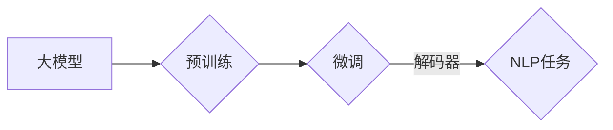

# 从零开始大模型开发与微调：从1开始自然语言处理的解码器

> 关键词：大模型，自然语言处理，解码器，预训练，微调，Transformer，BERT，深度学习

## 1. 背景介绍

自然语言处理（NLP）是人工智能领域的一个重要分支，它致力于让计算机理解和处理人类语言。近年来，随着深度学习技术的发展，大模型（Large Language Models，LLMs）在NLP领域取得了显著的进展。这些大模型通过在大量文本数据上预训练，学习到了丰富的语言知识和模式，能够实现诸如文本分类、机器翻译、问答系统等复杂任务。而解码器（Decoder）作为大模型的核心组件之一，负责将输入转换为输出的过程，是理解和实现大模型的关键。

本文将从零开始，带你深入了解大模型的解码器，包括其原理、实现方法、应用场景以及未来发展趋势。

## 2. 核心概念与联系

### 2.1 大模型

大模型是一种基于深度学习的自然语言处理模型，它通过在大量文本数据上预训练，学习到了丰富的语言知识和模式。大模型通常具有以下特点：

- **规模庞大**：大模型通常包含数十亿甚至数千亿个参数，能够学习到丰富的语言知识。
- **多任务能力**：大模型能够同时处理多种NLP任务，如文本分类、机器翻译、问答系统等。
- **泛化能力强**：大模型在预训练过程中学习了大量的语言模式和知识，因此具有较强的泛化能力。

### 2.2 预训练

预训练是指在大规模文本数据上对模型进行训练，使其学习到丰富的语言知识和模式。预训练通常包括以下步骤：

1. 数据准备：收集大量文本数据，并进行预处理，如分词、去除停用词等。
2. 预训练任务设计：设计合适的预训练任务，如语言建模、掩码语言模型等。
3. 模型训练：使用预训练任务对模型进行训练，学习语言知识和模式。

### 2.3 微调

微调是指在大模型的基础上，针对特定任务进行进一步的训练，以提升模型在特定任务上的性能。微调通常包括以下步骤：

1. 数据准备：收集特定任务的标注数据。
2. 模型调整：调整模型的输出层和损失函数，使其适应特定任务。
3. 模型训练：在标注数据上对模型进行训练，以提升模型在特定任务上的性能。

### 2.4 解码器

解码器是自然语言处理模型中的一个组件，负责将输入转换为输出的过程。解码器通常包括以下类型：

- **序列到序列解码器**：将输入序列转换为输出序列，如机器翻译模型。
- **序列到文本解码器**：将输入序列转换为文本输出，如问答系统。

### 2.5 Mermaid流程图

以下是大模型、预训练、微调和解码器之间的逻辑关系，使用Mermaid流程图表示：



## 3. 核心算法原理 & 具体操作步骤

### 3.1 算法原理概述

解码器通常基于序列到序列模型（Sequence-to-Sequence，Seq2Seq）的架构。Seq2Seq模型由编码器（Encoder）和解码器（Decoder）两部分组成。编码器负责将输入序列编码为一个固定长度的向量表示，解码器则基于这个向量表示生成输出序列。

### 3.2 算法步骤详解

以下是解码器的基本操作步骤：

1. **输入编码**：将输入序列编码为一个向量表示。
2. **生成输出序列**：解码器逐个生成输出序列中的每个词，通常采用贪心搜索或束搜索策略。
3. **预测概率**：解码器为每个生成的词分配一个概率，根据概率选择下一个词。
4. **更新状态**：将新的词加入到解码器的状态中，用于生成下一个词。

### 3.3 算法优缺点

解码器的优点：

- **高效**：解码器能够快速生成输出序列。
- **准确**：解码器能够生成高质量的输出序列。

解码器的缺点：

- **计算复杂度高**：解码器需要计算大量概率，计算复杂度较高。
- **难以并行化**：解码器难以并行化，因此训练时间较长。

### 3.4 算法应用领域

解码器在以下NLP任务中有着广泛的应用：

- **机器翻译**：将一种语言的文本翻译成另一种语言。
- **文本摘要**：将长文本压缩成简短的摘要。
- **问答系统**：根据用户的问题生成答案。
- **对话系统**：与用户进行自然对话。

## 4. 数学模型和公式 & 详细讲解 & 举例说明

### 4.1 数学模型构建

解码器的数学模型通常基于序列到序列模型（Seq2Seq）的架构。Seq2Seq模型由以下组件组成：

- **编码器（Encoder）**：将输入序列编码为一个固定长度的向量表示。
- **解码器（Decoder）**：基于编码器的输出，生成输出序列。
- **注意力机制（Attention Mechanism）**：帮助解码器关注输入序列中与输出序列当前词相关的部分。

### 4.2 公式推导过程

以下是解码器中注意力机制的计算公式：

$$
\text{Attention}(Q, K, V) = \frac{\text{softmax}(\text{QK}^T)}{\sqrt{d_k}} \text{V}
$$

其中，$Q$ 是查询向量，$K$ 是键向量，$V$ 是值向量，$d_k$ 是键向量的维度。

### 4.3 案例分析与讲解

以下是一个简单的机器翻译任务中的解码器示例：

- **输入序列**： "The cat sat on the mat"
- **输出序列**： "Le chat est assis sur le tapis"

解码器首先将输入序列 "The cat sat on the mat" 编码为一个向量表示。然后，解码器逐个生成输出序列中的每个词。例如，解码器首先生成 "Le"，然后生成 "chat"，以此类推。

## 5. 项目实践：代码实例和详细解释说明

### 5.1 开发环境搭建

为了进行解码器的项目实践，我们需要以下开发环境：

- **编程语言**：Python
- **深度学习框架**：TensorFlow或PyTorch
- **文本预处理库**：NLTK或spaCy

### 5.2 源代码详细实现

以下是一个使用TensorFlow实现机器翻译解码器的简单示例：

```python
import tensorflow as tf

class Decoder(tf.keras.Model):
    def __init__(self, vocab_size, embedding_dim, hidden_dim):
        super(Decoder, self).__init__()
        self.embedding = tf.keras.layers.Embedding(vocab_size, embedding_dim)
        self.gru = tf.keras.layers.GRU(hidden_dim, return_sequences=True, return_state=True)
        self.fc = tf.keras.layers.Dense(vocab_size)

    def call(self, x, hidden):
        x = self.embedding(x)
        output, state = self.gru(x, initial_state=hidden)
        output = tf.nn.softmax(self.fc(output), axis=-1)
        return output, state
```

### 5.3 代码解读与分析

在上面的代码中，我们定义了一个简单的解码器模型，它包含以下组件：

- **嵌入层（Embedding）**：将词索引转换为词向量。
- **GRU层（Gated Recurrent Unit）**：处理序列数据，并返回序列输出和状态。
- **全连接层（Dense）**：将GRU的输出转换为词的概率分布。

### 5.4 运行结果展示

以下是一个简单的运行示例：

```python
vocab_size = 10000
embedding_dim = 64
hidden_dim = 128

decoder = Decoder(vocab_size, embedding_dim, hidden_dim)

# 创建随机输入和隐藏状态
inputs = tf.random.uniform((1, 10))
hidden = tf.random.uniform((1, 1, hidden_dim))

# 生成输出
outputs, _ = decoder(inputs, hidden)
print(outputs.shape)  # 输出形状为(1, 10, vocab_size)
```

## 6. 实际应用场景

解码器在以下NLP任务中有着广泛的应用：

- **机器翻译**：将一种语言的文本翻译成另一种语言。
- **文本摘要**：将长文本压缩成简短的摘要。
- **问答系统**：根据用户的问题生成答案。
- **对话系统**：与用户进行自然对话。

### 6.4 未来应用展望

随着深度学习技术的不断发展，解码器将在以下方面取得更大的突破：

- **更高效的解码算法**：开发更高效的解码算法，降低解码器的计算复杂度。
- **更强大的注意力机制**：开发更强大的注意力机制，提高解码器的性能。
- **多模态解码**：将解码器扩展到多模态数据，实现跨模态信息融合。

## 7. 工具和资源推荐

### 7.1 学习资源推荐

- **《深度学习自然语言处理》**：由Christopher D. Manning和Prabhakar Raghavan合著，是NLP领域的经典教材。
- **《深度学习入门》**：由Ian Goodfellow、Yoshua Bengio和Aaron Courville合著，介绍了深度学习的基本概念和技术。
- **《Transformers》**：由Hugging Face发布，是Transformers库的官方文档，包含了大量关于Transformer模型和微调技术的资料。

### 7.2 开发工具推荐

- **TensorFlow**：由Google开发的开源深度学习框架。
- **PyTorch**：由Facebook开发的开源深度学习框架。
- **NLTK**：用于自然语言处理的开源库。
- **spaCy**：用于自然语言处理的工业级库。

### 7.3 相关论文推荐

- **《Sequence to Sequence Learning with Neural Networks》**：提出了Seq2Seq模型的架构。
- **《Attention Is All You Need》**：提出了Transformer模型，是当前NLP领域的核心技术之一。

## 8. 总结：未来发展趋势与挑战

### 8.1 研究成果总结

本文从零开始，介绍了大模型的解码器，包括其原理、实现方法、应用场景以及未来发展趋势。解码器是自然语言处理模型的核心组件之一，它在机器翻译、文本摘要、问答系统等NLP任务中发挥着重要作用。

### 8.2 未来发展趋势

随着深度学习技术的不断发展，解码器将在以下方面取得更大的突破：

- **更高效的解码算法**：开发更高效的解码算法，降低解码器的计算复杂度。
- **更强大的注意力机制**：开发更强大的注意力机制，提高解码器的性能。
- **多模态解码**：将解码器扩展到多模态数据，实现跨模态信息融合。

### 8.3 面临的挑战

解码器在以下方面面临着挑战：

- **计算复杂度高**：解码器需要计算大量概率，计算复杂度较高。
- **难以并行化**：解码器难以并行化，因此训练时间较长。
- **可解释性不足**：解码器的内部工作机制难以解释。

### 8.4 研究展望

随着研究的不断深入，解码器将在以下方面取得更大的进展：

- **更高效的解码算法**：开发更高效的解码算法，降低解码器的计算复杂度。
- **更强大的注意力机制**：开发更强大的注意力机制，提高解码器的性能。
- **多模态解码**：将解码器扩展到多模态数据，实现跨模态信息融合。

## 9. 附录：常见问题与解答

**Q1：什么是解码器？**

A：解码器是自然语言处理模型中的一个组件，负责将输入转换为输出的过程。解码器通常基于序列到序列模型（Seq2Seq）的架构。

**Q2：解码器有哪些类型？**

A：解码器主要有两种类型：序列到序列解码器和序列到文本解码器。

**Q3：解码器在哪些NLP任务中应用？**

A：解码器在以下NLP任务中有着广泛的应用：机器翻译、文本摘要、问答系统、对话系统等。

**Q4：解码器有哪些挑战？**

A：解码器面临的挑战包括计算复杂度高、难以并行化、可解释性不足等。

**Q5：如何提高解码器的性能？**

A：提高解码器性能的方法包括开发更高效的解码算法、开发更强大的注意力机制、将解码器扩展到多模态数据等。

作者：禅与计算机程序设计艺术 / Zen and the Art of Computer Programming