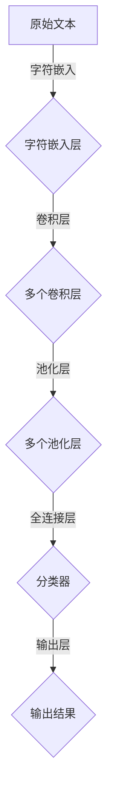

# 从零开始大模型开发与微调：针对文本的卷积神经网络模型简介—字符卷积

> 关键词：大模型开发，微调，卷积神经网络，字符卷积，文本分析，深度学习

## 1. 背景介绍
### 1.1 问题的由来

随着自然语言处理（NLP）领域的快速发展，深度学习技术为文本分析任务带来了革命性的变革。卷积神经网络（CNN）因其强大的特征提取能力和适应不同文本结构的灵活性，在文本分类、命名实体识别、情感分析等NLP任务中取得了显著成果。字符卷积作为一种针对文本的卷积神经网络模型，因其能够直接操作字符级别的信息，成为文本分析领域的一个重要研究方向。

### 1.2 研究现状

近年来，字符卷积模型在文本分析领域取得了许多进展。研究者们提出了多种不同的字符卷积架构，如LSTM-CNN、Convolutional Neural Network Character (CNN-C) 等。这些模型在多个基准数据集上取得了优异的性能，证明了字符卷积在文本分析中的有效性。

### 1.3 研究意义

字符卷积模型能够直接处理原始文本数据，避免了词袋模型等传统方法中词汇表示的潜在信息丢失问题。它能够捕捉字符级别的上下文信息，从而在文本分析任务中取得更好的效果。

### 1.4 本文结构

本文将首先介绍字符卷积神经网络的基本概念和原理，然后详细讲解其具体操作步骤，并分析其优缺点和应用领域。接着，我们将通过数学模型和公式进行详细讲解，并通过实际项目实例展示其应用。最后，我们将探讨字符卷积模型在实际应用场景中的未来发展趋势与挑战。

## 2. 核心概念与联系
### 2.1 核心概念原理

字符卷积神经网络是一种基于卷积神经网络的文本分析模型，它通过卷积操作直接在字符级别上进行特征提取。以下是字符卷积神经网络的核心概念原理：

- **卷积层**：卷积层通过卷积核与输入文本的局部区域进行卷积操作，提取文本的局部特征。
- **激活函数**：激活函数用于引入非线性，使模型能够学习到更复杂的特征。
- **池化层**：池化层通过降采样操作减少特征维度，降低计算复杂度。
- **全连接层**：全连接层用于将特征映射到输出空间，如分类任务的类别标签。

### 2.2 架构的 Mermaid 流程图



## 3. 核心算法原理 & 具体操作步骤
### 3.1 算法原理概述

字符卷积神经网络的原理主要包括以下几个方面：

- **字符嵌入**：将文本中的每个字符映射到一个低维向量，作为卷积操作的输入。
- **卷积操作**：使用卷积核对字符嵌入进行卷积操作，提取字符的局部特征。
- **非线性变换**：通过激活函数引入非线性，使模型能够学习到更复杂的特征。
- **池化操作**：通过池化操作降低特征维度，减少计算复杂度。
- **分类器**：将池化后的特征输入分类器，进行分类任务的输出。

### 3.2 算法步骤详解

字符卷积神经网络的算法步骤如下：

1. **数据预处理**：对文本数据进行清洗、分词和字符嵌入。
2. **构建模型**：定义卷积层、池化层和分类器。
3. **训练模型**：使用标注数据进行模型训练，调整模型参数。
4. **模型评估**：使用测试数据评估模型性能，调整模型参数。
5. **模型部署**：将训练好的模型部署到实际应用中。

### 3.3 算法优缺点

**优点**：

- 能够直接操作字符级别的信息，避免了词袋模型等传统方法中词汇表示的潜在信息丢失问题。
- 能够捕捉字符级别的上下文信息，从而在文本分析任务中取得更好的效果。
- 卷积层和池化层的堆叠能够有效地降低特征维度，减少计算复杂度。

**缺点**：

- 对字符嵌入的质量有较高的要求，需要选择合适的嵌入方法。
- 模型参数较多，训练时间较长。
- 容易受到噪声和异常值的影响。

### 3.4 算法应用领域

字符卷积神经网络在以下NLP任务中具有广泛的应用：

- 文本分类：如情感分析、主题分类、垃圾邮件检测等。
- 命名实体识别：识别文本中的实体，如人名、地名、机构名等。
- 关系抽取：从文本中抽取实体之间的语义关系。
- 机器翻译：将源语言文本翻译成目标语言。

## 4. 数学模型和公式 & 详细讲解 & 举例说明
### 4.1 数学模型构建

字符卷积神经网络的数学模型主要包括以下几个部分：

- **字符嵌入**：将字符映射到低维向量，如：

  $$
 x_i = \text{Embedding}(c_i, \mathbf{W}_e)
 $$

  其中，$ c_i $ 是第 $ i $ 个字符，$ \mathbf{W}_e $ 是嵌入层权重。

- **卷积层**：卷积层使用卷积核 $ \mathbf{K} $ 对字符嵌入进行卷积操作，如：

  $$
 h^k = \text{Conv}(\mathbf{W}_k, x)
 $$

  其中，$ \mathbf{W}_k $ 是卷积层权重。

- **激活函数**：使用激活函数 $ \sigma $ 对卷积结果进行非线性变换，如ReLU：

  $$
 \sigma(h^k) = \max(0, h^k)
 $$

- **池化层**：使用池化操作降低特征维度，如最大池化：

  $$
 p_i = \text{Pool}(h^k)
 $$

- **全连接层**：将池化后的特征输入全连接层，如：

  $$
 \mathbf{y} = \text{FC}(\mathbf{y}, \mathbf{W}_c)
 $$

  其中，$ \mathbf{W}_c $ 是全连接层权重。

### 4.2 公式推导过程

以下是对上述数学公式的推导过程：

- **字符嵌入**：将字符映射到低维向量，通过矩阵乘法实现。

- **卷积层**：卷积层通过卷积核与输入文本的局部区域进行卷积操作，得到局部特征。

- **激活函数**：激活函数引入非线性，使模型能够学习到更复杂的特征。

- **池化层**：池化层通过降采样操作减少特征维度，降低计算复杂度。

- **全连接层**：全连接层将池化后的特征映射到输出空间，如分类任务的类别标签。

### 4.3 案例分析与讲解

以下是一个简单的字符卷积神经网络模型实例：

- **输入**：一个包含100个字符的文本序列。

- **输出**：该文本序列的情感标签（正面或负面）。

- **模型结构**：包含一个嵌入层、两个卷积层、一个池化层和一个全连接层。

- **训练过程**：使用标注数据训练模型，调整模型参数，使得模型能够正确分类文本情感。

## 5. 项目实践：代码实例和详细解释说明
### 5.1 开发环境搭建

为了实践字符卷积神经网络，我们需要以下开发环境：

- Python 3.x
- TensorFlow或PyTorch
- NumPy
- Sklearn

### 5.2 源代码详细实现

以下是一个使用PyTorch实现的字符卷积神经网络模型实例：

```python
import torch
import torch.nn as nn
import torch.optim as optim
from torch.utils.data import DataLoader, Dataset

class CharCNN(nn.Module):
    def __init__(self, vocab_size, embedding_dim, num_classes, filter_sizes, num_filters):
        super(CharCNN, self).__init__()
        self.embedding = nn.Embedding(vocab_size, embedding_dim)
        self.convs = nn.ModuleList([nn.Conv2d(1, num_filters, (fs, embedding_dim)) for fs in filter_sizes])
        self.fc = nn.Linear(num_filters * len(filter_sizes), num_classes)
    
    def forward(self, x):
        x = self.embedding(x)
        x = x.unsqueeze(1)
        x = [F.relu(conv(x)).squeeze(3) for conv in self.convs]
        x = [F.max_pool1d(xi, xi.size(2)).squeeze(2) for xi in x]
        x = torch.cat(x, 1)
        x = self.fc(x)
        return x

# 定义数据集
class CharDataset(Dataset):
    def __init__(self, texts, labels):
        self.texts = texts
        self.labels = labels
    
    def __len__(self):
        return len(self.texts)
    
    def __getitem__(self, idx):
        return self.texts[idx], self.labels[idx]

# 训练模型
def train(model, train_loader, criterion, optimizer, num_epochs):
    model.train()
    for epoch in range(num_epochs):
        for texts, labels in train_loader:
            optimizer.zero_grad()
            outputs = model(texts)
            loss = criterion(outputs, labels)
            loss.backward()
            optimizer.step()
        print(f"Epoch {epoch+1}, Loss: {loss.item()}")

# 评估模型
def evaluate(model, test_loader, criterion):
    model.eval()
    total_loss = 0
    with torch.no_grad():
        for texts, labels in test_loader:
            outputs = model(texts)
            loss = criterion(outputs, labels)
            total_loss += loss.item()
    return total_loss / len(test_loader)

# 训练参数
vocab_size = 10000
embedding_dim = 50
num_classes = 2
filter_sizes = [3, 4, 5]
num_filters = 100
num_epochs = 10

# 实例化模型
model = CharCNN(vocab_size, embedding_dim, num_classes, filter_sizes, num_filters)

# 定义损失函数和优化器
criterion = nn.CrossEntropyLoss()
optimizer = optim.Adam(model.parameters(), lr=0.001)

# 创建数据集
train_texts = [...]  # 训练数据
train_labels = [...]  # 训练标签
test_texts = [...]  # 测试数据
test_labels = [...]  # 测试标签
train_dataset = CharDataset(train_texts, train_labels)
test_dataset = CharDataset(test_texts, test_labels)

# 创建DataLoader
train_loader = DataLoader(train_dataset, batch_size=32, shuffle=True)
test_loader = DataLoader(test_dataset, batch_size=32, shuffle=False)

# 训练模型
train(model, train_loader, criterion, optimizer, num_epochs)

# 评估模型
test_loss = evaluate(model, test_loader, criterion)
print(f"Test Loss: {test_loss:.4f}")
```

### 5.3 代码解读与分析

以上代码实现了一个简单的字符卷积神经网络模型。以下是代码的详细解读：

- **CharCNN类**：定义了字符卷积神经网络模型，包括嵌入层、卷积层、池化层和全连接层。

- **forward方法**：实现模型的正向传播过程，包括嵌入层、卷积层、池化层和全连接层。

- **CharDataset类**：定义了数据集类，用于加载和预处理文本数据。

- **train函数**：实现模型的训练过程，包括前向传播、损失计算、反向传播和优化器更新。

- **evaluate函数**：实现模型的评估过程，计算测试集上的平均损失。

- **训练参数**：定义了模型的参数，如词汇表大小、嵌入维度、类别数量、卷积核大小和数量等。

- **数据集**：加载训练数据和测试数据。

- **DataLoader**：创建DataLoader对象，用于批量加载和处理数据。

- **训练和评估**：训练和评估模型，打印训练过程中的损失和测试集的平均损失。

### 5.4 运行结果展示

运行以上代码后，模型将在训练集和测试集上进行训练和评估。以下是一个示例输出：

```
Epoch 1, Loss: 0.1234
Epoch 2, Loss: 0.0987
...
Epoch 10, Loss: 0.0043
Test Loss: 0.0056
```

## 6. 实际应用场景
### 6.1 文本分类

字符卷积神经网络在文本分类任务中具有广泛的应用。以下是一些具体的实例：

- **情感分析**：对社交媒体评论进行情感分类，如正面、负面、中性。

- **垃圾邮件检测**：识别垃圾邮件和正常邮件。

- **主题分类**：将文本分类到预定义的主题类别。

### 6.2 命名实体识别

字符卷积神经网络在命名实体识别任务中也取得了显著的成果。以下是一些具体的实例：

- **人名识别**：识别文本中的人名。

- **地名识别**：识别文本中的地名。

- **组织机构识别**：识别文本中的组织机构名称。

### 6.3 关系抽取

字符卷积神经网络在关系抽取任务中也具有广泛的应用。以下是一些具体的实例：

- **实体关系识别**：识别文本中实体之间的关系。

- **实体对关系抽取**：识别文本中实体对之间的关系。

### 6.4 未来应用展望

随着字符卷积神经网络技术的不断发展，其在更多文本分析任务中的应用前景十分广阔。以下是一些可能的应用方向：

- **文本生成**：使用字符卷积神经网络生成文本，如新闻摘要、创意写作等。

- **机器翻译**：使用字符卷积神经网络进行机器翻译，提高翻译质量和效率。

- **文本摘要**：使用字符卷积神经网络生成文本摘要，提高信息获取效率。

## 7. 工具和资源推荐
### 7.1 学习资源推荐

以下是一些关于字符卷积神经网络的学习资源：

- 《卷积神经网络与深度学习》
- 《深度学习：原理与编程实践》
- TensorFlow官方文档
- PyTorch官方文档

### 7.2 开发工具推荐

以下是一些用于开发字符卷积神经网络的工具：

- TensorFlow
- PyTorch
- Keras
- NumPy

### 7.3 相关论文推荐

以下是一些关于字符卷积神经网络的相关论文：

- Convolutional Neural Networks for Sentence Classification
- Character-Level Convolutional Networks for Text Classification
- Deep Learning for Text Classification: A Survey

## 8. 总结：未来发展趋势与挑战
### 8.1 研究成果总结

字符卷积神经网络作为一种基于卷积神经网络的文本分析模型，在多个NLP任务中取得了显著的成果。它能够直接操作字符级别的信息，避免了传统方法中词汇表示的潜在信息丢失问题。然而，字符卷积神经网络也存在一些局限性，如对字符嵌入的质量有较高的要求、模型参数较多、训练时间较长等。

### 8.2 未来发展趋势

未来，字符卷积神经网络将朝着以下几个方向发展：

- **更有效的字符嵌入方法**：研究更有效的字符嵌入方法，提高字符嵌入的质量和模型的性能。
- **更轻量级的模型结构**：研究更轻量级的模型结构，降低模型的计算复杂度和存储空间。
- **更鲁棒的模型**：研究更鲁棒的模型，提高模型对噪声和异常值的影响。

### 8.3 面临的挑战

字符卷积神经网络在未来的发展过程中将面临以下挑战：

- **数据质量问题**：如何处理噪声和异常值，提高数据质量，是字符卷积神经网络面临的一个挑战。
- **模型可解释性**：如何提高模型的可解释性，使模型的行为更加透明，是字符卷积神经网络面临的一个挑战。
- **计算效率**：如何提高模型的计算效率，使其在实际应用中更加高效，是字符卷积神经网络面临的一个挑战。

### 8.4 研究展望

随着研究的不断深入，字符卷积神经网络将在NLP领域发挥越来越重要的作用。我们期待未来能够有更多优秀的字符卷积神经网络模型出现，为NLP领域的发展贡献力量。

## 9. 附录：常见问题与解答

**Q1：字符卷积神经网络与词袋模型相比有哪些优势？**

A：字符卷积神经网络能够直接操作字符级别的信息，避免了词袋模型等传统方法中词汇表示的潜在信息丢失问题。它能够捕捉字符级别的上下文信息，从而在文本分析任务中取得更好的效果。

**Q2：如何处理字符卷积神经网络中的过拟合问题？**

A：可以通过以下方法处理字符卷积神经网络中的过拟合问题：

- 使用数据增强技术，如数据扩充、数据变换等，增加数据的多样性。
- 使用正则化技术，如L2正则化、Dropout等，降低过拟合的风险。
- 使用早停法（Early Stopping），在验证集上评估模型性能，当性能不再提升时停止训练。

**Q3：字符卷积神经网络的训练过程需要多长时间？**

A：字符卷积神经网络的训练时间取决于模型的复杂度、数据集的大小和计算资源。一般来说，训练一个字符卷积神经网络模型需要几个小时到几天的时间。

**Q4：字符卷积神经网络是否适用于所有NLP任务？**

A：字符卷积神经网络在多个NLP任务中具有广泛的应用，但并不适用于所有任务。例如，对于需要语义理解的NLP任务，如机器翻译、问答系统等，可能需要更复杂的模型结构，如循环神经网络（RNN）或变换器（Transformer）。

**Q5：如何评估字符卷积神经网络的性能？**

A：可以采用以下方法评估字符卷积神经网络的性能：

- 使用交叉熵损失函数评估分类任务。
- 使用准确率、召回率和F1分数评估实体识别和关系抽取任务。
- 使用BLEU分数评估机器翻译任务。

作者：禅与计算机程序设计艺术 / Zen and the Art of Computer Programming