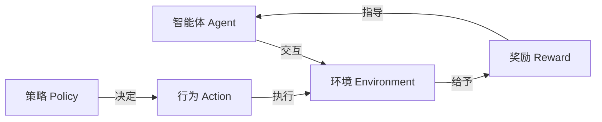
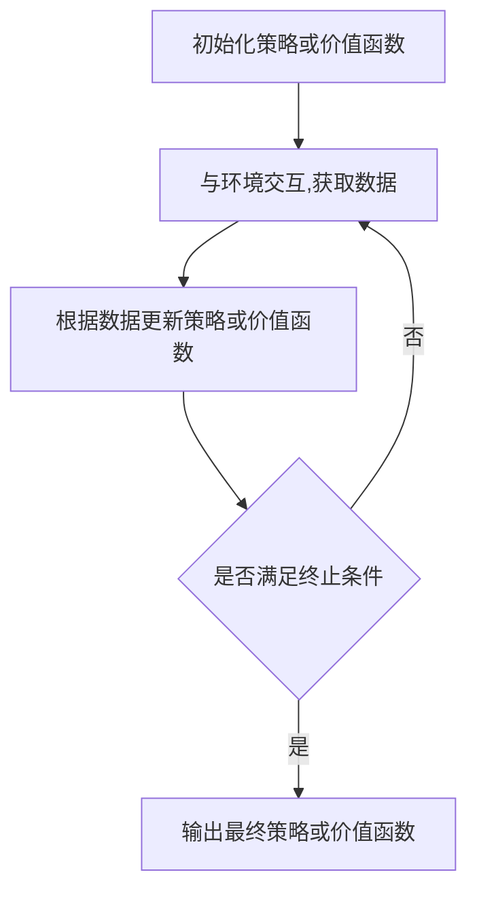
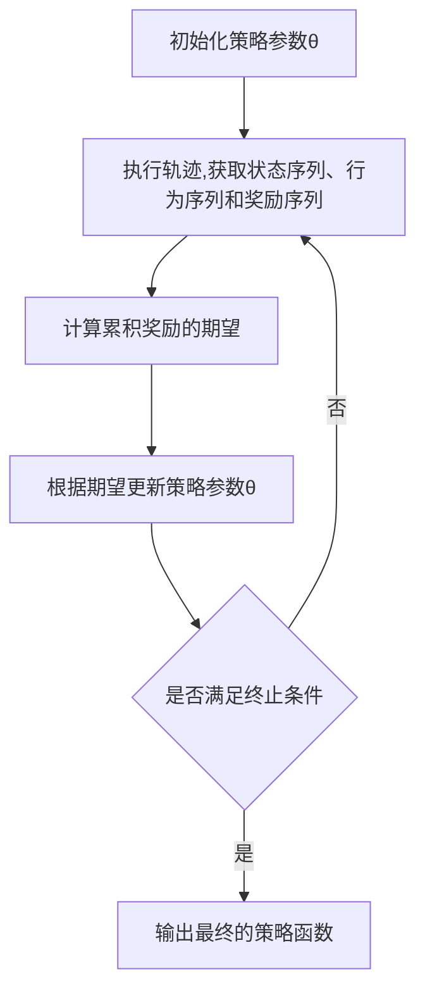

# 强化学习原理与代码实例讲解

## 1. 背景介绍

### 1.1 问题的由来

在传统的机器学习领域中,监督学习和无监督学习一直是主导地位。监督学习需要大量的标注数据作为训练集,而无监督学习则是从未标注的数据中发现隐藏的模式和结构。然而,这两种方法都存在一定的局限性。监督学习需要耗费大量的人力和时间成本来标注数据,而无监督学习虽然不需要标注数据,但是很难解决一些复杂的决策问题。

强化学习(Reinforcement Learning)作为机器学习的一个新兴分支,为解决这些问题提供了一种全新的思路。它模拟了人类和动物通过不断尝试、获得反馈并调整策略来学习的过程。在强化学习中,智能体(Agent)通过与环境(Environment)进行交互,根据获得的奖励(Reward)来调整自身的策略,最终达到最优化目标。

### 1.2 研究现状

近年来,强化学习在多个领域取得了突破性的进展,例如计算机游戏、机器人控制、自动驾驶、智能调度等。2016年,谷歌的AlphaGo战胜了世界顶尖的围棋手李世石,这标志着强化学习在复杂决策领域的巨大潜力。2020年,OpenAI的人工智能系统在57个Atari游戏中超过了人类的平均分数,展现了强化学习在视觉和控制方面的卓越表现。

与此同时,强化学习理论和算法也在不断发展和完善。例如,深度强化学习(Deep Reinforcement Learning)将深度神经网络引入强化学习,大幅提高了智能体的决策能力。另外,多智能体强化学习(Multi-Agent Reinforcement Learning)、分层强化学习(Hierarchical Reinforcement Learning)、元强化学习(Meta Reinforcement Learning)等新兴方向也吸引了广泛的关注。

### 1.3 研究意义

强化学习的研究具有重要的理论意义和应用价值:

1. **理论意义**:强化学习为机器学习提供了一种全新的范式,它不仅能解决监督学习和无监督学习无法解决的问题,而且还能模拟人类和动物的学习过程,为认知科学和神经科学提供了新的研究视角。

2. **应用价值**:强化学习可以应用于各种复杂的决策和控制问题,例如机器人控制、自动驾驶、智能调度、游戏AI等。它有望在这些领域取代传统的规则引擎和算法,实现更加智能和高效的决策。

### 1.4 本文结构

本文将全面介绍强化学习的原理、算法、数学模型以及实际应用。文章主要包括以下几个部分:

1. 核心概念与联系
2. 核心算法原理与具体操作步骤
3. 数学模型和公式详细讲解与举例说明
4. 项目实践:代码实例和详细解释说明
5. 实际应用场景
6. 工具和资源推荐
7. 总结:未来发展趋势与挑战
8. 附录:常见问题与解答

## 2. 核心概念与联系

强化学习是一种基于奖惩机制的学习方法,它由以下几个核心概念组成:



1. **智能体(Agent)**: 也称为决策者,它根据当前的状态选择行为,以获得最大的累积奖励。

2. **环境(Environment)**: 智能体所处的外部世界,它根据智能体的行为产生下一个状态和相应的奖励。

3. **状态(State)**: 环境的当前情况,它为智能体提供了足够的信息来决策。

4. **行为(Action)**: 智能体根据当前状态采取的操作,它会影响环境的转移。

5. **奖励(Reward)**: 环境对智能体行为的反馈,它是强化学习的目标函数。

6. **策略(Policy)**: 智能体根据状态选择行为的规则或函数映射。

7. **价值函数(Value Function)**: 评估当前状态或状态-行为对在后续步骤中能获得的累积奖励的函数。

8. **模型(Model)**: 描述环境状态转移和奖励的规则或函数。

上述概念相互关联,构成了强化学习的基本框架。智能体根据策略在环境中采取行为,环境则根据行为给出下一个状态和奖励。智能体的目标是学习一个最优策略,使累积奖励最大化。

## 3. 核心算法原理与具体操作步骤

### 3.1 算法原理概述

强化学习算法的核心思想是通过试错和奖惩机制,不断更新策略或价值函数,从而找到最优的决策序列。根据是否需要环境的模型,强化学习算法可以分为两大类:

1. **基于模型的算法(Model-Based)**:这类算法首先从环境的交互数据中学习环境的模型,然后基于模型计算出最优策略或价值函数。典型算法包括:动态规划(Dynamic Programming)、蒙特卡罗树搜索(Monte Carlo Tree Search)等。

2. **基于免模型的算法(Model-Free)**:这类算法不需要事先了解环境的模型,而是直接从环境的交互数据中学习策略或价值函数。典型算法包括:Q-Learning、Sarsa、Policy Gradient等。

无论是基于模型还是基于免模型的算法,它们都遵循以下基本步骤:



1. 初始化策略或价值函数,通常是随机初始化。

2. 智能体与环境交互,获取状态、行为、奖励等数据。

3. 根据获取的数据,更新策略或价值函数。

4. 判断是否满足终止条件,如达到最大迭代次数或收敛。

5. 如果满足终止条件,输出最终的策略或价值函数;否则,回到第2步继续交互和更新。

### 3.2 算法步骤详解

接下来,我们将详细介绍两种经典的强化学习算法:Q-Learning和Policy Gradient。

#### Q-Learning算法

Q-Learning是一种基于免模型的强化学习算法,它直接学习状态-行为对的价值函数Q(s,a),而不需要知道环境的模型。算法步骤如下:

```mermaid
graph TD
A[初始化Q函数] --> B[选择行为a,执行并观察奖励r和下一状态s']
B --> C[更新Q(s,a)]=Q(s,a)+α[r+γ*max(Q(s',a'))-Q(s,a)]
C --> D{是否满足终止条件}
D -->|是| E[输出最终的Q函数]
D -->|否| B
```

1. 初始化Q函数,通常将所有Q(s,a)设置为0或一个较小的值。

2. 在当前状态s下,根据某种策略(如ε-greedy)选择行为a,执行a并观察到奖励r和下一状态s'。

3. 根据下式更新Q(s,a):

$$Q(s,a) \leftarrow Q(s,a) + \alpha \big[r + \gamma \max_{a'} Q(s',a') - Q(s,a)\big]$$

其中,$\alpha$是学习率,$\gamma$是折扣因子。

4. 判断是否满足终止条件,如达到最大迭代次数或Q函数收敛。

5. 如果满足终止条件,输出最终的Q函数;否则,回到第2步继续交互和更新。

在学习过程结束后,智能体可以根据当前状态s选择具有最大Q(s,a)值的行为作为最优行为。

#### Policy Gradient算法

Policy Gradient是一种基于免模型的强化学习算法,它直接学习策略函数$\pi_\theta(a|s)$,表示在状态s下选择行为a的概率。算法步骤如下:



1. 初始化策略参数$\theta$,通常是随机初始化。

2. 根据当前策略$\pi_\theta(a|s)$与环境交互,执行一个轨迹(trajectory),获取状态序列$\{s_1,s_2,...,s_T\}$、行为序列$\{a_1,a_2,...,a_T\}$和奖励序列$\{r_1,r_2,...,r_T\}$。

3. 计算该轨迹的累积奖励的期望:

$$J(\theta) = \mathbb{E}_{\pi_\theta}\big[\sum_{t=1}^{T}r_t\big]$$

4. 根据策略梯度定理,计算$\nabla_\theta J(\theta)$,并使用梯度上升法更新策略参数$\theta$:

$$\theta \leftarrow \theta + \alpha \nabla_\theta J(\theta)$$

其中,$\alpha$是学习率。

5. 判断是否满足终止条件,如达到最大迭代次数或策略收敛。

6. 如果满足终止条件,输出最终的策略函数$\pi_\theta(a|s)$;否则,回到第2步继续交互和更新。

在学习过程结束后,智能体可以根据当前状态s,从策略函数$\pi_\theta(a|s)$中采样行为作为最优行为。

### 3.3 算法优缺点

Q-Learning和Policy Gradient算法都有各自的优缺点:

**Q-Learning优缺点**:

- 优点:
    - 理解和实现相对简单
    - 收敛性理论较为完善
    - 对于离散状态和离散行为空间有良好的表现

- 缺点:
    - 存在维数灾难问题,当状态和行为空间过大时,Q函数难以存储和学习
    - 对连续状态和连续行为空间的支持能力较差
    - 探索和利用两个目标之间存在权衡

**Policy Gradient优缺点**:

- 优点:
    - 可以直接学习策略函数,避免维数灾难问题
    - 对连续状态和连续行为空间有良好的支持能力
    - 探索和利用目标一致,无需权衡

- 缺点:
    - 理解和实现相对复杂
    - 收敛性理论较为薄弱
    - 存在高方差问题,需要一些方法(如基线、优势估计等)来降低方差

### 3.4 算法应用领域

强化学习算法可以应用于各种领域,包括但不限于:

- **游戏AI**:如国际象棋、围棋、Atari游戏等
- **机器人控制**:如机械臂控制、无人机导航等
- **自动驾驶**:如车辆决策、路径规划等
- **智能调度**:如资源调度、作业调度等
- **自然语言处理**:如对话系统、机器翻译等
- **金融投资**:如投资组合优化、交易策略等
- **工业控制**:如工厂流水线控制、供应链优化等

总的来说,只要存在序列决策问题,强化学习算法就有潜在的应用价值。

## 4. 数学模型和公式详细讲解与举例说明

### 4.1 数学模型构建

为了形式化描述强化学习问题,我们需要构建一个数学模型。强化学习问题通常被建模为一个**马尔可夫决策过程(Markov Decision Process, MDP)**,它是一个五元组$(S, A, P, R, \gamma)$:

- $S$是状态空间的集合
- $A$是行为空间的集合
- $P(s'|s,a)$是状态转移概率,表示在状态s下执行行为a,转移到状态s'的概率
- $R(s,a,s')$是奖励函数,表示在状态s下执行行为a,转移到状态s'获得的即时奖励
- $\gamma \in [0,1)