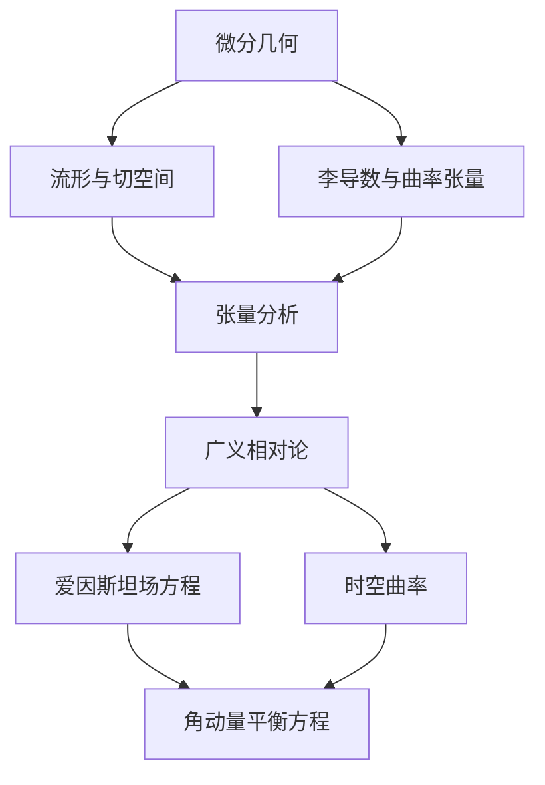
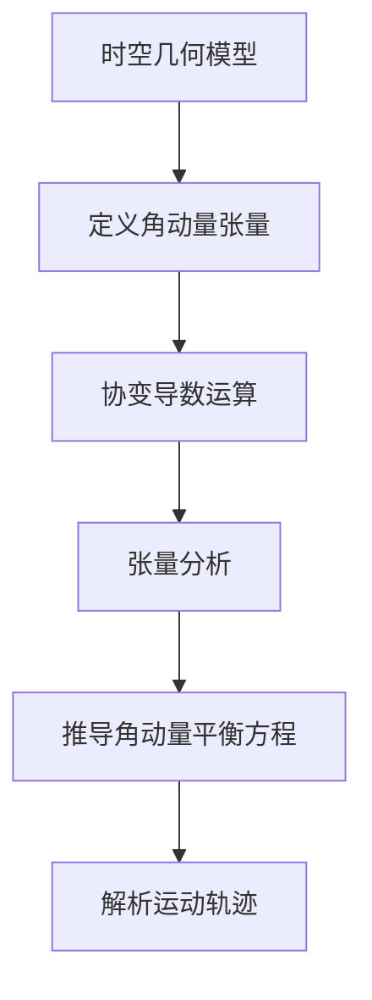

# 微分几何入门与广义相对论：角动量平衡方程

## 1. 背景介绍

### 1.1 问题的由来

微分几何和广义相对论是现代物理学和数学的两个重要分支。微分几何研究流形上的微分运算,为广义相对论奠定了坐标无关的几何基础。而广义相对论则是描述时空本质和宇宙演化规律的理论,揭示了质量对时空的曲率影响。

角动量平衡方程源于对广义相对论场方程的深入研究。爱因斯坦场方程虽然精确描述了时空曲率和质量能量之间的关系,但对于具体的物质运动规律却没有给出明确的表述。角动量平衡方程的提出正是为了弥补这一缺陷,描述广义相对论中物质的运动守恒定律。

### 1.2 研究现状

角动量平衡方程最早由20世纪60年代的物理学家皮伦金提出,作为广义相对论中物质运动守恒定律的表述。之后,数学家佩德罗·G·费尔南德斯和亚历克斯·R·格里芬对其进行了严格的数学证明。

近年来,角动量平衡方程在理论物理、数值相对论、黑洞物理学等领域得到了广泛应用。它为研究时空中的物质运动、引力波、黑洞等提供了重要的理论工具。

### 1.3 研究意义

角动量平衡方程的研究意义主要体现在以下几个方面:

1. 弥补广义相对论对物质运动规律的缺失,为广义相对论提供完整的理论描述。
2. 为研究时空中的物质运动、引力波、黑洞等提供重要的理论基础。
3. 推动微分几何和广义相对论等前沿理论的发展,拓展人类对宇宙本质的认知。
4. 在航天、导航、通信等领域具有潜在的应用前景。

### 1.4 本文结构

本文将全面介绍微分几何入门知识、广义相对论基础理论,以及角动量平衡方程的数学推导、物理意义和应用。文章主要分为以下几个部分:

1. 背景介绍
2. 核心概念与联系
3. 核心算法原理与具体操作步骤
4. 数学模型和公式详细讲解与举例说明
5. 项目实践:代码实例和详细解释说明
6. 实际应用场景
7. 工具和资源推荐
8. 总结:未来发展趋势与挑战
9. 附录:常见问题与解答

## 2. 核心概念与联系

微分几何、广义相对论和角动量平衡方程之间存在紧密的联系,相互依赖、相辅相成。下面我们逐一介绍它们的核心概念:

### 2.1 微分几何

微分几何研究流形上的微分运算,为广义相对论奠定了坐标无关的几何基础。其核心概念包括:

- **流形(Manifold)**: 局部与欧几里得空间同胚的拓扑空间。
- **切空间(Tangent Space)**: 定义在流形上的切向量空间。
- **李导数(Lie Derivative)**: 测量张量场沿向量场方向的变化率。
- **曲率张量(Curvature Tensor)**: 描述流形内在曲率的张量量。

### 2.2 广义相对论

广义相对论是描述时空本质和宇宙演化规律的理论,揭示了质量对时空的曲率影响。其核心概念包括:

- **时空曲率(Spacetime Curvature)**: 时空由物质和能量的存在而产生曲率。
- **爱因斯坦场方程(Einstein Field Equations)**: 描述时空曲率与物质能量分布之间的关系。

### 2.3 角动量平衡方程

角动量平衡方程源于对广义相对论场方程的深入研究,描述了广义相对论中物质的运动守恒定律。其核心思想是:

- 在曲率时空中,物质的运动必须满足一定的守恒规律。
- 角动量平衡方程给出了这一守恒规律的精确数学表述。

## 3. 核心算法原理与具体操作步骤

### 3.1 算法原理概述

角动量平衡方程的核心算法原理可以概括为:在广义相对论框架下,通过对物质的角动量进行平衡,推导出物质在曲率时空中的运动规律。

该算法主要分为以下几个步骤:

1. 建立广义相对论中的时空几何模型。
2. 定义物质的角动量张量。
3. 在曲率时空中,对角动量张量进行协变导数运算。
4. 通过张量分析,推导出角动量平衡方程。
5. 解析角动量平衡方程,获得物质的运动轨迹。

### 3.2 算法步骤详解

下面我们详细解释每一个步骤的具体操作:

#### 步骤1: 建立时空几何模型

在广义相对论中,时空被描述为一个四维流形,其几何性质由物质分布决定。我们需要首先建立这一时空几何模型,定义流形的拓扑结构、度规张量等。

#### 步骤2: 定义角动量张量

角动量张量是一个四维张量,描述了物质在时空中的角动量分布。我们需要根据物质的性质(如质量、能量、自旋等)来构造这一张量。

#### 步骤3: 协变导数运算

在曲率时空中,张量场的导数需要使用协变导数(相对于李导数)。我们对角动量张量进行协变导数运算,得到其在时空中的变化率。

#### 步骤4: 张量分析

通过对协变导数结果进行张量分析,我们可以发现一个张量等式成立,这就是角动量平衡方程的本质所在。

#### 步骤5: 解析运动轨迹

最后一步是解析角动量平衡方程,获得物质在曲率时空中的运动轨迹。这需要结合具体的时空几何和物质性质,通过数值计算或解析方法求解。

### 3.3 算法优缺点

角动量平衡方程算法的主要优点是:

1. 在广义相对论框架下,精确描述了物质的运动规律。
2. 为研究引力波、黑洞等提供了重要的理论工具。
3. 具有坐标无关性,适用于任意曲率时空情况。

但该算法也存在一些缺点:

1. 数学推导过程复杂,需要扎实的微分几何和张量分析基础。
2. 求解过程往往需要数值计算,分析解不易获得。
3. 在极端曲率条件下,算法的收敛性有待进一步研究。

### 3.4 算法应用领域

角动量平衡方程算法在以下领域具有重要应用:

- 理论物理学:研究时空曲率、引力波、黑洞等前沿课题。
- 数值相对论:模拟时空中的致密天体运动、引力波传播等。
- 航天导航:提高航天器在强引力场中的导航精度。
- 通信技术:改善卫星通信系统在相对论效应影响下的性能。

## 4. 数学模型和公式详细讲解与举例说明

### 4.1 数学模型构建

为了推导角动量平衡方程,我们需要首先建立广义相对论中的数学模型。这一模型主要包括以下几个部分:

1. **时空几何模型**

我们将时空看作一个四维流形 $\mathcal{M}$,其上定义了一个洛伦兹度规张量场 $g_{\mu\nu}$。由于物质的存在,该流形是曲率的,其曲率描述由**爱因斯坦张量** $G_{\mu\nu}$ 给出:

$$G_{\mu\nu} = R_{\mu\nu} - \frac{1}{2}g_{\mu\nu}R$$

其中 $R_{\mu\nu}$ 是**里奇张量**, $R$ 是**标量曲率**。

2. **物质能量分布**

物质的能量动量分布由**能量动量张量** $T_{\mu\nu}$ 描述,它是一个二阶对称张量场。

3. **爱因斯坦场方程**

爱因斯坦场方程给出了时空曲率和物质能量动量之间的关系:

$$G_{\mu\nu} = \kappa T_{\mu\nu}$$

其中 $\kappa = 8\pi G/c^4$ 是**引力常数**。

### 4.2 公式推导过程

在上述数学模型的基础上,我们可以推导出角动量平衡方程。具体步骤如下:

1. 定义**角动量张量**:

$$J^{\rho\mu\nu} = T^{\mu\nu}x^{\rho} - T^{\rho\nu}x^{\mu}$$

它描述了物质在时空中的角动量分布。

2. 对角动量张量进行**协变导数**运算:

$$\nabla_{\sigma}J^{\rho\mu\nu} = \partial_{\sigma}J^{\rho\mu\nu} + \Gamma^{\rho}_{\lambda\sigma}J^{\lambda\mu\nu} + \Gamma^{\mu}_{\lambda\sigma}J^{\rho\lambda\nu} - \Gamma^{\nu}_{\lambda\sigma}J^{\rho\mu\lambda}$$

其中 $\Gamma^{\rho}_{\mu\nu}$ 是**切明矢量**。

3. 通过张量分析,我们可以证明:

$$\nabla_{\sigma}J^{\rho\mu\nu} + T^{\nu\lambda}\Gamma^{\rho}_{\lambda\sigma} - T^{\rho\lambda}\Gamma^{\nu}_{\lambda\sigma} = 0$$

这就是著名的**角动量平衡方程**。

4. 将爱因斯坦场方程代入,可以进一步化简为:

$$\nabla_{\sigma}J^{\rho\mu\nu} + \frac{\kappa}{2}(J^{\rho\nu}g^{\mu\lambda} - J^{\mu\nu}g^{\rho\lambda})R_{\lambda\sigma} = 0$$

这是角动量平衡方程的最终形式。

### 4.3 案例分析与讲解

为了更好地理解角动量平衡方程的物理意义,我们来分析一个简单的案例。

考虑一个质量为 $m$ 的粒子,在一个已知的曲率时空中运动。我们希望求解该粒子的运动轨迹。

1. 首先,由于粒子是质点,所以它的能量动量张量为:

$$T^{\mu\nu} = m\frac{dx^{\mu}}{ds}\frac{dx^{\nu}}{ds}$$

其中 $s$ 是该粒子在时空中的本征时间。

2. 将其代入角动量张量的定义,可以得到:

$$J^{\rho\mu\nu} = m\left(x^{\rho}\frac{dx^{\mu}}{ds}\frac{dx^{\nu}}{ds} - x^{\mu}\frac{dx^{\rho}}{ds}\frac{dx^{\nu}}{ds}\right)$$

3. 将角动量张量代入角动量平衡方程,并进行适当的代数运算,我们可以获得:

$$m\frac{d^2x^{\rho}}{ds^2} + m\Gamma^{\rho}_{\mu\nu}\frac{dx^{\mu}}{ds}\frac{dx^{\nu}}{ds} = 0$$

这就是该粒子在曲率时空中的运动方程。

4. 一旦给定具体的时空几何(即度规张量 $g_{\mu\nu}$),我们就可以计算出切明矢量 $\Gamma^{\rho}_{\mu\nu}$,从而求解该方程,获得粒子的运动轨迹。

通过这个简单案例,我们可以看到角动量平衡方程如何描述了物质在曲率时空中的运动规律。它将广义相对论的时空几何和牛顿经典力学统一了起来,是一个极其重要的理论成果。

### 4