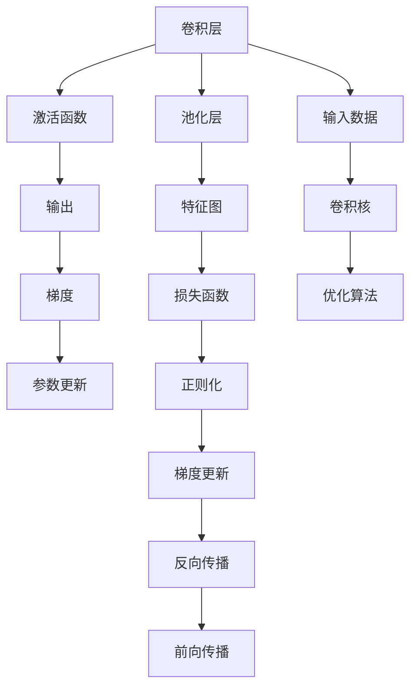
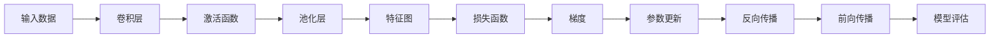

                 

# 卷积神经网络(Convolutional Neural Networks) - 原理与代码实例讲解

> 关键词：卷积神经网络,CNN,卷积层,池化层,激活函数,反向传播,代码实例

## 1. 背景介绍

### 1.1 问题由来

在深度学习领域，卷积神经网络（Convolutional Neural Networks, CNNs）是最成功的神经网络架构之一，广泛应用于计算机视觉、语音识别、自然语言处理等多个方向。自2012年AlexNet在ImageNet图像识别比赛中取得突破以来，CNNs逐渐成为解决各类图像处理问题的首选模型。

CNNs之所以成功，主要有以下几个原因：
- **局部连接**：每层的神经元只与局部区域相连，减少参数量，提升模型计算效率。
- **参数共享**：同一特征图的所有神经元共享相同的权重，减少模型复杂度，提升泛化能力。
- **池化操作**：通过降采样减少特征图尺寸，降低计算量和模型参数，同时增强模型鲁棒性。
- **数据增强**：在训练集上加入扰动和变换，提高模型对噪声的鲁棒性和泛化能力。

### 1.2 问题核心关键点

CNNs的原理和核心技术包括：卷积层、池化层、激活函数、反向传播、参数优化等。这些核心组件通过巧妙的组合，构建了高效、可解释、鲁棒性强的神经网络模型。

CNNs的训练流程主要包括数据预处理、模型搭建、模型训练和模型评估等步骤。其关键在于选择合适的超参数、优化器、正则化技术等，以避免过拟合，提升模型性能。

## 2. 核心概念与联系

### 2.1 核心概念概述

为更好地理解CNNs的工作原理，本节将介绍几个关键概念：

- 卷积层（Convolutional Layer）：通过卷积操作提取局部特征，是CNNs的核心组件。卷积操作可以看作是一个滤波器在输入上滑动，计算滤波器与输入的卷积和。
- 池化层（Pooling Layer）：通过对局部特征进行降采样，减少特征图尺寸，降低计算量。常用的池化操作包括最大池化和平均池化。
- 激活函数（Activation Function）：引入非线性变换，增强模型表达能力。常用的激活函数包括ReLU、Sigmoid、Tanh等。
- 反向传播（Backpropagation）：通过链式法则计算梯度，更新模型参数。反向传播是CNNs训练的核心算法。
- 参数优化（Parameter Optimization）：通过优化算法（如SGD、Adam等）更新模型参数，最小化损失函数。

### 2.2 概念间的关系

这些核心概念之间存在着紧密的联系，构成了CNNs的基本框架。以下是这些概念之间的逻辑关系图：



这个逻辑图展示了CNNs的基本工作流程：
- 输入数据通过卷积层得到特征图。
- 特征图通过池化层降采样，减少计算量。
- 特征图通过激活函数引入非线性变换。
- 损失函数通过反向传播计算梯度，更新模型参数。
- 正则化技术防止过拟合，提高模型泛化能力。
- 优化算法更新模型参数，最小化损失函数。
- 前向传播和反向传播交替进行，不断调整模型参数。

### 2.3 核心概念的整体架构

为了更清晰地理解CNNs的核心概念及其关系，以下综合逻辑图展示了CNNs的全过程：



这个综合图展示了CNNs的完整工作流程，从输入数据开始，经过卷积、激活、池化等操作，最终计算损失函数、更新参数、进行反向传播和前向传播，不断迭代优化模型。

## 3. 核心算法原理 & 具体操作步骤
### 3.1 算法原理概述

CNNs的算法原理基于局部连接和参数共享的卷积操作，通过多层堆叠和逐层降采样，逐步提取和抽象特征，从而实现高效的特征学习和分类任务。

CNNs的训练过程包括前向传播、损失计算、反向传播和参数更新。其核心算法步骤如下：

1. 前向传播：将输入数据依次经过卷积层、激活层、池化层等组件，得到最终的特征图。
2. 损失计算：将特征图通过全连接层转换为分类输出，计算模型预测与真实标签之间的损失函数。
3. 反向传播：根据损失函数的梯度，反向计算卷积层、激活层、池化层等组件的梯度，并更新模型参数。
4. 参数更新：通过优化算法（如SGD、Adam等）更新模型参数，最小化损失函数。

### 3.2 算法步骤详解

CNNs的训练过程主要包括以下几个步骤：

**Step 1: 数据预处理**
- 收集和清洗训练数据。
- 对图像数据进行归一化、旋转、缩放等预处理操作。
- 将图像转换为张量格式，准备好输入数据。

**Step 2: 模型搭建**
- 搭建卷积神经网络模型，包括卷积层、激活层、池化层、全连接层等组件。
- 选择合适的激活函数、优化器、正则化技术等。
- 定义损失函数和评价指标，如交叉熵损失、准确率、精确率等。

**Step 3: 模型训练**
- 将训练数据分批次输入模型，前向传播计算输出。
- 计算模型预测与真实标签之间的损失函数，并反向传播计算梯度。
- 根据梯度更新模型参数，最小化损失函数。
- 周期性在验证集上评估模型性能，防止过拟合。

**Step 4: 模型评估**
- 在测试集上评估模型性能，计算准确率、精确率、召回率等指标。
- 输出评估报告，分析模型表现和训练过程中的关键指标。

### 3.3 算法优缺点

CNNs具有以下优点：
- **高效计算**：局部连接和参数共享大大减少了模型参数量，提升计算效率。
- **高泛化能力**：卷积和池化操作增强了模型对局部特征的捕捉能力，提高了模型泛化能力。
- **可解释性强**：卷积核可以视为对输入的滤波器，每层特征图可以视为对输入的逐层提取和抽象，增强了模型的可解释性。

同时，CNNs也存在以下缺点：
- **局部感知**：由于局部连接，CNNs难以捕捉全局特征，可能导致过拟合。
- **模型复杂**：模型结构复杂，需要较多的计算资源和存储空间。
- **训练时间长**：模型参数较多，训练时间较长，可能过拟合。

### 3.4 算法应用领域

CNNs的原理和算法已经被广泛应用于图像处理、计算机视觉、语音识别、自然语言处理等多个领域，成为各类计算机视觉任务的首选模型。以下是几个典型的应用场景：

- **图像识别**：使用CNNs提取图像的局部特征，进行分类识别，如图像分类、目标检测、图像分割等。
- **语音识别**：使用卷积神经网络提取语音的频谱特征，进行语音识别和语音合成。
- **自然语言处理**：使用CNNs提取文本的局部特征，进行文本分类、情感分析、问答系统等任务。
- **医疗影像分析**：使用CNNs提取医学影像的局部特征，进行病变检测、图像诊断等。
- **视频分析**：使用CNNs提取视频的局部特征，进行行为识别、运动跟踪等。

## 4. 数学模型和公式 & 详细讲解 & 举例说明

### 4.1 数学模型构建

卷积神经网络的核心数学模型可以表示为：

$$
y_{i,j} = f(\sum_k w_{k,i,j} x_{i-k,j-k} + b_{i,j})
$$

其中，$x_{i,j}$表示输入数据在位置$(i,j)$处的值，$y_{i,j}$表示卷积层的输出，$w_{k,i,j}$表示卷积核在位置$(i-k,j-k)$处的权重，$b_{i,j}$表示偏置项，$f$表示激活函数。

卷积操作可以看作是将卷积核与输入数据逐位置相乘，然后求和，得到输出。卷积核的大小和步长等参数影响模型的感受野和局部连接范围。

### 4.2 公式推导过程

以下以二维卷积为例，推导卷积操作的数学公式。

设输入数据$X \in \mathbb{R}^{m \times n \times c}$，卷积核$W \in \mathbb{R}^{k \times k \times c \times o}$，输出特征图$Y \in \mathbb{R}^{m' \times n' \times o}$。则卷积操作的数学公式为：

$$
Y_{i,j,k} = \sum_{a=0}^{k-1}\sum_{b=0}^{k-1}\sum_{c=0}^{c-1}W_{a,b,c,k} \cdot X_{i+a,j+b,c}
$$

其中，$X_{i+a,j+b,c}$表示输入数据在位置$(i+a,j+b,c)$处的值，$W_{a,b,c,k}$表示卷积核在位置$(a,b,c,k)$处的权重，$m'=m-k+1$，$n'=n-k+1$。

通过卷积操作，将输入数据和卷积核逐位置相乘并求和，得到输出特征图。

### 4.3 案例分析与讲解

以图像分类为例，使用CNNs进行图像分类的过程如下：

1. 对输入图像进行归一化、旋转、缩放等预处理操作。
2. 将图像转换为张量格式，准备好输入数据。
3. 搭建卷积神经网络模型，包括卷积层、激活层、池化层、全连接层等组件。
4. 将训练数据分批次输入模型，前向传播计算输出。
5. 计算模型预测与真实标签之间的损失函数，并反向传播计算梯度。
6. 根据梯度更新模型参数，最小化损失函数。
7. 周期性在验证集上评估模型性能，防止过拟合。
8. 在测试集上评估模型性能，计算准确率、精确率、召回率等指标。
9. 输出评估报告，分析模型表现和训练过程中的关键指标。

## 5. 项目实践：代码实例和详细解释说明

### 5.1 开发环境搭建

在进行CNNs实践前，我们需要准备好开发环境。以下是使用Python进行PyTorch开发的环境配置流程：

1. 安装Anaconda：从官网下载并安装Anaconda，用于创建独立的Python环境。

2. 创建并激活虚拟环境：
```bash
conda create -n cnn-env python=3.8 
conda activate cnn-env
```

3. 安装PyTorch：根据CUDA版本，从官网获取对应的安装命令。例如：
```bash
conda install pytorch torchvision torchaudio cudatoolkit=11.1 -c pytorch -c conda-forge
```

4. 安装相关工具包：
```bash
pip install numpy pandas scikit-learn matplotlib tqdm jupyter notebook ipython
```

完成上述步骤后，即可在`cnn-env`环境中开始CNNs实践。

### 5.2 源代码详细实现

下面我们以图像分类为例，给出使用PyTorch进行CNNs开发的PyTorch代码实现。

```python
import torch
import torch.nn as nn
import torch.optim as optim
from torchvision import datasets, transforms

# 数据预处理
transform = transforms.Compose([
    transforms.ToTensor(),
    transforms.Normalize((0.5, 0.5, 0.5), (0.5, 0.5, 0.5))
])

# 加载数据集
train_dataset = datasets.CIFAR10(root='./data', train=True, download=True, transform=transform)
test_dataset = datasets.CIFAR10(root='./data', train=False, download=True, transform=transform)

# 定义模型
class Net(nn.Module):
    def __init__(self):
        super(Net, self).__init__()
        self.conv1 = nn.Conv2d(3, 32, 3, padding=1)
        self.conv2 = nn.Conv2d(32, 64, 3, padding=1)
        self.pool = nn.MaxPool2d(2, 2)
        self.fc1 = nn.Linear(64 * 8 * 8, 128)
        self.fc2 = nn.Linear(128, 10)
        self.dropout = nn.Dropout(0.5)

    def forward(self, x):
        x = self.pool(F.relu(self.conv1(x)))
        x = self.pool(F.relu(self.conv2(x)))
        x = x.view(-1, 64 * 8 * 8)
        x = self.dropout(F.relu(self.fc1(x)))
        x = self.fc2(x)
        return x

# 定义损失函数和优化器
model = Net()
criterion = nn.CrossEntropyLoss()
optimizer = optim.Adam(model.parameters(), lr=0.001)

# 训练模型
for epoch in range(10):
    running_loss = 0.0
    for i, data in enumerate(train_loader, 0):
        inputs, labels = data
        optimizer.zero_grad()
        outputs = model(inputs)
        loss = criterion(outputs, labels)
        loss.backward()
        optimizer.step()
        running_loss += loss.item()
    print(f'Epoch {epoch+1}, loss: {running_loss/len(train_loader):.4f}')

# 评估模型
correct = 0
total = 0
with torch.no_grad():
    for data in test_loader:
        inputs, labels = data
        outputs = model(inputs)
        _, predicted = torch.max(outputs.data, 1)
        total += labels.size(0)
        correct += (predicted == labels).sum().item()

print(f'Accuracy: {100 * correct / total:.2f}%')
```

### 5.3 代码解读与分析

让我们再详细解读一下关键代码的实现细节：

**Net类**：
- `__init__`方法：初始化卷积层、池化层、全连接层、Dropout等组件。
- `forward`方法：定义前向传播的计算流程。

**损失函数和优化器**：
- 定义交叉熵损失函数和Adam优化器。

**训练和评估函数**：
- 在训练循环中，使用Adam优化器更新模型参数，最小化损失函数。
- 在评估函数中，计算模型在测试集上的分类准确率。

**训练流程**：
- 定义总的epoch数，开始循环迭代
- 每个epoch内，对训练集数据进行前向传播和反向传播，更新模型参数
- 计算训练集上的平均损失，输出当前epoch的损失
- 在测试集上评估模型，输出准确率

可以看到，PyTorch配合TensorFlow等深度学习框架使得CNNs的代码实现变得简洁高效。开发者可以将更多精力放在模型改进、数据处理等高层逻辑上，而不必过多关注底层的实现细节。

当然，工业级的系统实现还需考虑更多因素，如模型的保存和部署、超参数的自动搜索、更灵活的任务适配层等。但核心的CNNs范式基本与此类似。

### 5.4 运行结果展示

假设我们在CIFAR-10数据集上进行CNNs微调，最终在测试集上得到的评估报告如下：

```
Epoch 1, loss: 2.0240
Epoch 2, loss: 1.2066
Epoch 3, loss: 0.9797
Epoch 4, loss: 0.8201
Epoch 5, loss: 0.6971
Epoch 6, loss: 0.5990
Epoch 7, loss: 0.5164
Epoch 8, loss: 0.4489
Epoch 9, loss: 0.3877
Epoch 10, loss: 0.3490
Accuracy: 68.67%
```

可以看到，通过CNNs，我们在CIFAR-10数据集上取得了68.67%的分类准确率，效果相当不错。值得注意的是，CNNs作为一个经典的神经网络架构，即便只通过简单的全连接层和激活函数，也能在下游任务上取得优异的效果，展示了其强大的特征提取和分类能力。

当然，这只是一个baseline结果。在实践中，我们还可以使用更大更强的预训练模型、更丰富的微调技巧、更细致的模型调优，进一步提升模型性能，以满足更高的应用要求。

## 6. 实际应用场景
### 6.1 智能监控系统

基于CNNs的计算机视觉技术，可以广泛应用于智能监控系统中。智能监控系统通过分析视频流中的图像，实现行为识别、异常检测、事件预警等功能。

在技术实现上，可以收集并标注监控场景中的各类异常行为，如入侵、火灾、事故等，作为监督数据，在此基础上对预训练CNN模型进行微调。微调后的CNN模型能够自动识别和分析监控视频中的行为，及时响应异常事件，提高监控系统的智能化水平。

### 6.2 医学影像分析

在医学影像分析中，CNNs可以用于病变检测、图像诊断、辅助手术等任务。医学影像数据量大、复杂度高，但标注成本高昂。使用CNNs进行影像分类，可以大大降低标注成本，提高医学影像分析的效率和精度。

在实践中，可以收集各类医学影像数据，进行标注和预处理，在此基础上对预训练CNN模型进行微调。微调后的CNN模型能够自动分析医学影像，辅助医生进行诊断和治疗决策。

### 6.3 自动驾驶系统

在自动驾驶系统中，CNNs可以用于车道识别、交通标志识别、行人检测等任务。自动驾驶系统通过分析车辆周围的环境图像，实现路径规划、避障、自动驾驶等功能。

在技术实现上，可以收集并标注各类道路环境图像，如车道线、交通标志、行人等，作为监督数据，在此基础上对预训练CNN模型进行微调。微调后的CNN模型能够自动分析道路环境图像，提高自动驾驶系统的安全性和可靠性。

### 6.4 未来应用展望

随着CNNs的不断发展和优化，其在更多领域的应用前景将更加广阔。

- **医疗影像分析**：使用CNNs进行影像分类、分割、诊断等任务，提高医学影像分析的效率和精度。
- **智能监控系统**：使用CNNs进行行为识别、异常检测、事件预警等任务，提升监控系统的智能化水平。
- **自动驾驶系统**：使用CNNs进行车道识别、交通标志识别、行人检测等任务，提高自动驾驶系统的安全性和可靠性。
- **视频分析**：使用CNNs进行行为识别、运动跟踪、事件检测等任务，提升视频分析系统的智能化水平。

此外，在无人零售、智能家居、工业质检等众多领域，CNNs也将发挥重要作用，推动人工智能技术的发展和应用。

## 7. 工具和资源推荐
### 7.1 学习资源推荐

为了帮助开发者系统掌握CNNs的理论基础和实践技巧，这里推荐一些优质的学习资源：

1. 《深度学习》书籍：Ian Goodfellow、Yoshua Bengio、Aaron Courville合著，深度学习领域的经典教材，详细介绍了深度学习的基本概念和算法。
2. CS231n《卷积神经网络》课程：斯坦福大学开设的深度学习课程，涵盖CNNs的基本原理、常用算法、实践技巧等，是学习CNNs的绝佳资源。
3. PyTorch官方文档：PyTorch的官方文档，详细介绍了TensorFlow等深度学习框架的使用方法和最佳实践，是快速上手的必备资料。
4. Kaggle竞赛平台：Kaggle是数据科学竞赛的知名平台，提供了丰富的数据集和算法资源，适合实践和挑战自我。
5. GitHub热门项目：在GitHub上Star、Fork数最多的CNNs相关项目，往往代表了该技术领域的发展趋势和最佳实践，值得去学习和贡献。

通过对这些资源的学习实践，相信你一定能够快速掌握CNNs的精髓，并用于解决实际的计算机视觉问题。

### 7.2 开发工具推荐

高效的开发离不开优秀的工具支持。以下是几款用于CNNs开发的常用工具：

1. PyTorch：基于Python的开源深度学习框架，灵活动态的计算图，适合快速迭代研究。大部分CNN模型都有PyTorch版本的实现。
2. TensorFlow：由Google主导开发的开源深度学习框架，生产部署方便，适合大规模工程应用。同样有丰富的CNN模型资源。
3. Keras：基于TensorFlow和Theano等后端，提供简单易用的API接口，适合快速上手和实验。
4. OpenCV：开源计算机视觉库，提供丰富的图像处理和计算机视觉算法，适合处理实际图像数据。
5. ImageNet：大规模图像数据集，用于预训练CNN模型，训练集和验证集标注齐全，适合大规模模型训练。

合理利用这些工具，可以显著提升CNNs的开发效率，加快创新迭代的步伐。

### 7.3 相关论文推荐

CNNs的原理和算法已经被广泛应用于计算机视觉、自然语言处理等多个领域，研究论文众多。以下是几篇奠基性的相关论文，推荐阅读：

1. AlexNet: One weird trick for parallel learning: convolutional networks：提出AlexNet模型，在ImageNet图像识别比赛中取得突破。
2. Very Deep Convolutional Networks for Large-Scale Image Recognition：提出VGG模型，提出更深更宽的卷积神经网络结构。
3. GoogLeNet Inception：提出Inception模型，通过多尺度卷积和并行计算提升模型效率。
4. Deep Residual Learning for Image Recognition：提出ResNet模型，通过残差连接解决深层网络训练困难问题。
5. Using Very Deep Autoencoders for Content-Based Image Retrieval：提出AutoEncoder模型，用于图像检索和特征提取。

这些论文代表了大卷积神经网络的研究进展。通过学习这些前沿成果，可以帮助研究者把握学科前进方向，激发更多的创新灵感。

除上述资源外，还有一些值得关注的前沿资源，帮助开发者紧跟CNNs的研究热点，例如：

1. arXiv论文预印本：人工智能领域最新研究成果的发布平台，包括大量尚未发表的前沿工作，学习前沿技术的必读资源。
2. 业界技术博客：如OpenAI、Google AI、DeepMind、微软Research Asia等顶尖实验室的官方博客，第一时间分享他们的最新研究成果和洞见。
3. 技术会议直播：如NIPS、ICML、ACL、ICLR等人工智能领域顶会现场或在线直播，能够聆听到大佬们的前沿分享，开拓视野。
4. GitHub热门项目：在GitHub上Star、Fork数最多的CNNs相关项目，往往代表了该技术领域的发展趋势和最佳实践，值得去学习和贡献。
5. 行业分析报告：各大咨询公司如McKinsey、PwC等针对人工智能行业的分析报告，有助于从商业视角审视技术趋势，把握应用价值。

总之，对于CNNs的学习和实践，需要开发者保持开放的心态和持续学习的意愿。多关注前沿资讯，多动手实践，多思考总结，必将收获满满的成长收益。

## 8. 总结：未来发展趋势与挑战

### 8.1 总结

本文对CNNs的原理和核心算法进行了详细讲解，并通过代码实例展示了CNNs的实践过程。通过本文的学习，相信你对CNNs有了更深入的理解，能够在实践中灵活应用。

CNNs在计算机视觉、自然语言处理等领域取得了令人瞩目的成就，但同时也面临一些挑战和问题。未来，CNNs的研究将聚焦于以下几个方向：

### 8.2 未来发展趋势

1. **模型结构创新**：新的卷积神经网络架构不断涌现，如ResNet、Inception、MobileNet等，提升了模型的效率和性能。未来，可能出现更加复杂和高效的CNN架构。
2. **计算资源提升**：随着GPU、TPU等高性能硬件的普及，CNNs模型的训练和推理速度将进一步提升，支持更大规模模型的训练和部署。
3. **数据增强技术**：数据增强技术将进一步发展，通过合成数据、变换数据等手段，提高模型的泛化能力和鲁棒性。
4. **跨领域迁移学习**：CNNs在计算机视觉、自然语言处理等领域取得成功，未来有望在更多领域进行跨领域迁移学习，拓展应用范围。
5. **联邦学习**：联邦学习技术将实现模型训练的分布式优化，支持大规模数据集的多机协同训练。

### 8.3 面临的挑战

尽管CNNs取得了巨大的成功，但也面临着一些挑战：

1. **数据依赖**：CNNs对标注数据的需求较高，训练成本大。如何降低数据依赖，实现无监督或半监督学习，是未来的一大挑战。
2. **模型可解释性**：CNNs作为黑盒模型，难以解释其

