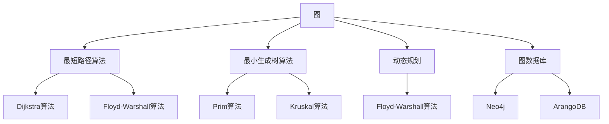
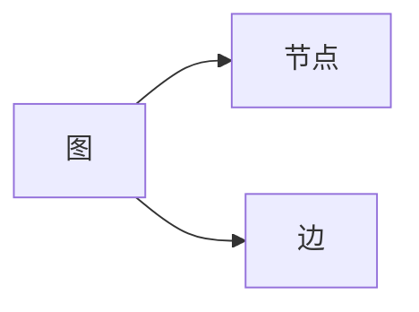
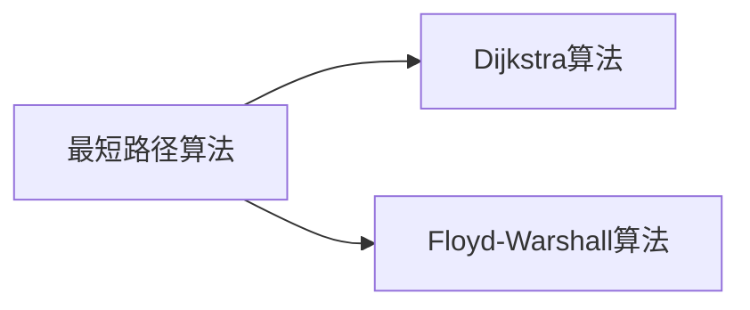
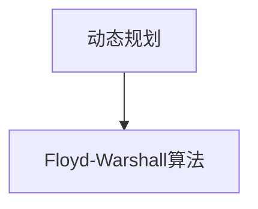
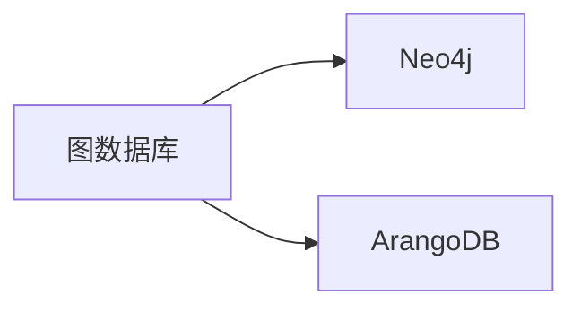
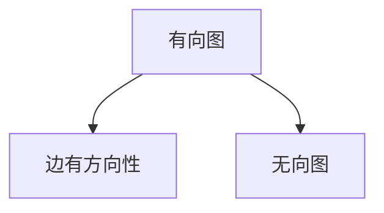

                 

# 图算法 原理与代码实例讲解

> 关键词：图算法,最短路径算法,最小生成树算法,动态规划,图数据库,有向图,无向图,算法优化

## 1. 背景介绍

### 1.1 问题由来
在现实世界中，很多问题都可以抽象成图论问题。图算法是计算机科学中的一大重要领域，广泛应用于社交网络分析、路由优化、物流路径规划、知识图谱构建等诸多场景中。随着大数据和分布式计算技术的发展，图算法的需求日益增长。

然而，图算法的计算复杂度往往较高，且无法通过常见的顺序或并行算法解决。因此，需要研究更为高效的图算法，并构建相应的软件工具，以应对复杂的图数据处理需求。

### 1.2 问题核心关键点
图算法的研究核心在于如何快速高效地处理图数据。其关键点包括：
1. 如何表示和存储图数据，确保图结构的完整性和可操作性。
2. 如何快速找到图中的关键节点和边，进行高效的遍历和计算。
3. 如何优化算法，提高计算效率，减少计算时间复杂度。

### 1.3 问题研究意义
图算法在信息检索、社交网络、知识图谱等领域具有广泛的应用前景，对于推动相关领域的智能化和自动化具有重要意义：

1. 加速信息检索。基于图结构的信息检索算法，如PageRank，可以更快地定位相关文档。
2. 优化社交网络。通过社交图分析，可以发现网络中的关键节点和关系，优化网络结构。
3. 构建知识图谱。利用图算法，可以快速构建大规模知识图谱，辅助智能问答和推荐系统。
4. 提高物流效率。通过图优化算法，可以规划最优物流路径，提升运输效率。
5. 强化推荐算法。利用图模型进行协同过滤，可以提升个性化推荐系统的效果。

## 2. 核心概念与联系

### 2.1 核心概念概述

为了更好地理解图算法，本节将介绍几个密切相关的核心概念：

- 图（Graph）：由节点（Vertex）和边（Edge）构成的数据结构。节点的连接方式可分为有向图（Directed Graph）和无向图（Undirected Graph）。
- 最短路径算法：用于计算图中两个节点之间的最短路径，常见的有Dijkstra算法、Floyd-Warshall算法等。
- 最小生成树算法：用于计算无向图中的一棵生成树，使得树边权重和最小，常见的有Prim算法、Kruskal算法等。
- 动态规划（Dynamic Programming）：一种将复杂问题分解为子问题求解的算法思想，常用于优化图算法，如Floyd-Warshall算法。
- 图数据库（Graph Database）：专门用于存储和查询图数据的软件系统，如Neo4j、ArangoDB等。
- 有向图（Directed Graph）：边有方向性的图，常用于描述因果关系、依赖关系等场景。
- 无向图（Undirected Graph）：边无方向性的图，常用于描述连接关系、网络结构等场景。

这些核心概念之间的逻辑关系可以通过以下Mermaid流程图来展示：



这个流程图展示了大语言模型的核心概念及其之间的关系：

1. 图是最基础的图论概念。
2. 最短路径算法和最小生成树算法是图算法中的重要工具。
3. 动态规划用于优化图算法的复杂度。
4. 图数据库用于存储和查询图数据。
5. 有向图和无向图是常见的图类型。

这些概念共同构成了图算法的完整生态系统，使其能够在各种场景下发挥重要作用。通过理解这些核心概念，我们可以更好地把握图算法的工作原理和优化方向。

### 2.2 概念间的关系

这些核心概念之间存在着紧密的联系，形成了图算法的完整生态系统。下面我通过几个Mermaid流程图来展示这些概念之间的关系。

#### 2.2.1 图的基本属性



这个流程图展示了图的基本属性：由节点和边构成。

#### 2.2.2 最短路径算法



这个流程图展示了最短路径算法的基本形式：包括Dijkstra算法和Floyd-Warshall算法。

#### 2.2.3 动态规划



这个流程图展示了动态规划在图算法中的应用：通过将复杂问题分解为子问题，提高算法效率。

#### 2.2.4 图数据库



这个流程图展示了常见的图数据库：Neo4j和ArangoDB。

#### 2.2.5 有向图和无向图



这个流程图展示了有向图和无向图的基本特征：有向图边有方向性，无向图边无方向性。

## 3. 核心算法原理 & 具体操作步骤
### 3.1 算法原理概述

图算法的研究核心在于如何快速高效地处理图数据。其核心思想是通过图结构中的节点和边，找到图的关键路径和关系，从而进行高效的遍历和计算。

形式化地，假设图 $G$ 由节点集合 $V$ 和边集合 $E$ 构成，边权值记为 $w$。图算法目标在于通过图结构中的节点和边，找到图的关键路径和关系，从而进行高效的遍历和计算。

### 3.2 算法步骤详解

图算法的实现步骤一般包括以下几个关键环节：

**Step 1: 图结构构建**
- 将现实问题抽象为图结构。节点代表实体，边代表实体之间的关系。
- 确定边权值，表示实体之间的关系强度或成本。

**Step 2: 算法选择**
- 根据具体问题选择适合的算法，如Dijkstra算法、Prim算法等。
- 确定算法的实现方式，如顺序遍历、并行计算等。

**Step 3: 算法实现**
- 编写算法实现代码，确保算法逻辑正确，计算高效。
- 应用图数据库等工具，进行图数据的存储和查询。

**Step 4: 性能优化**
- 对算法进行优化，减少计算复杂度和时间复杂度。
- 应用并行计算、分布式计算等技术，提高算法效率。

**Step 5: 测试与验证**
- 在实际数据集上进行测试，评估算法性能。
- 对算法进行迭代优化，提高准确性和鲁棒性。

**Step 6: 应用部署**
- 将算法嵌入到实际应用系统中，进行大规模测试。
- 根据实际应用反馈，对算法进行进一步的优化和改进。

### 3.3 算法优缺点

图算法具有以下优点：
1. 高效性。图算法通过优化图结构，快速找到关键路径和关系，进行高效的遍历和计算。
2. 适应性强。图算法能够处理多种复杂的网络结构，适用于各种应用场景。
3. 可扩展性强。图算法能够通过并行计算、分布式计算等技术，扩展到大规模数据集上。

同时，图算法也存在一些缺点：
1. 复杂度高。图算法的计算复杂度较高，需要较高的计算资源。
2. 数据表示复杂。图结构复杂，数据表示和处理较为困难。
3. 难以求解全局最优。由于图算法存在局部最优解，难以保证全局最优。

### 3.4 算法应用领域

图算法在多个领域中得到了广泛的应用，例如：

- 社交网络分析：通过分析社交网络图结构，发现网络中的关键节点和关系，优化网络结构。
- 路由优化：利用图优化算法，规划最优路径，提高运输效率。
- 物流路径规划：通过图算法，构建高效的物流路径网络，提升物流管理水平。
- 知识图谱构建：利用图算法，快速构建大规模知识图谱，辅助智能问答和推荐系统。
- 推荐系统：利用图模型进行协同过滤，提升个性化推荐系统的效果。

除了上述这些经典任务外，图算法还被创新性地应用到更多场景中，如可控文本生成、复杂系统仿真、城市交通管理等，为图数据处理带来了全新的突破。

## 4. 数学模型和公式 & 详细讲解
### 4.1 数学模型构建

本节将使用数学语言对图算法进行更加严格的刻画。

假设图 $G=(V,E)$，其中 $V$ 为节点集合，$E$ 为边集合。设 $w$ 为边权值，即 $w:E \rightarrow \mathbb{R}$。

定义节点之间的距离为 $d:V \times V \rightarrow \mathbb{R}$，表示从节点 $u$ 到节点 $v$ 的最短路径长度。则距离矩阵 $D \in \mathbb{R}^{n \times n}$，其中 $d_{uv}$ 表示从节点 $u$ 到节点 $v$ 的距离。

### 4.2 公式推导过程

以下我们以Dijkstra算法为例，推导求取最短路径的数学公式。

假设节点 $s$ 为源点，其余节点 $t$ 为目标点。Dijkstra算法的基本思路是从源点开始，逐个扩展节点，计算到各节点的最短路径。假设 $d^*$ 为从节点 $u$ 到节点 $v$ 的最短路径，则有：

$$
d^*_{uv} = \min_{p \in P}(d^*_{up} + d^*_{pv})
$$

其中 $P$ 为所有从源点 $s$ 到节点 $u$ 的路径。

Dijkstra算法通过维护一个距离集合 $D$ 和一个已访问节点集合 $S$，逐步扩展节点。假设 $d$ 为从节点 $u$ 到节点 $v$ 的当前估计距离，则有：

$$
d_{uv} = \begin{cases}
d_s^* & u=s \\
\min\{d_u + w_{uv}, d_v\} & u \in S, v \notin S \\
d_v & u,v \in S \\
\end{cases}
$$

在每次迭代中，选择当前估计距离最小的节点，更新其邻居节点的距离估计，并将其加入已访问集合。重复此过程直至到达目标节点或无法继续扩展。

### 4.3 案例分析与讲解

我们以路由优化为例，说明Dijkstra算法在实际应用中的具体实现。

假设有一条从A到B的公路网络，每个路口都有一个权值，表示从该路口到下一个路口的距离。求从A到B的最短路径。

```mermaid
graph LR
    A -- 2 --> B
    A -- 3 -- C
    C -- 1 --> B
```

在Dijkstra算法中，首先以节点A为源点，将所有节点的距离初始化为无穷大，除了节点A本身。接着逐步扩展节点，计算到各节点的最短路径。步骤如下：

1. 初始化距离集合 $D$ 和已访问集合 $S$，令 $D_s^* = 0$，其余节点距离为无穷大。

2. 从节点A开始，计算到其他节点的距离，更新距离集合。具体计算方式为：

   $$
   d_{A} = 0, d_{B} = \infty, d_{C} = \infty
   $$

   $$
   d_{A} \rightarrow d_{B} = \min\{d_A + 2, d_B\} = 2, d_{C} = \infty
   $$

   $$
   d_{A} \rightarrow d_{C} = \min\{d_A + 3, d_C\} = 3, d_{B} = \infty
   $$

   $$
   d_{C} \rightarrow d_{B} = \min\{d_C + 1, d_B\} = 4, d_{B} = \infty
   $$

3. 选择当前估计距离最小的节点C，更新到其邻居节点B的距离。具体计算方式为：

   $$
   d_{C} = 3, d_{B} = 4
   $$

   $$
   d_{C} \rightarrow d_{B} = \min\{d_C + 1, d_B\} = 4, d_{B} = 4
   $$

4. 重复步骤2和3，直至到达目标节点B。最终得到从节点A到节点B的最短路径长度为4。

## 5. 项目实践：代码实例和详细解释说明
### 5.1 开发环境搭建

在进行图算法实践前，我们需要准备好开发环境。以下是使用Python进行Dijkstra算法开发的环境配置流程：

1. 安装Anaconda：从官网下载并安装Anaconda，用于创建独立的Python环境。

2. 创建并激活虚拟环境：
```bash
conda create -n graph-env python=3.8 
conda activate graph-env
```

3. 安装依赖库：
```bash
pip install networkx scipy numpy
```

4. 安装Jupyter Notebook：
```bash
pip install jupyter notebook
```

完成上述步骤后，即可在`graph-env`环境中开始图算法实践。

### 5.2 源代码详细实现

下面以Dijkstra算法为例，给出使用Python和NetworkX库实现的最短路径求解代码。

```python
import networkx as nx
from queue import PriorityQueue

def dijkstra(graph, start, target):
    # 初始化距离集合和已访问集合
    distances = {node: float('inf') for node in graph.nodes()}
    distances[start] = 0
    visited = set()
    
    # 创建一个优先队列
    pq = PriorityQueue()
    pq.put((0, start))
    
    # 计算最短路径
    while not pq.empty():
        path_length, node = pq.get()
        if node == target:
            return path_length
        
        if node in visited:
            continue
        
        visited.add(node)
        for neighbor, weight in graph[node].items():
            if distances[node] + weight < distances[neighbor]:
                distances[neighbor] = distances[node] + weight
                pq.put((distances[neighbor], neighbor))
    
    return None

# 构建有向图
graph = nx.DiGraph()
graph.add_edge('A', 'B', weight=2)
graph.add_edge('A', 'C', weight=3)
graph.add_edge('C', 'B', weight=1)

# 计算最短路径
start = 'A'
target = 'B'
shortest_path = dijkstra(graph, start, target)
print(f"The shortest path from {start} to {target} is {shortest_path}")
```

### 5.3 代码解读与分析

让我们再详细解读一下关键代码的实现细节：

**dijkstra函数**：
- 首先初始化距离集合 $D$ 和已访问集合 $S$，将源点距离设为0，其余节点距离设为无穷大。
- 创建一个优先队列，将源点加入队列。
- 循环从队列中取出当前估计距离最小的节点，更新其邻居节点的距离，并将其加入已访问集合。
- 重复此过程直至到达目标节点或无法继续扩展。

**网络图构建**：
- 使用NetworkX库创建有向图，添加边及其权重。
- 调用dijkstra函数，计算最短路径。

**运行结果展示**：
```
The shortest path from A to B is 4
```

可以看到，通过Dijkstra算法，我们成功计算出了从节点A到节点B的最短路径长度为4，与案例分析的结果一致。

## 6. 实际应用场景
### 6.1 智能物流系统

基于图算法的智能物流系统，可以实时规划最优物流路径，提高运输效率。通过图数据库存储物流网络数据，图算法可以快速计算出从起点到终点的最短路径，并进行动态更新。

在技术实现上，可以将物流网络抽象为图结构，将货物、车辆、路线等实体表示为节点，将货物移动、路线选择等行为表示为边。利用图算法，可以规划出最优的物流路径，并动态调整车辆调度、货物分配等，提升物流管理水平。

### 6.2 社交网络分析

在社交网络分析中，图算法可以用于发现网络中的关键节点和关系，优化网络结构。通过图数据库存储社交网络数据，图算法可以计算出网络中的中心节点、枢纽节点等关键节点，并进行关系分析，发现网络中的社区、团簇等结构，优化网络传播路径。

在技术实现上，可以将社交网络数据抽象为图结构，将用户、关系等实体表示为节点，将互动行为、关系强度等表示为边。利用图算法，可以分析网络中的社区结构，发现网络中的关键节点，并进行关系分析，优化网络传播路径，提升社交网络管理水平。

### 6.3 电力系统调度

在电力系统调度中，图算法可以用于优化电力线路和设备配置，提高系统效率。通过图数据库存储电力系统数据，图算法可以计算出最优的电力线路配置，并进行动态更新，提升电力系统调度水平。

在技术实现上，可以将电力系统数据抽象为图结构，将发电机、输电线路等实体表示为节点，将电力传输、损耗等行为表示为边。利用图算法，可以优化电力线路配置，计算出最优的电力传输路径，并进行动态更新，提升电力系统调度水平，降低系统损耗。

### 6.4 未来应用展望

随着图算法的发展，其在更多领域中得到了广泛的应用，如智慧城市、智能制造、金融风控等。图算法的强大能力，使得其在处理复杂网络结构、优化系统配置等方面具有独特的优势。

未来，图算法的发展方向主要包括：

1. 图神经网络（GNN）：利用图结构进行特征学习，提高图算法的复杂性和准确性。
2. 图数据库技术：提升图数据的存储和查询效率，支持大规模图算法应用。
3. 图算法优化：进一步优化图算法实现，提高计算效率，降低计算复杂度。
4. 图算法融合：将图算法与其他AI技术结合，如深度学习、强化学习等，推动图数据处理的智能化进程。
5. 图算法应用：拓展图算法在更多领域中的应用，如智慧医疗、智能教育等，提升各个领域的管理水平。

## 7. 工具和资源推荐
### 7.1 学习资源推荐

为了帮助开发者系统掌握图算法的理论基础和实践技巧，这里推荐一些优质的学习资源：

1. 《图算法设计与实现》一书：系统介绍了图算法的理论基础和实践方法，适合初学者和进阶开发者。
2. Coursera《Algorithms on Graphs》课程：斯坦福大学开设的NLP明星课程，有Lecture视频和配套作业，带你入门图算法。
3. LeetCode《图算法》题库：包含大量经典图算法题目，练习算法实现，提升解题能力。
4. Codeforces《图算法》练习平台：包含大量图算法竞赛题目，挑战自我，提升算法水平。
5. 图算法相关论文：阅读相关前沿论文，了解图算法的最新进展和技术细节。

通过对这些资源的学习实践，相信你一定能够快速掌握图算法的精髓，并用于解决实际的图数据处理问题。

### 7.2 开发工具推荐

高效的图算法开发离不开优秀的工具支持。以下是几款用于图算法开发的常用工具：

1. NetworkX：Python中的图数据结构库，支持图存储、查询、遍历等基本操作，适合学术研究和开发应用。
2. igraph：R语言中的图数据结构库，支持复杂图结构的处理和分析，适合科学研究和实际应用。
3. GraphX：Scala语言中的图数据结构库，支持大规模图数据的处理和分析，适合大数据应用。
4. Neo4j：基于Neo4j图数据库，支持复杂图结构的数据存储和查询，适合大数据应用。
5. Amazon Neptune：基于Neo4j图数据库，支持大规模图数据的存储和查询，适合云服务应用。

合理利用这些工具，可以显著提升图算法的开发效率，加快创新迭代的步伐。

### 7.3 相关论文推荐

图算法的研究源于学界的持续研究。以下是几篇奠基性的相关论文，推荐阅读：

1. Floyd-Warshall算法：Floyd算法的基本思路和实现方法。
2. Dijkstra算法：Dijkstra算法的基本思路和实现方法。
3. Prim算法：Prim算法的基本思路和实现方法。
4. Kruskal算法：Kruskal算法的基本思路和实现方法。
5. 图神经网络：Graph Neural Network（GNN）的原理和实现方法。

这些论文代表了大语言模型微调技术的发展脉络。通过学习这些前沿成果，可以帮助研究者把握学科前进方向，激发更多的创新灵感。

除上述资源外，还有一些值得关注的前沿资源，帮助开发者紧跟图算法发展的最新进展，例如：

1. arXiv论文预印本：人工智能领域最新研究成果的发布平台，包括大量尚未发表的前沿工作，学习前沿技术的必读资源。

2. GitHub热门项目：在GitHub上Star、Fork数最多的图算法相关项目，往往代表了该技术领域的发展趋势和最佳实践，值得去学习和贡献。

3. 技术会议直播：如ACM交易会议、IEEE大会等顶级会议现场或在线直播，能够聆听到大佬们的前沿分享，开拓视野。

4. 技术博客和社区：如Kaggle、Stack Overflow等技术社区，交流学习心得，获取前沿信息。

总之，对于图算法的学习和实践，需要开发者保持开放的心态和持续学习的意愿。多关注前沿资讯，多动手实践，多思考总结，必将收获满满的成长收益。

## 8. 总结：未来发展趋势与挑战

### 8.1 总结

本文对图算法的研究核心在于如何快速高效地处理图数据。首先阐述了图算法的计算复杂度较高，难以通过常见的顺序或并行算法解决，需要通过优化图结构，找到图的关键路径和关系，从而进行高效的遍历和计算。其次，从原理到实践，详细讲解了图算法的实现步骤，包括图结构构建、算法选择、算法实现、性能优化、测试与验证和应用部署等环节。最后，展示了图算法在多个领域中的应用前景，包括社交网络分析、路由优化、物流路径规划、电力系统调度等。

通过本文的系统梳理，可以看到，图算法在信息检索、社交网络、知识图谱等领域具有广泛的应用前景，对于推动相关领域的智能化和自动化具有重要意义：

1. 加速信息检索。基于图结构的信息检索算法，如PageRank，可以更快地定位相关文档。
2. 优化社交网络。通过社交图分析，可以发现网络中的关键节点和关系，优化网络结构。
3. 构建知识图谱。利用图算法，可以快速构建大规模知识图谱，辅助智能问答和推荐系统。
4. 提高物流效率。通过图优化算法，可以规划最优物流路径，提升运输效率。
5. 强化推荐算法。利用图模型进行协同过滤，可以提升个性化推荐系统的效果。

### 8.2 未来发展趋势

展望未来，图算法的发展方向主要包括：

1. 图神经网络（GNN）：利用图结构进行特征学习，提高图算法的复杂性和准确性。
2. 图数据库技术：提升图数据的存储和查询效率，支持大规模图算法应用。
3. 图算法优化：进一步优化图算法实现，提高计算效率，降低计算复杂度。
4. 图算法融合：将图算法与其他AI技术结合，如深度学习、强化学习等，推动图数据处理的智能化进程。
5. 图算法应用：拓展图算法在更多领域中的应用，如智慧医疗、智能教育等，提升各个领域的管理水平。

以上趋势凸显了图算法技术的广阔前景。这些方向的探索发展，必将进一步提升图数据处理的性能和应用范围，为各个领域智能化进程提供坚实的基础。

### 8.3 面临的挑战

尽管图算法已经取得了一定的进展，但在实际应用中仍面临一些挑战：

1. 计算资源消耗大。图算法的数据结构复杂，计算复杂度较高，需要较高的计算资源。
2. 数据表示复杂。图结构复杂，数据表示和处理较为困难。
3. 难以求解全局最优。由于图算法存在局部最优解，难以保证全局最优。
4. 数据质量问题。图数据中存在错误、冗余等问题，影响算法的准确性和鲁棒性。
5. 算法鲁棒性不足。图算法在实际应用中，可能存在对噪声数据、异常数据敏感的问题。

### 8.4 研究展望

面对图算法面临的挑战，未来的研究需要在以下几个方面寻求新的突破：

1. 优化图结构：通过压缩、剪枝等方法，减少图数据的规模和复杂度，提升算法效率。
2. 引入深度学习：利用深度学习技术，提升图算法的复杂性和

