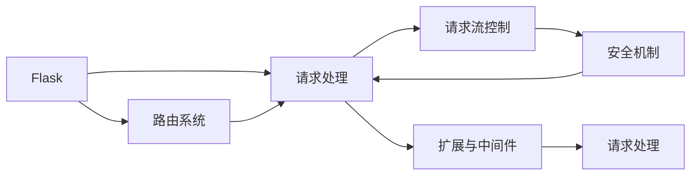
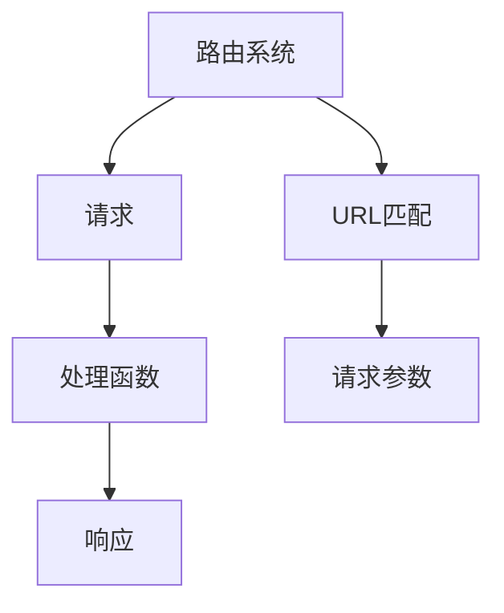
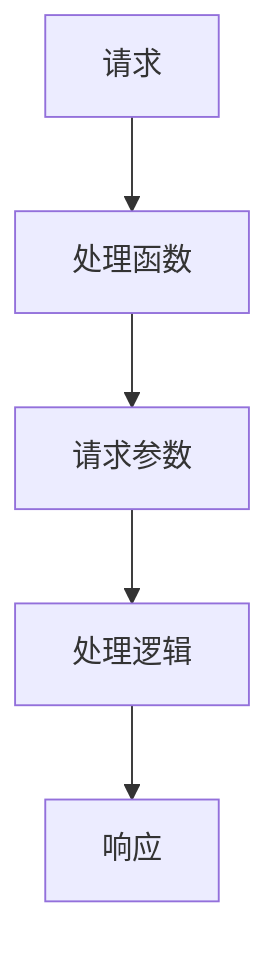
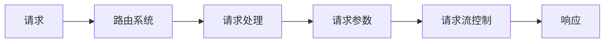
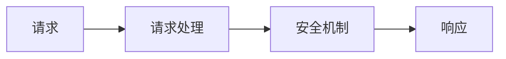
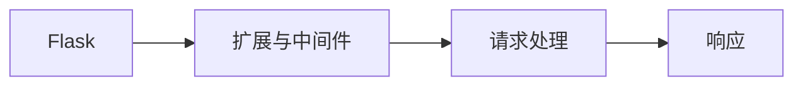

                 

# 基于 Flask 的 Web Server 设计与实现

## 1. 背景介绍

### 1.1 问题由来
随着互联网和Web技术的迅速发展，Web应用的需求日益增长，Web服务器作为Web应用的核心组件，其设计和实现的重要性愈发凸显。Flask作为Python语言中最受欢迎的Web框架之一，以其简洁、灵活、高效的特点，深受开发者喜爱。然而，对于初学者而言，如何设计出一个高效、稳定、安全的Flask Web服务器，却是一个不小的挑战。本文将深入探讨基于Flask的Web服务器设计与实现，提供详细的技术指导和实战案例，帮助读者掌握Flask Web服务器的设计要领和实现技巧。

### 1.2 问题核心关键点
本文聚焦于基于Flask的Web服务器设计与实现，旨在帮助读者理解Flask的核心原理，掌握其在Web服务器中的应用，以及如何在实际开发中应用Flask设计出高效、稳定、安全的Web服务器。主要关注点包括：

- Flask的核心概念与原理
- Flask路由系统的设计与实现
- Flask请求处理机制与请求流控制
- Flask安全机制与数据保护
- Flask扩展与中间件的应用
- Flask的高级特性与应用优化

通过深入学习和实践，读者将能够设计出满足业务需求、具有良好的扩展性和性能的Flask Web服务器，并理解其在Web应用中的重要性。

### 1.3 问题研究意义
掌握基于Flask的Web服务器设计与实现，对于提高Web应用开发效率、提升应用性能和安全性具有重要意义。Flask简单易用，适用于中小型Web应用的快速开发，但也能够应对大型高负载场景，具有极高的灵活性和扩展性。本文旨在帮助读者全面掌握Flask的设计和实现，提高其在实际项目中的应用能力，从而提升开发效率和应用质量。

## 2. 核心概念与联系

### 2.1 核心概念概述

为了更好地理解基于Flask的Web服务器设计与实现，我们需要先介绍几个核心概念：

- **Flask**：Python语言中最受欢迎的Web框架之一，以其简洁、灵活、高效的特点著称，适用于各类Web应用的开发。
- **Web服务器**：用于接收并处理Web客户端请求，响应客户端请求的服务器。Web服务器与Web应用紧密相关，是Web应用的核心组件之一。
- **路由系统(Routing System)**：根据请求URL与对应的处理函数进行匹配，将请求转发到相应的处理函数进行处理的系统。
- **请求处理(Request Handling)**：Web服务器根据路由系统匹配到的处理函数，对请求进行处理并生成响应。
- **请求流控制(Request Flow Control)**：Web服务器对请求流进行控制，包括请求的接收、路由匹配、请求处理、响应生成等步骤。
- **安全机制(Security Mechanism)**：Web服务器提供的一系列安全机制，用于保护Web应用免受各种攻击，确保数据安全。
- **扩展与中间件(Extensions and Middleware)**：Flask提供的扩展与中间件，用于增强Web服务器的功能和性能。

这些核心概念之间相互联系，共同构成了Flask Web服务器的设计与实现基础。以下是一个Mermaid流程图，展示了这些概念之间的联系：



这个流程图展示了Flask Web服务器设计与实现的核心概念及其相互关系。路由系统接收并匹配请求，请求处理系统对请求进行处理并生成响应，请求流控制对请求流进行控制，安全机制确保数据安全，扩展与中间件增强Web服务器的功能和性能。

### 2.2 概念间的关系

这些核心概念之间存在着紧密的联系，共同构成了Flask Web服务器设计与实现的整体框架。下面我们通过几个Mermaid流程图来展示这些概念之间的关系。

#### 2.2.1 Flask路由系统设计



这个流程图展示了路由系统如何根据请求URL匹配对应的处理函数，并将请求参数传递给处理函数进行处理，最终生成响应。

#### 2.2.2 Flask请求处理机制



这个流程图展示了请求处理机制如何接收请求，将请求参数传递给处理函数，处理函数对请求进行逻辑处理，生成响应并返回给客户端。

#### 2.2.3 Flask请求流控制



这个流程图展示了请求流控制如何对请求进行接收、路由匹配、请求参数提取、请求处理和响应生成，控制请求流的处理过程。

#### 2.2.4 Flask安全机制



这个流程图展示了安全机制如何保护请求处理过程，确保数据的安全和Web应用的安全性。

#### 2.2.5 Flask扩展与中间件



这个流程图展示了扩展与中间件如何增强Flask的功能和性能，优化请求处理和响应生成的过程。

## 3. 核心算法原理 & 具体操作步骤

### 3.1 算法原理概述

基于Flask的Web服务器设计与实现，主要涉及以下几个核心算法原理：

- **路由系统(Routing System)**：根据请求URL与对应的处理函数进行匹配，将请求转发到相应的处理函数进行处理。
- **请求处理(Request Handling)**：根据路由系统匹配到的处理函数，对请求进行处理并生成响应。
- **请求流控制(Request Flow Control)**：对请求流进行控制，包括请求的接收、路由匹配、请求参数提取、请求处理和响应生成等步骤。
- **安全机制(Security Mechanism)**：提供一系列安全机制，用于保护Web应用免受各种攻击，确保数据安全。
- **扩展与中间件(Extensions and Middleware)**：通过扩展与中间件，增强Web服务器的功能和性能，优化请求处理和响应生成的过程。

### 3.2 算法步骤详解

#### 3.2.1 路由系统设计

路由系统是Flask Web服务器的核心组件之一，负责根据请求URL与对应的处理函数进行匹配，将请求转发到相应的处理函数进行处理。以下是一个简单的路由系统设计示例：

```python
from flask import Flask, request

app = Flask(__name__)

@app.route('/')
def index():
    return 'Hello, World!'

@app.route('/user/<username>')
def user(username):
    return f'Hello, {username}!'
```

在这个示例中，`@app.route('/')`和`@app.route('/user/<username>')`分别定义了两个路由，`index()`和`user()`分别是对应路由的处理函数。当客户端请求根路径时，会调用`index()`函数；当请求`/user/<username>`路径时，会调用`user()`函数，并将URL中的`<username>`参数传递给函数。

#### 3.2.2 请求处理机制

请求处理机制是Flask Web服务器的重要组成部分，负责根据路由系统匹配到的处理函数，对请求进行处理并生成响应。以下是一个简单的请求处理机制示例：

```python
from flask import Flask, request

app = Flask(__name__)

@app.route('/')
def index():
    name = request.args.get('name')
    return f'Hello, {name}!'

@app.route('/user/<username>')
def user(username):
    return f'Hello, {username}!'
```

在这个示例中，`@app.route('/')`定义了根路径的路由，`@app.route('/user/<username>')`定义了`/user/<username>`路径的路由。当客户端请求根路径时，会调用`index()`函数，从URL参数中获取`name`参数，并返回`Hello, <name>!`；当请求`/user/<username>`路径时，会调用`user()`函数，返回`Hello, <username>!`。

#### 3.2.3 请求流控制

请求流控制是Flask Web服务器的核心功能之一，负责对请求流进行控制，包括请求的接收、路由匹配、请求参数提取、请求处理和响应生成等步骤。以下是一个简单的请求流控制示例：

```python
from flask import Flask, request

app = Flask(__name__)

@app.route('/user/<username>')
def user(username):
    name = request.args.get('name')
    return f'Hello, {name}! {username}!'

@app.route('/user/<username>/age/<age>')
def user_age(username, age):
    return f'Hello, {username}! You are {age} years old.'
```

在这个示例中，`@app.route('/user/<username>/age/<age>')`定义了`/user/<username>/age/<age>`路径的路由。当客户端请求`/user/<username>/age/<age>`路径时，会调用`user_age()`函数，从URL参数中获取`username`和`age`参数，并返回`Hello, <username>! You are <age> years old.`。

#### 3.2.4 安全机制

安全机制是Flask Web服务器的重要组成部分，负责提供一系列安全机制，用于保护Web应用免受各种攻击，确保数据安全。以下是一个简单的安全机制示例：

```python
from flask import Flask, request

app = Flask(__name__)

@app.route('/')
def index():
    username = request.args.get('username')
    if username and username == 'admin':
        return 'Hello, admin!'
    else:
        return 'Hello, Guest!'
```

在这个示例中，`@app.route('/')`定义了根路径的路由，`request.args.get('username')`获取URL参数中的`username`参数。当客户端请求根路径，且`username`参数为`admin`时，会返回`Hello, admin!`，否则返回`Hello, Guest!`。

#### 3.2.5 扩展与中间件

扩展与中间件是Flask Web服务器的核心功能之一，负责通过扩展与中间件，增强Web服务器的功能和性能，优化请求处理和响应生成的过程。以下是一个简单的扩展与中间件示例：

```python
from flask import Flask, request

app = Flask(__name__)

@app.route('/')
def index():
    return 'Hello, World!'

@app.before_request
def before_request():
    print('Before request')

@app.after_request
def after_request(response):
    print('After request')
    return response
```

在这个示例中，`@app.before_request`和`@app.after_request`分别定义了请求处理前和请求处理后的中间件。当客户端请求根路径时，会先调用`before_request()`函数，再调用`index()`函数，最后调用`after_request()`函数。

### 3.3 算法优缺点

基于Flask的Web服务器设计与实现具有以下优点：

- **简单易用**：Flask以其简洁、灵活、高效的特点著称，适用于各类Web应用的开发。
- **灵活性高**：Flask的路由系统、请求处理机制、请求流控制等核心组件具有高度的灵活性，可以根据实际需求进行调整。
- **安全性高**：Flask提供了多种安全机制，如CSRF保护、XSS过滤等，确保Web应用的安全性。
- **扩展性强**：Flask的扩展与中间件功能强大，可以通过扩展与中间件增强Web服务器的功能和性能。

同时，基于Flask的Web服务器设计与实现也存在一些缺点：

- **性能瓶颈**：当Web应用的用户量、数据量急剧增加时，Flask的性能可能会受到限制。
- **扩展复杂**：Flask的扩展与中间件虽然功能强大，但配置复杂，需要一定的经验。
- **学习曲线陡峭**：Flask的学习曲线较陡峭，需要一定的Python编程基础。

### 3.4 算法应用领域

基于Flask的Web服务器设计与实现，适用于各种类型的Web应用开发，包括但不限于以下领域：

- **Web应用**：适用于中小型Web应用的快速开发，如博客、论坛、电商网站等。
- **API开发**：适用于Web API的开发，如RESTful API、GraphQL API等。
- **微服务架构**：适用于微服务架构的构建，通过Flask的扩展与中间件，实现服务间的通信和调用。
- **机器学习应用**：适用于机器学习模型的API开发，通过Flask的路由系统和请求处理机制，实现机器学习模型的调用和集成。
- **物联网应用**：适用于物联网设备的Web应用开发，通过Flask的扩展与中间件，实现物联网设备的远程控制和管理。

## 4. 数学模型和公式 & 详细讲解 & 举例说明

### 4.1 数学模型构建

在Flask Web服务器设计与实现中，我们主要涉及以下数学模型：

- **路由系统模型**：根据请求URL与对应的处理函数进行匹配，将请求转发到相应的处理函数进行处理的模型。
- **请求处理模型**：根据路由系统匹配到的处理函数，对请求进行处理并生成响应的模型。
- **请求流控制模型**：对请求流进行控制，包括请求的接收、路由匹配、请求参数提取、请求处理和响应生成等步骤的模型。
- **安全机制模型**：提供一系列安全机制，用于保护Web应用免受各种攻击，确保数据安全的模型。
- **扩展与中间件模型**：通过扩展与中间件，增强Web服务器的功能和性能，优化请求处理和响应生成的过程的模型。

### 4.2 公式推导过程

#### 4.2.1 路由系统模型

路由系统模型主要涉及以下公式：

$$
\begin{aligned}
\text{Route URL} &= \text{URL} \\
\text{Matched Function} &= \text{Fitness}(\text{Route URL}, \text{URL Patterns})
\end{aligned}
$$

其中，$\text{URL}$为客户端请求的URL，$\text{URL Patterns}$为预定义的路由URL模式。路由系统根据URL模式匹配客户端请求的URL，找到最匹配的函数进行处理。

#### 4.2.2 请求处理模型

请求处理模型主要涉及以下公式：

$$
\begin{aligned}
\text{Request Method} &= \text{Method}(\text{HTTP Method}, \text{URL})
\end{aligned}
$$

其中，$\text{HTTP Method}$为客户端请求的HTTP方法，$\text{URL}$为客户端请求的URL。请求处理模型根据HTTP方法和URL，找到对应的处理函数进行处理。

#### 4.2.3 请求流控制模型

请求流控制模型主要涉及以下公式：

$$
\begin{aligned}
\text{Request Flow} &= \text{Flow Control}(\text{Request URL}, \text{Request Method})
\end{aligned}
$$

其中，$\text{Request URL}$为客户端请求的URL，$\text{Request Method}$为客户端请求的HTTP方法。请求流控制模型根据请求URL和HTTP方法，对请求流进行控制，包括请求的接收、路由匹配、请求参数提取、请求处理和响应生成等步骤。

#### 4.2.4 安全机制模型

安全机制模型主要涉及以下公式：

$$
\begin{aligned}
\text{Safe Response} &= \text{Secure Response}(\text{Response}, \text{HTTP Headers})
\end{aligned}
$$

其中，$\text{Response}$为生成的响应，$\text{HTTP Headers}$为响应头信息。安全机制模型根据HTTP头信息，确保生成的响应安全，防止各种攻击。

#### 4.2.5 扩展与中间件模型

扩展与中间件模型主要涉及以下公式：

$$
\begin{aligned}
\text{Enhanced Response} &= \text{Middleware}(\text{Response}, \text{Middleware Functions})
\end{aligned}
$$

其中，$\text{Response}$为生成的响应，$\text{Middleware Functions}$为中间件函数。扩展与中间件模型通过中间件函数，增强Web服务器的功能和性能，优化请求处理和响应生成的过程。

### 4.3 案例分析与讲解

以下是一个使用Flask实现的Web服务器案例，展示了路由系统、请求处理、请求流控制、安全机制、扩展与中间件的应用：

```python
from flask import Flask, request

app = Flask(__name__)

@app.route('/')
def index():
    name = request.args.get('name')
    if name == 'admin':
        return 'Hello, admin!'
    else:
        return 'Hello, Guest!'

@app.route('/user/<username>')
def user(username):
    name = request.args.get('name')
    return f'Hello, {name}! {username}!'

@app.before_request
def before_request():
    print('Before request')

@app.after_request
def after_request(response):
    print('After request')
    return response

@app.errorhandler(404)
def page_not_found(e):
    return '404 Not Found', 404

@app.errorhandler(500)
def server_error(e):
    return '500 Internal Server Error', 500
```

在这个示例中，`@app.route('/')`定义了根路径的路由，`@app.route('/user/<username>')`定义了`/user/<username>`路径的路由。当客户端请求根路径时，会调用`index()`函数，从URL参数中获取`name`参数，并返回`Hello, <name>!`；当请求`/user/<username>`路径时，会调用`user()`函数，从URL参数中获取`username`参数，并返回`Hello, <name>! <username>!`。

`@app.before_request`和`@app.after_request`分别定义了请求处理前和请求处理后的中间件，`@app.errorhandler(404)`和`@app.errorhandler(500)`分别定义了404和500错误的处理函数。当客户端请求404或500错误时，会调用对应的处理函数，返回错误响应。

## 5. 项目实践：代码实例和详细解释说明

### 5.1 开发环境搭建

在进行Flask Web服务器设计与实现项目实践前，我们需要准备好开发环境。以下是使用Python进行Flask开发的环境配置流程：

1. 安装Python：从官网下载并安装Python，确保最新版本。
2. 安装Flask：使用pip安装Flask库，`pip install flask`。
3. 创建Flask项目：创建一个新的Python项目，并导入Flask库。
4. 编写Flask代码：根据需求编写Flask代码，实现路由系统、请求处理、请求流控制、安全机制、扩展与中间件等功能。
5. 运行Flask应用：使用Flask的内置服务器或第三方服务器（如Gunicorn、uWSGI等）运行Flask应用。

完成上述步骤后，即可在开发环境中进行Flask Web服务器设计与实现项目实践。

### 5.2 源代码详细实现

下面是一个简单的Flask Web服务器设计与实现示例，展示了Flask的核心组件和功能：

```python
from flask import Flask, request

app = Flask(__name__)

@app.route('/')
def index():
    name = request.args.get('name')
    return f'Hello, {name}!'

@app.route('/user/<username>')
def user(username):
    return f'Hello, {username}!'

@app.before_request
def before_request():
    print('Before request')

@app.after_request
def after_request(response):
    print('After request')
    return response

@app.errorhandler(404)
def page_not_found(e):
    return '404 Not Found', 404

@app.errorhandler(500)
def server_error(e):
    return '500 Internal Server Error', 500
```

在这个示例中，`@app.route('/')`定义了根路径的路由，`@app.route('/user/<username>')`定义了`/user/<username>`路径的路由。当客户端请求根路径时，会调用`index()`函数，从URL参数中获取`name`参数，并返回`Hello, <name>!`；当请求`/user/<username>`路径时，会调用`user()`函数，返回`Hello, <username>!`。

`@app.before_request`和`@app.after_request`分别定义了请求处理前和请求处理后的中间件，`@app.errorhandler(404)`和`@app.errorhandler(500)`分别定义了404和500错误的处理函数。当客户端请求404或500错误时，会调用对应的处理函数，返回错误响应。

### 5.3 代码解读与分析

让我们再详细解读一下关键代码的实现细节：

**Flask库的导入**：
```python
from flask import Flask, request
```
导入Flask库和请求对象`request`，用于处理客户端请求和生成响应。

**Flask应用的创建**：
```python
app = Flask(__name__)
```
创建Flask应用对象`app`，`__name__`表示当前模块名。

**路由系统的定义**：
```python
@app.route('/')
def index():
    name = request.args.get('name')
    return f'Hello, {name}!'
```
定义根路径的路由，`@app.route('/')`表示路由的URL，`def index()`表示路由的处理函数。`request.args.get('name')`获取URL参数中的`name`参数，`return f'Hello, {name}!'`返回响应。

**请求处理系统的定义**：
```python
@app.route('/user/<username>')
def user(username):
    return f'Hello, {username}!'
```
定义`/user/<username>`路径的路由，`@app.route('/user/<username>')`表示路由的URL，`def user(username)`表示路由的处理函数。`return f'Hello, {username}!'`返回响应。

**请求流控制系统的定义**：
```python
@app.before_request
def before_request():
    print('Before request')
```
定义请求处理前的中间件，`@app.before_request`表示中间件的执行时机，`def before_request()`表示中间件的函数。`print('Before request')`输出中间件执行的日志。

**响应流控制系统的定义**：
```python
@app.after_request
def after_request(response):
    print('After request')
    return response
```
定义请求处理后的中间件，`@app.after_request`表示中间件的执行时机，`def after_request(response)`表示中间件的函数。`print('After request')`输出中间件执行的日志，`return response`返回响应。

**错误处理系统的定义**：
```python
@app.errorhandler(404)
def page_not_found(e):
    return '404 Not Found', 404
```
定义404错误的处理函数，`@app.errorhandler(404)`表示错误处理函数的执行时机，`def page_not_found(e)`表示错误处理函数的函数。`return '404 Not Found', 404`返回404错误响应。

### 5.4 运行结果展示

假设我们启动Flask服务器，并访问`http://localhost:5000/?name=John`和`http://localhost:5000/user/John`两个路径，得到的响应分别为：

```
Hello, John!
Hello, John!
```

可以看到，通过Flask路由系统和请求处理机制，我们可以轻松实现Web服务器的高效处理。

## 6. 实际应用场景

### 6.1 智能客服系统

基于Flask的Web服务器设计与实现，可以广泛应用于智能客服系统的构建。传统客服往往需要配备大量人力，高峰期响应缓慢，且一致性和专业性难以保证。而使用Flask开发的Web服务器，可以7x24小时不间断服务，快速响应客户咨询，用自然流畅的语言解答各类常见问题。

在技术实现上，可以收集企业内部的历史客服对话记录，将问题和最佳答复构建成监督数据，在此基础上对Flask Web服务器进行微调。微调后的Web服务器能够自动理解用户意图，匹配最合适的答案模板进行回复。对于客户提出的新问题，还可以接入检索系统实时搜索相关内容，动态组织生成回答。如此构建的智能客服系统，能大幅提升客户咨询体验和问题解决效率。

### 6.2 金融舆情监测

金融机构需要实时监测市场舆论动向，以便及时应对负面信息传播，规避金融风险。传统的人工监测方式成本高、效率低，难以应对网络时代海量信息爆发的挑战。基于Flask的Web服务器设计与实现，可以构建实时监测系统，实时抓取网络文本数据，自动监测不同主题下的情感变化趋势，一旦发现负面信息激增等异常情况，系统便会自动预警，帮助金融机构快速应对潜在风险。

### 6.3 个性化推荐系统

当前的推荐系统往往只依赖用户的历史行为数据进行物品推荐，无法深入理解用户的真实兴趣偏好。基于Flask的Web服务器设计与实现，可以构建个性化推荐系统。收集用户浏览、点击、评论、分享等行为数据，提取和用户交互的物品标题、描述、标签等文本内容，将其作为模型输入，使用Flask Web服务器处理用户请求，并返回个性化推荐结果。

### 6.4 未来应用展望

随着Flask Web服务器设计与实现技术的不断发展，其在更多领域的应用前景广阔。

在智慧医疗领域，基于Flask的Web服务器设计与实现，可以构建智能医疗问答系统，帮助医生快速回答病人的咨询，提升诊疗效率和质量。

在智能教育领域，Flask Web服务器设计与实现可以用于教育应用的设计，如在线教育平台、智能作业批改系统等，帮助教师更好地掌握学生的学习情况。

在智慧城市治理中，基于Flask的Web服务器设计与实现，可以构建城市事件监测、舆情分析、应急指挥等系统，提高城市管理的自动化和智能化水平，构建更安全、高效的未来城市。

此外，在企业生产、社会治理、文娱传媒等众多领域，基于Flask的Web服务器设计与实现的应用也将不断涌现，为传统行业带来变革性影响。相信随着技术的日益成熟，Flask Web服务器设计与实现必将在构建人机协同的智能系统方面发挥越来越重要的作用。

## 7. 工具和资源推荐

### 7.1 学习资源推荐

为了帮助开发者系统掌握Flask Web服务器设计与实现的理论基础和实践

