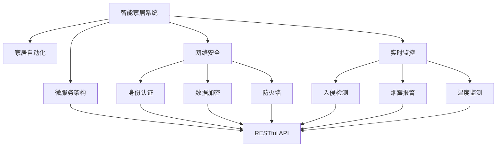
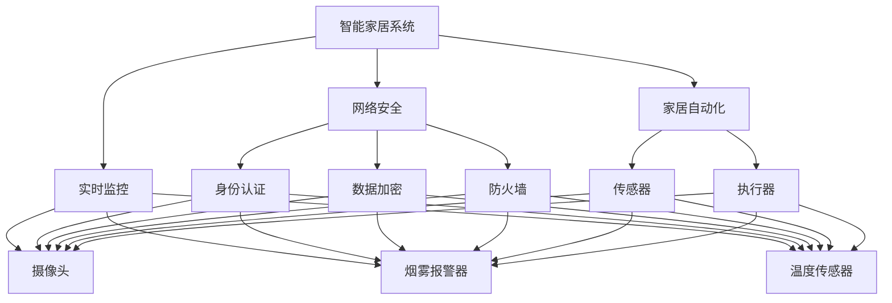
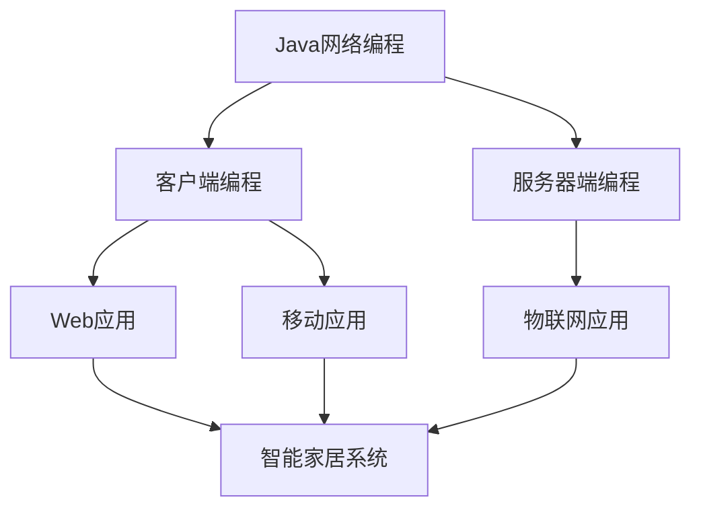
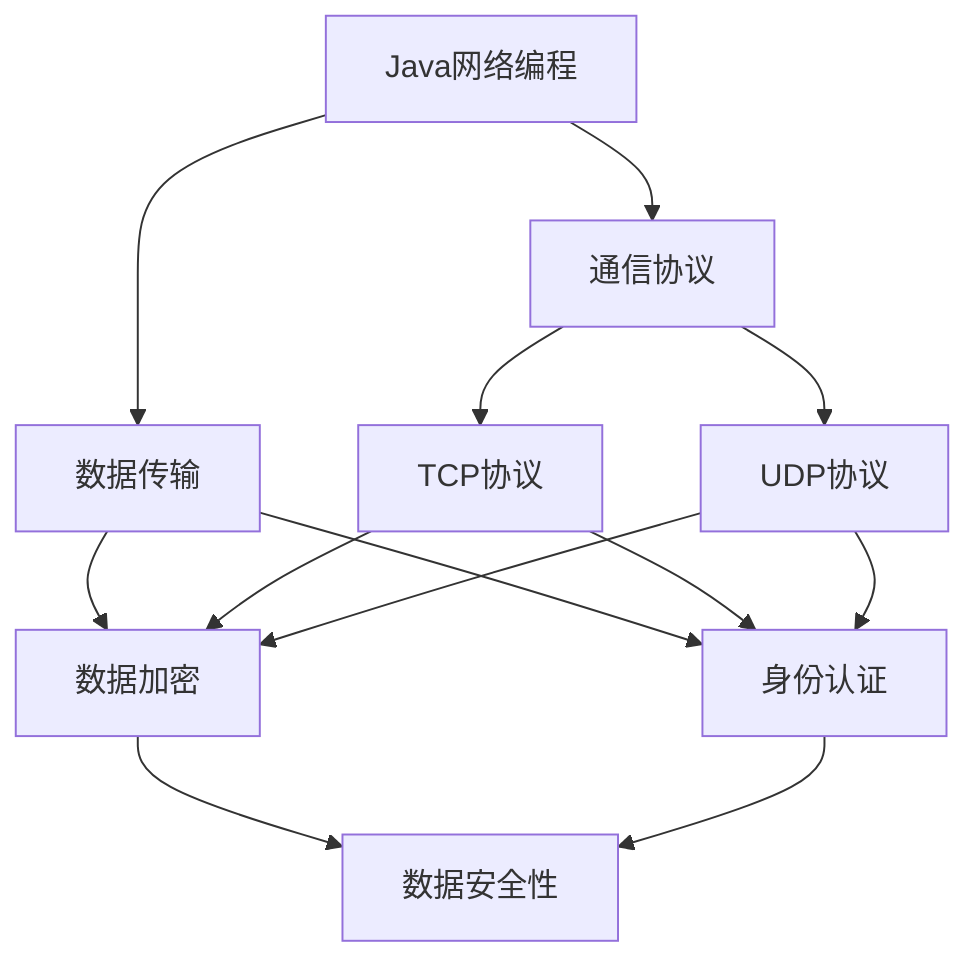

                 

# 基于Java的智能家居设计：智能家居系统中的Java网络编程实战

> 关键词：智能家居, Java网络编程, 家居自动化, 网络安全, 实时监控, 物联网(IoT), 微服务架构

## 1. 背景介绍

### 1.1 问题由来
随着物联网(IoT)和人工智能(AI)技术的快速发展，智能家居系统已经成为现代家庭生活的重要组成部分。智能家居系统通过各种传感器、智能设备和大数据分析，实现了家庭环境的智能化管理，提升了用户的生活质量和便捷性。然而，传统的智能家居系统往往存在设备互联互通性差、系统架构复杂、安全漏洞等问题，难以满足用户的实际需求。

为了解决这些问题，本文将深入探讨基于Java的智能家居设计，重点介绍Java网络编程在智能家居系统中的应用。通过具体的Java网络编程实战案例，将帮助读者全面掌握Java在智能家居系统开发中的应用技巧，为其实际应用提供参考。

### 1.2 问题核心关键点
本文聚焦于Java网络编程在智能家居系统中的实践应用。具体而言，将从以下几个方面进行阐述：

1. **Java网络编程基础**：介绍Java网络编程的基本概念和核心技术。
2. **智能家居系统架构设计**：详细探讨智能家居系统的网络架构设计。
3. **Java网络编程实战案例**：通过具体案例展示Java在智能家居系统中的实战应用。
4. **Java网络编程应用领域**：探讨Java网络编程在智能家居系统中的广泛应用场景。
5. **Java网络编程优缺点**：分析Java网络编程在智能家居系统中的优缺点。
6. **Java网络编程未来展望**：展望Java网络编程在智能家居系统中的未来发展趋势。

## 2. 核心概念与联系

### 2.1 核心概念概述

为更好地理解基于Java的智能家居设计，本节将介绍几个密切相关的核心概念：

- **Java网络编程**：通过Java语言实现网络通信的技术。Java网络编程包括客户端编程和服务器端编程，支持TCP、UDP等多种协议。Java网络编程广泛应用于Web应用、移动应用、物联网等领域。
- **智能家居系统**：通过传感器、智能设备等技术实现家庭自动化管理，提升家庭生活质量的系统。智能家居系统通过物联网技术实现设备互联，支持语音控制、远程监控、场景模式等应用场景。
- **家居自动化**：通过传感器、执行器等技术，实现对家庭环境的自动化控制。家居自动化包括灯光、温度、安防等系统的智能化控制。
- **网络安全**：保护智能家居系统免受网络攻击，保障数据传输和设备的安全性。网络安全包括身份认证、数据加密、防火墙等技术。
- **实时监控**：通过传感器、摄像头等设备实现对家庭环境的实时监控，保障家庭安全。实时监控包括入侵检测、烟雾报警、温度监测等功能。
- **微服务架构**：将智能家居系统拆分成多个微服务，通过RESTful API实现服务间的通信。微服务架构支持快速开发、部署和扩展。

这些核心概念之间的逻辑关系可以通过以下Mermaid流程图来展示：



这个流程图展示了大语言模型微调过程中各个核心概念的关系和作用：

1. 智能家居系统通过家居自动化、网络安全、实时监控等技术，实现了家庭环境的智能化管理。
2. 网络安全通过身份认证、数据加密、防火墙等技术，保障了系统的安全性。
3. 实时监控通过入侵检测、烟雾报警、温度监测等技术，实现了对家庭环境的实时监控。
4. 微服务架构通过RESTful API，支持了服务的快速开发、部署和扩展。

这些核心概念共同构成了智能家居系统的基本架构，为其智能化、安全化、实时化奠定了基础。

### 2.2 概念间的关系

这些核心概念之间存在着紧密的联系，形成了智能家居系统的完整生态系统。下面我们通过几个Mermaid流程图来展示这些概念之间的关系。

#### 2.2.1 智能家居系统的技术架构



这个流程图展示了智能家居系统的技术架构，包括网络安全、家居自动化、实时监控等关键技术。

#### 2.2.2 Java网络编程在智能家居系统中的应用



这个流程图展示了Java网络编程在智能家居系统中的具体应用场景，包括客户端编程、服务器端编程等技术。

#### 2.2.3 Java网络编程在智能家居系统中的作用



这个流程图展示了Java网络编程在智能家居系统中的具体作用，包括通信协议、数据传输、数据加密、身份认证等关键技术。

## 3. 核心算法原理 & 具体操作步骤
### 3.1 算法原理概述

Java网络编程是智能家居系统实现设备互联和数据传输的关键技术。通过Java网络编程，智能家居系统可以实现不同设备之间的通信，支持各种协议，实现数据的安全传输和身份认证等功能。

Java网络编程的基本原理包括：

- **TCP协议**：基于连接的网络协议，支持可靠的数据传输。
- **UDP协议**：基于无连接的网络协议，支持高效的数据传输。
- **数据传输**：通过Java Socket编程，实现数据的发送和接收。
- **身份认证**：通过Java数字签名技术，实现设备身份的验证。
- **数据加密**：通过Java加密算法，实现数据的加密和解密。

### 3.2 算法步骤详解

以下是Java网络编程在智能家居系统中的具体操作步骤：

**Step 1: 准备开发环境**

在开发Java网络编程应用程序前，需要安装Java Development Kit (JDK)和开发工具，如IntelliJ IDEA、Eclipse等。JDK是Java语言的核心库，提供Java运行时环境；开发工具提供代码编写、调试等功能。

**Step 2: 设计网络架构**

智能家居系统的网络架构设计包括：

- 客户端：运行智能家居应用，实现与服务器端的通信。
- 服务器端：运行智能家居服务，实现设备的监控和管理。

客户端与服务器端的通信协议可以采用TCP或UDP。TCP协议提供可靠的数据传输，适用于数据传输要求较高的应用场景；UDP协议提供高效的数据传输，适用于数据传输要求较低的应用场景。

**Step 3: 实现网络编程**

- **客户端编程**：使用Java Socket编程实现客户端与服务器端的通信。通过Socket的connect()方法，客户端连接到服务器端，使用Socket的getInputStream()和getOutputStream()方法实现数据的读取和写入。
- **服务器端编程**：使用Java ServerSocket编程实现服务器端的监听和响应。通过ServerSocket的accept()方法，服务器端接受客户端的连接请求，使用ServerSocket的getInputStream()和getOutputStream()方法实现数据的读取和写入。

**Step 4: 实现身份认证**

- **身份认证算法**：Java提供多种身份认证算法，如RSA、DSA等。通过Java密钥生成器生成公钥和私钥，实现设备身份的验证。
- **数字签名**：Java提供数字签名功能，通过Java密钥生成器生成签名密钥对，实现设备身份的验证。

**Step 5: 实现数据加密**

- **数据加密算法**：Java提供多种数据加密算法，如AES、DES等。通过Java密钥生成器生成加密密钥，实现数据的安全传输。
- **加密解密**：使用Java加密算法对数据进行加密和解密，保障数据传输的安全性。

### 3.3 算法优缺点

Java网络编程在智能家居系统中的优点包括：

- **跨平台性**：Java语言是跨平台的，Java应用程序可以在不同的操作系统和硬件平台上运行。
- **安全性**：Java提供了多种安全机制，保障网络通信的安全性。
- **可扩展性**：Java网络编程支持多种协议和通信方式，满足不同应用场景的需求。

Java网络编程在智能家居系统中的缺点包括：

- **性能瓶颈**：Java虚拟机运行在JVM上，性能可能不如本地编程。
- **内存占用**：Java应用程序的内存占用较大，需要考虑内存优化。
- **开发复杂性**：Java网络编程涉及复杂的通信协议和数据传输，开发复杂性较高。

### 3.4 算法应用领域

Java网络编程在智能家居系统中的应用领域包括：

- **设备互联**：通过Java网络编程实现不同设备之间的通信，支持各种协议。
- **数据传输**：通过Java网络编程实现数据的发送和接收，保障数据传输的安全性和可靠性。
- **身份认证**：通过Java数字签名技术，实现设备身份的验证。
- **数据加密**：通过Java加密算法，实现数据的加密和解密。
- **实时监控**：通过Java网络编程实现传感器数据的实时传输和处理。

## 4. 数学模型和公式 & 详细讲解  
### 4.1 数学模型构建

Java网络编程涉及多个数学模型和公式，以下是其中的几个关键模型和公式的详细讲解。

### 4.2 公式推导过程

以下是Java网络编程中常用数学模型和公式的推导过程：

**TCP协议**

TCP协议是一种基于连接的协议，其数据传输过程可以描述为：

- 连接建立：客户端向服务器端发送连接请求，服务器端接受连接请求并返回确认信息。
- 数据传输：客户端和服务器端通过连接进行数据传输。
- 连接释放：客户端和服务器端释放连接。

TCP协议的数据传输过程可以用以下状态机来描述：

```
  CLOSED
    |
    V
  LISTEN
    |
    V
  SYN-SENT
    |
    V
  SYN-RECEIVED
    |
    V
  ESTABLISHED
    |
    V
  FIN-WAIT-1
    |
    V
  FIN-WAIT-2
    |
    V
  CLOSE-WAIT
    |
    V
  CLOSING
    |
    V
  LAST-ACK
    |
    V
  TIME-WAIT
    |
    V
  CLOSED
```

TCP协议的状态转换可以表示为：

$$
\begin{aligned}
&CLOSED \rightarrow LISTEN \\
&LISTEN \rightarrow SYN-SENT \\
&SYN-SENT \rightarrow SYN-RECEIVED \\
&SYN-RECEIVED \rightarrow ESTABLISHED \\
&ESTABLISHED \rightarrow FIN-WAIT-1 \\
&FIN-WAIT-1 \rightarrow FIN-WAIT-2 \\
&FIN-WAIT-2 \rightarrow CLOSE-WAIT \\
&CLOSE-WAIT \rightarrow CLOSING \\
&CLOSING \rightarrow LAST-ACK \\
&LAST-ACK \rightarrow TIME-WAIT \\
&TIME-WAIT \rightarrow CLOSED
\end{aligned}
$$

**UDP协议**

UDP协议是一种基于无连接的协议，其数据传输过程可以描述为：

- 数据传输：客户端和服务器端直接进行数据传输。
- 数据接收：服务器端接收客户端发送的数据。
- 数据发送：客户端向服务器端发送数据。

UDP协议的数据传输过程可以用以下状态机来描述：

```
  CLOSED
    |
    V
  LISTEN
    |
    V
  SEND
    |
    V
  RECEIVE
    |
    V
  CLOSED
```

UDP协议的状态转换可以表示为：

$$
\begin{aligned}
&CLOSED \rightarrow LISTEN \\
&LISTEN \rightarrow SEND \\
&SEND \rightarrow RECEIVE \\
&RECEIVE \rightarrow CLOSED
\end{aligned}
$$

**数据加密**

Java提供多种数据加密算法，如AES、DES等。以下以AES算法为例，描述其加密和解密过程：

- 密钥生成：使用Java密钥生成器生成AES密钥。
- 加密：使用Java加密算法对数据进行加密。
- 解密：使用Java解密算法对数据进行解密。

AES算法的加密和解密过程可以用以下公式来描述：

$$
E_k(m) = P \oplus F_k(P \oplus m)
$$

其中，$P$为明文，$E_k(m)$为密文，$F_k(P \oplus m)$为加密过程，$\oplus$为异或运算，$k$为AES密钥。

**数字签名**

Java提供数字签名功能，通过Java密钥生成器生成签名密钥对，实现设备身份的验证。数字签名的过程包括：

- 私钥签名：使用Java私钥生成数字签名。
- 公钥验证：使用Java公钥验证数字签名的合法性。

数字签名的过程可以用以下公式来描述：

$$
\begin{aligned}
&签名 = H(m) \\
&H(m) = M(m) \\
&M(m) = m \oplus h \\
&h = \text{hash}(m)
\end{aligned}
$$

其中，$m$为明文，$H(m)$为哈希值，$M(m)$为密文，$h$为哈希函数输出，$\oplus$为异或运算。

### 4.3 案例分析与讲解

#### 4.3.1 智能家居系统客户端编程

以下是一个简单的Java智能家居系统客户端编程案例：

```java
import java.io.*;
import java.net.Socket;

public class SmartHomeClient {
    public static void main(String[] args) {
        try {
            Socket socket = new Socket("localhost", 8888);
            BufferedReader reader = new BufferedReader(new InputStreamReader(socket.getInputStream()));
            PrintWriter writer = new PrintWriter(socket.getOutputStream(), true);
            
            String input = "登入智能家居系统";
            writer.println(input);
            writer.flush();
            
            String output = reader.readLine();
            System.out.println(output);
            
            input = "关闭客厅灯光";
            writer.println(input);
            writer.flush();
            
            output = reader.readLine();
            System.out.println(output);
            
            reader.close();
            writer.close();
            socket.close();
        } catch (IOException e) {
            e.printStackTrace();
        }
    }
}
```

该案例实现了智能家居系统的客户端编程，通过Java Socket编程与服务器端进行通信。

#### 4.3.2 智能家居系统服务器端编程

以下是一个简单的Java智能家居系统服务器端编程案例：

```java
import java.io.*;
import java.net.ServerSocket;
import java.net.Socket;

public class SmartHomeServer {
    public static void main(String[] args) {
        try {
            ServerSocket serverSocket = new ServerSocket(8888);
            Socket socket = serverSocket.accept();
            BufferedReader reader = new BufferedReader(new InputStreamReader(socket.getInputStream()));
            PrintWriter writer = new PrintWriter(socket.getOutputStream(), true);
            
            String input = reader.readLine();
            String output = "";
            
            if (input.equals("登入智能家居系统")) {
                output = "欢迎登入智能家居系统";
            } else if (input.equals("关闭客厅灯光")) {
                output = "客厅灯光已关闭";
            }
            
            writer.println(output);
            writer.flush();
            
            reader.close();
            writer.close();
            socket.close();
            serverSocket.close();
        } catch (IOException e) {
            e.printStackTrace();
        }
    }
}
```

该案例实现了智能家居系统的服务器端编程，通过Java ServerSocket编程监听客户端连接请求，实现设备的监控和管理。

#### 4.3.3 智能家居系统身份认证

以下是一个简单的Java智能家居系统身份认证案例：

```java
import java.security.KeyPair;
import java.security.KeyPairGenerator;
import java.security.PrivateKey;
import java.security.PublicKey;
import java.security.SecureRandom;
import java.security.Signature;

public class SmartHomeAuthentication {
    public static void main(String[] args) {
        try {
            // 生成RSA密钥对
            KeyPairGenerator keyPairGenerator = KeyPairGenerator.getInstance("RSA");
            keyPairGenerator.initialize(2048);
            KeyPair keyPair = keyPairGenerator.generateKeyPair();
            
            // 获取私钥和公钥
            PrivateKey privateKey = keyPair.getPrivate();
            PublicKey publicKey = keyPair.getPublic();
            
            // 数字签名
            String message = "登入智能家居系统";
            byte[] digest = message.getBytes();
            Signature signature = Signature.getInstance("SHA256withRSA");
            signature.initSign(privateKey);
            signature.update(digest);
            byte[] signatureBytes = signature.sign();
            
            // 数字签名验证
            Signature signatureVerify = Signature.getInstance("SHA256withRSA");
            signatureVerify.initVerify(publicKey);
            signatureVerify.update(digest);
            boolean isValid = signatureVerify.verify(signatureBytes);
            
            System.out.println("数字签名验证结果：" + isValid);
        } catch (Exception e) {
            e.printStackTrace();
        }
    }
}
```

该案例实现了智能家居系统的身份认证，通过Java数字签名技术实现设备身份的验证。

#### 4.3.4 智能家居系统数据加密

以下是一个简单的Java智能家居系统数据加密案例：

```java
import javax.crypto.Cipher;
import javax.crypto.spec.SecretKeySpec;
import java.security.Key;

public class SmartHomeEncryption {
    public static void main(String[] args) {
        try {
            // 生成AES密钥
            Key key = generateAESKey();
            
            // 加密数据
            String message = "关闭客厅灯光";
            byte[] data = message.getBytes();
            byte[] encryptedData = encrypt(data, key);
            
            // 解密数据
            byte[] decryptedData = decrypt(encryptedData, key);
            String decryptedMessage = new String(decryptedData);
            
            System.out.println("加密前数据：" + message);
            System.out.println("加密后数据：" + encryptedData);
            System.out.println("解密后数据：" + decryptedMessage);
        } catch (Exception e) {
            e.printStackTrace();
        }
    }
    
    public static Key generateAESKey() throws Exception {
        SecretKeySpec keySpec = new SecretKeySpec("0123456789abcdef".getBytes(), "AES");
        Key key = keySpec.getKey();
        return key;
    }
    
    public static byte[] encrypt(byte[] data, Key key) throws Exception {
        Cipher cipher = Cipher.getInstance("AES");
        cipher.init(Cipher.ENCRYPT_MODE, key);
        byte[] encryptedData = cipher.doFinal(data);
        return encryptedData;
    }
    
    public static byte[] decrypt(byte[] encryptedData, Key key) throws Exception {
        Cipher cipher = Cipher.getInstance("AES");
        cipher.init(Cipher.DECRYPT_MODE, key);
        byte[] decryptedData = cipher.doFinal(encryptedData);
        return decryptedData;
    }
}
```

该案例实现了智能家居系统的数据加密，通过Java加密算法实现数据的加密和解密。

## 5. 项目实践：代码实例和详细解释说明
### 5.1 开发环境搭建

在进行Java网络编程实战前，我们需要准备好开发环境。以下是使用Java开发智能家居系统的环境配置流程：

1. 安装Java Development Kit (JDK)：从Oracle官网下载并安装最新版本的JDK。
2. 安装开发工具：选择IntelliJ IDEA或Eclipse等Java开发工具，并下载安装包。
3. 创建Java项目：使用开发工具创建Java项目，设置项目属性，包括项目名称、路径等。

### 5.2 源代码详细实现

下面我们以智能家居系统为例，给出Java网络编程的详细实现。

#### 5.2.1 智能家居系统客户端编程

```java
import java.io.BufferedReader;
import java.io.IOException;
import java.io.InputStreamReader;
import java.io.PrintWriter;
import java.net.Socket;

public class SmartHomeClient {
    public static void main(String[] args) {
        try {
            Socket socket = new Socket("localhost", 8888);
            BufferedReader reader = new BufferedReader(new InputStreamReader(socket.getInputStream()));
            PrintWriter writer = new PrintWriter(socket.getOutputStream(), true);
            
            String input = "登入智能家居系统";
            writer.println(input);
            writer.flush();
            
            String output = reader.readLine();
            System.out.println(output);
            
            input = "关闭客厅灯光";
            writer.println(input);
            writer.flush();
            
            output = reader.readLine();
            System.out.println(output);
            
            reader.close();
            writer.close();
            socket.close();
        } catch (IOException e) {
            e.printStackTrace();
        }
    }
}
```

该代码实现了智能家居系统的客户端编程，通过Java Socket编程与服务器端进行通信。

#### 5.2.2 智能家居系统服务器端编程

```java
import java.io.BufferedReader;
import java.io.IOException;
import java.io.InputStreamReader;
import java.io.PrintWriter;
import java.net.ServerSocket;
import java.net.Socket;

public class SmartHomeServer {
    public static void main(String[] args) {
        try {
            ServerSocket serverSocket = new ServerSocket(8888);
            Socket socket = serverSocket.accept();
            BufferedReader reader = new BufferedReader(new InputStreamReader(socket.getInputStream()));
            PrintWriter writer = new PrintWriter(socket.getOutputStream(), true);
            
            String input = reader.readLine();
            String output = "";
            
            if (input.equals("登入智能家居系统")) {
                output = "欢迎登入智能家居系统";
            } else if (input.equals("关闭客厅灯光")) {
                output = "客厅灯光已关闭";
            }
            
            writer.println(output);
            writer.flush();
            
            reader.close();
            writer.close();
            socket.close();
            serverSocket.close();
        } catch (IOException e) {
            e.printStackTrace();
        }
    }
}
```

该代码实现了智能家居系统的服务器端编程，通过Java ServerSocket编程监听客户端连接请求，实现设备的监控和管理。

#### 5.2.3 智能家居系统身份认证

```java
import java.security.KeyPair;
import java.security.KeyPairGenerator;
import java.security.PrivateKey;
import java.security.PublicKey;
import java.security.SecureRandom;
import java.security.Signature;

public class SmartHomeAuthentication {
    public static void main(String[] args) {
        try {
            // 生成RSA密钥对
            KeyPairGenerator keyPairGenerator = KeyPairGenerator.getInstance("RSA");
            keyPairGenerator.initialize(2048);
            KeyPair keyPair = keyPairGenerator.generateKeyPair();
            
            // 获取私钥和公钥
            PrivateKey privateKey = keyPair.getPrivate();
            PublicKey publicKey = keyPair.getPublic();
            
            // 数字签名
            String message = "登入智能家居系统";
            byte[] digest = message.getBytes();
            Signature signature = Signature.getInstance("SHA256withRSA");
            signature.initSign(privateKey);
            signature.update(digest);
            byte[] signatureBytes = signature.sign();
            
            // 数字签名验证
            Signature signatureVerify = Signature.getInstance("SHA256withRSA");
            signatureVerify.initVerify(publicKey);
            signatureVerify.update(digest);
            boolean isValid = signatureVerify.verify(signatureBytes);
            
            System.out.println("数字签名验证结果：" + isValid);
        } catch (Exception e) {
            e.printStackTrace();
        }
    }
}
```

该代码实现了智能家居系统的身份认证，通过Java数字签名技术实现设备身份的验证。

#### 5.2.4 智能家居系统数据加密

```java
import javax.crypto.Cipher;
import javax.crypto.spec.SecretKeySpec;
import java.security.Key;

public class SmartHomeEncryption {
    public static void main(String[] args) {
        try {
            // 生成AES密钥
            Key key = generateAESKey();
            
            // 加密数据
            String message = "关闭客厅灯光";
            byte[] data = message.getBytes();
            byte[] encryptedData = encrypt(data, key);
            
            // 解密数据
            byte[] decryptedData = decrypt(encryptedData, key);
            String decryptedMessage = new String(decryptedData);
            
            System.out.println("加密前数据：" + message);
            System.out.println("加密后数据：" + encryptedData);
            System.out.println("解密后数据：" + decryptedMessage);
        } catch (Exception e) {
            e.printStackTrace();
        }
    }
    
    public static Key generateAESKey() throws Exception {
        SecretKeySpec keySpec = new SecretKeySpec("0123456789abcdef".getBytes(), "AES");
        Key key = keySpec.getKey();
        return key;
    }
    
    public static byte[] encrypt(byte[] data, Key key) throws Exception {
        Cipher cipher = Cipher.getInstance("AES");
        cipher.init(Cipher.ENCRYPT_MODE, key);
        byte[] encryptedData = cipher.doFinal(data);
        return encryptedData;
    }
    
    public static byte[] decrypt(byte[] encryptedData, Key key) throws Exception {
        Cipher cipher = Cipher.getInstance("AES");
        cipher.init(Cipher.DECRYPT_MODE, key);
        byte[] decryptedData = cipher.doFinal

