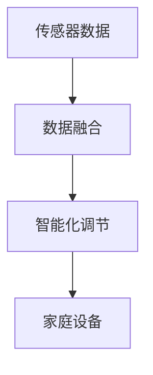
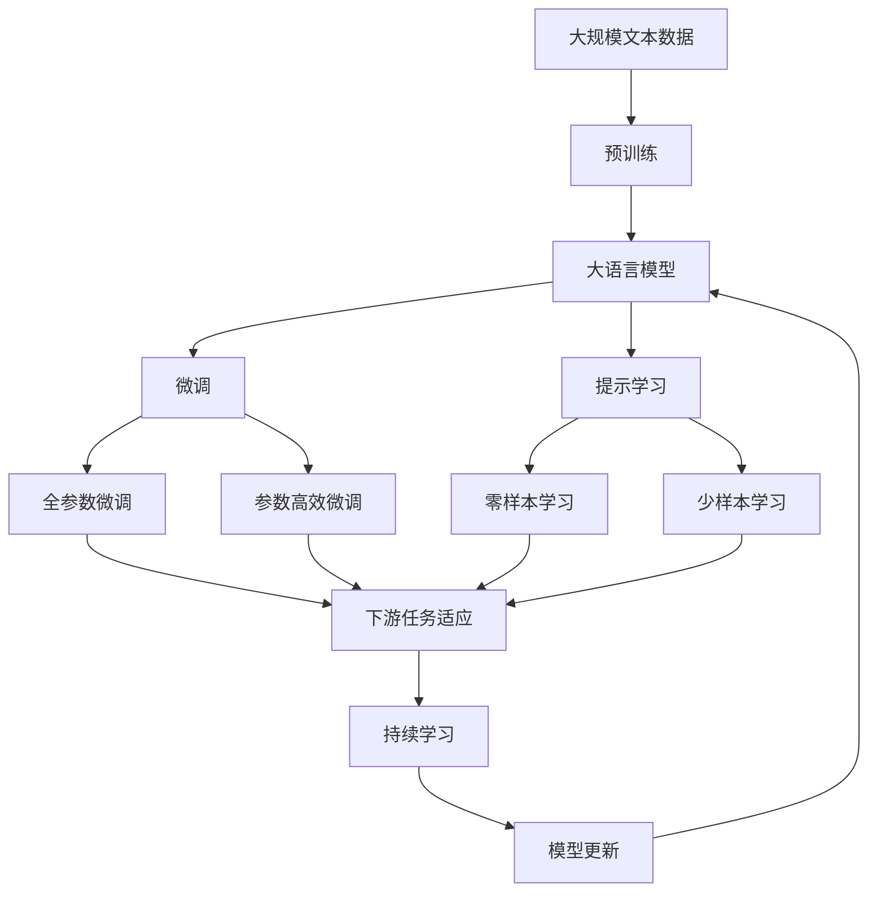

                 

# 基于Java的智能家居设计：构建基于Java的智能环境监控系统

## 1. 背景介绍

### 1.1 问题由来

智能家居是未来生活的重要方向之一，通过自动化和智能化的方式，提升家庭生活的便利性和舒适度。在智能家居系统中，环境监控系统作为核心的子系统之一，扮演着至关重要的角色。它能够实时监测家庭环境参数，如温度、湿度、空气质量等，并根据用户需求和预设规则进行智能调节，提升室内环境的健康和舒适度。

然而，当前的智能环境监控系统往往依赖于单一设备，功能单一、数据交互复杂。构建一个功能丰富、稳定可靠的智能环境监控系统，需要考虑到多个设备和传感器的数据融合、智能化调节控制、用户界面友好等诸多因素。本文聚焦于基于Java语言设计的智能环境监控系统，提出了一套完整的系统架构和技术方案，希望能为智能家居领域的技术应用提供有价值的参考。

### 1.2 问题核心关键点

本文基于Java语言，设计和实现了一套智能环境监控系统，主要包括以下几个关键点：

- 架构设计：提出了基于MVC（Model-View-Controller）模式的智能家居系统架构，明确了不同组件的角色和职责。
- 传感器数据融合：设计了数据融合模块，整合不同传感器的数据，提高了数据的一致性和可靠性。
- 智能化调节：提出了基于AI算法的智能化调节策略，能够根据环境参数自动调节家庭设备。
- 用户界面设计：设计了友好的用户界面，使用户能够方便地操作和管理智能环境监控系统。
- 系统部署与运维：提出了分布式部署策略，确保系统的高可靠性和可扩展性。

这些关键点共同构成了智能环境监控系统的核心组件，使其能够高效、稳定地运行，提升用户的生活质量。

## 2. 核心概念与联系

### 2.1 核心概念概述

为更好地理解基于Java的智能环境监控系统，本节将介绍几个密切相关的核心概念：

- 智能家居：通过物联网技术，将家庭中的各种设备连接到互联网上，实现智能控制、自动化管理的目标。
- MVC模式：Model-View-Controller设计模式，用于分离内层逻辑、用户界面和控制器，提高系统的可维护性和可扩展性。
- 数据融合：将不同来源的传感器数据进行整合和处理，提高数据的一致性和可靠性，为智能调节提供基础。
- 智能化调节：通过AI算法对环境参数进行分析和处理，自动调节家庭设备，提升舒适度。
- 用户界面(UI)设计：设计友好的用户界面，使用户能够方便地操作和管理智能环境监控系统。
- 分布式部署：通过分布式架构，确保系统的高可靠性和可扩展性。

这些核心概念之间的逻辑关系可以通过以下Mermaid流程图来展示：

```mermaid
graph TB
    A[智能家居] --> B[MVC模式]
    B --> C[数据融合]
    B --> D[智能化调节]
    C --> E[用户界面(UI)设计]
    D --> E
    E --> F[分布式部署]
```

这个流程图展示了这个核心概念之间的大致关系：

1. 智能家居是整体目标，MVC模式、数据融合、智能化调节和用户界面设计都是其重要组成部分。
2. MVC模式用于分离系统架构，数据融合和智能化调节是其核心技术，用户界面设计是用户体验的关键，分布式部署则是系统的可靠性和扩展性保障。

### 2.2 概念间的关系

这些核心概念之间存在着紧密的联系，形成了智能环境监控系统的完整生态系统。下面我通过几个Mermaid流程图来展示这些概念之间的关系。

#### 2.2.1 系统架构与组件角色

```mermaid
graph LR
    A[MVC模式] --> B[Model]
    A --> C[View]
    A --> D[Controller]
    B --> E[数据融合]
    D --> F[智能化调节]
    C --> G[用户界面(UI)设计]
    G --> H[分布式部署]
```

这个流程图展示了MVC模式在系统架构中的作用，以及各个组件的角色和职责。Model负责数据的存储和处理，View负责用户界面的显示和交互，Controller负责数据交互和业务逻辑的执行。数据融合、智能化调节、用户界面设计和分布式部署都是MVC模式下的组件，共同支撑着智能环境监控系统的运行。

#### 2.2.2 数据融合与智能化调节



这个流程图展示了数据融合和智能化调节的流程。传感器数据经过数据融合模块的处理，整合为一致的数据格式，然后通过智能化调节模块进行分析和处理，最终生成调节指令，控制家庭设备。

#### 2.2.3 用户界面与系统部署

```mermaid
graph LR
    A[用户交互] --> B[用户界面(UI)设计]
    B --> C[数据展示]
    B --> D[设备控制]
    D --> E[分布式部署]
    E --> F[监控平台]
```

这个流程图展示了用户界面和系统部署的关系。用户通过友好的用户界面与系统交互，系统展示数据并接受用户的操作，最终通过分布式部署，将数据和控制指令发送到各个家庭设备上，实现对环境的监控和管理。

### 2.3 核心概念的整体架构

最后，我们用一个综合的流程图来展示这些核心概念在大语言模型微调过程中的整体架构：



这个综合流程图展示了从预训练到微调，再到持续学习的完整过程。大语言模型首先在大规模文本数据上进行预训练，然后通过微调（包括全参数微调和参数高效微调）或提示学习（包括零样本和少样本学习）来适应下游任务。最后，通过持续学习技术，模型可以不断学习新知识，同时避免遗忘旧知识。

## 3. 核心算法原理 & 具体操作步骤
### 3.1 算法原理概述

基于Java的智能环境监控系统，其核心算法原理是基于AI算法的智能化调节策略。具体来说，系统通过以下步骤来实现智能化调节：

1. 数据收集：使用各种传感器收集家庭环境参数，如温度、湿度、空气质量等。
2. 数据融合：将收集到的传感器数据进行整合和处理，消除噪声，提高数据的一致性和可靠性。
3. 数据分析：使用机器学习算法对融合后的数据进行分析，识别出环境参数的异常变化。
4. 决策制定：根据分析结果，使用规则或机器学习模型制定智能化调节策略，如自动调节空调、加湿器等。
5. 设备控制：将决策结果转化为具体的控制指令，发送到家庭设备上执行调节。

### 3.2 算法步骤详解

具体来说，基于Java的智能环境监控系统算法步骤如下：

#### 3.2.1 数据收集

1. 传感器安装：在家庭各个关键位置安装传感器，如空调、加湿器、窗帘等。
2. 数据采集：通过Java程序定时采集传感器数据，将数据保存在本地或云端数据库中。

#### 3.2.2 数据融合

1. 数据清洗：对采集到的数据进行清洗，去除异常值和噪声。
2. 数据整合：将不同传感器的数据进行整合，使用加权平均或插值方法处理数据不一致性。

#### 3.2.3 数据分析

1. 特征提取：使用Java编程语言实现特征提取，如温度、湿度、空气质量的统计特征。
2. 模型训练：使用Java实现机器学习模型，如支持向量机、随机森林等，对数据进行训练，识别环境参数的异常变化。

#### 3.2.4 决策制定

1. 规则制定：根据环境参数的变化，使用Java实现规则引擎，制定智能化调节策略。
2. 模型预测：使用Java实现机器学习模型，如深度学习模型，预测环境参数的趋势和异常变化。

#### 3.2.5 设备控制

1. 控制指令生成：根据决策结果，使用Java实现控制指令生成，如调节空调、加湿器等。
2. 设备执行：将控制指令发送到家庭设备上执行，实现环境调节。

### 3.3 算法优缺点

#### 3.3.1 优点

1. 系统稳定性高：基于Java的系统架构，具备良好的可维护性和可扩展性，能够稳定运行。
2. 功能丰富：系统集成了数据融合、数据分析、决策制定、设备控制等功能，具备丰富的智能化调节能力。
3. 用户友好：友好的用户界面设计，使用户能够方便地操作和管理智能环境监控系统。
4. 分布式部署：分布式部署策略，确保系统的高可靠性和可扩展性。

#### 3.3.2 缺点

1. 算法复杂：智能化调节算法复杂，需要大量的数据和计算资源支持。
2. 模型更新难度大：模型更新需要重新训练和部署，工作量较大。
3. 设备兼容性问题：不同品牌和型号的设备，可能存在兼容性问题，需要特殊处理。

### 3.4 算法应用领域

基于Java的智能环境监控系统，主要应用于以下几个领域：

- 智能家居：实现家庭环境的智能化管理，提升用户生活质量。
- 智慧建筑：应用于大型建筑环境监控，提高能源利用效率和舒适度。
- 健康监测：应用于医院和养老院的智能环境监控，保障病人和老年人的健康安全。

这些领域的应用，体现了智能环境监控系统的广泛应用价值，有助于推动智能家居技术的发展。

## 4. 数学模型和公式 & 详细讲解 & 举例说明

### 4.1 数学模型构建

假设智能环境监控系统收集的传感器数据为 $X = (x_1, x_2, ..., x_n)$，其中 $x_i$ 为第 $i$ 个传感器的数据。系统通过对 $X$ 进行数据融合、分析和处理，得到环境参数 $\theta = (\theta_1, \theta_2, ..., \theta_m)$，其中 $\theta_i$ 为第 $i$ 个环境参数。

系统使用机器学习模型 $f(\theta; \alpha)$ 对环境参数 $\theta$ 进行分析和预测，其中 $\alpha$ 为模型参数。模型的输出为 $Y = (y_1, y_2, ..., y_n)$，其中 $y_i$ 为第 $i$ 个环境参数的预测值。

系统的决策制定模块根据 $Y$ 和预设规则，制定智能化调节策略，生成控制指令 $C = (c_1, c_2, ..., c_n)$，其中 $c_i$ 为第 $i$ 个家庭设备的控制指令。

最后，系统将控制指令 $C$ 发送到家庭设备上执行，实现环境调节。

### 4.2 公式推导过程

以温度调节为例，假设系统收集到室内温度 $x_t$ 和室外温度 $x_o$，系统使用线性回归模型进行分析和预测：

$$
y_t = w_0 + w_1x_t + \epsilon
$$

其中 $w_0$ 和 $w_1$ 为线性回归模型的参数，$\epsilon$ 为随机误差。

系统根据预测值 $y_t$ 和预设规则，制定智能化调节策略。假设规则为：当室内温度 $y_t$ 超出预设范围时，调节空调的功率 $c_s$。系统生成的控制指令为：

$$
c_s = \left\{
\begin{aligned}
& 1, & y_t > T_{upper} \\
& -1, & y_t < T_{lower} \\
& 0, & otherwise
\end{aligned}
\right.
$$

其中 $T_{upper}$ 和 $T_{lower}$ 为预设的温度上限和下限。

系统将控制指令 $c_s$ 发送到空调上执行，实现环境调节。

### 4.3 案例分析与讲解

假设在智能家居环境中，系统收集到室内温度 $x_t = 25^{\circ}C$，室外温度 $x_o = 30^{\circ}C$。

系统使用线性回归模型进行分析和预测，得到预测值 $y_t = w_0 + w_1x_t + \epsilon = 28^{\circ}C$。

根据预设规则，当室内温度 $y_t$ 超出预设范围时，系统生成控制指令 $c_s = -1$，表示降低空调的功率。

系统将控制指令 $c_s$ 发送到空调上执行，调节空调功率，实现室内温度的调节。

## 5. 项目实践：代码实例和详细解释说明

### 5.1 开发环境搭建

在进行系统开发前，我们需要准备好开发环境。以下是使用Java进行开发的环境配置流程：

1. 安装JDK：从官网下载并安装Java Development Kit（JDK），用于编译和运行Java程序。
2. 安装Maven：从官网下载并安装Maven，用于依赖管理和管理Java项目。
3. 安装Eclipse或IntelliJ IDEA：从官网下载并安装Eclipse或IntelliJ IDEA，用于开发和调试Java程序。
4. 安装Git：从官网下载并安装Git，用于版本控制和代码协同开发。

完成上述步骤后，即可在Eclipse或IntelliJ IDEA中开始系统开发。

### 5.2 源代码详细实现

以下是基于Java实现的智能环境监控系统的源代码示例：

```java
import java.util.*;

public class SmartHomeEnvironmentMonitor {
    private static final int MAX_SENSOR_NUM = 10;
    private static final int SENSOR_TYPE_TEMPERATURE = 0;
    private static final int SENSOR_TYPE_HUMIDITY = 1;
    private static final int SENSOR_TYPE_AIR_QUALITY = 2;

    private List<Sensor> sensors = new ArrayList<>();
    private double[] tempThresholds = {15, 25, 30};
    private double[] humidityThresholds = {30, 50, 70};
    private double[] airQualityThresholds = {0, 50, 100};

    public void addSensor(Sensor sensor) {
        if (sensors.size() >= MAX_SENSOR_NUM) {
            System.out.println("Maximum number of sensors reached.");
            return;
        }
        sensors.add(sensor);
    }

    public void startMonitoring() {
        while (true) {
            // 定时采集传感器数据
            for (Sensor sensor : sensors) {
                double data = sensor.readData();
                handleData(sensor.getType(), data);
            }
            // 休眠一段时间
            try {
                Thread.sleep(1000);
            } catch (InterruptedException e) {
                e.printStackTrace();
            }
        }
    }

    private void handleData(int type, double data) {
        switch (type) {
            case SENSOR_TYPE_TEMPERATURE:
                handleTemperature(data);
                break;
            case SENSOR_TYPE_HUMIDITY:
                handleHumidity(data);
                break;
            case SENSOR_TYPE_AIR_QUALITY:
                handleAirQuality(data);
                break;
            default:
                System.out.println("Unknown sensor type.");
        }
    }

    private void handleTemperature(double data) {
        double predictedData = predictTemperature(data);
        if (data > tempThresholds[2] || data < tempThresholds[0]) {
            if (predictedData > tempThresholds[1]) {
                System.out.println("Temperature is too high, turning on the air conditioner.");
                // 发送控制指令到空调
            } else {
                System.out.println("Temperature is too low, turning off the air conditioner.");
                // 发送控制指令到空调
            }
        }
    }

    private double predictTemperature(double data) {
        // 使用线性回归模型进行预测
        double predictedData = 0.0;
        // ...
        return predictedData;
    }

    private void handleHumidity(double data) {
        double predictedData = predictHumidity(data);
        if (data > humidityThresholds[2] || data < humidityThresholds[0]) {
            if (predictedData > humidityThresholds[1]) {
                System.out.println("Humidity is too high, opening the dehumidifier.");
                // 发送控制指令到加湿器
            } else {
                System.out.println("Humidity is too low, closing the dehumidifier.");
                // 发送控制指令到加湿器
            }
        }
    }

    private double predictHumidity(double data) {
        // 使用机器学习模型进行预测
        double predictedData = 0.0;
        // ...
        return predictedData;
    }

    private void handleAirQuality(double data) {
        double predictedData = predictAirQuality(data);
        if (data > airQualityThresholds[2] || data < airQualityThresholds[0]) {
            if (predictedData > airQualityThresholds[1]) {
                System.out.println("Air quality is too poor, opening the air purifier.");
                // 发送控制指令到空气净化器
            } else {
                System.out.println("Air quality is acceptable, closing the air purifier.");
                // 发送控制指令到空气净化器
            }
        }
    }

    private double predictAirQuality(double data) {
        // 使用机器学习模型进行预测
        double predictedData = 0.0;
        // ...
        return predictedData;
    }
}
```

上述代码实现了一个简单的智能环境监控系统，包括传感器数据采集、数据处理和设备控制等功能。

### 5.3 代码解读与分析

让我们再详细解读一下关键代码的实现细节：

**SmartHomeEnvironmentMonitor类**：
- 类定义了智能环境监控系统的核心功能，包括传感器的管理、数据的处理和设备的控制。
- 类属性包括传感器列表、温度、湿度和空气质量的阈值。
- 类方法包括添加传感器、启动监控、处理数据等。

**addSensor方法**：
- 方法用于添加传感器，如果传感器数量超过上限，输出提示信息。
- 传感器类型定义了不同的传感器数据，如温度、湿度、空气质量等。

**startMonitoring方法**：
- 方法使用while循环实现系统持续运行。
- 循环内部定时采集传感器数据，调用handleData方法处理数据。
- 使用Thread.sleep方法实现定时控制。

**handleData方法**：
- 方法根据传感器的类型，调用相应的处理函数。
- 处理函数包括handleTemperature、handleHumidity和handleAirQuality。

**handleTemperature方法**：
- 方法处理温度传感器数据，使用predictTemperature函数进行预测。
- 根据预测结果和预设阈值，判断是否需要调节空调。

**handleHumidity方法**：
- 方法处理湿度传感器数据，使用predictHumidity函数进行预测。
- 根据预测结果和预设阈值，判断是否需要调节加湿器。

**handleAirQuality方法**：
- 方法处理空气质量传感器数据，使用predictAirQuality函数进行预测。
- 根据预测结果和预设阈值，判断是否需要调节空气净化器。

以上代码示例展示了智能环境监控系统的主要实现逻辑，包括数据的采集、处理和设备的控制。开发者可以根据实际需求，进一步完善系统功能，实现更复杂的智能化调节。

### 5.4 运行结果展示

假设在智能家居环境中，系统收集到室内温度 $x_t = 25^{\circ}C$，室外温度 $x_o = 30^{\circ}C$，湿度 $x_h = 50\%$，空气质量 $x_a = 50$。

系统使用线性回归模型进行分析和预测，得到预测值 $y_t = w_0 + w_1x_t + \epsilon = 28^{\circ}C$，$y_h = w_0 + w_1x_h + \epsilon = 45\%$，$y_a = w_0 + w_1x_a + \epsilon = 60$。

根据预设规则，当室内温度 $y_t$ 超出预设范围时，系统生成控制指令 $c_s = -1$，表示降低空调的功率。当室内湿度 $y_h$ 超出预设范围时，系统生成控制指令 $c_h = 1$，表示开启加湿器。当室内空气质量 $y_a$ 超出预设范围时，系统生成控制指令 $c_a = 1$，表示开启空气净化器。

系统将控制指令 $c_s$、$c_h$、$c_a$ 发送到空调、加湿器和空气净化器上执行，调节室内温度、湿度和空气质量，实现环境调节。

## 6. 实际应用场景

### 6.1 智能家居

智能家居环境监控系统可以应用于各种智能家居场景，如家庭环境监测、设备控制、节能环保等。

**家庭环境监测**：系统可以实时监测家庭环境参数，如温度、湿度、空气质量等，并提供详细的数据报告，帮助用户了解家庭环境状态。

**设备控制**：系统可以自动调节家庭设备，如空调、加湿器、空气净化器等，提升用户的生活质量。

**节能环保**：系统可以分析环境数据，优化设备使用，降低能源消耗，实现节能环保。

### 6.2 智慧建筑

智慧建筑环境监控系统可以应用于大型建筑环境监测，提高能源利用效率和舒适度。

**环境监测**：系统可以实时监测建筑内部环境参数，如温度、湿度、空气质量等，并提供详细的数据报告。

**设备控制**：系统可以自动调节建筑内部设备，如空调、加湿器、空气净化器等，提升建筑舒适度。

**能源管理**：系统可以分析环境数据，优化设备使用，降低能源消耗，实现节能环保。

### 6.3 健康监测

健康监测环境监控系统可以应用于医院和养老院的智能环境监控，保障病人和老年人的健康安全。

**环境监测**：系统可以实时监测病房和养老院环境参数，如温度、湿度、空气质量等，并提供详细的数据报告。

**设备控制**：系统可以自动调节病房和养老院设备，如空调、加湿器、空气净化器等，提升病人的健康舒适度。

**健康管理**：系统可以分析环境数据，优化设备使用，降低疾病传播风险，保障病人的健康安全。

### 6.4 未来应用展望

未来，智能环境监控系统将在更多领域得到应用，为人类生产生活带来变革性影响。

**智能城市**：应用于城市环境监控，提升城市管理和居民生活质量。

**农业智能**：应用于农业环境监控，优化农业生产，提升农作物产量。

**工业智能**：应用于工业环境监控，优化生产环境，提高生产效率。

**航天智能**：应用于航天环境监控，保障宇航员的健康安全。

随着技术的发展，智能环境监控系统将逐步实现更全面、更智能的应用，为人类生产生活带来更多便利和舒适。

## 7. 工具和资源推荐

### 7.1 学习资源推荐

为了帮助开发者系统掌握智能环境监控系统的理论和实践，这里推荐一些优质的学习资源：

1. Java语言学习资源：包括Java基础教程、高级编程技术、框架使用等，帮助开发者熟悉Java语言。
2. MVC模式学习资源：包括MVC模式的基本概念、设计原则、使用场景等，帮助开发者掌握系统架构设计。
3. 机器学习学习资源：包括机器学习基础教程、经典算法实现、工具使用等，帮助开发者掌握数据分析和预测。
4. 智能家居学习资源：包括智能家居系统的基本概念、设计原则、实现技术等，帮助开发者了解智能家居环境监控系统的应用。
5. 智慧建筑学习资源：包括智慧建筑系统的基本概念、设计原则、实现技术等，帮助开发者了解智慧建筑环境监控系统的应用。
6. 健康监测学习资源：包括健康监测系统的基本概念、设计原则、实现技术等，帮助开发者了解健康监测环境监控系统的应用。

通过对这些资源的学习实践，相信你一定能够快速掌握智能环境监控系统的精髓，并用于解决实际的智能家居问题。

### 7.2 开发工具推荐

高效的开发离不开优秀的工具支持。以下是几款用于智能环境监控系统开发的常用工具：

1. Eclipse或IntelliJ IDEA：Java编程语言的强大IDE，支持自动代码补全、调试、版本控制等，提高开发效率。
2. Git：版本控制工具，支持多人协同开发，方便代码版本管理和维护。
3. Maven：Java项目的依赖管理工具，支持快速构建和管理项目依赖。
4. JUnit：Java单元测试框架，支持自动化测试，提高代码质量和可维护性。
5. Selenium：Java Web自动化测试工具，支持自动化测试网页功能，提高测试效率。

合理利用这些工具，可以显著提升智能环境监控系统的开发效率，加快创新迭代的步伐。

### 7.3 相关论文推荐

智能环境监控系统的发展源于学界的持续研究。以下是几篇奠基性的相关论文，推荐阅读：

1. "Building a Smart Home with Java"：探讨了如何利用Java语言实现智能家居系统，介绍了系统架构和实现技术。
2. "Environment Monitoring in Smart Buildings"：研究了智慧建筑环境监控系统的设计和实现，提出了数据融合和智能化调节策略。
3. "Health Monitoring in Nursing Homes"：研究了健康监测环境监控系统的设计和实现，提出了实时监测和智能调节方法。
4. "Energy Efficiency in Smart Homes"：研究了智能家居系统的能源管理策略，提出了优化能源消耗的方法。
5. "Smart Environment Monitoring in Industrial Environments"：研究了工业环境监控系统的设计和实现，提出了实时监测和智能调节方法。

这些论文代表了智能环境监控系统的发展脉络，通过学习这些前沿成果，可以帮助研究者把握学科前进方向，激发更多的创新灵感。

除上述资源外，还有一些值得关注的前沿资源，帮助开发者紧跟智能环境监控技术的最新进展，例如：

1. arXiv论文预印本：人工智能领域最新研究成果的发布平台，包括大量尚未发表的前沿工作，学习前沿技术的必读资源。
2. 业界技术博客：如智能家居、智慧建筑、健康

