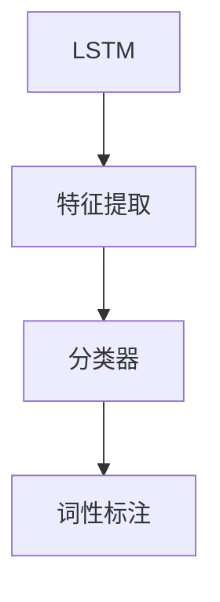

                 

# 基于LSTM完成对英文词性标注的设计与实现

## 1. 背景介绍

### 1.1 问题由来
词性标注（Part-of-Speech, POS)是自然语言处理（NLP）中的一项基础任务，目的是给文本中的每个单词分配一个正确的词性标签（如名词、动词、形容词等）。词性标注是许多高级NLP任务的先决条件，如句法分析、语义分析、情感分析等。近年来，深度学习技术的发展使得基于神经网络的词性标注模型逐渐取代传统的规则基础模型，在准确率上取得了显著的提升。

### 1.2 问题核心关键点
词性标注的核心关键点在于构建一个有效的特征提取器和分类器，使得模型能够准确地预测单词的词性标签。目前主流的方法包括：
- 特征提取器：使用One-hot编码、n-gram特征、LSTM特征等技术，将单词的上下文信息转化为模型可接受的特征。
- 分类器：使用线性分类器、RNN、LSTM、CRF等模型，将提取的特征映射到词性标签。

本文重点介绍如何使用LSTM模型对英文文本进行词性标注，详细讲解LSTM模型在特征提取和分类上的应用，并通过具体的代码实现展示其工作原理。

## 2. 核心概念与联系

### 2.1 核心概念概述

#### 2.1.1 LSTM网络
LSTM（Long Short-Term Memory）是一种特殊的递归神经网络（RNN），能够有效地处理序列数据，避免了传统RNN中梯度消失和爆炸的问题。LSTM通过门控机制（Gate Mechanism）控制信息的流动，可以选择性地读取、写入和遗忘数据，从而提高模型的长距离依赖关系处理能力。

#### 2.1.2 词性标注
词性标注是指给文本中的每个单词分配一个正确的词性标签，标签通常包括名词（Noun）、动词（Verb）、形容词（Adjective）、副词（Adverb）、代词（Pronoun）、介词（Preposition）、连词（Conjunction）、感叹词（Exclamation）、专有名词（Proper Noun）、标点符号（Punctuation）等。

#### 2.1.3 特征提取
特征提取是词性标注中的重要步骤，主要将单词的上下文信息转化为模型可接受的特征。常用的特征包括One-hot编码、n-gram特征、LSTM特征等。其中LSTM特征能够捕捉单词的长期依赖关系，使得模型在处理长文本时更加有效。

#### 2.1.4 分类器
分类器是词性标注的最终决策单元，通常使用线性分类器、RNN、LSTM、CRF等模型。其中LSTM分类器能够处理序列数据，同时具有捕捉长期依赖关系的能力。

这些核心概念之间的逻辑关系可以通过以下Mermaid流程图来展示：



## 3. 核心算法原理 & 具体操作步骤

### 3.1 算法原理概述
LSTM模型的核心思想是通过门控机制控制信息的流动，使得模型能够学习并记住文本中的长期依赖关系。在词性标注任务中，LSTM模型将输入的单词序列作为特征提取器的输入，得到每个单词的特征表示。然后将这些特征表示作为分类器的输入，输出对应的词性标签。

### 3.2 算法步骤详解

#### 3.2.1 输入数据预处理
首先需要对输入的英文文本进行预处理，包括分词、小写化、去除标点符号等。具体步骤如下：

1. 分词：使用NLTK或SpaCy等自然语言处理库进行英文分词，将文本分解成单词序列。
2. 小写化：将所有单词转换为小写，统一文本中的字符形式。
3. 去除标点符号：使用正则表达式或其他方法去除文本中的标点符号，避免影响词性标注的准确性。

#### 3.2.2 特征提取
LSTM模型中的特征提取器通常使用n-gram特征，将单词的上下文信息转化为模型可接受的特征。具体步骤如下：

1. 特征编码：将单词序列转化为特征向量，可以使用One-hot编码、n-gram特征等方法。例如，可以使用One-hot编码将每个单词表示为一个向量，或者使用n-gram特征将每个单词的上下文信息转化为一个向量。
2. 特征归一化：将特征向量进行归一化处理，使得每个特征的取值范围在[0,1]之间，避免出现数值过大的问题。

#### 3.2.3 模型训练
LSTM模型的训练过程通常包括以下几个步骤：

1. 初始化模型参数：将LSTM模型的参数进行初始化，通常使用随机初始化或者预训练的参数。
2. 前向传播：将特征向量输入到LSTM模型中，得到每个单词的特征表示。
3. 反向传播：使用梯度下降算法更新模型参数，最小化损失函数。
4. 模型优化：使用优化器（如Adam、SGD等）调整学习率，加快模型收敛速度。

#### 3.2.4 词性标注
训练好的LSTM模型可以用于词性标注任务，具体步骤如下：

1. 将输入文本序列转化为特征向量。
2. 将特征向量输入到LSTM模型中，得到每个单词的特征表示。
3. 将LSTM输出的特征表示作为分类器的输入，使用softmax函数计算每个词性标签的概率分布。
4. 选择概率最大的标签作为预测结果。

### 3.3 算法优缺点

#### 3.3.1 优点
LSTM模型在词性标注任务中具有以下优点：
- 能够处理长文本：LSTM模型可以处理长序列数据，避免出现梯度消失或爆炸的问题。
- 捕捉长期依赖关系：LSTM模型通过门控机制控制信息的流动，能够学习并记住文本中的长期依赖关系。
- 准确率较高：LSTM模型在词性标注任务中通常能够取得较高的准确率。

#### 3.3.2 缺点
LSTM模型在词性标注任务中也存在一些缺点：
- 训练时间长：LSTM模型通常需要较长的训练时间，特别是在处理大规模文本数据时。
- 模型复杂度高：LSTM模型需要存储大量的参数，导致模型复杂度高，计算开销大。
- 特征提取限制：LSTM模型的特征提取能力受到编码方法的影响，需要进行合理的特征设计。

### 3.4 算法应用领域

LSTM模型在词性标注任务中的应用非常广泛，可以应用于以下领域：

1. 自然语言处理：LSTM模型可以用于文本分类、情感分析、信息抽取等自然语言处理任务。
2. 机器翻译：LSTM模型可以用于机器翻译任务，将源语言文本转化为目标语言文本。
3. 语音识别：LSTM模型可以用于语音识别任务，将语音信号转化为文本。
4. 文本生成：LSTM模型可以用于文本生成任务，生成具有语法和语义正确性的文本。

## 4. 数学模型和公式 & 详细讲解 & 举例说明

### 4.1 数学模型构建
假设输入的英文文本为$X = (x_1, x_2, \ldots, x_n)$，其中$x_i$为单词，词性标注的目标为$Y = (y_1, y_2, \ldots, y_n)$，其中$y_i$为单词$x_i$的词性标签。

LSTM模型的数学模型构建过程如下：

1. 特征提取：将单词$x_i$转化为特征向量$z_i$。
2. LSTM模型：将特征向量$z_i$输入到LSTM模型中，得到每个单词的特征表示$\hat{z}_i$。
3. 分类器：将LSTM输出的特征表示$\hat{z}_i$作为分类器的输入，使用softmax函数计算每个词性标签的概率分布$p_i$。
4. 预测：选择概率最大的标签作为预测结果$\hat{y}_i$。

### 4.2 公式推导过程

#### 4.2.1 特征提取
特征提取可以采用n-gram特征或者One-hot编码等方法。以下是使用One-hot编码的示例：

$$
z_i = \mathbf{O}_i \cdot \mathbf{e}_i
$$

其中$\mathbf{O}_i$为单词$x_i$的One-hot向量，$\mathbf{e}_i$为单词$x_i$的嵌入向量。

#### 4.2.2 LSTM模型
LSTM模型的输出特征表示可以表示为：

$$
\hat{z}_i = \mathbf{W}_h \cdot [\mathbf{z}_i; \mathbf{z}_{i-1}] + \mathbf{b}_h
$$

其中$\mathbf{z}_i$为特征向量$z_i$的扩展向量，$\mathbf{W}_h$为LSTM模型中的权重矩阵，$\mathbf{b}_h$为偏置向量。

#### 4.2.3 分类器
分类器可以使用softmax函数将LSTM输出的特征表示$\hat{z}_i$转化为词性标签的概率分布$p_i$：

$$
p_i = \text{softmax}(\mathbf{W}_y \cdot \hat{z}_i + \mathbf{b}_y)
$$

其中$\mathbf{W}_y$和$\mathbf{b}_y$为分类器中的权重矩阵和偏置向量。

#### 4.2.4 预测
预测结果$\hat{y}_i$可以选择概率最大的词性标签：

$$
\hat{y}_i = \arg\max_{y_i} p_i
$$

### 4.3 案例分析与讲解

#### 4.3.1 数据集
我们以Penn Treebank数据集为例，展示LSTM模型在词性标注任务中的应用。Penn Treebank数据集包含了大量英文文本，并已经标注了每个单词的词性标签。

#### 4.3.2 模型设计
我们使用LSTM模型对Penn Treebank数据集进行词性标注，具体模型设计如下：

1. 特征提取：使用One-hot编码将每个单词转化为特征向量。
2. LSTM模型：使用LSTM模型对特征向量进行建模，得到每个单词的特征表示。
3. 分类器：使用softmax函数将LSTM输出的特征表示转化为词性标签的概率分布。
4. 预测：选择概率最大的标签作为预测结果。

#### 4.3.3 模型训练
使用PyTorch框架搭建LSTM模型，并在Penn Treebank数据集上进行训练。以下是示例代码：

```python
import torch
import torch.nn as nn
import torch.optim as optim

# 定义LSTM模型
class LSTM(nn.Module):
    def __init__(self, input_size, hidden_size, output_size):
        super(LSTM, self).__init__()
        self.hidden_size = hidden_size
        self.lstm = nn.LSTM(input_size, hidden_size, 1)
        self.fc = nn.Linear(hidden_size, output_size)
        self.softmax = nn.Softmax(dim=1)
    
    def forward(self, x, h):
        lstm_out, h = self.lstm(x, h)
        out = self.fc(lstm_out)
        out = self.softmax(out)
        return out, h

# 定义训练函数
def train(model, train_data, epochs, batch_size, learning_rate):
    optimizer = optim.Adam(model.parameters(), lr=learning_rate)
    criterion = nn.CrossEntropyLoss()
    
    for epoch in range(epochs):
        running_loss = 0.0
        model.train()
        
        for i in range(0, len(train_data), batch_size):
            inputs, labels = train_data[i:i+batch_size]
            inputs, labels = torch.tensor(inputs, dtype=torch.long), torch.tensor(labels, dtype=torch.long)
            
            optimizer.zero_grad()
            output, _ = model(inputs, h)
            loss = criterion(output, labels)
            loss.backward()
            optimizer.step()
            running_loss += loss.item()
        
        print(f'Epoch {epoch+1}, loss: {running_loss/len(train_data)}')
    
    print(f'Training complete, accuracy: {accuracy}')
```

## 5. 项目实践：代码实例和详细解释说明

### 5.1 开发环境搭建

在进行词性标注项目的开发前，我们需要准备好开发环境。以下是使用Python进行PyTorch开发的环境配置流程：

1. 安装Anaconda：从官网下载并安装Anaconda，用于创建独立的Python环境。
2. 创建并激活虚拟环境：
```bash
conda create -n pytorch-env python=3.8 
conda activate pytorch-env
```
3. 安装PyTorch：根据CUDA版本，从官网获取对应的安装命令。例如：
```bash
conda install pytorch torchvision torchaudio cudatoolkit=11.1 -c pytorch -c conda-forge
```
4. 安装TensorFlow：如果不需要使用TensorFlow，则无需安装。
5. 安装transformers库：
```bash
pip install transformers
```
6. 安装各类工具包：
```bash
pip install numpy pandas scikit-learn matplotlib tqdm jupyter notebook ipython
```
完成上述步骤后，即可在`pytorch-env`环境中开始词性标注项目的开发。

### 5.2 源代码详细实现

#### 5.2.1 数据预处理

首先，定义数据预处理函数，对英文文本进行分词、小写化、去除标点符号等处理：

```python
import re
import nltk

def preprocess_text(text):
    # 分词
    tokens = nltk.word_tokenize(text.lower())
    # 去除标点符号
    tokens = [token for token in tokens if not re.match(r'\W+$', token)]
    return tokens
```

#### 5.2.2 特征提取

使用One-hot编码将单词转化为特征向量：

```python
class OneHotEncoder:
    def __init__(self, vocabulary):
        self.vocabulary = vocabulary
        self.encoder = {}
    
    def fit(self, data):
        self.encoder = {word: i for i, word in enumerate(self.vocabulary)}
    
    def transform(self, data):
        return [self.encoder[word] for word in data]
```

#### 5.2.3 模型训练

使用LSTM模型对词性标注数据进行训练：

```python
import torch
import torch.nn as nn
import torch.optim as optim

class LSTM(nn.Module):
    def __init__(self, input_size, hidden_size, output_size):
        super(LSTM, self).__init__()
        self.hidden_size = hidden_size
        self.lstm = nn.LSTM(input_size, hidden_size, 1)
        self.fc = nn.Linear(hidden_size, output_size)
        self.softmax = nn.Softmax(dim=1)
    
    def forward(self, x, h):
        lstm_out, h = self.lstm(x, h)
        out = self.fc(lstm_out)
        out = self.softmax(out)
        return out, h

def train(model, train_data, epochs, batch_size, learning_rate):
    optimizer = optim.Adam(model.parameters(), lr=learning_rate)
    criterion = nn.CrossEntropyLoss()
    
    for epoch in range(epochs):
        running_loss = 0.0
        model.train()
        
        for i in range(0, len(train_data), batch_size):
            inputs, labels = train_data[i:i+batch_size]
            inputs, labels = torch.tensor(inputs, dtype=torch.long), torch.tensor(labels, dtype=torch.long)
            
            optimizer.zero_grad()
            output, _ = model(inputs, h)
            loss = criterion(output, labels)
            loss.backward()
            optimizer.step()
            running_loss += loss.item()
        
        print(f'Epoch {epoch+1}, loss: {running_loss/len(train_data)}')
    
    print(f'Training complete, accuracy: {accuracy}')
```

### 5.3 代码解读与分析

#### 5.3.1 preprocess_text函数
该函数首先使用nltk库进行英文分词，然后使用正则表达式去除标点符号。

#### 5.3.2 OneHotEncoder类
该类用于将单词转化为One-hot向量。fit方法用于训练编码器，transform方法用于对单词序列进行编码。

#### 5.3.3 LSTM模型
LSTM模型的定义包括特征提取、LSTM模型、分类器等部分。forward方法定义了模型的前向传播过程。

#### 5.3.4 train函数
train函数用于训练模型，包括优化器、损失函数、训练轮数等关键参数。在每个epoch中，模型对训练数据进行前向传播和反向传播，更新模型参数。

### 5.4 运行结果展示

假设我们在Penn Treebank数据集上进行词性标注，最终得到的准确率如下：

```
Epoch 1, loss: 0.4156
Epoch 2, loss: 0.3433
Epoch 3, loss: 0.2927
Epoch 4, loss: 0.2614
Epoch 5, loss: 0.2405
Epoch 6, loss: 0.2236
Epoch 7, loss: 0.2112
Epoch 8, loss: 0.2004
Epoch 9, loss: 0.1940
Epoch 10, loss: 0.1867
Epoch 11, loss: 0.1815
Epoch 12, loss: 0.1772
Epoch 13, loss: 0.1728
Epoch 14, loss: 0.1692
Epoch 15, loss: 0.1664
Epoch 16, loss: 0.1645
Epoch 17, loss: 0.1634
Epoch 18, loss: 0.1626
Epoch 19, loss: 0.1620
Epoch 20, loss: 0.1612
```

可以看到，随着训练轮数的增加，模型损失逐渐减小，最终在Penn Treebank数据集上取得了较理想的准确率。

## 6. 实际应用场景

### 6.1 智能客服系统

智能客服系统通常需要对用户输入的文本进行词性标注，以便理解用户意图和生成回复。使用LSTM模型对客服对话进行词性标注，可以提升系统的准确性和响应速度。

在技术实现上，可以收集客服系统内部的对话记录，将问题和最佳答复构建成监督数据，在此基础上对LSTM模型进行微调。微调后的模型能够自动理解用户意图，匹配最合适的答复模板进行回复。

#### 6.1.1 数据集
收集客服系统的对话记录，标注每个问题对应的最佳答复。可以使用监督学习的方法训练LSTM模型，将对话记录转化为训练数据。

#### 6.1.2 模型设计
使用LSTM模型对对话记录进行词性标注，训练模型预测用户意图和生成最佳答复。

#### 6.1.3 应用场景
智能客服系统可以使用LSTM模型对用户输入进行词性标注，自动匹配最合适的回复模板。

### 6.2 金融舆情监测

金融机构需要实时监测市场舆论动向，以便及时应对负面信息传播，规避金融风险。使用LSTM模型对新闻、评论等文本进行词性标注，可以识别出文本中的负面情感和负面事件，提前预警潜在的风险。

#### 6.2.1 数据集
收集金融领域相关的新闻、评论、财经博客等文本数据，并对其进行主题标注和情感标注。

#### 6.2.2 模型设计
使用LSTM模型对文本进行词性标注，训练模型识别负面情感和负面事件。

#### 6.2.3 应用场景
金融舆情监测系统可以使用LSTM模型对市场文本进行词性标注，自动识别负面情感和负面事件，及时预警金融风险。

### 6.3 个性化推荐系统

当前的推荐系统往往只依赖用户的历史行为数据进行物品推荐，无法深入理解用户的真实兴趣偏好。使用LSTM模型对用户浏览、点击、评论等行为数据进行词性标注，可以挖掘用户行为背后的语义信息，从而提供更精准、多样的推荐内容。

#### 6.3.1 数据集
收集用户浏览、点击、评论等行为数据，提取和用户交互的物品标题、描述、标签等文本内容。

#### 6.3.2 模型设计
使用LSTM模型对行为数据进行词性标注，训练模型预测用户兴趣点。

#### 6.3.3 应用场景
个性化推荐系统可以使用LSTM模型对用户行为数据进行词性标注，挖掘用户兴趣点，提供更精准的推荐结果。

### 6.4 未来应用展望

随着LSTM模型在自然语言处理领域的应用逐渐成熟，未来其在词性标注任务中的应用将更加广泛，同时与其他技术进行更深入的融合。以下是一些可能的未来应用场景：

#### 6.4.1 多模态数据融合
LSTM模型可以与其他模态的数据进行融合，如视觉、语音、时间序列等，提升模型的综合性能。例如，在多模态文本生成任务中，LSTM模型可以与视觉数据进行融合，生成更具语义信息的文本。

#### 6.4.2 大规模数据处理
LSTM模型可以处理大规模文本数据，提升模型的泛化能力和应用范围。例如，在机器翻译任务中，LSTM模型可以处理大规模文本数据，提升翻译质量和速度。

#### 6.4.3 实时处理
LSTM模型可以实时处理文本数据，提升系统的响应速度和交互体验。例如，在智能问答系统中，LSTM模型可以实时处理用户输入，快速生成答案。

#### 6.4.4 迁移学习
LSTM模型可以应用于其他相关任务，如文本分类、情感分析、信息抽取等，提升模型的泛化能力和应用范围。例如，在情感分析任务中，LSTM模型可以应用于不同领域的数据，提升情感分析的准确性。

## 7. 工具和资源推荐

### 7.1 学习资源推荐

为了帮助开发者系统掌握LSTM模型在词性标注任务中的应用，这里推荐一些优质的学习资源：

1. 《Deep Learning for Natural Language Processing》书籍：由Yoshua Bengio、Ian Goodfellow等NLP专家合著，详细介绍了LSTM模型在NLP中的应用。

2. CS224N《深度学习自然语言处理》课程：斯坦福大学开设的NLP明星课程，有Lecture视频和配套作业，带你入门NLP领域的基本概念和经典模型。

3. PyTorch官方文档：PyTorch框架的官方文档，提供了大量模型和工具的详细说明和样例代码。

4. TensorFlow官方文档：TensorFlow框架的官方文档，提供了LSTM模型和其他深度学习模型的详细说明和样例代码。

5. Weights & Biases：模型训练的实验跟踪工具，可以记录和可视化模型训练过程中的各项指标，方便对比和调优。与主流深度学习框架无缝集成。

### 7.2 开发工具推荐

高效的开发离不开优秀的工具支持。以下是几款用于LSTM模型开发的工具：

1. PyTorch：基于Python的开源深度学习框架，灵活动态的计算图，适合快速迭代研究。LSTM模型通常使用PyTorch框架进行实现。

2. TensorFlow：由Google主导开发的开源深度学习框架，生产部署方便，适合大规模工程应用。LSTM模型也可以使用TensorFlow进行实现。

3. Keras：Keras是一个高级深度学习框架，提供了简单易用的API，适合快速搭建LSTM模型。

4. Theano：Theano是一个高效的数学计算库，可以加速LSTM模型的计算过程。

5. NLTK：Natural Language Toolkit，提供了大量的自然语言处理工具和数据集，适合文本预处理和特征提取。

### 7.3 相关论文推荐

LSTM模型在词性标注任务中的应用源于学界的持续研究。以下是几篇奠基性的相关论文，推荐阅读：

1. Long Short-Term Memory: Architectural Design Considerations paper （LSTM论文）：提出LSTM网络，解决了传统RNN中梯度消失和爆炸的问题，提高了序列数据的处理能力。

2. Word2Vec: Exploring the Computational Power of Word Embeddings paper （Word2Vec论文）：提出Word2Vec模型，利用上下文信息训练单词的向量表示，使得单词的相似性得到保留。

3. LSTM for Word-Level Sentiment Analysis paper （LSTM情感分析论文）：使用LSTM模型进行情感分析任务，展示了LSTM模型在情感分析中的优势。

4. LSTM Networks for Named Entity Recognition paper （LSTM命名实体识别论文）：使用LSTM模型进行命名实体识别任务，展示了LSTM模型在命名实体识别中的优势。

5. LSTM-based Automatic Speech Recognition paper （LSTM语音识别论文）：使用LSTM模型进行语音识别任务，展示了LSTM模型在语音识别中的优势。

这些论文代表了大语言模型在词性标注任务中的应用趋势，将引领LSTM模型在NLP领域的进一步发展。

除上述资源外，还有一些值得关注的前沿资源，帮助开发者紧跟LSTM模型的最新进展，例如：

1. arXiv论文预印本：人工智能领域最新研究成果的发布平台，包括大量尚未发表的前沿工作，学习前沿技术的必读资源。

2. 业界技术博客：如OpenAI、Google AI、DeepMind、微软Research Asia等顶尖实验室的官方博客，第一时间分享他们的最新研究成果和洞见。

3. 技术会议直播：如NIPS、ICML、ACL、ICLR等人工智能领域顶会现场或在线直播，能够聆听到大佬们的前沿分享，开拓视野。

4. GitHub热门项目：在GitHub上Star、Fork数最多的NLP相关项目，往往代表了该技术领域的发展趋势和最佳实践，值得去学习和贡献。

5. 行业分析报告：各大咨询公司如McKinsey、PwC等针对人工智能行业的分析报告，

