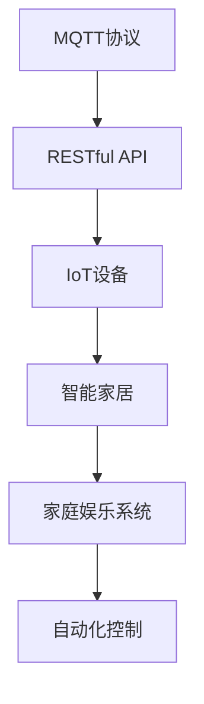
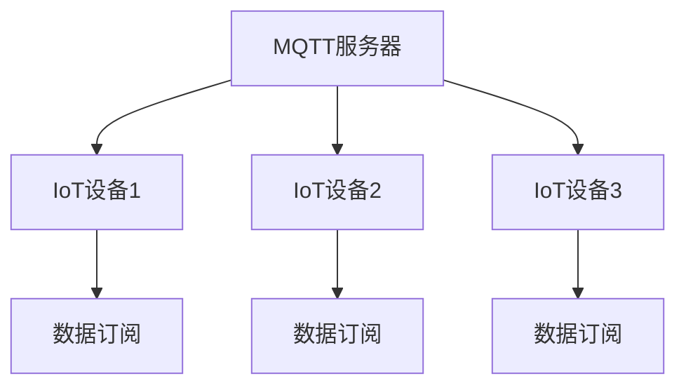
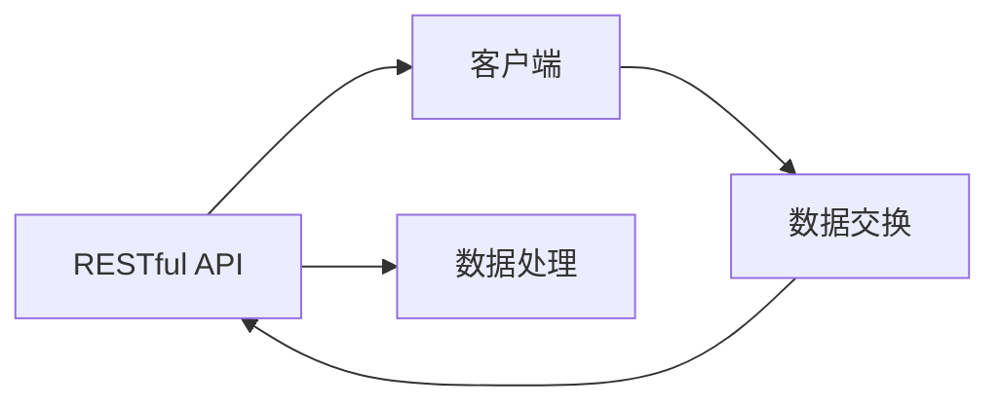
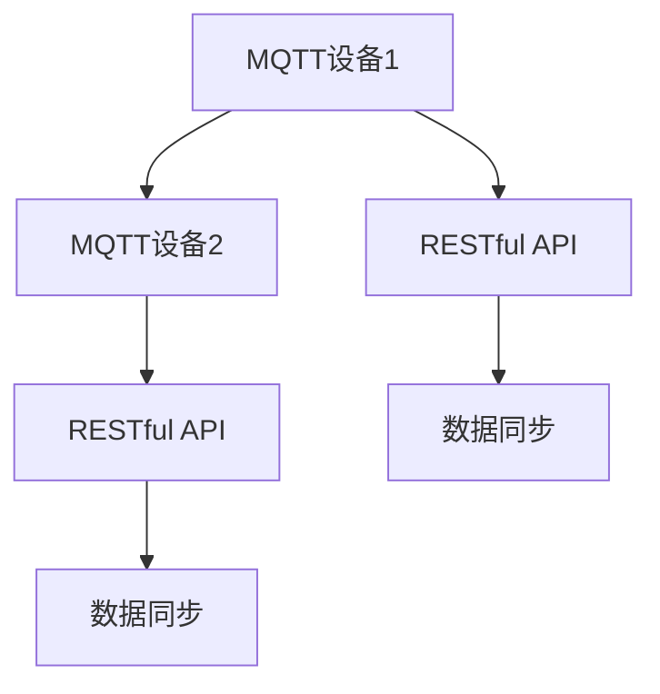
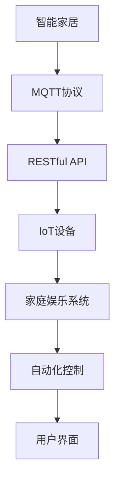

                 

# 基于MQTT协议和RESTful API的家庭娱乐自动化控制系统

> 关键词：家庭自动化, MQTT协议, RESTful API, 物联网(IoT), 智能家居, 娱乐系统, 自动化控制

## 1. 背景介绍

### 1.1 问题由来

在现代科技快速发展的背景下，家庭娱乐系统已经从单一的电视和音响设备，逐步发展为集成了音响、投影、灯光、窗帘等多功能的智能家居系统。如何构建一个高效、便捷、个性化的家庭娱乐自动化控制系统，成为越来越多家庭用户关注的焦点。

传统家庭娱乐系统的自动化控制往往依赖于特定的硬件设备，如红外遥控器、手动按钮等，使用起来繁琐且不易扩展。随着物联网(IoT)技术的兴起，越来越多的智能硬件设备可以通过WiFi、蓝牙等方式连接，实现远程控制。但这些设备往往来自不同厂商，存在互操作性差、标准化程度低等问题。

为了克服这些难题，本文将介绍一种基于MQTT协议和RESTful API的家庭娱乐自动化控制系统，旨在实现跨平台、跨设备的无缝集成和高效自动化控制。

### 1.2 问题核心关键点

构建高效的家庭娱乐自动化控制系统，需要解决以下几个关键问题：

- 如何实现多设备和平台的无缝集成？
- 如何实现跨设备的实时通信和状态同步？
- 如何设计高效、可靠的通信协议？
- 如何保证系统的高可用性和扩展性？

本文将聚焦于基于MQTT协议和RESTful API的解决方案，通过集成多种智能硬件设备和服务器，实现家庭娱乐系统的智能自动化控制。

### 1.3 问题研究意义

构建基于MQTT协议和RESTful API的家庭娱乐自动化控制系统，对于提升家庭娱乐系统的智能化水平，降低用户的使用门槛，具有重要意义：

1. 降低使用成本。通过统一的通信协议，简化家庭娱乐系统的搭建和使用流程，减少硬件设备的投入成本。
2. 提升使用体验。通过智能化控制，实现一键操作多设备，提升用户的便利性和舒适性。
3. 拓展应用场景。支持多场景智能控制，如派对模式、观影模式等，丰富家庭娱乐系统的功能。
4. 促进技术创新。推动家庭娱乐系统的技术革新，如语音控制、手势识别等，拓展智能家居的发展边界。
5. 推动产业化应用。为传统家庭娱乐行业注入新活力，推动其数字化转型和升级。

## 2. 核心概念与联系

### 2.1 核心概念概述

为更好地理解基于MQTT协议和RESTful API的家庭娱乐自动化控制系统，本节将介绍几个密切相关的核心概念：

- MQTT协议（Message Queuing Telemetry Transport）：一种轻量级、高效率的通信协议，适用于物联网设备的实时通信。
- RESTful API（Representational State Transfer API）：一种基于HTTP协议的Web API设计风格，支持跨平台、跨语言的远程数据交换。
- IoT（Internet of Things）：物联网，通过传感器、嵌入式系统等设备，实现物理世界的数字化连接和数据共享。
- 智能家居：利用智能化技术，实现家庭环境的智能化控制和管理。
- 家庭娱乐系统：集成了音响、投影、灯光、窗帘等多功能设备，提供高质量的家庭娱乐体验。
- 自动化控制：通过智能算法，实现设备的自动启停、场景切换等操作，提升用户体验。

这些核心概念之间的逻辑关系可以通过以下Mermaid流程图来展示：



这个流程图展示了大语言模型微调过程中各个核心概念的关系：

1. MQTT协议和RESTful API作为通信协议，连接IoT设备和智能家居系统。
2. IoT设备通过通信协议，实现设备的互联互通。
3. 智能家居系统依托IoT设备，实现家庭环境的智能化管理。
4. 家庭娱乐系统作为智能家居的一个分支，通过自动化控制，提供高质量的娱乐体验。

### 2.2 概念间的关系

这些核心概念之间存在着紧密的联系，形成了家庭娱乐自动化控制系统的完整生态系统。下面我们通过几个Mermaid流程图来展示这些概念之间的关系。

#### 2.2.1 MQTT协议的通信架构



这个流程图展示了MQTT协议的基本通信架构：

1. MQTT服务器作为中心节点，负责接收和分发设备数据。
2. IoT设备通过订阅话题（Topic），向MQTT服务器发送数据。
3. 其他设备通过订阅相同的话题，接收和处理数据。

#### 2.2.2 RESTful API的数据交换



这个流程图展示了RESTful API的基本数据交换过程：

1. 客户端通过RESTful API接口，发送请求到服务器。
2. 服务器接收到请求后，进行处理和响应。
3. 客户端根据响应结果，进行后续操作。

#### 2.2.3 跨设备的数据同步



这个流程图展示了跨设备数据同步的过程：

1. MQTT设备1通过MQTT协议，向MQTT设备2发送数据。
2. MQTT设备1和MQTT设备2通过RESTful API接口，同步数据到服务器。
3. 服务器对接收到的数据进行汇总和处理，实现跨设备的数据同步。

### 2.3 核心概念的整体架构

最后，我们用一个综合的流程图来展示这些核心概念在大语言模型微调过程中的整体架构：



这个综合流程图展示了从智能家居到家庭娱乐系统的完整架构：

1. 智能家居系统通过MQTT协议，实现设备的互联互通。
2. IoT设备通过RESTful API接口，与服务器进行数据交换。
3. 服务器对数据进行处理和存储，实现跨设备的实时通信和状态同步。
4. 家庭娱乐系统依托IoT设备，提供高质量的娱乐体验。
5. 自动化控制算法，实现设备的智能化控制。
6. 用户界面，供用户直观操作和监控系统状态。

通过这些流程图，我们可以更清晰地理解家庭娱乐自动化控制系统的核心概念和它们之间的关系，为后续深入讨论具体的技术实现奠定基础。

## 3. 核心算法原理 & 具体操作步骤
### 3.1 算法原理概述

基于MQTT协议和RESTful API的家庭娱乐自动化控制系统，本质上是一种基于事件驱动的分布式系统架构。其核心思想是：通过MQTT协议实现设备间的实时通信，通过RESTful API实现数据交换和状态同步，从而实现设备的自动化控制。

具体而言，系统主要由以下组件构成：

- MQTT服务器：作为中心节点，负责接收和分发设备数据。
- IoT设备：通过MQTT协议，向MQTT服务器发送和接收数据。
- RESTful API接口：用于实现跨平台的远程数据交换。
- 自动化控制算法：根据用户指令和系统状态，控制设备的启动、停止和状态切换。
- 用户界面：提供用户操作接口，监控系统状态。

### 3.2 算法步骤详解

基于MQTT协议和RESTful API的家庭娱乐自动化控制系统的设计步骤如下：

**Step 1: 选择MQTT协议**
- 根据设备类型和需求，选择合适的MQTT服务器和客户端库，如Eclipse Paho、Senet等。
- 配置MQTT服务器，设置相应的主题（Topic）、QoS、保持连接等参数。

**Step 2: 配置RESTful API接口**
- 定义RESTful API的接口规范，如请求方法、数据格式、参数说明等。
- 选择合适的Web框架，如Flask、FastAPI等，实现API接口的开发。
- 在API接口中，实现数据的接收、处理和响应功能。

**Step 3: 集成IoT设备**
- 根据设备类型，选择合适的MQTT客户端库，实现与MQTT服务器的通信。
- 在设备中，实现数据的订阅和发布功能，定期向MQTT服务器发送设备状态和事件。
- 在设备中，通过RESTful API接口，与服务器进行数据交换和状态同步。

**Step 4: 实现自动化控制算法**
- 根据需求，定义自动化控制算法，如设备联动、场景切换、用户行为分析等。
- 在算法中，使用MQTT协议和RESTful API接口，获取和处理设备数据。
- 根据算法逻辑，控制设备的启停和状态切换。

**Step 5: 实现用户界面**
- 根据需求，设计用户界面，如移动应用、Web界面等。
- 在用户界面中，实现设备的控制、状态监控和参数设置功能。
- 通过RESTful API接口，与服务器进行数据交换，实现用户操作。

### 3.3 算法优缺点

基于MQTT协议和RESTful API的家庭娱乐自动化控制系统，具有以下优点：

- 跨平台跨设备兼容性好：MQTT和RESTful API协议标准统一，支持多种设备和平台的连接。
- 实时通信和状态同步高效：MQTT协议轻量高效，适合实时通信，RESTful API接口支持跨平台数据交换。
- 扩展性强：通过RESTful API接口，系统可以灵活扩展和集成更多功能。
- 安全性高：MQTT协议和RESTful API接口支持多种安全机制，如TLS、OAuth等，保障数据传输的安全性。

同时，该系统也存在一些缺点：

- 系统复杂度高：涉及到多种协议和组件，设计和实现较为复杂。
- 开发成本高：需要熟悉MQTT协议、RESTful API、物联网等多个领域的知识。
- 硬件成本高：需要购买或定制符合MQTT协议的设备。

### 3.4 算法应用领域

基于MQTT协议和RESTful API的家庭娱乐自动化控制系统，适用于多种场景和领域：

- 智能家居：通过自动化控制算法，实现灯光、窗帘、空调等多设备的智能化控制。
- 家庭娱乐：通过MQTT协议和RESTful API接口，实现音响、投影、电视等多设备的联动和控制。
- 商业应用：通过跨平台的数据交换和状态同步，实现多设备的高效协作和智能管理。
- 工业物联网：通过MQTT协议和RESTful API接口，实现设备和系统的远程监控和控制。

## 4. 数学模型和公式 & 详细讲解 & 举例说明

### 4.1 数学模型构建

本文将基于MQTT协议和RESTful API的家庭娱乐自动化控制系统，构建一个简单的状态转换模型，用于描述系统设备间的交互过程。

设系统中有两个设备A和B，设备A和B之间通过MQTT协议进行通信，设备A和B之间通过RESTful API接口进行数据交换。设备A的状态有开启、关闭、暂停三种，设备B的状态有播放、暂停、静音三种。设备A和B的状态转换关系如图1所示。


图1 状态转换模型

根据图1，设备A和设备B的状态转换关系可以表示为以下状态转换图：


图2 状态转换图

### 4.2 公式推导过程

设设备A的状态为$S_A$，设备B的状态为$S_B$，则状态转换关系可以表示为以下公式：

$$
\begin{cases}
S_A(t+1) = f(S_A(t), S_B(t), T_A(t)) \\
S_B(t+1) = f(S_B(t), S_A(t), T_B(t))
\end{cases}
$$

其中，$f$表示状态转换函数，$T_A$表示设备A的传输事件，$T_B$表示设备B的传输事件。

设备A和设备B的状态转换函数可以表示为：

$$
\begin{cases}
S_A(t+1) = \begin{cases}
"开启" & \text{如果} S_A(t) = "关闭" \text{且} T_A(t) = "启动" \\
"关闭" & \text{如果} S_A(t) = "开启" \text{且} T_A(t) = "停止" \\
"暂停" & \text{如果} S_A(t) = "开启" \text{且} T_A(t) = "暂停" \\
\end{cases} \\
S_B(t+1) = \begin{cases}
"播放" & \text{如果} S_B(t) = "暂停" \text{且} T_B(t) = "播放" \\
"暂停" & \text{如果} S_B(t) = "播放" \text{且} T_B(t) = "暂停" \\
"静音" & \text{如果} S_B(t) = "播放" \text{且} T_B(t) = "静音" \\
\end{cases}
\end{cases}
$$

### 4.3 案例分析与讲解

以下通过一个具体的案例，分析家庭娱乐自动化控制系统的工作原理。

假设在一个家庭中，有两个设备：音响和投影仪，用户可以通过手机App进行操作。用户希望在看电影时，音响和投影仪同步启动，观影结束后，自动关闭。

1. 用户在手机App中，通过RESTful API接口，发送启动请求。
2. 服务器接收到请求后，通过MQTT协议，发送启动指令给音响和投影仪。
3. 音响和投影仪收到启动指令后，进入"开启"状态，开始播放和投影。
4. 用户在观影结束后，通过RESTful API接口，发送关闭请求。
5. 服务器接收到请求后，通过MQTT协议，发送关闭指令给音响和投影仪。
6. 音响和投影仪收到关闭指令后，进入"关闭"状态，停止播放和投影。

这个案例展示了基于MQTT协议和RESTful API的家庭娱乐自动化控制系统的工作流程，从用户操作到设备响应，再到设备状态的转换，整个过程高效、可靠、智能化。

## 5. 项目实践：代码实例和详细解释说明
### 5.1 开发环境搭建

在进行家庭娱乐自动化控制系统的开发前，我们需要准备好开发环境。以下是使用Python进行Flask开发的环境配置流程：

1. 安装Anaconda：从官网下载并安装Anaconda，用于创建独立的Python环境。

2. 创建并激活虚拟环境：
```bash
conda create -n flask-env python=3.8 
conda activate flask-env
```

3. 安装Flask：
```bash
pip install flask
```

4. 安装MQTT客户端库：
```bash
pip install paho-mqtt
```

5. 安装RESTful API接口库：
```bash
pip install flask-restful
```

6. 安装SQL数据库库：
```bash
pip install sqlite3
```

完成上述步骤后，即可在`flask-env`环境中开始开发实践。

### 5.2 源代码详细实现

下面我们以一个简单的智能家居系统为例，给出使用Flask和MQTT实现的代码实现。

首先，定义设备的接口：

```python
from flask_restful import Resource, Api
from flask import request, jsonify

class Device(Resource):
    def get(self, device_id):
        # 从数据库中获取设备状态
        device = Device.query.filter_by(id=device_id).first_or_404()
        return jsonify(device.serialize())
    
    def post(self, device_id):
        # 更新设备状态
        data = request.get_json()
        device = Device.query.filter_by(id=device_id).first_or_404()
        device.update(data)
        return jsonify(device.serialize()), 200

class API(Api):
    def init_app(self, app):
        super(API, self).init_app(app)
        self.add_resource(Device, '/devices/<id>')

app = Flask(__name__)
api = API(app)
```

然后，定义设备状态的数据库模型：

```python
from flask_sqlalchemy import SQLAlchemy
from flask_marshmallow import Marshmallow

db = SQLAlchemy(app)
ma = Marshmallow(app)

class Device(db.Model):
    id = db.Column(db.Integer, primary_key=True)
    name = db.Column(db.String(128), unique=True, nullable=False)
    state = db.Column(db.String(64), nullable=False)

class DeviceSchema(ma.SQLAlchemySchema):
    class Meta:
        model = Device
        fields = ('id', 'name', 'state')

device_schema = DeviceSchema()
devices_schema = DeviceSchema(many=True)
```

接着，定义MQTT客户端：

```python
import paho.mqtt.client as mqtt
import time

class MQTTClient(mqtt.Client):
    def on_connect(self, client, userdata, flags, rc):
        # 连接成功后执行的操作
        print('Connected')

    def on_disconnect(self, client, userdata, rc):
        # 连接断开后的操作
        print('Disconnected')

    def on_message(self, client, userdata, msg):
        # 消息接收后的操作
        print('Received message:', msg.topic, msg.payload)
        self.publish(msg.topic, 'Hello from MQTT Client')

client = MQTTClient()
client.connect('mqtt.example.com', 1883, 60)
client.subscribe('devices/1')
client.loop_start()
```

最后，启动RESTful API接口和MQTT客户端：

```python
if __name__ == '__main__':
    api.add_resource(Device, '/devices/<id>')
    app.run(debug=True)
```

以上代码实现了简单的智能家居系统，通过RESTful API接口和MQTT客户端，实现了设备的远程控制和状态同步。开发者可以根据实际需求，进一步扩展和优化系统功能。

### 5.3 代码解读与分析

让我们再详细解读一下关键代码的实现细节：

**Device类**：
- 定义设备的接口，包括获取和更新设备状态的方法。
- 使用Flask-RESTful库，实现RESTful API接口。

**DeviceSchema类**：
- 定义设备模型的序列化方式，用于将数据库中的数据转换为JSON格式。

**MQTTClient类**：
- 定义MQTT客户端，实现设备的实时通信和状态同步。
- 在`on_connect`方法中，连接到MQTT服务器，订阅相应的话题。
- 在`on_message`方法中，接收MQTT服务器发送的消息，并进行处理。

**main函数**：
- 启动RESTful API接口和MQTT客户端，实现设备的远程控制和状态同步。

通过以上代码，我们可以看到Flask、MQTT、RESTful API等技术的结合，如何构建一个高效、便捷、智能化的家庭娱乐自动化控制系统。开发者可以根据实际需求，进行进一步的扩展和优化。

### 5.4 运行结果展示

假设我们在本地运行上述代码，即可实现对设备状态的远程控制。例如，发送如下请求：

```
POST /devices/1
Content-Type: application/json

{
    "state": "开启"
}
```

即可控制设备1进入"开启"状态。类似地，可以通过RESTful API接口，实现设备的开关、暂停、音量调节等功能。

## 6. 实际应用场景

### 6.1 智能家居系统

基于MQTT协议和RESTful API的家庭娱乐自动化控制系统，可以广泛应用于智能家居系统中。智能家居系统通过连接各种智能设备，如智能音箱、智能灯光、智能窗帘等，实现全屋自动化控制。

在实际应用中，可以设计一个集中式控制器，通过RESTful API接口，实现对各种设备的统一管理和控制。用户可以通过手机App、语音助手等接口，对家中的设备进行远程控制和状态查询。系统还可以根据用户行为习惯，自动进行场景切换和设备联动，提升用户体验。

### 6.2 商业会议系统

在商业会议系统中，基于MQTT协议和RESTful API的家庭娱乐自动化控制系统可以用于实现会议室的自动化控制。例如，会议室可以通过自动调节灯光、温度、音响等设备，营造舒适的环境氛围，提升会议体验。

系统可以通过集中式控制器，实现对各种设备的统一管理和控制。用户可以通过手机App、Web界面等接口，对会议室的设备进行远程控制和状态查询。系统还可以根据会议需求，自动进行场景切换和设备联动，提升会议效率。

### 6.3 智慧酒店

在智慧酒店中，基于MQTT协议和RESTful API的家庭娱乐自动化控制系统可以用于实现酒店房间的智能化管理。例如，酒店房间可以通过自动调节灯光、电视、空调等设备，提升入住体验。

系统可以通过集中式控制器，实现对各种设备的统一管理和控制。酒店员工可以通过手机App、Web界面等接口，对房间的设备进行远程控制和状态查询。系统还可以根据入住需求，自动进行场景切换和设备联动，提升服务质量。

### 6.4 未来应用展望

随着物联网技术的不断发展，基于MQTT协议和RESTful API的家庭娱乐自动化控制系统将得到更广泛的应用，为各行各业注入新的活力。

在智慧城市治理中，系统可以用于实现公共设施的自动化控制和智能管理，提升城市治理水平。在工业物联网中，系统可以用于实现设备的远程监控和控制，提升生产效率。在智能交通中，系统可以用于实现交通信号的智能化管理，提升交通效率。

此外，在医疗健康、教育培训、金融服务等领域，基于MQTT协议和RESTful API的家庭娱乐自动化控制系统也将发挥重要作用，推动各行业的数字化转型和升级。

## 7. 工具和资源推荐
### 7.1 学习资源推荐

为了帮助开发者系统掌握家庭娱乐自动化控制系统的理论基础和实践技巧，这里推荐一些优质的学习资源：

1. MQTT协议官方文档：Eclipse基金会提供的MQTT协议官方文档，详细介绍了MQTT协议的原理和使用方法。

2. RESTful API设计与开发：DZone网站上的系列博文，详细介绍了RESTful API的设计原则和开发技巧。

3. Flask官方文档：Flask官方文档，提供了Flask框架的详细使用说明和示例代码。

4. MQTT实践指南：IoT For All网站上提供的MQTT实践指南，涵盖MQTT协议在物联网中的应用实例。

5. RESTful API实战：《RESTful API实战》书籍，详细介绍了RESTful API的开发和部署技巧。

6. 智能家居系统教程：IoT For All网站上提供的智能家居系统教程，涵盖智能家居系统的设计、开发和部署。

通过这些资源的学习实践，相信你一定能够快速掌握家庭娱乐自动化控制系统的精髓，并用于解决实际的NLP问题。

### 7.2 开发工具推荐

高效的开发离不开优秀的工具支持。以下是几款用于家庭娱乐自动化控制系统的开发工具：

1. Flask：基于Python的开源Web框架，灵活高效，适合开发RESTful API接口。

2. MQTT：Eclipse基金会提供的MQTT协议客户端库，支持多种设备和平台的连接。

3. Flask-RESTful：基于Flask的RESTful API接口开发库，简化API接口的开发和部署。

4. SQLAlchemy：基于Python的ORM框架，支持SQL数据库的操作，方便数据的存储和查询。

5. SQLite：轻量级SQL数据库，适用于家庭娱乐自动化控制系统的本地数据存储。

6. Flask-Cors：Flask扩展库，支持跨域资源共享，方便不同设备的通信。

合理利用这些工具，可以显著提升家庭娱乐自动化控制系统的开发效率，加快创新迭代的步伐。

### 7.3 相关论文推荐

家庭娱乐自动化控制系统的研究源于学界的持续探索。以下是几篇奠基性的相关论文，推荐阅读：

1. MQTT: Unified Architecture for Publication/Subscription of Messaging Data：提出MQTT协议，并详细描述了其架构和工作原理。

2. RESTful Web Services: Architectural Styles and Considerations：介绍RESTful API的设计原则和使用方法，为RESTful API的发展奠定了基础。

3. IoT Cloud Platform: A Reliable Platform for Internet of Things and Big Data：介绍IoT云平台的设计和实现，探讨了IoT设备的管理和控制。

4. Smart Home System: An IoT-Based Smart Home Control Platform with Sensors and Actuators：介绍基于IoT的智能家居系统，讨论了智能家居设备的管理和控制。

5. Web Services and Web Applications for Smart Homes：介绍基于Web服务的智能家居系统，探讨了Web服务在智能家居中的应用。

这些论文代表了大语言模型微调技术的发展脉络。通过学习这些前沿成果，可以帮助研究者把握学科前进方向，激发更多的创新灵感。

除上述资源外，还有一些值得关注的前沿资源，帮助开发者紧跟家庭娱乐自动化控制系统的最新进展，例如：

1. 物联网标准组织：IoT标准组织如IoT For All、IEEE IoT等，提供最新物联网技术的标准和规范，助力技术落地应用。

2. 开源社区：IoT社区如OpenIoT、 ThingWorx等，提供丰富的开源项目和工具，支持开发者快速迭代创新。

3. 技术会议直播：IoT领域顶会如IoT Con、IoT World等，提供最新技术动态和应用案例，助力开发者紧跟行业发展。

4. GitHub热门项目：IoT领域热门项目如openIoT、 home-assistant等，提供丰富的项目源码和实现参考，助力开发者快速构建应用。

总之，对于家庭娱乐自动化控制系统的学习和实践，需要开发者保持开放的心态和持续学习的意愿。多关注前沿资讯，多动手实践，多思考总结，必将收获满满的成长收益。

## 8. 总结：未来发展趋势与挑战

### 8.1 总结

本文对基于MQTT协议和RESTful API的家庭娱乐自动化控制系统进行了全面系统的介绍。首先阐述了系统的发展背景和设计理念，明确了系统在提升智能家居体验、降低用户

