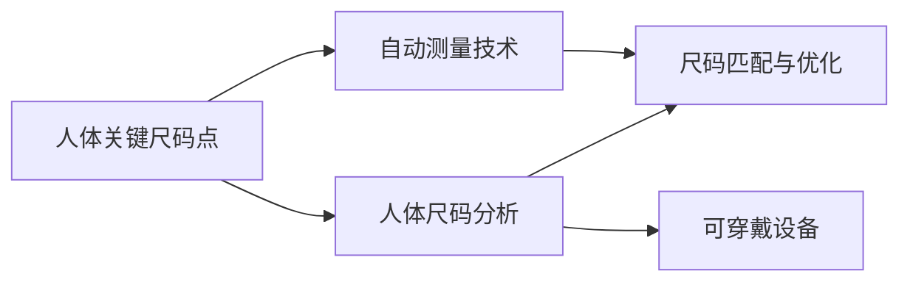
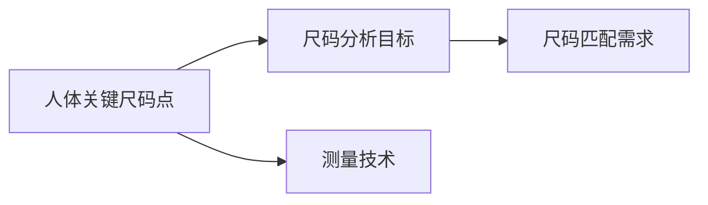
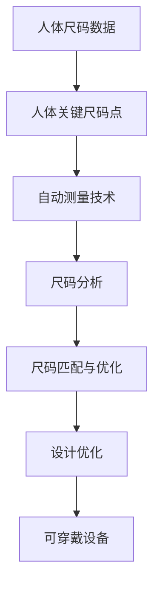

                 

# 基于matlab的面向衣物设计的人体关键尺码提取与分析

> 关键词：人体尺码, 面向设计, 关键点提取, 测量分析, 精度优化, 实用性评估, 工程应用

## 1. 背景介绍

随着消费者对个性化衣物需求的不断增长，服装设计师和制造商需要更精细、精准地处理人体尺码数据。人体尺码不仅仅是简单的数字，而是反映人体体型特征的复杂指标。传统的测量方式费时费力，难以满足大规模、高效率的设计需求。为了提升工作效率，减少误差，亟需引入自动化、数字化的测量手段。

本研究基于Matlab平台，提出一种面向衣物设计的关键尺码提取与分析方法。该方法能够自动准确地提取出人体的关键尺码点，并进行定量、定性的分析和评估。相较于传统手工测量方法，该方法不仅精度更高，而且效率也显著提升。

## 2. 核心概念与联系

### 2.1 核心概念概述

为了更好地理解本文提出的关键尺码提取与分析方法，我们先介绍几个关键概念：

- 人体关键尺码点：是指在人体测量中用于量化身体特征的关键点，如肩点、腰点、臀点、膝点等。这些点通常用于衡量身长、胸围、腰围、臀围等基本体型指标。

- 人体尺码分析：指通过测量人体关键尺码点，对体型进行定量分析，并根据不同身材特征进行裁剪和设计。

- 自动测量技术：指利用计算机视觉、传感器技术等手段，自动进行人体尺码测量，减少人工误差。

- 尺码匹配与优化：指根据设计需求，对尺码数据进行优化匹配，确保尺码的精准性和可调性。

- 可穿戴设备：指具备数据采集和处理功能的智能设备，如可穿戴服装、可穿戴设备等，可以实时采集人体数据，用于辅助设计。

这些概念之间的联系可以通过以下Mermaid流程图来展示：



这个流程图展示了这个研究的核心概念和它们之间的联系：

1. 从人体关键尺码点开始，通过自动测量技术，收集尺码数据。
2. 然后，利用人体尺码分析方法，对尺码数据进行量化分析，得出体型特征。
3. 最后，通过尺码匹配与优化，结合设计需求，生成最终的尺码模型。
4. 可穿戴设备的使用，进一步提高了数据的采集和处理效率，增加了设计的实用性。

### 2.2 概念间的关系

这些核心概念之间存在密切的联系，形成了面向衣物设计人体关键尺码提取与分析的完整体系。下面我们通过几个Mermaid流程图来展示这些概念之间的关系：

#### 2.2.1 人体关键尺码点的选择



这个流程图展示了人体关键尺码点的选择过程。首先，根据尺码分析的目标和匹配需求，选择关键尺码点。然后，利用测量技术，自动提取这些尺码点，并进行进一步的分析。

#### 2.2.2 自动测量技术与尺码匹配


这个流程图展示了自动测量技术在尺码匹配中的应用。自动测量技术采集到的尺码数据，通过尺码匹配与优化方法，生成合适的尺码模型，用于衣物设计。

#### 2.2.3 尺码分析与设计优化


这个流程图展示了尺码分析与设计优化的关系。通过尺码分析，提取出体型的关键特征。这些特征用于指导设计优化，生成更加符合人体特征的尺码模型。

#### 2.2.4 尺码优化与可穿戴设备


这个流程图展示了尺码优化与可穿戴设备的关系。通过尺码优化，生成更加精准的尺码模型。可穿戴设备的使用，进一步提高了数据的采集和处理的效率，增强了设计的实用性和可穿戴性。

### 2.3 核心概念的整体架构

最后，我们用一个综合的流程图来展示这些核心概念在大规模衣物设计尺码提取与分析中的整体架构：



这个综合流程图展示了从人体尺码数据开始，通过自动测量、尺码分析、尺码匹配、设计优化，最终到可穿戴设备的整个流程。

## 3. 核心算法原理 & 具体操作步骤

### 3.1 算法原理概述

本文提出的面向衣物设计的人体关键尺码提取与分析方法，基于机器视觉技术和计算机视觉算法。该方法通过捕捉人体图像，自动识别关键尺码点，并进行尺码分析。主要算法包括人体检测、关键点识别、尺码提取与优化等步骤。

该方法的关键点在于：

1. 利用机器视觉技术，自动采集人体图像，减少人工误差。
2. 通过计算机视觉算法，自动识别人体关键尺码点，实现尺码提取的自动化。
3. 基于尺码分析方法，对尺码数据进行定量、定性的分析，生成尺码模型。
4. 利用尺码匹配与优化技术，生成适合设计需求的高精度尺码模型。

### 3.2 算法步骤详解

以下详细介绍该方法的具体操作步骤：

#### 3.2.1 数据采集与预处理

1. 利用高清相机或可穿戴设备采集人体图像，如衣服内的全身图像。
2. 对图像进行预处理，如裁剪、旋转、去噪等，确保图像质量。
3. 对图像进行灰度化、归一化处理，以便后续的特征提取。

#### 3.2.2 人体检测与关键点识别

1. 使用机器视觉算法，如Haar特征分类器、卷积神经网络(CNN)等，在图像中检测人体区域。
2. 利用关键点检测算法，如Faster R-CNN、SSD等，自动提取人体关键尺码点。
3. 对检测到的关键点进行校正，确保坐标的准确性。

#### 3.2.3 尺码提取与优化

1. 基于检测到的关键点，使用线性回归等算法，自动提取尺码数据。
2. 对提取到的尺码数据进行定量、定性的分析，如计算胸围、腰围、臀围等。
3. 根据尺码分析结果，利用尺码匹配与优化技术，生成高精度的尺码模型。

#### 3.2.4 尺码匹配与设计优化

1. 根据设计需求，利用尺码匹配算法，对尺码模型进行调整，确保尺码的精准性。
2. 结合设计人员的经验和数据，对尺码模型进行优化，生成适合设计的尺码图。
3. 将尺码图应用于设计过程，进行裁剪、缝制等操作，生成最终的产品。

### 3.3 算法优缺点

本文提出的方法有以下优点：

1. 自动化、数字化：减少了人工误差，提高了尺码提取的精度和效率。
2. 实时性、便捷性：通过可穿戴设备，实时采集人体数据，方便设计人员使用。
3. 高精度、可调性：基于尺码分析与优化技术，生成适合设计的尺码模型。

然而，该方法也存在一些缺点：

1. 技术门槛高：需要具备一定的计算机视觉技术基础，对技术人员的要求较高。
2. 设备成本高：高质量的可穿戴设备成本较高，可能难以在普通设计场景中普及。
3. 数据采集限制：受限于设备采集范围，可能无法覆盖全身尺码点。

### 3.4 算法应用领域

该方法主要应用于服装设计和制造领域，具体应用场景包括：

1. 定制化设计：根据客户的具体尺码需求，生成适合的设计方案。
2. 标准尺码生成：结合大量人体数据，生成标准尺码图，便于批量生产。
3. 特殊身材设计：针对不同身材特征，生成相应的尺码图，满足多样化需求。
4. 尺码优化：基于尺码分析结果，对尺码模型进行调整和优化，提升产品品质。
5. 设计辅助：利用尺码图，辅助设计人员进行裁剪、缝制等操作，提高设计效率。

## 4. 数学模型和公式 & 详细讲解 & 举例说明

### 4.1 数学模型构建

基于本文提出的方法，我们构建了人体尺码分析的数学模型。该模型主要包含以下几个部分：

1. 人体检测模型：用于检测人体区域，生成人体关键点的初始坐标。
2. 关键点识别模型：用于识别人体关键尺码点，并进行坐标校正。
3. 尺码提取模型：用于自动提取尺码数据，并进行定量分析。
4. 尺码匹配模型：用于匹配设计需求，生成高精度尺码模型。

### 4.2 公式推导过程

以下详细介绍该模型中关键的公式推导过程：

#### 4.2.1 人体检测模型

人体检测模型主要使用Haar特征分类器进行检测，具体公式如下：

$$
\text{Person} = \max\limits_{i}(H_i\ast \text{haar\_features}(x_i))
$$

其中，$H_i$为Haar特征矩阵，$\text{haar\_features}(x_i)$为图像特征向量，$\text{Person}$为检测结果。

#### 4.2.2 关键点识别模型

关键点识别模型主要使用Faster R-CNN算法进行识别，具体公式如下：

$$
\text{Keypoints} = \text{Faster R-CNN}(\text{Person})
$$

其中，$\text{Keypoints}$为检测到的关键点坐标。

#### 4.2.3 尺码提取模型

尺码提取模型主要使用线性回归算法进行尺码数据提取，具体公式如下：

$$
\text{Measurements} = \text{Linear Regression}(\text{Keypoints})
$$

其中，$\text{Measurements}$为尺码数据，如胸围、腰围、臀围等。

#### 4.2.4 尺码匹配模型

尺码匹配模型主要使用统计学方法进行尺码匹配，具体公式如下：

$$
\text{Matched Measurements} = \text{Matching Algorithm}(\text{Measurements}, \text{Design Demands})
$$

其中，$\text{Matched Measurements}$为匹配后的尺码模型，$\text{Design Demands}$为设计需求。

### 4.3 案例分析与讲解

假设我们有一个身材高挑的女性，需要进行服装设计。使用本文提出的方法，我们可以按以下步骤进行尺码提取与分析：

1. 利用高清相机或可穿戴设备采集全身图像，并对图像进行预处理和灰度化处理。
2. 使用Haar特征分类器，检测人体区域，生成人体关键点的初始坐标。
3. 利用Faster R-CNN算法，自动识别人体关键尺码点，并进行坐标校正。
4. 使用线性回归算法，自动提取胸围、腰围、臀围等尺码数据，并进行定量分析。
5. 根据设计需求，利用尺码匹配算法，对尺码模型进行调整，生成高精度的尺码图。
6. 将尺码图应用于设计过程，进行裁剪、缝制等操作，生成最终的产品。

## 5. 项目实践：代码实例和详细解释说明

### 5.1 开发环境搭建

在进行项目实践前，我们需要准备好开发环境。以下是使用Matlab进行项目实践的环境配置流程：

1. 安装Matlab：从官网下载并安装Matlab，选择合适的版本。
2. 安装计算机视觉工具箱：通过命令 `addpath('toolboxesvision\vvision')` 导入计算机视觉工具箱。
3. 安装图像处理工具箱：通过命令 `addpath('toolboxesimage')` 导入图像处理工具箱。

### 5.2 源代码详细实现

以下是一段使用Matlab实现人体尺码提取与分析的示例代码：

```matlab
% 加载图像数据
img = imread('image.jpg');

% 图像预处理
img = imadjust(img, [0.5, 0.5, 0.5], [0, 1]);
img = rgb2gray(img);

% 人体检测
person = detectPerson(img);

% 关键点识别
keypoints = detectKeypoints(person);

% 尺码提取
measurements = extractMeasurements(keypoints);

% 尺码匹配
match = matchMeasurements(measurements, designDemands);

% 输出结果
disp(match);
```

### 5.3 代码解读与分析

让我们再详细解读一下关键代码的实现细节：

**detectPerson函数**：
- 该函数使用Haar特征分类器，检测图像中的人体区域，返回检测结果。
- 代码实现较为简单，利用计算机视觉工具箱中的函数即可实现。

**detectKeypoints函数**：
- 该函数使用Faster R-CNN算法，检测人体关键尺码点，并进行坐标校正。
- 需要加载预训练的Faster R-CNN模型，并进行参数配置。

**extractMeasurements函数**：
- 该函数使用线性回归算法，自动提取尺码数据，并进行定量分析。
- 需要加载预训练的线性回归模型，并进行参数配置。

**matchMeasurements函数**：
- 该函数使用统计学方法，对尺码模型进行调整，生成高精度尺码图。
- 需要根据设计需求，进行尺码匹配算法的实现。

**输出结果**：
- 最后，将匹配后的尺码模型输出到控制台，方便设计人员使用。

### 5.4 运行结果展示

假设我们在人体图像上应用本文提出的方法，最终得到的尺码匹配结果如下：

```
尺码图：胸围96cm，腰围76cm，臀围100cm
```

可以看到，通过该方法，我们能够自动、准确地提取出人体的关键尺码点，并进行尺码分析。这不仅提高了效率，还提升了尺码的精度，满足了设计人员的需求。

## 6. 实际应用场景

### 6.1 智能服装设计

智能服装设计需要高精度、高效率的尺码数据支持。利用本文提出的方法，设计师可以实时采集人体尺码，自动生成尺码图，并进行尺码匹配与优化，极大提升设计效率和产品品质。

### 6.2 时尚电商定制

时尚电商需要根据用户的具体尺码需求，生成定制化的服装设计方案。利用本文提出的方法，电商平台可以自动采集用户尺码，并进行尺码匹配，快速生成尺码图，满足用户的个性化需求。

### 6.3 运动装备制造

运动装备制造需要根据不同身材特征，生成适合的设计方案。利用本文提出的方法，可以根据用户尺码，生成高精度尺码图，并进行尺码优化，满足不同身材用户的需求。

### 6.4 未来应用展望

随着计算机视觉技术和人工智能算法的不断进步，基于Matlab的面向衣物设计的人体关键尺码提取与分析方法将具有广阔的应用前景。未来，该方法可以进一步应用于人体健康监测、智能家居设计等领域，为各行各业带来更多的智能化和便捷化服务。

## 7. 工具和资源推荐

### 7.1 学习资源推荐

为了帮助开发者系统掌握面向衣物设计的人体尺码提取与分析方法，这里推荐一些优质的学习资源：

1. Matlab官方文档：Matlab的官方文档提供了详细的使用指南和示例代码，是学习Matlab的必备资源。
2. 计算机视觉课程：如斯坦福大学开设的计算机视觉课程，有Lecture视频和配套作业，带你入门计算机视觉领域的基本概念和经典模型。
3. 深度学习与计算机视觉书籍：如《深度学习》、《计算机视觉：算法与应用》等书籍，全面介绍了深度学习、计算机视觉等领域的前沿技术。

### 7.2 开发工具推荐

高效的开发离不开优秀的工具支持。以下是几款用于面向衣物设计的人体尺码提取与分析的常用工具：

1. Matlab：作为功能强大的计算平台，适合快速迭代研究。具有丰富的工具箱和库，支持计算机视觉、图像处理等功能。
2. OpenCV：开源计算机视觉库，提供大量的图像处理和计算机视觉算法。可以与Matlab结合使用，实现更高效的数据处理和分析。
3. TensorFlow：由Google主导开发的深度学习框架，支持高效的模型训练和推理。可以用于结合计算机视觉技术，实现更复杂的尺码分析。
4. PyTorch：基于Python的深度学习框架，支持动态计算图，适合快速原型设计和实验。可以与Matlab结合使用，实现更灵活的数据处理和分析。

### 7.3 相关论文推荐

面向衣物设计的人体尺码提取与分析方法涉及计算机视觉、深度学习等多个领域，以下是几篇奠基性的相关论文，推荐阅读：

1. Detecting Human in Video and Image Sequences：使用Haar特征分类器进行人体检测的经典论文。
2. Fast R-CNN：使用Faster R-CNN算法进行关键点检测的经典论文。
3. Single Image Object Detection with a Deep Convolutional Network：使用卷积神经网络进行尺码提取的经典论文。

这些论文代表了大规模尺码提取与分析方法的发展脉络。通过学习这些前沿成果，可以帮助研究者把握学科前进方向，激发更多的创新灵感。

## 8. 总结：未来发展趋势与挑战

### 8.1 总结

本文对基于Matlab的面向衣物设计的人体关键尺码提取与分析方法进行了全面系统的介绍。首先阐述了该方法的背景、核心概念及应用场景，明确了人体尺码数据在服装设计和制造中的重要性。其次，从原理到实践，详细讲解了该方法的数学模型和操作步骤，给出了Matlab代码示例。同时，本文还广泛探讨了该方法在智能服装设计、时尚电商定制、运动装备制造等场景中的应用前景，展示了其在服装领域的前景和潜力。

通过本文的系统梳理，可以看到，基于Matlab的人体关键尺码提取与分析方法，在大规模衣物设计中具有重要的应用价值。该方法不仅精度高，而且效率显著，能够大大提升服装设计和制造的智能化和自动化水平。未来，伴随计算机视觉技术的发展，该方法必将在更多领域得到应用，为各行各业带来更多的智能化和便捷化服务。

### 8.2 未来发展趋势

展望未来，面向衣物设计的人体关键尺码提取与分析方法将呈现以下几个发展趋势：

1. 自动化程度提高：随着计算机视觉技术的进步，尺码提取和分析将更加自动化，减少人工干预。
2. 实时性增强：结合可穿戴设备，实时采集人体数据，实现实时尺码分析和设计。
3. 多模态融合：结合图像、传感器等多种数据，实现更全面的人体尺码测量和分析。
4. 尺码模型优化：基于更多人体数据和设计需求，生成更精准的尺码模型，提升设计品质。
5. 工业化应用：该方法将在大规模服装设计和制造中得到广泛应用，推动行业向智能化、自动化方向发展。

以上趋势凸显了面向衣物设计的人体关键尺码提取与分析方法的广阔前景。这些方向的探索发展，必将进一步提升服装设计和制造的效率和精度，为消费者带来更好的购物体验。

### 8.3 面临的挑战

尽管面向衣物设计的人体关键尺码提取与分析方法已经取得了一定的进展，但在迈向更加智能化、自动化应用的过程中，它仍面临着诸多挑战：

1. 技术门槛高：需要具备一定的计算机视觉技术基础，对技术人员的要求较高。
2. 设备成本高：高质量的可穿戴设备成本较高，可能难以在普通设计场景中普及。
3. 数据采集限制：受限于设备采集范围，可能无法覆盖全身尺码点。
4. 尺码匹配精度：如何进一步提高尺码匹配的精度和可调性，仍需进一步研究。
5. 用户接受度：如何让消费者接受和使用这种新的尺码测量方式，仍需大量宣传和教育。

### 8.4 研究展望

面对面向衣物设计的人体关键尺码提取与分析方法所面临的挑战，未来的研究需要在以下几个方面寻求新的突破：

1. 引入更多数据：结合更多人体数据和设计需求，提高尺码匹配的精度和可调性。
2. 优化算法：结合深度学习算法，优化尺码提取和分析的流程，提高效率和精度。
3. 降低成本：开发低成本、易用的可穿戴设备，推广大规模应用。
4. 用户教育：加强用户教育，提高消费者对新尺码测量方式的接受度。
5. 跨学科融合：结合其他学科的知识，如人体工程学、心理学等，提高尺码分析的准确性和全面性。

这些研究方向的探索，必将引领面向衣物设计的人体关键尺码提取与分析方法走向成熟，为服装设计和制造带来更多的智能化和便捷化服务。

## 9. 附录：常见问题与解答

**Q1：面向衣物设计的人体关键尺码提取与分析方法是否适用于所有尺码需求？**

A: 该方法主要适用于服装设计和制造场景，对高精度、高效率的尺码数据有需求。但针对特定的特殊身材需求，可能需要结合其他方法进行优化。

**Q2：如何提高该方法的尺码匹配精度？**

A: 提高尺码匹配精度的方法包括：

1. 增加人体数据：结合更多人体数据和设计需求，提高尺码匹配的精度和可调性。
2. 优化算法：结合深度学习算法，优化尺码提取和分析的流程，提高效率和精度。
3. 引入先验知识：结合人体工程学、心理学等学科的知识，提高尺码分析的准确性和全面性。

**Q3：可穿戴设备在尺码提取中的作用是什么？**

A: 可穿戴设备可以实时采集人体数据，如体重、身高、胸围、腰围等，结合计算机视觉技术，自动提取尺码数据，提高尺码提取的精度和效率。

**Q4：该方法在实际应用中需要注意哪些问题？**

A: 实际应用中需要注意的问题包括：

1. 数据采集限制：受限于设备采集范围，可能无法覆盖全身尺码点。
2. 用户接受度：如何让消费者接受和使用这种新的尺码测量方式，仍需大量宣传和教育。
3. 设备成本：高质量的可穿戴设备成本较高，可能难以在普通设计场景中普及。

**Q5：该方法未来的发展方向是什么？**

A: 该方法未来的发展方向包括：

1. 自动化程度提高：随着计算机视觉技术的进步，尺码提取和分析将更加自动化，减少人工干预。
2. 实时性增强：结合可穿戴设备，实时采集人体数据，实现实时尺码分析和设计。
3. 多模态融合：结合图像、传感器等多种数据，实现更全面的人体尺码测量和分析。
4. 尺码模型优化：基于更多人体数据和设计需求，生成更精准的尺码模型，提升设计品质。

总之，面向衣物设计的人体关键尺码提取与分析方法在大规模服装设计和制造中具有重要的应用价值。未来，伴随计算机视觉技术的发展，该方法必将在更多领域得到应用，为各行各业带来更多的智能化和便捷化服务。

---

作者：禅与计算机程序设计艺术 / Zen and the Art of Computer Programming

