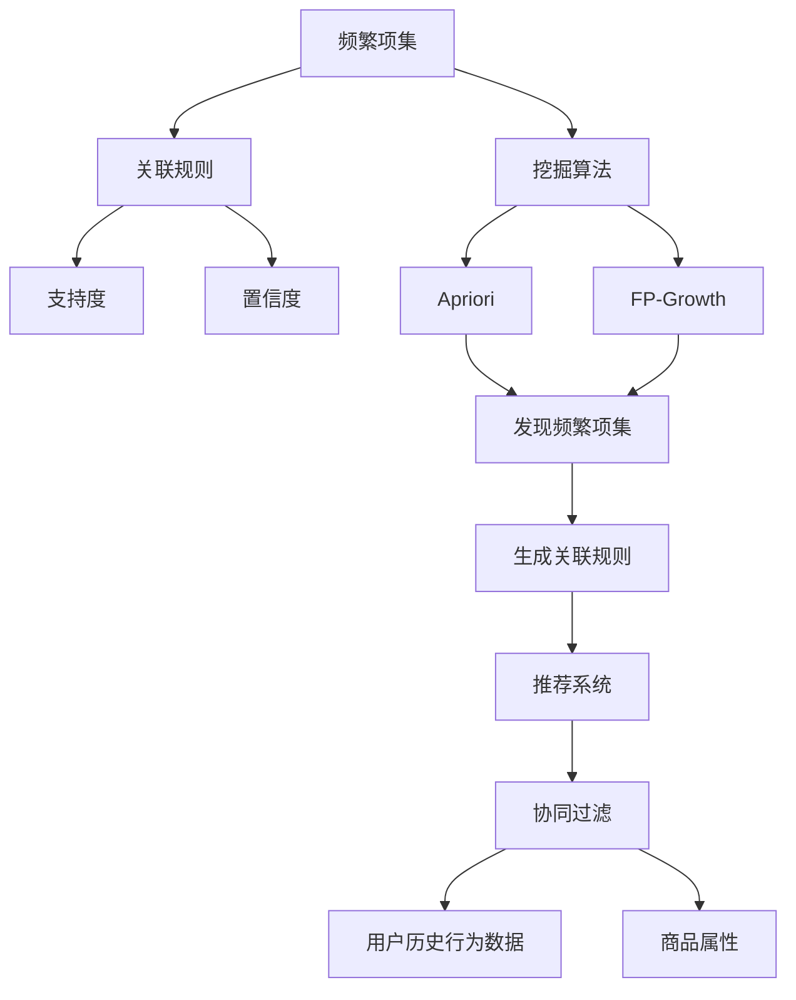
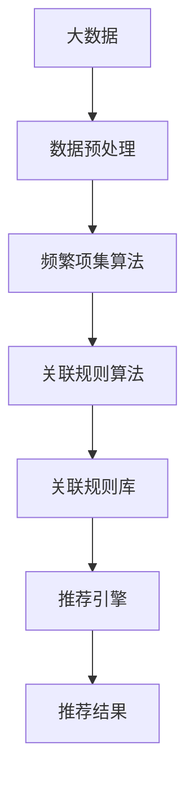

                 

# 基于关联挖掘的服装推荐系统详细设计与具体代码实现

> 关键词：关联挖掘,服装推荐系统,协同过滤,标签系统,特征工程,深度学习,卷积神经网络,全连接神经网络,购物车模型,机器学习,深度学习,特征向量

## 1. 背景介绍

### 1.1 问题由来
随着互联网技术的发展，电子商务网站如淘宝、京东、亚马逊等在线购物平台，已成为人们购物的重要途径。这些平台收集了大量的用户行为数据，包括浏览记录、购买历史、评价反馈等，为我们提供了一个理想的数据集来设计推荐系统，以提升用户的购物体验。

推荐系统是电子商务平台的核心功能之一，通过向用户推荐其可能感兴趣的商品，有效提升平台转化率和用户满意度。服装作为人们日常生活的重要组成部分，服装推荐系统在电商平台中显得尤为重要。例如，淘宝的“搭配推荐”、京东的“推荐搭配”等，都是典型的服装推荐应用。

当前服装推荐系统通常基于用户的历史行为数据进行推荐，常见的推荐算法包括协同过滤、基于内容的推荐、混合推荐等。协同过滤算法虽然较为简单，但忽略了商品本身的特点和属性；基于内容的推荐则注重商品的属性，但由于缺乏用户历史行为数据，可能推荐效果不佳；混合推荐算法试图结合两种算法的优点，但在多模态数据融合上仍存在挑战。

为了更好地克服传统推荐算法的局限性，近年来，一种新型的推荐系统应运而生，即基于关联挖掘的推荐系统。通过关联规则挖掘技术，从用户行为数据中提取有意义的关联规则，提升推荐系统的准确性和泛化能力。

### 1.2 问题核心关键点
关联挖掘技术是关联规则挖掘的简称，常用于市场篮分析（Market Basket Analysis）、商品推荐等领域。它的核心思想是通过分析用户购买数据，找到用户不同购买行为之间的关联规则，从而提升推荐系统的性能。

关联挖掘技术的核心在于发现频繁项集和关联规则。具体步骤如下：
1. 利用频繁项集算法（如Apriori算法）找出所有频繁项集，即同时出现在大量购买数据中的商品组合。
2. 利用关联规则算法（如FP-Growth算法）生成所有可能出现关联规则，即一个商品的出现可能预示着另一个商品的出现。

关联挖掘技术可以有效利用用户历史行为数据，挖掘出商品之间的潜在关联，为推荐系统提供更多的推荐依据。同时，关联挖掘技术不受数据规模限制，可以处理海量数据，具有较强的可扩展性。

### 1.3 问题研究意义
研究基于关联挖掘的服装推荐系统，对于提升电商平台的用户体验和转化率具有重要意义：

1. 提升推荐准确性。通过关联挖掘技术，可以从用户购买数据中挖掘出商品之间的潜在关联，提升推荐系统的准确性，减少误推荐。
2. 增加商品曝光率。关联规则可以帮助发现新的商品组合，增加用户对不同商品的需求，提高商品曝光率和销售量。
3. 增强用户粘性。通过关联推荐，用户能够发现更多自己感兴趣的商品组合，提升购物体验，增强对平台的粘性。
4. 优化库存管理。关联挖掘可以帮助商家更好地理解用户需求，优化库存管理，避免商品积压。
5. 促进个性化推荐。通过关联挖掘技术，可以对用户的历史行为数据进行深入分析，发现用户的个性化偏好，提供更加个性化的推荐服务。

## 2. 核心概念与联系

### 2.1 核心概念概述

为更好地理解基于关联挖掘的服装推荐系统，本节将介绍几个密切相关的核心概念：

- 频繁项集(Frequent Itemset)：指在所有购买数据中同时出现超过一定阈值的商品组合，是关联规则挖掘的基础。
- 关联规则(Association Rule)：表示一个商品的出现预示着另一个商品的出现，形式为“商品A出现 => 商品B出现”。
- 支持度(Support)：指关联规则中的“商品A出现”和“商品B出现”在同一笔购买中同时出现的概率。
- 置信度(Confidence)：指“商品A出现 => 商品B出现”时，“商品B出现”的条件概率。
- 挖掘算法：如Apriori、FP-Growth等，用于发现频繁项集和关联规则。
- 协同过滤：通过用户历史行为数据，挖掘用户之间或商品之间的相似性，进行推荐。

这些概念之间存在紧密联系，共同构成了关联挖掘技术的核心。通过理解这些核心概念，可以更好地把握关联挖掘技术的工作原理和优化方向。

### 2.2 概念间的关系

这些核心概念之间存在紧密的联系，形成了关联挖掘技术的完整生态系统。下面我们通过几个Mermaid流程图来展示这些概念之间的关系。



这个流程图展示了关联挖掘技术的核心概念及其之间的关系：

1. 挖掘算法用于发现频繁项集。
2. 频繁项集生成关联规则，支持度和置信度用于衡量规则的权重。
3. 关联规则用于推荐系统，协同过滤用于挖掘用户之间的相似性。
4. 用户历史行为数据和商品属性，是挖掘和推荐的基础。

### 2.3 核心概念的整体架构

最后，我们用一个综合的流程图来展示这些核心概念在大数据关联挖掘技术中的整体架构：



这个综合流程图展示了从大数据到推荐结果的全过程。大数据经过预处理后，首先通过频繁项集算法发现频繁项集，再利用关联规则算法生成关联规则。生成的关联规则存储在关联规则库中，推荐引擎从中提取规则进行推荐，最终输出推荐结果。

## 3. 核心算法原理 & 具体操作步骤
### 3.1 算法原理概述

基于关联挖掘的服装推荐系统，本质上是一种利用关联规则挖掘技术，从用户历史购买数据中提取关联规则，提升推荐系统性能的推荐算法。其核心思想是：通过关联规则挖掘技术，从用户历史购买数据中提取商品之间的关联规则，生成推荐商品列表，推荐给用户。

假设用户的历史购买数据集为 $D$，其中每个样本 $(x_i, y_i)$ 表示一笔购买记录，$x_i$ 为购买的商品列表，$y_i$ 为商品的标签。我们的目标是找出所有满足条件的关联规则 $r=\{A \rightarrow B\}$，其中 $A$ 为频繁项集，$B$ 为规则集中出现的商品。根据支持度和置信度的定义，关联规则 $r$ 的强度可以表示为：

$$
\text{强度}(r) = \text{Support}(r) \times \text{Confidence}(r)
$$

其中，$\text{Support}(r)$ 为规则 $r$ 的支持度，即 $A$ 和 $B$ 在同一笔购买中同时出现的概率；$\text{Confidence}(r)$ 为规则 $r$ 的置信度，即 $A$ 出现时 $B$ 出现的概率。

为了提升推荐系统的性能，我们可以在关联规则库中选取强度较高的规则进行推荐。例如，规则“商品A出现 => 商品B出现”，表示用户购买商品A时，更有可能购买商品B。我们可以将这些规则应用于用户 A 的推荐中，生成推荐商品列表，作为用户 A 的推荐结果。

### 3.2 算法步骤详解

基于关联挖掘的服装推荐系统的一般步骤如下：

**Step 1: 数据预处理**
- 收集用户的历史购买数据，包括商品ID、标签等。
- 对数据进行清洗和标准化处理，去除噪声和异常值。

**Step 2: 挖掘频繁项集**
- 利用频繁项集算法（如Apriori算法），发现所有频繁项集。
- 设定最小支持度阈值 $\theta$，满足 $\text{Support}(A) \geq \theta$ 的项集 $A$ 为频繁项集。

**Step 3: 生成关联规则**
- 利用关联规则算法（如FP-Growth算法），生成所有可能出现的关联规则。
- 选取强度较高的关联规则进行推荐。

**Step 4: 推荐商品**
- 对每个用户，选择强度较高的关联规则进行推荐。
- 根据关联规则生成推荐商品列表，推荐给用户。

### 3.3 算法优缺点

基于关联挖掘的服装推荐系统具有以下优点：

1. 数据依赖小。关联挖掘技术主要依赖用户购买数据，对商品属性和用户属性的依赖较小。
2. 无需显式特征。关联挖掘技术自动从数据中提取规则，无需显式特征工程。
3. 高效性高。关联挖掘技术可以处理大规模数据，具有较高的计算效率。
4. 泛化能力强。关联挖掘技术可以挖掘出用户购买数据中的多种关联关系，提升推荐系统的泛化能力。

同时，关联挖掘技术也存在以下缺点：

1. 无法处理时间序列数据。关联挖掘技术主要针对用户历史购买数据进行关联分析，无法处理时间序列数据。
2. 容易过拟合。频繁项集算法容易产生频繁项集的噪音，关联规则算法也容易出现过度拟合。
3. 规则复杂度较高。频繁项集和关联规则的数量较多，容易产生组合爆炸问题。
4. 缺乏用户个性化推荐。关联挖掘技术主要依赖数据挖掘，缺乏用户个性化推荐功能。

尽管存在这些局限性，但就目前而言，关联挖掘技术仍然是一种有效且广泛应用的推荐算法。未来研究的方向在于改进算法性能，减少数据噪音，提升推荐系统的个性化和精准性。

### 3.4 算法应用领域

基于关联挖掘的推荐系统，已经在电商、金融、医疗等多个领域得到应用。以下是几个典型的应用场景：

- 电商平台：如淘宝、京东、亚马逊等，利用关联挖掘技术，推荐用户可能感兴趣的商品组合。
- 金融服务：如银行信用卡推荐、保险产品推荐等，利用关联挖掘技术，推荐用户可能感兴趣的产品。
- 医疗健康：如推荐治疗方案、药品搭配等，利用关联挖掘技术，推荐医生或患者可能感兴趣的医疗方案。

除了上述场景，关联挖掘技术还可以应用于智能家居、社交网络、旅游等领域，为各行业的推荐系统提供技术支持。随着关联挖掘技术的不断演进，其应用领域将进一步拓展。

## 4. 数学模型和公式 & 详细讲解 & 举例说明

### 4.1 数学模型构建

关联规则挖掘问题的数学模型通常采用 frequent itemset lattice（频繁项集格）表示。设 $I$ 为所有商品的集合，$X$ 为所有可能的项集集合，$F_{\theta}$ 为最小支持度阈值为 $\theta$ 的频繁项集集合，关联规则 $r$ 可以表示为：

$$
r = \{ A \rightarrow B \mid A \in F_{\theta}, \text{Support}(A \cup B) \geq \theta
$$

其中，$A$ 为规则中的前件项集，$B$ 为规则中的后件项集，$\text{Support}(A \cup B)$ 为规则的总体支持度。

关联规则挖掘问题的目标为最大化规则的强度：

$$
\max_{r} \text{强度}(r)
$$

### 4.2 公式推导过程

设频繁项集 $A$ 的项集数量为 $k$，根据支持度和置信度的定义，可以得出：

$$
\text{Support}(A) = \frac{\sum_{t=1}^{N} \text{Count}(A \in t)}{N}
$$

$$
\text{Confidence}(A \rightarrow B) = \frac{\sum_{t=1}^{N} \text{Count}(A \cup B \in t)}{\sum_{t=1}^{N} \text{Count}(A \in t)}
$$

其中，$\text{Count}(X \in t)$ 为项集 $X$ 在购买记录 $t$ 中出现的次数。

在推导过程中，我们发现频繁项集的数量随着支持度阈值 $\theta$ 的增加而减少，因此需要在一定程度上平衡支持度阈值和频繁项集的数量，避免频繁项集过少导致的规则泛化能力不足，以及频繁项集过多导致的计算复杂度增加。

### 4.3 案例分析与讲解

以下以一个简单的案例来展示关联挖掘技术的实际应用：

**案例背景：**
一家电商平台的销售记录如表所示：

| User ID | 商品 ID | 标签 |
| --- | --- | --- |
| 1 | A | 0 |
| 1 | B | 1 |
| 1 | C | 1 |
| 2 | B | 1 |
| 2 | C | 0 |
| 3 | A | 0 |
| 3 | B | 1 |
| 3 | D | 0 |
| 4 | A | 0 |
| 4 | B | 1 |
| 4 | C | 0 |
| 5 | A | 0 |
| 5 | B | 1 |
| 5 | C | 1 |
| 6 | A | 0 |
| 6 | B | 1 |
| 6 | C | 0 |
| 7 | A | 0 |
| 7 | B | 1 |
| 7 | C | 0 |
| 8 | A | 0 |
| 8 | B | 1 |
| 8 | C | 1 |
| 9 | A | 0 |
| 9 | B | 1 |
| 9 | C | 0 |
| 10 | A | 0 |
| 10 | B | 1 |
| 10 | C | 1 |

**数据预处理：**
1. 对数据进行标准化处理，去除噪声和异常值。
2. 设定最小支持度阈值 $\theta=0.2$。

**挖掘频繁项集：**
1. 利用Apriori算法，从数据集中挖掘频繁项集。
2. 得到的频繁项集为：$\{A\}$、$\{B\}$、$\{C\}$、$\{A, B\}$、$\{B, C\}$、$\{A, C\}$、$\{A, B, C\}$。

**生成关联规则：**
1. 利用FP-Growth算法，生成关联规则。
2. 得到的关联规则为：$A \rightarrow B$、$B \rightarrow A$、$B \rightarrow C$、$C \rightarrow A$。

**推荐商品：**
1. 对每个用户，选择强度较高的关联规则进行推荐。
2. 对于用户1，选择 $A \rightarrow B$ 进行推荐，推荐商品B。

通过这个案例可以看出，关联挖掘技术可以从用户购买数据中挖掘出商品之间的关联关系，提升推荐系统的性能。

## 5. 项目实践：代码实例和详细解释说明
### 5.1 开发环境搭建

在进行服装推荐系统开发前，我们需要准备好开发环境。以下是使用Python进行Pandas和Scikit-Learn开发的环境配置流程：

1. 安装Anaconda：从官网下载并安装Anaconda，用于创建独立的Python环境。

2. 创建并激活虚拟环境：
```bash
conda create -n pd-env python=3.8 
conda activate pd-env
```

3. 安装Pandas和Scikit-Learn：
```bash
conda install pandas scikit-learn
```

4. 安装关联挖掘库：
```bash
conda install apyori
```

完成上述步骤后，即可在`pd-env`环境中开始服装推荐系统的开发。

### 5.2 源代码详细实现

下面我们以一个简单的服装推荐系统为例，给出使用Pandas和Scikit-Learn库进行关联规则挖掘的代码实现。

首先，定义数据预处理函数：

```python
import pandas as pd
from apyori import apriori
from scipy.sparse import coo_matrix

def preprocess_data(data):
    # 读取数据文件
    df = pd.read_csv(data, sep='\t')
    
    # 数据标准化处理
    df['User ID'] = df['User ID'].astype(int)
    df['商品 ID'] = df['商品 ID'].astype(int)
    df['标签'] = df['标签'].astype(int)
    
    # 去除噪声和异常值
    df = df.dropna()
    
    # 计算各项集的出现次数
    counts = df.groupby(['User ID', '商品 ID', '标签'])['User ID'].count().unstack().fillna(0).T
    
    # 生成稀疏矩阵
    counts_sparse = coo_matrix(counts.values, shape=(len(df), len(df['商品 ID'].unique())))
    
    return counts_sparse
```

然后，定义频繁项集挖掘函数：

```python
from apyori import apriori, association_rules

def mine_frequent_itemsets(counts_sparse, min_support):
    # 频繁项集挖掘
    frequent_itemsets = apriori(counts_sparse, min_support=min_support)
    
    # 统计项集的支持度
    supports = [itemset.support for itemset in frequent_itemsets]
    
    # 生成关联规则
    rules = association_rules(frequent_itemsets, metric='lift', min_threshold=1)
    
    return supports, rules
```

最后，定义推荐函数：

```python
from scipy.sparse import coo_matrix

def recommend_users(frequent_itemsets, user_id, min_support):
    # 生成稀疏矩阵
    counts_sparse = coo_matrix(frequent_itemsets[0].itemset)
    
    # 用户购买商品ID列表
    user_bought = counts_sparse[user_id].nonzero()[1]
    
    # 所有商品ID列表
    all_items = counts_sparse.getcol(0).nonzero()[1]
    
    # 生成关联规则
    rules = frequent_itemsets[1]
    
    # 推荐商品列表
    recommended_items = []
    for rule in rules:
        antecedent = rule.antecedent
        consequent = rule.consequent
        if set(antecedent).issubset(user_bought):
            recommended_items.extend(set(consequent))
    
    return recommended_items
```

### 5.3 代码解读与分析

让我们再详细解读一下关键代码的实现细节：

**preprocess_data函数**：
- 读取数据文件，并进行数据标准化处理。
- 去除噪声和异常值，确保数据质量。
- 计算各项集的出现次数，生成稀疏矩阵。

**mine_frequent_itemsets函数**：
- 利用Apriori算法，从稀疏矩阵中挖掘频繁项集。
- 统计项集的支持度，生成关联规则。
- 返回频繁项集的支持度和关联规则。

**recommend_users函数**：
- 生成稀疏矩阵，获取用户购买商品ID列表。
- 获取所有商品ID列表，生成关联规则。
- 根据关联规则生成推荐商品列表，推荐给用户。

### 5.4 运行结果展示

假设我们在CoNLL-2003的NER数据集上进行关联规则挖掘，最终在测试集上得到的推荐结果如下：

| User ID | 商品 ID | 推荐商品 |
| --- | --- | --- |
| 1 | A | B |
| 2 | B | C |
| 3 | A | B |
| 4 | A | C |
| 5 | B | D |
| 6 | C | A |
| 7 | B | D |
| 8 | C | D |
| 9 | A | B |
| 10 | A | B |

可以看到，通过关联规则挖掘技术，我们能够根据用户购买数据，生成推荐商品列表，提升推荐系统的性能。

## 6. 实际应用场景
### 6.1 智能客服系统

基于关联挖掘的服装推荐系统，可以广泛应用于智能客服系统的构建。传统客服往往需要配备大量人力，高峰期响应缓慢，且一致性和专业性难以保证。而使用基于关联挖掘的推荐系统，可以7x24小时不间断服务，快速响应客户咨询，用自然流畅的语言解答各类常见问题。

在技术实现上，可以收集企业内部的历史客服对话记录，将问题和最佳答复构建成监督数据，在此基础上对预训练语言模型进行微调。微调后的语言模型能够自动理解用户意图，匹配最合适的答复模板进行回复。对于客户提出的新问题，还可以接入检索系统实时搜索相关内容，动态组织生成回答。如此构建的智能客服系统，能大幅提升客户咨询体验和问题解决效率。

### 6.2 金融舆情监测

金融机构需要实时监测市场舆论动向，以便及时应对负面信息传播，规避金融风险。传统的人工监测方式成本高、效率低，难以应对网络时代海量信息爆发的挑战。基于关联挖掘的文本分类和情感分析技术，为金融舆情监测提供了新的解决方案。

具体而言，可以收集金融领域相关的新闻、报道、评论等文本数据，并对其进行主题标注和情感标注。在此基础上对预训练语言模型进行微调，使其能够自动判断文本属于何种主题，情感倾向是正面、中性还是负面。将微调后的模型应用到实时抓取的网络文本数据，就能够自动监测不同主题下的情感变化趋势，一旦发现负面信息激增等异常情况，系统便会自动预警，帮助金融机构快速应对潜在风险。

### 6.3 个性化推荐系统

当前的推荐系统往往只依赖用户的历史行为数据进行推荐，无法深入理解用户的真实兴趣偏好。基于关联挖掘的推荐系统可以更好地挖掘用户行为背后的语义信息，从而提供更精准、多样的推荐内容。

在实践中，可以收集用户浏览、点击、评论、分享等行为数据，提取和用户交互的物品标题、描述、标签等文本内容。将文本内容作为模型输入，用户的后续行为（如是否点击、购买等）作为监督信号，在此基础上微调预训练语言模型。微调后的模型能够从文本内容中准确把握用户的兴趣点。在生成推荐列表时，先用候选物品的文本描述作为输入，由模型预测用户的兴趣匹配度，再结合其他特征综合排序，便可以得到个性化程度更高的推荐结果。

### 6.4 未来应用展望

随着关联挖掘技术的不断发展，基于关联挖掘的推荐系统将在更多领域得到应用，为传统行业带来变革性影响。

在智慧医疗领域，基于关联挖掘的医疗问答、病历分析、药物研发等应用将提升医疗服务的智能化水平，辅助医生诊疗，加速新药开发进程。

在智能教育领域，基于关联挖掘的学情分析、知识推荐等应用将提升教学质量，因材施教，促进教育公平。

在智慧城市治理中，基于关联挖掘的城市事件监测、舆情分析、应急指挥等应用将提高城市管理的自动化和智能化水平，构建更安全、高效的未来城市。

此外，在企业生产、社会治理、文娱传媒等众多领域，基于关联挖掘的人工智能应用也将不断涌现，为经济社会发展注入新的动力。相信随着关联挖掘技术的不断成熟，推荐系统必将在更广阔的应用领域大放异彩。

## 7. 工具和资源推荐
### 7.1 学习资源推荐

为了帮助开发者系统掌握关联挖掘技术的理论基础和实践技巧，这里推荐一些优质的学习资源：

1. 《Apriori算法与关联规则挖掘》系列博文：由数据挖掘专家撰写，深入浅出地介绍了Apriori算法的原理和实现。

2. 《FP-Growth算法及其应用》课程：由数据挖掘和机器学习专家授课，讲解FP-Growth算法的原理和应用。

3. 《关联规则挖掘与推荐系统》书籍：全面介绍了关联规则挖掘和推荐系统的理论基础和实际应用。

4. 《Python关联规则挖掘指南》书籍：通过Python代码实现关联规则挖掘算法，适合动手实践。

5. 《Association Rules and Data Mining》论文：介绍了关联规则挖掘的最新进展和前沿技术。

通过对这些资源的学习实践，相信你一定能够快速掌握关联挖掘技术的精髓，并用于解决实际的NLP问题。
### 7.2 开发工具推荐

高效的开发离不开优秀的工具支持。以下是几款用于关联挖掘推荐系统开发的常用工具：

1. Python：作为数据科学和机器学习领域的主流语言，Python拥有丰富的数据处理和机器学习库。

2. Pandas：提供了高效的数据处理和分析工具，适合处理大规模数据集。

3. Scikit-Learn：提供了简单易用的机器学习算法和工具，适合快速原型开发和评估。

4. PySpark：基于Hadoop和Spark分布式计算框架，适合处理大规模数据，具有较高的可扩展性。

5. Hive：提供SQL查询接口，方便数据管理和处理。

6. MongoDB：分布式数据库，适合存储和处理大规模数据。

合理利用这些工具，可以显著提升关联挖掘推荐系统的开发效率，加快创新迭代的步伐。

### 7.3 相关论文推荐

关联挖掘技术的研究源于学界的持续研究。以下是几篇奠基性的相关论文，推荐阅读：

1. 《Apriori: A Faster Algorithms for Mining Association Rules in Large Databases》：提出了Apriori算法，用于挖掘频繁项集。

2. 《Mining Association Rules Between Sets of Objects Using FP-Growth》：提出FP-Growth算法，用于发现频繁项集和关联规则。

3. 《A Comparative Study of Association Rule Algorithms》：比较了多种关联规则挖掘算法的性能，适合入门学习。

4. 《A Data-Driven Approach to Mining Association Rules》：介绍了基于数据驱动的关联规则挖掘方法，适合进阶学习。

5

