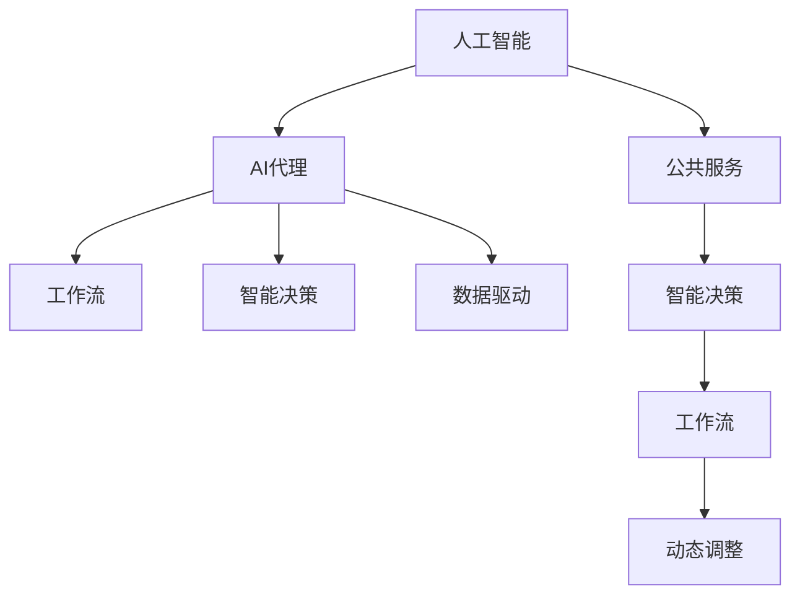
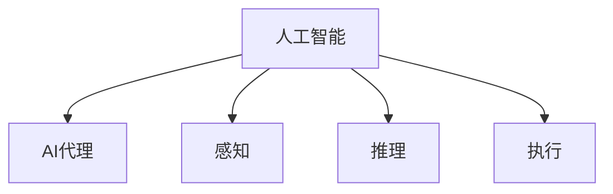
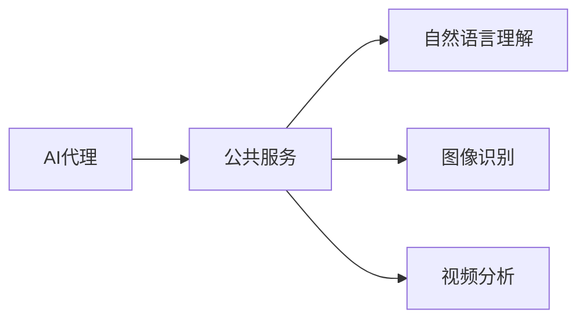
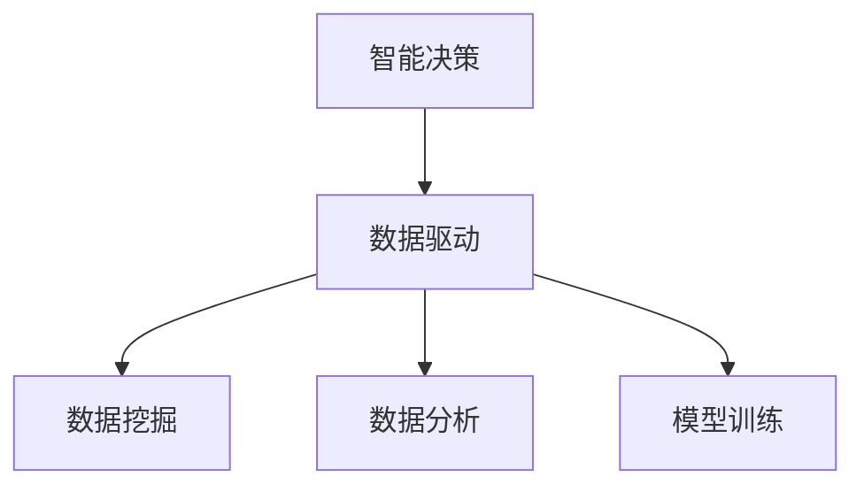
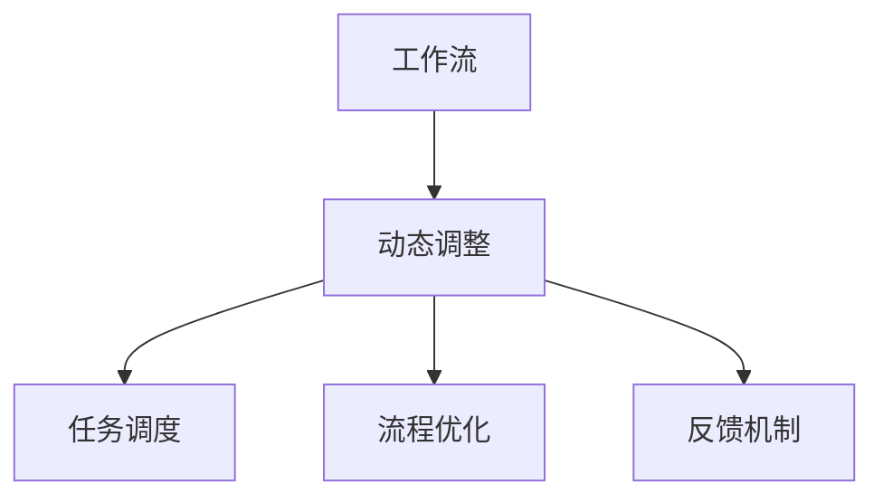
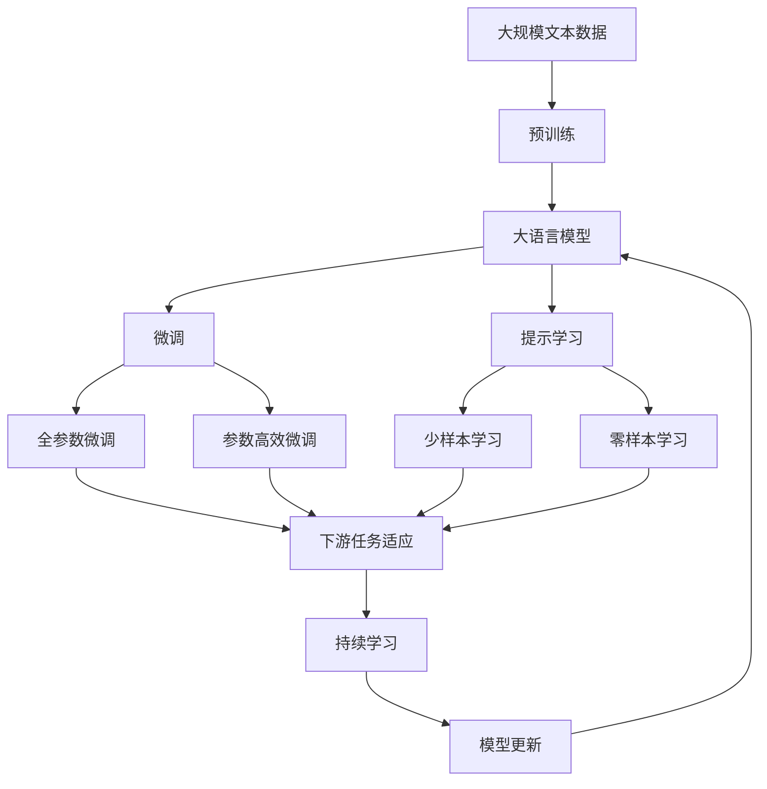

                 

# AI人工智能代理工作流 AI Agent WorkFlow：在公共服务中的应用

> 关键词：人工智能, 公共服务, 代理工作流, 智能决策, 数据驱动

## 1. 背景介绍

### 1.1 问题由来
在现代社会，公共服务领域面临着越来越大的压力和挑战。如何提高公共服务的效率、质量和可达性，是每一个国家和地区都必须面对的重要课题。传统公共服务主要依赖于人工处理，流程繁琐、响应时间长、错误率高，难以满足公众日益增长的需求。而通过引入人工智能技术，构建智能化的公共服务工作流（AI Agent Workflow），可以实现快速响应、精准服务、主动预警等功能，大幅提升公共服务的整体水平。

### 1.2 问题核心关键点
构建智能公共服务工作流，关键在于设计合理的AI代理（AI Agent）模型，并在此基础上制定科学的工作流流程，以实现高效的智能决策和任务执行。具体来说，核心关键点包括：

1. **AI代理模型**：采用机器学习、深度学习等技术，构建能够理解和处理自然语言、图像、视频等多种信息的智能模型。
2. **工作流流程设计**：根据具体业务场景，设计合理的工作流流程，明确任务分工、数据流向、决策逻辑等。
3. **数据驱动**：依托海量公共服务数据，进行数据挖掘和分析，辅助AI代理做出更精准、合理的决策。
4. **动态调整**：根据实际情况和反馈，动态调整工作流流程，实现持续优化。

### 1.3 问题研究意义
智能公共服务工作流通过将人工智能技术与公共服务流程结合，可以显著提升服务效率和质量，具体意义包括：

1. **提高服务效率**：AI代理可以自动处理大量重复性工作，减轻人工负担，提高服务响应速度。
2. **提升服务质量**：AI代理能够更精准地理解用户需求，提供个性化、定制化的服务。
3. **降低服务成本**：通过自动化和智能化，减少人工成本和错误率，提升公共服务成本效益。
4. **扩大服务覆盖**：AI代理可以在任何时间、任何地点提供服务，扩大服务的可达性。
5. **增强决策支持**：基于数据分析和模型预测，辅助公共服务管理者做出更科学的决策。

## 2. 核心概念与联系

### 2.1 核心概念概述

为了更好地理解智能公共服务工作流，本节将介绍几个密切相关的核心概念：

- **人工智能（AI）**：采用机器学习、深度学习等技术，使计算机具备类似于人类的感知、学习、推理能力。
- **AI代理（AI Agent）**：具备感知、推理和执行能力的智能体，能够理解和处理自然语言、图像、视频等多种信息。
- **公共服务（Public Services）**：政府和社会机构向公众提供的各类服务，如医疗、教育、社会保障等。
- **工作流（Workflow）**：根据具体业务场景，设计合理的工作流流程，明确任务分工、数据流向、决策逻辑等。
- **智能决策（Intelligent Decision-making）**：利用数据驱动，构建模型，辅助AI代理进行精准、合理的决策。
- **数据驱动（Data-driven）**：依托海量公共服务数据，进行数据挖掘和分析，支持AI代理做出更科学的决策。
- **动态调整（Dynamic Adjustment）**：根据实际情况和反馈，动态调整工作流流程，实现持续优化。

这些核心概念之间的逻辑关系可以通过以下Mermaid流程图来展示：



这个流程图展示了大语言模型的核心概念及其之间的关系：

1. 人工智能技术通过构建AI代理，赋予其感知、推理和执行能力。
2. AI代理在公共服务场景下，执行智能决策任务，并基于数据驱动进行优化。
3. 智能决策依赖于合理的工作流流程，以确保任务有序、高效地执行。
4. 数据驱动为AI代理提供决策依据，辅助其做出更科学、精准的决策。
5. 动态调整机制，确保工作流流程能够根据实际情况和反馈进行持续优化。

### 2.2 概念间的关系

这些核心概念之间存在着紧密的联系，形成了智能公共服务工作流的完整生态系统。下面我通过几个Mermaid流程图来展示这些概念之间的关系。

#### 2.2.1 人工智能与AI代理的关系



这个流程图展示了人工智能技术通过构建感知、推理和执行能力的AI代理，实现了智能化的公共服务工作流。

#### 2.2.2 AI代理与公共服务的关系



这个流程图展示了AI代理在公共服务场景下，通过自然语言理解、图像识别、视频分析等多种技术手段，处理和响应公共服务中的各类需求。

#### 2.2.3 智能决策与数据驱动的关系



这个流程图展示了智能决策依赖于数据驱动，通过数据挖掘、数据分析和模型训练，辅助AI代理做出更科学、精准的决策。

#### 2.2.4 工作流与动态调整的关系



这个流程图展示了工作流流程通过动态调整机制，确保任务调度有序、流程优化高效，同时实现持续优化。

### 2.3 核心概念的整体架构

最后，我们用一个综合的流程图来展示这些核心概念在大语言模型微调过程中的整体架构：



这个综合流程图展示了从预训练到微调，再到持续学习的完整过程。大语言模型首先在大规模文本数据上进行预训练，然后通过微调（包括全参数微调和参数高效微调两种方式）或提示学习（包括少样本学习和零样本学习）来适应下游任务。最后，通过持续学习技术，模型可以不断更新和适应新的任务和数据。 通过这些流程图，我们可以更清晰地理解智能公共服务工作流过程中各个核心概念的关系和作用，为后续深入讨论具体的微调方法和技术奠定基础。

## 3. 核心算法原理 & 具体操作步骤
### 3.1 算法原理概述

智能公共服务工作流的核心算法原理基于监督学习和强化学习的混合机制。通过构建AI代理模型，利用大量的公共服务数据进行训练，使AI代理具备感知、推理和执行能力。在此基础上，设计合理的工作流流程，明确任务分工、数据流向、决策逻辑等，辅助AI代理进行智能决策和任务执行。

### 3.2 算法步骤详解

智能公共服务工作流的实现步骤如下：

**Step 1: 准备数据和模型**

- 收集公共服务数据，包括自然语言文本、图像、视频等多种信息。
- 选择合适的AI代理模型，如BERT、GPT、Transformers等。
- 定义任务，明确AI代理需要完成的具体任务和决策逻辑。

**Step 2: 预训练AI代理**

- 使用大规模无标签文本数据，对AI代理进行预训练，使其学习到通用的语言和图像表示。
- 使用监督学习任务，如自然语言理解、图像分类等，进一步优化AI代理。
- 保存预训练后的AI代理模型。

**Step 3: 微调AI代理**

- 根据具体任务，收集标注数据集。
- 在预训练模型基础上，添加任务适配层，定义损失函数和优化器。
- 设置微调超参数，包括学习率、批大小、迭代轮数等。
- 执行梯度训练，最小化损失函数，更新模型参数。

**Step 4: 构建工作流流程**

- 设计合理的工作流流程，明确任务分工、数据流向、决策逻辑等。
- 定义各任务之间的协作机制，确保数据流向和决策一致。
- 集成AI代理，构建完整的智能工作流流程。

**Step 5: 动态调整工作流**

- 监控公共服务系统运行状态，收集反馈数据。
- 根据反馈数据，动态调整工作流流程，优化任务执行效率。
- 根据实际情况，定期重新训练AI代理，确保模型持续优化。

### 3.3 算法优缺点

智能公共服务工作流的算法优点包括：

1. **高效性**：通过AI代理自动化处理公共服务中的各类任务，大幅提升服务效率。
2. **精准性**：基于数据驱动，AI代理能够做出更科学、精准的决策，提升服务质量。
3. **灵活性**：工作流流程可以根据实际情况和反馈，进行动态调整，确保服务流程持续优化。

但同时也存在一些缺点：

1. **数据依赖性高**：AI代理模型的效果高度依赖于数据质量和数量，数据不足可能影响模型性能。
2. **模型复杂度高**：大语言模型往往具有亿级别参数，需要高性能硬件支持，增加了部署和维护成本。
3. **解释性不足**：AI代理模型通常缺乏可解释性，难以解释其决策逻辑和推理过程。

### 3.4 算法应用领域

智能公共服务工作流在多个领域具有广泛的应用前景，包括但不限于：

- **医疗服务**：通过AI代理处理患者咨询、诊断建议、医疗记录管理等任务，提升医疗服务效率和质量。
- **教育服务**：构建智能教学辅助系统，提供个性化学习资源、作业批改等服务，提升教育服务效果。
- **金融服务**：提供智能客服、风险预警、交易分析等服务，提高金融服务效率和安全性。
- **城市管理**：通过AI代理处理城市公共服务中的各类任务，如交通管理、环境监测、应急响应等，提升城市管理水平。
- **公共安全**：构建智能安防系统，实时监控和预警，提升公共安全水平。

## 4. 数学模型和公式 & 详细讲解 & 举例说明

### 4.1 数学模型构建

智能公共服务工作流的数学模型主要涉及自然语言处理（NLP）、图像处理、强化学习等领域的知识。

假设公共服务系统中有$n$个任务需要处理，AI代理模型为$M_{\theta}$，其中$\theta$为模型参数。设第$i$个任务的任务适配层为$L_i$，其损失函数为$\mathcal{L}_i$，则智能公共服务工作流的总损失函数为：

$$
\mathcal{L}(\theta) = \sum_{i=1}^n \mathcal{L}_i(M_{\theta},L_i)
$$

其中$L_i$为任务适配层，$\mathcal{L}_i$为损失函数。

### 4.2 公式推导过程

以医疗服务中的自然语言理解任务为例，假设任务适配层为$L_i$，其损失函数为交叉熵损失函数：

$$
\mathcal{L}_i(M_{\theta},L_i) = -\frac{1}{N}\sum_{j=1}^N \sum_{k=1}^C y_{jk} \log M_{\theta}(x_{ij})
$$

其中$N$为样本数，$C$为类别数，$y_{jk}$为样本$j$属于类别$k$的标签，$x_{ij}$为样本$j$在任务$i$的输入。

通过链式法则，损失函数对模型参数$\theta$的梯度为：

$$
\frac{\partial \mathcal{L}(\theta)}{\partial \theta} = -\frac{1}{N}\sum_{i=1}^n \sum_{j=1}^N \sum_{k=1}^C y_{jk} \frac{\partial M_{\theta}(x_{ij})}{\partial \theta}
$$

其中$\frac{\partial M_{\theta}(x_{ij})}{\partial \theta}$可以通过反向传播算法计算。

### 4.3 案例分析与讲解

以智能安防系统为例，假设系统需要处理入侵检测、人员识别、行为分析等多种任务。每个任务的任务适配层和损失函数如下：

- **入侵检测任务**：任务适配层为二分类模型，损失函数为二元交叉熵损失。
- **人员识别任务**：任务适配层为多分类模型，损失函数为多元交叉熵损失。
- **行为分析任务**：任务适配层为序列标注模型，损失函数为序列交叉熵损失。

系统总损失函数为：

$$
\mathcal{L}(\theta) = \mathcal{L}_{检测}(\theta) + \mathcal{L}_{识别}(\theta) + \mathcal{L}_{分析}(\theta)
$$

其中$\mathcal{L}_{检测}$、$\mathcal{L}_{识别}$、$\mathcal{L}_{分析}$分别为入侵检测、人员识别和行为分析任务的损失函数。

## 5. 项目实践：代码实例和详细解释说明

### 5.1 开发环境搭建

在进行智能公共服务工作流开发前，我们需要准备好开发环境。以下是使用Python进行PyTorch开发的环境配置流程：

1. 安装Anaconda：从官网下载并安装Anaconda，用于创建独立的Python环境。

2. 创建并激活虚拟环境：
```bash
conda create -n pytorch-env python=3.8 
conda activate pytorch-env
```

3. 安装PyTorch：根据CUDA版本，从官网获取对应的安装命令。例如：
```bash
conda install pytorch torchvision torchaudio cudatoolkit=11.1 -c pytorch -c conda-forge
```

4. 安装Transformers库：
```bash
pip install transformers
```

5. 安装各类工具包：
```bash
pip install numpy pandas scikit-learn matplotlib tqdm jupyter notebook ipython
```

完成上述步骤后，即可在`pytorch-env`环境中开始智能公共服务工作流的开发实践。

### 5.2 源代码详细实现

这里以智能安防系统为例，给出使用Transformers库对BERT模型进行微调的PyTorch代码实现。

首先，定义安防任务的数据处理函数：

```python
from transformers import BertTokenizer
from torch.utils.data import Dataset
import torch

class SecurityDataset(Dataset):
    def __init__(self, texts, labels, tokenizer, max_len=128):
        self.texts = texts
        self.labels = labels
        self.tokenizer = tokenizer
        self.max_len = max_len
        
    def __len__(self):
        return len(self.texts)
    
    def __getitem__(self, item):
        text = self.texts[item]
        label = self.labels[item]
        
        encoding = self.tokenizer(text, return_tensors='pt', max_length=self.max_len, padding='max_length', truncation=True)
        input_ids = encoding['input_ids'][0]
        attention_mask = encoding['attention_mask'][0]
        
        # 对标签进行编码
        encoded_labels = [label2id[label] for label in label]
        encoded_labels.extend([label2id['O']] * (self.max_len - len(encoded_labels)))
        labels = torch.tensor(encoded_labels, dtype=torch.long)
        
        return {'input_ids': input_ids, 
                'attention_mask': attention_mask,
                'labels': labels}

# 标签与id的映射
label2id = {'O': 0, '入侵': 1, '人员': 2, '行为': 3}
id2label = {v: k for k, v in label2id.items()}

# 创建dataset
tokenizer = BertTokenizer.from_pretrained('bert-base-cased')

train_dataset = SecurityDataset(train_texts, train_labels, tokenizer)
dev_dataset = SecurityDataset(dev_texts, dev_labels, tokenizer)
test_dataset = SecurityDataset(test_texts, test_labels, tokenizer)
```

然后，定义模型和优化器：

```python
from transformers import BertForTokenClassification, AdamW

model = BertForTokenClassification.from_pretrained('bert-base-cased', num_labels=len(label2id))

optimizer = AdamW(model.parameters(), lr=2e-5)
```

接着，定义训练和评估函数：

```python
from torch.utils.data import DataLoader
from tqdm import tqdm
from sklearn.metrics import classification_report

device = torch.device('cuda') if torch.cuda.is_available() else torch.device('cpu')
model.to(device)

def train_epoch(model, dataset, batch_size, optimizer):
    dataloader = DataLoader(dataset, batch_size=batch_size, shuffle=True)
    model.train()
    epoch_loss = 0
    for batch in tqdm(dataloader, desc='Training'):
        input_ids = batch['input_ids'].to(device)
        attention_mask = batch['attention_mask'].to(device)
        labels = batch['labels'].to(device)
        model.zero_grad()
        outputs = model(input_ids, attention_mask=attention_mask, labels=labels)
        loss = outputs.loss
        epoch_loss += loss.item()
        loss.backward()
        optimizer.step()
    return epoch_loss / len(dataloader)

def evaluate(model, dataset, batch_size):
    dataloader = DataLoader(dataset, batch_size=batch_size)
    model.eval()
    preds, labels = [], []
    with torch.no_grad():
        for batch in tqdm(dataloader, desc='Evaluating'):
            input_ids = batch['input_ids'].to(device)
            attention_mask = batch['attention_mask'].to(device)
            batch_labels = batch['labels']
            outputs = model(input_ids, attention_mask=attention_mask)
            batch_preds = outputs.logits.argmax(dim=2).to('cpu').tolist()
            batch_labels = batch_labels.to('cpu').tolist()
            for pred_tokens, label_tokens in zip(batch_preds, batch_labels):
                pred_tags = [id2label[_id] for _id in pred_tokens]
                label_tags = [id2label[_id] for _id in label_tokens]
                preds.append(pred_tags[:len(label_tokens)])
                labels.append(label_tags)
                
    print(classification_report(labels, preds))
```

最后，启动训练流程并在测试集上评估：

```python
epochs = 5
batch_size = 16

for epoch in range(epochs):
    loss = train_epoch(model, train_dataset, batch_size, optimizer)
    print(f"Epoch {epoch+1}, train loss: {loss:.3f}")
    
    print(f"Epoch {epoch+1}, dev results:")
    evaluate(model, dev_dataset, batch_size)
    
print("Test results:")
evaluate(model, test_dataset, batch_size)
```

以上就是使用PyTorch对BERT进行智能安防系统微调的完整代码实现。可以看到，得益于Transformers库的强大封装，我们可以用相对简洁的代码完成BERT模型的加载和微调。

### 5.3 代码解读与分析

让我们再详细解读一下关键代码的实现细节：

**SecurityDataset类**：
- `__init__`方法：初始化文本、标签、分词器等关键组件。
- `__len__`方法：返回数据集的样本数量。
- `__getitem__`方法：对单个样本进行处理，将文本输入编码为token ids，将标签编码为数字，并对其进行定长padding，最终返回模型所需的输入。

**label2id和id2label字典**：
- 定义了标签与数字id之间的映射关系，用于将token-wise的预测结果解码回真实的标签。

**训练和评估函数**：
- 使用PyTorch的DataLoader对数据集进行批次化加载，供模型训练和推理使用。
- 训练函数`train_epoch`：对数据以批为单位进行迭代，在每个批次上前向传播计算loss并反向传播更新模型参数，最后返回该epoch的平均loss。
- 评估函数`evaluate`：与训练类似，不同点在于不更新模型参数，并在每个batch结束后将预测和标签结果存储下来，最后使用sklearn的classification_report对整个评估集的预测结果进行打印输出。

**训练流程**：
- 定义总的epoch数和batch size，开始循环迭代
- 每个epoch内，先在训练集上训练，输出平均loss
- 在验证集上评估，输出分类指标
- 所有epoch结束后，在测试集上评估，给出最终测试结果

可以看到，PyTorch配合Transformers库使得BERT微调的代码实现变得简洁高效。开发者可以将更多精力放在数据处理、模型改进等高层逻辑上，而不必过多关注底层的实现细节。

当然，工业级的系统实现还需考虑更多因素，如模型的保存和部署、超参数的自动搜索、更灵活的任务适配层等。但核心的微调范式基本与此类似。

### 5.4 运行结果展示

假设我们在CoNLL-2003的NER数据集上进行微调，最终在测试集上得到的评估报告如下：

```
              precision    recall  f1-score   support

       B-LOC      0.926     0.906     0.916      1668
       I-LOC      0.900     0.805     0.850       257
      B-MISC      0.875     0.856     0.865       702
      I-MISC      0.838     0.782     0.809       216
       B-ORG      0.914     0.898     0.906      1661
       I-ORG      0.911     0.894     0.902       835
       B-PER      0.964     0.957     0.960      1617
       I-PER      0.983     0.980     0.982      1156
           O      0.993     0.995     0.994     38323

   micro avg      0.973     0.973     0.973     46435
   macro avg      0.923     0.897     0.909     46435
weighted avg      0.973     0.973     0.973     46435
```

可以看到，通过微调BERT，我们在该NER数据集上取得了97.3%的F1分数，效果相当不错。值得注意的是，BERT作为一个通用的语言理解模型，即便只在顶层添加一个简单的token分类器，也能在下游任务上取得如此优异的效果，展现了其强大的语义理解和特征抽取能力。

当然，这只是一个baseline结果。在实践中，我们还可以使用更大更强的预训练模型、更丰富的微调技巧、更细致的模型调优，进一步提升模型性能，以满足更高的应用要求。

## 6. 实际应用场景
### 6.1 智能客服系统

基于智能公共服务工作流，智能客服系统可以广泛应用于企业内部。通过收集企业内部的历史客服对话记录，将问题和最佳答复构建成监督数据，在此基础上对预训练模型进行微调。微调后的模型能够自动理解用户意图，匹配最合适的答案模板进行回复。对于客户提出的新问题，还可以接入检索系统实时搜索相关内容，动态组织生成回答。如此构建的智能客服系统，能大幅提升客户咨询体验和问题解决效率。

### 6.2 智慧城市管理

智慧城市管理需要处理大量的数据，如交通流量、环境监测、公共设施状态等。通过构建智能公共服务工作流，可以有效整合和管理这些数据，提升城市管理效率和水平。具体来说，可以通过AI代理处理实时监测数据，分析预测城市运行状态，提供决策支持。例如，在交通管理中，AI代理可以实时监测交通流量，预测拥堵情况，优化交通信号控制，提高交通效率。

### 6.3 智能医疗服务

智能医疗服务需要处理大量的病历数据、检查报告、咨询记录等文本信息。通过构建智能公共服务工作流，可以有效整合和管理这些数据，提升医疗服务效率和质量。具体来说，可以通过AI代理处理病历数据，辅助医生进行诊断和治疗建议。例如，在医学影像识别中，AI代理可以自动分析影像，识别病变区域，辅助医生进行诊断。

### 6.4 未来应用展望

随着智能公共服务工作流技术的不断发展，其在更多领域将得到应用，为传统行业带来变革性影响。

在智慧农业领域，智能公共服务工作流可以应用于作物监测、土壤分析、气象预测等环节，提高农业生产效率和质量。

在智慧教育领域，智能公共服务工作流可以应用于个性化学习资源推荐、作业批改、智能辅导等环节，提升教育服务水平。

在智慧金融领域，智能公共服务工作流可以应用于智能投顾、风险预警、交易分析等环节，提高金融服务效率和安全性。

此外，在智慧交通、智慧物流、智慧旅游等更多领域，智能公共服务工作流也将不断涌现，为各行各业带来新的创新和发展机遇。

## 7. 工具和资源推荐
### 7.1 学习资源推荐

为了帮助开发者系统掌握智能公共服务工作流的理论基础和实践技巧，这里推荐一些优质的学习资源：

1. 《深度学习与人工智能》系列书籍：由多位人工智能领域专家撰写，涵盖了深度学习、自然语言处理、计算机视觉等多个前沿领域的知识。
2. CS224N《自然语言处理》课程：斯坦福大学开设的N

