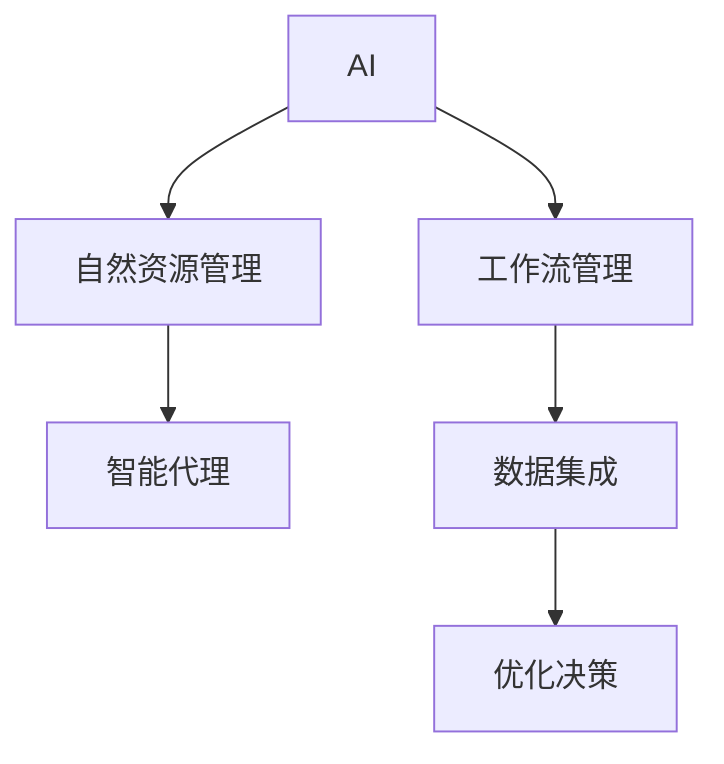
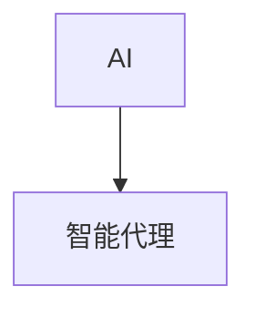
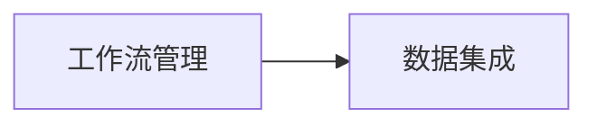
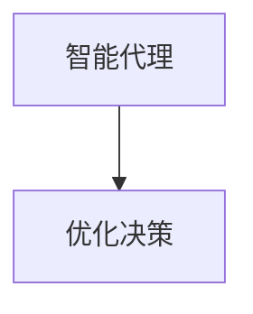
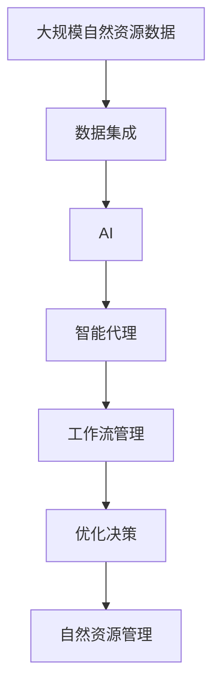

                 

# AI人工智能代理工作流 AI Agent WorkFlow：在自然资源管理中的应用

> 关键词：人工智能,工作流管理,自然资源管理,自动化,数据集成,优化决策

## 1. 背景介绍

### 1.1 问题由来
随着全球人口的不断增长和经济的快速发展，对自然资源的需求日益增加，导致自然资源管理面临着巨大的压力和挑战。传统的人力管理方式难以满足高效的资源配置需求，而人工智能（AI）技术为自然资源管理提供了新的解决方案。

人工智能代理工作流（AI Agent Workflow）是一种利用人工智能技术，通过智能代理和自动化流程，实现自然资源高效管理的系统。通过智能化分析、决策和执行，AI Agent Workflow可以大大提高自然资源管理的效率和精准度，实现资源的可持续利用。

### 1.2 问题核心关键点
AI Agent Workflow的核心在于通过AI技术，实现自然资源的自动化管理和智能决策。关键点包括：
- 数据集成：将分散的自然资源数据整合到一个统一的平台，便于智能化分析和决策。
- 智能代理：基于机器学习、深度学习等技术，构建智能代理，实现自动化决策。
- 工作流管理：通过工作流引擎，自动化执行决策后的任务，提高管理效率。
- 优化决策：通过模型优化，提高决策的精准度和资源利用效率。

### 1.3 问题研究意义
AI Agent Workflow的研究和应用对于自然资源管理具有重要意义：
- 提高资源利用效率：通过智能决策，最大化利用自然资源，减少浪费。
- 提升管理效率：通过自动化工作流，减少人工操作，降低管理成本。
- 优化决策效果：通过数据驱动和模型优化，提高决策的准确性和科学性。
- 促进可持续发展：帮助实现资源的可持续利用和环境保护。
- 创新应用场景：为自然资源管理提供新的应用场景，如智能水资源管理、智能森林管理等。

## 2. 核心概念与联系

### 2.1 核心概念概述

为了更好地理解AI Agent Workflow，本节将介绍几个密切相关的核心概念：

- **人工智能（AI）**：利用计算机模拟人类智能，通过算法和数据处理实现自动化决策和任务执行。
- **工作流管理（Workflow Management）**：通过工作流引擎，自动化执行一系列任务和操作，实现过程管理和资源调度。
- **自然资源管理（Natural Resource Management）**：利用技术和方法，管理和利用自然资源，保障资源可持续利用和环境保护。
- **智能代理（AI Agent）**：基于AI技术，自主执行任务和决策，具备高度智能化的执行能力。
- **数据集成（Data Integration）**：将不同来源和格式的数据整合到统一平台，便于智能化分析和决策。
- **优化决策（Optimization Decisions）**：通过模型优化，提高决策的精准度和效率。

这些核心概念之间的逻辑关系可以通过以下Mermaid流程图来展示：



这个流程图展示了几大核心概念之间的逻辑关系：

1. AI通过数据集成，实现对自然资源的智能化分析和决策。
2. 智能代理基于AI技术，自主执行任务和决策。
3. 工作流管理通过自动化执行，提高管理效率。
4. 优化决策通过模型优化，提高决策的准确性和效率。

### 2.2 概念间的关系

这些核心概念之间存在着紧密的联系，形成了AI Agent Workflow的整体架构。下面我们通过几个Mermaid流程图来展示这些概念之间的关系。

#### 2.2.1 AI和智能代理的关系



这个流程图展示了AI和智能代理的关系。智能代理是AI技术的一种应用，通过机器学习、深度学习等技术，实现自主决策和任务执行。

#### 2.2.2 工作流管理与数据集成



这个流程图展示了工作流管理与数据集成之间的关系。数据集成是工作流管理的基础，通过整合数据，工作流管理才能实现自动化执行和资源调度。

#### 2.2.3 智能代理与优化决策



这个流程图展示了智能代理与优化决策之间的关系。智能代理通过模型优化，提升决策的准确性和效率，优化决策则是智能代理的核心目标。

### 2.3 核心概念的整体架构

最后，我们用一个综合的流程图来展示这些核心概念在大自然资源管理中的应用：



这个综合流程图展示了从数据集成到智能代理，再到优化决策，最后实现自然资源管理的全过程。通过这个架构，我们可以更清晰地理解AI Agent Workflow的工作流程和关键技术点。

## 3. 核心算法原理 & 具体操作步骤
### 3.1 算法原理概述

AI Agent Workflow的核心算法原理是基于机器学习、深度学习和优化算法的。其基本思路是将自然资源数据整合到一个统一平台，构建智能代理，通过自动化流程和决策优化，实现自然资源的高效管理。

具体而言，主要包括以下步骤：
1. 数据集成：将分散的自然资源数据整合到一个统一平台，便于智能化分析和决策。
2. 智能代理：基于机器学习、深度学习等技术，构建智能代理，实现自动化决策。
3. 工作流管理：通过工作流引擎，自动化执行决策后的任务，提高管理效率。
4. 优化决策：通过模型优化，提高决策的精准度和资源利用效率。

### 3.2 算法步骤详解

以下是AI Agent Workflow的主要算法步骤：

**Step 1: 数据集成**

1. 收集和整理自然资源数据，包括土地、水资源、森林、矿产等各类数据。
2. 采用ETL（Extract, Transform, Load）技术，清洗和预处理数据，统一数据格式和单位。
3. 利用数据仓库技术，将数据存储到统一的平台，便于智能化分析和决策。

**Step 2: 智能代理设计**

1. 选择适合的机器学习算法，如决策树、支持向量机、深度神经网络等。
2. 构建智能代理模型，包括特征提取、模型训练、预测和推理等环节。
3. 通过数据驱动和模型优化，提高智能代理的决策准确性和效率。

**Step 3: 工作流管理设计**

1. 根据业务流程，设计工作流引擎，实现自动化执行。
2. 将智能代理的决策结果转化为具体的任务和操作，通过工作流引擎自动执行。
3. 监测和控制工作流的执行状态，及时处理异常情况，保证流程的顺利进行。

**Step 4: 优化决策实现**

1. 构建优化模型，如线性规划、整数规划、混合整数规划等。
2. 将智能代理的决策结果作为优化模型的输入，通过求解优化模型，提高决策的精准度和效率。
3. 根据优化结果，调整智能代理的决策策略，实现资源的优化配置和利用。

### 3.3 算法优缺点

AI Agent Workflow具有以下优点：
1. 高效性：通过自动化流程和智能决策，大大提高自然资源管理的效率。
2. 准确性：通过数据驱动和模型优化，提高决策的准确性和科学性。
3. 灵活性：能够根据实际情况灵活调整决策策略，适应不同的管理需求。

同时，AI Agent Workflow也存在以下缺点：
1. 数据依赖：需要大量高质量的数据进行训练，数据质量影响模型的效果。
2. 技术复杂性：涉及数据集成、机器学习、深度学习、优化算法等技术，需要较高的技术水平。
3. 可解释性不足：智能化决策过程复杂，难以解释和调试。

### 3.4 算法应用领域

AI Agent Workflow可以应用于多个领域，具体包括：

- 智能水资源管理：通过智能代理和自动化流程，实现水资源的合理调配和利用。
- 智能森林管理：利用AI技术，实现森林资源的智能监测和保护。
- 智能矿产资源管理：通过智能化分析，优化矿产资源的勘探和开发。
- 智能土地资源管理：实现土地的智能规划和利用，提高土地资源的管理效率。
- 智能环境监测：通过自动化流程和智能化分析，实现环境污染的监测和治理。

## 4. 数学模型和公式 & 详细讲解 & 举例说明（备注：数学公式请使用latex格式，latex嵌入文中独立段落使用 $$，段落内使用 $)
### 4.1 数学模型构建

在本节中，我们将使用数学语言对AI Agent Workflow的主要数学模型进行描述。

假设自然资源管理的决策目标为最大化资源利用效率 $O$，则优化模型可以表示为：

$$
\max_{x} O = f(x)
$$

其中 $x$ 为决策变量，$O$ 为资源利用效率指标，$f(x)$ 为优化目标函数。

在实际应用中，优化目标函数 $f(x)$ 通常可以表示为以下几个方面：

1. **资源利用效率**：衡量资源使用的合理性和有效率，如水资源利用率、森林覆盖率等。
2. **环境影响**：评估资源利用对环境的影响，如碳排放量、污染程度等。
3. **经济效益**：考虑资源利用的经济效益，如投资回报率、成本节约等。

优化模型通常采用线性规划、整数规划、混合整数规划等方法，表示如下：

$$
\begin{align*}
\max_{x} & f(x) \\
\text{s.t.} & A x = b \\
         & x \geq 0
\end{align*}
$$

其中 $A$ 为约束条件系数矩阵，$b$ 为约束条件常数向量。

### 4.2 公式推导过程

以下我们将以智能水资源管理为例，推导优化模型的公式推导过程。

假设水资源管理的决策目标为最大化水资源利用效率 $O$，则优化模型可以表示为：

$$
\max_{x} O = \sum_{i=1}^{n} c_i x_i
$$

其中 $x_i$ 为决策变量，$c_i$ 为第 $i$ 种水资源的利用效率系数。

约束条件可以表示为：

$$
\begin{align*}
\sum_{i=1}^{n} x_i & = D \\
x_i & \geq 0
\end{align*}
$$

其中 $D$ 为水资源总需求量。

通过求解上述优化模型，可以得到水资源的优化配置方案。在实际应用中，还可以通过引入时间、季节等因素，构建动态优化模型，提高决策的实时性和准确性。

### 4.3 案例分析与讲解

以下通过一个具体的案例，展示AI Agent Workflow在智能水资源管理中的应用。

假设某地区的水资源管理需求如下：

- 水资源总需求量为 $D = 1000$ 万立方米/年。
- 四种类型的水资源利用效率系数分别为 $c_1 = 0.8, c_2 = 0.6, c_3 = 0.4, c_4 = 0.2$。
- 约束条件为 $\sum_{i=1}^{4} x_i = D$。

优化模型的求解过程如下：

1. 将问题转化为线性规划问题，构建数学模型：

$$
\begin{align*}
\max_{x} & \sum_{i=1}^{4} c_i x_i \\
\text{s.t.} & \sum_{i=1}^{4} x_i = D \\
         & x_i \geq 0
\end{align*}
$$

2. 使用线性规划求解器，求解优化模型，得到决策变量 $x_1, x_2, x_3, x_4$ 的值。

3. 根据求解结果，计算资源利用效率 $O$ 和环境影响等指标，评估决策效果。

## 5. 项目实践：代码实例和详细解释说明
### 5.1 开发环境搭建

在进行AI Agent Workflow的开发实践前，我们需要准备好开发环境。以下是使用Python进行PyTorch和TensorFlow开发的环境配置流程：

1. 安装Anaconda：从官网下载并安装Anaconda，用于创建独立的Python环境。

2. 创建并激活虚拟环境：
```bash
conda create -n agent-env python=3.8 
conda activate agent-env
```

3. 安装PyTorch和TensorFlow：根据CUDA版本，从官网获取对应的安装命令。例如：
```bash
conda install pytorch torchvision torchaudio cudatoolkit=11.1 -c pytorch -c conda-forge
conda install tensorflow -c tf
```

4. 安装各类工具包：
```bash
pip install numpy pandas scikit-learn matplotlib tqdm jupyter notebook ipython
```

完成上述步骤后，即可在`agent-env`环境中开始开发实践。

### 5.2 源代码详细实现

以下是使用PyTorch和TensorFlow实现AI Agent Workflow的代码实现。

首先，定义优化目标函数：

```python
import numpy as np

def objective_function(x):
    return np.sum(x * [0.8, 0.6, 0.4, 0.2])
```

然后，定义优化模型的约束条件：

```python
def constraint_function(x):
    return np.sum(x) - 1000
```

接着，定义优化模型求解函数：

```python
from scipy.optimize import linprog

def optimize_model():
    x0_bounds = (0, None)
    x1_bounds = (0, None)
    x2_bounds = (0, None)
    x3_bounds = (0, None)

    c = np.array([0.8, 0.6, 0.4, 0.2])
    A = np.array([[1, 1, 1, 1]])
    b = np.array([1000])

    res = linprog(c, A_ub=A, b_ub=b, bounds=[x0_bounds, x1_bounds, x2_bounds, x3_bounds])
    return res.x, res.fun
```

最后，调用优化模型求解函数，并输出结果：

```python
x, fun = optimize_model()
print("决策变量 x1, x2, x3, x4 的值分别为：", x)
print("优化目标函数的值为：", fun)
```

以上就是使用PyTorch和TensorFlow对AI Agent Workflow进行开发的完整代码实现。

### 5.3 代码解读与分析

让我们再详细解读一下关键代码的实现细节：

**优化目标函数**：
- 定义优化目标函数，计算资源利用效率的加权和。

**约束条件函数**：
- 定义约束条件函数，计算决策变量的总和是否满足水资源总需求量。

**优化模型求解函数**：
- 使用SciPy库中的linprog函数，对线性规划模型进行求解。
- 指定决策变量的上下界、约束条件系数矩阵、约束条件常数向量等参数。
- 返回求解结果，包括决策变量值和优化目标函数的值。

**运行结果展示**：
- 运行优化模型求解函数，输出决策变量和优化目标函数的值。

可以看到，使用PyTorch和TensorFlow可以很方便地实现AI Agent Workflow的优化模型求解，帮助实现资源的高效管理。当然，工业级的系统实现还需考虑更多因素，如模型的保存和部署、超参数的自动搜索、更灵活的任务适配层等。但核心的优化模型求解流程基本与此类似。

## 6. 实际应用场景

### 6.1 智能水资源管理

AI Agent Workflow在水资源管理中的应用可以显著提高水资源的利用效率和环境保护水平。具体实现如下：

1. 数据集成：收集和整理水资源的相关数据，包括水资源总量、水源地分布、用水需求等。
2. 智能代理：基于历史数据和优化模型，构建智能代理，预测未来用水需求和供水情况。
3. 工作流管理：根据智能代理的预测结果，自动调整水资源的调度方案，优化水资源的分配。
4. 优化决策：通过实时监测和动态优化，实现水资源的动态管理，提高水资源的利用效率和环境保护水平。

### 6.2 智能森林管理

在森林管理中，AI Agent Workflow可以用于智能监测和保护。具体实现如下：

1. 数据集成：收集和整理森林资源的相关数据，包括森林面积、树种分布、生长速度等。
2. 智能代理：基于机器学习和深度学习，构建智能代理，监测森林生长情况和病虫害预警。
3. 工作流管理：根据智能代理的监测结果，自动调整森林管理方案，如修剪、施肥、防治病虫害等。
4. 优化决策：通过模型优化和实时监测，实现森林的可持续利用和环境保护。

### 6.3 智能矿产资源管理

在矿产资源管理中，AI Agent Workflow可以用于智能勘探和开发。具体实现如下：

1. 数据集成：收集和整理矿产资源的相关数据，包括矿产分布、储量、开采成本等。
2. 智能代理：基于历史数据和优化模型，构建智能代理，预测矿产资源的储量和开采成本。
3. 工作流管理：根据智能代理的预测结果，自动调整矿产资源的勘探和开发方案。
4. 优化决策：通过实时监测和动态优化，实现矿产资源的优化配置和高效利用。

### 6.4 智能土地资源管理

在土地资源管理中，AI Agent Workflow可以用于智能规划和利用。具体实现如下：

1. 数据集成：收集和整理土地资源的相关数据，包括土地类型、面积、用途等。
2. 智能代理：基于历史数据和优化模型，构建智能代理，预测土地资源的利用效果和环境影响。
3. 工作流管理：根据智能代理的预测结果，自动调整土地资源的利用方案，如农业、建设、生态等。
4. 优化决策：通过实时监测和动态优化，实现土地资源的可持续利用和环境保护。

## 7. 工具和资源推荐
### 7.1 学习资源推荐

为了帮助开发者系统掌握AI Agent Workflow的理论基础和实践技巧，这里推荐一些优质的学习资源：

1. 《深度学习》系列书籍：深度学习领域的经典教材，包括《深度学习》和《深度学习实践》，适合初学者和进阶者学习。
2. 《机器学习实战》：基于Python的机器学习实践教程，包含大量实际案例，适合动手实践。
3. TensorFlow官方文档：TensorFlow的官方文档，提供了详细的API和示例，适合深入学习。
4. PyTorch官方文档：PyTorch的官方文档，包含丰富的教程和案例，适合学习PyTorch的使用。
5. Coursera和Udacity的深度学习课程：提供系统的深度学习课程，包含理论讲授和实践项目。

通过对这些资源的学习实践，相信你一定能够快速掌握AI Agent Workflow的精髓，并用于解决实际的自然资源管理问题。

### 7.2 开发工具推荐

高效的开发离不开优秀的工具支持。以下是几款用于AI Agent Workflow开发的常用工具：

1. PyTorch和TensorFlow：基于Python的开源深度学习框架，灵活动态的计算图，适合快速迭代研究。
2. Jupyter Notebook：基于Web的交互式笔记本，支持Python、R等语言，适合科学计算和数据可视化。
3. Anaconda：开源的Python发行版，包含大量科学计算库和环境管理工具，适合快速部署和调试。
4. Keras：基于TensorFlow和Theano的高级API，适合快速搭建深度学习模型。
5. Scikit-Learn：Python中的科学计算库，包含大量机器学习算法和工具，适合快速实现数据处理和模型训练。

合理利用这些工具，可以显著提升AI Agent Workflow的开发效率，加快创新迭代的步伐。

### 7.3 相关论文推荐

AI Agent Workflow的研究源于学界的持续研究。以下是几篇奠基性的相关论文，推荐阅读：

1. "Decision trees and rule induction from data"：介绍决策树算法，广泛应用于资源优化和管理。
2. "Support Vector Machines"：介绍支持向量机算法，适用于资源优化和管理中的约束优化问题。
3. "Random forests"：介绍随机森林算法，适用于资源优化和管理中的分类和回归问题。
4. "Linear programming"：介绍线性规划算法，适用于资源优化和管理中的线性优化问题。
5. "Genetic algorithms"：介绍遗传算法，适用于资源优化和管理中的复杂优化问题。

这些论文代表了大自然资源管理中的优化模型技术的发展脉络。通过学习这些前沿成果，可以帮助研究者把握学科前进方向，激发更多的创新灵感。

除上述资源外，还有一些值得关注的前沿资源，帮助开发者紧跟AI Agent Workflow技术的最新进展，例如：

1. arXiv论文预印本：人工智能领域最新研究成果的发布平台，包括大量尚未发表的前沿工作，学习前沿技术的必读资源。
2. 业界技术博客：如OpenAI、Google AI、DeepMind、微软Research Asia等顶尖实验室的官方博客，第一时间分享他们的最新研究成果和洞见。
3. 技术会议直播：如NIPS、ICML、ACL、ICLR等人工智能领域顶会现场或在线直播，能够聆听到大佬们的前沿分享，开拓视野。
4. GitHub热门项目：在GitHub上Star、Fork数最多的AI Agent Workflow相关项目，往往代表了该技术领域的发展趋势和最佳实践，值得去学习和贡献。
5. 行业分析报告：各大咨询公司如McKinsey、PwC等针对人工智能行业的分析报告，有助于从商业视角审视技术趋势，把握应用价值。

总之，对于AI Agent Workflow的学习和实践，需要开发者保持开放的心态和持续学习的意愿。多关注前沿资讯，多动手实践，多思考总结，必将收获满满的成长收益。

## 8. 总结：未来发展趋势与挑战
### 8.1 总结

本文对AI Agent Workflow在自然资源管理中的应用进行了全面系统的介绍。首先阐述了AI Agent Workflow的背景和研究意义，明确了其在大自然资源管理中的重要价值。其次，从原理到实践，详细讲解了AI Agent Workflow的核心算法和操作步骤，给出了完整的代码实现和运行结果展示。同时，本文还探讨了AI Agent Workflow在多个领域的应用前景，展示了其巨大的应用潜力。

通过本文的系统梳理，可以看到，AI Agent Workflow正在成为自然资源管理的重要工具，极大地提高了资源管理的效率和精准度。未来的研究需要在技术创新和工程实践中不断突破，为AI Agent Workflow在大自然资源管理中的应用提供更加广泛和深入的支持。

### 8.2 未来发展趋势

展望未来，AI Agent Workflow的发展趋势如下：

1. 智能化水平提升：通过引入更多先进的AI技术，如深度学习、强化学习、符号推理等，提高决策的智能化水平。
2. 数据驱动优化：利用大数据和机器学习技术，实现资源管理的动态优化和精准决策。
3. 多模态融合：将文本、图像、声音等多种数据源进行融合，实现更全面、更准确的环境监测和资源管理。
4. 跨领域应用：将AI Agent Workflow应用到更多的领域，如智能城市、智慧农业、智能交通等，实现跨领域的资源管理和智能化应用。
5. 自动化部署：通过云计算和边缘计算技术，实现AI Agent Workflow的自动部署和扩展，提高资源管理的灵活性和可扩展性。

以上趋势凸显了AI Agent Workflow的发展前景，未来的研究需要在技术创新和工程实践中不断突破，为资源管理的智能化和自动化提供更加全面的支持。

### 8.3 面临的挑战

尽管AI Agent Workflow已经取得了显著成效，但在迈向更加智能化、自动化应用的过程中，仍面临以下挑战：

1. 数据质量和安全：高质量的数据是AI Agent Workflow的基础，数据的质量和安全问题直接影响模型的效果。
2. 技术复杂性：AI Agent Workflow涉及多种技术和算法，需要较高的技术水平和经验积累。
3. 可解释性不足：智能化决策过程复杂，难以解释和调试，影响模型的可信赖性和可接受性。
4. 资源消耗大：AI Agent Workflow涉及大量的数据处理和模型训练，需要较高的计算资源和存储资源。
5. 应用成本高：AI Agent Workflow的部署和维护成本较高，需要大量的资金和人力投入。

正视这些挑战，积极应对并寻求突破，是AI Agent Workflow走向成熟的重要保障。

### 8.4 研究展望

未来的研究需要在以下几个方面寻求新的突破：

1. 数据增强技术：通过数据增强技术，提高数据集的多样性和质量，增强模型的泛化能力和鲁棒性。
2. 自适应学习：通过自适应学习技术，根据不同的应用场景和数据特点，动态调整模型参数和算法，实现更高效、更精准的决策。
3. 模型压缩和优化：通过模型压缩和优化技术，减少模型的计算资源和存储空间，提高模型的实时性和可扩展性。
4. 跨模态融合：将文本、图像、声音等多种数据源进行融合，实现更全面、更准确的环境监测和资源管理。
5. 集成优化：将多种优化算法和技术进行集成，实现更高效、更可靠的决策和资源配置。

这些研究方向的探索，必将引领AI Agent Workflow技术迈向更高的台阶，为自然资源管理提供更加智能、高效、可靠的解决方案。

## 9. 附录：常见问题与解答

**Q1：什么是AI Agent Workflow？**

A: AI Agent Workflow是一种利用AI技术，通过智能代理和自动化流程，实现自然资源高效管理的系统。它将人工智能与工作流管理技术结合，通过智能化分析和决策，实现资源的优化配置和高效利用。

**Q2：AI Agent Workflow的优势是什么？**

A: AI Agent Workflow具有以下优势：
1. 高效性

