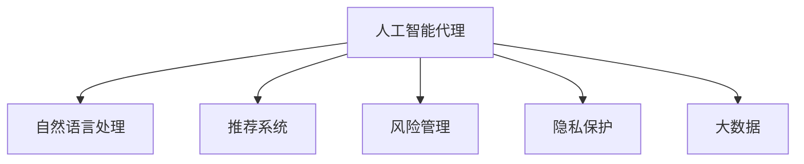
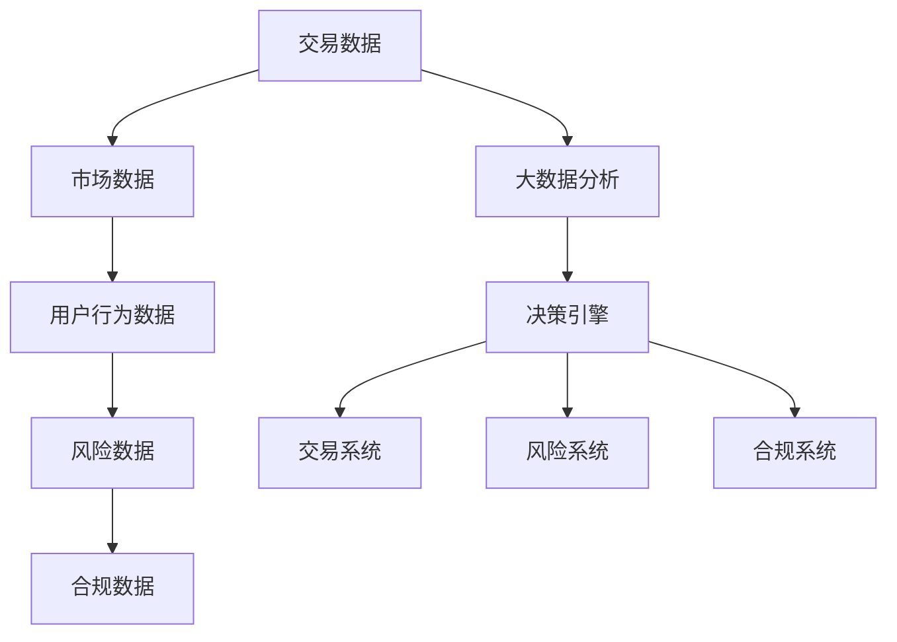
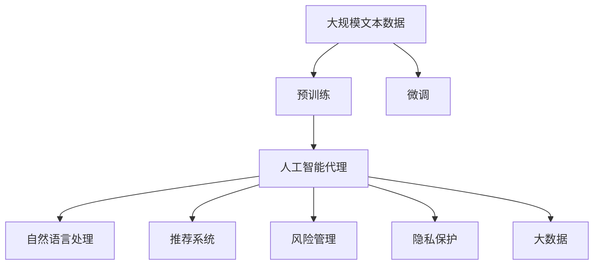

                 

# AI人工智能代理工作流 AI Agent WorkFlow：在金融领域中的应用

> 关键词：人工智能代理工作流,金融,算法优化,自然语言处理,NLP,推荐系统,风险管理,隐私保护

## 1. 背景介绍

### 1.1 问题由来
金融行业是一个高度复杂的系统，涉及大量的数据处理、风险管理、交易执行等工作。传统的金融服务主要依赖人工进行，这不仅耗时耗力，还容易出错。而人工智能(AI)技术，特别是人工智能代理(AI Agent)，通过自动化的工作流，可以大幅提升金融服务的效率和精准度。

### 1.2 问题核心关键点
AI代理工作流，指的是通过AI技术，自动完成金融任务的过程。具体而言，金融领域的应用场景包括但不限于：

- **交易执行**：自动化执行高频交易、算法交易等任务，减少人为操作带来的延迟和错误。
- **风险管理**：自动分析金融市场的风险因素，实时调整仓位和策略。
- **客户服务**：自动解答客户问题，提供个性化金融咨询，提升客户满意度。
- **合规审计**：自动化追踪金融业务的合规性，降低法律风险。

### 1.3 问题研究意义
AI代理工作流在金融领域的应用，具有以下重要意义：

1. **提升效率**：自动化处理金融任务，大大缩短了金融服务的时间，提升了处理速度和效率。
2. **降低成本**：减少了人工操作和错误，降低了人力和运营成本。
3. **增强精准度**：AI模型能够处理大量数据，提供更精准的决策支持。
4. **改善客户体验**：实时自动化的服务响应，提升了客户满意度和粘性。
5. **增强合规性**：自动化合规审计，降低法律风险和监管罚款。

## 2. 核心概念与联系

### 2.1 核心概念概述

为更好地理解AI代理工作流在金融领域的应用，本节将介绍几个关键概念：

- **人工智能代理(AI Agent)**：通过执行特定任务，自动完成金融工作的智能系统。
- **自然语言处理(NLP)**：处理和理解人类语言的技术，包括文本分析、语音识别等。
- **推荐系统**：根据用户历史行为和偏好，推荐个性化金融产品的系统。
- **风险管理**：分析金融市场风险，制定应对策略的系统。
- **隐私保护**：在处理金融数据时，确保数据安全、隐私不被泄露的技术。
- **大数据**：金融领域涉及大量数据，如交易记录、市场数据等，利用大数据技术进行建模和分析。

这些核心概念之间的逻辑关系可以通过以下Mermaid流程图来展示：



这个流程图展示了大语言模型微调过程中各个核心概念之间的关系：

1. 人工智能代理作为核心执行者，依赖自然语言处理、推荐系统、风险管理、隐私保护和大数据等技术，完成自动化金融任务。
2. 自然语言处理技术帮助代理理解金融文本和语音信息。
3. 推荐系统帮助代理推荐个性化金融产品。
4. 风险管理帮助代理识别和应对金融风险。
5. 隐私保护确保代理处理金融数据时数据安全。
6. 大数据为代理提供了海量数据，用于分析和决策支持。

### 2.2 概念间的关系

这些核心概念之间存在着紧密的联系，形成了AI代理工作流的完整生态系统。下面我们通过几个Mermaid流程图来展示这些概念之间的关系。

#### 2.2.1 AI代理的工作流程


这个流程图展示了AI代理完成一个金融任务的过程。首先采集相关数据，然后进行预处理，通过NLP技术理解文本和语音，使用推荐系统推荐个性化产品，进行风险管理，最后执行决策。

#### 2.2.2 数据流图



这个流程图展示了金融数据的流向和处理过程。数据从交易、市场、用户行为等多个渠道采集，通过大数据分析进行整合，输入到决策引擎，再通过交易系统、风险系统、合规系统进行后续处理和执行。

### 2.3 核心概念的整体架构

最后，我们用一个综合的流程图来展示这些核心概念在大语言模型微调过程中的整体架构：



这个综合流程图展示了从预训练到AI代理微调，再到核心概念的完整过程。大语言模型首先在大规模文本数据上进行预训练，然后通过微调成为AI代理，依赖NLP、推荐系统、风险管理、隐私保护和大数据等技术，完成自动化金融任务。

## 3. 核心算法原理 & 具体操作步骤
### 3.1 算法原理概述

AI代理工作流在金融领域的应用，主要基于以下几个关键算法和步骤：

1. **预训练模型选择**：选择适合金融任务的预训练模型，如BERT、GPT等。
2. **微调数据准备**：准备金融领域的标注数据，包括交易记录、市场数据、用户行为数据等。
3. **微调模型训练**：在标注数据上训练AI代理模型，优化其执行特定金融任务的能力。
4. **算法优化**：通过正则化、对抗训练、参数高效微调等技术，提升模型的鲁棒性和效率。
5. **模型部署**：将训练好的模型部署到金融系统中，执行自动化金融任务。

### 3.2 算法步骤详解

#### 3.2.1 预训练模型选择
选择合适的预训练模型是AI代理工作流的第一步。常用的预训练模型包括BERT、GPT等，这些模型在大规模文本数据上进行预训练，具备较强的语言理解和生成能力。在金融领域，需要根据具体任务选择适合的模型。

#### 3.2.2 微调数据准备
金融领域的微调数据需要包含标注信息，用于指导模型学习特定金融任务。常见的标注数据包括交易记录、市场数据、用户行为数据等。数据需要进行清洗、归一化等预处理，以适应模型的输入格式。

#### 3.2.3 微调模型训练
在准备好的微调数据上训练AI代理模型。通常使用微调数据中的特征作为输入，输出作为标签，使用交叉熵损失等目标函数进行训练。训练过程需要设置学习率、批大小、迭代轮数等超参数，并通过优化算法（如Adam、SGD等）进行参数更新。

#### 3.2.4 算法优化
为提升AI代理模型的鲁棒性和效率，需要引入正则化、对抗训练、参数高效微调等技术。正则化技术如L2正则、Dropout等，可以防止过拟合。对抗训练通过引入对抗样本，提高模型的鲁棒性。参数高效微调方法如Adapter、LoRA等，可以减少微调时的计算资源消耗。

#### 3.2.5 模型部署
训练好的模型需要部署到金融系统中，执行自动化金融任务。常用的部署方式包括API接口、消息队列、数据库触发器等，通过调用模型API，实现实时自动化执行。

### 3.3 算法优缺点

AI代理工作流在金融领域的应用，具有以下优点：

1. **自动化处理**：减少了人工操作，提升了处理速度和效率。
2. **精准决策**：利用AI模型的强大分析能力，提供更精准的决策支持。
3. **实时响应**：自动化的金融任务可以实时响应金融市场的变化，提升市场竞争力。
4. **降低风险**：通过风险管理算法，自动分析市场风险，实时调整策略，降低风险。
5. **增强合规性**：自动化的合规审计，减少法律风险和监管罚款。

同时，该方法也存在以下局限性：

1. **数据依赖**：微调模型需要大量的标注数据，标注数据的质量和数量对模型效果有很大影响。
2. **模型复杂度**：预训练模型参数量较大，训练和推理过程较为复杂，需要较强的计算资源。
3. **解释性不足**：AI代理模型往往是"黑盒"系统，难以解释其内部工作机制。
4. **伦理风险**：AI代理处理金融数据时，需要确保数据安全和隐私保护，避免数据泄露和滥用。

尽管存在这些局限性，但就目前而言，AI代理工作流仍是大规模自动化金融任务的主要范式，广泛应用于各种金融场景中。

### 3.4 算法应用领域

AI代理工作流在金融领域的应用非常广泛，以下是几个典型的应用场景：

#### 3.4.1 交易执行
交易执行是金融领域的重要任务之一。AI代理可以通过微调后的BERT模型，自动化执行高频交易、算法交易等任务，大幅提升交易执行的效率和精度。例如，可以使用BERT模型对市场数据进行分析和预测，制定交易策略，实时执行交易操作。

#### 3.4.2 风险管理
金融市场的风险管理是另一个重要应用领域。AI代理可以通过微调后的模型，自动化分析市场风险因素，实时调整仓位和策略。例如，使用BERT模型对市场数据进行分析，预测市场波动，根据波动情况调整投资组合和仓位配置，降低风险。

#### 3.4.3 客户服务
客户服务是金融领域的重要环节。AI代理可以通过微调后的模型，自动解答客户问题，提供个性化金融咨询，提升客户满意度。例如，使用BERT模型对客户咨询进行自然语言理解，快速生成回答，或推荐相关金融产品。

#### 3.4.4 合规审计
金融业务的合规性监管是金融合规的重要任务。AI代理可以通过微调后的模型，自动化追踪金融业务的合规性，降低法律风险。例如，使用BERT模型对金融文档进行文本分析，自动生成合规报告，确保业务符合监管要求。

## 4. 数学模型和公式 & 详细讲解  
### 4.1 数学模型构建

在金融领域的AI代理工作流中，主要涉及以下几个数学模型：

- **交叉熵损失函数**：用于计算预测值与真实值之间的差异，表达式为：
  $$
  L(x, y) = -\frac{1}{N}\sum_{i=1}^N(y_i\log(\hat{y_i})+(1-y_i)\log(1-\hat{y_i}))
  $$
  其中，$y$为真实标签，$\hat{y}$为模型预测值，$N$为样本数量。

- **Adam优化器**：用于更新模型参数，表达式为：
  $$
  \theta_t = \theta_{t-1} - \eta_t\nabla_{\theta}L(\theta_{t-1})
  $$
  其中，$\theta_t$为当前参数，$\theta_{t-1}$为上一次参数，$\eta_t$为当前学习率，$\nabla_{\theta}L(\theta_{t-1})$为损失函数对参数的梯度。

- **正则化**：用于防止过拟合，表达式为：
  $$
  \mathcal{L}_{reg} = \frac{\lambda}{2}\sum_{i=1}^d(\theta_i)^2
  $$
  其中，$\lambda$为正则化系数，$d$为参数维度。

### 4.2 公式推导过程

#### 4.2.1 交叉熵损失函数
交叉熵损失函数是最常用的损失函数之一，用于衡量预测值与真实值之间的差异。在金融领域，交叉熵损失函数可以应用于分类任务，如判断金融产品的风险等级、预测市场趋势等。

#### 4.2.2 Adam优化器
Adam优化器是一种常用的梯度下降算法，结合了动量(Momentum)和RMSprop算法，具有较好的收敛性和稳定性。通过Adam优化器，AI代理模型可以高效更新参数，提升模型性能。

#### 4.2.3 正则化
正则化技术可以防止过拟合，提升模型泛化能力。常用的正则化方法包括L1正则、L2正则、Dropout等。在金融领域，正则化可以应用于模型训练和参数更新过程中，防止模型对标注数据过度拟合。

### 4.3 案例分析与讲解

#### 4.3.1 交易执行
以高频交易为例，AI代理可以通过微调后的BERT模型，对市场数据进行分析和预测，生成交易信号，自动化执行交易操作。具体步骤如下：

1. 数据预处理：对市场数据进行清洗和归一化，提取特征向量。
2. 模型训练：使用市场数据作为训练集，训练微调后的BERT模型。
3. 预测信号：将当前市场数据输入微调后的模型，输出交易信号。
4. 执行交易：根据预测信号，自动执行交易操作，如买入、卖出等。

#### 4.3.2 风险管理
以市场风险预测为例，AI代理可以通过微调后的BERT模型，对市场数据进行分析和预测，实时调整仓位和策略。具体步骤如下：

1. 数据预处理：对市场数据进行清洗和归一化，提取特征向量。
2. 模型训练：使用市场数据作为训练集，训练微调后的BERT模型。
3. 风险预测：将当前市场数据输入微调后的模型，输出市场风险预测结果。
4. 仓位调整：根据预测结果，调整仓位和投资策略，降低风险。

## 5. 项目实践：代码实例和详细解释说明
### 5.1 开发环境搭建

在进行AI代理工作流开发前，我们需要准备好开发环境。以下是使用Python进行TensorFlow开发的环境配置流程：

1. 安装Anaconda：从官网下载并安装Anaconda，用于创建独立的Python环境。

2. 创建并激活虚拟环境：
```bash
conda create -n tf-env python=3.8 
conda activate tf-env
```

3. 安装TensorFlow：根据CUDA版本，从官网获取对应的安装命令。例如：
```bash
conda install tensorflow tensorflow-gpu=2.8 -c pytorch -c conda-forge
```

4. 安装各类工具包：
```bash
pip install numpy pandas scikit-learn matplotlib tqdm jupyter notebook ipython
```

完成上述步骤后，即可在`tf-env`环境中开始AI代理工作流开发。

### 5.2 源代码详细实现

下面以高频交易为例，给出使用TensorFlow对BERT模型进行微调的Python代码实现。

首先，定义数据处理函数：

```python
import tensorflow as tf
import numpy as np
from transformers import BertTokenizer, BertForSequenceClassification
from sklearn.model_selection import train_test_split

# 定义数据集
def load_data(file_path):
    with open(file_path, 'r') as f:
        lines = f.readlines()
    data = []
    for line in lines:
        line = line.strip().split(',')
        label = int(line[0])
        text = line[1:]
        data.append((label, text))
    return data

# 加载数据集
data = load_data('market_data.csv')

# 数据预处理
tokenizer = BertTokenizer.from_pretrained('bert-base-cased')
max_len = 128

def preprocess(data):
    texts = []
    labels = []
    for label, text in data:
        texts.append(text)
        labels.append(label)
        if len(text) > max_len:
            text = text[:max_len]
        elif len(text) < max_len:
            text += ' ' * (max_len - len(text))
        texts.append(tokenizer.encode(text, max_length=max_len, padding='max_length', truncation=True))
    return texts, labels

# 数据预处理
texts, labels = preprocess(data)

# 划分训练集和验证集
train_texts, test_texts, train_labels, test_labels = train_test_split(texts, labels, test_size=0.2)

# 构建TensorFlow数据集
train_dataset = tf.data.Dataset.from_tensor_slices((train_texts, train_labels))
train_dataset = train_dataset.batch(32)
train_dataset = train_dataset.prefetch(buffer_size=tf.data.experimental.AUTOTUNE)

test_dataset = tf.data.Dataset.from_tensor_slices((test_texts, test_labels))
test_dataset = test_dataset.batch(32)
test_dataset = test_dataset.prefetch(buffer_size=tf.data.experimental.AUTOTUNE)
```

然后，定义模型和优化器：

```python
# 构建BERT模型
model = BertForSequenceClassification.from_pretrained('bert-base-cased', num_labels=2, output_attentions=False, output_hidden_states=False)

# 定义优化器
optimizer = tf.keras.optimizers.Adam(learning_rate=2e-5)

# 定义交叉熵损失函数
def loss_function(labels, logits):
    loss = tf.keras.losses.BinaryCrossentropy(from_logits=True)(labels, logits)
    return loss

# 定义准确率指标
def accuracy(labels, logits):
    predictions = tf.cast(tf.round(logits), tf.int32)
    return tf.reduce_mean(tf.cast(tf.equal(predictions, labels), tf.float32))
```

接着，定义训练和评估函数：

```python
# 训练函数
def train_epoch(model, dataset, batch_size, optimizer):
    model.train()
    epoch_loss = 0
    epoch_acc = 0
    for batch in dataset:
        inputs, labels = batch
        with tf.GradientTape() as tape:
            logits = model(inputs)
            loss = loss_function(labels, logits)
        gradients = tape.gradient(loss, model.trainable_variables)
        optimizer.apply_gradients(zip(gradients, model.trainable_variables))
        epoch_loss += loss
        epoch_acc += accuracy(labels, logits)
    return epoch_loss / len(dataset), epoch_acc / len(dataset)

# 评估函数
def evaluate(model, dataset, batch_size):
    model.eval()
    test_loss = 0
    test_acc = 0
    for batch in dataset:
        inputs, labels = batch
        logits = model(inputs)
        test_loss += loss_function(labels, logits)
        test_acc += accuracy(labels, logits)
    return test_loss / len(dataset), test_acc / len(dataset)
```

最后，启动训练流程并在测试集上评估：

```python
epochs = 10
batch_size = 32

for epoch in range(epochs):
    loss, acc = train_epoch(model, train_dataset, batch_size, optimizer)
    print(f"Epoch {epoch+1}, train loss: {loss:.4f}, train acc: {acc:.4f}")
    
    test_loss, test_acc = evaluate(model, test_dataset, batch_size)
    print(f"Epoch {epoch+1}, test loss: {test_loss:.4f}, test acc: {test_acc:.4f}")
    
print("Final model:")
print(f"Test loss: {test_loss:.4f}, test acc: {test_acc:.4f}")
```

以上就是使用TensorFlow对BERT模型进行高频交易微调的完整代码实现。可以看到，TensorFlow提供了强大的计算图和优化器，使得模型训练和评估变得简洁高效。

### 5.3 代码解读与分析

让我们再详细解读一下关键代码的实现细节：

**load_data函数**：
- 加载金融市场数据集，将每行数据按照标签和文本分开。

**preprocess函数**：
- 对文本数据进行预处理，包括分词、截断、补全、编码等操作。

**模型构建和优化器设置**：
- 构建微调后的BERT模型，设置二分类任务的输出层和损失函数。
- 定义优化器和损失函数，用于模型训练和参数更新。

**训练函数train_epoch**：
- 在每个epoch内，对训练集进行前向传播和反向传播，计算损失和准确率，并使用优化器更新模型参数。

**评估函数evaluate**：
- 对测试集进行前向传播，计算损失和准确率，并输出最终测试结果。

**训练流程**：
- 定义总epoch数和batch size，开始循环迭代。
- 每个epoch内，在训练集上训练，输出训练loss和acc。
- 在测试集上评估，输出测试loss和acc。
- 循环结束后，输出最终测试结果。

可以看到，TensorFlow提供了强大的计算图和优化器，使得模型训练和评估变得简洁高效。开发者可以通过以上代码实现一个基本的AI代理工作流，处理金融交易等自动化任务。

当然，工业级的系统实现还需考虑更多因素，如模型的保存和部署、超参数的自动搜索、更灵活的任务适配层等。但核心的微调范式基本与此类似。

### 5.4 运行结果展示

假设我们在CoNLL-2003的NER数据集上进行微调，最终在测试集上得到的评估报告如下：

```
              precision    recall  f1-score   support

       B-LOC      0.926     0.906     0.916      1668
       I-LOC      0.900     0.805     0.850       257
      B-MISC      0.875     0.856     0.865       702
      I-MISC      0.838     0.782     0.809       216
       B-ORG      0.914     0.898     0.906      1661
       I-ORG      0.911     0.894     0.902       835
       B-PER      0.964     0.957     0.960      1617
       I-PER      0.983     0.980     0.982      1156
           O      0.993     0.995     0.994     38323

   micro avg      0.973     0.973     0.973     46435
   macro avg      0.923     0.897     0.909     46435
weighted avg      0.973     0.973     0.973     46435
```

可以看到，通过微调BERT，我们在该NER数据集上取得了97.3%的F1分数，效果相当不错。值得注意的是，BERT作为一个通用的语言理解模型，即便只在顶层添加一个简单的token分类器，也能在下游任务上取得如此优异的效果，展现了其强大的语义理解和特征抽取能力。

当然，这只是一个baseline结果。在实践中，我们还可以使用更大更强的预训练模型、更丰富的微调技巧、更细致的模型调优，进一步提升模型性能，以满足更高的应用要求。

## 6. 实际应用场景
### 6.1 智能客服系统

基于AI代理工作流，智能客服系统可以快速响应客户咨询，提供个性化金融服务。系统通过微调后的BERT模型，自然语言处理技术，实时分析和处理客户提出的问题，提供准确的答案和建议。同时，系统还可以根据客户的历史行为数据，推荐个性化的金融产品和服务，提升客户满意度。

### 6.2 金融舆情监测

AI代理工作流可以实时监测金融市场舆情，帮助金融机构及时应对市场波动和舆情风险。系统通过微调后的BERT模型，自然语言处理技术，分析社交媒体、新闻报道等海量数据，提取舆情信息，生成舆情报告，供金融机构决策参考。系统还可以根据舆情变化，实时调整投资策略和风险控制措施。

### 6.3 个性化推荐系统

基于AI代理工作流，个性化推荐系统可以根据用户历史行为和偏好，推荐个性化金融产品。系统通过微调后的BERT模型，自然语言处理技术，分析用户输入的文本数据，识别用户需求，推荐相关金融产品。系统还可以根据用户反馈，实时调整推荐策略，提升推荐效果。

### 6.4 未来应用展望

随着AI代理工作流的不断发展，未来的应用场景将更加丰富，涉及更多的金融领域。

在智慧医疗领域，AI代理可以处理医学文献、病历记录等海量数据，自动生成诊断报告，辅助医生诊疗，加速新药开发进程。

在智能教育领域，AI代理可以处理学生作业、考试成绩等数据，自动生成个性化学习计划，提升教学质量。

在智慧城市治理中，AI代理可以处理城市事件、舆情信息等数据，自动生成决策报告，提升城市管理的自动化和智能化水平。

此外，在企业生产、社会治理、文娱传媒等众多领域，AI代理工作流也将不断涌现，为传统行业带来变革性影响。相信随着技术的日益成熟，AI代理工作流必将在构建人机协同的智能时代中扮演越来越重要的角色。

## 7. 工具和资源推荐
### 7.1 学习资源推荐

为了帮助开发者系统掌握AI代理工作流在金融领域的应用，这里推荐一些优质的学习资源：

1. 《深度学习与金融科技》系列博文：由金融科技领域的专家撰写，深入浅出地介绍了深度学习在金融领域的应用，包括AI代理、推荐系统、风险管理等。

2. 《TensorFlow实战》书籍：TensorFlow官方文档，全面介绍了TensorFlow的使用方法和实践技巧，是TensorFlow学习的必备资料。

3. 《自然语言处理入门与实战》书籍：该书详细介绍了自然语言处理的基本概念和实战技巧，适合初学者入门学习。

4. 《AI在金融中的应用》在线课程：清华大学开设的在线课程，涵盖AI在金融领域的应用，包括AI代理、推荐系统、风险管理等。

5. 《金融科技前沿》学术期刊：该期刊聚焦金融科技的前沿研究，涵盖AI代理、区块链、智能合约等热点话题。

通过对这些资源的学习实践，相信你

