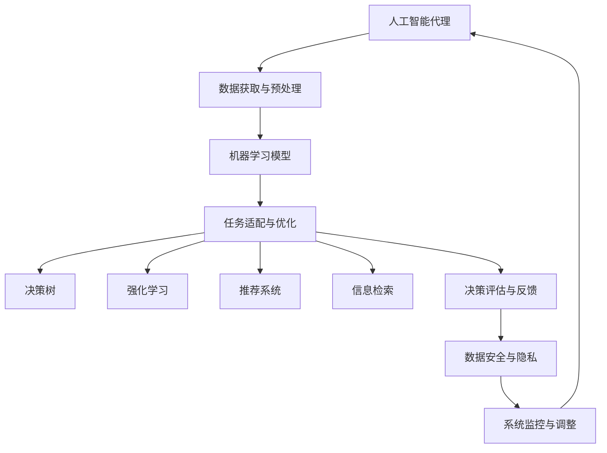
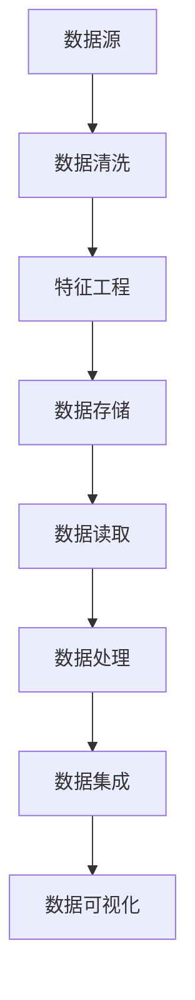
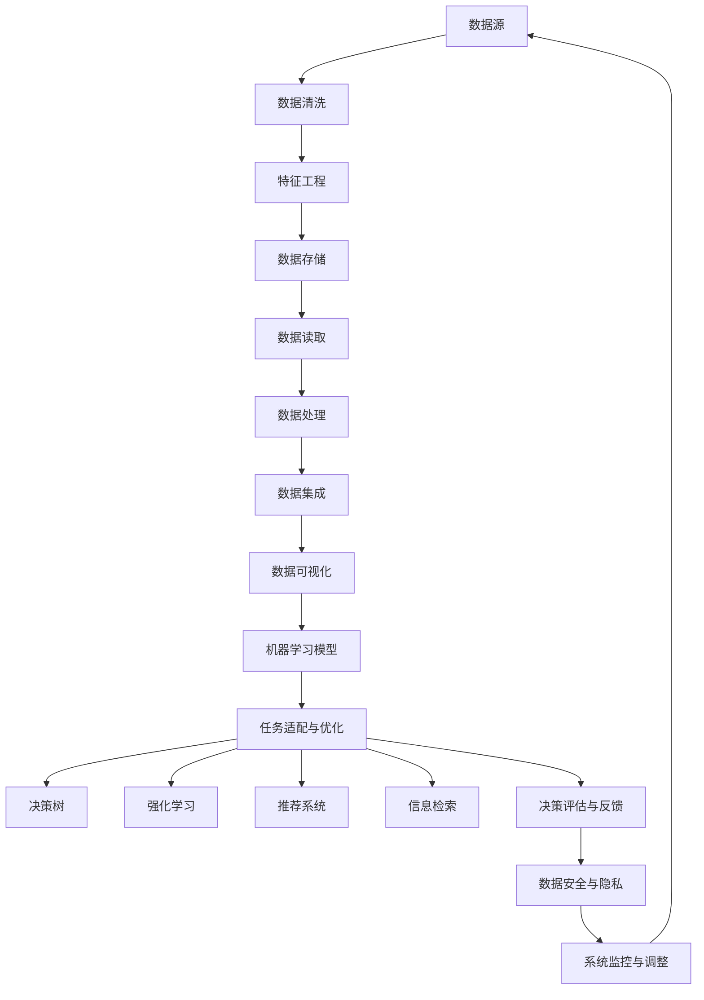

                 

# AI人工智能代理工作流AI Agent WorkFlow：利用机器学习提升代理决策质量

> 关键词：人工智能代理,工作流管理,机器学习,决策优化,自然语言处理(NLP),强化学习(RL),推荐系统,信息检索

## 1. 背景介绍

### 1.1 问题由来

在当今数字化时代，企业、政府以及各类组织机构都在加速推动业务流程的自动化和智能化，以提升运营效率和响应速度。人工智能代理(AI Agent)作为智能工作流的重要组成部分，能够在复杂业务场景中执行任务、提供服务，从而大幅降低人工成本、提升用户体验。然而，即使拥有先进的机器学习算法和强大的数据处理能力，人工智能代理在实际应用中仍面临诸多挑战。

核心挑战之一是如何提升代理的决策质量，确保其行为符合用户预期、实现业务目标。传统的规则驱动和逻辑推理方法难以应对复杂多变的环境，而基于机器学习的方法则能有效挖掘数据中的潜在模式和关联，但同时也存在模型泛化能力差、易受噪声影响等问题。因此，结合机器学习与工作流管理的AI代理工作流成为当前研究的热点，旨在将代理决策过程更加高效、精确地嵌入到工作流管理系统中。

### 1.2 问题核心关键点

AI代理工作流中的决策质量提升，主要依赖于以下几个关键点：

1. **数据获取与预处理**：代理决策的基础在于数据。如何高效获取与预处理数据，保证数据的质量和多样性，是提升决策质量的前提。

2. **模型选择与训练**：选择合适的机器学习模型，并利用标注数据进行训练，使得模型能够更好地适应特定任务，减少泛化误差。

3. **任务适配与优化**：根据具体任务需求，适配合适的模型和算法，通过优化模型参数、调整学习率等手段，提升决策模型的精确度和鲁棒性。

4. **评估与反馈**：建立有效的评估机制，及时监测代理决策的表现，利用反馈机制不断迭代优化模型，确保代理决策始终保持高水平。

5. **安全与隐私**：在决策过程中，确保数据安全、用户隐私不被泄露，是提升代理工作流可信度的重要保障。

通过有效解决以上关键点，可以大幅提升AI代理的工作效率和决策质量，为业务带来更高的价值。

### 1.3 问题研究意义

研究AI代理工作流中的决策质量提升方法，对推动智能工作流在各领域的应用具有重要意义：

1. **提升业务效率**：通过精确的代理决策，实现自动化、智能化的业务流程，大幅提升企业的运营效率和响应速度。

2. **优化用户体验**：确保代理行为符合用户预期，提供更个性化、高品质的服务，提升用户的满意度和忠诚度。

3. **降低运营成本**：利用AI代理替代人工执行任务，减少人力成本，优化资源配置，实现成本节约。

4. **推动技术创新**：AI代理工作流的研究和应用，将促进机器学习、自然语言处理、强化学习等前沿技术的进一步发展，推动人工智能技术的产业化进程。

5. **应对复杂任务**：AI代理能够处理复杂、多变的环境，提升企业在应对市场变化、客户需求等方面的能力。

6. **促进数据驱动决策**：数据驱动的代理决策模式，能够更好地挖掘数据价值，提升决策的科学性和合理性。

7. **增强系统韧性**：通过持续的模型优化和迭代，AI代理工作流能够不断适应新的环境变化，增强系统的韧性和适应性。

## 2. 核心概念与联系

### 2.1 核心概念概述

为更好地理解AI代理工作流中决策质量提升的方法，本节将介绍几个密切相关的核心概念：

- **人工智能代理(AI Agent)**：能够在数字环境中执行任务、提供服务的智能体。AI代理通过感知环境、处理数据、执行决策、执行行动等步骤，实现业务目标。

- **工作流管理(Workflow Management)**：一种管理复杂业务流程的技术，通过定义任务、编排流程、监控执行、优化调整等手段，实现流程自动化和优化。

- **机器学习(Machine Learning, ML)**：一种通过数据驱动，自动改善模型性能的技术。机器学习可应用于数据预处理、模型训练、决策优化等环节，提升AI代理的决策质量。

- **决策树(Decision Tree)**：一种基于树形结构的分类和回归模型，用于描述决策过程和数据关系，是AI代理决策优化的常见方法。

- **强化学习(Reinforcement Learning, RL)**：一种通过与环境交互，逐步优化决策策略的技术。强化学习可应用于代理行为的优化和策略调整。

- **推荐系统(Recommender System)**：一种通过分析用户行为和偏好，推荐产品或服务的技术。推荐系统可应用于AI代理中，提升个性化服务效果。

- **信息检索(Information Retrieval, IR)**：一种从大量数据中检索与用户查询匹配信息的技术。信息检索可应用于AI代理中，提升信息获取效率。

这些核心概念之间的逻辑关系可以通过以下Mermaid流程图来展示：



这个流程图展示了大语言模型微调过程中各个核心概念的关系和作用：

1. 人工智能代理通过数据获取与预处理环节获取数据。
2. 机器学习模型在数据基础上进行训练，输出代理决策依据。
3. 任务适配与优化环节，根据具体任务需求适配模型和算法，并进行参数优化。
4. 决策树、强化学习和推荐系统等方法可进一步提升代理决策的准确性和效率。
5. 信息检索技术可提升代理的信息获取能力，强化学习可优化代理行为策略。
6. 决策评估与反馈环节，通过评估代理决策效果，进行持续优化。
7. 数据安全与隐私环节，确保数据处理过程中用户隐私和数据安全。
8. 系统监控与调整环节，实时监测系统性能，进行必要的调整和优化。

这些概念共同构成了AI代理工作流中决策质量提升的完整框架，使得代理能够高效、准确地执行任务。

### 2.2 概念间的关系

这些核心概念之间存在着紧密的联系，形成了AI代理工作流中决策质量提升的完整生态系统。下面我通过几个Mermaid流程图来展示这些概念之间的关系。

#### 2.2.1 AI代理的数据处理流程



这个流程图展示了AI代理数据处理的基本流程：

1. 数据源：包括各种外部数据源，如数据库、API接口、日志文件等。
2. 数据清洗：处理缺失值、异常值、重复数据等，提升数据质量。
3. 特征工程：提取、选择、变换、压缩特征，提升数据可用性。
4. 数据存储：将数据存储在数据库、云存储等介质中，方便后续处理。
5. 数据读取：从存储介质中读取数据，供后续分析使用。
6. 数据处理：进行数据清洗、聚合、融合等操作，提取有用信息。
7. 数据集成：将不同来源的数据整合，形成统一的视图。
8. 数据可视化：通过图表、报表等方式展示数据特征，供分析使用。

#### 2.2.2 机器学习模型的构建流程


这个流程图展示了机器学习模型的构建流程：

1. 数据集：收集标注数据，用于模型训练和评估。
2. 特征选择：选择合适的特征，用于模型训练。
3. 模型训练：在标注数据上训练机器学习模型，学习模型参数。
4. 模型评估：在测试集上评估模型效果，判断模型泛化能力。
5. 模型优化：根据评估结果，调整模型参数，提升模型性能。
6. 模型应用：将训练好的模型应用于实际任务中，进行决策。

#### 2.2.3 AI代理的决策优化流程


这个流程图展示了AI代理的决策优化流程：

1. 数据输入：代理从环境中获取数据，进行初步处理。
2. 模型推理：利用训练好的机器学习模型，进行推理计算，得出决策依据。
3. 决策输出：代理根据推理结果，输出决策行为。
4. 决策反馈：代理将决策结果反馈给环境，获取新的输入数据。
5. 决策优化：根据反馈结果，调整模型参数，提升决策质量。
6. 决策执行：代理执行优化后的决策行为，产生实际结果。

### 2.3 核心概念的整体架构

最后，我们用一个综合的流程图来展示这些核心概念在大语言模型微调过程中的整体架构：



这个综合流程图展示了从数据获取到决策优化的完整过程：

1. 数据源：包括各种外部数据源，如数据库、API接口、日志文件等。
2. 数据清洗：处理缺失值、异常值、重复数据等，提升数据质量。
3. 特征工程：提取、选择、变换、压缩特征，提升数据可用性。
4. 数据存储：将数据存储在数据库、云存储等介质中，方便后续处理。
5. 数据读取：从存储介质中读取数据，供后续分析使用。
6. 数据处理：进行数据清洗、聚合、融合等操作，提取有用信息。
7. 数据集成：将不同来源的数据整合，形成统一的视图。
8. 数据可视化：通过图表、报表等方式展示数据特征，供分析使用。
9. 机器学习模型：基于训练好的模型，进行决策推理。
10. 任务适配与优化：根据具体任务需求适配模型和算法，并进行参数优化。
11. 决策树、强化学习和推荐系统等方法可进一步提升代理决策的准确性和效率。
12. 信息检索技术可提升代理的信息获取能力，强化学习可优化代理行为策略。
13. 决策评估与反馈环节，通过评估代理决策效果，进行持续优化。
14. 数据安全与隐私环节，确保数据处理过程中用户隐私和数据安全。
15. 系统监控与调整环节，实时监测系统性能，进行必要的调整和优化。

通过这些流程图，我们可以更清晰地理解AI代理工作流中决策质量提升的各个环节和关键点，为后续深入讨论具体的微调方法和技术奠定基础。

## 3. 核心算法原理 & 具体操作步骤
### 3.1 算法原理概述

AI代理工作流中的决策质量提升，本质上是一个多目标优化问题。其核心思想是：在给定的数据和模型基础上，通过优化模型参数和决策策略，最大化代理决策的精确度、效率和鲁棒性。

形式化地，假设代理的决策过程为：

$$
\min_{\theta} \left[ \mathcal{L}_s(\theta) + \mathcal{L}_i(\theta) + \mathcal{L}_r(\theta) \right]
$$

其中：

- $\theta$ 为模型参数。
- $\mathcal{L}_s$ 为代理决策的精确度损失函数，衡量代理预测与真实标签的差异。
- $\mathcal{L}_i$ 为代理决策的效率损失函数，衡量代理执行任务的耗时。
- $\mathcal{L}_r$ 为代理决策的鲁棒性损失函数，衡量代理面对噪声和异常输入的稳健性。

### 3.2 算法步骤详解

AI代理工作流中的决策质量提升，一般包括以下几个关键步骤：

**Step 1: 数据获取与预处理**

- 确定数据源，获取数据样本。
- 进行数据清洗，处理缺失值、异常值和重复数据。
- 进行特征工程，选择、提取、变换特征。
- 存储数据，将数据保存到数据库或云存储中，方便后续处理。
- 读取数据，从存储介质中读取数据，供模型训练和推理使用。
- 数据集成，将不同来源的数据整合，形成统一的视图。
- 数据可视化，通过图表、报表等方式展示数据特征，供分析使用。

**Step 2: 机器学习模型构建**

- 选择合适的机器学习模型，如决策树、随机森林、支持向量机、神经网络等。
- 在标注数据上训练模型，优化模型参数。
- 在测试集上评估模型效果，判断模型泛化能力。
- 根据评估结果，调整模型参数，提升模型性能。

**Step 3: 任务适配与优化**

- 根据具体任务需求，适配合适的模型和算法。
- 进行参数优化，调整模型超参数，如学习率、正则化系数等。
- 使用数据增强技术，提升模型鲁棒性。
- 引入对抗训练，增强模型对噪声和异常输入的抵抗能力。
- 利用知识蒸馏技术，将预训练模型的知识传递给代理模型。
- 进行多模型集成，提升决策的稳定性和准确性。

**Step 4: 决策优化**

- 根据任务需求，设计决策树、强化学习、推荐系统等方法。
- 利用训练好的机器学习模型，进行推理计算，得出决策依据。
- 根据推理结果，输出决策行为。
- 将决策结果反馈给环境，获取新的输入数据。
- 根据反馈结果，调整模型参数，提升决策质量。
- 执行优化后的决策行为，产生实际结果。

**Step 5: 决策评估与反馈**

- 设计评估指标，衡量代理决策的效果。
- 利用评估结果，优化决策模型。
- 进行A/B测试，对比不同模型和策略的效果。
- 根据业务需求，调整决策模型。
- 及时发现和修复问题，确保代理决策的准确性和可靠性。

**Step 6: 数据安全与隐私**

- 设计数据安全策略，确保数据传输和存储的安全性。
- 实现数据脱敏和加密，保护用户隐私。
- 建立访问控制机制，限制对敏感数据的访问权限。
- 定期进行安全审计，发现并修复潜在漏洞。

**Step 7: 系统监控与调整**

- 实时监测代理决策的性能和效果。
- 根据性能指标，进行必要的调整和优化。
- 利用监控数据，优化模型和算法。
- 进行故障预警和处理，确保系统稳定运行。

以上是AI代理工作流中决策质量提升的一般流程。在实际应用中，还需要根据具体任务和数据特点，对各个环节进行优化设计，如改进训练目标函数，引入更多的正则化技术，搜索最优的超参数组合等，以进一步提升模型性能。

### 3.3 算法优缺点

AI代理工作流中的决策质量提升方法，具有以下优点：

1. **灵活性高**：能够根据具体任务需求，灵活选择模型和算法，适应不同的业务场景。
2. **精确度高**：通过多目标优化，最大化代理决策的准确度和鲁棒性，提升决策质量。
3. **效率提升**：利用机器学习优化决策模型，提升代理执行任务的效率。
4. **鲁棒性强**：通过数据增强和对抗训练，增强代理面对噪声和异常输入的抵抗能力。
5. **可解释性强**：通过决策树和特征工程，提升决策过程的可解释性和透明性。
6. **可扩展性好**：能够高效处理大规模数据，适应不同规模的任务需求。

同时，该方法也存在以下局限性：

1. **数据依赖**：决策质量高度依赖于数据的质量和数量，高质量的数据获取和预处理是关键。
2. **计算成本高**：大规模机器学习模型的训练和推理，对计算资源的需求较高，成本较高。
3. **模型复杂**：模型结构复杂，需要较高的技术水平和经验，模型调优难度较大。
4. **模型泛化差**：过度依赖特定领域的数据和任务，泛化能力有限。
5. **维护难度大**：系统复杂度高，维护难度大，需要专业团队支撑。

尽管存在这些局限性，但就目前而言，AI代理工作流中的决策质量提升方法仍然是大规模决策任务的重要手段。未来相关研究的重点在于如何进一步降低对数据和计算资源的依赖，提高模型的少样本学习和跨领域迁移能力，同时兼顾可解释性和伦理安全性等因素。

### 3.4 算法应用领域

AI代理工作流中的决策质量提升方法，已经在多个领域得到了广泛的应用，例如：

- **金融行业**：利用AI代理进行风险评估、投资决策、欺诈检测等。
- **医疗健康**：利用AI代理进行疾病诊断、治疗方案推荐、患者管理等。
- **零售电商**：利用AI代理进行商品推荐、库存管理、客户服务等。
- **制造工业**：利用AI代理进行设备监控、故障预测、生产调度等。
- **智能交通**：利用AI代理进行交通流量分析、智能调度、安全预警等。
- **智能客服**：利用AI代理进行客户咨询、问题解答、情感分析等。

除了上述这些经典应用外，AI代理工作流中的决策质量提升方法也被创新性地应用到更多场景中，如个性化推荐、广告投放、舆情监测等，为各行各业带来了新的技术突破。

## 4. 数学模型和公式 & 详细讲解 & 举例说明

### 4.1 数学模型构建

本节将使用数学语言对AI代理工作流中决策质量提升的过程进行更加严格的刻画。

记代理的决策过程为：

$$
\theta^* = \mathop{\arg\min}_{\theta} \left[ \mathcal{L}_s(\theta) + \mathcal{L}_i(\theta) + \mathcal{L}_r(\theta) \right]
$$

其中：

- $\theta$ 为模型参数。
- $\mathcal{L}_s$ 为代理决策的精确度损失函数，衡量代理预测与真实标签的差异。
- $\mathcal{L}_i$ 为代理决策的效率损失函数，衡量代理执行任务的耗时。
- $\mathcal{L}_r$ 为代理决策的鲁棒性损失函数，衡量代理面对噪声和异常输入的稳健性。

### 4.2 公式推导过程

以下我们以二分类任务为例，推导代理决策的精确度损失函数及其梯度的计算公式。

假设代理在输入 $x$ 上的输出为 $\hat{y}=M_{\theta}(x) \in [0,1]$，表示样本属于正类的概率。真实标签 $y \in \{0,1\}$。则二分类交叉熵损失函数定义为：

$$
\mathcal{L}_s(\theta) = -[y\log \hat{y} + (1-y)\log (1-\hat{y})]
$$

在进行模型优化时，需要定义代理决策的效率损失函数和鲁棒性损失函数。例如，可以定义一个简单的代理效率损失函数：

$$
\mathcal{L}_i(\theta) = \frac{1}{N} \sum_{i=1}^N \frac{t_i}{C} + \lambda (1 - t_i)
$$

其中 $t_i$ 为代理在样本 $x_i$ 上的推理时间，$C$ 为代理执行任务的时间上限，$\lambda$ 为效率惩罚系数。

鲁棒性损失函数可以定义为：

$$
\mathcal{L}_r(\theta) = \frac{1}{N} \sum_{i=1}^N \|x_i + \delta_i - M_{\theta}(x_i + \delta_i)\|^2
$$

其中 $\delta_i$ 为样本 $x_i$ 上的噪声向量，$\| \cdot \|$ 为向量范数。

### 4.3 案例分析与讲解

以一个金融风险评估的AI代理为例，进行详细分析。

假设AI代理根据客户的历史交易数据，预测其信用风险。在训练数据上，我们将客户分为高风险和低风险两类，并标注为1和0。

1. **数据获取与预处理**：
   - 收集客户的交易记录、信用记录、人口统计信息等数据，构建训练集和测试集。
   - 进行数据清洗，处理缺失值、异常值和重复数据。
   - 进行特征工程，选择、提取、变换特征，如交易金额、交易频率、客户年龄等。
   - 存储数据，将数据保存到数据库或云存储中，方便后续处理。
   - 读取数据，从存储介质中读取数据，供模型训练和推理使用。
   - 数据集成，将不同来源的数据整合，形成统一的视图。
   - 数据可视化，通过图表、报表等方式展示数据特征，供分析使用。

2. **机器学习模型构建**：
   - 选择随机森林模型，作为代理决策的基础模型。
   - 在训练数据上训练模型，优化模型参数。
   - 在测试集上评估模型效果，判断模型泛化能力。
   - 根据评估结果，调整模型参数，提升模型性能。

3. **任务适配与优化**：
   - 根据具体任务需求，适配合适的模型和算法，引入对抗训练、数据增强等技术。
   - 利用知识蒸馏技术，将预训练模型的知识传递给代理模型。
   - 进行多模型集成，提升决策的稳定性和准确性。

4. **决策优化**：
   - 根据任务需求，设计决策树、强化学习、推荐系统等方法。
   - 利用训练好的随机森林模型，进行推理计算，得出决策依据。
   - 根据推理结果，输出决策行为。
   - 将决策结果反馈给环境，获取新的输入数据。
   - 根据反馈结果，调整模型参数，提升决策质量。
   - 执行优化后的决策行为，产生实际结果。

5. **决策评估与反馈**：
   - 设计评估指标，衡量代理决策的效果。
   - 利用评估结果，优化决策模型。
   - 进行A/B测试，对比不同模型和策略的效果。
   - 根据业务需求，调整决策模型。
   - 及时发现和修复问题，确保代理决策的准确性和可靠性。

6. **数据安全与隐私**：
   - 设计数据安全策略，确保数据传输和存储的安全性。
   - 实现数据脱敏和加密，保护用户隐私。
   - 建立访问控制机制，限制对敏感数据的访问权限。
   - 定期进行安全审计，发现并修复潜在漏洞。

7. **系统监控与调整**：
   - 实时监测代理决策的性能和效果。
   - 根据性能指标，进行必要的调整和优化。
   - 利用监控数据，优化模型和算法。
   - 进行故障预警和处理，确保系统稳定运行。

通过以上步骤，可以构建一个高效、可靠的AI代理工作流，确保代理决策的质量和效率。

## 5. 项目实践：代码实例和详细解释说明

### 5.1 开发环境搭建

在进行AI代理工作流开发前，我们需要准备好开发环境。以下是使用Python进行TensorFlow开发的环境配置流程：

1. 安装Anaconda：从官网下载并安装Anaconda，用于创建独立的Python环境。

2. 创建并激活虚拟环境：
```bash
conda create -n tf-env python=3.8 
conda activate tf-env
```

3. 安装TensorFlow：根据CUDA版本，从官网获取对应的安装命令。例如：
```bash
conda install tensorflow -c tf -c conda-forge
```

4. 安装各类工具包：
```bash
pip install numpy pandas scikit-learn matplotlib tqdm jupyter notebook ipython
```

完成上述步骤后，即可在`tf-env`环境中开始AI代理工作流的开发实践。

### 5.2 源代码详细实现

下面我们以金融风险评估为例，给出使用TensorFlow对代理模型进行训练和微调的PyTorch代码实现。

首先，定义数据处理函数：

```python
import tensorflow as tf
import numpy as np
from sklearn.model_selection import train_test_split
from sklearn.preprocessing import StandardScaler

def load_data():
    # 加载数据集
    X = np.loadtxt('train_data.csv', delimiter=',')
    y = np.loadtxt('train_labels.csv', delimiter=',').reshape(-1, 1)

    # 分割数据集
    X_train,

