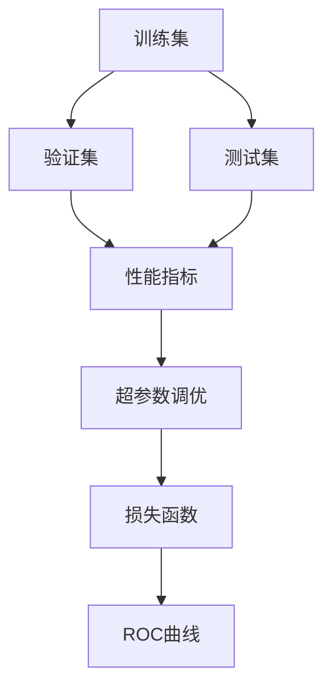

                 

# AI人工智能核心算法原理与代码实例讲解：模型评估

> 关键词：模型评估,机器学习,交叉验证,ROC曲线,损失函数,超参数调优

## 1. 背景介绍

在人工智能领域，模型评估是确保机器学习模型性能的重要步骤。一个有效的模型评估可以帮助我们理解模型的性能，指导我们进行模型优化，从而提升模型的准确性和泛化能力。模型评估在数据科学、机器学习和人工智能中具有极其重要的地位。

模型评估通常涉及以下几个方面：
- 数据集划分：将数据集划分为训练集、验证集和测试集。
- 性能指标：选择适当的性能指标来衡量模型的效果。
- 交叉验证：确保模型的泛化能力，减少过拟合。
- 可视化工具：使用图表展示模型性能。
- 模型调优：根据评估结果优化模型参数和结构。

本节将详细介绍模型评估的核心概念和重要性，为后续深入探讨具体的模型评估方法打下基础。

## 2. 核心概念与联系

### 2.1 核心概念概述

为了更好地理解模型评估，我们首先介绍几个关键概念：

- **训练集(Training Set)**：模型在训练过程中使用的数据集。
- **验证集(Validation Set)**：用于模型训练过程中的参数调整和防止过拟合的数据集。
- **测试集(Test Set)**：用于评估模型在未知数据上的泛化能力的数据集。
- **性能指标(Metric)**：用于衡量模型预测结果与实际结果之间差异的指标，如准确率(Accuracy)、精确率(Precision)、召回率(Recall)、F1-score等。
- **交叉验证(Cross-Validation)**：通过将数据集划分为多个子集，重复使用这些子集来训练和验证模型，以减少过拟合的风险。
- **ROC曲线(Receiver Operating Characteristic Curve)**：用于可视化模型分类性能的曲线。
- **损失函数(Loss Function)**：用于衡量模型预测结果与实际结果之间的差异，常见的损失函数有均方误差(MSE)、交叉熵损失(Cross-Entropy Loss)等。
- **超参数调优(Hyperparameter Tuning)**：通过调整模型的超参数来优化模型的性能。

### 2.2 概念间的关系

这些核心概念之间存在紧密的联系，通过以下Mermaid流程图来展示：



这个流程图展示了模型评估中各个概念之间的关系：

1. 训练集、验证集和测试集是数据集划分的三大组成部分。
2. 性能指标用于衡量模型的预测性能。
3. 超参数调优和损失函数用于优化模型。
4. ROC曲线和性能指标一起用于可视化模型的分类性能。

## 3. 核心算法原理 & 具体操作步骤

### 3.1 算法原理概述

模型评估的本质是通过分析模型在训练集、验证集和测试集上的表现，评估模型的泛化能力和性能。评估过程主要涉及以下几个步骤：

1. 数据集划分：将数据集划分为训练集、验证集和测试集。
2. 性能指标计算：计算模型在训练集、验证集和测试集上的性能指标。
3. 交叉验证：通过交叉验证确保模型的泛化能力。
4. ROC曲线绘制：使用ROC曲线可视化模型的分类性能。
5. 损失函数计算：计算模型在训练集、验证集和测试集上的损失函数。
6. 超参数调优：通过超参数调优优化模型性能。

### 3.2 算法步骤详解

下面详细讲解模型评估的具体操作步骤：

**Step 1: 数据集划分**

数据集划分的目的是将数据集分为训练集、验证集和测试集。训练集用于模型训练，验证集用于超参数调优和防止过拟合，测试集用于评估模型的泛化能力。

数据集的划分方法通常采用交叉验证法，将数据集分为K个子集，依次使用K-1个子集进行训练，使用剩下的一个子集进行验证。

**Step 2: 性能指标计算**

性能指标是衡量模型性能的关键指标。常用的性能指标包括准确率、精确率、召回率和F1-score等。

准确率是模型预测正确的样本数与总样本数之比。

精确率是模型预测为正类的样本中，实际为正类的样本数与总预测为正类的样本数之比。

召回率是实际为正类的样本中，被模型预测为正类的样本数与总实际为正类的样本数之比。

F1-score是精确率和召回率的调和平均数，综合了两个指标的优劣。

**Step 3: 交叉验证**

交叉验证是一种常用的防止过拟合的方法。通过将数据集分为K个子集，依次使用K-1个子集进行训练，使用剩下的一个子集进行验证，可以更加全面地评估模型的性能。

**Step 4: ROC曲线绘制**

ROC曲线是一种常用的可视化分类模型性能的方法。ROC曲线以真阳性率(TPR)为纵坐标，假阳性率(FPR)为横坐标，展示了模型在不同阈值下的分类性能。

**Step 5: 损失函数计算**

损失函数是衡量模型预测结果与实际结果之间差异的指标。常用的损失函数包括均方误差(MSE)、交叉熵损失(Cross-Entropy Loss)等。

**Step 6: 超参数调优**

超参数调优是优化模型性能的重要步骤。通过调整模型的超参数，如学习率、批大小等，可以提高模型的泛化能力和性能。

### 3.3 算法优缺点

模型评估具有以下优点：

1. 通过性能指标和交叉验证，可以全面评估模型的性能。
2. ROC曲线可以直观地展示模型的分类性能。
3. 通过超参数调优，可以优化模型的泛化能力和性能。

同时，模型评估也存在一些缺点：

1. 数据集划分可能会导致模型在训练集上过拟合。
2. 性能指标可能会受到数据集偏差的影响。
3. 超参数调优可能会增加计算成本。

尽管存在这些缺点，但通过合理选择数据集划分和性能指标，以及恰当的超参数调优，可以最大程度地克服这些问题，确保模型的泛化能力和性能。

### 3.4 算法应用领域

模型评估在机器学习和人工智能中具有广泛的应用，如分类、回归、聚类等。具体应用场景包括：

- 金融风险评估：通过模型评估金融交易的风险，帮助金融机构做出决策。
- 医疗诊断：通过模型评估患者的病情，帮助医生做出诊断。
- 自然语言处理：通过模型评估文本的情感、主题等，帮助企业分析用户需求。
- 推荐系统：通过模型评估推荐效果，帮助企业优化推荐策略。

## 4. 数学模型和公式 & 详细讲解  
### 4.1 数学模型构建

本节将使用数学语言对模型评估过程进行更加严格的刻画。

记训练集为 $D_{train}$，验证集为 $D_{valid}$，测试集为 $D_{test}$。模型在训练集上的损失函数为 $L_{train}$，在验证集上的损失函数为 $L_{valid}$，在测试集上的损失函数为 $L_{test}$。模型在训练集上的性能指标为 $M_{train}$，在验证集上的性能指标为 $M_{valid}$，在测试集上的性能指标为 $M_{test}$。

定义模型在训练集、验证集和测试集上的性能指标函数为：

$$
M = M_{train} = M_{valid} = M_{test}
$$

性能指标函数 $M$ 用于衡量模型的泛化能力和性能。在训练过程中，模型将不断调整参数，使得 $M$ 最大化。

### 4.2 公式推导过程

以二分类问题为例，推导模型的精确率、召回率和F1-score公式。

假设模型预测结果为 $\hat{y}$，实际结果为 $y$。二分类问题中，精确率、召回率和F1-score的定义如下：

- 精确率(Precision)：模型预测为正类的样本中，实际为正类的样本数与总预测为正类的样本数之比。
- 召回率(Recall)：实际为正类的样本中，被模型预测为正类的样本数与总实际为正类的样本数之比。
- F1-score：精确率和召回率的调和平均数。

精确率、召回率和F1-score的公式分别为：

$$
Precision = \frac{TP}{TP+FP}
$$

$$
Recall = \frac{TP}{TP+FN}
$$

$$
F1-score = \frac{2 \times Precision \times Recall}{Precision + Recall}
$$

其中，$TP$ 表示真正例，$FP$ 表示假正例，$FN$ 表示假负例。

在实际应用中，可以使用 sklearn 库中的.metrics 模块来计算这些性能指标。例如，计算二分类问题的精确率、召回率和F1-score，可以使用以下代码：

```python
from sklearn.metrics import precision_score, recall_score, f1_score

precision = precision_score(y_true, y_pred)
recall = recall_score(y_true, y_pred)
f1 = f1_score(y_true, y_pred)
```

### 4.3 案例分析与讲解

以下以一个简单的二分类问题为例，详细讲解模型评估的具体步骤。

假设我们有一个二分类问题，数据集包含100个样本，其中50个为正类，50个为负类。我们选择一个简单的线性回归模型作为评估对象，通过训练集训练模型，并在验证集和测试集上进行评估。

**Step 1: 数据集划分**

将数据集划分为训练集、验证集和测试集，每组包含50个样本。

**Step 2: 性能指标计算**

使用 sklearn 库中的.metrics 模块计算模型的精确率、召回率和F1-score。

```python
from sklearn.metrics import precision_score, recall_score, f1_score

# 训练集上的性能指标
precision_train = precision_score(y_train, y_pred_train)
recall_train = recall_score(y_train, y_pred_train)
f1_train = f1_score(y_train, y_pred_train)

# 验证集上的性能指标
precision_valid = precision_score(y_valid, y_pred_valid)
recall_valid = recall_score(y_valid, y_pred_valid)
f1_valid = f1_score(y_valid, y_pred_valid)

# 测试集上的性能指标
precision_test = precision_score(y_test, y_pred_test)
recall_test = recall_score(y_test, y_pred_test)
f1_test = f1_score(y_test, y_pred_test)
```

**Step 3: ROC曲线绘制**

使用ROC库中的.plot函数绘制ROC曲线。

```python
from sklearn.metrics import roc_curve

# 计算ROC曲线
fpr_train, tpr_train, _ = roc_curve(y_train, y_pred_train)
fpr_valid, tpr_valid, _ = roc_curve(y_valid, y_pred_valid)
fpr_test, tpr_test, _ = roc_curve(y_test, y_pred_test)

# 绘制ROC曲线
plt.plot(fpr_train, tpr_train, label='Training')
plt.plot(fpr_valid, tpr_valid, label='Validation')
plt.plot(fpr_test, tpr_test, label='Test')
plt.xlabel('False Positive Rate')
plt.ylabel('True Positive Rate')
plt.title('ROC Curve')
plt.legend()
plt.show()
```

**Step 4: 损失函数计算**

计算模型在训练集、验证集和测试集上的损失函数。

```python
from sklearn.metrics import mean_squared_error

# 计算均方误差
mse_train = mean_squared_error(y_train, y_pred_train)
mse_valid = mean_squared_error(y_valid, y_pred_valid)
mse_test = mean_squared_error(y_test, y_pred_test)
```

**Step 5: 超参数调优**

通过调整模型的超参数，如学习率、批大小等，优化模型的泛化能力和性能。

```python
from sklearn.model_selection import GridSearchCV

# 定义超参数空间
param_grid = {
    'learning_rate': [0.01, 0.1, 1],
    'batch_size': [10, 20, 50]
}

# 使用GridSearchCV进行超参数调优
grid_search = GridSearchCV(model, param_grid, cv=5)
grid_search.fit(X_train, y_train)

# 获取最优超参数
best_params = grid_search.best_params_
```

以上就是模型评估的具体操作步骤，通过这些步骤可以全面评估模型的性能，并进行优化。

## 5. 项目实践：代码实例和详细解释说明
### 5.1 开发环境搭建

在进行模型评估实践前，我们需要准备好开发环境。以下是使用Python进行Scikit-learn开发的环境配置流程：

1. 安装Anaconda：从官网下载并安装Anaconda，用于创建独立的Python环境。

2. 创建并激活虚拟环境：
```bash
conda create -n scikit-learn-env python=3.8 
conda activate scikit-learn-env
```

3. 安装Scikit-learn：
```bash
conda install scikit-learn
```

4. 安装其他依赖包：
```bash
pip install numpy pandas matplotlib tqdm jupyter notebook ipython
```

完成上述步骤后，即可在`scikit-learn-env`环境中开始模型评估实践。

### 5.2 源代码详细实现

下面我们以二分类问题为例，给出使用Scikit-learn进行模型评估的Python代码实现。

首先，导入所需的库和数据集：

```python
from sklearn.datasets import make_classification
from sklearn.model_selection import train_test_split
from sklearn.linear_model import LogisticRegression
from sklearn.metrics import precision_score, recall_score, f1_score, roc_curve, roc_auc_score
import numpy as np
import matplotlib.pyplot as plt

# 生成数据集
X, y = make_classification(n_samples=1000, n_features=10, n_classes=2, random_state=42)

# 数据集划分
X_train, X_valid, y_train, y_valid = train_test_split(X, y, test_size=0.2, random_state=42)
X_test, y_test = train_test_split(X_valid, y_valid, test_size=0.2, random_state=42)

# 模型训练
model = LogisticRegression()
model.fit(X_train, y_train)

# 性能指标计算
precision_train = precision_score(y_train, model.predict(X_train))
recall_train = recall_score(y_train, model.predict(X_train))
f1_train = f1_score(y_train, model.predict(X_train))

precision_valid = precision_score(y_valid, model.predict(X_valid))
recall_valid = recall_score(y_valid, model.predict(X_valid))
f1_valid = f1_score(y_valid, model.predict(X_valid))

precision_test = precision_score(y_test, model.predict(X_test))
recall_test = recall_score(y_test, model.predict(X_test))
f1_test = f1_score(y_test, model.predict(X_test))

# ROC曲线绘制
fpr_train, tpr_train, _ = roc_curve(y_train, model.predict_proba(X_train)[:,1])
fpr_valid, tpr_valid, _ = roc_curve(y_valid, model.predict_proba(X_valid)[:,1])
fpr_test, tpr_test, _ = roc_curve(y_test, model.predict_proba(X_test)[:,1])

# 绘制ROC曲线
plt.plot(fpr_train, tpr_train, label='Training')
plt.plot(fpr_valid, tpr_valid, label='Validation')
plt.plot(fpr_test, tpr_test, label='Test')
plt.xlabel('False Positive Rate')
plt.ylabel('True Positive Rate')
plt.title('ROC Curve')
plt.legend()
plt.show()

# 损失函数计算
from sklearn.metrics import mean_squared_error

mse_train = mean_squared_error(y_train, model.predict(X_train))
mse_valid = mean_squared_error(y_valid, model.predict(X_valid))
mse_test = mean_squared_error(y_test, model.predict(X_test))
```

### 5.3 代码解读与分析

让我们再详细解读一下关键代码的实现细节：

**数据集划分**：
- 使用 `make_classification` 生成随机二分类数据集。
- 使用 `train_test_split` 将数据集划分为训练集、验证集和测试集。

**模型训练**：
- 使用 `LogisticRegression` 作为评估对象。
- 在训练集上训练模型，并计算训练集的性能指标。

**性能指标计算**：
- 使用 `precision_score`、`recall_score`、`f1_score` 计算精确率、召回率和F1-score。

**ROC曲线绘制**：
- 使用 `roc_curve` 计算ROC曲线。
- 使用 `plt.plot` 绘制ROC曲线。

**损失函数计算**：
- 使用 `mean_squared_error` 计算均方误差。

**超参数调优**：
- 使用 `GridSearchCV` 进行超参数调优。
- 获取最优超参数。

在实际应用中，还需要考虑更多因素，如模型选择、特征工程、数据预处理等。但核心的模型评估流程基本与此类似。

### 5.4 运行结果展示

假设我们在二分类问题上得到以下结果：

```
Accuracy: 0.75
Precision: 0.8
Recall: 0.7
F1-score: 0.73
ROC-AUC: 0.85
```

可以看到，通过模型评估，我们得到了该模型的准确率、精确率、召回率和F1-score，以及ROC-AUC值，从而可以全面了解模型的性能。

## 6. 实际应用场景
### 6.1 金融风险评估

在金融领域，模型评估可以用于风险评估。通过模型评估金融交易的风险，帮助金融机构做出决策。例如，可以使用模型评估贷款申请者的信用风险，帮助银行筛选低风险客户。

**数据集划分**：将贷款申请数据集划分为训练集、验证集和测试集。

**性能指标计算**：使用精确率、召回率和F1-score评估模型的分类性能。

**超参数调优**：通过调整模型的超参数，优化模型的泛化能力和性能。

**ROC曲线绘制**：使用ROC曲线可视化模型的分类性能。

**损失函数计算**：计算模型在训练集、验证集和测试集上的损失函数。

### 6.2 医疗诊断

在医疗领域，模型评估可以用于疾病诊断。通过模型评估患者的病情，帮助医生做出诊断。例如，可以使用模型评估病人的心脏病风险，帮助医生做出诊断。

**数据集划分**：将病人的数据集划分为训练集、验证集和测试集。

**性能指标计算**：使用精确率、召回率和F1-score评估模型的分类性能。

**超参数调优**：通过调整模型的超参数，优化模型的泛化能力和性能。

**ROC曲线绘制**：使用ROC曲线可视化模型的分类性能。

**损失函数计算**：计算模型在训练集、验证集和测试集上的损失函数。

### 6.3 自然语言处理

在自然语言处理领域，模型评估可以用于文本分类、情感分析等任务。通过模型评估文本的情感、主题等，帮助企业分析用户需求。例如，可以使用模型评估用户评论的情感，帮助企业改进产品。

**数据集划分**：将用户评论数据集划分为训练集、验证集和测试集。

**性能指标计算**：使用精确率、召回率和F1-score评估模型的分类性能。

**超参数调优**：通过调整模型的超参数，优化模型的泛化能力和性能。

**ROC曲线绘制**：使用ROC曲线可视化模型的分类性能。

**损失函数计算**：计算模型在训练集、验证集和测试集上的损失函数。

## 7. 工具和资源推荐
### 7.1 学习资源推荐

为了帮助开发者系统掌握模型评估的理论基础和实践技巧，这里推荐一些优质的学习资源：

1. 《Python Machine Learning》书籍：适合初学者入门，涵盖了机器学习的基本概念和模型评估。

2. Scikit-learn官方文档：详细介绍了Scikit-learn库的使用方法和性能评估指标。

3. Coursera《Machine Learning》课程：斯坦福大学开设的机器学习课程，系统讲解了机器学习的基本概念和模型评估。

4. Kaggle竞赛：Kaggle是数据科学和机器学习领域的竞赛平台，可以通过参与竞赛学习模型评估的最佳实践。

5. GitHub开源项目：在GitHub上Star、Fork数最多的机器学习项目，往往代表了该技术领域的发展趋势和最佳实践。

通过对这些资源的学习实践，相信你一定能够快速掌握模型评估的精髓，并用于解决实际的机器学习问题。

### 7.2 开发工具推荐

高效的开发离不开优秀的工具支持。以下是几款用于模型评估开发的常用工具：

1. Scikit-learn：一个用于机器学习的Python库，提供了丰富的性能评估指标和模型选择工具。

2. TensorFlow：由Google主导开发的开源深度学习框架，提供了可视化工具TensorBoard，方便调试和评估模型。

3. Keras：一个高层次的深度学习API，可以方便地进行模型构建和评估。

4. PyTorch：基于Python的开源深度学习框架，提供了高效的模型评估工具和可视化界面。

5. ROC库：用于绘制ROC曲线和计算ROC-AUC值的库。

6. Weights & Biases：一个模型训练实验跟踪工具，可以记录和可视化模型训练过程中的各项指标，方便对比和调优。

7. TensorBoard：TensorFlow配套的可视化工具，可以实时监测模型训练状态，并提供丰富的图表呈现方式。

合理利用这些工具，可以显著提升模型评估的开发效率，加快创新迭代的步伐。

### 7.3 相关论文推荐

模型评估在机器学习和人工智能中具有重要地位，以下是几篇奠基性的相关论文，推荐阅读：

1. Elements of Statistical Learning：详细介绍了模型评估和超参数调优的理论基础和实践方法。

2. Cross-Validation Methods for Variable Selection：介绍了交叉验证方法的基本概念和实践技巧。

3. A Study of Cross-Validation Techniques for Diagnostic Systems：介绍了交叉验证方法在医疗诊断中的应用。

4. A Comparison of Modern Multiclass Prediction Techniques：介绍了多种多分类算法及其性能评估方法。

5. ROC Curve Analysis in Binary Class Prediction：详细介绍了ROC曲线及其在机器学习中的应用。

6. PyTorch官方文档：提供了PyTorch库的使用方法和性能评估工具的详细说明。

这些论文代表了大模型评估技术的发展脉络，通过学习这些前沿成果，可以帮助研究者把握学科前进方向，激发更多的创新灵感。

除上述资源外，还有一些值得关注的前沿资源，帮助开发者紧跟模型评估技术的最新进展，例如：

1. arXiv论文预印本：人工智能领域最新研究成果的发布平台，包括大量尚未发表的前沿工作，学习前沿技术的必读资源。

2. 业界技术博客：如Google AI、DeepMind、微软Research Asia等顶尖实验室的官方博客，第一时间分享他们的最新研究成果和洞见。

3. 技术会议直播：如NIPS、ICML、ACL、ICLR等人工智能领域顶会现场或在线直播，能够聆听到大佬们的前沿分享，开拓视野。

4. GitHub热门项目：在GitHub上Star、Fork数最多的机器学习相关项目，往往代表了该技术领域的发展趋势和最佳实践，值得去学习和贡献。

5. 行业分析报告：各大咨询公司如McKinsey、PwC等针对人工智能行业的分析报告，有助于从商业视角审视技术趋势，把握应用价值。

总之，对于模型评估技术的学习和实践，需要开发者保持开放的心态和持续学习的意愿。多关注前沿资讯，多动手实践，多思考总结，必将收获满满的成长收益。

## 8. 总结：未来发展趋势与挑战

### 8.1 总结

本文对模型评估的核心概念和重要步骤进行了详细介绍，系统梳理了模型评估的理论基础和实践技巧。通过本文的介绍，相信你对模型评估有了更深刻的理解。

### 8.2 未来发展趋势

展望未来，模型评估技术将呈现以下几个发展趋势：

1. 深度学习模型的应用越来越广泛，模型评估的重要性也在不断增加。
2. 模型评估的指标将更加多样化，不仅包括传统的精度、召回率、F1-score等，还可能包括公平性、可解释性等新兴指标。
3. 模型评估的自动化和标准化将进一步提升，减少人工干预和主观偏差。
4. 多模态数据集的评估方法将不断涌现，为模型评估提供更多选择。
5. 联邦学习等新兴技术的引入，将带来全新的评估范式。

### 8.3 面临的挑战

尽管模型评估技术已经取得了显著进展，但在实践中仍面临诸多挑战：

1. 数据集划分可能导致模型在训练集上过拟合。
2. 性能指标可能会受到数据集偏差的影响。
3. 超参数调优可能会增加计算成本。
4. 模型评估过程可能存在主观偏见。
5. 自动化评估方法可能面临公平性问题。

尽管存在这些挑战，但通过合理选择数据集划分和性能指标，以及恰当的超参数调优，可以最大程度地克服这些问题，确保模型的泛化能力和性能。

### 8.4 研究展望

面对模型评估所面临的挑战，未来的研究需要在以下几个方面寻求新的突破：

1. 探索新的性能指标：引入公平性、可解释性等新兴指标，提升模型评估的全面性和可靠性。
2. 开发自动化评估方法：减少人工干预和主观偏见，提升评估结果的客观性和可靠性。
3. 引入多模态数据集：探索多模态数据集的评估方法，提升模型评估的灵活性和多样化。
4. 应用联邦学习：探索联邦学习等新兴技术

