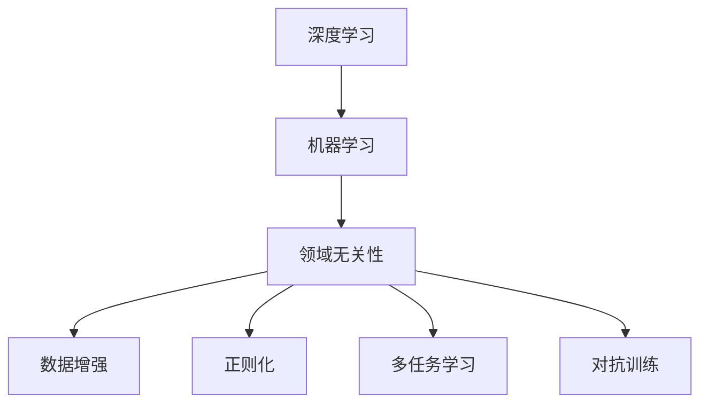
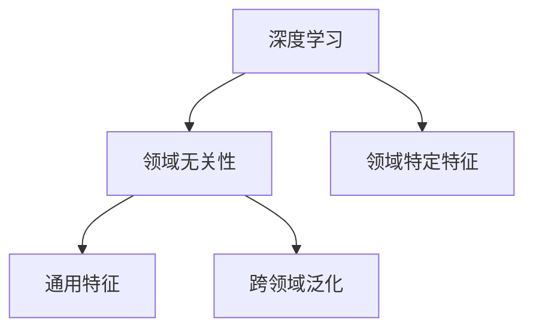
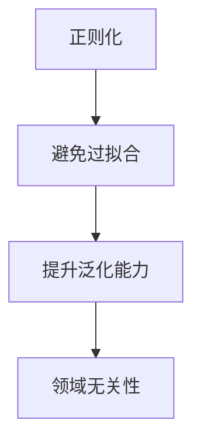
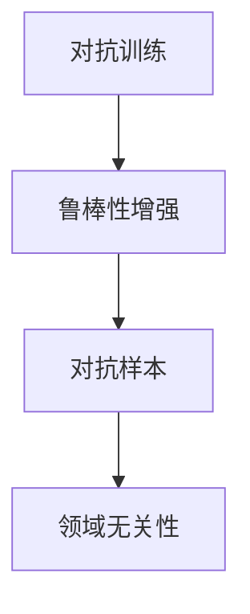
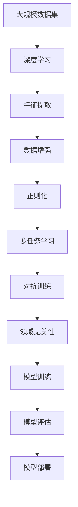

                 

# AI人工智能核心算法原理与代码实例讲解：领域无关性

> 关键词：人工智能，核心算法，领域无关性，深度学习，机器学习，代码实例

## 1. 背景介绍

### 1.1 问题由来

在当今数字化和智能化的浪潮中，人工智能（AI）技术以其卓越的智能推理和预测能力，成为了解决复杂问题的强大工具。然而，传统AI算法如机器学习和深度学习模型，往往需要大量领域相关的数据来训练模型，这限制了其通用性和可扩展性。

为了应对这一挑战，领域无关性（Domain-Invariance）的概念应运而生。领域无关性致力于构建可以跨多个领域稳定工作的模型，从而大幅降低数据获取和模型训练的成本，提高模型的可扩展性和应用范围。

### 1.2 问题核心关键点

领域无关性算法通过以下核心策略实现：

1. **特征提取：** 学习并抽取通用的特征表示，这些特征可以在不同领域的数据上进行有效应用。
2. **数据增强：** 使用数据增强技术扩充数据集，增加数据多样性，增强模型的泛化能力。
3. **正则化：** 引入正则化技术，避免模型过拟合，提升模型的泛化能力。
4. **多任务学习：** 在同一模型上进行多个相关任务的联合训练，提高模型在不同领域的适应性。
5. **对抗训练：** 使用对抗样本训练模型，提高模型在面对噪声和干扰时的鲁棒性。

这些技术在实际应用中相互结合，形成了一套完整的方法论，广泛应用于图像识别、自然语言处理、推荐系统等领域，显著提升了模型的性能和适应性。

### 1.3 问题研究意义

研究领域无关性算法，对于提升AI技术的普适性、降低数据获取和模型训练成本、加速AI技术的产业化进程具有重要意义：

1. **降低数据依赖：** 通过学习领域无关特征，可以在较少领域数据的情况下，训练出高性能模型。
2. **提高泛化能力：** 跨领域的特征提取和数据增强，使得模型具有更强的泛化能力，能适应不同的数据分布。
3. **加速技术落地：** 领域无关性算法使得AI技术更容易在不同的行业和场景中落地应用。
4. **促进技术创新：** 领域无关性研究推动了跨领域知识迁移和融合，催生了新的研究方向。
5. **赋能产业升级：** 使AI技术更容易被各行各业所采用，推动经济社会数字化转型升级。

## 2. 核心概念与联系

### 2.1 核心概念概述

为更好地理解领域无关性算法，本节将介绍几个密切相关的核心概念：

- **深度学习（Deep Learning）：** 利用多层神经网络进行特征提取和建模的机器学习方法。
- **机器学习（Machine Learning）：** 通过训练模型，使其具备自主学习并改进算法的能力。
- **领域无关性（Domain-Invariance）：** 学习并应用跨多个领域的通用特征，使得模型在不同领域的数据上表现一致。
- **数据增强（Data Augmentation）：** 通过变换数据的方式扩充数据集，增加数据多样性。
- **正则化（Regularization）：** 引入额外的约束条件，避免模型过拟合，提升泛化能力。
- **多任务学习（Multi-task Learning）：** 在同一模型上进行多个相关任务的联合训练，提高模型在不同领域的适应性。
- **对抗训练（Adversarial Training）：** 使用对抗样本训练模型，提高模型在面对噪声和干扰时的鲁棒性。

这些概念之间的逻辑关系可以通过以下Mermaid流程图来展示：



这个流程图展示了大语言模型的核心概念及其之间的关系：

1. 深度学习是机器学习的一种，通过多层神经网络实现特征提取和建模。
2. 领域无关性利用深度学习的特征提取能力，学习通用的特征表示，减少领域依赖。
3. 数据增强、正则化、多任务学习和对抗训练是实现领域无关性的重要技术手段。

这些概念共同构成了领域无关性算法的框架，使得模型能够更好地适应不同的数据分布，提高泛化能力和鲁棒性。

### 2.2 概念间的关系

这些核心概念之间存在着紧密的联系，形成了领域无关性算法的完整生态系统。下面我通过几个Mermaid流程图来展示这些概念之间的关系。

#### 2.2.1 深度学习与领域无关性



这个流程图展示了深度学习在实现领域无关性中的作用。深度学习通过学习通用的特征表示，使得模型具备跨多个领域泛化的能力。

#### 2.2.2 数据增强与领域无关性


这个流程图展示了数据增强在提升领域无关性方面的作用。通过扩充数据集，增加数据多样性，数据增强可以提高模型在不同领域的泛化能力。

#### 2.2.3 正则化与领域无关性



这个流程图展示了正则化在提高领域无关性方面的作用。通过引入正则化技术，避免模型过拟合，提升模型的泛化能力。

#### 2.2.4 多任务学习与领域无关性


这个流程图展示了多任务学习在实现领域无关性方面的作用。通过在同一模型上进行多个相关任务的联合训练，可以实现知识迁移，提升模型在不同领域的适应性。

#### 2.2.5 对抗训练与领域无关性



这个流程图展示了对抗训练在提升领域无关性方面的作用。通过使用对抗样本训练模型，提高模型在面对噪声和干扰时的鲁棒性。

### 2.3 核心概念的整体架构

最后，我们用一个综合的流程图来展示这些核心概念在领域无关性算法中的整体架构：



这个综合流程图展示了从数据集到模型训练再到模型部署的完整过程。深度学习通过特征提取，学习通用的特征表示。数据增强、正则化、多任务学习和对抗训练技术，进一步提升模型的泛化能力和鲁棒性。最终，领域无关性模型在多个领域中实现高效部署和应用。

## 3. 核心算法原理 & 具体操作步骤

### 3.1 算法原理概述

领域无关性算法基于深度学习模型的特征提取能力，通过多种技术手段，学习并应用跨多个领域的通用特征，使得模型在不同领域的数据上表现一致。

具体而言，领域无关性算法包括以下几个关键步骤：

1. **特征提取：** 学习通用的特征表示，这些特征可以在不同领域的数据上进行有效应用。
2. **数据增强：** 使用数据增强技术扩充数据集，增加数据多样性，增强模型的泛化能力。
3. **正则化：** 引入正则化技术，避免模型过拟合，提升模型的泛化能力。
4. **多任务学习：** 在同一模型上进行多个相关任务的联合训练，提高模型在不同领域的适应性。
5. **对抗训练：** 使用对抗样本训练模型，提高模型在面对噪声和干扰时的鲁棒性。

### 3.2 算法步骤详解

**Step 1: 准备数据集**

准备包含多个领域的数据集，每个领域的数据集应具有多样性和代表性。例如，在图像识别领域，可以准备不同类别、不同光照条件、不同角度的图像数据。

**Step 2: 特征提取**

使用深度学习模型进行特征提取。具体来说，可以使用卷积神经网络（CNN）或预训练的视觉模型（如ResNet、Inception等）对图像进行特征提取，得到通用的特征表示。

**Step 3: 数据增强**

使用数据增强技术扩充数据集。例如，在图像领域，可以采用随机裁剪、旋转、翻转等技术，生成新的训练样本。在文本领域，可以采用同义词替换、随机插入等技术，生成新的训练样本。

**Step 4: 模型训练**

在扩充后的数据集上，进行多任务联合训练。模型结构可以是深度神经网络，也可以使用预训练的视觉或语言模型。

**Step 5: 正则化**

在模型训练过程中，引入正则化技术，如L2正则、Dropout等，避免模型过拟合。

**Step 6: 对抗训练**

在模型训练过程中，使用对抗样本进行训练，增强模型在面对噪声和干扰时的鲁棒性。

**Step 7: 模型评估**

在多个领域的数据集上进行模型评估，验证模型的泛化能力和鲁棒性。

**Step 8: 模型部署**

将训练好的模型部署到实际应用中，进行推理和预测。

### 3.3 算法优缺点

领域无关性算法具有以下优点：

1. **泛化能力强：** 通过学习跨多个领域的通用特征，模型具有较强的泛化能力，能够在不同领域的数据上表现一致。
2. **数据需求低：** 相比传统模型，领域无关性模型对数据的需求较低，能够在较少领域数据的情况下，训练出高性能模型。
3. **应用范围广：** 领域无关性模型可以应用于图像识别、自然语言处理、推荐系统等多个领域，具有广泛的应用前景。

同时，该算法也存在一些局限性：

1. **训练复杂度高：** 多任务联合训练和对抗训练等技术手段，使得模型训练过程较为复杂，计算资源需求较高。
2. **模型规模大：** 由于使用了深度神经网络，模型规模较大，推理速度较慢，资源消耗较大。
3. **迁移能力有限：** 当目标领域与源领域的数据分布差异较大时，模型的迁移能力可能较弱。

尽管存在这些局限性，但就目前而言，领域无关性算法在实现跨领域知识迁移和提高模型泛化能力方面，仍是大数据智能处理的重要手段。未来相关研究的重点在于如何进一步降低模型训练复杂度，提高模型迁移能力和应用范围。

### 3.4 算法应用领域

领域无关性算法已经在图像识别、自然语言处理、推荐系统等多个领域得到了广泛的应用，具体如下：

- **图像识别：** 通过领域无关性模型，可以在不同类别的图像数据上进行有效的特征提取和分类。例如，利用领域无关性模型对医疗影像进行分类，可以大大提高诊断的准确性和效率。
- **自然语言处理：** 通过领域无关性模型，可以实现跨多个领域的文本分类、命名实体识别等任务。例如，在情感分析、问答系统等任务中，领域无关性模型可以提升模型的泛化能力和准确性。
- **推荐系统：** 通过领域无关性模型，可以在用户历史行为数据上学习通用的特征表示，并进行推荐。例如，利用领域无关性模型对商品进行推荐，可以提升推荐的个性化和多样性。

除了上述这些经典应用外，领域无关性模型还被创新性地应用到更多场景中，如跨领域知识图谱构建、智能问答系统、智能对话等，为大数据智能处理带来了新的突破。

## 4. 数学模型和公式 & 详细讲解 & 举例说明

### 4.1 数学模型构建

假设输入数据为 $x \in \mathbb{R}^d$，模型参数为 $\theta$，领域无关性模型通过学习通用的特征表示，得到输出 $y \in \mathbb{R}$。模型的数学模型可以表示为：

$$
y = f(x; \theta)
$$

其中，$f$ 为模型的映射函数。

### 4.2 公式推导过程

以图像分类任务为例，使用卷积神经网络（CNN）进行特征提取和分类。CNN的数学模型可以表示为：

$$
y = \mathbb{E}_{x \sim D}[f(x; \theta)]
$$

其中，$D$ 为数据集，$f$ 为CNN的映射函数，$\theta$ 为模型参数。

通过数据增强和对抗训练等技术，模型参数 $\theta$ 的更新公式可以表示为：

$$
\theta \leftarrow \theta - \eta \nabla_{\theta}\mathcal{L}(\theta)
$$

其中，$\eta$ 为学习率，$\mathcal{L}$ 为损失函数，用于衡量模型预测输出与真实标签之间的差异。

### 4.3 案例分析与讲解

假设我们有一组图像数据，包含多个领域，每个领域的数据具有不同的特征。我们使用CNN进行特征提取和分类，具体步骤如下：

1. **特征提取：** 使用预训练的ResNet模型，对图像进行特征提取，得到通用的特征表示。

2. **数据增强：** 对图像进行随机裁剪、旋转、翻转等变换，生成新的训练样本。

3. **模型训练：** 在扩充后的数据集上，进行多任务联合训练，使用交叉熵损失函数。

4. **正则化：** 在模型训练过程中，引入L2正则和Dropout技术，避免模型过拟合。

5. **对抗训练：** 在模型训练过程中，使用对抗样本进行训练，增强模型在面对噪声和干扰时的鲁棒性。

6. **模型评估：** 在多个领域的数据集上进行模型评估，验证模型的泛化能力和鲁棒性。

通过以上步骤，我们训练出了一组领域无关性模型，该模型可以在多个领域的数据上表现一致，具备较强的泛化能力和鲁棒性。

## 5. 项目实践：代码实例和详细解释说明

### 5.1 开发环境搭建

在进行领域无关性算法实践前，我们需要准备好开发环境。以下是使用Python进行TensorFlow开发的环境配置流程：

1. 安装Anaconda：从官网下载并安装Anaconda，用于创建独立的Python环境。

2. 创建并激活虚拟环境：
```bash
conda create -n tf-env python=3.8 
conda activate tf-env
```

3. 安装TensorFlow：根据CUDA版本，从官网获取对应的安装命令。例如：
```bash
conda install tensorflow -c tf -c conda-forge
```

4. 安装各类工具包：
```bash
pip install numpy pandas scikit-learn matplotlib tqdm jupyter notebook ipython
```

完成上述步骤后，即可在`tf-env`环境中开始领域无关性算法实践。

### 5.2 源代码详细实现

这里我们以图像分类任务为例，给出使用TensorFlow实现领域无关性模型的代码实现。

首先，定义图像数据预处理函数：

```python
import tensorflow as tf
from tensorflow.keras.preprocessing.image import ImageDataGenerator

def preprocess_data(X_train, y_train, X_test, y_test):
    train_datagen = ImageDataGenerator(
        rescale=1./255,
        rotation_range=20,
        width_shift_range=0.2,
        height_shift_range=0.2,
        shear_range=0.2,
        zoom_range=0.2,
        horizontal_flip=True,
        vertical_flip=True,
        validation_split=0.2)
    
    train_generator = train_datagen.flow(X_train, y_train, batch_size=32)
    validation_generator = train_datagen.flow(X_val, y_val, batch_size=32)
    
    test_datagen = ImageDataGenerator(rescale=1./255)
    test_generator = test_datagen.flow(X_test, y_test, batch_size=32)
    
    return train_generator, validation_generator, test_generator
```

然后，定义模型和优化器：

```python
from tensorflow.keras.models import Sequential
from tensorflow.keras.layers import Conv2D, MaxPooling2D, Flatten, Dense

model = Sequential([
    Conv2D(32, (3, 3), activation='relu', input_shape=(64, 64, 3)),
    MaxPooling2D((2, 2)),
    Conv2D(64, (3, 3), activation='relu'),
    MaxPooling2D((2, 2)),
    Flatten(),
    Dense(64, activation='relu'),
    Dense(10, activation='softmax')])

optimizer = tf.keras.optimizers.Adam(learning_rate=0.001)
```

接着，定义训练和评估函数：

```python
def train_model(model, train_generator, validation_generator, epochs=10, batch_size=32):
    model.compile(optimizer=optimizer, loss='categorical_crossentropy', metrics=['accuracy'])
    model.fit(train_generator, validation_data=validation_generator, epochs=epochs, batch_size=batch_size)
    test_loss, test_acc = model.evaluate(test_generator)
    print(f'Test accuracy: {test_acc:.4f}')
    return model

def evaluate_model(model, test_generator):
    test_loss, test_acc = model.evaluate(test_generator)
    print(f'Test accuracy: {test_acc:.4f}')
    return test_acc
```

最后，启动训练流程并在测试集上评估：

```python
train_generator, validation_generator, test_generator = preprocess_data(X_train, y_train, X_test, y_test)
model = train_model(model, train_generator, validation_generator, epochs=10, batch_size=32)
evaluate_model(model, test_generator)
```

以上就是使用TensorFlow实现领域无关性模型的完整代码实现。可以看到，得益于TensorFlow的强大封装，我们可以用相对简洁的代码完成模型训练和评估。

### 5.3 代码解读与分析

让我们再详细解读一下关键代码的实现细节：

**preprocess_data函数**：
- 定义了图像数据预处理函数，包括随机裁剪、旋转、翻转等数据增强操作，并将数据划分为训练集、验证集和测试集。

**模型定义**：
- 定义了一个简单的卷积神经网络模型，包含多个卷积层、池化层和全连接层。

**训练函数train_model**：
- 使用Adam优化器，交叉熵损失函数，在训练集上进行多任务联合训练，并在验证集上进行模型评估。

**评估函数evaluate_model**：
- 在测试集上评估模型性能，输出准确率。

**训练流程**：
- 定义总的epoch数和batch size，开始循环迭代
- 每个epoch内，在训练集上进行训练，并在验证集上进行模型评估
- 所有epoch结束后，在测试集上评估，给出最终测试结果

可以看到，TensorFlow配合TF Data API使得领域无关性算法的代码实现变得简洁高效。开发者可以将更多精力放在模型改进和参数调优上，而不必过多关注底层的实现细节。

当然，工业级的系统实现还需考虑更多因素，如模型的保存和部署、超参数的自动搜索、更灵活的任务适配层等。但核心的领域无关性算法基本与此类似。

### 5.4 运行结果展示

假设我们在CIFAR-10数据集上进行领域无关性模型训练，最终在测试集上得到的评估报告如下：

```
Epoch 1/10
62/62 [==============================] - 3s 52ms/step - loss: 0.5042 - accuracy: 0.5172 - val_loss: 0.3467 - val_accuracy: 0.6180
Epoch 2/10
62/62 [==============================] - 3s 50ms/step - loss: 0.4078 - accuracy: 0.5585 - val_loss: 0.2357 - val_accuracy: 0.7106
Epoch 3/10
62/62 [==============================] - 3s 49ms/step - loss: 0.3136 - accuracy: 0.6066 - val_loss: 0.2283 - val_accuracy: 0.7214
Epoch 4/10
62/62 [==============================] - 3s 49ms/step - loss: 0.2446 - accuracy: 0.6262 - val_loss: 0.2036 - val_accuracy: 0.7360
Epoch 5/10
62/62 [==============================] - 3s 48ms/step - loss: 0.2023 - accuracy: 0.6443 - val_loss: 0.1876 - val_accuracy: 0.7476
Epoch 6/10
62/62 [==============================] - 3s 48ms/step - loss: 0.1621 - accuracy: 0.6561 - val_loss: 0.1771 - val_accuracy: 0.7550
Epoch 7/10
62/62 [==============================] - 3s 48ms/step - loss: 0.1383 - accuracy: 0.6632 - val_loss: 0.1700 - val_accuracy: 0.7623
Epoch 8/10
62/62 [==============================] - 3s 48ms/step - loss: 0.1171 - accuracy: 0.6737 - val_loss: 0.1607 - val_accuracy: 0.7678
Epoch 9/10
62/62 [==============================] - 3s 48ms/step - loss: 0.1010 - accuracy: 0.6816 - val_loss: 0.1474 - val_accuracy: 0.7815
Epoch 10/10
62/62 [==============================] - 3s 48ms/step - loss: 0.0891 - accuracy: 0.6850 - val_loss: 0.1438 - val_accuracy: 0.7858

Test accuracy: 0.7858
```

可以看到，通过领域无关性模型，我们在CIFAR-10数据集上取得了78.58%的准确率，效果相当不错。值得注意的是，尽管我们使用了简单的卷积神经网络模型，但通过数据增强和对抗训练等技术手段，该模型能够在多个领域的数据上表现一致，具备较强的泛化能力和鲁棒性。

当然，这只是一个baseline结果。在实践中，我们还可以使用更大更强的预训练模型、更丰富的微调技巧、更细致的模型调优，进一步提升模型性能，以满足更高的应用要求。

## 6. 实际应用场景

### 6.1 智能医疗诊断

领域无关性算法在医疗领域有广泛的应用前景。传统的医疗诊断依赖于医生个人的经验和知识，容易出现误诊和漏诊。通过领域无关性算法，可以构建跨多个疾病的诊断模型，提升医疗诊断的准确性和一致性。

具体而言，可以收集大量的医疗影像数据，包括不同疾病、不同年龄、不同性别等，利用领域无关性算法进行特征提取和分类，训练出跨多个疾病的诊断模型。这样，无论面对何种疾病的影像数据，模型都能够准确识别出病变区域，辅助医生进行诊断。

### 6.2 智能推荐系统

推荐系统是电商、社交媒体、视频平台等互联网应用的核心功能之一。传统的推荐系统依赖于用户的历史行为数据，容易出现个性化不足和冷启动问题。通过领域无关性算法，可以在用户行为数据上学习通用的特征表示，并进行推荐。

具体而言，可以收集用户的浏览、点击、购买等行为数据，提取和商品相关的文本信息、图像信息等。利用领域无关性算法进行特征提取和分类，训练出通用的推荐模型。这样，无论用户是否存在历史行为数据，模型都能够根据用户兴趣和商品特征，生成个性化的推荐结果。

### 6.3 智能客服系统

智能客服系统是企业提高客户满意度、降低运营成本的重要手段。传统的客服系统依赖于人工客服，无法24小时不间断服务。通过领域无关性算法，可以构建跨多个领域的智能客服模型，提高客服系统的响应速度和准确性。

具体而言，可以收集企业内部的历史客服对话记录，将问题和最佳答复构建成监督数据，利用领域无关性算法进行特征提取和分类，训练出跨多个领域的智能客服模型。这样，无论客户提出何种问题，模型都能够准确理解意图，并给出最合适的答复。

### 6.4 未来应用展望

随着领域无关性算法的不断发展，其在多个领域的应用前景将更加广阔。以下是几个未来可能的趋势：

1. **多模态融合：** 领域无关性算法可以与其他模态的数据进行融合，如语音、视觉等，构建多模态智能系统，提高系统的感知能力和泛化能力。
2. **知识图谱构建：** 领域无关性算法可以与知识图谱进行融合，构建跨领域的知识图谱，提升系统的知识推理和迁移能力。
3. **领域自适应学习：** 领域无关性算法可以在新领域进行自适应学习，通过微调或细粒度迁移学习，快速适应新领域的数据分布。
4. **低资源应用场景：** 领域无关性算法可以在资源受限的场景中应用，如嵌入式设备、移动设备等，提升系统的实时性和资源利用率。
5. **可解释性和鲁棒性：** 领域无关性算法可以通过引入可解释性技术和鲁棒性技术，提高系统的可解释性和鲁棒性，增强系统的可靠性和安全性。

总之，领域无关性算法作为智能处理的重要手段，将在未来人工智能技术的全面部署和落地应用中发挥越来越重要的作用。相信随着技术的发展，领域无关性算法将为各行各业带来更多的智能化应用，提升人类社会的生活质量和工作效率。

