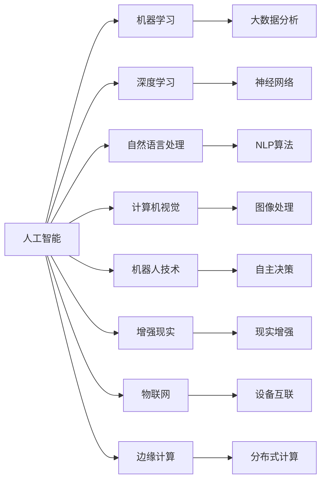
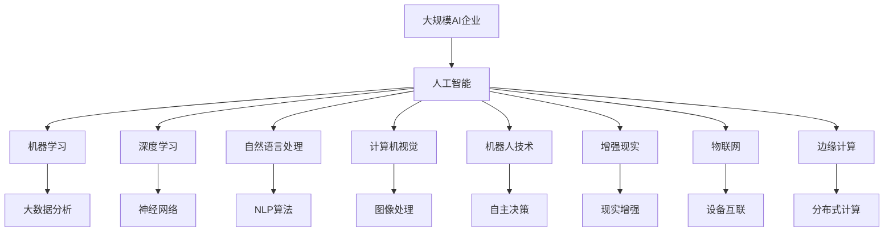

                 

## 1. 背景介绍

### 1.1 问题由来
随着人工智能技术的飞速发展，越来越多的企业开始将AI技术作为核心竞争力，致力于通过智能解决方案推动业务创新和转型。然而，AI企业的建设和发展面临着诸多挑战和不确定性，未来的发展方向也在不断演变。本文将从AI企业的背景、核心概念以及未来发展方向等方面进行全面探讨，旨在为企业领导者提供深度的技术见解和战略建议。

### 1.2 问题核心关键点
AI企业的发展核心关键点主要包括以下几个方面：
1. **数据驱动**：AI企业必须依赖大量的高质量数据进行模型训练和优化。
2. **算法创新**：不断推进算法创新，提高模型的精度和泛化能力。
3. **人机协作**：实现人与AI的协同工作，提升决策效率和准确性。
4. **业务融合**：将AI技术深度融入企业核心业务，实现业务智能化转型。
5. **伦理合规**：确保AI应用符合伦理标准和法律法规要求。
6. **可持续发展**：建立长期的AI发展战略，确保企业的可持续增长。

这些关键点将指导AI企业在面对未来不确定性时，如何制定发展策略和实施方向。

### 1.3 问题研究意义
AI企业的未来发展方向研究具有重要的意义：
1. **降低风险**：通过系统地规划AI企业的未来发展，有助于企业规避AI应用带来的潜在风险。
2. **提升竞争力**：明确AI企业的长期发展目标，增强企业的市场竞争力和创新能力。
3. **创造价值**：帮助企业探索AI技术的潜在商业价值，推动业务模式创新。
4. **社会责任**：通过负责任的AI应用，提升企业的社会形象和影响力。

## 2. 核心概念与联系

### 2.1 核心概念概述

为了更好地理解AI企业的未来发展方向，本节将介绍几个关键概念：

- **人工智能（AI）**：利用计算机技术模拟人类智能行为，包括感知、学习、推理、规划等。
- **机器学习（ML）**：通过数据和算法训练模型，使机器具备自我学习能力。
- **深度学习（DL）**：一种特殊的机器学习方法，通过多层神经网络模拟人脑神经元处理信息的方式。
- **自然语言处理（NLP）**：使计算机能够理解、处理和生成自然语言。
- **计算机视觉（CV）**：让计算机“看”和理解图像和视频数据的技术。
- **机器人技术**：结合AI、传感器和执行器，使机器能够自主决策和执行任务。
- **增强现实（AR）**：通过数字信息增强现实环境，提供沉浸式体验。
- **物联网（IoT）**：连接各种设备，实现数据实时交互和分析。
- **边缘计算**：将数据处理和计算任务分散到网络边缘的设备上，降低延迟和带宽成本。

这些核心概念构成了AI企业的基础技术框架，相互之间具有紧密的联系和依赖关系。

### 2.2 概念间的关系

这些核心概念之间存在着紧密的联系，形成了AI企业技术发展的完整生态系统。以下是几个关键概念之间的关系：



这个流程图展示了大规模AI企业技术生态系统的关键组成部分及其之间的关系：

1. 人工智能是AI企业的基础，通过多种技术手段实现。
2. 机器学习是实现人工智能的核心方法，依赖大量数据训练。
3. 深度学习是大数据和复杂模型训练的关键技术。
4. 自然语言处理、计算机视觉、机器人技术、增强现实、物联网和边缘计算等技术，进一步扩展了AI的应用领域和能力。
5. 大数据分析和分布式计算等技术，支持AI模型的高效训练和推理。

这些概念共同构成了AI企业的技术框架，为企业提供了全面的解决方案，助力企业实现智能化转型。

### 2.3 核心概念的整体架构

最后，我们用一个综合的流程图来展示这些核心概念在大规模AI企业中的整体架构：



这个综合流程图展示了从人工智能到具体技术实现的完整路径，为企业提供了系统化的技术路线图。

## 3. 核心算法原理 & 具体操作步骤

### 3.1 算法原理概述

AI企业的未来发展方向涉及多种算法和技术，但核心算法原理主要围绕数据驱动、算法创新和业务融合展开。

- **数据驱动**：AI企业必须依赖高质量的数据进行模型训练和优化。通过数据收集、处理和标注，构建企业级的训练数据集，实现模型的自监督和监督学习。
- **算法创新**：不断推进算法创新，提升模型的精度和泛化能力。利用深度学习、强化学习等技术，探索新的模型结构和优化方法。
- **业务融合**：将AI技术深度融入企业的核心业务，如生产、营销、运营等，实现业务智能化转型。通过集成AI应用，提升企业的决策效率和运营效率。

### 3.2 算法步骤详解

AI企业的未来发展方向涉及多个关键步骤：

1. **数据收集与处理**：构建企业级的数据仓库，收集和整理各类业务数据，包括交易记录、客户行为、市场趋势等。通过数据清洗和标注，确保数据质量。
2. **模型训练与优化**：选择合适的算法和技术，利用企业级数据集进行模型训练。通过交叉验证和超参数调整，优化模型性能。
3. **集成与部署**：将训练好的模型集成到企业核心业务系统中，实现自动化决策和智能操作。通过API接口和微服务架构，提高系统的可扩展性和可维护性。
4. **持续迭代与优化**：定期收集反馈数据，对模型进行迭代和优化。通过在线学习技术，提升模型的实时性能。
5. **业务融合与创新**：将AI技术深入融入企业核心业务，推动业务模式创新和转型。通过智能营销、智能客服、智能生产等应用，提升企业的竞争力。

### 3.3 算法优缺点

AI企业的未来发展方向具有以下优点和缺点：

**优点**：
1. **高效决策**：AI技术能够快速处理大量数据，提升决策效率和准确性。
2. **成本节约**：通过自动化和智能化操作，减少人力和运营成本。
3. **市场竞争**：AI技术成为企业核心竞争力，提升市场竞争力。
4. **客户体验**：通过智能客服和推荐系统，提升客户满意度和忠诚度。

**缺点**：
1. **数据依赖**：AI模型依赖高质量的数据，数据质量不佳将影响模型效果。
2. **技术复杂**：AI技术的实现需要较高的技术门槛和资源投入。
3. **伦理挑战**：AI应用可能引发伦理和隐私问题，需要建立健全的法律法规和伦理标准。
4. **安全风险**：AI模型可能存在漏洞，需加强安全防护措施。

### 3.4 算法应用领域

AI企业的未来发展方向涉及多个应用领域：

- **智能客服**：通过AI技术实现自动化客服，提升客户服务效率和质量。
- **智能营销**：利用数据分析和机器学习，实现精准营销和广告投放。
- **智能生产**：通过自动化和智能化操作，提升生产效率和产品质量。
- **智能物流**：利用AI技术优化物流路径和仓储管理，提升供应链效率。
- **智能金融**：通过AI技术实现风险控制、投资分析和客户服务，提升金融服务质量。
- **智能医疗**：利用AI技术实现疾病诊断、治疗方案推荐和患者管理，提升医疗服务质量。
- **智能制造**：通过AI技术实现智能制造和质量控制，提升制造业的智能化水平。

## 4. 数学模型和公式 & 详细讲解 & 举例说明

### 4.1 数学模型构建

AI企业的未来发展方向涉及多个数学模型和技术方法，包括但不限于以下几种：

- **回归模型**：用于预测连续型变量的值，如销售预测、用户行为分析等。
- **分类模型**：用于分类问题的解决，如用户流失预测、客户分类等。
- **聚类模型**：用于发现数据中的潜在模式和结构，如客户分群、产品分类等。
- **序列模型**：用于处理时间序列数据，如股票价格预测、市场需求分析等。
- **强化学习模型**：用于优化决策过程，如自动驾驶、机器人控制等。

### 4.2 公式推导过程

以下我们以回归模型为例，推导线性回归模型的基本公式及其梯度下降算法的计算过程。

假设我们有一个训练集 $\{(x_i, y_i)\}_{i=1}^N$，其中 $x_i$ 是输入特征向量，$y_i$ 是目标变量。线性回归模型的预测公式为：

$$
\hat{y} = \theta_0 + \theta_1x_1 + \theta_2x_2 + ... + \theta_px_p
$$

其中 $\theta = [\theta_0, \theta_1, ..., \theta_p]^T$ 是模型参数。

线性回归模型的损失函数通常采用均方误差（MSE），其公式为：

$$
\mathcal{L}(\theta) = \frac{1}{N}\sum_{i=1}^N(y_i - \hat{y}_i)^2
$$

通过梯度下降算法更新模型参数，公式为：

$$
\theta \leftarrow \theta - \eta\nabla_{\theta}\mathcal{L}(\theta)
$$

其中 $\eta$ 是学习率，$\nabla_{\theta}\mathcal{L}(\theta)$ 是损失函数对模型参数的梯度，可以通过反向传播算法计算。

### 4.3 案例分析与讲解

以下以一个简单的电商推荐系统为例，展示如何使用线性回归模型进行用户行为预测。

假设我们有一个电商平台的交易数据集，包含用户ID、商品ID、购买时间、购买金额等特征。我们的目标是预测用户是否会在未来购买某种商品。

1. **数据预处理**：首先对数据进行清洗和预处理，如去除缺失值、异常值，归一化特征等。
2. **特征工程**：设计合适的特征，如用户购买频率、商品热度、促销活动等。
3. **模型训练**：构建线性回归模型，利用训练集进行模型训练。
4. **模型评估**：使用测试集评估模型效果，如准确率、召回率、F1分数等。
5. **模型部署**：将训练好的模型集成到推荐系统中，实现实时推荐。

## 5. 项目实践：代码实例和详细解释说明

### 5.1 开发环境搭建

在进行AI企业未来发展方向的研究时，我们需要准备好开发环境。以下是使用Python进行机器学习和深度学习开发的环境配置流程：

1. 安装Anaconda：从官网下载并安装Anaconda，用于创建独立的Python环境。

2. 创建并激活虚拟环境：
```bash
conda create -n myenv python=3.8
conda activate myenv
```

3. 安装Python依赖包：
```bash
pip install numpy scipy pandas scikit-learn scikit-optimize
```

4. 安装TensorFlow和PyTorch：
```bash
pip install tensorflow==2.4
pip install torch torchvision torchaudio
```

5. 安装TensorBoard和Weights & Biases：
```bash
pip install tensorboard
pip install wandb
```

6. 安装Jupyter Notebook：
```bash
pip install jupyter notebook
```

完成上述步骤后，即可在`myenv`环境中开始AI企业未来发展方向的研究。

### 5.2 源代码详细实现

下面以一个简单的电商推荐系统为例，展示如何使用线性回归模型进行用户行为预测。

```python
import pandas as pd
import numpy as np
from sklearn.linear_model import LinearRegression
from sklearn.model_selection import train_test_split
from sklearn.metrics import mean_squared_error, r2_score

# 加载数据
data = pd.read_csv('sales_data.csv')

# 特征选择和预处理
features = ['user_id', 'item_id', 'timestamp']
X = data[features]
y = data['purchase_amount']

# 数据拆分
X_train, X_test, y_train, y_test = train_test_split(X, y, test_size=0.2, random_state=42)

# 模型训练
model = LinearRegression()
model.fit(X_train, y_train)

# 模型评估
y_pred = model.predict(X_test)
mse = mean_squared_error(y_test, y_pred)
rmse = np.sqrt(mse)
r2 = r2_score(y_test, y_pred)
print(f'RMSE: {rmse:.2f}, R^2: {r2:.2f}')
```

以上代码展示了如何使用线性回归模型进行用户行为预测的基本流程。

### 5.3 代码解读与分析

让我们再详细解读一下关键代码的实现细节：

**数据加载和预处理**：
- 使用Pandas库加载数据集。
- 选择和预处理特征，去除缺失值和异常值，进行特征归一化。

**模型训练**：
- 使用Scikit-learn库中的线性回归模型。
- 对训练集进行模型训练，得到模型参数。

**模型评估**：
- 使用测试集对模型进行评估，计算均方误差、均方根误差和决定系数。
- 输出评估结果，展示模型的预测性能。

**模型部署**：
- 将训练好的模型集成到推荐系统中，实现实时推荐。

以上代码实现了一个简单的电商推荐系统，展示了AI企业未来发展方向的研究过程。在实际应用中，还需要进一步优化模型、调整超参数、进行特征工程等操作，才能得到更好的预测效果。

## 6. 实际应用场景

### 6.1 智能客服系统

AI企业的未来发展方向在智能客服系统的应用中具有重要意义。智能客服系统通过自然语言处理、机器学习和语音识别技术，实现客户咨询的自动化响应。智能客服系统能够24小时在线，处理大量客户咨询，提升客户满意度和企业效率。

### 6.2 智能制造

AI企业的未来发展方向在智能制造中的应用主要体现在生产自动化和质量控制上。通过传感器和机器学习技术，实现设备的自动化监测和故障预测，提升生产效率和产品质量。AI技术还可以应用于供应链管理，优化物流路径和仓储管理，提升供应链效率。

### 6.3 金融风险管理

AI企业的未来发展方向在金融风险管理中的应用主要体现在信用评估、风险控制和投资分析上。通过机器学习和数据分析技术，实现对客户信用评估和风险预测，优化贷款审批流程，降低坏账率。AI技术还可以应用于智能投顾，提供个性化的投资建议，提升投资回报率。

### 6.4 未来应用展望

AI企业的未来发展方向涉及多个未来应用领域，包括以下几个方面：

- **智能城市**：利用AI技术优化城市管理，如交通流量控制、环境监测等。
- **医疗健康**：通过AI技术实现疾病诊断、治疗方案推荐和患者管理，提升医疗服务质量。
- **自动驾驶**：利用AI技术实现自动驾驶和智能交通管理，提升交通安全和效率。
- **个性化推荐**：通过AI技术实现个性化推荐，提升用户体验和满意度。
- **教育培训**：利用AI技术实现智能教学和个性化学习，提升教育效果。
- **农业智能化**：通过AI技术实现农业智能化管理，提升农业生产效率和资源利用率。

以上应用领域展示了AI企业的未来发展方向在各个行业中的广泛应用，具有巨大的商业潜力和社会价值。

## 7. 工具和资源推荐

### 7.1 学习资源推荐

为了帮助开发者系统掌握AI企业的未来发展方向，这里推荐一些优质的学习资源：

1. **深度学习框架和库**：如TensorFlow、PyTorch、Keras等，提供了丰富的AI开发工具和算法库。
2. **在线课程和教程**：如Coursera、Udacity、edX等平台上的机器学习课程，涵盖从入门到高级的AI知识。
3. **开源项目和代码库**：如GitHub上的TensorFlow和PyTorch等官方代码库，提供了丰富的代码示例和实践指南。
4. **技术博客和社区**：如Google AI Blog、Medium等技术博客，以及Kaggle、Stack Overflow等社区，提供了最新的AI技术进展和实践经验。
5. **专业书籍和论文**：如《深度学习》、《机器学习实战》、《动手学深度学习》等经典书籍，以及顶级学术会议和期刊上的最新论文，提供了系统化的AI知识体系和前沿研究成果。

### 7.2 开发工具推荐

高效的开发离不开优秀的工具支持。以下是几款用于AI企业未来发展方向开发的常用工具：

1. **Python**：Python是AI开发中最常用的编程语言，具有丰富的科学计算和数据分析库。
2. **Jupyter Notebook**：Jupyter Notebook提供了交互式编程环境，方便开发者进行数据探索和模型训练。
3. **TensorBoard**：TensorBoard提供了模型训练的可视化工具，方便开发者监控模型训练状态和效果。
4. **Weights & Biases**：Weights & Biases提供了实验跟踪工具，方便开发者记录和分析实验结果。
5. **Github**：GitHub提供了代码版本控制和协作开发工具，方便开发者进行代码管理和共享。
6. **Anaconda**：Anaconda提供了Python环境的隔离和管理，方便开发者进行环境部署和迁移。

### 7.3 相关论文推荐

AI企业的未来发展方向涉及多个前沿领域，以下是几篇奠基性的相关论文，推荐阅读：

1. **《深度学习》（Deep Learning）**：Goodfellow等著，详细介绍了深度学习的基本概念和算法，是深度学习领域的经典教材。
2. **《人工智能：一种现代方法》（Artificial Intelligence: A Modern Approach）**：Russell和Norvig等著，全面介绍了AI的基本原理和应用，是AI领域的经典教材。
3. **《机器学习》（Pattern Recognition and Machine Learning）**：Christopher M. Bishop著，介绍了机器学习的基本算法和应用，是机器学习领域的经典教材。
4. **《强化学习》（Reinforcement Learning: An Introduction）**：Sutton和Barto著，详细介绍了强化学习的基本算法和应用，是强化学习领域的经典教材。
5. **《自然语言处理综论》（Speech and Language Processing）**：Daniel Jurafsky和James H. Martin著，介绍了自然语言处理的基本概念和算法，是自然语言处理领域的经典教材。

这些论文代表了大规模AI企业未来发展方向的理论基础和实践指南，是理解AI技术的重要参考。

## 8. 总结：未来发展趋势与挑战

### 8.1 总结

本文对AI企业的未来发展方向进行了全面系统的介绍。首先阐述了AI企业的背景、核心概念以及未来发展方向，明确了AI企业建设和发展的重要性和目标。其次，从原理到实践，详细讲解了AI企业未来发展方向涉及的关键步骤和算法，提供了系统化的解决方案和实践指南。最后，本文还介绍了AI企业未来发展方向在多个行业领域的应用前景，展示了其广泛的市场潜力和社会价值。

通过本文的系统梳理，可以看到，AI企业的未来发展方向是一个系统化的过程，涉及数据驱动、算法创新和业务融合等多个方面。AI企业需要在技术、管理和业务等多个维度进行全面优化，才能在未来的竞争中保持领先地位。

### 8.2 未来发展趋势

展望未来，AI企业的未来发展方向将呈现以下几个趋势：

1. **技术突破**：AI技术将不断取得新的突破，如量子计算、基因编辑等前沿技术，将为AI企业提供更多的技术支撑和应用场景。
2. **产业融合**：AI技术将进一步融合到各个行业，推动产业数字化和智能化转型，如智能制造、智能交通、智能医疗等。
3. **数据驱动**：数据将成为AI企业的重要资源，企业将投入大量资源进行数据收集和处理，提升模型的训练效果和性能。
4. **算法创新**：AI企业将继续推进算法创新，提升模型的精度和泛化能力，如深度学习、强化学习、迁移学习等。
5. **人机协作**：AI企业将更加注重人机协作，通过AI技术和人类智慧的结合，提升决策效率和质量。
6. **可持续发展**：AI企业将更加注重可持续发展，减少对环境的负面影响，推动绿色智能发展。

这些趋势将引领AI企业的未来发展方向，推动AI技术的广泛应用和商业价值的实现。

### 8.3 面临的挑战

尽管AI企业的未来发展方向具有广阔的前景，但在迈向更加智能化、普适化应用的过程中，仍面临诸多挑战：

1. **数据质量**：高质量数据是AI模型的基础，数据的真实性、完整性和安全性直接影响模型效果。
2. **技术复杂性**：AI技术的实现需要高水平的技术和资源投入，对企业和人才的要求较高。
3. **伦理合规**：AI应用可能引发伦理和隐私问题，需要建立健全的法律法规和伦理标准。
4. **安全风险**：AI模型可能存在漏洞，需加强安全防护措施，确保系统的稳定性和可靠性。
5. **可持续性**：AI企业需要考虑资源消耗和环境影响，确保长期可持续发展。

这些挑战需要企业在技术、管理和法律等多个维度进行深入研究和改进，才能更好地应对未来的发展。

### 8.4 研究展望

面对AI企业的未来发展方向所面临的挑战，未来的研究需要在以下几个方面寻求新的突破：

1. **数据管理**：开发高效的数据收集、处理和存储技术，提升数据质量和管理效率。
2. **算法优化**：研究和应用更加高效、鲁棒的算法，提升模型的性能和泛化能力。
3. **伦理与安全**：建立健全的伦理标准和安全防护机制，确保AI应用的安全性和公平性。
4. **人机协同**：探索人机协作的新模式，提升决策效率和质量，增强人类对AI系统的信任和依赖。
5. **可持续发展**：开发绿色智能技术，减少资源消耗和环境影响，推动可持续发展。

这些研究方向将引领AI企业未来发展方向的研究，推动AI技术的全面应用和商业价值的实现。

## 9. 附录：常见问题与解答

**Q1：AI企业未来的技术趋势有哪些？**

A: AI企业未来的技术趋势主要包括以下几个方面：
1. **深度学习**：深度学习将继续发展，推动模型的精度和泛化能力提升。
2. **强化学习**：强化学习将进一步应用于智能决策和机器人控制等领域。
3. **自然语言处理**：自然语言处理技术将更加普及，提升人机交互的效率和质量。
4. **计算机视觉**：计算机视觉技术将广泛应用于智能监控、自动驾驶等领域。
5. **智能制造**：智能制造技术将推动制造业的智能化和自动化转型。
6. **边缘计算**：边缘计算技术将提升数据处理和分析的实时性和效率。

这些技术趋势将为AI企业提供更强大的技术支撑和应用场景，推动企业创新和转型。

**Q2：AI企业在落地应用中应注意哪些问题？**

A: AI企业在落地应用中应注意以下几个问题：
1. **数据隐私**：保护用户数据隐私，确保数据使用的合法性和透明性。
2. **公平性**：确保AI应用对不同群体的公平性，避免算法偏见和歧视。
3. **安全性**：加强系统的安全防护措施，避免黑客攻击和数据泄露。
4. **可解释性**：提升AI系统的可解释性，增强用户对系统的信任和依赖。
5. **法律合规**：确保AI应用符合法律法规要求，避免法律风险和纠纷。

这些问题需要在技术、管理和法律等多个维度进行综合考虑和优化，才能保障AI应用的顺利落地和广泛应用。

**Q3：AI企业如何进行业务融合？**

A: AI企业进行业务融合主要包括以下几个方面：
1. **数据融合**：将业务数据与AI数据进行整合，提升数据质量和利用效率。
2. **系统集成**：将AI应用集成到核心业务系统中，实现自动化和智能化操作。
3. **流程优化**：利用AI技术优化业务流程，提升运营效率和客户体验。
4. **市场创新**：通过AI技术推动市场创新，提升产品和服务的竞争力。
5. **客户体验**：利用AI技术提升客户体验，增强客户满意度和忠诚度。

这些融合方式将推动AI企业实现业务智能化转型，提升企业的竞争力和市场价值。

**Q4：AI企业如何进行技术创新？**

A: AI企业进行技术创新主要包括以下几个方面：
1. **算法创新**：研究和应用新的算法和技术，提升模型的精度和泛化能力。
2. **技术整合**：将不同技术进行整合，提升系统的整体性能和效率。
3. **跨领域应用**：将AI技术应用到不同领域，推动技术的广泛应用和商业价值的实现。
4. **数据驱动**：利用数据进行模型训练和优化，提升模型的性能和效果。
5. **持续学习**：建立持续学习机制，保持技术创新和模型优化。

这些创新方式将推动AI企业实现技术突破和商业价值提升，推动企业的长期发展和竞争力的提升。

**Q5：AI企业如何进行人才管理？**

A: AI企业进行人才管理主要包括以下几个

