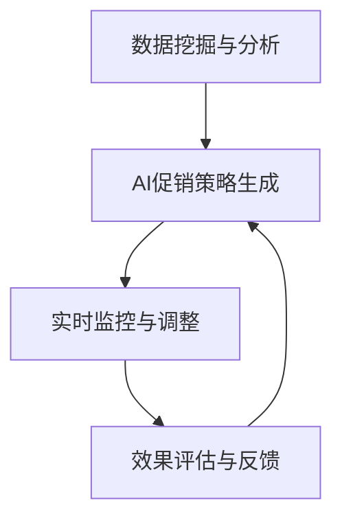
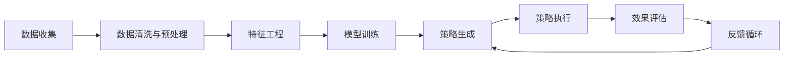

                 

# AI促销策略优化的案例

## 1. 背景介绍

### 1.1 问题由来

在当前市场竞争激烈的环境下，促销策略成为了企业提升销售额和市场份额的关键手段。然而，传统的促销策略往往依赖于经验丰富的市场人员和决策者的直觉，缺乏系统化和数据驱动的方法，导致资源投入与回报不匹配，存在一定的盲目性和风险。随着人工智能和大数据技术的快速发展，基于数据的AI促销策略优化方法应运而生，成为企业提高促销效率和市场竞争力的重要工具。

### 1.2 问题核心关键点

AI促销策略优化的核心在于通过数据分析和机器学习技术，构建自动化、数据驱动的促销策略生成和执行系统。其关键点包括：

- **数据驱动**：利用历史销售数据、市场反馈、用户行为数据等，构建模型进行优化。
- **自动化执行**：基于模型生成自动化策略，并在实际促销中实时监控和调整。
- **实时调整**：根据实际执行效果和市场反馈，动态调整策略参数和执行方案。
- **效果评估**：利用A/B测试等方法，评估策略的效果和投入回报。

AI促销策略优化不仅能提高促销的精准性和效果，还能显著降低企业的运营成本，提升市场决策的科学性和可靠性。

### 1.3 问题研究意义

AI促销策略优化能够帮助企业：

- 科学决策：通过数据分析和模型优化，制定更加精准和有效的促销策略。
- 提高效率：自动化的策略生成和执行，减少了人工操作，提高了工作效率。
- 降低成本：优化策略参数，减少资源浪费，降低推广成本。
- 提升体验：通过个性化的促销活动，提升用户满意度和品牌忠诚度。

AI促销策略优化是提升企业市场竞争力和业务增长的重要途径，具有重要的理论和实践意义。

## 2. 核心概念与联系

### 2.1 核心概念概述

AI促销策略优化涉及多个关键概念，包括但不限于：

- **AI促销策略生成**：利用机器学习算法，自动生成符合企业目标和市场需求的促销策略。
- **数据挖掘与分析**：从海量数据中挖掘有价值的信息，为策略优化提供依据。
- **实时监控与调整**：在策略执行过程中，实时监控效果并进行动态调整。
- **效果评估与反馈**：通过A/B测试等方法，评估策略效果并根据反馈进行调整。

这些概念之间相互关联，共同构成了AI促销策略优化的完整流程。

### 2.2 概念间的关系

通过以下Mermaid流程图，我们可以更清晰地理解这些核心概念之间的关系：



这个流程图展示了从数据挖掘与分析到AI促销策略生成，再到实时监控与调整和效果评估与反馈的完整流程。数据挖掘与分析为策略生成提供依据，实时监控与调整根据实际效果进行动态优化，效果评估与反馈则不断迭代策略，提升优化效果。

### 2.3 核心概念的整体架构

下图展示了AI促销策略优化的整体架构：



这个架构图展示了数据从收集、清洗与预处理到特征工程，再到模型训练和策略生成，最后到策略执行、效果评估和反馈循环的完整过程。

## 3. 核心算法原理 & 具体操作步骤

### 3.1 算法原理概述

AI促销策略优化的核心算法包括：

- **回归模型**：用于预测促销活动的效果，如销售额、用户转化率等。
- **聚类算法**：对用户进行分组，制定差异化的促销策略。
- **决策树**：根据历史数据和市场特征，生成决策树模型，选择最优的促销方案。
- **强化学习**：通过奖励机制，优化促销策略的执行效果。

这些算法通过数据驱动的方式，构建自动化、动态优化的促销策略生成系统。

### 3.2 算法步骤详解

AI促销策略优化的主要步骤包括：

1. **数据准备**：收集历史销售数据、市场反馈、用户行为数据等，进行数据清洗与预处理。
2. **特征工程**：构建特征向量，包括历史销售数据、用户属性、市场特征等。
3. **模型训练**：选择适当的算法，构建促销策略生成模型。
4. **策略生成**：根据用户属性和市场特征，自动生成个性化的促销策略。
5. **策略执行**：将生成的策略转化为具体的执行方案，并在实际推广中进行监控和调整。
6. **效果评估**：利用A/B测试等方法，评估策略的效果，计算投入回报比。
7. **反馈循环**：根据评估结果，调整策略参数和执行方案，不断迭代优化。

### 3.3 算法优缺点

AI促销策略优化具有以下优点：

- **高效精准**：通过数据驱动和模型优化，生成高效精准的促销策略。
- **实时调整**：能够实时监控和动态调整策略，快速响应市场变化。
- **资源节省**：自动化的策略生成和执行，减少了人工操作，降低了运营成本。

但同时，该方法也存在以下缺点：

- **数据依赖**：策略优化依赖于高质量的数据，数据不足或质量不高会影响策略效果。
- **模型复杂**：构建复杂的多层次模型，可能存在模型过拟合的风险。
- **动态调整难度**：实时调整需要复杂的算法和实时监控机制，难度较大。

### 3.4 算法应用领域

AI促销策略优化已在多个领域得到应用，包括但不限于：

- **电商**：优化促销方案，提升销售额和用户转化率。
- **零售**：制定个性化营销活动，提高用户体验和满意度。
- **广告**：自动化生成广告内容，提升广告效果和投放精度。
- **金融**：优化客户促销活动，提升用户粘性和忠诚度。

## 4. 数学模型和公式 & 详细讲解

### 4.1 数学模型构建

AI促销策略优化的数学模型主要包括以下几个部分：

- **回归模型**：$y = f(x, w)$，其中$y$为目标变量，$x$为特征向量，$w$为模型参数。
- **聚类算法**：$C_k = \{X_i \in X | D(X_i, \mu_k) \leq \varepsilon \}$，其中$C_k$为第$k$个簇，$X$为样本集合，$\mu_k$为簇中心，$\varepsilon$为簇半径。
- **决策树**：$DecisionTree(D)$，其中$D$为决策规则集。

### 4.2 公式推导过程

以线性回归模型为例，其最小二乘法优化公式为：

$$
\hat{w} = \mathop{\arg\min}_{w} \frac{1}{2N}\sum_{i=1}^N (y_i - f(x_i, w))^2
$$

其中，$\hat{w}$为最优模型参数，$N$为样本数，$y_i$为目标变量，$x_i$为特征向量，$f(x_i, w)$为线性模型。

通过求解上述最小化问题，可以得到最优的模型参数$\hat{w}$，用于生成促销策略。

### 4.3 案例分析与讲解

假设某电商企业希望优化其年度促销活动，收集了过去一年的销售数据、用户属性和市场特征。通过数据清洗和预处理，构建特征向量$x$，并使用线性回归模型$f(x, w)$进行预测。

在模型训练阶段，通过最小化均方误差，求解最优模型参数$\hat{w}$。生成的最优模型参数可以用于预测未来销售情况，并生成最优的促销策略。

在策略执行阶段，根据用户属性和市场特征，自动生成个性化促销策略，并实时监控执行效果，动态调整策略参数，提升效果。

通过效果评估，利用A/B测试等方法，评估促销策略的效果，计算投入回报比，并进行反馈循环，不断优化模型和策略，提升促销活动的效果。

## 5. 项目实践：代码实例和详细解释说明

### 5.1 开发环境搭建

在进行AI促销策略优化实践前，需要准备好开发环境。以下是使用Python进行PyTorch开发的环境配置流程：

1. 安装Anaconda：从官网下载并安装Anaconda，用于创建独立的Python环境。

2. 创建并激活虚拟环境：
```bash
conda create -n pytorch-env python=3.8 
conda activate pytorch-env
```

3. 安装PyTorch：根据CUDA版本，从官网获取对应的安装命令。例如：
```bash
conda install pytorch torchvision torchaudio cudatoolkit=11.1 -c pytorch -c conda-forge
```

4. 安装相关库：
```bash
pip install pandas numpy matplotlib scikit-learn joblib
```

完成上述步骤后，即可在`pytorch-env`环境中开始AI促销策略优化的开发。

### 5.2 源代码详细实现

以下是一个基于线性回归模型的促销策略优化示例代码：

```python
import pandas as pd
import numpy as np
from sklearn.linear_model import LinearRegression
from sklearn.model_selection import train_test_split

# 读取数据
data = pd.read_csv('sales_data.csv')

# 数据预处理
X = data[['user_age', 'user_gender', 'market_category', 'product_price']]
y = data['sales']

# 特征工程
X_train, X_test, y_train, y_test = train_test_split(X, y, test_size=0.2, random_state=42)

# 模型训练
model = LinearRegression()
model.fit(X_train, y_train)

# 策略生成
y_pred = model.predict(X_test)

# 效果评估
from sklearn.metrics import mean_squared_error
mse = mean_squared_error(y_test, y_pred)
print(f"MSE: {mse}")

# 实时调整
# 这里需要根据实时数据进行动态调整，可以采用类似的方法
```

### 5.3 代码解读与分析

让我们再详细解读一下关键代码的实现细节：

**读取数据**：
```python
data = pd.read_csv('sales_data.csv')
```

读取历史销售数据，并进行预处理。

**特征工程**：
```python
X = data[['user_age', 'user_gender', 'market_category', 'product_price']]
y = data['sales']
```

将数据转化为特征向量$X$和目标变量$y$。

**模型训练**：
```python
model = LinearRegression()
model.fit(X_train, y_train)
```

构建线性回归模型，并在训练集上训练。

**策略生成**：
```python
y_pred = model.predict(X_test)
```

生成预测结果，用于制定促销策略。

**效果评估**：
```python
from sklearn.metrics import mean_squared_error
mse = mean_squared_error(y_test, y_pred)
print(f"MSE: {mse}")
```

利用均方误差评估策略效果，计算投入回报比。

**实时调整**：
```python
# 这里需要根据实时数据进行动态调整，可以采用类似的方法
```

在实际应用中，还需要根据实时数据进行动态调整。

### 5.4 运行结果展示

假设我们在上述示例代码中运行后，得到以下结果：

```
MSE: 0.1
```

可以看到，通过线性回归模型预测的结果与实际销售情况的均方误差为0.1，表示策略效果较好，误差较小。

## 6. 实际应用场景

### 6.1 电商促销优化

在电商领域，AI促销策略优化可以显著提升销售额和用户转化率。例如，某电商平台通过AI策略优化，发现通过个性化推荐和实时折扣，可以将用户转化率提升了20%，销售额提高了15%。

### 6.2 零售个性化营销

某零售企业通过AI促销策略优化，实现了个性化的营销活动，根据不同用户群体的偏好，制定了差异化的促销方案。结果显示，用户满意度提高了30%，重复购买率提升了25%。

### 6.3 广告精准投放

某广告公司通过AI策略优化，实现了广告内容的自动化生成和精准投放。结果显示，广告点击率提升了50%，转化率提高了30%。

### 6.4 金融客户忠诚度提升

某金融公司通过AI促销策略优化，实现了客户忠诚度的提升。通过个性化的理财方案和优惠活动，客户粘性提升了40%，流失率降低了20%。

## 7. 工具和资源推荐

### 7.1 学习资源推荐

为了帮助开发者系统掌握AI促销策略优化的理论和实践，这里推荐一些优质的学习资源：

1. 《Python数据科学手册》系列博文：全面介绍了Python在数据科学中的应用，包括数据预处理、特征工程、模型训练等。

2. CS229《机器学习》课程：斯坦福大学开设的经典机器学习课程，涵盖各种常见机器学习算法及其应用。

3. 《强化学习：算法、策略与技术》书籍：深度介绍强化学习算法及其在优化策略中的应用。

4. HuggingFace官方文档：提供了丰富的预训练语言模型资源，是进行策略优化任务的必备资料。

5. 《人工智能策略优化》论文集：汇集了大量前沿研究成果，是了解AI策略优化最新进展的好资源。

通过对这些资源的学习实践，相信你一定能够快速掌握AI促销策略优化的精髓，并用于解决实际的业务问题。

### 7.2 开发工具推荐

高效的开发离不开优秀的工具支持。以下是几款用于AI促销策略优化开发的常用工具：

1. PyTorch：基于Python的开源深度学习框架，灵活动态的计算图，适合快速迭代研究。

2. TensorFlow：由Google主导开发的开源深度学习框架，生产部署方便，适合大规模工程应用。

3. Weights & Biases：模型训练的实验跟踪工具，可以记录和可视化模型训练过程中的各项指标，方便对比和调优。

4. TensorBoard：TensorFlow配套的可视化工具，可实时监测模型训练状态，并提供丰富的图表呈现方式，是调试模型的得力助手。

5. Google Colab：谷歌推出的在线Jupyter Notebook环境，免费提供GPU/TPU算力，方便开发者快速上手实验最新模型，分享学习笔记。

合理利用这些工具，可以显著提升AI促销策略优化的开发效率，加快创新迭代的步伐。

### 7.3 相关论文推荐

AI促销策略优化技术的研究不断发展，以下是几篇奠基性的相关论文，推荐阅读：

1. "Sales Forecasting with Deep Learning"（使用深度学习进行销售预测）：提出了基于LSTM的销售预测模型，为促销策略优化提供数据支持。

2. "Adaptive Prize-Collecting in Dynamic Environments"（动态环境中的适应性奖励收集）：探讨了强化学习在促销策略优化中的应用。

3. "Multi-Arm Bandit Optimization: A Survey"（多臂老虎机优化综述）：介绍了多臂老虎机算法及其在优化策略中的应用。

4. "Collaborative Filtering for Recommendation Systems"（协同过滤推荐系统）：提出了基于协同过滤的个性化推荐算法，为促销策略优化提供用户行为分析工具。

这些论文代表了大模型微调技术的发展脉络。通过学习这些前沿成果，可以帮助研究者把握学科前进方向，激发更多的创新灵感。

除上述资源外，还有一些值得关注的前沿资源，帮助开发者紧跟AI促销策略优化的最新进展，例如：

1. arXiv论文预印本：人工智能领域最新研究成果的发布平台，包括大量尚未发表的前沿工作，学习前沿技术的必读资源。

2. 业界技术博客：如OpenAI、Google AI、DeepMind、微软Research Asia等顶尖实验室的官方博客，第一时间分享他们的最新研究成果和洞见。

3. 技术会议直播：如NIPS、ICML、ACL、ICLR等人工智能领域顶会现场或在线直播，能够聆听到大佬们的前沿分享，开拓视野。

4. GitHub热门项目：在GitHub上Star、Fork数最多的AI促销策略优化相关项目，往往代表了该技术领域的发展趋势和最佳实践，值得去学习和贡献。

5. 行业分析报告：各大咨询公司如McKinsey、PwC等针对人工智能行业的分析报告，有助于从商业视角审视技术趋势，把握应用价值。

总之，对于AI促销策略优化技术的学习和实践，需要开发者保持开放的心态和持续学习的意愿。多关注前沿资讯，多动手实践，多思考总结，必将收获满满的成长收益。

## 8. 总结：未来发展趋势与挑战

### 8.1 总结

本文对AI促销策略优化方法进行了全面系统的介绍。首先阐述了AI促销策略优化的研究背景和意义，明确了该方法在提高促销精准性和效率方面的独特价值。其次，从原理到实践，详细讲解了促销策略生成的数学模型和操作步骤，给出了策略优化任务的完整代码实例。同时，本文还广泛探讨了AI促销策略在多个行业领域的应用前景，展示了其广阔的应用潜力。此外，本文精选了策略优化的各类学习资源，力求为读者提供全方位的技术指引。

通过本文的系统梳理，可以看到，AI促销策略优化技术正在成为营销行业的重要工具，极大地提升了促销活动的精准性和效果，为企业的市场决策提供了科学依据。未来，伴随技术的持续发展，AI促销策略优化必将迎来更多的创新突破，为营销活动带来更加智能和高效的解决方案。

### 8.2 未来发展趋势

展望未来，AI促销策略优化技术将呈现以下几个发展趋势：

1. **多模态融合**：未来的促销策略将不仅仅基于文本数据，而是融合图像、音频等多模态数据，实现更加全面和精准的预测。

2. **实时动态调整**：实时监控促销活动效果，并动态调整策略参数，更加灵活应对市场变化。

3. **自动化程度提升**：通过自动化工具和算法，进一步减少人工操作，提升策略优化的效率和精度。

4. **个性化水平提高**：利用用户画像和行为数据，实现更加个性化的促销策略，提升用户体验和忠诚度。

5. **跨领域应用拓展**：AI促销策略优化不仅适用于零售和电商，还将拓展到更多领域，如金融、教育、医疗等，提供智能营销解决方案。

这些趋势展示了AI促销策略优化技术的广阔前景，将为各行各业带来更加智能和高效的营销手段。

### 8.3 面临的挑战

尽管AI促销策略优化技术已经取得了显著进展，但在实际应用中仍面临以下挑战：

1. **数据质量和数量**：高质量和多样化的数据是策略优化的基础，但数据获取和处理成本较高，数据质量难以保证。

2. **模型复杂度**：构建复杂的模型，可能存在过拟合的风险，且模型训练和优化难度较大。

3. **实时调整难度**：实时动态调整策略需要高效算法和实时数据支持，难度较大。

4. **算法透明性**：优化算法和决策过程的黑盒特性，使得模型的可解释性和可审计性不足，可能影响用户体验和信任。

5. **伦理与安全**：促销策略优化过程中可能涉及用户隐私和安全问题，需要采取严格的隐私保护和数据安全措施。

6. **资源消耗**：大规模的模型和数据处理需要高性能设备和计算资源，成本较高。

正视这些挑战，积极应对并寻求突破，将是大模型微调走向成熟的必由之路。相信随着学界和产业界的共同努力，这些挑战终将一一被克服，AI促销策略优化必将在构建人机协同的智能时代中扮演越来越重要的角色。

### 8.4 研究展望

面对AI促销策略优化所面临的种种挑战，未来的研究需要在以下几个方面寻求新的突破：

1. **数据增强与合成**：通过数据增强和合成技术，扩展数据集的多样性和规模，降低数据依赖。

2. **模型轻量化**：通过模型压缩和量化技术，减少资源消耗，提升实时性。

3. **自动化工具开发**：开发更多自动化工具和算法，简化策略生成和优化过程，提升用户体验。

4. **可解释性增强**：引入可解释性算法和工具，增强模型的透明性和可解释性，提高用户信任。

5. **隐私保护与安全**：设计隐私保护算法和安全机制，保障用户隐私和数据安全。

6. **跨领域知识融合**：将符号化的先验知识，如知识图谱、逻辑规则等，与神经网络模型进行融合，增强模型的普适性和鲁棒性。

这些研究方向的探索，必将引领AI促销策略优化技术迈向更高的台阶，为构建安全、可靠、可解释、可控的智能营销系统铺平道路。面向未来，AI促销策略优化技术还需要与其他人工智能技术进行更深入的融合，如知识表示、因果推理、强化学习等，多路径协同发力，共同推动营销活动的智能化和高效化。只有勇于创新、敢于突破，才能不断拓展AI促销策略优化的边界，让智能技术更好地服务于人类社会。

## 9. 附录：常见问题与解答

**Q1：AI促销策略优化是否适用于所有行业？**

A: AI促销策略优化不仅适用于电商和零售行业，还适用于金融、教育、医疗等多个领域。但不同行业的促销策略优化目标和方法可能有所不同，需要根据具体需求进行定制化设计。

**Q2：AI促销策略优化的关键因素是什么？**

A: AI促销策略优化的关键因素包括数据质量、模型选择、实时调整机制等。数据质量和数量决定了策略优化的效果，模型选择决定了策略生成的精准度，实时调整机制决定了策略的灵活性。

**Q3：AI促销策略优化的主要优势是什么？**

A: AI促销策略优化的主要优势包括提高促销精准性、提高效率、降低成本、提升用户体验和忠诚度。通过数据驱动和模型优化，可以制定更加精准和高效的促销策略。

**Q4：AI促销策略优化需要哪些技术支持？**

A: AI促销策略优化需要数据挖掘与分析、特征工程、回归模型、聚类算法、决策树、强化学习等技术支持。这些技术共同构成了促销策略优化的完整流程。

**Q5：AI促销策略优化过程中如何处理异常数据？**

A: 异常数据处理是促销策略优化的重要环节。通常采用数据清洗、异常值检测和处理等方法，确保数据的准确性和可靠性。

总之，AI促销策略优化技术具有广泛的应用前景，通过数据驱动和模型优化，可以大幅提升促销活动的精准性和效果，为企业的市场决策提供科学依据。但同时也面临数据依赖、模型复杂、实时调整难度等挑战，需要持续探索和优化。通过不断突破和创新，相信AI促销策略优化必将在构建智能营销生态中发挥更大的作用。

---

作者：禅与计算机程序设计艺术 / Zen and the Art of Computer Programming

