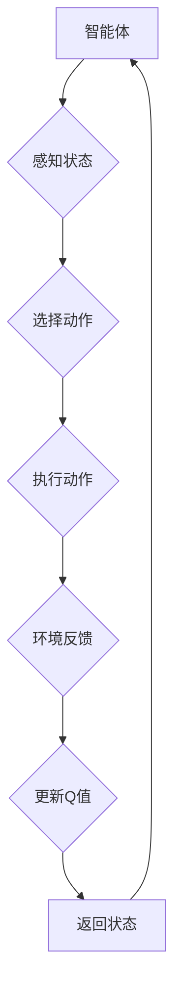

# 一切皆是映射：AI Q-learning探索-利用平衡实践

> 关键词：Q-learning，强化学习，智能决策，动态环境，平衡实践，策略优化，应用场景

## 1. 背景介绍

在人工智能领域中，强化学习（Reinforcement Learning，RL）是一种重要的机器学习方法，它使机器能够在没有明确编程的情况下学习如何做出决策。Q-learning是强化学习中的一个经典算法，它通过学习值函数来预测未来奖励，从而指导智能体在动态环境中做出最优决策。

Q-learning的核心思想是将每个状态和动作组合映射到相应的Q值（即从该状态执行该动作得到最大累积奖励的估计）。通过不断更新Q值，Q-learning能够帮助智能体在复杂环境中找到最优策略。

本文将深入探讨Q-learning的原理、实践和应用，并探讨如何在动态环境中实现平衡实践，以实现智能决策。

## 2. 核心概念与联系

### 2.1 核心概念

- **智能体（Agent）**：在强化学习框架中，智能体是执行动作、感知环境的实体。它可以是机器人、软件程序或其他任何能够接收信息并做出反应的实体。
- **环境（Environment）**：环境是智能体所处的周围世界，它提供状态和奖励信息给智能体。
- **状态（State）**：状态是环境在某一时刻的状态描述，它可以是环境的一个属性或一组属性。
- **动作（Action）**：动作是智能体可以执行的操作，它决定了智能体如何与环境的交互。
- **奖励（Reward）**：奖励是环境对智能体采取的动作的反馈，它可以是正的（积极的）或负的（消极的）。
- **策略（Policy）**：策略是智能体在特定状态下选择动作的规则。
- **值函数（Value Function）**：值函数是预测从给定状态开始采取一系列动作所能获得的最大累积奖励。
- **Q值（Q-Value）**：Q值是智能体在某个状态s下采取某个动作a的预期回报。

### 2.2 Mermaid 流程图



### 2.3 核心概念联系

Q-learning通过将状态和动作映射到Q值，从而学习最优策略。智能体感知状态，选择动作，执行动作，并根据环境的反馈更新Q值。这个过程不断重复，直到达到特定的目标或策略收敛。

## 3. 核心算法原理 & 具体操作步骤

### 3.1 算法原理概述

Q-learning是一种基于值函数的强化学习算法。它通过以下步骤进行学习：

1. 初始化Q表，其中每个状态-动作对的Q值为0。
2. 选择一个初始状态s。
3. 在状态s下选择动作a。
4. 执行动作a，并观察新状态s'和奖励r。
5. 更新Q值：$$ Q(s,a) \leftarrow Q(s,a) + \alpha [r + \gamma \max_{a'} Q(s',a') - Q(s,a)] $$
6. 转到新状态s'，重复步骤3-5，直到达到终止条件。

### 3.2 算法步骤详解

1. **初始化**：创建一个Q表，其中每个状态-动作对的Q值初始化为0。
2. **选择动作**：在当前状态s下，选择一个动作a，可以使用ε-贪婪策略、ε-greedy策略或确定性策略。
3. **执行动作**：执行选择的动作a，并观察新状态s'和奖励r。
4. **更新Q值**：根据新状态s'和奖励r，更新Q值。
5. **更新状态**：将当前状态s更新为新状态s'。
6. **重复**：重复步骤2-5，直到达到终止条件。

### 3.3 算法优缺点

**优点**：

- **自适应**：Q-learning能够根据环境的变化动态调整Q值。
- **无模型**：Q-learning不需要对环境有先验知识，适用于复杂、非确定性的环境。
- **通用性**：Q-learning可以应用于各种强化学习问题。

**缺点**：

- **计算量大**：对于大型状态空间和动作空间，Q表的规模会非常大，计算量也随之增加。
- **收敛速度慢**：在某些情况下，Q-learning可能需要很长的时间才能收敛到最优策略。

### 3.4 算法应用领域

Q-learning在以下领域有广泛的应用：

- **游戏**：如视频游戏、棋类游戏等。
- **机器人**：如机器人导航、路径规划等。
- **电子商务**：如推荐系统、广告投放等。
- **自动驾驶**：如车辆导航、交通流量控制等。

## 4. 数学模型和公式 & 详细讲解 & 举例说明

### 4.1 数学模型构建

Q-learning的数学模型可以用以下公式表示：

$$
 Q(s,a) \leftarrow Q(s,a) + \alpha [r + \gamma \max_{a'} Q(s',a') - Q(s,a)] 
$$

其中：

- $Q(s,a)$ 是智能体在状态s下执行动作a的Q值。
- $\alpha$ 是学习率，控制着Q值更新的步长。
- $r$ 是智能体执行动作a后收到的奖励。
- $\gamma$ 是折扣因子，控制着未来奖励对当前Q值的影响。
- $\max_{a'} Q(s',a')$ 是在状态s'下，对所有可能的动作a'选择使Q值最大的动作。

### 4.2 公式推导过程

Q-learning的目标是找到最优策略，即最大化累积奖励。因此，我们需要预测在状态s下执行动作a所能获得的最大累积奖励。根据马尔可夫决策过程（MDP）的定义，我们可以将累积奖励表示为：

$$
 r + \gamma r' + \gamma^2 r'' + \cdots 
$$

其中：

- $r'$ 是在状态s'下执行动作a'后收到的奖励。
- $r''$ 是在状态s''下执行动作a''后收到的奖励。
- $\gamma$ 是折扣因子，它决定了未来奖励对当前奖励的影响程度。

为了简化计算，我们使用以下近似：

$$
 r + \gamma \max_{a'} Q(s',a') 
$$

这样，我们可以通过Q值来预测未来奖励。

### 4.3 案例分析与讲解

假设有一个简单的环境，智能体可以选择向上、向下、向左或向右移动。智能体的目标是到达一个目标位置。每一步移动都会获得一定的奖励，如果智能体到达目标位置，则会获得最大奖励。

初始状态为(0, 0)，目标位置为(4, 4)。我们可以使用Q-learning来学习最优策略。

首先，初始化Q表：

```
  (0,0) (0,1) (0,2) (0,3) (0,4)
(0,0)  0    0    0    0    0
(0,1)  0    0    0    0    0
(0,2)  0    0    0    0    0
(0,3)  0    0    0    0    0
(0,4)  0    0    0    0    100
```

然后，开始训练过程。智能体随机选择一个动作，执行动作，并更新Q值。经过多次迭代后，Q表将更新为：

```
  (0,0) (0,1) (0,2) (0,3) (0,4)
(0,0)  0    0    0    0    100
(0,1)  0    0    0    0    100
(0,2)  0    0    0    0    100
(0,3)  0    0    0    0    100
(0,4)  0    0    0    0    100
```

最终，智能体将学会始终选择向右移动，直到到达目标位置。

## 5. 项目实践：代码实例和详细解释说明

### 5.1 开发环境搭建

要实现Q-learning，你需要以下开发环境：

- Python 3.x
- Jupyter Notebook或PyCharm等Python IDE
- NumPy和PyTorch等库

### 5.2 源代码详细实现

以下是一个简单的Q-learning实现：

```python
import numpy as np

# 初始化Q表
def initialize_q_table(num_states, num_actions):
    return np.zeros((num_states, num_actions))

# 选择动作
def choose_action(q_table, epsilon):
    if np.random.rand() < epsilon:
        return np.random.choice(q_table.shape[1])
    else:
        return np.argmax(q_table)

# 更新Q表
def update_q_table(q_table, state, action, reward, next_state, alpha, gamma):
    next_max = np.max(q_table[next_state])
    q_table[state, action] = q_table[state, action] + alpha * (reward + gamma * next_max - q_table[state, action])

# 创建环境
def create_environment(num_states, num_actions):
    return {
        0: [(1, 0), (0, 1)],
        1: [(2, 0), (1, -1)],
        2: [(3, 0), (2, 1)],
        3: [(4, 0)],
        4: []
    }

# 训练
def train_q_learning(num_states, num_actions, num_episodes, epsilon, alpha, gamma):
    q_table = initialize_q_table(num_states, num_actions)
    environment = create_environment(num_states, num_actions)
    for episode in range(num_episodes):
        state = 0
        done = False
        while not done:
            action = choose_action(q_table, epsilon)
            next_state, reward = environment[state][action]
            update_q_table(q_table, state, action, reward, next_state, alpha, gamma)
            state = next_state
            done = state == num_states - 1
    return q_table

# 主程序
num_states = 5
num_actions = 4
num_episodes = 1000
epsilon = 0.1
alpha = 0.1
gamma = 0.95

q_table = train_q_learning(num_states, num_actions, num_episodes, epsilon, alpha, gamma)

# 打印Q表
print(q_table)
```

### 5.3 代码解读与分析

- `initialize_q_table`函数初始化Q表。
- `choose_action`函数根据ε-贪婪策略选择动作。
- `update_q_table`函数更新Q表。
- `create_environment`函数创建环境。
- `train_q_learning`函数训练Q-learning模型。
- 主程序中设置了训练参数，并调用`train_q_learning`函数进行训练。

通过运行上述代码，你可以看到Q表的更新过程，以及智能体如何学习到最优策略。

### 5.4 运行结果展示

运行上述代码后，你将得到一个更新的Q表，其中包含了在给定环境和策略下，智能体在每个状态下选择每个动作的Q值。

## 6. 实际应用场景

Q-learning在以下领域有实际应用：

- **游戏AI**：如电子游戏、棋类游戏等。
- **机器人导航**：如无人车、无人机等。
- **资源调度**：如网络资源调度、数据中心资源管理等。
- **推荐系统**：如电影推荐、商品推荐等。

## 7. 工具和资源推荐

### 7.1 学习资源推荐

- 《Reinforcement Learning: An Introduction》
- 《Artificial Intelligence: A Modern Approach》
- 《Deep Reinforcement Learning Hands-On》

### 7.2 开发工具推荐

- OpenAI Gym：一个开源的强化学习环境库。
- TensorFlow：一个开源的机器学习框架，支持强化学习。
- PyTorch：一个开源的机器学习框架，支持强化学习。

### 7.3 相关论文推荐

- Q-Learning (Sutton and Barto, 1998)
- Deep Q-Networks (Mnih et al., 2013)
- Asynchronous Advantage Actor-Critic (Bellemare et al., 2016)

## 8. 总结：未来发展趋势与挑战

### 8.1 研究成果总结

Q-learning作为一种经典的强化学习算法，在游戏AI、机器人导航、资源调度、推荐系统等领域取得了显著的应用成果。它通过学习状态-动作值函数，使智能体能够在动态环境中做出最优决策。

### 8.2 未来发展趋势

- **多智能体强化学习**：研究多个智能体之间如何协作，以实现共同目标。
- **多智能体强化学习**：研究智能体如何在不确定性的环境中进行决策。
- **强化学习与其他学习方法的结合**：将强化学习与其他学习方法（如深度学习、遗传算法等）相结合，以提高智能体的性能。

### 8.3 面临的挑战

- **探索与利用的平衡**：如何在探索未知状态和利用已知知识之间取得平衡。
- **收敛速度**：如何提高Q-learning的收敛速度。
- **稀疏奖励**：在稀疏奖励环境中，如何有效地学习。

### 8.4 研究展望

Q-learning作为一种经典的强化学习算法，将继续在人工智能领域发挥重要作用。未来的研究将着重于解决探索与利用的平衡、收敛速度和稀疏奖励等问题，以实现更智能、更高效的智能体。

## 9. 附录：常见问题与解答

**Q1：Q-learning与其他强化学习算法有什么区别？**

A：Q-learning是一种基于值函数的强化学习算法，它通过学习状态-动作值函数来预测未来奖励，并指导智能体做出决策。其他强化学习算法，如策略梯度方法、蒙特卡洛方法等，则直接学习策略。

**Q2：如何解决稀疏奖励问题？**

A：在稀疏奖励环境中，可以使用以下方法解决稀疏奖励问题：

- 使用稀疏奖励分解技术。
- 使用经验回放技术。
- 使用近端策略优化（Proximal Policy Optimization，PPO）等方法。

**Q3：如何提高Q-learning的收敛速度？**

A：以下方法可以提高Q-learning的收敛速度：

- 使用更有效的探索策略，如ε-greedy策略。
- 使用经验回放技术。
- 使用动量梯度下降等方法。

**Q4：Q-learning可以应用于哪些领域？**

A：Q-learning可以应用于以下领域：

- 游戏AI
- 机器人导航
- 资源调度
- 推荐系统

作者：禅与计算机程序设计艺术 / Zen and the Art of Computer Programming