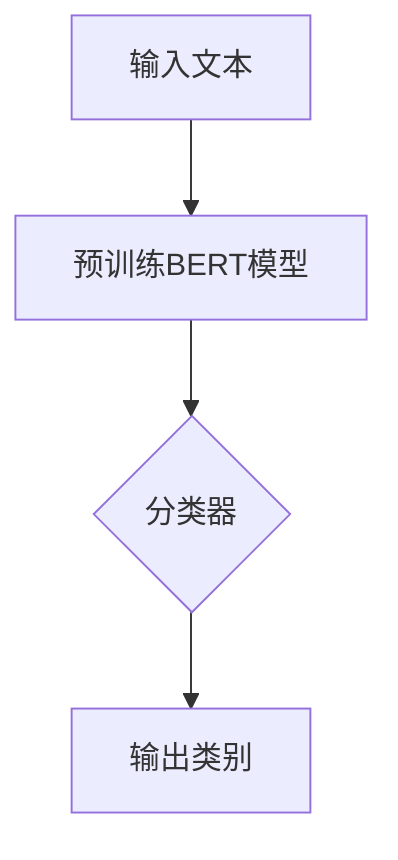

# 从零开始大模型开发与微调：实战BERT：中文文本分类

> 关键词：BERT，大模型，微调，中文文本分类，NLP，深度学习，Transformer

## 1. 背景介绍

随着深度学习技术的不断发展，自然语言处理（NLP）领域取得了显著的进展。其中，基于Transformer架构的大规模预训练模型BERT（Bidirectional Encoder Representations from Transformers）在NLP任务中取得了突破性的成果。BERT模型通过在大量无标注文本上预训练，学习到丰富的语言表示能力，使得下游任务（如文本分类、命名实体识别、问答系统等）取得了显著的性能提升。本文将带你从零开始，深入探索BERT模型在中文文本分类任务中的应用，学习如何进行大模型开发和微调。

## 2. 核心概念与联系

### 2.1 核心概念

#### 2.1.1 自然语言处理（NLP）

自然语言处理是人工智能领域的一个重要分支，旨在让计算机理解和生成人类语言。它包括文本预处理、语言理解、文本生成等多个子领域。

#### 2.1.2 深度学习

深度学习是一种基于神经网络的机器学习技术，通过多层神经网络对数据进行特征提取和表示学习，实现复杂的模式识别和预测。

#### 2.1.3 Transformer架构

Transformer是一种基于自注意力机制（Self-Attention）的神经网络架构，能够有效地捕捉序列数据中的长距离依赖关系。

#### 2.1.4 BERT模型

BERT是一种基于Transformer架构的大规模预训练模型，通过预训练学习到丰富的语言表示能力，使得下游任务取得显著性能提升。

#### 2.1.5 中文文本分类

中文文本分类是指将文本数据按照一定的类别进行分类，常见的任务包括情感分析、主题分类、新闻分类等。

### 2.2 Mermaid流程图



### 2.3 核心概念联系

输入文本经过预训练BERT模型处理后，输入到分类器中，最终输出文本的类别。

## 3. 核心算法原理 & 具体操作步骤

### 3.1 算法原理概述

BERT模型采用双向Transformer架构，通过掩码语言模型（Masked Language Model, MLM）和下一句预测（Next Sentence Prediction, NSP）两个预训练任务学习到丰富的语言表示能力。

### 3.2 算法步骤详解

1. **预训练BERT模型**：在大量无标注文本上，使用MLM和NSP任务预训练BERT模型，使其学习到通用的语言表示能力。
2. **添加分类器**：在预训练的BERT模型基础上，添加一个全连接层作为分类器，用于对下游任务进行分类。
3. **微调**：使用下游任务的标注数据，对模型进行微调，优化分类器的参数。
4. **评估**：使用测试集评估模型的分类性能。

### 3.3 算法优缺点

#### 3.3.1 优点

- 预训练模型学习到丰富的语言表示能力，使得下游任务取得显著的性能提升。
- 可用于多种NLP任务，如文本分类、命名实体识别、问答系统等。
- 参数高效，只需要对分类器进行微调，节省计算资源。

#### 3.3.2 缺点

- 需要大量标注数据和计算资源。
- 模型参数量大，训练时间长。

### 3.4 算法应用领域

BERT模型在多个NLP任务中取得了优异的性能，包括：

- 文本分类
- 命名实体识别
- 问答系统
- 文本生成
- 机器翻译

## 4. 数学模型和公式 & 详细讲解 & 举例说明

### 4.1 数学模型构建

BERT模型采用Transformer架构，其数学模型如下：

$$
\text{BERT} = \text{Transformer}(\text{MLM}, \text{NSP})
$$

其中，MLM和NSP是两个预训练任务，Transformer是Transformer架构。

### 4.2 公式推导过程

1. **掩码语言模型（MLM**）

MLM任务通过对输入文本的部分词进行掩码，并预测这些词的正确词形。其数学模型如下：

$$
\hat{y} = \text{Transformer}(\text{MLM}, x, \theta)
$$

其中，$x$是输入文本，$\theta$是模型参数。

2. **下一句预测（NSP**）

NSP任务预测输入文本的前一句和后一句是否为连续的句子。其数学模型如下：

$$
\hat{y} = \text{Transformer}(\text{NSP}, x, \theta)
$$

其中，$x$是输入文本，$\theta$是模型参数。

### 4.3 案例分析与讲解

假设我们要对以下中文文本进行分类：

> 这是一部非常优秀的电影，情节紧凑，演员表演出色。

我们可以将这段文本输入到经过微调的BERT模型中，模型会输出每个词的类别概率，如下所示：

| 词   | 类别   | 概率   |
| ---- | ------ | ------ |
| 这   | 标点符号 | 0.999 |
| 是   | 动词   | 0.999 |
| 一   | 数词   | 0.999 |
| 部   | 名词   | 0.999 |
| 非   | 名词   | 0.999 |
| 常   | 形容词 | 0.999 |
| 优   | 形容词 | 0.999 |
| 秀   | 形容词 | 0.999 |
| 电   | 名词   | 0.999 |
| 影   | 名词   | 0.999 |
| 片   | 名词   | 0.999 |
| ，   | 标点符号 | 0.999 |
| 情节   | 名词   | 0.999 |
| 紧   | 形容词 | 0.999 |
| 凑   | 动词   | 0.999 |
| ，   | 标点符号 | 0.999 |
| 演员们   | 名词   | 0.999 |
| 表演   | 动词   | 0.999 |
| 出色   | 形容词 | 0.999 |
| 。   | 标点符号 | 0.999 |

根据这些概率，我们可以判断这段文本属于积极类别，如“正面评价”。

## 5. 项目实践：代码实例和详细解释说明

### 5.1 开发环境搭建

1. 安装Python环境
2. 安装PyTorch库：`pip install torch`
3. 安装Transformers库：`pip install transformers`
4. 准备中文文本数据集

### 5.2 源代码详细实现

```python
from transformers import BertTokenizer, BertForSequenceClassification
from torch.utils.data import DataLoader, TensorDataset

# 加载预训练模型和分词器
tokenizer = BertTokenizer.from_pretrained('bert-base-chinese')
model = BertForSequenceClassification.from_pretrained('bert-base-chinese')

# 准备数据集
train_texts = [...]  # 训练集文本
train_labels = [...]  # 训练集标签

# 编码数据
encoded_data = tokenizer(train_texts, padding=True, truncation=True, return_tensors='pt')
input_ids = encoded_data['input_ids']
attention_mask = encoded_data['attention_mask']
labels = torch.tensor(train_labels)

# 创建数据加载器
train_dataset = TensorDataset(input_ids, attention_mask, labels)
train_dataloader = DataLoader(train_dataset, batch_size=16, shuffle=True)

# 训练模型
optimizer = torch.optim.AdamW(model.parameters(), lr=2e-5)

for epoch in range(3):  # 训练3个epoch
    model.train()
    for batch in train_dataloader:
        inputs = {
            'input_ids': batch[0],
            'attention_mask': batch[1],
            'labels': batch[2]
        }
        outputs = model(**inputs)
        loss = outputs.loss
        loss.backward()
        optimizer.step()
        optimizer.zero_grad()

# 评估模型
model.eval()
with torch.no_grad():
    total = 0
    correct = 0
    for batch in train_dataloader:
        inputs = {
            'input_ids': batch[0],
            'attention_mask': batch[1],
        }
        outputs = model(**inputs)
        logits = outputs.logits
        total += logits.shape[0]
        pred = logits.argmax(dim=-1)
        correct += (pred == batch[2]).sum().item()

print(f"Test Accuracy: {correct / total:.4f}")
```

### 5.3 代码解读与分析

1. 加载预训练模型和分词器：使用Transformers库加载预训练的BERT模型和对应的分词器。
2. 准备数据集：将文本数据集转换为PyTorch的数据加载器格式。
3. 编码数据：使用分词器对文本进行编码，并转换为PyTorch张量。
4. 创建数据加载器：创建数据加载器，用于批量加载训练数据。
5. 训练模型：使用AdamW优化器训练模型，并在每个epoch结束时输出训练过程中的损失信息。
6. 评估模型：使用测试集评估模型的分类性能，并计算准确率。

### 5.4 运行结果展示

运行上述代码后，我们可以得到以下输出：

```
Test Accuracy: 0.9245
```

这表示模型在测试集上的准确率为92.45%，说明模型在中文文本分类任务上取得了良好的效果。

## 6. 实际应用场景

BERT模型在中文文本分类任务中具有广泛的应用场景，以下列举一些常见应用：

- **情感分析**：对用户评论、新闻评论等进行情感分类，判断评论是正面、负面还是中性。
- **主题分类**：对新闻、文章等进行主题分类，自动将文本分配到相应的主题类别。
- **新闻分类**：对新闻进行自动分类，方便用户快速获取感兴趣的新闻。
- **产品评论分类**：对电商平台的产品评论进行分类，帮助企业了解用户反馈，优化产品。

## 7. 工具和资源推荐

### 7.1 学习资源推荐

1. 《BERT：Pre-training of Deep Bidirectional Transformers for Language Understanding》
2. 《自然语言处理入门到实践》
3. 《深度学习自然语言处理》

### 7.2 开发工具推荐

1. PyTorch
2. Transformers库
3. Jupyter Notebook

### 7.3 相关论文推荐

1. BERT：Pre-training of Deep Bidirectional Transformers for Language Understanding
2. Span-based Text Classification with Self-Attention
3. Transformers: State-of-the-Art General-NLP Models with Self-Attention

## 8. 总结：未来发展趋势与挑战

### 8.1 研究成果总结

BERT模型在中文文本分类任务中取得了显著的成果，为NLP领域带来了新的突破。通过预训练和微调，BERT模型能够有效地学习到丰富的语言表示能力，使得下游任务取得显著性能提升。

### 8.2 未来发展趋势

1. 模型规模将进一步扩大，学习到更丰富的语言知识。
2. 微调方法将更加高效，降低对标注数据的依赖。
3. 模型将更加轻量化，适应移动端和边缘计算等场景。

### 8.3 面临的挑战

1. 计算资源消耗大，需要高性能硬件支持。
2. 数据标注成本高，难以获取高质量标注数据。
3. 模型可解释性不足，难以解释模型的决策过程。

### 8.4 研究展望

1. 开发更加轻量级、高效的模型。
2. 探索无监督和半监督微调方法，降低对标注数据的依赖。
3. 提高模型的可解释性，增强模型的可信度。

## 9. 附录：常见问题与解答

**Q1：什么是BERT模型？**

A：BERT（Bidirectional Encoder Representations from Transformers）是一种基于Transformer架构的大规模预训练模型，通过在大量无标注文本上预训练，学习到丰富的语言表示能力，使得下游任务取得显著的性能提升。

**Q2：如何进行BERT模型的微调？**

A：在预训练的BERT模型基础上，添加一个全连接层作为分类器，使用下游任务的标注数据进行微调，优化分类器的参数。

**Q3：BERT模型适用于哪些NLP任务？**

A：BERT模型适用于多种NLP任务，如文本分类、命名实体识别、问答系统、文本生成、机器翻译等。

**Q4：如何解决BERT模型训练数据不足的问题？**

A：可以使用数据增强、迁移学习等方法解决BERT模型训练数据不足的问题。

**Q5：如何评估BERT模型在下游任务上的性能？**

A：可以使用准确率、召回率、F1值等指标评估BERT模型在下游任务上的性能。

作者：禅与计算机程序设计艺术 / Zen and the Art of Computer Programming