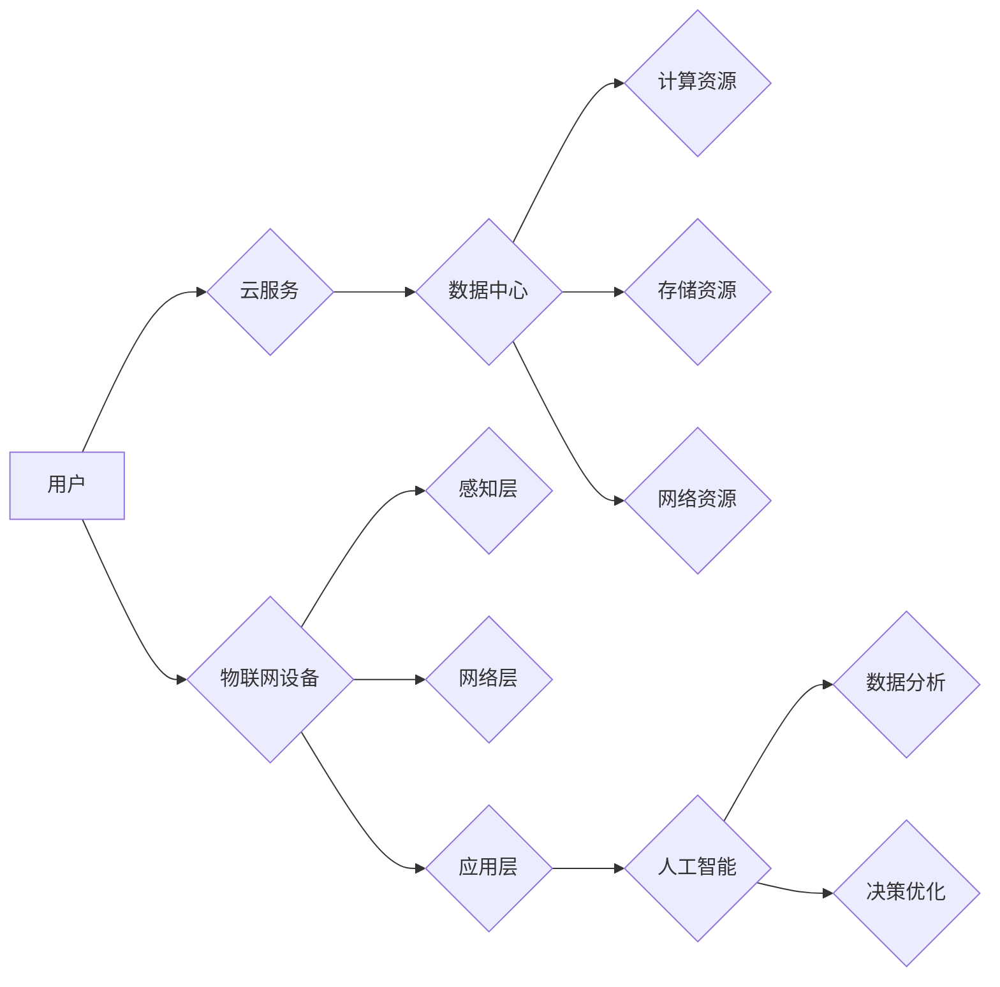

# 信息技术与互联网发展趋势

> 关键词：人工智能、云计算、物联网、5G、区块链、数字化转型

## 1. 背景介绍

随着科技的飞速发展，信息技术与互联网已经成为现代社会的基础设施，深刻地影响着人们的工作、生活和思维方式。从互联网的普及到移动互联网的兴起，再到今天的信息技术革命，我们见证了信息技术的不断演进。本文将深入探讨信息技术与互联网的发展趋势，分析其中的核心概念、算法原理、应用场景，并展望未来的发展趋势与挑战。

### 1.1 问题的由来

信息技术与互联网的快速发展，不仅改变了人们的生活，也对传统行业提出了新的挑战。如何把握信息技术的未来趋势，利用互联网技术推动产业升级，成为企业和政府关注的焦点。

### 1.2 研究现状

当前，信息技术与互联网的发展呈现出以下特点：

- 人工智能技术逐渐成熟，开始在各个领域得到应用。
- 云计算、大数据等技术快速发展，为信息技术的应用提供了强大的支撑。
- 物联网、5G等新兴技术正在改变人们的生产生活方式。
- 区块链技术开始应用于金融、供应链等领域，为信任和价值传递提供新的解决方案。

### 1.3 研究意义

深入研究信息技术与互联网的发展趋势，对于以下方面具有重要意义：

- 帮助企业和政府把握技术发展方向，制定相关政策和规划。
- 推动传统行业数字化转型，提升产业竞争力。
- 促进技术创新和人才培养，推动社会经济发展。

### 1.4 本文结构

本文将分为以下几个部分：

- 核心概念与联系
- 核心算法原理与具体操作步骤
- 数学模型和公式
- 项目实践
- 实际应用场景
- 工具和资源推荐
- 总结：未来发展趋势与挑战

## 2. 核心概念与联系

### 2.1 核心概念

#### 2.1.1 人工智能

人工智能（Artificial Intelligence, AI）是指模拟、延伸和扩展人的智能的理论、方法、技术及应用系统。它包括机器学习、深度学习、自然语言处理、计算机视觉等多个领域。

#### 2.1.2 云计算

云计算（Cloud Computing）是一种基于互联网的计算模式，通过虚拟化技术将计算资源（如服务器、存储、网络等）集中管理，为用户提供按需服务。

#### 2.1.3 物联网

物联网（Internet of Things, IoT）是指通过信息传感设备，将物品连接到互联网进行信息交换和通信，实现智能化识别、定位、跟踪、监控和管理。

#### 2.1.4 5G

5G（第五代移动通信技术）是新一代移动通信技术，具有高速率、低时延、大连接等特性，为物联网、人工智能等应用提供了更好的网络环境。

#### 2.1.5 区块链

区块链（Blockchain）是一种去中心化的分布式账本技术，具有安全性、透明性、不可篡改性等特点，为数字货币、供应链金融等应用提供了新的解决方案。

### 2.2 核心概念原理和架构的 Mermaid 流程图



## 3. 核心算法原理 & 具体操作步骤

### 3.1 算法原理概述

#### 3.1.1 人工智能

人工智能的核心算法包括：

- 机器学习：通过学习数据中的模式，使计算机能够从数据中自动学习和做出决策。
- 深度学习：一种特殊的机器学习方法，通过多层神经网络模拟人脑处理信息的过程。
- 自然语言处理：使计算机能够理解和生成自然语言。

#### 3.1.2 云计算

云计算的核心算法包括：

- 虚拟化技术：将物理资源抽象化为虚拟资源，提高资源利用率。
- 分布式计算：将计算任务分解为多个子任务，在多个节点上并行计算，提高计算效率。

#### 3.1.3 物联网

物联网的核心算法包括：

- 数据采集与处理：通过传感器采集环境数据，并进行处理和分析。
- 数据传输与通信：通过网络将数据传输到数据中心或应用层。
- 数据融合与集成：将来自不同来源的数据进行融合和集成，形成统一的数据视图。

#### 3.1.4 5G

5G的核心算法包括：

- 波形设计：设计高效的无线信号波形，提高频谱利用率。
- 多天线技术：利用多个天线发送和接收信号，提高数据传输速率。
- 网络切片：将网络资源划分为多个虚拟切片，为不同应用提供定制化的网络服务。

#### 3.1.5 区块链

区块链的核心算法包括：

- 加密算法：确保数据传输的安全性和隐私性。
- 共识算法：确保区块链的可靠性和去中心化。
- 智能合约：自动执行合同条款，实现自动化交易。

### 3.2 算法步骤详解

#### 3.2.1 人工智能

以机器学习为例，其基本步骤如下：

1. 数据收集：收集相关领域的原始数据。
2. 数据预处理：对数据进行清洗、转换等操作，使其满足模型训练的需求。
3. 模型选择：选择合适的机器学习模型。
4. 模型训练：使用训练数据对模型进行训练。
5. 模型评估：使用测试数据评估模型性能。
6. 模型优化：根据评估结果对模型进行调整，提高模型性能。

#### 3.2.2 云计算

以虚拟化技术为例，其基本步骤如下：

1. 资源虚拟化：将物理资源抽象化为虚拟资源。
2. 资源调度：根据用户需求，将虚拟资源分配给用户。
3. 资源管理：监控和管理虚拟资源的使用情况。
4. 资源回收：回收不再使用的虚拟资源。

#### 3.2.3 物联网

以数据采集与处理为例，其基本步骤如下：

1. 设备部署：部署传感器等设备，采集环境数据。
2. 数据传输：通过网络将数据传输到数据中心或应用层。
3. 数据处理：对数据进行清洗、转换、分析等操作。
4. 数据存储：将处理后的数据存储到数据库或数据湖中。

#### 3.2.4 5G

以波形设计为例，其基本步骤如下：

1. 信道编码：对信号进行编码，提高传输效率。
2. 信号调制：将信息调制到载波上。
3. 信号发射：通过天线发送信号。
4. 信号接收：接收信号并进行解码。
5. 信道解码：对信号进行解码，恢复原始信息。

#### 3.2.5 区块链

以加密算法为例，其基本步骤如下：

1. 数据加密：使用加密算法对数据进行加密，确保数据传输的安全性和隐私性。
2. 数据解密：使用解密算法对数据进行解密，恢复原始数据。

### 3.3 算法优缺点

#### 3.3.1 人工智能

优点：

- 自动化程度高，能够从数据中学习并做出决策。
- 适应性强，能够处理复杂问题。
- 可扩展性强，能够适应大规模数据处理。

缺点：

- 需要大量数据，且数据质量对模型性能有重要影响。
- 模型可解释性差，难以理解模型的决策过程。
- 模型泛化能力有限，容易过拟合。

#### 3.3.2 云计算

优点：

- 资源利用率高，能够提高资源利用率。
- 弹性好，能够根据需求动态调整资源。
- 成本低，能够降低企业IT成本。

缺点：

- 安全性风险，需要保证数据安全和隐私。
- 网络延迟，可能会影响用户体验。
- 管理复杂，需要专业的管理团队。

#### 3.3.3 物联网

优点：

- 实时性，能够实时获取环境数据。
- 可靠性，能够保证数据传输的可靠性。
- 智能化，能够实现智能化的控制和管理。

缺点：

- 数据量庞大，需要高效的数据处理和分析能力。
- 硬件设备成本高，需要定期维护和升级。
- 网络连接复杂，需要保证网络连接的稳定性和安全性。

#### 3.3.4 5G

优点：

- 传输速率高，能够满足高速率应用的需求。
- 延迟低，能够满足低时延应用的需求。
- 连接数多，能够支持大量设备同时连接。

缺点：

- 技术复杂，需要专业的技术人才。
- 建设成本高，需要大量投资。
- 网络覆盖范围有限，需要不断扩大网络覆盖。

#### 3.3.5 区块链

优点：

- 安全性高，能够保证数据传输的安全性和隐私性。
- 不可篡改性，一旦数据上链，就无法修改。
- 透明性，所有数据都公开透明。

缺点：

- 交易效率低，需要较长时间完成交易。
- 扩容能力有限，无法满足大规模应用的需求。
- 技术不成熟，需要进一步完善。

### 3.4 算法应用领域

#### 3.4.1 人工智能

- 智能识别：如人脸识别、物体识别等。
- 语音识别：如语音助手、智能客服等。
- 自然语言处理：如机器翻译、智能写作等。
- 股票交易：如量化投资、风险控制等。

#### 3.4.2 云计算

- 大数据：如数据分析、数据挖掘等。
- 人工智能：如机器学习、深度学习等。
- 物联网：如智能监控、智能家居等。
- 企业应用：如企业资源计划（ERP）、客户关系管理（CRM）等。

#### 3.4.3 物联网

- 智能家居：如智能门锁、智能照明等。
- 智能交通：如智能停车、智能驾驶等。
- 智能医疗：如远程医疗、智能诊断等。
- 智能农业：如智能灌溉、智能养殖等。

#### 3.4.4 5G

- 物联网：如智能工厂、智能电网等。
- 高速互联网：如视频直播、在线游戏等。
- 虚拟现实：如VR游戏、VR会议等。
- 远程医疗：如远程诊断、远程手术等。

## 4. 数学模型和公式 & 详细讲解 & 举例说明

### 4.1 数学模型构建

以人工智能中的机器学习为例，其数学模型可以表示为：

$$
y = f(x;\theta) 
$$

其中，$x$ 为输入特征，$\theta$ 为模型参数，$f$ 为函数，$y$ 为输出。

### 4.2 公式推导过程

以神经网络中的激活函数为例，常用的激活函数有Sigmoid、ReLU等。以Sigmoid函数为例，其公式为：

$$
\sigma(x) = \frac{1}{1+e^{-x}} 
$$

其导数为：

$$
\sigma'(x) = \sigma(x)(1 - \sigma(x)) 
$$

### 4.3 案例分析与讲解

以云计算中的数据存储为例，常用的数据存储模型有分布式文件系统、数据库等。以分布式文件系统为例，其核心思想是将文件存储在多个节点上，并通过网络进行访问。

### 4.4 常见问题解答

**Q1：人工智能与机器学习有什么区别？**

A：人工智能是一个广泛的领域，包括机器学习、深度学习、自然语言处理、计算机视觉等多个子领域。机器学习是人工智能的一个分支，主要研究如何使计算机从数据中学习并做出决策。

**Q2：云计算与分布式计算有什么区别？**

A：云计算是一种基于互联网的计算模式，通过虚拟化技术将计算资源集中管理。分布式计算是一种并行计算模式，将计算任务分解为多个子任务，在多个节点上并行计算。

**Q3：5G与4G有什么区别？**

A：5G与4G相比，具有更高的传输速率、更低的时延、更大的连接数等特点。

**Q4：区块链与中心化存储有什么区别？**

A：区块链是一种去中心化的分布式账本技术，而中心化存储将数据存储在中心化的服务器上。

## 5. 项目实践：代码实例和详细解释说明

### 5.1 开发环境搭建

以Python为例，搭建开发环境的基本步骤如下：

1. 安装Python：从官网下载并安装Python。
2. 安装PyPI：Python的包管理器，用于安装和管理Python包。
3. 安装相关库：根据需要安装相关库，如NumPy、Pandas、Scikit-learn等。

### 5.2 源代码详细实现

以下是一个简单的机器学习项目实例，使用Python实现线性回归：

```python
import numpy as np
import matplotlib.pyplot as plt
from sklearn.linear_model import LinearRegression

# 创建数据
x = np.linspace(0, 10, 100)
y = 3 * x + 2 + np.random.normal(0, 1, 100)

# 创建模型
model = LinearRegression()

# 训练模型
model.fit(x.reshape(-1, 1), y)

# 预测
x_predict = np.linspace(0, 10, 10)
y_predict = model.predict(x_predict.reshape(-1, 1))

# 可视化
plt.scatter(x, y)
plt.plot(x_predict, y_predict, color='red')
plt.show()
```

### 5.3 代码解读与分析

以上代码首先创建了一个简单的线性回归模型，然后使用随机生成的数据对其进行训练。最后，使用训练好的模型对新的数据进行预测，并绘制出预测结果。

### 5.4 运行结果展示

运行上述代码后，会得到如下可视化结果：


可以看出，线性回归模型能够较好地拟合训练数据。

## 6. 实际应用场景

### 6.1 人工智能

#### 6.1.1 智能识别

- 人脸识别：在安全监控、门禁系统等领域应用广泛。
- 物体识别：在自动驾驶、工业检测等领域应用广泛。

#### 6.1.2 语音识别

- 语音助手：如Siri、小爱同学等。
- 智能客服：如客服机器人、智能客服系统等。

#### 6.1.3 自然语言处理

- 机器翻译：如Google翻译、百度翻译等。
- 智能写作：如文案生成、新闻报道等。

#### 6.1.4 股票交易

- 量化投资：利用机器学习算法进行股票交易。
- 风险控制：利用机器学习算法进行风险控制。

### 6.2 云计算

#### 6.2.1 大数据

- 数据分析：利用云计算平台进行大数据分析。
- 数据挖掘：利用云计算平台进行数据挖掘。

#### 6.2.2 人工智能

- 机器学习：利用云计算平台进行机器学习模型的训练和推理。
- 深度学习：利用云计算平台进行深度学习模型的训练和推理。

#### 6.2.3 物联网

- 智能家居：利用云计算平台进行智能家居的设备管理和控制。
- 智能交通：利用云计算平台进行智能交通的管理和优化。

#### 6.2.4 企业应用

- 企业资源计划（ERP）：利用云计算平台进行企业资源的统一管理。
- 客户关系管理（CRM）：利用云计算平台进行客户关系的统一管理。

### 6.3 物联网

#### 6.3.1 智能家居

- 智能照明：利用物联网技术实现智能照明。
- 智能空调：利用物联网技术实现智能空调。

#### 6.3.2 智能交通

- 智能停车：利用物联网技术实现智能停车。
- 智能驾驶：利用物联网技术实现智能驾驶。

#### 6.3.3 智能医疗

- 远程医疗：利用物联网技术实现远程医疗。
- 智能诊断：利用物联网技术实现智能诊断。

#### 6.3.4 智能农业

- 智能灌溉：利用物联网技术实现智能灌溉。
- 智能养殖：利用物联网技术实现智能养殖。

### 6.4 5G

#### 6.4.1 物联网

- 智能工厂：利用5G技术实现智能工厂。
- 智能电网：利用5G技术实现智能电网。

#### 6.4.2 高速互联网

- 视频直播：利用5G技术实现高清视频直播。
- 在线游戏：利用5G技术实现低延迟在线游戏。

#### 6.4.3 虚拟现实

- VR游戏：利用5G技术实现VR游戏。
- VR会议：利用5G技术实现VR会议。

#### 6.4.4 远程医疗

- 远程诊断：利用5G技术实现远程诊断。
- 远程手术：利用5G技术实现远程手术。

### 6.5 区块链

#### 6.5.1 数字货币

- 比特币：基于区块链技术的数字货币。
- 以太坊：基于区块链技术的智能合约平台。

#### 6.5.2 供应链金融

- 供应链融资：基于区块链技术的供应链融资。
- 供应链溯源：基于区块链技术的供应链溯源。

## 7. 工具和资源推荐

### 7.1 学习资源推荐

- 《Python编程：从入门到实践》
- 《深度学习：入门、进阶与实战》
- 《大数据时代：影响未来的数据科学》
- 《物联网技术与应用》
- 《5G通信技术：原理、应用与挑战》

### 7.2 开发工具推荐

- Python：一种广泛应用的编程语言，适用于人工智能、云计算、物联网等领域。
- PyTorch：一个开源的机器学习库，适用于深度学习模型的开发。
- TensorFlow：一个开源的机器学习框架，适用于大规模机器学习模型的开发。
- OpenStack：一个开源的云计算平台，适用于构建私有云和混合云。
- Arduino：一个开源的硬件平台，适用于物联网设备开发。

### 7.3 相关论文推荐

- “Deep Learning for Natural Language Processing”
- “The Transformation of IT Infrastructure and Services by Cloud Computing”
- “The Internet of Things: A Survey”
- “5G: A New Era of Mobile Internet”
- “Blockchain: Beyond Bitcoin”

## 8. 总结：未来发展趋势与挑战

### 8.1 研究成果总结

信息技术与互联网的快速发展，推动了人工智能、云计算、物联网、5G、区块链等技术的涌现和应用。这些技术相互融合，为各行各业带来了巨大的变革。

### 8.2 未来发展趋势

#### 8.2.1 人工智能

- 深度学习将继续发展，并在更多领域得到应用。
- 人工智能与区块链、物联网等技术将更加紧密地融合。
- 人工智能将在医疗、教育、交通等领域发挥更大的作用。

#### 8.2.2 云计算

- 云计算将持续发展，成为企业IT基础设施的核心。
- 云原生技术将得到广泛应用。
- 云计算与人工智能、物联网等技术将更加紧密地融合。

#### 8.2.3 物联网

- 物联网将实现更大规模的应用。
- 物联网与人工智能、云计算等技术将更加紧密地融合。
- 物联网将推动产业智能化升级。

#### 8.2.4 5G

- 5G将实现更大规模的应用。
- 5G与人工智能、物联网等技术将更加紧密地融合。
- 5G将推动数字经济的发展。

#### 8.2.5 区块链

- 区块链将在金融、供应链等领域得到更广泛的应用。
- 区块链与人工智能、物联网等技术将更加紧密地融合。
- 区块链将推动信任和价值传递的变革。

### 8.3 面临的挑战

#### 8.3.1 人工智能

- 数据隐私和安全问题。
- 道德伦理问题。
- 人工智能与人类就业问题。

#### 8.3.2 云计算

- 数据安全和隐私问题。
- 网络安全问题。
- 云计算资源分配问题。

#### 8.3.3 物联网

- 数据安全和隐私问题。
- 网络安全问题。
- 物联网设备能耗问题。

#### 8.3.4 5G

- 网络安全问题。
- 建设成本问题。
- 5G应用推广问题。

#### 8.3.5 区块链

- 系统性能问题。
- 智能合约安全问题。
- 区块链生态建设问题。

### 8.4 研究展望

面对信息技术与互联网发展的挑战，我们需要：

- 加强技术研发，提高技术水平。
- 重视人才培养，培养复合型人才。
- 制定相关政策和标准，引导行业健康发展。
- 加强国际合作，推动全球信息技术与互联网的发展。

相信在各方共同努力下，信息技术与互联网将继续快速发展，为人类社会带来更多的机遇和挑战。

---

作者：禅与计算机程序设计艺术 / Zen and the Art of Computer Programming