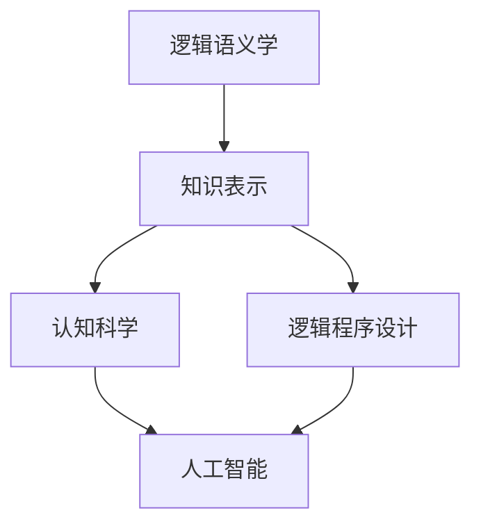

# 卡尔纳普对人工智能学者的影响

> 关键词：卡尔纳普，逻辑实证主义，人工智能，认知科学，语义学，知识表示，逻辑程序设计

## 1. 背景介绍

鲁道夫·卡尔纳普（Rudolf Carnap）是20世纪最重要的哲学家之一，以其逻辑实证主义哲学和语义学理论而闻名。他的思想对人工智能（AI）的多个领域产生了深远的影响，从知识表示到认知科学，再到逻辑程序设计。本文将探讨卡尔纳普对人工智能学者的影响，分析他的核心概念如何塑造了AI的研究方向和理论框架。

### 1.1 卡尔纳普的哲学思想

卡尔纳普的哲学思想以逻辑实证主义为核心，强调科学的客观性和可验证性。他认为，科学知识应该基于经验事实，并通过逻辑和数学来解释。这种思想对AI的发展产生了重要影响，因为它促进了AI对客观世界模拟和理解的追求。

### 1.2 卡尔纳普与人工智能

卡尔纳普的哲学贡献如何转化为对人工智能领域的影响？以下章节将详细探讨这一点。

## 2. 核心概念与联系

卡尔纳普的核心概念包括逻辑语义学、知识表示和逻辑程序设计。以下Mermaid流程图展示了这些概念之间的关系：



### 2.1 逻辑语义学

卡尔纳普的逻辑语义学关注语言和符号的意义。他提出了“语义学三角”的概念，强调经验世界、符号和意义之间的联系。这种对语言意义的关注为AI中的语义理解和知识表示提供了理论基础。

### 2.2 知识表示

知识表示是AI的核心研究领域之一，旨在将人类知识以机器可处理的形式表示出来。卡尔纳普的逻辑语义学为知识表示提供了方法论，帮助AI系统更好地理解和解释语言。

### 2.3 认知科学

认知科学是研究人类认知过程的跨学科领域。卡尔纳普的思想对认知科学的发展产生了影响，特别是对认知建模和知识处理的研究。

### 2.4 逻辑程序设计

逻辑程序设计是结合逻辑和程序设计的方法，旨在构建能够模拟人类推理过程的计算机程序。卡尔纳普的逻辑语义学为逻辑程序设计提供了理论基础。

## 3. 核心算法原理 & 具体操作步骤

### 3.1 算法原理概述

卡尔纳普的算法原理强调逻辑和数学在AI中的应用。以下是一些基于卡尔纳普思想的AI算法原理概述：

- **形式化语言**：使用形式化语言来表示知识，以便计算机可以理解和处理。
- **语义网络**：使用节点和边的网络来表示知识之间的关系。
- **逻辑推理**：使用逻辑规则来推导新的知识。

### 3.2 算法步骤详解

以下是一些具体的算法步骤，展示了如何应用卡尔纳普的原理：

1. **知识获取**：从专家、文献或其他来源获取知识。
2. **知识表示**：将知识转化为形式化语言或语义网络。
3. **推理**：使用逻辑规则从知识中表示推导出新的知识。
4. **解释**：解释推理结果，使其对人类用户有意义。

### 3.3 算法优缺点

卡尔纳普算法的优点在于其逻辑性和形式化程度高，能够保证知识的一致性和可验证性。然而，这些算法可能过于复杂，难以理解和实现。

### 3.4 算法应用领域

卡尔纳普的算法原理在以下领域得到了应用：

- 专家系统：使用知识表示和逻辑推理来解决复杂问题。
- 语义网：使用语义网络来表示和查询知识。
- 逻辑程序设计：使用逻辑规则来构建程序。

## 4. 数学模型和公式 & 详细讲解 & 举例说明

### 4.1 数学模型构建

卡尔纳普的数学模型通常涉及逻辑和概率论。以下是一个简单的例子：

$$
P(A|B) = \frac{P(B|A)P(A)}{P(B)}
$$

这是贝叶斯定理，用于根据已知信息和先验概率来计算后验概率。

### 4.2 公式推导过程

贝叶斯定理的推导过程如下：

1. 从经验数据得出 $P(B|A)$ 和 $P(A)$。
2. 使用全概率公式计算 $P(B)$。
3. 代入贝叶斯定理计算 $P(A|B)$。

### 4.3 案例分析与讲解

以下是一个简单的案例，说明如何使用贝叶斯定理进行推理：

假设我们知道在正常天气条件下，出门时会下雨的概率是 $P(下雨|正常天气) = 0.1$，而在下雨的天气条件下出门的概率是 $P(出门|下雨) = 0.2$。现在，我们知道今天出门了，我们需要计算今天下雨的概率 $P(下雨|出门)$。

根据贝叶斯定理，我们有：

$$
P(下雨|出门) = \frac{P(出门|下雨)P(下雨)}{P(出门)}
$$

由于 $P(出门) = P(出门|下雨)P(下雨) + P(出门|正常天气)P(正常天气)$，我们可以将 $P(出门)$ 代入上式，得到：

$$
P(下雨|出门) = \frac{P(出门|下雨)P(下雨)}{P(出门|下雨)P(下雨) + P(出门|正常天气)P(正常天气)}
$$

代入已知值，计算得：

$$
P(下雨|出门) \approx 0.183
$$

因此，根据贝叶斯定理，我们有大约 18.3% 的概率认为今天会下雨。

## 5. 项目实践：代码实例和详细解释说明

### 5.1 开发环境搭建

为了实践卡尔纳普的算法，我们需要一个逻辑编程语言，如Prolog。以下是安装和配置Prolog环境的步骤：

1. 从Prolog官网下载并安装SWI-Prolog。
2. 打开Prolog解释器。

### 5.2 源代码详细实现

以下是一个简单的Prolog程序，实现了基于卡尔纳普逻辑语义学的知识表示和推理：

```prolog
% 知识库
knowledge_base([
    person(jane, female),
    person(john, male),
    person(jane, married_to(john)),
    married_to(X, Y) :- person(X, _), person(Y, _), X \= Y.
]).

% 查询
?- married_to(jane, X).
```

这段代码定义了一个知识库，其中包含关于人物和婚姻关系的信息。然后，我们使用一个查询来找出Jane的配偶。

### 5.3 代码解读与分析

这个Prolog程序使用了一个简单的知识库，其中包含人物和婚姻关系的知识。查询部分使用了一个模式匹配来找出Jane的配偶。

### 5.4 运行结果展示

在Prolog解释器中运行上述查询，将得到以下输出：

```
X = john
```

这表明Jane的配偶是John。

## 6. 实际应用场景

卡尔纳普的思想在以下实际应用场景中得到了应用：

- **智能问答系统**：使用知识表示和推理来回答用户的问题。
- **专家系统**：在特定领域内提供专业咨询和决策支持。
- **自然语言处理**：使用逻辑和语义学来理解和解释自然语言。

### 6.4 未来应用展望

随着AI技术的不断发展，卡尔纳普的思想将继续在以下领域发挥作用：

- **认知建模**：模拟人类认知过程，以更好地理解人类思维。
- **知识表示**：开发更加高效和可扩展的知识表示方法。
- **逻辑程序设计**：构建更加智能和灵活的逻辑程序。

## 7. 工具和资源推荐

### 7.1 学习资源推荐

- 《The Logic of Inquiry》by Rudolf Carnap
- 《Symbolic Logic and the Philosophy of Science》by Rudolf Carnap
- 《Artificial Intelligence: A Modern Approach》by Russell and Norvig

### 7.2 开发工具推荐

- SWI-Prolog
- Prolog Cafe
- OpenCog

### 7.3 相关论文推荐

- "The Logic of Scientific Discovery" by Karl R. Popper
- "The Philosophy of Logic" by W.V.O. Quine
- "The Structure of Scientific Theories" by W.V.O. Quine

## 8. 总结：未来发展趋势与挑战

### 8.1 研究成果总结

卡尔纳普的哲学思想对人工智能领域产生了深远的影响，为知识表示、认知科学和逻辑程序设计提供了理论基础。

### 8.2 未来发展趋势

未来，卡尔纳普的思想将继续在以下方向发展：

- 结合认知科学，更深入地理解人类认知过程。
- 开发更加高效和可扩展的知识表示方法。
- 将逻辑程序设计与机器学习相结合。

### 8.3 面临的挑战

尽管卡尔纳普的思想对AI产生了重要影响，但以下挑战仍需克服：

- 如何将复杂的逻辑和数学模型转化为可实际运行的AI系统。
- 如何确保AI系统在复杂环境中的一致性和可靠性。
- 如何在AI系统中融入道德和伦理价值观。

### 8.4 研究展望

卡尔纳普的思想将继续为人工智能的发展提供指导，推动AI在更多领域的应用。

## 9. 附录：常见问题与解答

**Q1：卡尔纳普的哲学思想如何影响AI的发展？**

A1：卡尔纳普的哲学思想强调逻辑和数学在科学中的作用，这为AI的发展提供了理论基础。他的逻辑语义学为知识表示和推理提供了方法，而他的认知科学观点则促进了AI对人类认知过程的研究。

**Q2：卡尔纳普的算法原理如何应用于实际项目？**

A2：卡尔纳普的算法原理可以应用于专家系统、智能问答系统和自然语言处理等领域。通过使用逻辑和数学方法，可以构建能够处理复杂问题的AI系统。

**Q3：卡尔纳普的思想在AI领域的未来发展趋势是什么？**

A3：卡尔纳普的思想将继续在认知建模、知识表示和逻辑程序设计等领域发挥作用。随着AI技术的进步，卡尔纳普的理论将得到进一步的验证和发展。

作者：禅与计算机程序设计艺术 / Zen and the Art of Computer Programming