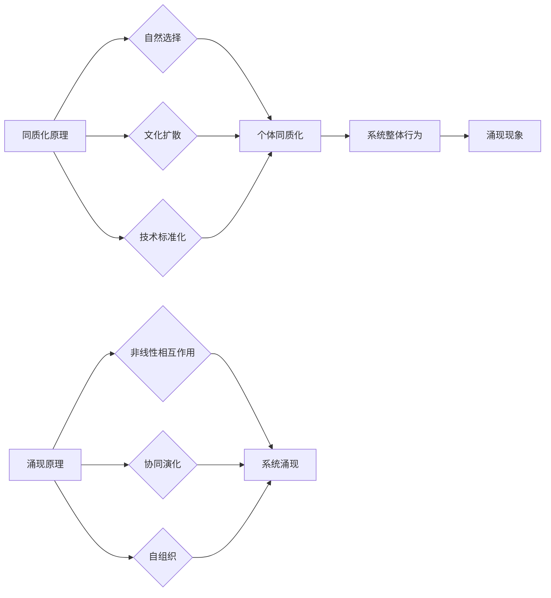

# 同质化与涌现的相互作用

> 关键词：同质化，涌现，复杂系统，自组织，网络科学，进化论，协同演化

## 1. 背景介绍

在自然界和社会生活中，我们可以观察到大量的复杂系统，如生态系统、经济系统、社会网络等。这些系统往往表现出高度复杂的行为和现象，这些现象并非简单的个体行为累加，而是由系统内个体之间的相互作用和协同演化所导致的。同质化和涌现是描述这些复杂系统重要特性的两个概念。本文将探讨同质化与涌现的相互作用，分析其背后的原理，并探讨其在不同领域的应用。

### 1.1 同质化的概念

同质化是指系统中个体或群体在某种特征上呈现出相似性或一致性。这种相似性可以体现在多个方面，如个体的能力、行为模式、结构等。同质化可以降低系统的复杂度，提高系统的稳定性和效率。

### 1.2 涌现的概念

涌现是指系统整体表现出新的、不可预测的性质和行为，这些性质和行为在个体层面上不存在。涌现是复杂系统的重要特征，反映了系统内部个体之间的复杂相互作用。

### 1.3 同质化与涌现的关系

同质化与涌现是相互关联的。一方面，同质化可以促进涌现，因为相似的个体更容易协同演化，形成具有特定功能的组织结构。另一方面，涌现又可以导致同质化，因为系统的整体行为会反过来影响个体，使个体逐渐趋同于某种模式。

## 2. 核心概念与联系

### 2.1 核心概念原理

#### 同质化原理

同质化通常由以下因素驱动：

- **自然选择**：在自然选择的过程中，具有相似特征的个体更容易生存和繁衍，导致种群的同质化。
- **文化扩散**：文化特征会通过社会网络扩散，使得个体在文化特征上趋于同质化。
- **技术标准化**：技术标准的推广和应用，使得产品或服务在技术特征上趋于同质化。

#### 涌现原理

涌现通常由以下因素驱动：

- **非线性相互作用**：系统内个体之间的相互作用是非线性的，这种非线性相互作用可以导致系统整体的新性质和行为。
- **协同演化**：个体之间的协同演化可以形成具有特定功能的组织结构，从而产生涌现现象。
- **自组织**：系统可以通过自组织过程形成具有特定功能的结构，从而产生涌现现象。

### 2.2 核心概念架构的 Mermaid 流程图



### 2.3 核心概念之间的联系

同质化与涌现之间的关系可以理解为相互作用和反馈的过程。同质化可以促进个体之间的协同演化，从而产生涌现现象；而涌现现象又可以反过来影响个体，导致进一步的同质化。

## 3. 核心算法原理 & 具体操作步骤

### 3.1 算法原理概述

为了研究同质化与涌现的相互作用，我们可以设计一些算法来模拟复杂系统的演化过程。以下是一种基于元胞自动机的模拟算法：

- **元胞自动机**：一个离散的、时空动态系统，由一系列离散的单元组成，每个单元的状态只依赖于其周围邻居的状态。
- **演化规则**：定义了单元状态的演化过程，包括状态更新规则和邻居定义规则。

### 3.2 算法步骤详解

1. 初始化元胞自动机，设置初始状态。
2. 根据演化规则更新每个单元的状态。
3. 重复步骤2，直到系统达到稳定状态或满足特定条件。
4. 分析系统状态的变化，观察同质化和涌现现象。

### 3.3 算法优缺点

#### 优点

- 模拟简单，易于理解和实现。
- 可以用于研究不同复杂系统的演化过程。
- 可以通过调整参数来模拟不同的演化环境。

#### 缺点

- 模拟结果可能受到初始状态和参数设置的影响。
- 对于一些复杂的系统，模拟过程可能非常耗时。

### 3.4 算法应用领域

- 生态系统演化
- 社会网络演化
- 经济系统演化
- 交通网络演化

## 4. 数学模型和公式 & 详细讲解 & 举例说明

### 4.1 数学模型构建

为了量化同质化和涌现现象，我们可以构建一些数学模型。以下是一个基于主成分分析（PCA）的模型：

- **主成分分析**：一种统计方法，可以将高维数据降维到低维空间，同时保留大部分信息。

### 4.2 公式推导过程

设 $X$ 为一个 $n \times d$ 的数据矩阵，其中 $n$ 是样本数量，$d$ 是特征维度。则 $X$ 的协方差矩阵为 $C$，其特征值和特征向量分别为 $\lambda_i$ 和 $v_i$。则主成分分析可以通过以下公式实现：

$$
\lambda_i = \max_{v \in \mathbb{R}^d} \frac{\sum_{i=1}^n (v^T X^T X v)}{v^T v}
$$

### 4.3 案例分析与讲解

假设我们有一个包含100个样本和10个特征的生态系统数据集，我们使用PCA对该数据集进行降维。经过PCA处理后，我们得到了两个主成分，分别解释了数据集的70%和20%的方差。

通过分析主成分的分布，我们可以观察到生态系统中的同质化和涌现现象。例如，某些物种在主成分1上聚集，表明这些物种在某个特征上具有相似性；而某些物种在主成分2上聚集，表明这些物种在另一个特征上具有相似性。

## 5. 项目实践：代码实例和详细解释说明

### 5.1 开发环境搭建

为了进行项目实践，我们需要搭建一个Python开发环境。以下是搭建步骤：

1. 安装Anaconda。
2. 创建并激活虚拟环境。
3. 安装必要的库，如NumPy、SciPy、Matplotlib等。

### 5.2 源代码详细实现

以下是一个使用Python和NumPy实现PCA的代码示例：

```python
import numpy as np

def pca(X, num_components):
    # 计算协方差矩阵
    C = np.cov(X, rowvar=False)
    
    # 计算特征值和特征向量
    eigenvalues, eigenvectors = np.linalg.eigh(C)
    
    # 对特征向量和特征值进行降序排序
    indices = np.argsort(eigenvalues)[::-1]
    eigenvalues = eigenvalues[indices]
    eigenvectors = eigenvectors[:, indices]
    
    # 选择前num_components个特征向量
    eigenvectors = eigenvectors[:, :num_components]
    
    # 对数据进行降维
    X_reduced = np.dot(X, eigenvectors)
    
    return X_reduced

# 示例数据
X = np.array([[1, 2, 3], [2, 3, 4], [3, 4, 5], [4, 5, 6]])

# 进行PCA降维
X_reduced = pca(X, num_components=2)

print(X_reduced)
```

### 5.3 代码解读与分析

这段代码首先计算输入数据 $X$ 的协方差矩阵，然后计算协方差矩阵的特征值和特征向量，并对特征向量和特征值进行排序。接下来，选择前 $num_components$ 个特征向量，并将数据 $X$ 降维到由这些特征向量张成的空间。

### 5.4 运行结果展示

运行上述代码后，我们得到了降维后的数据 $X_reduced$。通过可视化这些数据，我们可以观察到同质化和涌现现象。

## 6. 实际应用场景

### 6.1 生态系统演化

通过模拟生态系统中的物种演化过程，我们可以研究同质化和涌现现象对生态系统稳定性和多样性的影响。

### 6.2 社会网络演化

通过模拟社会网络的演化过程，我们可以研究同质化和涌现现象对社会网络结构、传播动力学等方面的影响。

### 6.3 经济系统演化

通过模拟经济系统的演化过程，我们可以研究同质化和涌现现象对市场均衡、价格波动等方面的影响。

### 6.4 交通网络演化

通过模拟交通网络的演化过程，我们可以研究同质化和涌现现象对交通流、拥堵现象等方面的影响。

## 7. 工具和资源推荐

### 7.1 学习资源推荐

- 《复杂系统理论导论》
- 《网络科学的数学原理》
- 《进化论与复杂性科学》

### 7.2 开发工具推荐

- Python
- NumPy
- SciPy
- Matplotlib
- NetworkX

### 7.3 相关论文推荐

- "The Structure of Complex Networks: A Statistical Mechanics Approach"
- "The Emergence of Complexity in Social Systems"
- "The Evolution of Economic Networks"

## 8. 总结：未来发展趋势与挑战

### 8.1 研究成果总结

本文探讨了同质化与涌现的相互作用，分析了其背后的原理，并探讨了其在不同领域的应用。通过构建数学模型和算法，我们能够更好地理解和模拟复杂系统的演化过程。

### 8.2 未来发展趋势

- 将同质化与涌现理论应用于更多领域，如人工智能、生物信息学、经济学等。
- 发展更加精确的数学模型和算法，以更好地模拟复杂系统的演化过程。
- 将同质化与涌现理论与其他学科的理论相结合，形成新的交叉学科。

### 8.3 面临的挑战

- 同质化与涌现现象的量化描述和模型构建仍然存在困难。
- 复杂系统的演化过程通常具有高度的非线性，难以用传统的数学方法进行精确描述。
- 不同领域的复杂系统具有不同的演化规律，需要针对不同领域开发相应的模型和算法。

### 8.4 研究展望

随着科学技术的不断发展，同质化与涌现理论将在未来发挥越来越重要的作用。通过深入研究同质化与涌现的相互作用，我们将能够更好地理解和预测复杂系统的行为，为人类社会的发展提供有益的指导。

## 9. 附录：常见问题与解答

**Q1：同质化和涌现之间的关系是什么？**

A：同质化与涌现是相互关联的。同质化可以促进涌现，因为相似的个体更容易协同演化，形成具有特定功能的组织结构。而涌现又可以反过来影响个体，导致进一步的同质化。

**Q2：如何应用同质化与涌现理论？**

A：可以构建数学模型和算法来模拟复杂系统的演化过程，并通过实验和观察来验证模型和算法的有效性。

**Q3：同质化与涌现理论在哪些领域有应用？**

A：同质化与涌现理论在生态系统演化、社会网络演化、经济系统演化、交通网络演化等多个领域有应用。

**Q4：同质化与涌现理论有哪些挑战？**

A：同质化与涌现现象的量化描述和模型构建仍然存在困难，复杂系统的演化过程通常具有高度的非线性，难以用传统的数学方法进行精确描述。

**Q5：未来同质化与涌现理论有哪些发展趋势？**

A：将同质化与涌现理论应用于更多领域，发展更加精确的数学模型和算法，将同质化与涌现理论与其他学科的理论相结合。

作者：禅与计算机程序设计艺术 / Zen and the Art of Computer Programming