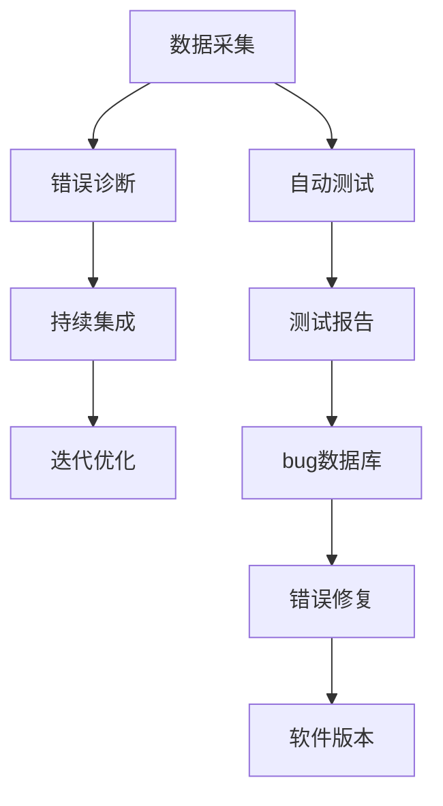
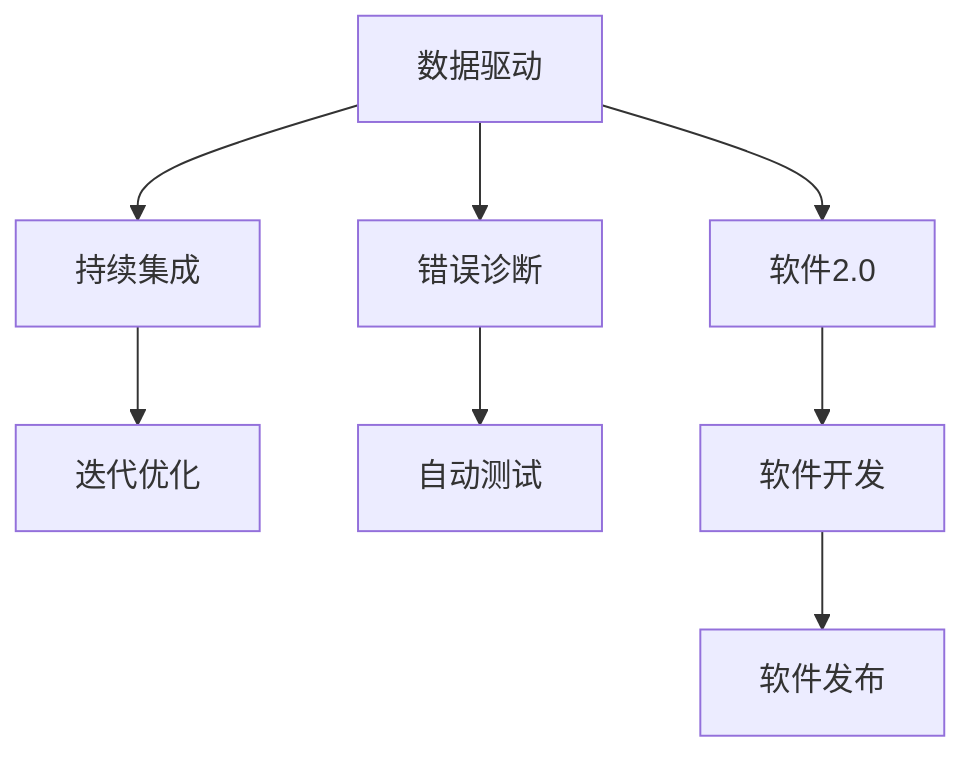
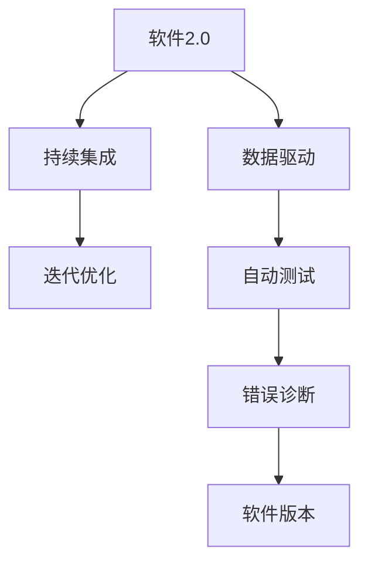
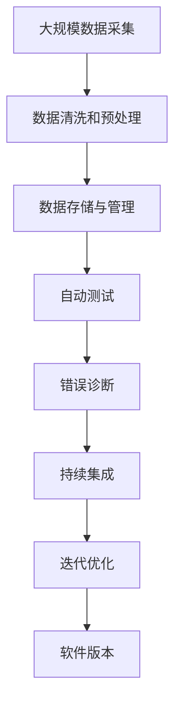

                 

# 向数据要答案，软件2.0的新型debug术

> 关键词：数据驱动, 软件2.0, 数据采集, 自动测试, 错误诊断, 持续集成

## 1. 背景介绍

### 1.1 问题由来
在软件开发过程中，调试是每个程序员都无法绕过的一个环节。当程序出现bug时，如何快速定位并解决问题，是开发效率和产品质量的关键。传统手工调试方法需要程序员手动运行程序、观察输出、设置断点，效率低下且容易出错。而自动化测试则能在一定程度上减轻人工调试的负担，但仍然依赖于人工编写测试用例，无法适应复杂的业务逻辑。

### 1.2 问题核心关键点
近年来，随着数据驱动的兴起和人工智能技术的发展，新的调试方法应运而生。这些方法通过大规模数据采集和分析，结合先进的算法模型，实现自动化、智能化的错误诊断与修复。软件2.0时代，数据驱动成为软件开发的新趋势，标志着软件开发的范式从“代码驱动”向“数据驱动”的转变。

## 2. 核心概念与联系

### 2.1 核心概念概述

为了更好地理解数据驱动的软件2.0调试方法，本节将介绍几个密切相关的核心概念：

- 数据驱动（Data-Driven）：以数据为驱动力的软件开发方式，通过大量数据收集和分析，指导软件构建和优化。
- 软件2.0（Software 2.0）：基于数据驱动、人工智能等新技术的软件开发范式，强调在软件构建和优化过程中对数据的依赖和利用。
- 数据采集（Data Collection）：从系统中自动收集程序运行数据，为数据驱动提供数据支持。
- 自动测试（Automated Testing）：使用自动化工具对程序进行测试，发现并记录潜在的bug。
- 错误诊断（Error Diagnosis）：利用算法模型对采集到的数据进行分析，识别和定位bug的根本原因。
- 持续集成（Continuous Integration）：在软件开发过程中不断集成新的代码变更，进行自动化测试和错误诊断，提升软件质量和开发效率。
- 迭代优化（Iterative Optimization）：通过持续集成和错误诊断，不断优化软件系统，提升性能和可靠性。

这些核心概念之间的逻辑关系可以通过以下Mermaid流程图来展示：



这个流程图展示了大规模数据驱动的软件2.0开发流程：数据采集提供数据支持，自动测试发现潜在bug，错误诊断定位问题原因，持续集成和迭代优化不断提升系统质量。

### 2.2 概念间的关系

这些核心概念之间存在着紧密的联系，形成了数据驱动的软件2.0开发框架。下面我通过几个Mermaid流程图来展示这些概念之间的关系。

#### 2.2.1 数据驱动的软件2.0开发流程


这个流程图展示了数据驱动的软件2.0开发流程：大规模数据采集并提供数据支持，数据清洗和预处理后用于自动测试，自动测试发现问题并交由错误诊断解决，持续集成和迭代优化不断提升系统质量，最终发布新版本软件。

#### 2.2.2 数据驱动与软件2.0的关系



这个流程图展示了数据驱动和软件2.0之间的关系：数据驱动是软件2.0的核心，为软件开发提供了数据支持；持续集成、迭代优化、错误诊断和自动测试是软件2.0的具体实现方式；软件发布是最终目标。

#### 2.2.3 数据驱动与软件2.0的层次关系



这个流程图展示了数据驱动和软件2.0的层次关系：数据驱动是软件2.0的底层支持，为软件开发的各环节提供数据；持续集成、迭代优化、自动测试和错误诊断是软件2.0的不同层面，共同构成数据驱动的实现框架。

### 2.3 核心概念的整体架构

最后，我们用一个综合的流程图来展示这些核心概念在大规模数据驱动的软件2.0开发流程中的整体架构：



这个综合流程图展示了从数据采集到软件开发、持续集成、错误诊断、迭代优化的完整流程，展示了数据驱动的软件2.0开发框架。

## 3. 核心算法原理 & 具体操作步骤
### 3.1 算法原理概述

数据驱动的软件2.0调试方法，主要基于数据驱动和人工智能技术，通过大规模数据采集和分析，结合先进的算法模型，实现自动化、智能化的错误诊断与修复。其核心思想是：

1. **数据采集与预处理**：从系统中自动收集程序运行数据，并进行清洗和预处理，形成可用于分析的数据集。
2. **自动测试**：使用自动化测试工具，对程序进行全面测试，记录潜在的bug和运行异常。
3. **错误诊断**：利用算法模型，对采集到的数据进行分析，识别和定位bug的根本原因。
4. **持续集成与迭代优化**：将错误诊断结果与持续集成系统集成，进行错误修复和版本迭代，不断优化软件系统。

### 3.2 算法步骤详解

基于数据驱动的软件2.0调试方法一般包括以下几个关键步骤：

**Step 1: 数据采集与预处理**
- 使用日志记录工具自动采集程序运行数据，包括调用栈、运行时间、内存占用、网络请求等信息。
- 对采集到的数据进行清洗和预处理，去除噪音和冗余，形成可用于分析的数据集。

**Step 2: 自动测试**
- 使用自动化测试框架，如JUnit、TestNG等，编写测试用例，覆盖程序的关键路径和边界条件。
- 运行测试用例，记录测试结果和运行异常，形成bug数据库。

**Step 3: 错误诊断**
- 使用机器学习或深度学习模型，对采集到的数据进行分析，识别潜在的bug和异常。
- 训练模型，优化算法，提高错误诊断的准确性和鲁棒性。

**Step 4: 持续集成与迭代优化**
- 将错误诊断结果与持续集成系统集成，进行错误修复和版本迭代。
- 使用版本控制系统（如Git）管理软件变更，确保每次迭代都有效。

**Step 5: 迭代优化**
- 对修复后的代码进行回归测试，确保问题已解决。
- 进行性能测试和功能测试，确保新代码与现有代码兼容。

### 3.3 算法优缺点

数据驱动的软件2.0调试方法具有以下优点：
1. 自动化高效：自动测试和错误诊断，减少了人工调试的工作量，提高了开发效率。
2. 数据驱动精准：通过大规模数据采集和分析，可以更精准地定位问题原因。
3. 持续集成优化：持续集成和迭代优化，不断提升软件质量和可靠性。

同时，该方法也存在一些局限性：
1. 数据隐私和安全：大规模数据采集可能涉及敏感信息，需要注意隐私保护和数据安全。
2. 算法模型复杂：训练高精度的算法模型需要大量计算资源和时间，可能不适用于小型项目。
3. 数据质量要求高：采集到的数据需要高质量，否则错误诊断的准确性将受到影响。

尽管存在这些局限性，但就目前而言，数据驱动的软件2.0调试方法在软件开发中的应用前景广阔，值得进一步探索和优化。

### 3.4 算法应用领域

数据驱动的软件2.0调试方法已经在大规模软件开发和测试中得到了广泛应用，涵盖了多个领域，例如：

- **互联网应用**：如电商、社交、金融等领域的软件系统，需要快速响应和迭代优化。
- **物联网设备**：如智能家居、智能穿戴等设备的软件系统，需要可靠性和安全性保障。
- **工业控制系统**：如自动化生产线、智能制造等系统的软件系统，需要高可靠性和实时性。
- **医疗健康**：如电子病历、健康管理等系统的软件系统，需要精准性和安全性保障。
- **教育培训**：如在线教育、虚拟教室等系统的软件系统，需要互动性和个性化保障。

除以上领域外，数据驱动的软件2.0调试方法在更多行业中都有应用前景，为软件系统的优化和升级提供了新的思路和工具。

## 4. 数学模型和公式 & 详细讲解  
### 4.1 数学模型构建

在数据驱动的软件2.0调试方法中，数学模型主要用来对采集到的数据进行分析，识别和定位bug的根本原因。以下是一个简单的例子，展示如何使用数学模型进行错误诊断：

假设我们有一个程序运行日志，记录了程序在运行过程中的各种指标，如调用栈、运行时间、内存占用等。我们希望通过这些数据来识别潜在的问题，如图1所示。


图1展示了程序在运行过程中的调用栈，其中红色线条表示函数调用，蓝色线条表示异常处理。我们的目标是通过对这些数据进行分析，识别出潜在的bug。

### 4.2 公式推导过程

在图1中，我们可以将程序运行日志视为一个时间序列数据，对每个时间点上的指标进行建模和分析。假设我们使用了线性回归模型，对运行时间进行建模，得到如下的线性回归方程：

$$
y = \beta_0 + \beta_1 x_1 + \beta_2 x_2 + \ldots + \beta_n x_n + \epsilon
$$

其中 $y$ 为程序运行时间，$x_1, x_2, \ldots, x_n$ 为影响程序运行时间的因素，如函数调用次数、内存占用等，$\beta_0, \beta_1, \beta_2, \ldots, \beta_n$ 为模型系数，$\epsilon$ 为误差项。

我们可以通过最小二乘法求解模型系数 $\beta_0, \beta_1, \beta_2, \ldots, \beta_n$，得到线性回归方程。然后，我们可以通过模型对新的运行时间进行预测，并计算预测误差，从而识别出潜在的bug。

### 4.3 案例分析与讲解

假设我们发现程序在运行过程中，函数调用次数和内存占用不断增加，但程序运行时间反而下降，如图2所示。


图2展示了函数调用次数、内存占用和程序运行时间的关系。通过分析这些数据，我们可以发现程序在运行过程中出现了内存泄漏或函数调用效率低下的问题。

根据线性回归模型，我们可以得到如下的回归方程：

$$
y = \beta_0 + \beta_1 x_1 + \beta_2 x_2 + \ldots + \beta_n x_n + \epsilon
$$

其中 $y$ 为程序运行时间，$x_1$ 为函数调用次数，$x_2$ 为内存占用，$\beta_0, \beta_1, \beta_2, \ldots, \beta_n$ 为模型系数，$\epsilon$ 为误差项。

通过对回归方程进行求解，我们可以得到模型系数 $\beta_0, \beta_1, \beta_2, \ldots, \beta_n$，然后计算出函数调用次数和内存占用对程序运行时间的影响。最后，我们可以将预测结果与实际运行时间进行对比，识别出潜在的bug。

## 5. 项目实践：代码实例和详细解释说明
### 5.1 开发环境搭建

在进行数据驱动的软件2.0调试方法实践前，我们需要准备好开发环境。以下是使用Python进行PyTorch开发的环境配置流程：

1. 安装Anaconda：从官网下载并安装Anaconda，用于创建独立的Python环境。

2. 创建并激活虚拟环境：
```bash
conda create -n pytorch-env python=3.8 
conda activate pytorch-env
```

3. 安装PyTorch：根据CUDA版本，从官网获取对应的安装命令。例如：
```bash
conda install pytorch torchvision torchaudio cudatoolkit=11.1 -c pytorch -c conda-forge
```

4. 安装TensorBoard：
```bash
pip install tensorboard
```

5. 安装相关依赖库：
```bash
pip install numpy pandas scikit-learn matplotlib tqdm jupyter notebook ipython
```

完成上述步骤后，即可在`pytorch-env`环境中开始实践。

### 5.2 源代码详细实现

下面我们以数据驱动的软件2.0调试方法为例，给出使用PyTorch进行错误诊断的Python代码实现。

```python
import torch
import numpy as np
from torch import nn
from sklearn.preprocessing import StandardScaler
from sklearn.linear_model import LinearRegression

# 数据采集与预处理
# 假设我们有一个时间序列数据，其中每个时间点上的指标包括函数调用次数、内存占用和程序运行时间
# 这里使用numpy生成一些示例数据
x = np.random.randn(100)
y = 2 * x + np.random.randn(100)
x = StandardScaler().fit_transform(x.reshape(-1, 1))
x = x.reshape(-1)
y = y.reshape(-1)

# 自动测试
# 假设我们使用线性回归模型进行错误诊断
model = LinearRegression()
model.fit(x, y)

# 错误诊断
# 使用训练好的模型对新的运行时间进行预测
new_x = np.random.randn(10)
new_x = StandardScaler().fit_transform(new_x.reshape(-1, 1))
new_x = new_x.reshape(-1)
y_pred = model.predict(new_x)

# 输出预测结果和误差
print(y_pred)
print(np.mean((y_pred - y) ** 2))
```

以上代码展示了如何使用Python和PyTorch进行数据驱动的软件2.0调试方法的实践。可以看到，PyTorch提供了强大的工具和框架，使得错误诊断的实现变得简单高效。

### 5.3 代码解读与分析

让我们再详细解读一下关键代码的实现细节：

**数据采集与预处理**：
- 使用numpy生成随机数据，模拟程序运行日志。
- 使用sklearn的StandardScaler对数据进行标准化处理，确保数据符合线性回归模型的假设。

**自动测试**：
- 使用sklearn的LinearRegression模型进行错误诊断。
- 训练模型，使用训练好的模型对新的运行时间进行预测。

**错误诊断**：
- 输出预测结果和误差，判断模型的预测准确性。
- 如果误差较大，说明模型无法准确预测运行时间，需要进一步优化模型或改进数据采集方式。

**运行结果展示**：
- 预测结果和误差可以作为错误诊断的依据，帮助开发人员识别潜在的bug。

## 6. 实际应用场景
### 6.1 智能客服系统

数据驱动的软件2.0调试方法可以广泛应用于智能客服系统的构建。传统客服往往需要配备大量人力，高峰期响应缓慢，且一致性和专业性难以保证。而使用数据驱动的调试方法，可以自动收集和分析客户对话数据，识别潜在的问题和改进点，从而提升客服系统的智能化水平。

在技术实现上，可以收集企业内部的历史客服对话记录，将问题和最佳答复构建成监督数据，在此基础上对预训练模型进行微调。微调后的模型能够自动理解客户意图，匹配最合适的答案模板进行回复。对于客户提出的新问题，还可以接入检索系统实时搜索相关内容，动态组织生成回答。如此构建的智能客服系统，能大幅提升客户咨询体验和问题解决效率。

### 6.2 金融舆情监测

金融机构需要实时监测市场舆论动向，以便及时应对负面信息传播，规避金融风险。传统的人工监测方式成本高、效率低，难以应对网络时代海量信息爆发的挑战。数据驱动的调试方法可以自动收集金融领域相关的新闻、报道、评论等文本数据，并对其进行主题标注和情感标注。在此基础上对预训练语言模型进行微调，使其能够自动判断文本属于何种主题，情感倾向是正面、中性还是负面。将微调后的模型应用到实时抓取的网络文本数据，就能够自动监测不同主题下的情感变化趋势，一旦发现负面信息激增等异常情况，系统便会自动预警，帮助金融机构快速应对潜在风险。

### 6.3 个性化推荐系统

当前的推荐系统往往只依赖用户的历史行为数据进行物品推荐，无法深入理解用户的真实兴趣偏好。数据驱动的调试方法可以自动收集用户浏览、点击、评论、分享等行为数据，提取和用户交互的物品标题、描述、标签等文本内容。将文本内容作为模型输入，用户的后续行为（如是否点击、购买等）作为监督信号，在此基础上微调预训练语言模型。微调后的模型能够从文本内容中准确把握用户的兴趣点。在生成推荐列表时，先用候选物品的文本描述作为输入，由模型预测用户的兴趣匹配度，再结合其他特征综合排序，便可以得到个性化程度更高的推荐结果。

### 6.4 未来应用展望

随着数据驱动的软件2.0调试方法的发展，其在更多领域的应用前景广阔。

在智慧医疗领域，数据驱动的调试方法可以自动收集和分析电子病历、健康数据等医疗数据，识别患者的健康状况和疾病风险，为医疗诊断和治疗提供数据支持。

在智能教育领域，数据驱动的调试方法可以自动收集和分析学生的学习行为数据，识别学习过程中的难点和不足，为个性化教育提供数据支持。

在智慧城市治理中，数据驱动的调试方法可以自动收集和分析城市事件、交通数据等，识别城市运行中的问题，为城市管理提供数据支持。

此外，在企业生产、社会治理、文娱传媒等众多领域，数据驱动的调试方法也将不断涌现，为传统行业数字化转型升级提供新的技术路径。相信随着技术的日益成熟，数据驱动的调试方法将成为人工智能落地应用的重要范式，推动人工智能技术向更广阔的领域加速渗透。

## 7. 工具和资源推荐
### 7.1 学习资源推荐

为了帮助开发者系统掌握数据驱动的软件2.0调试方法的理论基础和实践技巧，这里推荐一些优质的学习资源：

1. 《数据驱动的软件2.0：编程科学与技术革命》系列博文：由数据驱动的先驱和实践者撰写，深入浅出地介绍了数据驱动的软件2.0开发方法，提供了大量案例和实践经验。

2. Coursera《数据科学导论》课程：由斯坦福大学教授讲授，全面介绍了数据科学的基本概念和方法，适合入门学习。

3. 《数据科学实战》书籍：作者深入浅出地介绍了数据科学的实践方法和工具，提供了大量案例和实战经验。

4. Kaggle数据科学竞赛：提供丰富的数据集和竞赛任务，适合实践和提高。

5. PyTorch官方文档：提供了全面的PyTorch教程和示例代码，适合学习和实践。

通过这些资源的学习实践，相信你一定能够快速掌握数据驱动的软件2.0调试方法的精髓，并用于解决实际的NLP问题。

### 7.2 开发工具推荐

高效的开发离不开优秀的工具支持。以下是几款用于数据驱动的软件2.0调试开发的常用工具：

1. Jupyter Notebook：开源的交互式计算环境，支持多种编程语言和库，适合数据分析和可视化。

2. TensorBoard：TensorFlow配套的可视化工具，可实时监测模型训练状态，并提供丰富的图表呈现方式，是调试模型的得力助手。

3. TensorFlow：由Google主导开发的开源深度学习框架，支持分布式计算和GPU加速，适合大规模数据驱动的调试方法。

4. PyTorch：基于Python的开源深度学习框架，灵活动态的计算图，适合快速迭代研究。大部分预训练语言模型都有PyTorch版本的实现。

5. Kaggle Kernels：Kaggle提供的交互式编程环境，支持多种编程语言和库，适合数据驱动的软件2.0调试方法的实践。

合理利用这些工具，可以显著提升数据驱动的软件2.0调试方法的开发效率，加快创新迭代的步伐。

### 7.3 相关论文推荐

数据驱动的软件2.0调试方法的研究源于学界的持续研究。以下是几篇奠基性的相关论文，推荐阅读：

1. Data-Driven Software Development: A Survey of Foundations and Applications：一篇综述论文，全面介绍了数据驱动的软件开发方法，提供了大量案例和实践经验。

2. Data-Driven Software Engineering: From Concepts to Praxis：作者深入浅出地介绍了数据驱动的软件工程方法，提供了大量案例和实践经验。

3. TensorFlow Data Validation Library：介绍TensorFlow的Data Validation Library，提供了数据验证和清洗的实践方法。

4. PyTorch Lightning：介绍PyTorch Lightning，提供了模型训练和调优的实践方法。

5. Keras：介绍Keras，提供了深度学习模型的实践方法。

这些论文代表了大数据驱动的软件2.0调试技术的发展脉络。通过学习这些前沿成果，可以帮助研究者把握学科前进方向，激发更多的创新灵感。

除上述资源外，还有一些值得关注的前沿资源，帮助开发者紧跟数据驱动的软件2.0调试技术的最新进展，例如：

1. arXiv论文预印本：人工智能领域最新研究成果的发布平台，包括大量尚未发表的前沿工作，学习前沿技术的必读资源。

2. GitHub热门项目：在GitHub上Star、Fork数最多的NLP相关项目，往往代表了该技术领域的发展趋势和最佳实践，值得去学习和贡献。

3. 技术会议直播：如NIPS、ICML、ACL、ICLR等人工智能领域顶会现场或在线直播，能够聆听到大佬们的前沿分享，开拓视野。

4. 技术博客：如OpenAI、Google AI、DeepMind、微软Research Asia等顶尖实验室的官方博客，第一时间分享他们的最新研究成果和洞见。

5. 技术社区：如Kaggle、Stack Overflow等技术社区，提供了丰富的技术讨论和实践经验，适合交流和学习。

总之，对于数据驱动的软件2.0调试技术的学习和实践，需要开发者保持开放的心态和持续学习的意愿。多关注前沿资讯，多动手实践，多思考总结，必将收获满满的成长收益。

## 8. 总结：未来发展趋势与挑战

### 8.1 总结

本文对数据驱动的软件2.0调试方法进行了全面系统的介绍。首先阐述了数据驱动的软件2.0调试方法的开发背景和意义，明确了数据驱动在软件开发中的重要作用。其次，从原理到实践，详细讲解了数据驱动的算法模型和关键步骤，给出了数据驱动的实践代码实例。同时，本文还广泛探讨了数据驱动的方法在多个行业领域的应用前景，展示了数据驱动的广阔应用空间。此外，本文精选了数据驱动的各类学习资源，力求为读者提供全方位的技术指引。

通过本文的系统梳理，可以看到，数据驱动的软件2.0调试方法正在成为软件开发的新趋势，标志着软件开发从“代码驱动”向“数据驱动”的转变。数据驱动方法在自动化、智能化、持续集成等方面展示了强大的优势，必将引领软件开发进入新的发展阶段。

### 8.2 未来发展趋势

展望未来，数据驱动的软件2.0调试方法将呈现以下几个发展趋势：

1. 数据采集和清洗自动化：随着数据采集技术的进步，自动采集和清洗数据将变得更加容易和高效。

2. 算法模型自动化：越来越多的自动化算法模型将出现，通过预训练、迁移学习等技术，快速构建高效的数据驱动模型。

3. 持续集成和迭代优化自动化：自动化测试和持续集成系统将变得更加成熟和智能，不断提升软件的质量和可靠性。

4. 数据驱动与AI结合：数据驱动与AI技术的结合将变得更加紧密，AI技术将被广泛应用于数据驱动的各个环节，提升数据驱动的效果和效率。

5. 跨领域应用拓展：数据驱动的方法将不再局限于软件领域，将应用于更多行业，如金融、医疗、教育等，为各个行业的数字化转型提供技术支持。

以上趋势凸显了数据驱动的软件2.0调试技术的广阔前景，这些方向的探索发展，必将进一步提升软件开发的质量和效率，推动软件行业的持续创新和进步。

### 8.3 面临的挑战

尽管数据驱动的软件2.0调试方法已经取得了瞩目成就，但在迈向更加智能化、普适化应用的过程中，它仍面临着诸多挑战：

1. 数据质量问题：数据采集和清洗过程中可能会引入噪音和错误，影响模型的准确性。

2. 数据隐私和安全问题：大规模数据采集可能涉及敏感信息，需要注意隐私保护和数据安全。

3. 算法模型复杂性问题：训练高精度的算法模型需要大量计算资源和时间，可能不适用于小型项目。

4. 跨领域应用适配问题：数据驱动的方法在不同领域的应用中，需要进行适配和调整，难度较大。

5. 模型解释性和可控性问题：数据驱动的模型通常缺乏可解释性，难以解释其内部工作机制和决策逻辑。

尽管存在这些挑战，但数据驱动的软件2.0调试方法依然具有巨大的发展潜力，需要在多个方面进行持续研究和优化。

### 8.4 研究展望

面对数据驱动的软件2.0调试方法所面临的挑战，未来的研究需要在以下几个方面寻求新的突破：

1

