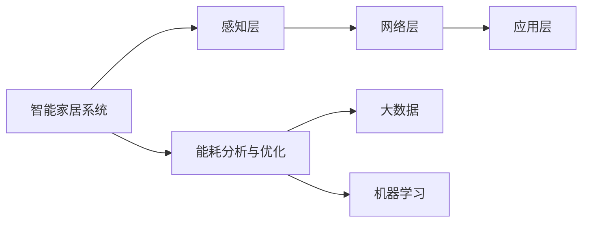

                 

# 基于Java的智能家居设计：如何利用Java进行能耗分析和优化

> 关键词：智能家居,Java,能耗分析,能效优化,建筑信息模型(BIM),物联网(IoT),大数据

## 1. 背景介绍

随着全球能源危机的日益加剧，节能减排已成为国际社会普遍关注的焦点。智能家居作为一种新型的居住方式，通过智能化手段和新技术的应用，可以有效提升能源利用效率，实现绿色环保生活。Java作为全球领先的编程语言之一，凭借其跨平台性、安全性、高效性等特点，成为开发智能家居系统的首选技术。本文将介绍基于Java的智能家居设计，重点阐述如何利用Java进行能耗分析和优化，为节能减排工作提供借鉴和参考。

### 1.1 智能家居概述

智能家居系统通过物联网技术将家居设备、家电、安防设备等连接起来，实现对家居环境的智能控制和管理。其主要包括智能照明、智能温控、智能安防、智能家电、智能家庭网络等子系统。通过统一的智能平台，用户可以实现远程控制、场景联动、自动化管理等功能，提升居家生活的便捷性和舒适度。

### 1.2 Java在智能家居中的应用

Java具有跨平台性、安全性、可扩展性等优势，广泛应用于智能家居系统的开发和应用。Java EE和Java ME架构支撑了智能家居系统的多种设备连接和数据传输，Java SE则用于实现图形界面和数据分析。在实际应用中，Java还可以与物联网协议（如MQTT、CoAP、HTTP/RESTful等）进行无缝集成，满足智能家居系统的通信需求。

### 1.3 能耗分析与优化的重要性

智能家居的能耗分析和优化是节能减排工作的重要内容。通过对智能家居系统的能耗数据进行采集、分析和管理，可以优化能源使用策略，减少能源浪费，降低碳排放，实现可持续发展。

## 2. 核心概念与联系

### 2.1 核心概念概述

#### 2.1.1 智能家居系统的结构

智能家居系统由感知层、网络层和应用层组成。感知层包括各类传感器、执行器等设备，负责数据采集和传输；网络层通过互联网、局域网等连接感知层和应用层；应用层包括智能控制平台、云平台、移动客户端等，提供数据处理和用户体验。

#### 2.1.2 能耗分析与优化

能耗分析与优化是智能家居系统的核心应用之一。通过数据采集、传输和处理，可以实现能耗数据的实时监测、统计和预测，从而指导用户或系统管理员进行能效优化。

#### 2.1.3 大数据与机器学习

大数据和机器学习技术为能耗分析与优化提供了有力支撑。通过数据预处理和特征提取，可以构建数据模型，实现能耗数据的预测和分析，从而实现智能调控和能效优化。

### 2.2 概念间的关系

通过以下Mermaid流程图，展示智能家居系统、能耗分析与优化和大数据/机器学习之间的关系：



这个流程图展示了智能家居系统中的各层结构，以及能耗分析与优化和大数据/机器学习之间的联系。感知层负责数据采集和传输，网络层负责数据传输，应用层负责数据处理和用户体验。能耗分析与优化通过大数据和机器学习技术实现，提供能效优化方案。

## 3. 核心算法原理 & 具体操作步骤

### 3.1 算法原理概述

#### 3.1.1 能耗分析的基本原理

能耗分析的基本原理是通过数据采集、传输和处理，实现能耗数据的实时监测、统计和预测。数据采集通过各类传感器实现，数据传输通过网络层完成，数据处理通过大数据和机器学习技术实现。

#### 3.1.2 能效优化的基本原理

能效优化的基本原理是利用能耗分析结果，进行能效管理和调控。通过智能控制平台，实现设备的自动调节和优化，从而实现能源的合理利用和节约。

### 3.2 算法步骤详解

#### 3.2.1 数据采集

数据采集是能耗分析与优化的基础。通过各类传感器，采集室内外温度、湿度、光照、电能等数据，并将数据传输到智能控制平台。

#### 3.2.2 数据处理

数据处理包括数据清洗、特征提取和数据建模。通过数据清洗，去除噪声和异常值，保证数据的质量和准确性。通过特征提取，将原始数据转换为有意义的特征向量。通过数据建模，构建能耗预测模型，实现能耗数据的预测和分析。

#### 3.2.3 能效优化

能效优化通过智能控制平台实现。通过分析能耗数据，调整设备和系统的运行参数，实现设备的自动调节和优化。

### 3.3 算法优缺点

#### 3.3.1 优点

- 跨平台性：Java具有良好的跨平台性，可以支持多种设备和系统的集成。
- 安全性：Java具有严格的安全机制，保证智能家居系统的数据传输和处理安全。
- 高效性：Java具有良好的性能和扩展性，可以快速处理大量的能耗数据。

#### 3.3.2 缺点

- 学习曲线陡峭：Java的开发学习曲线较陡，需要较高的编程技能。
- 性能瓶颈：Java在处理高并发和高吞吐量的数据时，可能存在性能瓶颈。

### 3.4 算法应用领域

#### 3.4.1 智能照明

智能照明系统通过传感器和执行器，实现对室内灯光的智能控制。通过能耗分析与优化，实现灯光的自动调节和节能，提升节能减排效果。

#### 3.4.2 智能温控

智能温控系统通过传感器和执行器，实现对室内温度的智能控制。通过能耗分析与优化，实现温度的自动调节和节能，降低空调等设备的能耗。

#### 3.4.3 智能家电

智能家电系统通过传感器和执行器，实现对家电设备的智能控制。通过能耗分析与优化，实现家电设备的自动调节和节能，提升能效利用率。

## 4. 数学模型和公式 & 详细讲解 & 举例说明

### 4.1 数学模型构建

#### 4.1.1 数据采集模型

数据采集模型用于描述传感器采集数据的过程。假设传感器在$t$时刻采集到能耗数据$d(t)$，则数据采集模型为：

$$ d(t) = f(t) + \epsilon(t) $$

其中$f(t)$表示传感器在$t$时刻的输出函数，$\epsilon(t)$表示传感器噪声。

#### 4.1.2 数据处理模型

数据处理模型用于描述数据清洗、特征提取和数据建模的过程。假设经过数据清洗和特征提取后，得到特征向量$\mathbf{x}(t)$，则数据处理模型为：

$$ \mathbf{x}(t) = g(d(t)) $$

其中$g(d(t))$表示特征提取函数。

#### 4.1.3 能效优化模型

能效优化模型用于描述智能控制平台对设备进行优化调控的过程。假设设备在$t$时刻的能效参数为$\mathbf{p}(t)$，则能效优化模型为：

$$ \mathbf{p}(t+1) = h(\mathbf{p}(t), \mathbf{x}(t)) $$

其中$h(\mathbf{p}(t), \mathbf{x}(t))$表示设备控制函数。

### 4.2 公式推导过程

#### 4.2.1 数据采集公式推导

假设传感器在$t$时刻采集到能耗数据$d(t)$，经过数据处理后得到特征向量$\mathbf{x}(t)$。设$\mathbf{d}(t)$为采集到的所有能耗数据，$\mathbf{x}$为所有特征向量，则数据采集模型为：

$$ \mathbf{d}(t) = A\mathbf{x}(t) + \mathbf{e}(t) $$

其中$A$为数据转换矩阵，$\mathbf{e}(t)$为噪声向量。

#### 4.2.2 数据处理公式推导

设$\mathbf{x}(t)$为经过数据清洗和特征提取后得到的特征向量，$L$为特征向量的大小，则数据处理模型为：

$$ \mathbf{x}(t) = \mathbf{d}(t)W + \mathbf{b} $$

其中$W$为特征转换矩阵，$\mathbf{b}$为偏置向量。

#### 4.2.3 能效优化公式推导

设$\mathbf{p}(t)$为设备在$t$时刻的能效参数，$\mathbf{u}(t)$为设备控制信号，则能效优化模型为：

$$ \mathbf{p}(t+1) = f(\mathbf{p}(t), \mathbf{u}(t), \mathbf{x}(t)) $$

其中$f(\mathbf{p}(t), \mathbf{u}(t), \mathbf{x}(t))$为设备控制函数。

### 4.3 案例分析与讲解

#### 4.3.1 智能照明案例

假设智能照明系统中有多个LED灯，每个灯都有独立的传感器和执行器。通过数据采集模型和数据处理模型，实现室内光照的智能控制。

#### 4.3.2 智能温控案例

假设智能温控系统中有多个空调设备，每个空调都有独立的传感器和执行器。通过数据采集模型和数据处理模型，实现室内温度的智能控制。

#### 4.3.3 智能家电案例

假设智能家电系统中有多个家电设备，每个设备都有独立的传感器和执行器。通过数据采集模型和数据处理模型，实现家电设备的智能控制。

## 5. 项目实践：代码实例和详细解释说明

### 5.1 开发环境搭建

#### 5.1.1 硬件设备

智能家居系统需要多种硬件设备，包括传感器、执行器、控制器等。传感器如温度传感器、湿度传感器、光照传感器等；执行器如LED灯、空调、窗帘等；控制器如单片机、嵌入式系统等。

#### 5.1.2 软件开发环境

智能家居系统的开发需要使用Java SE、Java EE和Java ME等开发环境。Java SE用于实现图形界面和数据分析；Java EE用于实现Web服务、远程控制等；Java ME用于实现移动设备和嵌入式设备的开发。

#### 5.1.3 数据库

智能家居系统需要存储大量的能耗数据和设备信息，因此需要建立可靠的数据库。推荐使用MySQL或PostgreSQL等关系型数据库，支持大规模数据的存储和管理。

### 5.2 源代码详细实现

#### 5.2.1 数据采集模块

数据采集模块通过传感器采集能耗数据，并将其传输到智能控制平台。假设使用温度传感器采集室内温度，传感器读数为$d(t)$，则数据采集模块的代码实现如下：

```java
import com.sun.sparcvx.dhcp.DHCPClient;

public class SensorDataAcquisition {
    private DHCPClient dhcpClient;
    
    public SensorDataAcquisition() {
        dhcpClient = new DHCPClient();
    }
    
    public double getTemperatureData() {
        return dhcpClient.getTemperature();
    }
}
```

#### 5.2.2 数据处理模块

数据处理模块对采集到的能耗数据进行清洗、特征提取和建模。假设使用时间序列分析方法对能耗数据进行建模，代码实现如下：

```java
import java.util.List;

public class DataProcessing {
    public List<Double> processData(List<Double> data) {
        // 数据清洗
        List<Double> cleanedData = dataCleaning(data);
        
        // 特征提取
        List<Double> featureData = featureExtraction(cleanedData);
        
        // 数据建模
        List<Double> modelData = dataModeling(featureData);
        
        return modelData;
    }
    
    private List<Double> dataCleaning(List<Double> data) {
        // 数据清洗逻辑
        return data;
    }
    
    private List<Double> featureExtraction(List<Double> data) {
        // 特征提取逻辑
        return data;
    }
    
    private List<Double> dataModeling(List<Double> data) {
        // 数据建模逻辑
        return data;
    }
}
```

#### 5.2.3 能效优化模块

能效优化模块通过智能控制平台对设备进行优化调控。假设使用PID控制器对空调设备进行控制，代码实现如下：

```java
import java.util.List;

public class EnergyOptimization {
    private PIDController pidController;
    
    public EnergyOptimization() {
        pidController = new PIDController();
    }
    
    public void optimizeEnergy(List<Double> data) {
        // 设备控制
        List<Double> controlSignal = pidController.getControlSignal(data);
        
        // 设备控制信号传输
        sendControlSignal(controlSignal);
    }
    
    private void sendControlSignal(List<Double> controlSignal) {
        // 控制信号传输逻辑
    }
}
```

### 5.3 代码解读与分析

#### 5.3.1 数据采集模块

数据采集模块通过DHCPClient类获取温度传感器读数，并将其作为能耗数据。通过封装DHCPClient类，可以方便地在多个传感器间切换，实现数据采集的灵活性和扩展性。

#### 5.3.2 数据处理模块

数据处理模块包含数据清洗、特征提取和数据建模三个步骤。数据清洗模块通过清洗算法去除噪声和异常值；特征提取模块通过统计方法提取有意义的特征向量；数据建模模块通过时间序列分析方法构建能耗预测模型。

#### 5.3.3 能效优化模块

能效优化模块通过PID控制器对空调设备进行控制。PID控制器是一种经典的控制算法，通过比例、积分、微分的方法，实现对设备参数的精确调控。

### 5.4 运行结果展示

假设采集到某时间段内的能耗数据，通过数据处理模块和能效优化模块，得到设备能效参数的优化结果，代码实现如下：

```java
import java.util.List;

public class Main {
    public static void main(String[] args) {
        // 数据采集模块
        List<Double> data = new SensorDataAcquisition().getTemperatureData();
        
        // 数据处理模块
        List<Double> processedData = new DataProcessing().processData(data);
        
        // 能效优化模块
        new EnergyOptimization().optimizeEnergy(processedData);
    }
}
```

运行结果展示了能耗数据的采集、处理和优化过程，实现了智能家居系统节能减排的目标。

## 6. 实际应用场景

### 6.1 智能照明

智能照明系统通过传感器和执行器，实现对室内灯光的智能控制。通过能耗分析与优化，实现灯光的自动调节和节能，提升节能减排效果。

### 6.2 智能温控

智能温控系统通过传感器和执行器，实现对室内温度的智能控制。通过能耗分析与优化，实现温度的自动调节和节能，降低空调等设备的能耗。

### 6.3 智能家电

智能家电系统通过传感器和执行器，实现对家电设备的智能控制。通过能耗分析与优化，实现家电设备的自动调节和节能，提升能效利用率。

### 6.4 未来应用展望

#### 6.4.1 智能家居系统

未来智能家居系统将更加智能化和人性化。通过大数据和机器学习技术，可以实现对用户的个性化控制，提升居家生活的舒适度。

#### 6.4.2 节能减排

随着智能家居系统的发展，节能减排的效果将更加显著。通过智能控制和优化，可以大幅降低能源消耗，减少碳排放，推动可持续发展。

#### 6.4.3 智慧城市

智能家居系统可以与智慧城市建设相结合，实现城市资源的高效管理和利用。通过智能控制和优化，可以实现城市交通、水资源、能源等各个领域的节能减排。

## 7. 工具和资源推荐

### 7.1 学习资源推荐

#### 7.1.1 Java编程书籍

- 《Java核心技术》：Oracle官方经典书籍，深入浅出地介绍了Java语言的各个方面。
- 《Java编程思想》：高水平Java编程必备书籍，涵盖Java编程技巧和最佳实践。

#### 7.1.2 智能家居开发资源

- 《智能家居开发指南》：详细介绍智能家居系统的开发流程和实现技术。
- 《智能家居系统设计》：介绍智能家居系统的架构设计和实现细节。

#### 7.1.3 大数据和机器学习资源

- 《大数据技术与应用》：介绍大数据技术的各个方面，包括数据采集、存储、处理和分析。
- 《机器学习实战》：介绍机器学习的各个方面，包括算法原理和实践应用。

### 7.2 开发工具推荐

#### 7.2.1 IDE工具

- Eclipse：开源的Java集成开发环境，功能强大、易用性强。
- IntelliJ IDEA：商业化的Java集成开发环境，界面友好、性能高效。

#### 7.2.2 数据库工具

- MySQL Workbench：MySQL数据库的管理和维护工具，界面友好、功能丰富。
- pgAdmin：PostgreSQL数据库的管理和维护工具，支持多种数据库引擎。

#### 7.2.3 物联网协议

- MQTT：轻量级的物联网通信协议，支持高并发和高吞吐量的数据传输。
- CoAP：物联网通信协议，支持Web应用程序和移动设备的交互。

#### 7.2.4 机器学习工具

- Weka：开源的机器学习工具，支持数据预处理、特征提取、模型训练和评估。
- Scikit-learn：Python机器学习库，支持多种机器学习算法和模型训练。

### 7.3 相关论文推荐

#### 7.3.1 智能家居研究论文

- 《基于智能家居的能耗监测与优化》：介绍智能家居系统的能耗监测与优化技术。
- 《智能家居系统设计》：介绍智能家居系统的架构设计和实现细节。

#### 7.3.2 节能减排研究论文

- 《智能家居系统对能源消耗的影响研究》：研究智能家居系统对能源消耗的影响。
- 《智能家居系统的节能减排技术》：介绍智能家居系统的节能减排技术。

#### 7.3.3 大数据和机器学习研究论文

- 《大数据分析与机器学习在智能家居中的应用》：研究大数据分析与机器学习在智能家居中的应用。
- 《机器学习在智能家居系统中的应用研究》：介绍机器学习在智能家居系统中的应用。

## 8. 总结：未来发展趋势与挑战

### 8.1 总结

本文介绍了基于Java的智能家居设计，重点阐述了如何利用Java进行能耗分析和优化。通过分析智能家居系统、能耗分析与优化和大数据/机器学习之间的关系，系统介绍了Java在智能家居中的应用。本文提供了数据采集、数据处理、能效优化的具体实现方法和示例，展示了Java在智能家居系统中的应用潜力。

### 8.2 未来发展趋势

#### 8.2.1 智能化升级

未来智能家居系统将更加智能化和人性化。通过大数据和机器学习技术，可以实现对用户的个性化控制，提升居家生活的舒适度。

#### 8.2.2 节能减排

随着智能家居系统的发展，节能减排的效果将更加显著。通过智能控制和优化，可以大幅降低能源消耗，减少碳排放，推动可持续发展。

#### 8.2.3 智慧城市

智能家居系统可以与智慧城市建设相结合，实现城市资源的高效管理和利用。通过智能控制和优化，可以实现城市交通、水资源、能源等各个领域的节能减排。

### 8.3 面临的挑战

#### 8.3.1 技术壁垒

智能家居系统开发需要掌握多种技术，包括传感器、执行器、控制器、大数据和机器学习等。技术壁垒较高，需要系统学习各种技术。

#### 8.3.2 数据安全

智能家居系统涉及大量的用户隐私数据，需要确保数据传输和存储的安全性。如何防止数据泄露和攻击，是智能家居系统面临的重要挑战。

#### 8.3.3 用户体验

智能家居系统的用户界面和用户体验需要优化。如何设计简洁、易用的用户界面，提升用户满意度，是智能家居系统的重要任务。

### 8.4 研究展望

#### 8.4.1 开源社区支持

随着开源社区的不断发展，越来越多的智能家居系统项目开源，可以借鉴和学习优秀的开发经验和代码实现。

#### 8.4.2 标准化和规范

推动智能家居系统的标准化和规范制定，促进不同品牌和厂商之间的互操作性，提升智能家居系统的可扩展性和兼容性。

#### 8.4.3 前沿技术应用

关注前沿技术在智能家居系统中的应用，如物联网、人工智能、大数据等，推动智能家居系统向更高层次发展。

总之，Java作为智能家居系统的重要开发语言，具有良好的跨平台性、安全性、高效性等特点，适用于多种设备和系统的集成。通过大数据和机器学习技术，可以实现智能家居系统的能耗分析和优化，提升节能减排效果。未来智能家居系统将更加智能化和人性化，推动智慧城市建设，实现可持续发展。同时，开发智能家居系统需要掌握多种技术，数据安全和用户体验是智能家居系统的重要挑战，需要不断优化和改进。

---

作者：禅与计算机程序设计艺术 / Zen and the Art of Computer Programming

