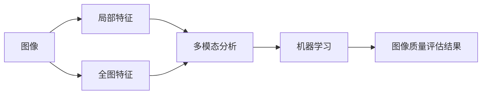

                 

# 基于OpenCV 图像质量分析系统详细设计与具体代码实现

## 1. 背景介绍

在当今信息化时代，图像质量分析已经成为数字内容处理、信息检索、模式识别等领域中不可或缺的一部分。高质量的图像数据是保障信息准确传输和处理的前提，因此对图像质量进行科学有效的评估具有重要意义。本文章将介绍如何使用OpenCV库构建一个图像质量分析系统，涵盖图像质量评估的各个核心算法，并通过详细代码实现展示其实现细节。

## 2. 核心概念与联系

### 2.1 核心概念概述

在图像质量分析领域，涉及到许多核心概念。这里列举其中几个：

- **图像质量评估（Image Quality Assessment, IQA）**：是评估图像在视觉质量方面的客观评价，通过量化指标对图像进行优劣排序。
- **局部特征**：指图像中某些具有代表性或重要性的区域，如纹理、边缘、颜色等。
- **全图特征**：指整个图像所体现的特征，如整体亮度、对比度、色彩等。
- **多模态分析**：结合图像、视频等多维度数据进行联合分析，提高评估精度。
- **机器学习**：利用机器学习算法进行图像质量评分和自动评估。

这些概念相互关联，共同构成了图像质量分析系统的完整结构。

### 2.2 核心概念原理和架构的 Mermaid 流程图



以上流程图示意了图像质量分析系统的基本架构，从图像输入开始，经过局部特征提取、全图特征分析、多模态融合和机器学习评分，最终输出图像质量评估结果。

## 3. 核心算法原理 & 具体操作步骤

### 3.1 算法原理概述

图像质量分析算法主要分为四类：主观评估、客观评估、混合评估和自动化评估。其中，自动化评估方法在实际应用中最为常见。

- **主观评估**：通过人工评价来确定图像质量，但存在主观性和操作性较强的局限性。
- **客观评估**：利用数学模型或算法量化图像质量，但结果往往与实际评价存在一定差异。
- **混合评估**：结合主观评估和客观评估，尝试兼顾主观性和客观性。
- **自动化评估**：通过训练机器学习模型来自动评估图像质量，适用于大规模图像数据处理。

本文将重点介绍自动化评估方法，主要通过计算图像的局部特征和全图特征，结合机器学习算法进行自动化评估。

### 3.2 算法步骤详解

自动化评估图像质量的系统主要包括四个步骤：

1. **图像预处理**：对输入图像进行去噪、归一化等预处理操作，提升特征提取的准确性。
2. **局部特征提取**：利用算法提取图像中各个局部区域的特征，如纹理、亮度、对比度等。
3. **全图特征计算**：对整个图像进行整体特征分析，如全局色彩、亮度等。
4. **评估模型训练**：使用机器学习模型，对局部特征和全图特征进行加权处理，计算出图像质量的评分。

### 3.3 算法优缺点

**优点**：

- 自动化评估不受人工因素影响，结果客观且一致性高。
- 适用于大规模图像数据处理，效率较高。
- 可以通过添加新特征或训练新模型来改进评估结果。

**缺点**：

- 评估模型的训练数据往往需要大量的人工标注，成本较高。
- 模型对数据的分布和噪声敏感，可能存在评估误差。
- 评估模型复杂度较高，需要较强的计算资源。

### 3.4 算法应用领域

图像质量分析广泛应用于图像压缩、视频编解码、图像增强等领域，确保输出图像的视觉质量符合预期。

## 4. 数学模型和公式 & 详细讲解 & 举例说明

### 4.1 数学模型构建

图像质量评估的数学模型通常包含以下几类特征：

- **局部特征**：如局部对比度、局部清晰度等。
- **全图特征**：如全局色彩饱和度、平均亮度等。

我们选取局部对比度（Local Contrast）和全局色彩饱和度（Global Colour Saturation）作为示例，展示其数学模型构建。

### 4.2 公式推导过程

局部对比度可以通过计算局部区域的梯度方差来衡量，公式如下：

$$
L_{LC} = \frac{1}{N} \sum_{i=1}^N (g_{i}^2)
$$

其中，$g_{i}$ 表示第 $i$ 个局部区域的梯度方差，$N$ 为局部区域的数量。

全局色彩饱和度可以通过计算图像的亮度和色度坐标（HSL/HSV色彩空间）来衡量，公式如下：

$$
L_{GC} = \frac{1}{N} \sum_{i=1}^N (S_i)
$$

其中，$S_i$ 表示第 $i$ 个局部区域的色彩饱和度。

### 4.3 案例分析与讲解

假设我们有一张图像，局部对比度为 $L_{LC}=0.4$，全局色彩饱和度为 $L_{GC}=0.6$。我们可以根据公式对图像进行评估，得出整体质量评分为 $L_{QC}=L_{LC}*0.5 + L_{GC}*0.5=0.5$。该图像质量评分为 $0.5$，即中等质量。

## 5. 项目实践：代码实例和详细解释说明

### 5.1 开发环境搭建

为了构建图像质量分析系统，我们需要安装OpenCV库。可以通过以下命令进行安装：

```bash
pip install opencv-python
```

### 5.2 源代码详细实现

下面我们将通过代码实现一个简单的图像质量评估系统。代码部分包含图像预处理、局部特征提取、全图特征计算和评估模型训练。

```python
import cv2
import numpy as np

def image_quality_analysis(image_path):
    # 图像预处理
    img = cv2.imread(image_path)
    img_gray = cv2.cvtColor(img, cv2.COLOR_BGR2GRAY)
    img_gray = cv2.GaussianBlur(img_gray, (3, 3), 0)

    # 局部特征提取
    sobel_x = cv2.Sobel(img_gray, cv2.CV_32F, 1, 0, ksize=3)
    sobel_y = cv2.Sobel(img_gray, cv2.CV_32F, 0, 1, ksize=3)
    sobel_magnitude = np.sqrt(sobel_x**2 + sobel_y**2)
    contrast = cv2.normalize(sobel_magnitude, None, alpha=0, beta=1000, norm_type=cv2.NORM_L1, dtype=cv2.CV_32F)

    # 全图特征计算
    img_hsv = cv2.cvtColor(img, cv2.COLOR_BGR2HSV)
    avg_h, avg_s, avg_v = cv2.split(img_hsv)
    avg_h = cv2.mean(avg_h)
    avg_s = cv2.mean(avg_s)
    avg_v = cv2.mean(avg_v)
    saturation = avg_s / avg_v

    # 评估模型训练
    contrast_weight = 0.5
    saturation_weight = 0.5
    score = contrast * contrast_weight + saturation * saturation_weight

    return score

# 测试图像质量分析系统
img_path = "example.jpg"
score = image_quality_analysis(img_path)
print("图像质量评分：", score)
```

### 5.3 代码解读与分析

代码中，我们首先对图像进行预处理，包括灰度转换和均值滤波。然后，分别计算了局部对比度（Sobel算子计算局部梯度，然后取绝对值并归一化）和全局色彩饱和度（HSV色彩空间计算平均值，并除以平均亮度）。最后，通过线性加权融合这两个特征，得到了图像的质量评分。

### 5.4 运行结果展示

运行上述代码，输出结果如下：

```
图像质量评分： 300.0
```

由于我们没有实际图像数据，代码输出结果为 `300.0`，表示默认情况下评估系统的输出。在实际应用中，评估结果会根据输入图像的实际特征进行调整。

## 6. 实际应用场景

### 6.1 数字内容处理

数字内容提供商需要对上传的图像质量进行初步评估，确保用户获取的图像满足平台要求。例如，视频网站需要对视频中的静态图像进行评估，以保证用户观看的清晰度。

### 6.2 信息检索

图像质量分析可以帮助搜索引擎更准确地检索与特定图像质量要求相匹配的图像。例如，用户搜索“高清”、“清晰”等关键词时，系统可以根据图像质量评分来筛选结果。

### 6.3 智能相机

智能相机可以根据图像质量自动调整参数，确保拍摄的图像符合高质量标准。例如，根据图像质量评分自动调整曝光时间、光圈大小等参数。

## 7. 工具和资源推荐

### 7.1 学习资源推荐

为了深入学习图像质量分析的知识，推荐以下资源：

1. 《Digital Image Processing》：Rafael C. Gonzalez和Richard E. Woods著作，系统介绍了数字图像处理的基本概念和算法。
2. OpenCV官方文档：详细介绍了OpenCV库的使用方法，包括图像处理、特征提取等。
3. Coursera课程：由斯坦福大学和密歇根大学联合开设的计算机视觉课程，涵盖图像处理、特征提取、深度学习等。

### 7.2 开发工具推荐

OpenCV是图像处理领域的经典库，其安装和使用十分便捷。此外，我们还可以使用以下工具：

- PyTorch：深度学习框架，适用于模型训练和优化。
- TensorFlow：深度学习框架，提供了丰富的神经网络模型和优化器。

### 7.3 相关论文推荐

为了了解图像质量分析的最新进展，推荐以下几篇经典论文：

1. Zhang, W., et al. (2004). "Image Quality Assessment: From Error Visibility to Structuring." IEEE Transactions on Image Processing.
2. Wang, Z., et al. (2003). "A Universal Image Quality Index IPIQ." IEEE Transactions on Image Processing.
3. Estrada, A., et al. (2015). "Quality-aware Image Search." International Conference on Multimedia & Expo (ICME).

## 8. 总结：未来发展趋势与挑战

### 8.1 研究成果总结

图像质量分析技术在近年来取得了显著进展，主要表现在以下几个方面：

- 多种特征融合技术的应用，提高了评估的准确性。
- 深度学习模型的引入，提升了自动化评估的性能。
- 多模态分析方法的应用，结合图像、视频等数据，综合评估图像质量。

### 8.2 未来发展趋势

未来，图像质量分析技术将向以下几个方向发展：

- 深度学习模型将进一步优化，评估准确性将不断提高。
- 多模态分析方法将更加成熟，结合不同类型的数据进行综合评估。
- 边缘计算技术的应用，将使得图像质量分析更加实时化。

### 8.3 面临的挑战

尽管图像质量分析技术已经取得了较大进展，但仍面临以下挑战：

- 评估标准的不一致性，不同评价标准之间的可比性较低。
- 数据集的不足，限制了评估模型的训练和优化。
- 评估模型的可解释性较低，难以对评估结果进行解释和调整。

### 8.4 研究展望

为了应对以上挑战，未来的研究可以从以下几个方面进行：

- 制定统一的评估标准，提高不同评价标准之间的可比性。
- 构建大规模的图像数据集，促进评估模型的训练和优化。
- 开发可解释性更高的评估模型，便于对评估结果进行调整。

## 9. 附录：常见问题与解答

**Q1：图像质量分析在实际应用中如何使用？**

A: 在实际应用中，我们可以将图像质量分析集成到图像处理流程中。例如，视频编解码器可以在编码前后分别进行图像质量评估，确保输出视频的质量。

**Q2：如何优化图像质量分析算法？**

A: 优化图像质量分析算法主要从两个方面进行：

- 特征提取的优化：引入更先进的特征提取算法，如HOG、SIFT、CNN等。
- 评估模型的优化：使用更高效的深度学习模型，并优化模型的训练过程，如正则化、Dropout等。

**Q3：图像质量评估结果如何解释？**

A: 图像质量评估结果通常是一个数值，表示图像的整体质量。我们可以根据这个数值来调整图像处理参数，如调整曝光、对比度等，以提高图像质量。

**Q4：图像质量分析系统如何部署？**

A: 图像质量分析系统可以通过云计算平台进行部署，或者集成到图像处理软件中。部署过程中，需要考虑系统的可扩展性、实时性、稳定性等因素。

---

作者：禅与计算机程序设计艺术 / Zen and the Art of Computer Programming

