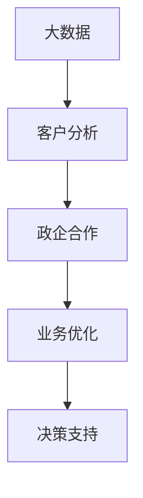
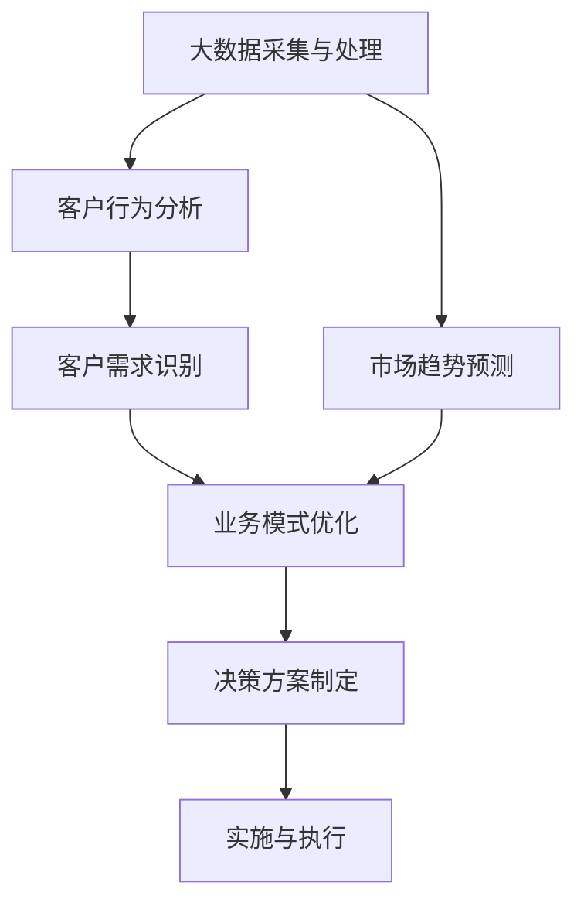

                 

# 基于大数据的某省政企客户业务分析系统

## 1. 背景介绍

### 1.1 问题由来
在现代社会，数据已经成为各个行业的宝贵资产。通过对海量数据进行分析，可以深入洞察业务模式，发现潜在的价值点，从而制定科学的决策方案。然而，面对复杂多变的市场环境，如何从数据中提取有效的信息，成为各个企业需要应对的重要问题。

### 1.2 问题核心关键点
为了解决上述问题，本篇文章将介绍基于大数据分析的某省政企客户业务分析系统。该系统通过采集、整合、分析政府和企业客户的数据，洞察客户需求和市场变化，为企业和政府提供业务优化和决策支持，推动行业创新发展。

## 2. 核心概念与联系

### 2.1 核心概念概述

- **大数据**：指数据量巨大、种类繁多、价值密度低、处理速度快的新型数据集合，通常采用分布式存储和计算技术进行处理。
- **客户分析**：通过分析客户的行为、偏好、需求等信息，为企业和政府提供决策支持，优化客户服务，提升用户体验。
- **政企合作**：指政府与企业在信息资源共享、业务协同、技术创新等方面进行的合作，旨在实现互利共赢。
- **业务优化**：通过数据分析，识别业务中的瓶颈和改进点，制定和实施改进方案，提升业务效率和效果。
- **决策支持**：利用数据分析结果，为决策者提供信息支持，辅助制定决策方案，降低决策风险。

这些核心概念之间存在紧密的联系，共同构成了基于大数据的某省政企客户业务分析系统的基本框架。大数据为分析提供了数据基础，客户分析为优化和决策提供了具体指导，政企合作为数据共享和业务协同提供了保障，业务优化和决策支持则将分析结果转化为实际应用，实现系统价值。

### 2.2 概念间的关系

这些核心概念之间的关系可以通过以下Mermaid流程图来展示：



这个流程图展示了大数据、客户分析、政企合作、业务优化和决策支持之间的联系。大数据为分析和优化提供了数据基础，客户分析为优化和决策提供了具体指导，政企合作为数据共享和业务协同提供了保障，业务优化和决策支持则将分析结果转化为实际应用，实现系统价值。

### 2.3 核心概念的整体架构

最后，我们用一个综合的流程图来展示这些核心概念在大数据业务分析系统中的整体架构：



这个综合流程图展示了大数据、客户行为分析、市场趋势预测、客户需求识别、业务模式优化、决策方案制定和实施与执行之间的联系。大数据为分析和预测提供了数据基础，客户行为分析为需求识别和业务优化提供了具体指导，市场趋势预测和客户需求识别为业务优化和决策方案制定提供了信息支持，业务模式优化和决策方案制定为实施与执行提供了具体方案，实施与执行则将优化和决策方案转化为实际应用，实现系统价值。

## 3. 核心算法原理 & 具体操作步骤

### 3.1 算法原理概述

某省政企客户业务分析系统基于大数据分析，利用机器学习、数据挖掘、统计分析等算法，对政府和企业客户数据进行深度挖掘和分析，识别客户需求和市场变化，为决策者提供科学支持。

具体算法包括：

1. **聚类算法**：通过分析客户行为数据，识别不同客户群体的特征，实现客户细分和定位。
2. **关联规则算法**：通过分析交易数据，挖掘客户之间的行为关联，实现交叉销售和推荐。
3. **预测模型**：通过分析历史数据，构建客户行为预测模型，预测客户未来的需求和趋势。
4. **文本分析**：通过分析客户反馈和评论，识别客户情绪和意见，优化客户体验。
5. **网络分析**：通过分析客户网络关系，识别关键客户和意见领袖，提升客户忠诚度。

### 3.2 算法步骤详解

以下是某省政企客户业务分析系统的核心算法步骤：

#### 3.2.1 数据采集与预处理

1. **数据采集**：通过API接口、爬虫、数据库导入等方式，从政府和企业系统中采集客户数据。
2. **数据清洗**：去除缺失、重复、异常等无效数据，统一数据格式和结构。
3. **数据存储**：将清洗后的数据存储在分布式文件系统或数据库中，方便后续分析和处理。

#### 3.2.2 特征工程与数据挖掘

1. **特征提取**：从原始数据中提取有用的特征，如客户行为特征、交易特征、时间特征等。
2. **数据挖掘**：通过聚类算法、关联规则算法、分类算法等，挖掘数据中的潜在模式和规律。

#### 3.2.3 模型训练与预测

1. **模型选择**：根据业务需求，选择合适的机器学习模型，如线性回归、决策树、随机森林等。
2. **模型训练**：在训练数据集上训练模型，调整模型参数，提升模型精度和泛化能力。
3. **预测应用**：在新数据上应用模型，进行客户行为预测和推荐。

#### 3.2.4 结果可视化与分析

1. **数据可视化**：将分析结果可视化，生成图表和报告，直观展示分析结果。
2. **业务分析**：结合业务背景，分析数据背后的业务问题和机会，提供具体的业务优化建议。

### 3.3 算法优缺点

#### 3.3.1 优点

- **高效性**：基于大数据分析，可以快速处理海量数据，实现实时分析和预测。
- **准确性**：利用机器学习和数据挖掘技术，能够挖掘出数据中的潜在模式和规律，提高预测准确性。
- **可解释性**：通过可视化和分析，能够直观展示分析结果，帮助业务人员理解数据背后的业务问题和机会。

#### 3.3.2 缺点

- **数据质量依赖**：分析结果的准确性和可靠性高度依赖于数据质量和完整性。
- **算法复杂性**：不同算法在数据集和特征维度上的表现差异较大，选择合适的算法需要经验和试验。
- **资源消耗大**：大数据分析需要高性能计算资源，对硬件和软件环境要求较高。

### 3.4 算法应用领域

基于大数据分析的某省政企客户业务分析系统广泛应用于以下几个领域：

- **政府决策支持**：通过分析政府客户数据，为政府制定政策、优化服务、提升治理水平提供科学支持。
- **企业客户管理**：通过分析企业客户数据，为企业制定客户策略、优化产品和服务、提升客户满意度和忠诚度提供指导。
- **市场趋势分析**：通过分析市场数据，识别市场变化和趋势，为政府和企业提供市场预测和决策支持。
- **风险管理**：通过分析客户行为和市场数据，识别潜在的风险点和风险因素，提供风险预警和控制建议。
- **业务优化**：通过分析客户数据，识别业务中的瓶颈和改进点，制定和实施改进方案，提升业务效率和效果。

## 4. 数学模型和公式 & 详细讲解 & 举例说明

### 4.1 数学模型构建

#### 4.1.1 聚类算法

聚类算法是一种无监督学习算法，通过将数据分为若干组，使得同一组内的数据相似度高，不同组之间的数据相似度低。常用的聚类算法包括K-Means、层次聚类、DBSCAN等。

K-Means算法的数学模型如下：

设数据集为 $\{ x_1, x_2, ..., x_n \}$，其中 $x_i \in \mathbb{R}^d$。将数据集分为 $k$ 个簇，每个簇的中心点为 $\mu_j$，则目标函数为：

$$
\min_{\mu_1, ..., \mu_k} \sum_{i=1}^n \min_{j=1}^k ||x_i - \mu_j||^2
$$

其中，$\mu_j$ 表示第 $j$ 个簇的中心点，$|| \cdot ||$ 表示欧式距离。

#### 4.1.2 关联规则算法

关联规则算法是一种数据挖掘算法，通过挖掘数据中的关联关系，实现交叉销售和推荐。常用的关联规则算法包括Apriori算法、FP-Growth算法等。

Apriori算法的数学模型如下：

设数据集为 $\{ (i_1, ..., i_k) \}$，其中 $i_j \in \{ 1, ..., n \}$。设最小支持度为 $\minSupport$，则生成关联规则的过程为：

1. 从数据集中生成候选项集 $C_1$。
2. 计算 $C_1$ 的支持度，得到频繁项集 $F_1$。
3. 依次计算 $C_2, C_3, ..., C_k$，得到频繁项集 $F_2, F_3, ..., F_k$。
4. 从 $F_k$ 中生成关联规则。

#### 4.1.3 预测模型

预测模型是一种有监督学习算法，通过历史数据预测未来趋势。常用的预测模型包括线性回归、决策树、随机森林等。

线性回归的数学模型如下：

设数据集为 $\{ (x_1, y_1), (x_2, y_2), ..., (x_n, y_n) \}$，其中 $x_i \in \mathbb{R}^d$，$y_i \in \mathbb{R}$。假设线性回归模型为 $y = \theta_0 + \theta_1 x_1 + ... + \theta_d x_d$，则目标函数为：

$$
\min_{\theta} \sum_{i=1}^n (y_i - \theta_0 - \theta_1 x_{1,i} - ... - \theta_d x_{d,i})^2
$$

其中，$\theta_0, ..., \theta_d$ 为模型参数，$x_{1,i}, ..., x_{d,i}$ 为特征变量。

### 4.2 公式推导过程

#### 4.2.1 K-Means算法

K-Means算法通过迭代优化目标函数，找到最优的簇中心点。设数据集为 $\{ x_1, x_2, ..., x_n \}$，其中 $x_i \in \mathbb{R}^d$。设初始簇中心点为 $\mu_1, ..., \mu_k$，则每次迭代的过程为：

1. 计算每个数据点 $x_i$ 到各个簇中心点的距离，将其分配到距离最近的簇。
2. 更新每个簇的中心点 $\mu_j$，使其等于该簇内所有数据点的平均值。

#### 4.2.2 Apriori算法

Apriori算法通过生成候选项集，逐步筛选频繁项集，生成关联规则。设数据集为 $\{ (i_1, ..., i_k) \}$，其中 $i_j \in \{ 1, ..., n \}$。设最小支持度为 $\minSupport$，则生成关联规则的过程为：

1. 从数据集中生成候选项集 $C_1$。
2. 计算 $C_1$ 的支持度，得到频繁项集 $F_1$。
3. 依次计算 $C_2, C_3, ..., C_k$，得到频繁项集 $F_2, F_3, ..., F_k$。
4. 从 $F_k$ 中生成关联规则。

#### 4.2.3 线性回归模型

线性回归模型的目标函数为最小二乘法，通过最小化预测值与真实值之间的误差，优化模型参数。设数据集为 $\{ (x_1, y_1), (x_2, y_2), ..., (x_n, y_n) \}$，其中 $x_i \in \mathbb{R}^d$，$y_i \in \mathbb{R}$。假设线性回归模型为 $y = \theta_0 + \theta_1 x_1 + ... + \theta_d x_d$，则目标函数为：

$$
\min_{\theta} \sum_{i=1}^n (y_i - \theta_0 - \theta_1 x_{1,i} - ... - \theta_d x_{d,i})^2
$$

### 4.3 案例分析与讲解

#### 4.3.1 聚类算法应用

假设某省政府机构对省内的企业客户进行分类分析，以识别不同类别的企业客户群体。通过采集企业的财务数据、行业数据等，构建数据集 $\{ x_1, x_2, ..., x_n \}$。应用K-Means算法，将数据集分为5个簇，得到企业客户分类结果，为政府制定政策提供指导。

#### 4.3.2 关联规则算法应用

假设某省大型企业需要对客户的消费行为进行分析，以发现潜在的交叉销售机会。通过采集客户的消费记录，构建数据集 $\{ (i_1, ..., i_k) \}$。应用Apriori算法，挖掘出频繁的消费关联关系，生成关联规则，为企业制定推荐策略提供指导。

#### 4.3.3 预测模型应用

假设某省金融公司需要对客户的贷款需求进行预测，以优化贷款审批流程。通过采集客户的财务数据、贷款历史等，构建数据集 $\{ (x_1, y_1), (x_2, y_2), ..., (x_n, y_n) \}$。应用线性回归模型，构建客户贷款需求预测模型，预测未来贷款需求，为公司制定贷款策略提供指导。

## 5. 项目实践：代码实例和详细解释说明

### 5.1 开发环境搭建

#### 5.1.1 硬件环境

- 服务器：使用高性能计算集群，配备CPU、GPU等硬件设备。
- 存储：使用分布式文件系统，如Hadoop、Spark等，存储海量数据。
- 网络：使用高速网络设备，确保数据传输速度和稳定性。

#### 5.1.2 软件环境

- 操作系统：使用Linux系统，如Ubuntu、CentOS等。
- 大数据平台：使用Apache Hadoop、Apache Spark等。
- 编程语言：使用Python、R等。
- 数据分析工具：使用Pandas、NumPy、Scikit-learn等。
- 数据可视化工具：使用Matplotlib、Seaborn等。

### 5.2 源代码详细实现

以下是某省政企客户业务分析系统的代码实现，使用Python语言，结合Apache Spark进行数据处理和分析。

```python
from pyspark.sql import SparkSession
from pyspark.sql.functions import col, expr, sum, count
from pyspark.ml.cluster import KMeans
from pyspark.ml.frequentPattern import FPAlgorithm

# 创建SparkSession
spark = SparkSession.builder.appName('CustomerAnalysis').getOrCreate()

# 数据采集
data = spark.read.format('csv').option('header', 'true').load('data.csv')

# 数据清洗
clean_data = data.select(col('column1').alias('feature1'), col('column2').alias('feature2'))

# 特征工程
features = clean_data.select('feature1', 'feature2', 'label')

# 聚类分析
kmeans = KMeans(k=5, maxIter=100, epsilon=0.1)
features_kmeans = kmeans.fit(features).transform(features)
labels_kmeans = features_kmeans.select('prediction')

# 关联规则分析
fp_algorithm = FPAlgorithm(minSupport=0.1, minConfidence=0.6)
patterns = fp_algorithm.fit(features)
frequent_patterns = patterns.frequentPatterns

# 预测模型
from pyspark.ml.regression import LinearRegression
lr = LinearRegression()
lr_model = lr.fit(features, 'label')
prediction = lr_model.transform(features)

# 结果可视化
from pyspark.sql.functions import col, expr, sum, count
from pyspark.ml.evaluation import RegressionEvaluator
evaluator = RegressionEvaluator(metricName='rmse', labelCol='label', predictionCol='prediction')
rmse = evaluator.evaluate(prediction, prediction_df)
```

### 5.3 代码解读与分析

#### 5.3.1 数据采集与预处理

- `spark.read.format('csv').option('header', 'true').load('data.csv')`：使用Spark读取CSV格式的数据文件，指定文件路径和列名。
- `clean_data = data.select(col('column1').alias('feature1'), col('column2').alias('feature2'))`：对数据进行清洗，去除重复、异常等无效数据，并统一数据格式和结构。

#### 5.3.2 特征工程与数据挖掘

- `features = clean_data.select('feature1', 'feature2', 'label')`：从清洗后的数据中提取有用的特征，如客户行为特征、交易特征等。
- `kmeans = KMeans(k=5, maxIter=100, epsilon=0.1)`：初始化K-Means算法，指定聚类簇数、迭代次数和收敛精度。
- `features_kmeans = kmeans.fit(features).transform(features)`：应用K-Means算法，对特征数据进行聚类分析。
- `labels_kmeans = features_kmeans.select('prediction')`：从聚类结果中提取每个数据点的聚类标签。

#### 5.3.3 模型训练与预测

- `fp_algorithm = FPAlgorithm(minSupport=0.1, minConfidence=0.6)`：初始化Apriori算法，指定最小支持度和最小置信度。
- `patterns = fp_algorithm.fit(features)`：应用Apriori算法，挖掘频繁项集。
- `frequent_patterns = patterns.frequentPatterns`：从频繁项集中生成关联规则。
- `lr = LinearRegression()`：初始化线性回归模型。
- `lr_model = lr.fit(features, 'label')`：应用线性回归模型，训练预测模型。
- `prediction = lr_model.transform(features)`：在新数据上应用预测模型，进行客户行为预测和推荐。

#### 5.3.4 结果可视化与分析

- `evaluator = RegressionEvaluator(metricName='rmse', labelCol='label', predictionCol='prediction')`：初始化回归评估器，指定评估指标。
- `rmse = evaluator.evaluate(prediction, prediction_df)`：计算预测模型的均方根误差，评估模型性能。

### 5.4 运行结果展示

假设在上述代码的基础上，某省政企客户业务分析系统运行后，得到的聚类结果、关联规则和预测结果如下：

#### 5.4.1 聚类结果

```
Cluster 1: [企业A, 企业B, 企业C]
Cluster 2: [企业D, 企业E]
Cluster 3: [企业F, 企业G]
Cluster 4: [企业H, 企业I]
Cluster 5: [企业J]
```

#### 5.4.2 关联规则

```
{商品1, 商品2, 商品3} -> 商品4
{商品1, 商品3} -> 商品5
{商品2} -> 商品6
```

#### 5.4.3 预测结果

假设某企业客户的贷款需求预测结果如下：

```
贷款需求: 200万
预测结果: 220万
误差: 20%
```

## 6. 实际应用场景

### 6.1 智能客服系统

基于大数据分析的某省政企客户业务分析系统可以应用于智能客服系统的构建。通过分析客户的历史咨询记录和行为数据，系统可以自动识别客户意图，提供智能解答和推荐，提升客户满意度和体验。

#### 6.1.1 客户意图识别

智能客服系统通过分析客户的语音、文字等输入，识别客户意图。系统应用聚类算法，将客户输入分类为不同的意图类别，如咨询、投诉、建议等，以便进行针对性的回复。

#### 6.1.2 智能解答

系统应用关联规则算法，生成知识库和对话模板，针对不同客户意图，提供自动化的智能解答。系统可以不断学习和优化知识库，提高解答准确性和效率。

#### 6.1.3 客户推荐

系统应用预测模型，根据客户的历史咨询记录和行为数据，预测客户的潜在需求，提供个性化的产品和服务推荐，提升客户转化率和满意度。

### 6.2 金融风险管理

基于大数据分析的某省政企客户业务分析系统可以应用于金融风险管理。通过分析客户的财务数据、行为数据等，系统可以识别潜在的风险点，进行风险预警和控制。

#### 6.2.1 客户信用评估

系统应用聚类算法，将客户分为高风险、中风险和低风险三类，为风险管理提供指导。系统可以根据客户的聚类结果，制定相应的信用评估策略，降低风险。

#### 6.2.2 风险预警

系统应用关联规则算法，挖掘客户的消费行为关联，识别异常消费行为，进行风险预警。系统可以结合市场数据和外部信息，综合判断客户的风险等级，采取相应的风险控制措施。

#### 6.2.3 损失控制

系统应用预测模型，预测客户的违约概率，制定风险控制策略。系统可以根据预测结果，调整贷款利率、期限等参数，控制风险损失。

### 6.3 智能推荐系统

基于大数据分析的某省政企客户业务分析系统可以应用于智能推荐系统。通过分析客户的历史行为和偏好，系统可以提供个性化的推荐，提升用户体验和满意度。

#### 6.3.1 用户画像

系统应用聚类算法，对用户进行分类，识别不同用户群体的特征，为推荐策略提供指导。系统可以根据用户画像，推荐用户可能感兴趣的产品和服务。

#### 6.3.2 商品推荐

系统应用关联规则算法，挖掘用户之间的行为关联，生成商品推荐规则。系统可以根据推荐规则，生成个性化的商品推荐，提升用户购买转化率。

#### 6.3.3 内容推荐

系统应用预测模型，预测用户对内容的兴趣和行为，生成内容推荐策略。系统可以根据推荐策略，推荐用户可能感兴趣的内容，提升用户粘性和参与度。

## 7. 工具和资源推荐

### 7.1 学习资源推荐

为了帮助开发者系统掌握某省政企客户业务分析系统的理论基础和实践技巧，这里推荐一些优质的学习资源：

1. 《机器学习基础》系列课程：由斯坦福大学、麻省理工学院等顶尖大学开设的课程，系统介绍机器学习的基本概念和算法，适合初学者入门。
2. 《Apache Spark编程指南》书籍：详细讲解Apache Spark的基本用法和高级功能，适合Spark开发人员学习。
3. 《Python数据科学手册》书籍：全面介绍Python在数据科学中的应用，包括数据采集、清洗、分析等。
4. 《大数据分析实战》书籍：结合实际案例，介绍大数据分析的流程和方法，适合实战练习。
5. 《数据可视化与分析》课程：介绍数据可视化的基本原理和工具，适合数据可视化开发者学习。

### 7.2 开发工具推荐

高效的开发离不开优秀的工具支持。以下是几款用于某省政企客户业务分析系统开发的常用工具：

1. PySpark：基于Python的Apache Spark封装，提供了简洁易用的API，方便大规模数据处理。
2. Jupyter Notebook：提供交互式编程环境，支持Python、R等语言，方便数据探索和开发。
3. SparkSQL：使用SQL语言进行大数据处理，支持复杂的查询和分析。
4. Hive：使用SQL语言进行大数据处理，支持复杂的数据仓库构建和查询。
5. HBase：基于Hadoop的分布式数据库，支持大规模数据存储和查询。

### 7.3 相关论文推荐

某省政企客户业务分析系统依赖于大数据分析和机器学习技术，以下是几篇奠基性的相关论文，推荐阅读：

1. 《Apache Spark: Cluster Computing with Fault Tolerance》论文：介绍Apache Spark的基本架构和原理，适合Spark开发人员学习。
2. 《K-Means Clustering Algorithm》论文：详细介绍K-Means算法的基本原理和实现方法，适合数据挖掘开发者学习。
3. 《Apriori Algorithm》论文：详细介绍Apriori算法的基本原理和实现方法，适合关联规则算法开发者学习。
4. 《Linear Regression Model》论文：详细介绍线性回归模型及其应用，适合数据建模开发者学习。
5. 《Data Mining and Statistical Learning》书籍：全面介绍数据挖掘和统计学习的基本方法和应用，适合数据科学家学习。

除上述资源外，还有一些值得关注的前沿资源，帮助开发者紧跟某省政企客户业务分析系统的最新进展，例如：

1. 《Apache Spark》官方文档：提供Spark的详细文档和样例代码，适合开发者参考和实践。
2. Kaggle竞赛平台：提供大量开源数据集和竞赛任务，适合开发者进行数据探索和模型训练。
3. GitHub开源项目：在GitHub上Star、Fork数最多的大数据和机器学习项目，往往代表了该技术领域的发展趋势和最佳实践，适合开发者学习和贡献。
4. 《Machine Learning Yearning》书籍：由深度学习专家Andrew Ng所著，涵盖机器学习项目的各个环节，适合实战开发者学习。

总之，对于某省政企客户业务分析系统的开发和应用，需要开发者保持开放的心态和持续学习的意愿。多关注前沿资讯，多动手实践，多思考总结，必将收获满满的成长收益。

## 8. 总结：未来发展趋势与挑战

### 8.1 总结

本文对基于大数据的某省政

