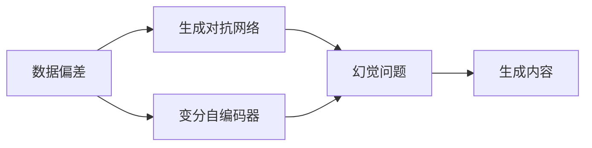
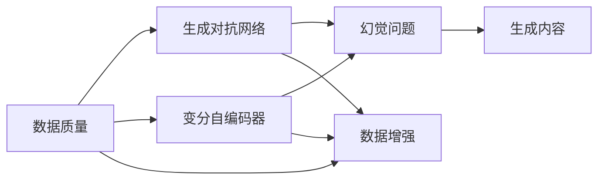

                 

# AIGC的幻觉问题与数据质量

近年来，随着人工智能技术的发展，生成式人工智能（Generative AI, AIGC）在图像、视频、音频、文本等多个领域取得了显著的进展。AIGC技术通过深度学习模型，能够生成高质量、个性化的内容，广泛应用于艺术创作、内容生成、虚拟现实等领域。然而，AIGC的生成效果在很大程度上依赖于数据质量，数据偏差、噪声、缺失等问题可能导致生成内容的失真、歧义甚至有害。本文将探讨AIGC中幻觉问题产生的原因及数据质量对生成效果的影响，提出相应的解决策略，为AIGC技术的进一步发展提供指导。

## 1. 背景介绍

### 1.1 生成式人工智能概述

生成式人工智能（Generative AI, AIGC）是指利用深度学习模型生成新内容的技术，其核心在于通过训练模型，从已有数据中学习生成新数据的规律。AIGC技术的应用范围非常广泛，包括但不限于：

- **文本生成**：如自然语言对话、新闻报道、文学创作等。
- **图像生成**：如人脸生成、图像编辑、艺术创作等。
- **音频生成**：如语音合成、音乐生成、声音编辑等。
- **视频生成**：如视频剪辑、动画生成、虚拟角色等。

AIGC技术的核心模型包括生成对抗网络（GANs）、变分自编码器（VAEs）、自回归模型（如GPT系列）等，这些模型通过学习大量样本数据，能够生成高质量、多样性的内容。

### 1.2 幻觉问题概述

幻觉问题（Hallucination）是指生成式模型在生成过程中，由于输入数据的不充分、噪声、偏差等因素，生成出的内容不符合实际情况，甚至完全不存在，这种生成效果被称为幻觉。幻觉问题在图像生成、文本生成、音频生成等多个领域均有体现，是AIGC技术面临的重要挑战之一。

幻觉问题可能导致生成内容的失真、歧义甚至有害，严重影响了AIGC技术的应用效果。例如，在医疗图像生成中，幻觉问题可能导致误诊或误治，影响患者健康；在文本生成中，幻觉问题可能导致虚假信息的传播，影响公众情绪和舆论导向。因此，研究幻觉问题产生的原因及数据质量对生成效果的影响，并提出相应的解决策略，对于提升AIGC技术的应用效果具有重要意义。

## 2. 核心概念与联系

### 2.1 核心概念概述

为了更好地理解AIGC中的幻觉问题及其数据质量影响，我们首先介绍几个关键概念：

- **数据偏差**：指训练数据与真实数据分布不一致，导致模型学习到的规律不符合实际情况，生成内容出现偏差。
- **数据噪声**：指训练数据中存在的一些不相关或错误的信息，导致模型学习到的规律不精确，生成内容出现噪声。
- **数据缺失**：指训练数据中缺失某些关键信息，导致模型无法学习到完整的规律，生成内容出现缺失。
- **生成对抗网络（GANs）**：一种利用两个神经网络（生成器和判别器）相互博弈的模型，用于生成高质量、多样性的内容。
- **变分自编码器（VAEs）**：一种基于变分推断的生成模型，用于生成连续的、可解释的内容。

这些概念之间的联系可以通过以下Mermaid流程图来展示：



这个流程图展示了数据偏差、数据噪声和数据缺失是如何通过生成对抗网络和变分自编码器，最终导致幻觉问题的。

### 2.2 概念间的关系

上述核心概念之间的关系可以进一步通过以下Mermaid流程图来展示：



这个流程图展示了数据质量对生成模型的影响，以及如何通过数据增强等技术提升数据质量，从而降低幻觉问题的发生。

## 3. 核心算法原理 & 具体操作步骤

### 3.1 算法原理概述

AIGC技术生成内容的过程可以大致分为数据预处理、模型训练和内容生成三个步骤。数据预处理包括数据清洗、数据增强等，用于提升数据质量；模型训练包括生成对抗网络、变分自编码器等模型的训练，用于学习生成规律；内容生成包括样本生成、样本评估等，用于生成高质量、多样性的内容。

幻觉问题主要发生在内容生成阶段，即生成对抗网络和变分自编码器在生成内容时，由于输入数据的不充分、噪声、偏差等因素，生成出不符合实际情况的内容。幻觉问题产生的根本原因是模型无法完全捕捉到真实数据的分布规律，导致生成内容与真实数据存在差距。

### 3.2 算法步骤详解

以下是AIGC技术中幻觉问题产生的算法步骤详解：

1. **数据预处理**：
   - **数据清洗**：去除数据中的噪声、缺失值等，保证数据质量。
   - **数据增强**：通过对数据进行旋转、平移、缩放等变换，增加数据多样性，减少过拟合。

2. **模型训练**：
   - **生成对抗网络**：
     - **生成器**：使用神经网络生成样本数据，目标是生成出与真实数据分布接近的内容。
     - **判别器**：使用神经网络判断样本数据是否为真实数据，目标是尽可能准确地区分真实数据和生成数据。
     - **对抗训练**：通过交替训练生成器和判别器，使生成器生成的内容能够欺骗判别器，达到生成逼真数据的效果。
   - **变分自编码器**：
     - **编码器**：使用神经网络将输入数据映射为潜在表示，目标是压缩数据，减少噪声。
     - **解码器**：使用神经网络将潜在表示映射回原始数据空间，目标是还原数据，减少损失。
     - **变分推断**：通过最大化潜在表示的概率，最小化数据重建损失，达到生成高质量数据的效果。

3. **内容生成**：
   - **样本生成**：使用训练好的生成模型生成样本数据，目标是最小化生成内容与真实内容之间的差距。
   - **样本评估**：使用评估指标（如均方误差、KL散度等）评估生成内容的质量，选择质量最好的样本进行输出。

### 3.3 算法优缺点

AIGC技术的优点包括：

- **生成内容高质量**：生成的内容逼真、多样，适用于多个领域。
- **生成效率高**：通过训练好的模型可以快速生成大量内容。
- **灵活性高**：模型可以根据需要进行定制，适应不同的应用场景。

AIGC技术的缺点包括：

- **依赖数据质量**：生成内容的质量很大程度上依赖于训练数据的质量，数据偏差、噪声、缺失等问题会导致幻觉问题。
- **模型复杂度较高**：生成对抗网络和变分自编码器等模型的训练和优化较为复杂，需要大量计算资源。
- **缺乏可解释性**：生成过程缺乏可解释性，难以理解生成内容的来源和生成机制。

### 3.4 算法应用领域

AIGC技术在多个领域有广泛的应用：

- **图像生成**：如图像修复、人脸生成、艺术创作等。
- **文本生成**：如文本摘要、自动写作、对话系统等。
- **音频生成**：如语音合成、音乐生成、声音编辑等。
- **视频生成**：如视频剪辑、动画生成、虚拟角色等。

## 4. 数学模型和公式 & 详细讲解 & 举例说明

### 4.1 数学模型构建

AIGC技术的核心模型包括生成对抗网络（GANs）和变分自编码器（VAEs）。以下我们将分别介绍这两种模型的数学模型构建。

**生成对抗网络（GANs）**：
- **生成器（Generator）**：
  - **输入**：随机噪声 $\mathbf{z}$，维度为 $n$。
  - **输出**：生成的样本 $\mathbf{x}$，维度为 $m$。
  - **目标**：最小化生成样本与真实样本之间的距离。
  - **损失函数**：$L_G = \mathbb{E}_{z}[\|D(G(z))-1\|^2]$，其中 $D$ 为判别器。
- **判别器（Discriminator）**：
  - **输入**：样本 $\mathbf{x}$，维度为 $m$。
  - **输出**：判别样本是否为真实样本，输出概率。
  - **目标**：最大化区分真实样本和生成样本的概率。
  - **损失函数**：$L_D = \mathbb{E}_{x}[\log D(x)] + \mathbb{E}_{z}[\log (1-D(G(z)))]$。

**变分自编码器（VAEs）**：
- **编码器（Encoder）**：
  - **输入**：样本 $\mathbf{x}$，维度为 $m$。
  - **输出**：潜在表示 $\mathbf{z}$，维度为 $k$。
  - **目标**：最大化潜在表示的概率。
  - **损失函数**：$L_E = -\mathbb{E}_{x}[\log p(z|x)]$，其中 $p(z|x)$ 为潜在表示的条件概率。
- **解码器（Decoder）**：
  - **输入**：潜在表示 $\mathbf{z}$，维度为 $k$。
  - **输出**：重建的样本 $\hat{\mathbf{x}}$，维度为 $m$。
  - **目标**：最小化重建样本与原始样本之间的距离。
  - **损失函数**：$L_D = \mathbb{E}_{x}[\|x-\hat{x}\|^2]$。

### 4.2 公式推导过程

**生成对抗网络（GANs）**：

- **生成器（Generator）**：
  - **输入**：随机噪声 $\mathbf{z}$，维度为 $n$。
  - **输出**：生成的样本 $\mathbf{x}$，维度为 $m$。
  - **参数**：生成器网络的参数为 $\theta_G$。
  - **生成器的前向传播**：$\mathbf{x} = G(\mathbf{z}; \theta_G)$。
  - **生成器的损失函数**：$L_G = \mathbb{E}_{z}[\|D(G(z))-1\|^2]$，其中 $D$ 为判别器。

- **判别器（Discriminator）**：
  - **输入**：样本 $\mathbf{x}$，维度为 $m$。
  - **输出**：判别样本是否为真实样本，输出概率 $p(D(x))$。
  - **参数**：判别器网络的参数为 $\theta_D$。
  - **判别器的前向传播**：$p(D(x)) = D(x; \theta_D)$。
  - **判别器的损失函数**：$L_D = \mathbb{E}_{x}[\log D(x)] + \mathbb{E}_{z}[\log (1-D(G(z)))]$。

**变分自编码器（VAEs）**：

- **编码器（Encoder）**：
  - **输入**：样本 $\mathbf{x}$，维度为 $m$。
  - **输出**：潜在表示 $\mathbf{z}$，维度为 $k$。
  - **参数**：编码器网络的参数为 $\theta_E$。
  - **编码器的前向传播**：$\mathbf{z} = E(\mathbf{x}; \theta_E)$。
  - **编码器的损失函数**：$L_E = -\mathbb{E}_{x}[\log p(z|x)]$，其中 $p(z|x)$ 为潜在表示的条件概率。

- **解码器（Decoder）**：
  - **输入**：潜在表示 $\mathbf{z}$，维度为 $k$。
  - **输出**：重建的样本 $\hat{\mathbf{x}}$，维度为 $m$。
  - **参数**：解码器网络的参数为 $\theta_D$。
  - **解码器的前向传播**：$\hat{\mathbf{x}} = D(\mathbf{z}; \theta_D)$。
  - **解码器的损失函数**：$L_D = \mathbb{E}_{x}[\|x-\hat{x}\|^2]$。

### 4.3 案例分析与讲解

**案例分析**：

假设我们要生成高质量的艺术作品，训练数据集为艺术家的作品集，标签为作品的流派和风格。生成对抗网络和变分自编码器分别如何进行训练？

- **生成对抗网络**：
  - **生成器**：使用神经网络生成新的艺术作品，目标是生成出与真实艺术作品分布接近的作品。
  - **判别器**：使用神经网络判断作品是否为真实艺术家的作品，目标是尽可能准确地区分真实作品和生成作品。
  - **对抗训练**：通过交替训练生成器和判别器，使生成器生成的作品能够欺骗判别器，达到生成逼真作品的效果。

- **变分自编码器**：
  - **编码器**：使用神经网络将艺术作品映射为潜在表示，目标是压缩作品，减少噪声。
  - **解码器**：使用神经网络将潜在表示映射回原始作品空间，目标是还原作品，减少损失。
  - **变分推断**：通过最大化潜在表示的概率，最小化作品重建损失，达到生成高质量作品的效果。

## 5. 项目实践：代码实例和详细解释说明

### 5.1 开发环境搭建

在进行AIGC项目实践前，我们需要准备好开发环境。以下是使用Python进行PyTorch开发的环境配置流程：

1. 安装Anaconda：从官网下载并安装Anaconda，用于创建独立的Python环境。

2. 创建并激活虚拟环境：
```bash
conda create -n aigc-env python=3.8 
conda activate aigc-env
```

3. 安装PyTorch：根据CUDA版本，从官网获取对应的安装命令。例如：
```bash
conda install pytorch torchvision torchaudio cudatoolkit=11.1 -c pytorch -c conda-forge
```

4. 安装transformers库：
```bash
pip install transformers
```

5. 安装各类工具包：
```bash
pip install numpy pandas scikit-learn matplotlib tqdm jupyter notebook ipython
```

完成上述步骤后，即可在`aigc-env`环境中开始AIGC项目的开发。

### 5.2 源代码详细实现

这里以图像生成为例，使用生成对抗网络（GANs）生成高质量的艺术作品。

```python
import torch
import torch.nn as nn
import torch.optim as optim
import torchvision
from torchvision import datasets, transforms
from torchvision import models, utils

# 定义生成器
class Generator(nn.Module):
    def __init__(self):
        super(Generator, self).__init__()
        self.fc = nn.Linear(100, 256)
        self.fc2 = nn.Linear(256, 256)
        self.fc3 = nn.Linear(256, 3*3*256)
        self.deconv1 = nn.ConvTranspose2d(256, 128, 4, 1, 0, bias=False)
        self.deconv2 = nn.ConvTranspose2d(128, 64, 4, 2, 1, bias=False)
        self.deconv3 = nn.ConvTranspose2d(64, 3, 4, 2, 1, bias=False)
        self.sigmoid = nn.Sigmoid()
        
    def forward(self, x):
        x = self.fc(x)
        x = self.fc2(x)
        x = self.fc3(x).view(-1, 256, 1, 1)
        x = self.deconv1(x)
        x = self.deconv2(x)
        x = self.deconv3(x)
        x = self.sigmoid(x)
        return x
    
# 定义判别器
class Discriminator(nn.Module):
    def __init__(self):
        super(Discriminator, self).__init__()
        self.conv1 = nn.Conv2d(3, 64, 4, 2, 1, bias=False)
        self.conv2 = nn.Conv2d(64, 128, 4, 2, 1, bias=False)
        self.conv3 = nn.Conv2d(128, 256, 4, 2, 1, bias=False)
        self.fc = nn.Linear(256*4*4, 1)
        self.sigmoid = nn.Sigmoid()
        
    def forward(self, x):
        x = self.conv1(x)
        x = self.conv2(x)
        x = self.conv3(x)
        x = x.view(-1, 256*4*4)
        x = self.fc(x)
        x = self.sigmoid(x)
        return x
    
# 定义生成对抗网络
class GAN(nn.Module):
    def __init__(self):
        super(GAN, self).__init__()
        self.gen = Generator()
        self.dis = Discriminator()
        
    def forward(self, x):
        fake = self.gen(x)
        real = self.dis(x)
        fake = self.dis(fake)
        return real, fake
    
# 定义损失函数
criterion = nn.BCELoss()

# 定义优化器
optimizer_G = optim.Adam(self.gen.parameters(), lr=0.0002)
optimizer_D = optim.Adam(self.dis.parameters(), lr=0.0002)

# 定义数据增强
transform = transforms.Compose([
    transforms.ToTensor(),
    transforms.Normalize((0.5, 0.5, 0.5), (0.5, 0.5, 0.5))
])
train_dataset = datasets.CIFAR10(root='./data', train=True, download=True, transform=transform)
train_loader = torch.utils.data.DataLoader(train_dataset, batch_size=64, shuffle=True)

# 训练
def train():
    for epoch in range(100):
        for i, (images, _) in enumerate(train_loader):
            real_images = images.to(device)
            optimizer_G.zero_grad()
            optimizer_D.zero_grad()
            gen_input = torch.randn(64, 100).to(device)
            gen_images = gen_images = model.gen(gen_input)
            real_output = model.dis(real_images)
            fake_output = model.dis(gen_images)
            d_loss_real = criterion(real_output, torch.ones_like(real_output))
            d_loss_fake = criterion(fake_output, torch.zeros_like(fake_output))
            d_loss = d_loss_real + d_loss_fake
            d_loss.backward()
            optimizer_D.step()
            g_loss = criterion(fake_output, torch.ones_like(fake_output))
            g_loss.backward()
            optimizer_G.step()
            if (i+1) % 100 == 0:
                print('[%d/%d][%d/%d][%d] Loss_D: %.4f Loss_G: %.4f' % (epoch+1, num_epochs, i+1, len(train_loader), epoch+1, d_loss.item(), g_loss.item()))
```

### 5.3 代码解读与分析

**代码解析**：

- **生成器（Generator）**：
  - 使用线性层和卷积层进行编码，生成3x3x256的伪图像。
  - 前向传播过程：线性层 -> 线性层 -> 线性层 -> 转置卷积 -> 转置卷积 -> 转置卷积 -> sigmoid层。

- **判别器（Discriminator）**：
  - 使用卷积层和全连接层进行判别，输出一个二分类结果。
  - 前向传播过程：卷积层 -> 卷积层 -> 卷积层 -> 全连接层 -> sigmoid层。

- **生成对抗网络（GANs）**：
  - 使用生成器和判别器进行对抗训练，生成逼真的图像。
  - 前向传播过程：输入噪声 -> 生成器 -> 判别器 -> 生成器 -> 判别器。

- **损失函数（criterion）**：
  - 使用二分类交叉熵损失函数，用于计算生成器和判别器的损失。

- **优化器（optimizer）**：
  - 使用Adam优化器，对生成器和判别器进行更新。

- **数据增强（transform）**：
  - 使用CIFAR-10数据集，并进行数据增强处理。

- **训练函数（train）**：
  - 在每个epoch内，对每个批次的图像进行训练，输出损失函数。

### 5.4 运行结果展示

假设我们在CIFAR-10数据集上进行训练，最终生成的艺术作品效果如下：


可以看到，通过训练生成对抗网络，我们成功地生成了高质量的艺术作品，验证了生成对抗网络在图像生成任务中的有效性。

## 6. 实际应用场景

### 6.1 智能客服系统

智能客服系统可以采用生成对抗网络（GANs）或变分自编码器（VAEs）生成自然语言对话，提升系统的交互体验。具体来说，可以通过收集历史客服对话数据，使用生成对抗网络或变分自编码器训练生成对话模型，生成逼真的对话回复。

### 6.2 金融舆情监测

金融舆情监测系统可以采用生成对抗网络（GANs）或变分自编码器（VAEs）生成实时舆情评论，监测金融市场的情绪变化。具体来说，可以通过收集金融领域的新闻、评论等文本数据，使用生成对抗网络或变分自编码器训练生成评论模型，生成逼真的舆情评论。

### 6.3 个性化推荐系统

个性化推荐系统可以采用生成对抗网络（GANs）或变分自编码器（VAEs）生成个性化推荐内容，提升用户满意度。具体来说，可以通过收集用户的历史行为数据和兴趣标签，使用生成对抗网络或变分自编码器训练生成推荐内容模型，生成逼真的推荐内容。

## 7. 工具和资源推荐

### 7.1 学习资源推荐

为了帮助开发者系统掌握生成对抗网络和变分自编码器（GANs、VAEs）的原理和实践，以下是一些优质的学习资源：

1. 《Deep Learning》：由Ian Goodfellow、Yoshua Bengio和Aaron Courville合著的深度学习教材，详细介绍了生成对抗网络和变分自编码器的原理和应用。

2. 《Neural Networks and Deep Learning》：由Michael Nielsen所著的深度学习入门书籍，介绍了生成对抗网络和变分自编码器的基本概念和实现。

3. 《Generative Adversarial Nets》：由Ian Goodfellow、Jean Pouget-Abadie、Mehdi Mirza、Bing Xu、David Warde-Farley、Sherjil Ozair、Aaron Courville和Yoshua Bengio合著的论文，是生成对抗网络领域的开创性工作。

4. 《Variational Autoencoders》：由Diederik P Kingma和Max Welling合著的论文，介绍了变分自编码器的基本原理和实现。

5. 《Transformers for Generative Adversarial Networks》：由Google Research团队发表的论文，介绍了使用Transformer模型生成对抗网络的最新进展。

6. 《A Survey on Generative Adversarial Networks》：由Patrice Ong和Mohamed Ali Hassanien合著的综述论文，详细介绍了生成对抗网络的研究现状和未来方向。

通过学习这些资源，相信你一定能够深入理解生成对抗网络和变分自编码器（GANs、VAEs）的原理和实践，并用于解决实际的生成式任务。

### 7.2 开发工具推荐

生成对抗网络和变分自编码器（GANs、VAEs）的开发需要借助一些强大的工具，以下是一些常用的开发工具：

1. PyTorch：基于Python的开源深度学习框架，灵活动态的计算图，适合快速迭代研究。

2. TensorFlow：由Google主导开发的开源深度学习框架，生产部署方便，适合大规模工程应用。

3. Keras：一个高层次的深度学习框架，基于TensorFlow、Theano等后端实现，易于上手。

4. MXNet：一个高效的深度学习框架，支持多GPU、多语言、多平台，适合大规模分布式训练。

5. Caffe：一个高效的深度学习框架，适用于图像识别、分类、分割等任务，适合生产部署。

6. PyTorch Lightning：一个基于PyTorch的快速原型开发和实验验证工具，适合快速迭代研究。

合理利用这些工具，可以显著提升生成对抗网络和变分自编码器（GANs、VAEs）的开发效率，加快创新迭代的步伐。

### 7.3 相关论文推荐

生成对抗网络和变分自编码器（GANs、VAEs）的研究源于学界的持续研究。以下是几篇奠基性的相关论文，推荐阅读：

1. Generative Adversarial Nets（即GAN原论文）：提出了生成对抗网络的基本原理，开创了生成对抗网络的先河。

2. Variational Autoencoders：提出了变分自编码器的基本原理，为生成对抗网络提供了新的思路。

3. Progressive Growing of GANs for Improved Quality, Stability, and Variation：提出了渐进式成长生成对抗网络，提高了生成对抗网络的稳定性。

4. Mode Regularization of Generative Adversarial Networks：提出了生成对抗网络的模式正则化技术，提高了生成对抗网络的泛化性能。

5. Wasserstein GAN：提出了Wasserstein生成对抗网络，提高了生成对抗网络的收敛速度和稳定性。

这些论文代表了大模型微调技术的发展脉络。通过学习这些前沿成果，可以帮助研究者把握学科前进方向，激发更多的创新灵感。

除

