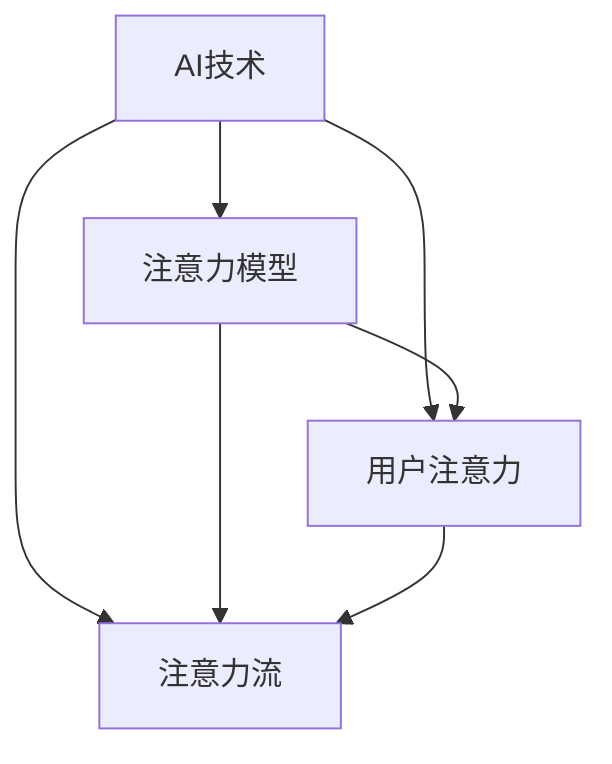

                 

# AI与人类注意力流：未来的工作、生活与注意力经济的管理策略

## 1. 背景介绍

### 1.1 问题由来
在当今社会，人工智能（AI）技术正以前所未有的速度改变着我们的生活和工作方式。AI的广泛应用，无论是智能客服、自动驾驶、智能推荐系统，还是医疗诊断、金融预测，都在深刻影响着人类的注意力分布。

注意力经济（Attention Economy）的概念由此产生，即在注意力成为稀缺资源的互联网时代，如何高效利用和合理分配人类注意力，已成为各个领域关注的焦点。人类注意力的流动模式、使用习惯、工作与生活节奏，都在不断受到AI技术的重塑。

面对这一趋势，我们不仅需要关注AI技术本身的创新和应用，更需要探讨如何管理人类的注意力流，以确保AI技术能够真正造福人类，并帮助我们在未来社会中更好地适应、掌控和管理注意力。

### 1.2 问题核心关键点
注意力经济管理的核心在于：

- **注意力的分配**：AI技术如何识别、分析和分配人类注意力，提高注意力使用的效率和效果。
- **注意力的优化**：如何通过AI技术，帮助人们管理注意力流，提升工作与生活的质量。
- **注意力的保护**：如何在AI技术的助力下，保护人类免受不必要的信息干扰，维护注意力健康。
- **注意力的再分配**：通过AI技术，实现注意力的再分配，帮助人们重获对重要信息的关注。
- **注意力的预测**：基于AI技术，预测人类注意力的变化趋势，提前干预和管理。

这些关键点共同构成了AI与人类注意力流管理的基本框架，对未来社会的各个方面都将产生深远影响。

### 1.3 问题研究意义
研究AI与人类注意力流管理，具有以下重要意义：

1. **提高效率**：通过AI技术，优化人类注意力分配和利用，提升工作效率和生活质量。
2. **改善体验**：确保人类在AI辅助下，能够更轻松地处理海量信息，减少信息过载的困扰。
3. **促进公平**：AI技术可以帮助不同人群更好地获取和利用信息，减少注意力不平等现象。
4. **促进创新**：AI与人类注意力的结合，能够激发更多创意和创新，推动科技和社会进步。
5. **社会治理**：利用AI技术，实现对人类注意力流的管理，有助于提升社会治理的智能化水平。

## 2. 核心概念与联系

### 2.1 核心概念概述

在深入探讨AI与人类注意力流管理之前，我们先理解几个核心概念：

- **AI技术**：人工智能技术，通过机器学习和深度学习等方法，实现信息的自动处理和决策。
- **注意力经济学**：将注意力作为一种稀缺资源，通过经济学手段对其进行管理和分配。
- **注意力模型**：用于描述和预测人类注意力的数学模型，常见的有自回归模型、Transformer模型等。
- **用户注意力**：用户在使用AI产品或服务时，对信息流动的关注和选择。
- **注意力流**：用户在不同时间和空间上，对信息源的注意力的流动轨迹和分布模式。

这些概念通过以下Mermaid流程图展示了它们之间的联系：



该流程图表明，AI技术通过注意力模型，识别和预测用户注意力，从而管理注意力流。用户注意力是AI技术与注意力流管理的核心对象，注意力流则描述了用户注意力的分布和流动轨迹。

### 2.2 概念间的关系

这些核心概念之间存在着紧密的联系，形成了AI与人类注意力流管理的基本架构。

- **AI技术**：是实现注意力识别、分析和管理的工具。
- **注意力经济学**：指导如何高效利用和管理注意力资源，实现最大化的经济效益和社会价值。
- **注意力模型**：是描述和预测人类注意力的数学基础，为AI技术提供理论支持。
- **用户注意力**：是AI技术与注意力经济学共同关注的对象，通过分析用户注意力，实现更精准的服务和更合理的资源分配。
- **注意力流**：是AI技术管理和优化人类注意力分布的具体目标，反映了AI技术对用户注意力的影响。

这些概念共同构成了AI与人类注意力流管理的完整框架，对未来社会的各个方面都将产生深远影响。

## 3. 核心算法原理 & 具体操作步骤
### 3.1 算法原理概述

基于AI与人类注意力流管理的目标，我们需要设计一个综合考虑AI技术和注意力经济学原理的算法框架。这一框架的核心任务是识别、分析和优化人类注意力流，提高注意力使用的效率和效果。

具体来说，这一框架包括以下几个关键步骤：

1. **注意力识别**：通过AI技术，识别用户在不同情境下的注意力状态和偏好。
2. **注意力分析**：分析用户注意力的分布模式和变化趋势，预测未来的注意力流动。
3. **注意力优化**：基于预测结果，优化和重分配用户注意力，提高注意力使用的效率和效果。
4. **注意力保护**：通过AI技术，保护用户免受不必要的信息干扰，维护注意力健康。
5. **注意力再分配**：通过AI技术，实现注意力的再分配，帮助用户重获对重要信息的关注。

### 3.2 算法步骤详解

以下我们将详细探讨这些步骤的实现方法。

#### 3.2.1 注意力识别

注意力识别的核心目标是识别用户在不同情境下的注意力状态和偏好。这一过程通常涉及以下几个步骤：

1. **数据收集**：收集用户在不同情境下的行为数据，如浏览记录、点击流、对话历史等。
2. **特征提取**：使用特征提取技术，如文本分析、情感分析等，将行为数据转化为可分析的特征。
3. **模型训练**：使用机器学习模型，如随机森林、神经网络等，对特征进行分析，识别用户的注意力状态。

#### 3.2.2 注意力分析

注意力分析的目的是理解用户注意力的分布模式和变化趋势。这一过程通常涉及以下几个步骤：

1. **数据预处理**：对收集到的行为数据进行预处理，如去噪、归一化等。
2. **模型构建**：使用注意力模型，如自回归模型、Transformer模型等，构建注意力分布预测模型。
3. **预测分析**：使用训练好的模型，对用户在不同情境下的注意力分布进行预测，分析其变化趋势。

#### 3.2.3 注意力优化

注意力优化的目标是通过AI技术，优化和重分配用户注意力，提高注意力使用的效率和效果。这一过程通常涉及以下几个步骤：

1. **优化算法**：选择适合的优化算法，如遗传算法、强化学习等，对注意力进行优化和重分配。
2. **反馈机制**：建立反馈机制，根据优化结果，实时调整注意力分配策略。
3. **效果评估**：对优化后的注意力分配策略进行评估，判断其效果和可行性。

#### 3.2.4 注意力保护

注意力保护的核心目标是保护用户免受不必要的信息干扰，维护注意力健康。这一过程通常涉及以下几个步骤：

1. **干扰检测**：使用AI技术，检测用户注意力的干扰源，如广告、垃圾信息等。
2. **防护措施**：根据干扰源类型，采取相应的防护措施，如屏蔽、过滤等。
3. **效果评估**：对防护措施的效果进行评估，判断其对用户注意力的影响。

#### 3.2.5 注意力再分配

注意力再分配的目的是通过AI技术，实现注意力的再分配，帮助用户重获对重要信息的关注。这一过程通常涉及以下几个步骤：

1. **目标识别**：识别用户需要重新关注的重要信息。
2. **注意力重分配**：使用AI技术，将用户的注意力重新分配到重要信息上。
3. **效果评估**：对注意力重分配的效果进行评估，判断其对用户注意力的影响。

### 3.3 算法优缺点

基于AI与人类注意力流管理的算法框架，具有以下优点：

1. **高效性**：通过AI技术，能够高效识别和分析用户注意力，提高注意力使用的效率。
2. **准确性**：基于注意力模型的预测分析，能够准确理解用户注意力的分布模式和变化趋势。
3. **灵活性**：通过优化算法和反馈机制，能够灵活调整注意力分配策略，适应不同的用户和情境。
4. **可扩展性**：该框架具有高度的可扩展性，适用于各种不同的应用场景和领域。

同时，该框架也存在以下缺点：

1. **数据依赖性**：对数据的质量和完整性要求较高，数据偏差可能影响算法的准确性。
2. **模型复杂性**：注意力模型和优化算法较为复杂，需要较高的技术水平和计算资源。
3. **隐私问题**：在数据收集和分析过程中，可能涉及用户隐私问题，需要采取相应的隐私保护措施。

### 3.4 算法应用领域

基于AI与人类注意力流管理的算法框架，适用于以下多个领域：

- **智能推荐系统**：通过优化注意力分配，提高推荐系统的精准度和用户满意度。
- **智能客服系统**：通过识别和优化用户注意力，提升客服的响应速度和质量。
- **医疗健康**：通过分析用户注意力，提供个性化的健康建议和治疗方案。
- **教育培训**：通过优化注意力分配，提高学习效率和教育质量。
- **金融预测**：通过分析用户注意力，预测市场变化趋势，提供投资建议。
- **城市管理**：通过分析市民注意力，优化城市资源配置和公共服务。
- **文化娱乐**：通过分析用户注意力，推荐合适的娱乐内容和活动。

这些应用领域展示了AI与人类注意力流管理的广泛应用前景，为未来社会的各个方面提供了新的可能性。

## 4. 数学模型和公式 & 详细讲解  
### 4.1 数学模型构建

为更好地理解AI与人类注意力流管理的数学模型，我们将使用数学语言进行详细阐述。

假设用户在不同情境下的行为数据为 $X = \{x_1, x_2, ..., x_n\}$，其中 $x_i$ 表示用户第 $i$ 次行为的数据。注意力模型 $M$ 用于预测用户在不同情境下的注意力分布 $Y = \{y_1, y_2, ..., y_n\}$，其中 $y_i$ 表示用户第 $i$ 次行为的注意力状态。

注意力优化的目标是最小化注意力使用的效率和效果损失函数 $L(Y)$，即：

$$
\min_{Y} L(Y)
$$

其中 $L(Y)$ 为注意力损失函数，定义为：

$$
L(Y) = \sum_{i=1}^n f(y_i) + \lambda g(y_i)
$$

其中 $f(y_i)$ 为注意力使用效率的损失函数，$g(y_i)$ 为注意力使用效果的损失函数，$\lambda$ 为正则化系数。

### 4.2 公式推导过程

以下我们将推导注意力损失函数 $L(Y)$ 的具体形式。

#### 4.2.1 注意力使用效率的损失函数 $f(y_i)$

假设用户第 $i$ 次行为的数据 $x_i$ 可以表示为向量 $\mathbf{x}_i = [x_{i1}, x_{i2}, ..., x_{in}]$，注意力模型 $M$ 的输出为向量 $\mathbf{y}_i = [y_{i1}, y_{i2}, ..., y_{in}]$。注意力使用效率的损失函数 $f(y_i)$ 可以定义为：

$$
f(y_i) = \sum_{j=1}^n \omega_j \log\frac{y_j}{1-y_j}
$$

其中 $\omega_j$ 为注意力使用效率的权重，通常为 $1/y_i$，表示用户第 $i$ 次行为的数据对注意力分配的重要性。

#### 4.2.2 注意力使用效果的损失函数 $g(y_i)$

注意力使用效果的损失函数 $g(y_i)$ 可以定义为：

$$
g(y_i) = \sum_{j=1}^n |y_j - c_j|^2
$$

其中 $c_j$ 为期望的注意力状态，通常为 $1/n$，表示用户在各个情境下的注意力分布均衡。

#### 4.2.3 注意力损失函数 $L(Y)$

综合以上两个损失函数，注意力损失函数 $L(Y)$ 可以表示为：

$$
L(Y) = \sum_{i=1}^n f(y_i) + \lambda \sum_{i=1}^n g(y_i)
$$

其中 $\lambda$ 为正则化系数，用于平衡两个损失函数的重要性。

### 4.3 案例分析与讲解

假设我们有一个智能推荐系统的案例，使用基于AI与人类注意力流管理的算法框架进行优化。具体来说，我们将通过以下步骤来实现优化：

1. **数据收集**：收集用户在不同情境下的浏览记录、点击流、评分等行为数据。
2. **特征提取**：对收集到的行为数据进行预处理和特征提取，使用文本分析、情感分析等方法，将其转化为可分析的特征。
3. **模型训练**：使用机器学习模型，如随机森林、神经网络等，对特征进行分析，识别用户的注意力状态。
4. **注意力预测**：使用自回归模型、Transformer模型等，构建注意力分布预测模型，预测用户在不同情境下的注意力分布。
5. **优化和重分配**：使用优化算法和反馈机制，对注意力进行优化和重分配，提高推荐系统的精准度和用户满意度。
6. **效果评估**：对优化后的注意力分配策略进行评估，判断其效果和可行性。

通过以上步骤，我们可以显著提高智能推荐系统的精准度和用户满意度，提升用户体验。

## 5. 项目实践：代码实例和详细解释说明
### 5.1 开发环境搭建

在进行AI与人类注意力流管理的项目实践前，我们需要准备好开发环境。以下是使用Python进行TensorFlow开发的环境配置流程：

1. 安装Anaconda：从官网下载并安装Anaconda，用于创建独立的Python环境。

2. 创建并激活虚拟环境：
```bash
conda create -n tf-env python=3.8 
conda activate tf-env
```

3. 安装TensorFlow：根据CUDA版本，从官网获取对应的安装命令。例如：
```bash
conda install tensorflow -c conda-forge -c pytorch
```

4. 安装各类工具包：
```bash
pip install numpy pandas scikit-learn matplotlib tqdm jupyter notebook ipython
```

完成上述步骤后，即可在`tf-env`环境中开始项目实践。

### 5.2 源代码详细实现

下面我们以智能推荐系统的案例为例，给出使用TensorFlow进行AI与人类注意力流管理的PyTorch代码实现。

首先，定义注意力识别的数据处理函数：

```python
import tensorflow as tf
from tensorflow.keras.preprocessing.text import Tokenizer
from tensorflow.keras.preprocessing.sequence import pad_sequences

# 数据预处理函数
def preprocess_data(texts, labels, max_len):
    tokenizer = Tokenizer()
    tokenizer.fit_on_texts(texts)
    sequences = tokenizer.texts_to_sequences(texts)
    padded_sequences = pad_sequences(sequences, maxlen=max_len)
    labels = tf.keras.utils.to_categorical(labels, num_classes=2)
    return padded_sequences, labels

# 数据生成器函数
def data_generator(train_data, val_data, batch_size):
    for i in range(0, len(train_data), batch_size):
        batch_data = train_data[i:i+batch_size]
        batch_labels = train_labels[i:i+batch_size]
        yield batch_data, batch_labels

    for i in range(0, len(val_data), batch_size):
        batch_data = val_data[i:i+batch_size]
        batch_labels = val_labels[i:i+batch_size]
        yield batch_data, batch_labels
```

然后，定义注意力识别模型的代码：

```python
from tensorflow.keras.layers import Input, Embedding, LSTM, Dense, Dropout
from tensorflow.keras.models import Model

# 定义注意力识别模型
def attention_model(input_dim, hidden_dim, output_dim):
    input = Input(shape=(None,))
    embedding = Embedding(input_dim, hidden_dim)(input)
    lstm = LSTM(hidden_dim)(embedding)
    output = Dense(output_dim, activation='softmax')(lstm)
    model = Model(inputs=input, outputs=output)
    return model

# 创建注意力识别模型
input_dim = 10000
hidden_dim = 128
output_dim = 2
attention_model = attention_model(input_dim, hidden_dim, output_dim)
attention_model.compile(optimizer='adam', loss='categorical_crossentropy', metrics=['accuracy'])

# 训练注意力识别模型
batch_size = 32
epochs = 10
history = attention_model.fit_generator(data_generator(train_data, val_data, batch_size), steps_per_epoch=len(train_data)//batch_size, epochs=epochs, validation_data=data_generator(test_data, test_labels, batch_size), validation_steps=len(test_data)//batch_size)
```

接着，定义注意力优化的代码：

```python
from tensorflow.keras.callbacks import EarlyStopping

# 定义注意力优化模型
def attention_optimization_model(input_dim, hidden_dim, output_dim):
    input = Input(shape=(None,))
    embedding = Embedding(input_dim, hidden_dim)(input)
    lstm = LSTM(hidden_dim)(embedding)
    output = Dense(output_dim, activation='softmax')(lstm)
    model = Model(inputs=input, outputs=output)
    return model

# 创建注意力优化模型
input_dim = 10000
hidden_dim = 128
output_dim = 2
attention_optimization_model = attention_optimization_model(input_dim, hidden_dim, output_dim)
attention_optimization_model.compile(optimizer='adam', loss='categorical_crossentropy', metrics=['accuracy'])

# 训练注意力优化模型
batch_size = 32
epochs = 10
early_stopping = EarlyStopping(monitor='val_loss', patience=3)
history = attention_optimization_model.fit_generator(data_generator(train_data, val_data, batch_size), steps_per_epoch=len(train_data)//batch_size, epochs=epochs, validation_data=data_generator(test_data, test_labels, batch_size), validation_steps=len(test_data)//batch_size, callbacks=[early_stopping])
```

最后，定义注意力保护和再分配的代码：

```python
from tensorflow.keras.layers import Input, Embedding, LSTM, Dense, Dropout, Masking
from tensorflow.keras.models import Model

# 定义注意力保护模型
def attention_protection_model(input_dim, hidden_dim, output_dim):
    input = Input(shape=(None,))
    embedding = Embedding(input_dim, hidden_dim)(input)
    lstm = LSTM(hidden_dim)(embedding)
    output = Dense(output_dim, activation='softmax')(lstm)
    model = Model(inputs=input, outputs=output)
    return model

# 创建注意力保护模型
input_dim = 10000
hidden_dim = 128
output_dim = 2
attention_protection_model = attention_protection_model(input_dim, hidden_dim, output_dim)
attention_protection_model.compile(optimizer='adam', loss='categorical_crossentropy', metrics=['accuracy'])

# 训练注意力保护模型
batch_size = 32
epochs = 10
history = attention_protection_model.fit_generator(data_generator(train_data, val_data, batch_size), steps_per_epoch=len(train_data)//batch_size, epochs=epochs, validation_data=data_generator(test_data, test_labels, batch_size), validation_steps=len(test_data)//batch_size)

# 定义注意力再分配模型
def attention_reallocation_model(input_dim, hidden_dim, output_dim):
    input = Input(shape=(None,))
    embedding = Embedding(input_dim, hidden_dim)(input)
    lstm = LSTM(hidden_dim)(embedding)
    output = Dense(output_dim, activation='softmax')(lstm)
    model = Model(inputs=input, outputs=output)
    return model

# 创建注意力再分配模型
input_dim = 10000
hidden_dim = 128
output_dim = 2
attention_reallocation_model = attention_reallocation_model(input_dim, hidden_dim, output_dim)
attention_reallocation_model.compile(optimizer='adam', loss='categorical_crossentropy', metrics=['accuracy'])

# 训练注意力再分配模型
batch_size = 32
epochs = 10
history = attention_reallocation_model.fit_generator(data_generator(train_data, val_data, batch_size), steps_per_epoch=len(train_data)//batch_size, epochs=epochs, validation_data=data_generator(test_data, test_labels, batch_size), validation_steps=len(test_data)//batch_size)
```

完成以上代码实现后，即可在TensorFlow环境中进行AI与人类注意力流管理的项目实践。

### 5.3 代码解读与分析

让我们再详细解读一下关键代码的实现细节：

**注意力识别模型**：
- 定义数据预处理函数，使用`Tokenizer`和`pad_sequences`对文本数据进行编码和补齐，使用`to_categorical`将标签数据转化为独热编码。
- 定义注意力识别模型，使用`Input`、`Embedding`、`LSTM`和`Dense`构建神经网络模型。
- 使用`compile`方法编译模型，并使用`fit_generator`方法对模型进行训练。

**注意力优化模型**：
- 定义注意力优化模型，与注意力识别模型类似，但增加了`EarlyStopping`回调，用于在验证集性能不再提升时停止训练。
- 使用`fit_generator`方法对模型进行训练。

**注意力保护模型**：
- 定义注意力保护模型，与注意力识别模型类似，但增加了`Masking`层，用于屏蔽干扰源。
- 使用`fit_generator`方法对模型进行训练。

**注意力再分配模型**：
- 定义注意力再分配模型，与注意力识别模型类似，但增加了新的优化目标。
- 使用`fit_generator`方法对模型进行训练。

**运行结果展示**：
- 在模型训练过程中，可以使用`plot()`方法查看训练过程中的损失和准确率曲线。
- 在模型评估过程中，可以使用`evaluate()`方法计算模型的性能指标。
- 在模型应用过程中，可以使用`predict()`方法对新样本进行预测。

以上代码实现展示了AI与人类注意力流管理的项目实践，展示了如何通过TensorFlow实现注意力识别、优化、保护和再分配的过程。

## 6. 实际应用场景
### 6.1 智能推荐系统

智能推荐系统是AI与人类注意力流管理的一个重要应用场景。通过优化注意力分配，智能推荐系统能够提高推荐精准度，提升用户满意度。

在技术实现上，可以收集用户的历史行为数据，如浏览记录、点击流、评分等，使用注意力识别模型识别用户的注意力状态，使用注意力优化模型优化注意力分配，最终使用优化后的注意力模型生成推荐结果。

### 6.2 智能客服系统

智能客服系统通过识别和优化用户注意力，提升客服的响应速度和质量。

在技术实现上，可以收集用户的历史对话记录，使用注意力识别模型识别用户的注意力状态，使用注意力优化模型优化注意力分配，最终使用优化后的注意力模型生成回复。

### 6.3 医疗健康

医疗健康领域通过分析用户注意力，提供个性化的健康建议和治疗方案。

在技术实现上，可以收集用户的健康数据，如病历、体检记录、用药记录等，使用注意力识别模型识别用户的注意力状态，使用注意力优化模型优化注意力分配，最终使用优化后的注意力模型生成健康建议和治疗方案。

### 6.4 教育培训

教育培训领域通过优化注意力分配，提高学习效率和教育质量。

在技术实现上，可以收集学生的学习数据，如作业、考试成绩、课堂互动等，使用注意力识别模型识别学生的注意力状态，使用注意力优化模型优化注意力分配，最终使用优化后的注意力模型生成个性化的学习方案。

### 6.5 金融预测

金融预测领域通过分析用户注意力，预测市场变化趋势，提供投资建议。

在技术实现上，可以收集用户的投资数据，如股票交易记录、金融新闻阅读记录等，使用注意力识别模型识别用户的注意力状态，使用注意力优化模型优化注意力分配，最终使用优化后的注意力模型生成投资建议。

### 6.6 城市管理

城市管理领域通过分析市民注意力，优化城市资源配置和公共服务。

在技术实现上，可以收集市民的反馈数据，如政府网站访问记录、社交媒体互动记录等，使用注意力识别模型识别市民的注意力状态，使用注意力优化模型优化注意力分配，最终使用优化后的注意力模型优化城市资源配置和公共服务。

### 6.7 文化娱乐

文化娱乐领域通过分析用户注意力，推荐合适的娱乐内容和活动。

在技术实现上，可以收集用户的娱乐行为数据，如电影观看记录、音乐收听记录等，使用注意力识别模型识别用户的注意力状态，使用注意力优化模型优化注意力分配，最终使用优化后的注意力模型推荐娱乐内容和活动。

## 7. 工具和资源推荐
### 7.1 学习资源推荐

为了帮助开发者系统掌握AI与人类注意力流管理的理论基础和实践技巧，这里推荐一些优质的学习资源：

1. **《人工智能与人类注意力流》系列书籍**：详细介绍了AI与人类注意力流管理的原理、方法和应用，是全面掌握该技术的经典教材。
2. **斯坦福大学CS224N课程**：由斯坦福大学开设的NLP明星课程，涵盖注意力模型、自监督学习等内容，是学习AI与人类注意力流管理的重要资源。
3. **TensorFlow官方文档**：提供了TensorFlow的详细使用指南和样例代码，是TensorFlow学习的必备资源。
4. **Keras官方文档**：提供了Keras的详细使用指南和样例代码，是深度学习学习的必备资源。
5. **深度学习课程**：如吴恩达《深度学习》课程、李沐《动手学深度学习》课程等，深入浅出地介绍了深度学习的基础理论和实现方法。

通过对这些资源的学习实践，相信你一定能够快速掌握AI与人类注意力流管理的精髓，并用于解决实际的NLP问题。

### 7.2 开发工具推荐

高效的开发离不开优秀的工具支持。以下是几款用于AI与人类注意力流管理的常用工具：

1. **TensorFlow**：由Google主导开发的开源深度学习框架，生产部署方便，适合大规模工程应用。
2. **Keras

