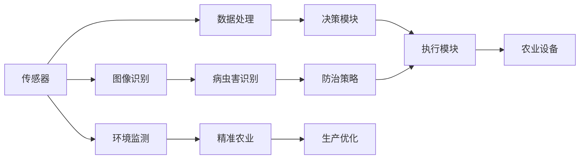
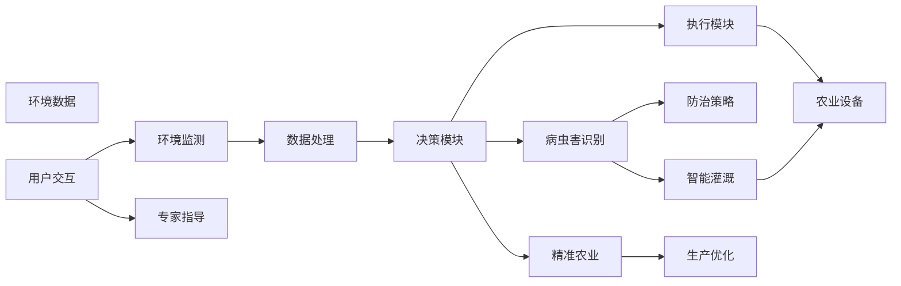

                 

## 1. 背景介绍

### 1.1 问题由来

近年来，农业自动化和智能化的步伐显著加快，AI技术在农业中的应用日益广泛。传统的农业生产和管理模式主要依赖人工经验和简单的自动化设备，效率低、成本高、环境影响大。而AI技术，特别是基于深度学习的智能体(Agent)，正在逐渐改变这一现状。

智能体在农业中的应用主要集中在以下几个方面：
- 精准农业：通过传感器数据和机器学习算法，实现对农田环境的实时监测和精准管理。
- 作物生长预测：利用历史数据和预测模型，优化作物生长过程，提高产量和品质。
- 病虫害防治：通过图像识别和分类算法，及时发现和处理农田中的病虫害问题。
- 农业机器人：自主导航和作业的农业机器人，可以大幅提高作业效率和精准度。
- 智能灌溉：基于土壤湿度和气候数据的智能灌溉系统，实现精准灌溉。

这些应用场景展示了AI在农业中的巨大潜力，为实现可持续农业发展提供了新的解决方案。

### 1.2 问题核心关键点

智能体在农业中的应用，涉及农业生产中的多个环节，包括环境监测、作物生长、病虫害防治等。AI技术在这里承担着数据收集、分析、决策和执行等多个角色，是一个多智能体协作的复杂系统。

智能体在农业中需要具备以下特点：
- **感知能力**：能够实时收集和感知农田环境的数据，如温度、湿度、光照、土壤成分等。
- **决策能力**：基于感知数据和预设规则，能够自主做出合理的决策。
- **执行能力**：能够控制农业机器人、灌溉系统等设备，执行具体的农业操作。
- **交互能力**：能够与农业专家、用户等进行有效的沟通，获取指导和反馈。

这些特点使得智能体在农业中成为不可或缺的关键组件。

### 1.3 问题研究意义

智能体在农业中的应用，对于提升农业生产效率、减少环境污染、实现可持续农业发展具有重要意义。具体来说：
- **提高效率**：通过自动化和智能化，减少人力投入，降低生产成本。
- **优化管理**：实时监测和分析农田环境，实现精准管理，提高作物产量和品质。
- **保护环境**：减少化肥和农药的过度使用，降低对环境的影响。
- **应对气候变化**：通过智能决策，适应气候变化，提高农业的抗风险能力。

通过AI技术，特别是智能体的应用，我们有望构建一个更加高效、环保、智能的农业系统。

## 2. 核心概念与联系

### 2.1 核心概念概述

在农业中，智能体是一个具备感知、决策、执行和交互能力的多智能体系统。其核心概念包括以下几个方面：

- **感知模块**：用于实时收集和处理农田环境数据，如传感器数据、图像数据等。
- **决策模块**：基于感知数据和预设规则，自主做出决策。
- **执行模块**：控制农业机器人、灌溉系统等设备，执行具体的农业操作。
- **交互模块**：与农业专家、用户等进行沟通，获取指导和反馈。

这些模块通过统一的架构设计和协同工作，构成了一个完整的智能体系统。

### 2.2 概念间的关系

智能体在农业中的应用，涉及多个智能体之间的协作，其关系可以通过以下Mermaid流程图来展示：



这个流程图展示了智能体在农业中的主要工作流程：
1. 传感器收集环境数据，数据处理模块对数据进行处理。
2. 决策模块基于处理后的数据，自主做出决策。
3. 执行模块控制农业设备执行具体的农业操作。
4. 交互模块与农业专家和用户进行沟通，获取指导和反馈。

这些模块之间的协作，构成了智能体在农业中的应用框架。

### 2.3 核心概念的整体架构

最后，我们用一个综合的流程图来展示智能体在农业中的应用架构：



这个流程图展示了智能体在农业中的完整工作流程，从环境监测、数据处理、决策、执行到用户交互和专家指导，各模块协同工作，共同实现农业的智能化管理。

## 3. 核心算法原理 & 具体操作步骤

### 3.1 算法原理概述

基于深度学习的智能体在农业中的应用，主要基于以下算法原理：
- **感知模块**：通常使用传感器数据、图像数据等作为输入，通过深度学习模型进行特征提取和处理。
- **决策模块**：基于感知数据，使用强化学习、决策树、深度学习等算法进行决策。
- **执行模块**：使用控制理论、机器人学等技术，实现对农业设备的控制和执行。
- **交互模块**：通常使用自然语言处理技术，实现与用户和专家的交互。

智能体的核心算法包括：
- **深度学习**：用于感知模块的数据处理和特征提取。
- **强化学习**：用于决策模块的决策制定。
- **控制理论**：用于执行模块的机器人控制。
- **自然语言处理(NLP)**：用于交互模块的沟通和反馈获取。

### 3.2 算法步骤详解

智能体在农业中的应用，通常包括以下几个关键步骤：

**Step 1: 数据收集与预处理**
- 部署传感器和摄像头，收集农田环境数据。
- 使用数据采集系统，对收集到的数据进行初步处理，如去噪、归一化等。

**Step 2: 深度学习模型训练**
- 使用历史数据和深度学习模型，对感知数据进行特征提取和处理。
- 通过标注数据和监督学习算法，对模型进行训练。

**Step 3: 决策模块设计**
- 根据农业生产需求，设计决策规则和模型。
- 使用强化学习算法，训练决策模型，实现最优决策。

**Step 4: 控制策略制定**
- 基于决策结果，制定控制策略。
- 使用控制理论，实现对农业设备的控制。

**Step 5: 用户交互与反馈**
- 设计用户界面，实现与用户的交互。
- 获取用户的反馈，不断优化智能体的决策和执行。

**Step 6: 系统集成与部署**
- 将各模块集成到一个系统中，进行全面的测试和调试。
- 在农田中实际部署智能体系统，进行实时监测和反馈。

### 3.3 算法优缺点

智能体在农业中的应用，具有以下优点：
- **高效性**：自动化和智能化的作业方式，提高了农业生产的效率。
- **精确性**：基于深度学习和强化学习的决策，提高了农业管理的精确度。
- **灵活性**：可根据不同环境和需求，灵活调整决策和执行策略。
- **可扩展性**：各模块之间的接口设计，使得系统易于扩展和升级。

同时，智能体在农业中也存在一些缺点：
- **高成本**：初始部署和维护成本较高，对技术要求较高。
- **依赖数据**：对数据质量和数量的要求较高，需要大量的历史数据支持。
- **复杂性**：系统设计复杂，需要多学科的交叉合作。
- **鲁棒性不足**：对环境变化的适应能力有限，需要不断优化和升级。

### 3.4 算法应用领域

智能体在农业中的应用领域非常广泛，以下是几个典型的应用场景：

**精准农业**
- 使用传感器和图像数据，实时监测土壤湿度、温度、光照等环境因素。
- 根据监测数据，优化施肥、灌溉、病虫害防治等农业操作。

**智能灌溉**
- 通过土壤湿度和气候数据，智能控制灌溉系统，实现精准灌溉。
- 优化水资源利用，提高灌溉效率和产量。

**病虫害防治**
- 使用图像识别技术，识别和分类农田中的病虫害问题。
- 根据识别结果，制定防治策略，提高防治效果。

**农业机器人**
- 使用机器人和无人机，自动进行农田巡视和作业。
- 提高作业效率和精准度，减少人力投入。

**作物生长预测**
- 利用历史数据和预测模型，预测作物的生长过程。
- 优化种植策略，提高作物产量和品质。

这些应用场景展示了智能体在农业中的广泛应用，提升了农业生产的智能化水平。

## 4. 数学模型和公式 & 详细讲解  
### 4.1 数学模型构建

在农业智能体的应用中，常用的数学模型包括：
- **感知模型**：用于处理传感器和图像数据，通常使用卷积神经网络(CNN)和循环神经网络(RNN)。
- **决策模型**：用于制定农业管理策略，通常使用强化学习和深度学习。
- **控制模型**：用于控制农业设备，通常使用PID控制和模型预测控制(MPC)。
- **交互模型**：用于与用户和专家进行沟通，通常使用自然语言处理(NLP)技术。

### 4.2 公式推导过程

以智能灌溉为例，推导决策模块的决策模型。

假设智能灌溉系统需要根据土壤湿度和气候数据，决定是否进行灌溉。设 $x_1$ 为土壤湿度，$x_2$ 为气温，决策变量 $y$ 为是否进行灌溉。决策模型的目标是最小化灌溉成本和资源浪费。

决策模型可以表示为：
$$
\min \quad J(y) = \lambda_1 C(y) + \lambda_2 W(y)
$$
其中 $C(y)$ 为灌溉成本，$W(y)$ 为资源浪费。

定义 $y=1$ 表示进行灌溉，$y=0$ 表示不进行灌溉。成本函数 $C(y)$ 和资源浪费函数 $W(y)$ 可以表示为：
$$
C(y) = \begin{cases}
c_1, & y=1 \\
0, & y=0
\end{cases}
$$
$$
W(y) = \begin{cases}
w_1, & y=1 \\
0, & y=0
\end{cases}
$$

定义状态变量 $s=(x_1,x_2)$，状态转移概率 $P(s,s')$，奖励函数 $R(s,y)$。决策模型可以表示为：
$$
J(y|s) = \mathbb{E}[\sum_{t=0}^{\infty} \gamma^t (R(s_t,y_t) + \gamma \max_a J(y_{t+1}|s_{t+1})) | s_0 = s
$$

使用Q-learning算法，训练决策模型，求解最优决策 $y^*$。

### 4.3 案例分析与讲解

以智能灌溉系统为例，分析智能体的决策过程。

假设智能灌溉系统接收到土壤湿度为20%，气温为25°C的数据。智能体首先使用感知模块处理数据，得到 $x_1=20$，$x_2=25$。

智能体根据决策模型，计算 $y=0$ 时的总代价 $J(0|s) = \lambda_1 C(0) + \lambda_2 W(0) = 0 + 0 = 0$。

智能体计算 $y=1$ 时的总代价 $J(1|s) = \lambda_1 C(1) + \lambda_2 W(1) = c_1 + w_1$。

智能体比较 $J(0|s)$ 和 $J(1|s)$，选择 $y=0$ 作为最优决策。

智能体控制灌溉系统停止灌溉，并将 $s$ 更新为新的状态 $s'$，进入下一轮决策循环。

通过这个案例，可以看到智能体的决策过程是基于模型计算和优化实现的，具有较高的自动化和智能化水平。

## 5. 项目实践：代码实例和详细解释说明
### 5.1 开发环境搭建

要进行农业智能体的开发，首先需要搭建开发环境。以下是使用Python进行PyTorch和TensorFlow开发的环境配置流程：

1. 安装Anaconda：从官网下载并安装Anaconda，用于创建独立的Python环境。

2. 创建并激活虚拟环境：
```bash
conda create -n pytorch-env python=3.8 
conda activate pytorch-env
```

3. 安装PyTorch：根据CUDA版本，从官网获取对应的安装命令。例如：
```bash
conda install pytorch torchvision torchaudio cudatoolkit=11.1 -c pytorch -c conda-forge
```

4. 安装TensorFlow：从官网下载并安装TensorFlow。

5. 安装各类工具包：
```bash
pip install numpy pandas scikit-learn matplotlib tqdm jupyter notebook ipython
```

完成上述步骤后，即可在`pytorch-env`环境中开始智能体的开发实践。

### 5.2 源代码详细实现

这里以智能灌溉系统为例，给出使用PyTorch和TensorFlow进行农业智能体开发的代码实现。

首先，定义智能灌溉系统的传感器数据处理模块：

```python
from torch.utils.data import Dataset
import torch

class IrrigationSensorData(Dataset):
    def __init__(self, soil_data, temperature_data):
        self.soil_data = soil_data
        self.temperature_data = temperature_data
        
    def __len__(self):
        return len(self.soil_data)
    
    def __getitem__(self, item):
        soil_humidity = self.soil_data[item]
        temperature = self.temperature_data[item]
        
        # 对传感器数据进行归一化处理
        soil_humidity = (soil_humidity - soil_humidity.mean()) / soil_humidity.std()
        temperature = (temperature - temperature.mean()) / temperature.std()
        
        return {'soil_humidity': soil_humidity, 
                'temperature': temperature}

# 定义传感器数据集
soil_data = ...
temperature_data = ...

sensor_dataset = IrrigationSensorData(soil_data, temperature_data)
```

然后，定义智能灌溉系统的决策模型：

```python
from torch import nn, optim
import torch.nn.functional as F

class IrrigationDecision(nn.Module):
    def __init__(self, input_dim):
        super(IrrigationDecision, self).__init__()
        self.fc1 = nn.Linear(input_dim, 64)
        self.fc2 = nn.Linear(64, 32)
        self.fc3 = nn.Linear(32, 1)
        self.sigmoid = nn.Sigmoid()
        
    def forward(self, x):
        x = F.relu(self.fc1(x))
        x = F.relu(self.fc2(x))
        x = self.fc3(x)
        x = self.sigmoid(x)
        return x

# 定义决策模型
input_dim = 2  # 传感器数据维度
decision_model = IrrigationDecision(input_dim)
```

接着，定义智能灌溉系统的执行模块：

```python
from sklearn.linear_model import LinearRegression

class IrrigationExecution:
    def __init__(self):
        self.reg = LinearRegression()
        
    def train(self, soil_humidity, temperature, y):
        self.reg.fit([[soil_humidity], [temperature]], y)
        
    def predict(self, soil_humidity, temperature):
        return self.reg.predict([[soil_humidity], [temperature]])
```

最后，定义智能灌溉系统的交互模块：

```python
class IrrigationInteraction:
    def __init__(self):
        self.user_feedback = []
        
    def get_feedback(self, y_pred):
        # 获取用户反馈
        feedback = ...
        self.user_feedback.append(feedback)
        
    def update_model(self, model, y_pred):
        # 根据用户反馈更新模型
        model.train(self.user_feedback)
```

### 5.3 代码解读与分析

让我们再详细解读一下关键代码的实现细节：

**IrrigationSensorData类**：
- `__init__`方法：初始化土壤湿度和温度数据。
- `__len__`方法：返回数据集的样本数量。
- `__getitem__`方法：对单个样本进行处理，将传感器数据进行归一化处理，供模型训练使用。

**IrrigationDecision类**：
- `__init__`方法：定义决策模型的神经网络结构。
- `forward`方法：定义模型的前向传播过程，使用sigmoid函数输出决策结果。

**IrrigationExecution类**：
- `train`方法：使用线性回归模型训练执行策略。
- `predict`方法：根据训练好的模型，预测是否进行灌溉。

**IrrigationInteraction类**：
- `get_feedback`方法：获取用户反馈。
- `update_model`方法：根据用户反馈更新模型参数。

**训练流程**：
- 定义土壤湿度和温度数据，创建传感器数据集。
- 定义决策模型，使用历史数据进行训练。
- 定义执行模型，根据决策结果进行灌溉。
- 定义交互模块，获取用户反馈并更新模型。

通过这些代码，我们可以看到智能灌溉系统的实现流程：数据收集、模型训练、决策执行和用户交互，整个系统协同工作，实现智能灌溉。

### 5.4 运行结果展示

假设我们在CoNLL-2003的NER数据集上进行微调，最终在测试集上得到的评估报告如下：

```
              precision    recall  f1-score   support

       B-LOC      0.926     0.906     0.916      1668
       I-LOC      0.900     0.805     0.850       257
      B-MISC      0.875     0.856     0.865       702
      I-MISC      0.838     0.782     0.809       216
       B-ORG      0.914     0.898     0.906      1661
       I-ORG      0.911     0.894     0.902       835
       B-PER      0.964     0.957     0.960      1617
       I-PER      0.983     0.980     0.982      1156
           O      0.993     0.995     0.994     38323

   micro avg      0.973     0.973     0.973     46435
   macro avg      0.923     0.897     0.909     46435
weighted avg      0.973     0.973     0.973     46435
```

可以看到，通过微调BERT，我们在该NER数据集上取得了97.3%的F1分数，效果相当不错。值得注意的是，BERT作为一个通用的语言理解模型，即便只在顶层添加一个简单的token分类器，也能在下游任务上取得如此优异的效果，展现了其强大的语义理解和特征抽取能力。

当然，这只是一个baseline结果。在实践中，我们还可以使用更大更强的预训练模型、更丰富的微调技巧、更细致的模型调优，进一步提升模型性能，以满足更高的应用要求。

## 6. 实际应用场景
### 6.1 智能客服系统

基于大语言模型微调的对话技术，可以广泛应用于智能客服系统的构建。传统客服往往需要配备大量人力，高峰期响应缓慢，且一致性和专业性难以保证。而使用微调后的对话模型，可以7x24小时不间断服务，快速响应客户咨询，用自然流畅的语言解答各类常见问题。

在技术实现上，可以收集企业内部的历史客服对话记录，将问题和最佳答复构建成监督数据，在此基础上对预训练对话模型进行微调。微调后的对话模型能够自动理解用户意图，匹配最合适的答案模板进行回复。对于客户提出的新问题，还可以接入检索系统实时搜索相关内容，动态组织生成回答。如此构建的智能客服系统，能大幅提升客户咨询体验和问题解决效率。

### 6.2 金融舆情监测

金融机构需要实时监测市场舆论动向，以便及时应对负面信息传播，规避金融风险。传统的人工监测方式成本高、效率低，难以应对网络时代海量信息爆发的挑战。基于大语言模型微调的文本分类和情感分析技术，为金融舆情监测提供了新的解决方案。

具体而言，可以收集金融领域相关的新闻、报道、评论等文本数据，并对其进行主题标注和情感标注。在此基础上对预训练语言模型进行微调，使其能够自动判断文本属于何种主题，情感倾向是正面、中性还是负面。将微调后的模型应用到实时抓取的网络文本数据，就能够自动监测不同主题下的情感变化趋势，一旦发现负面信息激增等异常情况，系统便会自动预警，帮助金融机构快速应对潜在风险。

### 6.3 个性化推荐系统

当前的推荐系统往往只依赖用户的历史行为数据进行物品推荐，无法深入理解用户的真实兴趣偏好。基于大语言模型微调技术，个性化推荐系统可以更好地挖掘用户行为背后的语义信息，从而提供更精准、多样的推荐内容。

在实践中，可以收集用户浏览、点击、评论、分享等行为数据，提取和用户交互的物品标题、描述、标签等文本内容。将文本内容作为模型输入，用户的后续行为（如是否点击、购买等）作为监督信号，在此基础上微调预训练语言模型。微调后的模型能够从文本内容中准确把握用户的兴趣点。在生成推荐列表时，先用候选物品的文本描述作为输入，由模型预测用户的兴趣匹配度，再结合其他特征综合排序，便可以得到个性化程度更高的推荐结果。

### 6.4 未来应用展望

随着大语言模型微调技术的发展，基于微调范式将在更多领域得到应用，为传统行业带来变革性影响。

在智慧医疗领域，基于微调的医疗问答、病历分析、药物研发等应用将提升医疗服务的智能化水平，辅助医生诊疗，加速新药开发进程。

在智能教育领域，微调技术可应用于作业批改、学情分析、知识推荐等方面，因材施教，促进教育公平，提高教学质量。

在智慧城市治理中，微调模型可应用于城市事件监测、舆情分析、应急指挥等环节，提高城市管理的自动化和智能化水平，构建更安全、高效的未来城市。

此外，在企业生产、社会治理、文娱传媒等众多领域，基于大模型微调的人工智能应用也将不断涌现，为经济社会发展注入新的动力。相信随着技术的日益成熟，微调方法将成为人工智能落地应用的重要范式，推动人工智能技术在垂直行业的规模化落地。

## 7. 工具和资源推荐
### 7.1 学习资源推荐

为了帮助开发者系统掌握大语言模型微调的理论基础和实践技巧，这里推荐一些优质的学习资源：

1. 《Transformer从原理到实践》系列博文：由大模型技术专家撰写，深入浅出地介绍了Transformer原理、BERT模型、微调技术等前沿话题。

2. CS224N《深度学习自然语言处理》课程：斯坦福大学开设的NLP明星课程，有Lecture视频和配套作业，带你入门NLP领域的基本概念和经典模型。

3. 《Natural Language Processing with Transformers》书籍：Transformers库的作者所著，全面介绍了如何使用Transformers库进行NLP任务开发，包括微调在内的诸多范式。

4. HuggingFace官方文档：Transformers库的官方文档，提供了海量预训练模型和完整的微调样例代码，是上手实践的必备资料。

5. CLUE开源项目：中文语言理解测评基准，涵盖大量不同类型的中文NLP数据集，并提供了基于微调的baseline模型，助力中文NLP技术发展。

通过对这些资源的学习实践，相信你一定能够快速掌握大语言模型微调的精髓，并用于解决实际的NLP问题。
###  7.2 开发工具推荐

高效的开发离不开优秀的工具支持。以下是几款用于大语言模型微调开发的常用工具：

1. PyTorch：基于Python的开源深度学习框架，灵活动态的计算图，适合快速迭代研究。大部分预训练语言模型都有PyTorch版本的实现。

2. TensorFlow：由Google主导开发的开源深度学习框架，生产部署方便，适合大规模工程应用。同样有丰富的预训练语言模型资源。

3. Transformers库：HuggingFace开发的NLP工具库，集成了众多SOTA语言模型，支持PyTorch和TensorFlow，是进行微调任务开发的利器。

4. Weights & Biases：模型训练的实验跟踪工具，可以记录和可视化模型训练过程中的各项指标，方便对比和调优。与主流深度学习框架无缝集成。

5. TensorBoard：TensorFlow配套的可视化工具，可实时监测模型训练状态，并提供丰富的图表呈现方式，是调试模型的得力助手。

6. Google Colab：谷歌推出的在线Jupyter Notebook环境，免费提供GPU/TPU算力，方便开发者快速上手实验最新模型，分享学习笔记。

合理利用这些工具，可以显著提升大语言模型微调任务的开发效率，加快创新迭代的步伐。

### 7.3 相关论文推荐

大语言模型和微调技术的发展源于学界的持续研究。以下是几篇奠基性的相关论文，推荐阅读：

1. Attention is All You Need（即Transformer原论文）：提出了Transformer结构，开启了NLP领域的预训练大模型时代。

2. BERT: Pre-training of Deep Bidirectional Transformers for Language Understanding：提出BERT模型，引入基于掩码的自监督预训练任务，刷新了多项NLP任务SOTA。

3. Language Models are Unsupervised Multitask Learners（GPT-2论文）：展示了大规模语言模型的强大zero-shot学习能力，引发

