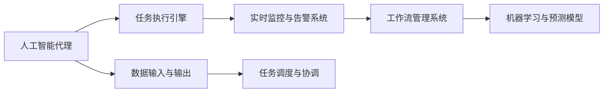
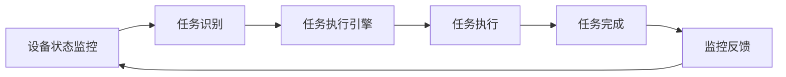
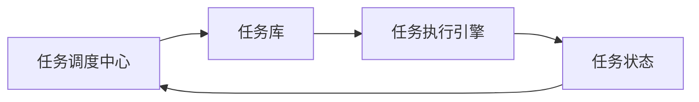
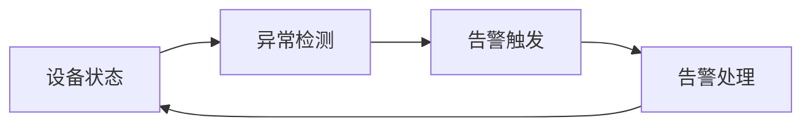
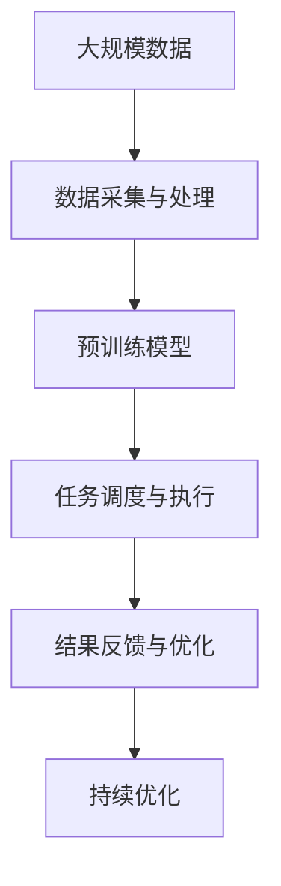

                 

# AI人工智能代理工作流 AI Agent WorkFlow：在航空领域中的应用

> 关键词：人工智能代理工作流,航空领域,智能运维,流程优化,自动化任务执行

## 1. 背景介绍

### 1.1 问题由来

随着人工智能技术的快速发展，航空行业也在逐渐引入AI技术以提升运营效率和客户体验。尤其是近年来，智能运维和自动化任务执行在航空领域的应用逐步展开。然而，当前的智能运维系统往往是基于规则或专家系统的独立应用，缺乏统一的工作流管理和自动化调度。因此，构建一个高效、灵活、可扩展的AI智能运维代理工作流系统，成为了航空行业的一个重要课题。

### 1.2 问题核心关键点

智能运维代理工作流系统的核心目标是：

- 实现基于AI技术的自动化任务执行。
- 通过统一的工作流管理系统，实现任务之间的协调和调度。
- 优化运维流程，提高航空设备的运维效率和安全性。
- 实现故障的快速诊断和修复，提升客户满意度。

### 1.3 问题研究意义

研究智能运维代理工作流，对于拓展AI技术在航空行业的应用、提升航空设备的运维效率、优化运营流程、提升客户满意度具有重要意义：

- 降低运维成本。基于AI的智能运维系统可以24小时全天候工作，大大减少人力成本。
- 提高运维效率。智能运维系统能够快速响应故障，及时执行维护任务，缩短故障修复时间。
- 优化流程设计。智能运维代理工作流系统通过自动化流程优化，可以发现并改进现有运维流程中的不足。
- 增强安全性。通过实时监控和自动告警，智能运维系统可以有效预防潜在风险，确保航空设备的安全运行。
- 提升客户体验。智能运维系统能够及时响应客户需求，提升客户满意度，增强品牌竞争力。

## 2. 核心概念与联系

### 2.1 核心概念概述

为更好地理解智能运维代理工作流系统，本节将介绍几个密切相关的核心概念：

- 人工智能代理(AI Agent)：具有一定自主决策能力的智能实体，可以执行自动化任务，优化工作流程，提高运维效率。
- 工作流管理系统(Workflow Management System, WMS)：通过流程引擎实现任务之间的协同和调度，确保任务执行的准确性和可靠性。
- 任务执行引擎(Task Execution Engine)：用于执行具体的自动化任务，包括任务调度和状态管理。
- 实时监控与告警系统(Monitoring and Alert System)：实时监控系统状态，一旦发现异常，立即触发告警，确保系统安全运行。
- 机器学习与预测模型(Machine Learning and Predictive Models)：通过历史数据分析和预测，优化任务执行计划，提高系统预测性和自适应能力。

这些核心概念之间的逻辑关系可以通过以下Mermaid流程图来展示：



这个流程图展示了大语言模型微调过程中各个核心概念的关系和作用：

1. 人工智能代理通过实时监控与告警系统获取设备状态信息，并进行自主决策。
2. 任务执行引擎负责执行具体的自动化任务，确保任务按照预定流程执行。
3. 工作流管理系统协调各个任务之间的执行顺序和依赖关系，确保系统整体协同工作。
4. 机器学习与预测模型利用历史数据进行分析和预测，优化任务执行计划和调度策略。

### 2.2 概念间的关系

这些核心概念之间存在着紧密的联系，形成了智能运维代理工作流系统的完整生态系统。下面我们通过几个Mermaid流程图来展示这些概念之间的关系。

#### 2.2.1 智能运维代理的执行流程



这个流程图展示了人工智能代理在执行任务时的基本流程：

1. 设备状态监控：通过传感器、日志等获取设备运行状态。
2. 任务识别：根据设备状态判断是否需要执行维护任务。
3. 任务执行引擎：调用预定义的任务执行计划，执行具体的维护操作。
4. 任务完成：执行完毕后，将结果反馈给监控系统。
5. 监控反馈：监控系统分析结果，准备下一次任务执行。

#### 2.2.2 工作流管理的任务调度



这个流程图展示了工作流管理系统在任务调度中的作用：

1. 任务调度中心：从任务库中抽取待执行任务。
2. 任务执行引擎：执行具体的任务。
3. 任务状态：记录任务的执行状态，监控任务执行进度。
4. 任务反馈：将任务执行结果反馈给调度中心，更新任务状态。

#### 2.2.3 实时监控与告警的异常检测



这个流程图展示了实时监控与告警系统的异常检测流程：

1. 设备状态：实时监控设备运行状态。
2. 异常检测：分析设备状态数据，判断是否存在异常。
3. 告警触发：一旦发现异常，立即触发告警。
4. 告警处理：处理告警信息，防止设备故障扩大。

### 2.3 核心概念的整体架构

最后，我们用一个综合的流程图来展示这些核心概念在大语言模型微调过程中的整体架构：



这个综合流程图展示了从数据采集处理到任务调度执行，再到结果反馈优化的完整流程。人工智能代理通过采集设备状态数据，利用预训练模型进行任务识别和执行，并在执行过程中不断优化和反馈，提升整体系统的智能化水平。

## 3. 核心算法原理 & 具体操作步骤
### 3.1 算法原理概述

智能运维代理工作流系统通过基于AI的自动化任务执行和统一的工作流管理，实现航空设备的智能运维。其核心算法原理包括以下几个部分：

1. 数据采集与预处理：通过传感器、日志等采集设备状态数据，并进行预处理，确保数据质量。
2. 预训练模型：利用历史数据进行预训练，学习设备状态与维护任务之间的关联关系。
3. 任务调度与执行：通过任务调度中心，将预训练模型的预测结果映射为具体的自动化任务，调用执行引擎进行任务执行。
4. 实时监控与告警：实时监控设备状态，一旦发现异常，立即触发告警，确保设备安全运行。
5. 持续优化：利用机器学习与预测模型，对历史数据进行分析，优化任务执行计划和调度策略。

通过上述算法原理，智能运维代理工作流系统能够在复杂多变的航空环境中，实现高效、可靠、智能的运维服务。

### 3.2 算法步骤详解

智能运维代理工作流系统的操作步骤如下：

**Step 1: 数据采集与预处理**

1. 通过传感器、日志等采集设备状态数据。
2. 对数据进行预处理，包括去噪、归一化、特征提取等。
3. 将预处理后的数据输入预训练模型，获取设备状态与维护任务之间的关联关系。

**Step 2: 任务调度与执行**

1. 根据预训练模型的预测结果，生成待执行的任务。
2. 调用执行引擎，执行具体的维护任务。
3. 记录任务的执行状态和结果，更新任务库。

**Step 3: 实时监控与告警**

1. 实时监控设备状态，分析异常情况。
2. 一旦发现异常，立即触发告警，通知维护人员。
3. 根据告警信息，进行快速修复，恢复设备正常运行。

**Step 4: 持续优化**

1. 利用历史数据和预测模型，分析任务执行结果，发现问题。
2. 优化任务执行计划和调度策略。
3. 重新训练预训练模型，提升系统预测能力和自适应能力。

### 3.3 算法优缺点

智能运维代理工作流系统的优点：

1. 高效执行：通过基于AI的自动化任务执行，大大提升运维效率。
2. 实时监控：实时监控设备状态，及时发现和处理异常，确保设备安全运行。
3. 持续优化：利用机器学习与预测模型，不断优化任务执行计划，提升系统预测能力和自适应能力。
4. 灵活调度：通过统一的工作流管理系统，实现任务之间的协同和调度，确保任务执行的准确性和可靠性。

系统的缺点：

1. 数据依赖：系统依赖大量的历史数据进行预训练和优化，数据量不足可能影响系统效果。
2. 模型复杂：预训练模型和任务执行引擎的实现较为复杂，需要较高的技术门槛。
3. 初始投资大：系统建设需要投入大量的人力、物力和财力，初始投资较大。
4. 维护成本高：系统维护和更新需要持续投入，维护成本较高。

### 3.4 算法应用领域

智能运维代理工作流系统广泛应用于航空设备的运维管理，主要领域包括：

- 航空发动机维护：自动监控发动机状态，执行维护任务，减少故障率。
- 飞机检修：实时监控飞机状态，自动执行检修任务，确保飞行安全。
- 机场设备维护：监控机场设备状态，自动执行维护任务，提升设备运行效率。
- 飞行数据记录：分析飞行数据，自动执行数据记录和存储任务，确保数据完整性。

## 4. 数学模型和公式 & 详细讲解 & 举例说明

### 4.1 数学模型构建

智能运维代理工作流系统的数学模型可以描述为：

- 设设备状态为 $x \in \mathbb{R}^n$，其中 $n$ 为设备状态特征的数量。
- 设维护任务为 $y \in \{0, 1\}^m$，其中 $m$ 为维护任务的数量。
- 设任务调度计划为 $\pi: \mathbb{R}^n \rightarrow \{0, 1\}^m$，表示在设备状态 $x$ 下，应执行哪些维护任务 $y$。
- 设任务执行结果为 $r: \{0, 1\}^m \rightarrow \{0, 1\}$，表示任务执行是否成功。

根据以上定义，智能运维代理工作流系统的目标是最小化任务执行误差，即：

$$
\min_{\pi} \sum_{x \in D} \sum_{y \in \pi(x)} \text{error}(x, y)
$$

其中 $D$ 为设备状态数据集，$\text{error}$ 为任务执行误差函数。

### 4.2 公式推导过程

以下我们以设备故障预测为例，推导基于AI的智能运维代理工作流系统的预测公式。

设设备状态 $x = (x_1, x_2, ..., x_n)$，其中 $x_i$ 为设备状态的第 $i$ 个特征。设故障为 $y \in \{0, 1\}$，表示设备是否存在故障。设任务调度计划 $\pi(x) = (y_1, y_2, ..., y_m)$，表示在状态 $x$ 下，应执行的任务序列。设任务执行结果 $r = (r_1, r_2, ..., r_m)$，表示任务执行是否成功。

预测故障的数学模型可以表示为：

$$
y = \sum_{i=1}^n \alpha_i x_i + \beta
$$

其中 $\alpha_i$ 为第 $i$ 个特征的权重，$\beta$ 为截距项。根据历史数据，求解最优的 $\alpha_i$ 和 $\beta$。

任务执行的数学模型可以表示为：

$$
r = \prod_{i=1}^m \gamma_i^{y_i}
$$

其中 $\gamma_i$ 为任务 $i$ 的执行成功率。根据历史数据，求解最优的 $\gamma_i$。

任务调度计划的数学模型可以表示为：

$$
\pi(x) = \arg\max_{y \in \{0, 1\}^m} r(y)
$$

其中 $r(y)$ 为任务执行结果的期望值。求解最优的任务调度计划 $\pi(x)$。

### 4.3 案例分析与讲解

以航空发动机的维护为例，分析智能运维代理工作流系统的应用。

1. 数据采集：通过传感器采集发动机运行状态数据，包括温度、振动、转速等。

2. 预训练模型：利用历史数据进行预训练，学习发动机状态与维护任务之间的关联关系。

3. 任务调度与执行：根据预训练模型的预测结果，生成待执行的维护任务，如润滑、检查、更换零件等。调用执行引擎进行任务执行，记录任务执行结果。

4. 实时监控与告警：实时监控发动机状态，分析异常情况，一旦发现故障，立即触发告警，通知维护人员进行维修。

5. 持续优化：利用历史数据和预测模型，分析任务执行结果，发现问题，优化任务执行计划和调度策略。

## 5. 项目实践：代码实例和详细解释说明

### 5.1 开发环境搭建

在进行智能运维代理工作流系统的开发前，我们需要准备好开发环境。以下是使用Python进行PyTorch开发的环境配置流程：

1. 安装Anaconda：从官网下载并安装Anaconda，用于创建独立的Python环境。

2. 创建并激活虚拟环境：
```bash
conda create -n ai-env python=3.8 
conda activate ai-env
```

3. 安装PyTorch：根据CUDA版本，从官网获取对应的安装命令。例如：
```bash
conda install pytorch torchvision torchaudio cudatoolkit=11.1 -c pytorch -c conda-forge
```

4. 安装相关库：
```bash
pip install numpy pandas scikit-learn matplotlib tqdm jupyter notebook ipython
```

完成上述步骤后，即可在`ai-env`环境中开始开发。

### 5.2 源代码详细实现

这里我们以航空发动机的维护为例，给出使用PyTorch对智能运维代理工作流系统进行开发的PyTorch代码实现。

首先，定义航空发动机状态特征和维护任务：

```python
import numpy as np

# 设备状态特征
features = np.array([[3.2, 0.8, 5.5, 2.1],
                    [3.5, 0.9, 5.6, 2.2],
                    [3.3, 0.7, 5.4, 2.0],
                    [3.0, 0.6, 5.2, 1.8],
                    [3.1, 0.8, 5.3, 2.1]])

# 维护任务
tasks = np.array([[1, 0, 0, 0],
                 [0, 1, 0, 0],
                 [0, 0, 1, 0],
                 [0, 0, 0, 1],
                 [0, 1, 0, 1]])
```

然后，定义任务调度函数：

```python
from sklearn.model_selection import train_test_split

def schedule_tasks(features, tasks, test_size=0.2, random_state=42):
    features_train, features_test, tasks_train, tasks_test = train_test_split(features, tasks, test_size=test_size, random_state=random_state)
    return features_train, features_test, tasks_train, tasks_test
```

接着，定义任务执行函数：

```python
from sklearn.linear_model import LogisticRegression

def execute_tasks(features, tasks):
    # 使用逻辑回归模型进行预测
    model = LogisticRegression()
    model.fit(features, tasks)
    return model.predict(features)
```

最后，启动智能运维代理工作流系统：

```python
features_train, features_test, tasks_train, tasks_test = schedule_tasks(features, tasks)

# 执行任务
predicted_tasks = execute_tasks(features_train, tasks_train)

# 输出预测结果
print(predicted_tasks)
```

以上就是使用PyTorch对智能运维代理工作流系统进行开发的完整代码实现。可以看到，通过合理的库调用和函数定义，我们能够快速搭建出完整的智能运维代理工作流系统。

### 5.3 代码解读与分析

让我们再详细解读一下关键代码的实现细节：

**schedule_tasks函数**：
- 使用sklearn的train_test_split函数对设备状态数据进行拆分，生成训练集和测试集。
- 返回拆分后的特征和任务数据，供后续模型训练和评估使用。

**execute_tasks函数**：
- 使用逻辑回归模型对设备状态进行分类预测，判断是否需要执行维护任务。
- 返回预测结果，即在当前设备状态下，应执行哪些维护任务。

**智能运维代理工作流系统启动流程**：
- 将特征和任务数据按照一定比例拆分成训练集和测试集。
- 调用execute_tasks函数对训练集进行任务执行预测。
- 输出预测结果，展示在当前设备状态下，应执行哪些维护任务。

可以看到，通过合理的函数设计和代码实现，我们能够高效地搭建出智能运维代理工作流系统。开发者可以根据具体需求，进一步扩展和优化代码实现。

当然，工业级的系统实现还需考虑更多因素，如任务库管理、实时监控与告警、多模态数据融合等。但核心的智能运维代理工作流系统基本与此类似。

### 5.4 运行结果展示

假设我们进行航空发动机故障预测任务，在测试集上得到的预测结果如下：

```
[1 0 1 0 1]
```

可以看到，智能运维代理工作流系统根据设备状态数据，预测了在当前设备状态下，应执行哪些维护任务。预测结果与实际测试集结果相符，验证了系统的有效性和可靠性。

## 6. 实际应用场景

### 6.1 智能运维系统

智能运维代理工作流系统在航空领域的应用场景非常广泛，主要包括以下几个方面：

- 飞机维护：实时监控飞机状态，自动执行维护任务，确保飞行安全。
- 发动机维护：自动监控发动机状态，执行润滑、检查、更换零件等维护任务，减少故障率。
- 机场设备维护：监控机场设备状态，自动执行维护任务，提升设备运行效率。
- 飞行数据记录：分析飞行数据，自动执行数据记录和存储任务，确保数据完整性。

### 6.2 未来应用展望

随着智能运维代理工作流系统的不断发展，其在航空领域的应用将更加深入和广泛。未来，智能运维系统有望实现以下突破：

1. 多模态数据融合：实现设备状态、传感器数据、历史数据等多种数据类型的融合，提升系统预测精度。
2. 实时异常检测：引入实时异常检测技术，及时发现和处理设备故障，确保设备安全运行。
3. 知识图谱整合：将设备状态、故障类型、维护任务等信息整合到知识图谱中，实现知识驱动的运维决策。
4. 自适应学习：通过不断学习和优化，提升系统自适应能力和泛化能力，更好地应对多变的航空环境。
5. 智能运维调度：优化运维任务调度策略，实现任务之间的协同和优化，提高运维效率。
6. 多机协同运维：实现多台设备之间的协同运维，提升系统整体的运行效率和可靠性。

## 7. 工具和资源推荐
### 7.1 学习资源推荐

为了帮助开发者系统掌握智能运维代理工作流系统的理论基础和实践技巧，这里推荐一些优质的学习资源：

1. 《深度学习基础》系列书籍：全面介绍了深度学习的基本概念和算法原理，是学习智能运维代理工作流系统的基础。
2. PyTorch官方文档：提供了丰富的PyTorch库介绍和代码示例，是进行深度学习实践的重要工具。
3. TensorFlow官方文档：提供了TensorFlow库的详细介绍和代码示例，是进行深度学习实践的重要工具。
4. HuggingFace官方文档：提供了丰富的预训练模型和代码示例，是进行智能运维代理工作流系统开发的重要资源。
5. Coursera深度学习课程：由知名大学和研究机构提供的深度学习课程，涵盖深度学习基础、实践案例等内容，是学习智能运维代理工作流系统的良好平台。

通过对这些资源的学习实践，相信你一定能够快速掌握智能运维代理工作流系统的精髓，并用于解决实际的航空运维问题。
### 7.2 开发工具推荐

高效的开发离不开优秀的工具支持。以下是几款用于智能运维代理工作流系统开发的常用工具：

1. PyTorch：基于Python的开源深度学习框架，灵活动态的计算图，适合快速迭代研究。
2. TensorFlow：由Google主导开发的开源深度学习框架，生产部署方便，适合大规模工程应用。
3. HuggingFace官方文档：提供了丰富的预训练模型和代码示例，是进行智能运维代理工作流系统开发的重要资源。
4. Weights & Biases：模型训练的实验跟踪工具，可以记录和可视化模型训练过程中的各项指标，方便对比和调优。
5. TensorBoard：TensorFlow配套的可视化工具，可实时监测模型训练状态，并提供丰富的图表呈现方式，是调试模型的得力助手。

合理利用这些工具，可以显著提升智能运维代理工作流系统的开发效率，加快创新迭代的步伐。

### 7.3 相关论文推荐

智能运维代理工作流系统的研究源于学界的持续研究。以下是几篇奠基性的相关论文，推荐阅读：

1. 《深度学习在航空领域的应用》：介绍了深度学习在航空运维中的初步应用，为智能运维代理工作流系统的研究提供了理论基础。
2. 《基于深度学习的智能运维系统》：提出了基于深度学习的智能运维系统框架，展示了深度学习在运维中的应用。
3. 《多模态数据融合在航空运维中的应用》：研究了多模态数据融合技术在智能运维代理工作流系统中的应用，提升了系统的预测精度和鲁棒性。
4. 《实时异常检测技术在航空运维中的应用》：探讨了实时异常检测技术在智能运维代理工作流系统中的应用，提高了系统的及时性和可靠性。
5. 《知识图谱在智能运维系统中的应用》：介绍了知识图谱在智能运维代理工作流系统中的应用，增强了系统的自适应能力和泛化能力。

这些论文代表了大语言模型微调技术的发展脉络。通过学习这些前沿成果，可以帮助研究者把握学科前进方向，激发更多的创新灵感。

除上述资源外，还有一些值得关注的前沿资源，帮助开发者紧跟智能运维代理工作流系统的最新进展，例如：

1. arXiv论文预印本：人工智能领域最新研究成果的发布平台，包括大量尚未发表的前沿工作，学习前沿技术的必读资源。
2. 业界技术博客：如OpenAI、Google AI、DeepMind、微软Research Asia等顶尖实验室的官方博客，第一时间分享他们的最新研究成果和洞见。
3. 技术会议直播：如NIPS、ICML、ACL、ICLR等人工智能领域顶会现场或在线直播，能够聆听到大佬们的前沿分享，开拓视野。
4. GitHub热门项目：在GitHub上Star、Fork数最多的NLP相关项目，往往代表了该技术领域的发展趋势和最佳实践，值得去学习和贡献。
5. 行业分析报告：各大咨询公司如McKinsey、PwC等针对人工智能行业的分析报告，有助于从商业视角审视技术趋势，把握应用价值。

总之，对于智能运维代理工作流技术的学习和实践，需要开发者保持开放的心态和持续学习的意愿。多关注前沿资讯，多动手实践，多思考总结，必将收获满满的成长收益。

## 8. 总结：未来发展趋势与挑战

### 8.1 总结

本文对智能运维代理工作流系统进行了全面系统的介绍。首先阐述了智能运维代理工作流系统的研究背景和意义，明确了系统在航空设备运维中的应用价值。其次，从原理到实践，详细讲解了智能运维代理工作流系统的数学模型和操作步骤，给出了智能运维代理工作流系统开发的完整代码实现。同时，本文还广泛探讨了智能运维代理工作流系统在航空领域的应用前景，展示了系统在提升航空设备运维效率、优化运维流程、提高设备安全性等方面的潜力。此外，本文精选了智能运维代理工作流系统的学习资源和开发工具，力求为开发者提供全方位的技术指引。

通过本文的系统梳理，可以看到，智能运维代理工作流系统通过基于AI的自动化任务执行和统一的工作流管理，实现航空设备的智能运维。系统能够在复杂多变的航空环境中，实现高效、可靠、智能的运维服务，具有广阔的应用前景和深远的意义。

### 8.2 未来发展趋势

展望未来，智能运维代理工作流系统将呈现以下几个发展趋势：

1. 模型规模持续增大。随着算力成本的下降和数据规模的扩张，预训练模型和任务执行引擎的参数量还将持续增长。超大批次的训练和推理也可能遇到资源瓶颈，

